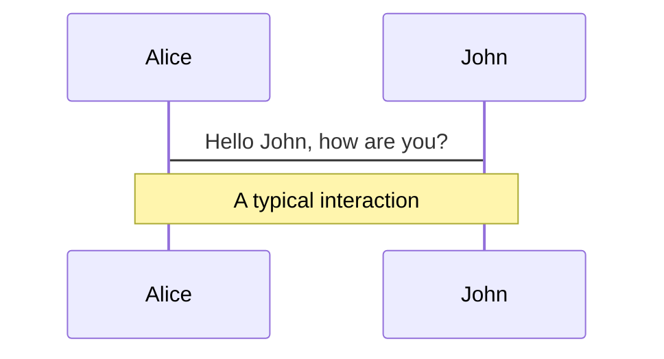
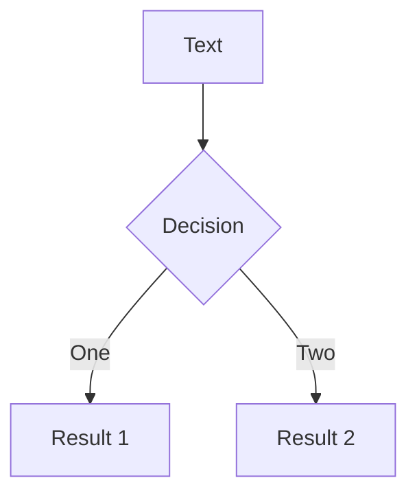

# The Complete Slidev Guide

> **Everything you need to know about using Slidev to create stunning presentations**

## Table of Contents

- [Introduction](#introduction)
- [Why Slidev?](#why-slidev)
- [Getting Started](#getting-started)
- [Markdown Syntax](#markdown-syntax)
- [Layouts](#layouts)
- [Built-in Components](#built-in-components)
- [Animations](#animations)
- [Navigation](#navigation)
- [Presenter Mode](#presenter-mode)
- [Drawing & Annotations](#drawing--annotations)
- [Recording](#recording)
- [Exporting](#exporting)
- [Hosting](#hosting)
- [Themes](#themes)
- [Customization](#customization)
- [Configuration](#configuration)
- [Advanced Features](#advanced-features)
- [Editor Support](#editor-support)
- [FAQ](#faq)
- [Addons](#addons)

---

## Introduction

**Slidev** (slide + dev, **/slaɪdɪv/**) is a web-based slides maker and presenter designed for developers. It allows you to focus on writing content in Markdown while also having the power of HTML and Vue components to deliver pixel-perfect layouts and designs with embedded interactive demos in your presentations.

### Features

- 📝 **Markdown-based** - use your favorite editors and workflow
- 🧑‍💻 **Developer Friendly** - built-in syntax highlighting, live coding, etc.
- 🎨 **Themable** - themes can be shared and used with npm packages
- 🌈 **Stylish** - on-demand utilities via UnoCSS
- 🤹 **Interactive** - embedding Vue components seamlessly
- 🎙 **Presenter Mode** - use another window, or even your phone to control your slides
- 🎨 **Drawing** - draw and annotate on your slides
- 🧮 **LaTeX** - built-in LaTeX math equations support
- 📰 **Diagrams** - creates diagrams with textual descriptions
- 🌟 **Icons** - access to icons from any iconset directly
- 💻 **Editors** - integrated editor, or extension for VS Code
- 🎥 **Recording** - built-in recording and camera view
- 📤 **Portable** - export into PDF, PNGs, or even a hostable SPA
- ⚡️ **Fast** - instant reloading powered by Vite
- 🛠 **Hackable** - using Vite plugins, Vue components, or any npm packages

### Tech Stack

Slidev is powered by:

- [Vite](https://vitejs.dev) - An extremely fast frontend tooling
- [Vue 3](https://v3.vuejs.org/) - The progressive JavaScript framework
- [UnoCSS](https://github.com/unocss/unocss) - On-demand utility-first CSS framework
- [Shiki](https://github.com/shikijs/shiki) / [Monaco Editor](https://github.com/Microsoft/monaco-editor) - Code syntax highlighting with live coding capability
- [RecordRTC](https://recordrtc.org) - Built-in recording and camera view
- [VueUse](https://vueuse.org) - Vue composition utilities
- [Iconify](https://iconify.design/) - Icon sets collection
- [Drauu](https://github.com/antfu/drauu) - Drawing and annotations support
- [KaTeX](https://katex.org/) - LaTeX math rendering
- [Mermaid](https://mermaid-js.github.io/mermaid) - Textual diagrams

---

## Why Slidev?

There are many feature-rich, general-purpose, WYSIWYG slides makers like Microsoft PowerPoint and Apple Keynote. They work well for making nice slides with animations and charts, but when working with WYSIWYG editors, it's easy to get distracted by styling options.

Slidev remedies that by separating content and visuals. This allows you to:

- **Focus on content** - Write in Markdown without styling distractions
- **Reuse themes** - Apply community themes with one line of config
- **Developer-friendly** - First-class code snippet support with syntax highlighting
- **Fast** - Instant reloading with Vite
- **Interactive** - Embed Vue components for live demos
- **Portable** - Export to PDF, PPTX, PNGs, or SPA
- **Hackable** - Extend with web technologies

---

## Getting Started

### Requirements

- **Node.js >=18.0**

### Try Online

Start Slidev right in your browser: [sli.dev/new](https://sli.dev/new)

### Create Locally

Using npm:
```bash
npm init slidev@latest
```

Using yarn:
```bash
yarn create slidev
```

Using pnpm:
```bash
pnpm create slidev
```

Follow the prompts and it will open the slideshow at `http://localhost:3030/` automatically.

### Manual Installation

If you prefer to install Slidev manually:

```bash
npm install @slidev/cli @slidev/theme-default
touch slides.md
npx slidev
```

### Install Globally

```bash
npm i -g @slidev/cli
```

Then use `slidev` everywhere without creating a project every time.

### Docker Installation

If you need to run presentations in containers:

```bash
docker run --name slidev --rm -it \
    --user node \
    -v ${PWD}:/slidev \
    -p 3030:3030 \
    -e NPM_MIRROR="https://registry.npmmirror.com" \
    tangramor/slidev:latest
```

### Command Line Interface

In a project where Slidev is installed:

```json
{
  "scripts": {
    "dev": "slidev",
    "build": "slidev build",
    "export": "slidev export"
  }
}
```

#### `slidev [entry]`

Start a local server for Slidev.

**Options:**
- `--port`, `-p` (number, default: `3030`) - port number
- `--open`, `-o` (boolean, default: `false`) - open in browser
- `--remote [password]` (string) - listen to public host and enable remote control
- `--bind` (string, default: `0.0.0.0`) - specify IP addresses to listen on
- `--log` (string, default: `'warn'`) - log level
- `--force`, `-f` (boolean, default: `false`) - force optimizer to ignore cache
- `--theme`, `-t` (string) - override theme

#### `slidev build [entry]`

Build a hostable SPA.

**Options:**
- `--out`, `-o` (string, default: `dist`) - output directory
- `--base` (string, default: `/`) - base URL
- `--download` (boolean, default: `false`) - allow PDF download in SPA
- `--theme`, `-t` (string) - override theme

#### `slidev export [entry]`

Export slides to PDF (or other formats).

**Options:**
- `--output` (string) - path to output
- `--format` (string: `'pdf'`, `'png'`, `'pptx'`, `'md'`, default: `'pdf'`) - output format
- `--timeout` (number, default: `30000`) - timeout for rendering
- `--range` (string) - page ranges to export (e.g., `'1,4-5,6'`)
- `--dark` (boolean, default: `false`) - export as dark theme
- `--with-clicks`, `-c` (boolean, default: `false`) - export pages for every click
- `--theme`, `-t` (string) - override theme

#### `slidev format [entry]`

Format the markdown file.

#### `slidev theme [subcommand]`

Theme-related operations.

**Subcommands:**
- `eject [entry]` - Eject current theme into local file system

---

## Markdown Syntax

Slides are written within a single markdown file (by default `./slides.md`). You can use standard Markdown features with additional support for inlined HTML and Vue Components. Use `---` padded with a new line to separate slides.

### Basic Example

````md
# Slidev

Hello, World!

---

# Page 2

Directly use code blocks for highlighting

```ts
console.log('Hello, World!')
```

---

# Page 3

You can use UnoCSS and Vue components to style and enrich your slides.

<div class="p-3">
  <Tweet id="20" />
</div>
````

### Frontmatter & Layouts

Specify layouts and metadata for each slide using frontmatter blocks:

```md
---
layout: cover
---

# Slidev

This is the cover page.

---
layout: center
background: /background-1.png
class: 'text-white'
---

# Page 2

This is a page with the layout `center` and a background image.

---

# Page 3

This is a default page without any additional metadata.
```

### Prettier Support

You can use a direct `yaml` code block to define frontmatter:

````md
---
layout: cover
---

# Slidev

This is the cover page.

---

```yaml
layout: center
background: /background-1.png
class: 'text-white'
```

# Page 2

This is a page with the layout `center` and a background image.
````

### Code Blocks

Slidev uses Shiki for syntax highlighting:

````md
```ts
console.log('Hello, World!')
```
````

#### Line Highlighting

Highlight specific lines by adding line numbers within brackets:

````md
```ts {2,3}
function add(
  a: Ref<number> | number,
  b: Ref<number> | number
) {
  return computed(() => unref(a) + unref(b))
}
```
````

To change highlighting with multiple clicks, use `|`:

````md
```ts {2-3|5|all}
function add(
  a: Ref<number> | number,
  b: Ref<number> | number
) {
  return computed(() => unref(a) + unref(b))
}
```
````

#### Line Numbers

Enable line numbering globally or per code block:

````md
```ts {6,7}{lines:true,startLine:5}
function add(
  a: Ref<number> | number,
  b: Ref<number> | number
) {
  return computed(() => unref(a) + unref(b))
}
```
````

#### Max Height

Set fixed height and enable scrolling:

````md
```ts {2|3|7|12}{maxHeight:'100px'}
function add(
  a: Ref<number> | number,
  b: Ref<number> | number
) {
  return computed(() => unref(a) + unref(b))
}
/// ...as many lines as you want
const c = add(1, 2)
```
````

#### TwoSlash Integration

Add TypeScript type information on hover:

````md
```ts twoslash
import { ref } from 'vue'

const count = ref(0)
//            ^?
```
````

#### Shiki Magic Move

Create smooth transitions between code changes:

`````md
````md magic-move
```js
console.log(`Step ${1}`)
```
```js
console.log(`Step ${1 + 1}`)
```
```ts
console.log(`Step ${3}` as string)
```
````
`````

#### Monaco Editor

Turn code blocks into a fully-featured Monaco editor:

````md
```ts {monaco}
console.log('HelloWorld')
```
````

#### Monaco Diff

Create a diff editor:

````md
```ts {monaco-diff}
This line is removed on the right.
just some text
abcd
efgh
Some more text
~~~
just some text
abcz
zzzzefgh
Some more text.
This line is removed on the left.
```
````

#### Monaco Run

Execute code and show results:

````md
```ts {monaco-run}
console.log('Click the play button to run me')
```
````

#### Writable Monaco Editor

Link Monaco Editor with a file on your filesystem:

```md
<<< ./some-file.ts {monaco-write}
```

### Embedded Styles

Use `<style>` tag to override styles for the current slide:

```md
# This is Red

<style>
h1 {
  color: red
}
</style>

---

# Next slide is not affected
```

With UnoCSS, you can use nested CSS and directives:

```md
# Slidev

> Hello `world`

<style>
blockquote {
  code {
    --uno: text-teal-500 dark:text-teal-400;
  }
}
</style>
```

### Static Assets

#### Remote Assets

```md

```

#### Local Assets

Put assets in the `public` folder and reference with leading slash:

```md

```

Custom sizes with `` tag:

```html

```

### Notes

Create presenter notes for each slide. The last comment block will be treated as a note:

```md
---
layout: cover
---

# Page 1

This is the cover page.

<!-- This is a note -->

---

# Page 2

<!-- This is NOT a note because it precedes the content -->

The second page

<!--
This is another note
-->
```

#### Click Markers

Highlight and auto-scroll notes sections:

```md
<!--
Content before the first click

[click] This will be highlighted after the first click

Also highlighted after the first click

- [click] This list element will be highlighted after the second click

[click:3] Last click (skip two clicks)
-->
```

### Icons

Access virtually all open-source icon sets directly:

```md
<mdi-account-circle /> - Material Design Icons
<carbon-badge /> - Carbon
<uim-rocket /> - Unicons Monochrome
<twemoji-cat-with-tears-of-joy /> - Twemoji
<logos-vue /> - SVG Logos
```

Style icons like HTML elements:

```html
<uim-rocket />
<uim-rocket class="text-3xl text-red-400 mx-2" />
<uim-rocket class="text-3xl text-orange-400 animate-ping" />
```

Browse icons at [Icônes](https://icones.js.org/).

### Slots

Some layouts provide multiple contributing points using Vue's named slots:

```md
---
layout: two-cols
---

<template v-slot:default>

# Left

This shows on the left

</template>
<template v-slot:right>

# Right

This shows on the right

</template>
```

Shorthand syntax:

```md
---
layout: two-cols
---

# Left

This shows on the left

::right::

# Right

This shows on the right
```

### Import Code Snippets

Import code from existing files:

```md
<<< @/snippets/snippet.js
```

### LaTeX

Slidev has built-in LaTeX support powered by KaTeX.

#### Inline

```md
$\sqrt{3x-1}+(1+x)^2$
```

#### Block

```latex
$$
\begin{array}{c}

\nabla \times \vec{\mathbf{B}} -\, \frac1c\, \frac{\partial\vec{\mathbf{E}}}{\partial t} &
= \frac{4\pi}{c}\vec{\mathbf{j}}    \nabla \cdot \vec{\mathbf{E}} & = 4 \pi \rho \\

\nabla \times \vec{\mathbf{E}}\, +\, \frac1c\, \frac{\partial\vec{\mathbf{B}}}{\partial t} & = \vec{\mathbf{0}} \\

\nabla \cdot \vec{\mathbf{B}} & = 0

\end{array}
$$
```

#### LaTeX Line Highlighting

```latex
$$ {1|3|all}
\begin{array}{c}
\nabla \times \vec{\mathbf{B}} -\, \frac1c\, \frac{\partial\vec{\mathbf{E}}}{\partial t} &
= \frac{4\pi}{c}\vec{\mathbf{j}}    \nabla \cdot \vec{\mathbf{E}} & = 4 \pi \rho \\
\nabla \times \vec{\mathbf{E}}\, +\, \frac1c\, \frac{\partial\vec{\mathbf{B}}}{\partial t} & = \vec{\mathbf{0}} \\
\nabla \cdot \vec{\mathbf{B}} & = 0
\end{array}
$$
```

### Diagrams

Create diagrams with Mermaid:

````md

````

With options:

````md

````

### Multiple Entries

Split your slides into multiple files:

**slides.md:**
```md
# Page 1

This is a normal page

---
src: ./subpage2.md
---

<!-- this page will be loaded from './subpage2.md' -->
Inline content will be ignored
```

**subpage2.md:**
```md
# Page 2

This page is from another file
```

#### Frontmatter Merging

Main entry frontmatter has higher priority:

**slides.md:**
```md
---
src: ./cover.md
background: https://sli.dev/bar.png
class: text-center
---
```

**cover.md:**
```md
---
layout: cover
background: https://sli.dev/foo.png
---

# Cover

Cover Page
```

Results in:
```md
---
layout: cover
background: https://sli.dev/bar.png
class: text-center
---

# Cover

Cover Page
```

### MDC Syntax

Enable MDC (Markdown Components) Syntax:

```mdc
---
mdc: true
---

This is a [red text]{style="color:red"} :inline-component{prop="value"}

{width=500px lazy}

::block-component{prop="value"}
The **default** slot
::
```

---

## Layouts

### Built-in Layouts

#### `center`
Displays content in the middle of the screen.

#### `cover`
Used for the cover page of presentations.

#### `default`
The most basic layout for any content.

#### `end`
The final page for presentations.

#### `fact`
Show facts or data with prominence.

#### `full`
Use all screen space for content.

#### `image-left`
Shows an image on the left, content on the right.

```yaml
---
layout: image-left
image: /path/to/the/image
class: my-cool-content-on-the-right
---
```

#### `image-right`
Shows an image on the right, content on the left.

```yaml
---
layout: image-right
image: /path/to/the/image
class: my-cool-content-on-the-left
---
```

#### `image`
Shows an image as main content.

```yaml
---
layout: image
image: /path/to/the/image
backgroundSize: contain
---
```

#### `iframe-left`
Shows a web page on the left.

```yaml
---
layout: iframe-left
url: https://github.com/slidevjs/slidev
class: my-cool-content-on-the-right
---
```

#### `iframe-right`
Shows a web page on the right.

```yaml
---
layout: iframe-right
url: https://github.com/slidevjs/slidev
class: my-cool-content-on-the-left
---
```

#### `iframe`
Shows a web page as main content.

```yaml
---
layout: iframe
url: https://github.com/slidevjs/slidev
---
```

#### `intro`
Introduces the presentation with title, description, author, etc.

#### `none`
A layout without any styling.

#### `quote`
Display a quotation with prominence.

#### `section`
Mark the beginning of a new section.

#### `statement`
Make an affirmation/statement as main content.

#### `two-cols`
Separates content into two columns.

```md
---
layout: two-cols
---

# Left

This shows on the left

::right::

# Right

This shows on the right
```

#### `two-cols-header`
Header spanning both columns, then two columns below.

```md
---
layout: two-cols-header
---

This spans both

::left::

# Left

This shows on the left

::right::

# Right

This shows on the right
```

### Custom Layouts

Create custom layouts in `layouts/` directory:

```
your-slidev/
  └── layouts/
      ├── cover.vue
      └── my-cool-theme.vue
```

Reference in YAML:

```yaml
---
layout: my-cool-theme
---
```

Layout component example:

```html
<!-- default.vue -->
<template>
  <div class="slidev-layout default">
    <slot />
  </div>
</template>
```

---

## Built-in Components

### `Arrow`

Draw an arrow.

```md
<Arrow x1="10" y1="20" x2="100" y2="200" />
```

**Props:**
- `x1`, `y1` - start point position
- `x2`, `y2` - end point position
- `width` (default: `2`) - line width
- `color` (default: `'currentColor'`) - line color
- `two-way` (default: `false`) - draw two-way arrow

### `VDragArrow`

A draggable arrow component.

```md
<v-drag-arrow />
```

### `AutoFitText`

Box where font size automatically adapts to content.

```md
<AutoFitText :max="200" :min="100" modelValue="Some text"/>
```

### `LightOrDark`

Display different content for light/dark themes.

```md
<LightOrDark>
  <template #dark>Dark mode is on</template>
  <template #light>Light mode is on</template>
</LightOrDark>
```

### `Link`

Navigate to a specific slide.

```md
<Link to="42">Go to slide 42</Link>
<Link to="solutions" title="Go to solutions"/>
```

### `PoweredBySlidev`

Renders "Powered by Slidev" with link.

### `RenderWhen`

Render slot only when context matches.

```md
<RenderWhen context="presenter">
  This will only be rendered in presenter view.
</RenderWhen>
```

### `SlideCurrentNo`

Current slide number.

```md
<SlideCurrentNo />
```

### `SlidesTotal`

Total number of slides.

```md
<SlidesTotal />
```

### `Titles`

Insert the main title from a slide.

```js
import Titles from '/@slidev/titles.md'
```

```md
<Titles no="42" />
```

### `Toc`

Insert a Table of Contents.

```md
<Toc />
```

**Props:**
- `columns` (default: `1`) - number of columns
- `listClass` (default: `''`) - classes for the list
- `maxDepth` (default: `Infinity`) - maximum depth level
- `minDepth` (default: `1`) - minimum depth level
- `mode` (default: `'all'`) - display mode (`'all'`, `'onlyCurrentTree'`, `'onlySiblings'`)

Hide slides from TOC:

```yaml
---
hideInToc: true
---
```

### `Transform`

Apply scaling or transforming.

```md
<Transform :scale="0.5">
  <YourElements />
</Transform>
```

### `Tweet`

Embed a tweet.

```md
<Tweet id="20" />
```

### `VAfter`, `VClick`, `VClicks`

See [Animations](#animations) section.

### `VSwitch`

Switch between multiple slots based on clicks.

**Props:**
- `unmount` (default: `false`) - unmount previous slot when switching
- `tag` (default: `'div'`) - wrapper tag
- `childTag` (default: `'div'`) - child tag
- `transition` (default: `false`) - transition effect

### `VDrag`

Create draggable elements. See [Draggable Elements](#draggable-elements) section.

### `SlidevVideo`

Embed a video with autoplay controls.

```md
<SlidevVideo v-click autoplay controls>
  <source src="/myMovie.mp4" type="video/mp4" />
  <source src="/myMovie.webm" type="video/webm" />
</SlidevVideo>
```

**Props:**
- `controls` (default: `false`) - show controls
- `autoplay` (default: `false`) - auto start video
- `autoreset` - reset video on slide/click change
- `poster` - poster image
- `timestamp` (default: `0`) - starting time in seconds

### `Youtube`

Embed a YouTube video.

```md
<Youtube id="luoMHjh-XcQ" />
```

**Props:**
- `id` (required) - YouTube video ID
- `width` - video width
- `height` - video height

### Custom Components

Create custom components in `components/` directory:

```
your-slidev/
  └── components/
      ├── MyComponent.vue
      └── HelloWorld.ts
```

Use directly in slides:

```md
# My Slide

<MyComponent :count="4"/>

<hello-world foo="bar">
  Slot
</hello-world>
```

---

## Animations

### Click Animations

#### `v-click`

Apply click animations to elements:

```md
<!-- Component usage -->
<v-click> Hello **World** </v-click>

<!-- Directive usage -->
<div v-click class="text-xl"> Hey! </div>
```

#### `v-after`

Turn element visible when previous `v-click` is triggered:

```md
<div v-click> Hello </div>
<div v-after> World </div>
```

#### Hide After Clicking

```md
<div v-click> Visible after 1 click </div>
<div v-click.hide> Hidden after 2 click </div>
<div v-after.hide> Hidden after 2 click </div>
```

#### `v-clicks`

Apply `v-click` to all child elements:

```md
<v-clicks>

- Item 1
- Item 2
- Item 3

</v-clicks>
```

With depth for nested lists:

```md
<v-clicks depth="2">

- Item 1
  - Item 1.1
  - Item 1.2
- Item 2
  - Item 2.1
  - Item 2.2

</v-clicks>
```

With every prop:

```md
<v-clicks every="2">

- Item 1 (part 1)
- Item 1 (part 2)
- Item 2 (part 1)
- Item 2 (part 2)

</v-clicks>
```

### Positioning

#### Relative Position

````md
<div v-click> visible after 1 click </div>
<v-click at="+2"><div> visible after 3 clicks </div></v-click>
<div v-click.hide="'-1'"> hidden after 2 clicks </div>

```js {none|1|2}{at:'+5'}
1  // highlighted after 7 clicks
2  // highlighted after 8 clicks
```
````

#### Absolute Position

````md
<div v-click="3"> visible after 3 clicks </div>
<v-click at="2"><div> visible after 2 clicks </div></v-click>
<div v-click.hide="1"> hidden after 1 click </div>

```js {none|1|2}{at:3}
1  // highlighted after 3 clicks
2  // highlighted after 4 clicks
```
````

### Enter & Leave

```md
<div v-click.hide="[2, 4]">
  This will be hidden at click 2 and 3.
</div>
```

Using `v-switch`:

```md
<v-switch>
  <template #1> show at click 1, hide at click 2. </template>
  <template #2> show at click 2, hide at click 5. </template>
  <template #5-7> show at click 5, hide at click 7. </template>
</v-switch>
```

### Custom Total Clicks Count

```yaml
---
clicks: 10
---
```

### Element Transitions

Customize transitions with CSS:

```css
.slidev-vclick-target {
  transition: all 500ms ease;
}

.slidev-vclick-hidden {
  transform: scale(0);
}
```

For specific slides:

```scss
.slidev-page-7,
.slidev-layout.my-custom-layout {
  .slidev-vclick-target {
    transition: all 500ms ease;
  }

  .slidev-vclick-hidden {
    transform: scale(0);
  }
}
```

### Rough Markers

Mark or highlight elements with Rough Notation:

```vue
<span v-mark.underline> Underline </span>
<span v-mark.circle> Circle </span>
<span v-mark.red> Red mark </span>
<span v-mark="{ at: 5, color: '#234', type: 'circle' }">
  Important text
</span>
```

### Motion

Use `@vueuse/motion` for animations:

```html
<div
  v-motion
  :initial="{ x: -80 }"
  :enter="{ x: 0 }">
  Slidev
</div>
```

Disable preloading if needed:

```md
---
preload: false
---
```

### Slide Transitions

Enable slide transitions:

```md
---
transition: slide-left
---
```

#### Built-in Transitions

- `fade` - Crossfade in/out
- `fade-out` - Fade out then fade in
- `slide-left` - Slide to left
- `slide-right` - Slide to right
- `slide-up` - Slide to top
- `slide-down` - Slide to bottom
- `view-transition` - View Transitions API

#### View Transitions

```md
---
transition: view-transition
mdc: true
---

# View Transition {.inline-block.view-transition-title}

---

# View Transition {.inline-block.view-transition-title}
```

#### Custom Transitions

```md
---
transition: my-transition
---
```

In CSS:

```css
.my-transition-enter-active,
.my-transition-leave-active {
  transition: opacity 0.5s ease;
}

.my-transition-enter-from,
.my-transition-leave-to {
  opacity: 0;
}
```

#### Forward & Backward Transitions

```md
---
transition: go-forward | go-backward
---
```

---

## Navigation

### Navigation Bar

Move mouse to bottom left to show navigation bar.

### Keyboard Shortcuts

| Shortcut | Action |
|----------|--------|
| <kbd>f</kbd> | Toggle fullscreen |
| <kbd>right</kbd> / <kbd>space</kbd> | Next animation or slide |
| <kbd>left</kbd> | Previous animation or slide |
| <kbd>up</kbd> | Previous slide |
| <kbd>down</kbd> | Next slide |
| <kbd>o</kbd> | Toggle slides overview |
| <kbd>d</kbd> | Toggle dark mode |
| <kbd>g</kbd> | Show goto... |

### Slides Overview

Press <kbd>o</kbd> or click the overview button to see all slides and jump between them.

### Slide Overview Page

Visit `http://localhost:3030/overview` for a linear list of all slides with notes on the side.

---

## Presenter Mode

Click the presenter button or visit `http://localhost:3030/presenter` to enter presenter mode.

Open two browser windows: one for the audience (maximized on projector) and one for presenter (on laptop).

All page instances automatically sync when you change slides in presenter mode.

### Disabling

```md
---
presenter: false
---
```

Or enable only for specific mode:

```md
---
presenter: dev
---
```

### Remote Restricted Access

Run with password protection:

```bash
slidev --remote=your_password
```

Presenter mode will require the password to access.

---

## Drawing & Annotations

Built-in drawing support with [drauu](https://github.com/antfu/drauu).

Click the pen icon in toolbar to start drawing. Drawings sync automatically across all instances in real-time.

### Use with Stylus Pen

On tablets with stylus, Slidev intelligently detects input type. Draw with pen without turning on drawing mode, while fingers/mouse control navigation.

### Persist Drawings

```md
---
drawings:
  persist: true
---
```

Drawings saved as SVGs in `.slidev/drawings` and included in exports.

### Disable Drawings

Entirely:

```md
---
drawings:
  enabled: false
---
```

Only in development:

```md
---
drawings:
  enabled: dev
---
```

Only in presenter mode:

```md
---
drawings:
  presenterOnly: true
---
```

### Drawing Syncing

Disable syncing:

```md
---
drawings:
  syncAll: false
---
```

Only presenter drawings will sync with others.

---

## Recording

Built-in recording and camera view powered by RecordRTC.

### Camera View

Click camera button to show camera in presentation. Drag to move, resize with handle. Position persists in localStorage.

### Recording

Click recording button to record. Options:
- Embed camera in slides
- Separate camera and slides into two videos

---

## Exporting

### PDF Export

#### Requirements

Install playwright-chromium:

```bash
npm i -D playwright-chromium
```

#### Export

```bash
slidev export
```

Output: `./slides-export.pdf`

#### Options

**Dark mode:**
```bash
slidev export --dark
```

**Export with clicks:**
```bash
slidev export --with-clicks
```

**PDF outline:**
```bash
slidev export --with-toc
```

**Output filename:**
```bash
slidev export --output my-pdf-export
```

Or in frontmatter:
```yaml
---
exportFilename: my-pdf-export
---
```

**Export range:**
```bash
slidev export --range 1,6-8,10
```

**Multiple entries:**
```bash
slidev export slides1.md slides2.md
```

### PNG Export

```bash
slidev export --format png
```

### Markdown Export

```bash
slidev export --format md
```

### PPTX Export

```bash
slidev export --format pptx
```

Notes are included. `--with-clicks` enabled by default.

### Export Presenter Notes

```bash
slidev export-notes
```

### Troubleshooting

**Timeouts:**
```bash
slidev export --timeout 60000
```

**Wait:**
```bash
slidev export --wait 10000
```

**Wait until:**
```bash
slidev export --wait-until none
```

Options: `'networkidle'`, `'domcontentloaded'`, `'load'`, `'none'`

**Executable path:**
```bash
slidev export --executable-path [path_to_chromium]
```

---

## Hosting

### Build SPA

```bash
slidev build
```

Generated in `dist/`. Test with:

```bash
npx vite preview
```

### Base Path

For sub-routes:

```bash
slidev build --base /talks/my-cool-talk/
```

### Provide Downloadable PDF

```md
---
download: true
---
```

Or custom URL:

```md
---
download: 'https://myside.com/my-talk.pdf'
---
```

### Output Directory

```bash
slidev build --out my-build-folder
```

### Watch Mode

```bash
slidev build --watch
```

### Multiple Entries

```bash
slidev build slides1.md slides2.md
```

### Netlify

Create `netlify.toml`:

```toml
[build]
publish = 'dist'
command = 'npm run build'

[build.environment]
NODE_VERSION = '20'

[[redirects]]
from = '/*'
to = '/index.html'
status = 200
```

### Vercel

Create `vercel.json`:

```json
{
  "rewrites": [
    { "source": "/(.*)", "destination": "/index.html" }
  ]
}
```

### GitHub Pages

Create `.github/workflows/deploy.yml`:

```yaml
name: Deploy pages

on:
  workflow_dispatch: {}
  push:
    branches:
      - main

jobs:
  deploy:
    runs-on: ubuntu-latest

    permissions:
      contents: read
      pages: write
      id-token: write

    environment:
      name: github-pages
      url: ${{ steps.deployment.outputs.page_url }}

    steps:
      - uses: actions/checkout@v4

      - uses: actions/setup-node@v4
        with:
          node-version: 'lts/*'

      - name: Install dependencies
        run: npm install

      - name: Build
        run: npm run build -- --base /${{github.event.repository.name}}/

      - uses: actions/configure-pages@v4

      - uses: actions/upload-pages-artifact@v3
        with:
          path: dist

      - name: Deploy
        id: deployment
        uses: actions/deploy-pages@v4
```

Enable GitHub Actions in Settings > Pages > Build and deployment.

---

## Themes

### Using Themes

Add theme in frontmatter:

```yaml
---
theme: seriph
---
```

For scoped packages:

```yaml
---
theme: @organization/slidev-theme-name
---
```

Server will prompt to install automatically, or install manually:

```bash
npm install @slidev/theme-seriph
```

### Eject Theme

Get full control by ejecting to local filesystem:

```bash
slidev theme eject
```

### Local Theme

Use relative path for local theme:

```yaml
---
theme: ./path/to/theme
---
```

### Theme Gallery

Browse official and community themes:
- [Official Themes](https://sli.dev/themes/gallery)
- [NPM Search](https://www.npmjs.com/search?q=keywords%3Aslidev-theme)

### Writing a Theme

Generate theme scaffold:

```bash
npm init slidev-theme
```

#### Capability

Themes can contribute:
- Global styles
- Default configurations
- Custom layouts
- Custom components
- UnoCSS configurations
- Tool configurations (Shiki, Monaco)

#### Conventions

- Package name: `slidev-theme-*`
- Keywords: `slidev-theme`, `slidev`

#### Setup

Create `example.md`:

```md
---
theme: ./
---
```

Add scripts to `package.json`:

```json
{
  "scripts": {
    "dev": "slidev example.md",
    "build": "slidev build example.md",
    "export": "slidev export example.md",
    "screenshot": "slidev export example.md --format png"
  }
}
```

Publish with `npm publish` (no build process needed).

#### Default Configurations

In `package.json`:

```json
{
  "slidev": {
    "defaults": {
      "aspectRatio": "16/9",
      "canvasWidth": 980,
      "fonts": {
        "sans": "Robot",
        "mono": "Fira Code"
      }
    }
  }
}
```

#### Theme Metadata

**Color schema:**

```json
{
  "slidev": {
    "colorSchema": "light"
  }
}
```

**Slidev version:**

```json
{
  "engines": {
    "slidev": ">=0.19.3"
  }
}
```

---

## Customization

### Frontmatter Configures

Configure Slidev in the frontmatter of your first slide:

```yaml
---
# theme
theme: default
title: Slidev
titleTemplate: '%s - Slidev'
info: false
author: Your Name Here
keywords: keyword1,keyword2

# features
presenter: true
download: false
exportFilename: slidev-exported
export:
  format: pdf
  timeout: 30000
  dark: false
  withClicks: false
  withToc: false

# appearance
highlighter: shiki
lineNumbers: false
monaco: true
monacoTypesSource: local
remoteAssets: false
selectable: true
record: dev
contextMenu: true
wakeLock: true

# layout
colorSchema: auto
routerMode: history
aspectRatio: 16/9
canvasWidth: 980

# theme config
themeConfig:
  primary: '#5d8392'

# assets
favicon: 'https://cdn.jsdelivr.net/gh/slidevjs/slidev/assets/favicon.png'
plantUmlServer: 'https://www.plantuml.com/plantuml'

# fonts
fonts:
  sans: Roboto
  serif: Roboto Slab
  mono: Fira Code

# defaults for all slides
defaults:
  layout: default

# drawings
drawings:
  enabled: true
  persist: false
  presenterOnly: false
  syncAll: true

# HTML attributes
htmlAttrs:
  dir: ltr
  lang: en
---
```

### Per Slide Configuration

Additional slide options:

- `clicks` - custom clicks count
- `disabled` - completely disable slide
- `hide` - same as disabled
- `hideInToc` - hide from TOC
- `layout` - layout component
- `level` - title level override
- `preload` (default: `true`) - preload next slide
- `routeAlias` - route alias for navigation
- `src` - include markdown file
- `title` - title override
- `transition` - slide transition
- `zoom` - custom zoom scale
- `dragPos` - draggable element positions

### Directory Structure

```bash
your-slidev/
  ├── components/       # custom components
  ├── layouts/          # custom layouts
  ├── public/           # static assets
  ├── setup/            # custom setup / hooks
  ├── styles/           # custom styles
  ├── index.html        # injections to index.html
  ├── slides.md         # main slides entry
  └── vite.config.ts    # extending vite config
```

#### Components

Convention: `./components/*.{vue,js,ts,jsx,tsx,md}`

Use directly in slides:

```md
<MyComponent :count="4"/>
```

#### Layouts

Convention: `./layouts/*.{vue,js,ts,jsx,tsx}`

Reference by filename:

```yaml
---
layout: my-cool-theme
---
```

Layout component:

```html
<template>
  <div class="slidev-layout default">
    <slot />
  </div>
</template>
```

#### Public

Convention: `./public/*`

Served at root path `/` during dev, copied to dist root.

#### Style

Convention: `./style.css` or `./styles/index.{css,js,ts}`

Multiple entries:

```bash
your-slidev/
  └── styles/
      ├── index.ts
      ├── base.css
      ├── code.css
      └── layouts.css
```

```ts
// styles/index.ts
import './base.css'
import './code.css'
import './layouts.css'
```

Processed by UnoCSS and PostCSS:

```less
.slidev-layout {
  --uno: px-14 py-10 text-[1.1rem];

  h1, h2, h3, h4, p, div {
    --uno: select-none;
  }

  pre, code {
    --uno: select-text;
  }

  a {
    color: theme('colors.primary');
  }
}
```

#### index.html

Inject meta tags and scripts:

```html
<!-- ./index.html -->
<head>
  <link rel="preconnect" href="https://fonts.gstatic.com">
  <link href="https://fonts.googleapis.com/css2?family=Fira+Code:wght@400;600&display=swap" rel="stylesheet">
</head>

<body>
  <script src="./your-scripts"></script>
</body>
```

### Global Layers

Persistent components across slides:

- `global-top.vue` - single instance, top layer
- `global-bottom.vue` - single instance, bottom layer
- `custom-nav-controls.vue` - navigation controls
- `layouts/slide-top.vue` - instance per slide, top
- `layouts/slide-bottom.vue` - instance per slide, bottom

Example:

```html
<!-- global-bottom.vue -->
<template>
  <footer class="absolute bottom-0 left-0 right-0 p-2">
    Your Name
  </footer>
</template>
```

Conditional rendering:

```html
<template>
  <footer
    v-if="$nav.currentPage !== 4"
    class="absolute bottom-0 left-0 right-0 p-2"
  >
    {{ $nav.currentPage }} / {{ $nav.total }}
  </footer>
</template>
```

### Fonts

Configure fonts in frontmatter:

```yaml
---
fonts:
  sans: Robot
  serif: Robot Slab
  mono: Fira Code
---
```

Automatically imported from Google Fonts.

#### Local Fonts

```yaml
---
fonts:
  sans: 'Helvetica Neue,Robot'
  local: Helvetica Neue
---
```

#### Weights & Italic

```yaml
---
fonts:
  sans: Robot
  weights: '200,400,600'
  italic: false
---
```

#### Providers

```yaml
---
fonts:
  provider: none
---
```

---

## Configuration

### Configure Vite

Slidev respects `vite.config.ts`:

```ts
import { defineConfig } from 'vite'

export default defineConfig({
  slidev: {
    vue: {
      /* vue options */
    },
    markdown: {
      /* markdown-it options */
      markdownItSetup(md) {
        /* custom markdown-it plugins */
        md.use(/* ... */)
      },
    },
  },
})
```

### Configure UnoCSS

Create `uno.config.ts`:

```ts
import { defineConfig } from 'unocss'

export default defineConfig({
  shortcuts: {
    'bg-main': 'bg-white text-[#181818] dark:(bg-[#121212] text-[#ddd])',
  },
})
```

### Configure Monaco

Create `./setup/monaco.ts`:

```ts
import { defineMonacoSetup } from '@slidev/types'

export default defineMonacoSetup(async (monaco) => {
  // configure monaco
})
```

#### Editor Options

```ts
export default defineMonacoSetup(() => {
  return {
    editorOptions: {
      wordWrap: 'on'
    }
  }
})
```

#### Disable Monaco

```yaml
---
monaco: false
---
```

### Configure Shiki

Create `./setup/shiki.ts`:

```ts
import { defineShikiSetup } from '@slidev/types'

export default defineShikiSetup(() => {
  return {
    themes: {
      dark: 'min-dark',
      light: 'min-light',
    },
    transformers: [
      // ...
    ],
  }
})
```

Custom theme/language:

```ts
import { defineShikiSetup } from '@slidev/types'
import customTheme from './customTheme.tmTheme.json'
import customLanguage from './customLanguage.tmLanguage.json'

export default defineShikiSetup(() => {
  return {
    themes: {
      dark: customTheme,
      light: 'min-light',
    },
    langs: [
      'js',
      'typescript',
      customLanguage,
    ],
  }
})
```

### Configure Mermaid

Create `./setup/mermaid.ts`:

```ts
import { defineMermaidSetup } from '@slidev/types'

export default defineMermaidSetup(() => {
  return {
    theme: 'forest',
  }
})
```

Custom theme:

```ts
export default defineMermaidSetup(() => {
  return {
    theme: 'base',
    themeVariables: {
      noteBkgColor: '#181d29',
      noteTextColor: '#F3EFF5cc',
      noteBorderColor: '#404551',
    }
  }
})
```

### Configure KaTeX

Create `./setup/katex.ts`:

```ts
import { defineKatexSetup } from '@slidev/types'

export default defineKatexSetup(() => {
  return {
    /* KaTeX options */
  }
})
```

### Configure Vue

Create `./setup/main.ts`:

```ts
import { defineAppSetup } from '@slidev/types'

export default defineAppSetup(({ app, router }) => {
  app.use(YourPlugin)
})
```

### Configure Shortcuts

Create `./setup/shortcuts.ts`:

```ts
import type { NavOperations, ShortcutOptions } from '@slidev/types'
import { defineShortcutsSetup } from '@slidev/types'

export default defineShortcutsSetup((nav: NavOperations, base: ShortcutOptions[]) => {
  return [
    ...base,
    {
      key: 'enter',
      fn: () => nav.next(),
      autoRepeat: true,
    },
  ]
})
```

### Configure Parser

Create `./setup/preparser.ts`:

```ts
import { definePreparserSetup } from '@slidev/types'

export default definePreparserSetup(({ filepath, headmatter, mode }) => {
  return [
    {
      transformRawLines(lines) {
        for (const i in lines) {
          if (lines[i] === '@@@')
            lines[i] = 'HELLO'
        }
      },
    }
  ]
})
```

### Configure Context Menu

Create `./setup/context-menu.ts`:

```ts
import { defineContextMenuSetup } from '@slidev/types'
import { computed } from 'vue'

export default defineContextMenuSetup((items) => {
  return computed(() => [
    ...items.value,
    {
      icon: 'carbon:arrow-right',
      label: 'Custom Menu Item',
      action() {
        alert('Clicked!')
      },
    },
  ])
})
```

### Configure Routes

Create `./setup/routes.ts`:

```ts
import { defineRoutesSetup } from '@slidev/types'

export default defineRoutesSetup((routes) => {
  return [
    ...routes,
    {
      path: '/my-page',
      component: () => import('../pages/my-page.vue'),
    },
  ]
})
```

---

## Advanced Features

### Vue Global Context

Access `$slidev` global context:

```md
# Page 1

Current page is: {{ $slidev.nav.currentPage }}
```

#### `$clicks`

Number of clicks on current slide:

```html
<div v-if="$clicks > 3">Content</div>
```

#### `$page`

Current page number (1-indexed):

```md
Page: {{ $page }}
```

#### `$renderContext`

Current render context:

```md
<div v-if="$renderContext === 'slide'">
  This content will only be rendered in slides view
</div>
```

#### `$slidev.nav`

Navigation properties and controls:

```js
$slidev.nav.next() // go next step
$slidev.nav.nextSlide() // go next slide
$slidev.nav.go(10) // go slide #10
$slidev.nav.currentPage // current slide number
$slidev.nav.currentLayout // current layout id
```

#### `$slidev.configs`

Parsed frontmatter configurations:

```md
{{ $slidev.configs.title }}
```

#### `$slidev.themeConfigs`

Parsed theme configurations:

```md
{{ $slidev.themeConfigs.primary }}
```

#### Composable Usage

```vue
<script setup>
import {
  onSlideEnter,
  onSlideLeave,
  useDarkMode,
  useIsSlideActive,
  useNav,
  useSlideContext
} from '@slidev/client'

const { $slidev } = useSlideContext()
const { currentPage, currentLayout } = useNav()
const { isDark } = useDarkMode()
const isActive = useIsSlideActive()

onSlideEnter(() => { /* ... */ })
onSlideLeave(() => { /* ... */ })
</script>
```

### Draggable Elements

#### Directive Usage

From frontmatter:

```md
---
dragPos:
  square: Left,Top,Width,Height,Rotate
---


```

From directive value:

```md

```

#### Component Usage

From frontmatter:

```md
---
dragPos:
  foo: Left,Top,Width,Height,Rotate
---

<v-drag pos="foo" text-3xl>
  <carbon:arrow-up />
  Use the `v-drag` component!
</v-drag>
```

From props:

```md
<v-drag pos="Left,Top,Width,Height,Rotate" text-3xl>
  <carbon:arrow-up />
  Use the `v-drag` component!
</v-drag>
```

#### Automatic Height

Set height to `NaN` or `_` for auto-adjustment.

#### Controls

- Double click to start dragging
- Arrow keys to move
- Hold Shift while dragging to preserve aspect ratio
- Click outside to stop dragging

#### Draggable Arrow

```md
<v-drag-arrow />
```

---

## Editor Support

### Integrated Editor

Slidev includes an integrated editor with instant reload. Click the edit button to open.

### VS Code Extension

Features:
- Preview slides in side panel
- Slides tree view
- Re-ordering slides
- Folding for slide blocks
- Multiple slides project support
- Start dev server with one click

Install from [VS Code Marketplace](https://marketplace.visualstudio.com/items?itemName=antfu.slidev).

#### Configuration

```json
{
  "slidev.include": ["**/presentation.md"]
}
```

### Prettier Plugin

Format slides with Prettier. See [prettier-plugin docs](https://github.com/slidevjs/prettier-plugin).

---

## FAQ

### Grids

Use CSS Grids, flexboxes, or Masonry with UnoCSS:

```html
<div class="grid grid-cols-2 gap-4">
<div>

The first column

</div>
<div>

The second column

</div>
</div>
```

Custom column sizes:

```html
<div class="grid grid-cols-[200px_1fr_10%] gap-4">
<div>

The first column (200px)

</div>
<div>

The second column (auto fit)

</div>
<div>

The third column (10% width)

</div>
</div>
```

### Positioning

Slides have fixed sizes (default `980x552px`) that scale with screen. Use absolute positioning safely:

```html
<div class="absolute left-30px bottom-30px">
This is a left-bottom aligned footer
</div>
```

Change canvas size:

```yaml
---
canvasWidth: 800
---
```

### Font Size

#### Override Local Style

```md
# Page 1

<style>
h1 {
  font-size: 10em;
}
</style>
```

#### Override Global Style

Create `./style.css`:

```css
h1 {
  font-size: 10em !important;
}
```

#### Scale Canvas

```yaml
---
canvasWidth: 800
---
```

#### Use Transform

```md
<Transform :scale="1.4">

- Item 1
- Item 2

</Transform>
```

---

## Addons

Addons are sets of additional components, layouts, styles, and configurations.

### Using Addons

Install:

```bash
npm install slidev-addon-package1 slidev-addon-package2
```

Declare in frontmatter:

```yaml
---
addons:
  - slidev-addon-package1
  - slidev-addon-package2
---
```

Or in `package.json`:

```json
{
  "slidev": {
    "addons": [
      "slidev-addon-package1",
      "slidev-addon-package2"
    ]
  }
}
```

### Writing an Addon

#### Capability

Addons can contribute:
- Global styles (use with caution)
- Custom layouts
- Custom components
- UnoCSS configurations
- Tool configurations

#### Conventions

- Package name: `slidev-addon-*`
- Keywords: `slidev-addon`, `slidev`

#### Setup

Install dependencies:

```bash
npm install -D @slidev/cli
```

Create `example.md` for testing.

Add scripts:

```json
{
  "scripts": {
    "dev": "slidev example.md",
    "build": "slidev build example.md",
    "export": "slidev export example.md"
  }
}
```

Publish with `npm publish`.

#### Metadata

```json
{
  "engines": {
    "slidev": ">=0.32.1"
  }
}
```

### Example Addons

- [slidev-addon-qrcode](https://github.com/kravetsone/slidev-addon-qrcode) - Embed QR codes
- [slidev-addon-remoji](https://github.com/twitwi/slidev-addon-remoji) - Replace emoji with icons

---

## Resources

### Curated Covers

Random cover from curated Unsplash collection:

```yaml
---
background: https://source.unsplash.com/collection/94734566/1920x1080
---
```

Browse: [Unsplash Collection](https://unsplash.com/collections/94734566/slidev)

### Learning Resources

**English:**
- [Slidev - one of the best presentation software](https://www.youtube.com/watch?v=oSgM6GoSwyY)
- [Tips To Turn R Markdown Into Slidev Presentation](https://yutani.rbind.io/post/2021-06-05-tips-to-turn-r-markdown-into-slidev-presentation/)

**中文:**
- [Slidev：一个用Markdown写slides的神器](https://zhuanlan.zhihu.com/p/372729473)
- [神器！这款开源项目可以让你使用 Markdown 来做 PPT！](https://zhuanlan.zhihu.com/p/377567327)

**日本語:**
- [開発者のためのスライド作成ツール Slidev がすごい](https://zenn.dev/ryo_kawamata/articles/introduce-slidev)
- [Markdownでオシャレなスライドを作るSli.dev](https://qiita.com/e99h2121/items/a115f8865a0dc21bb462)

### Official Links

- Website: [sli.dev](https://sli.dev)
- Documentation: [sli.dev/guide](https://sli.dev/guide)
- GitHub: [github.com/slidevjs/slidev](https://github.com/slidevjs/slidev)
- Themes: [sli.dev/themes/gallery](https://sli.dev/themes/gallery)
- Showcases: [sli.dev/showcases](https://sli.dev/showcases)

---

## Quick Reference

### Essential Syntax

```md
---
# Frontmatter
theme: default
---

# Slide 1

Content here

---

# Slide 2

More content

<!-- Presenter notes -->
```

### Common Components

```md
<v-click>Click to show</v-click>
<v-clicks>
- Item 1
- Item 2
</v-clicks>

<Arrow x1="10" y1="20" x2="100" y2="200" />
<Link to="42">Go to slide 42</Link>
<Tweet id="20" />
<Youtube id="video-id" />
<Toc />
```

### Layouts

```md
---
layout: cover
---
# Cover Page

---
layout: two-cols
---

Left content

::right::

Right content
```

### Code Blocks

````md
```ts {2-3|5|all}
function hello() {
  console.log('world')
}
```

```ts {monaco}
// Editable code
```
````

### Styling

```md
<div class="grid grid-cols-2 gap-4">
Content
</div>

<style>
h1 { color: red; }
</style>
```

---

**This comprehensive guide covers everything you need to create amazing presentations with Slidev. Happy presenting! 🎉**
