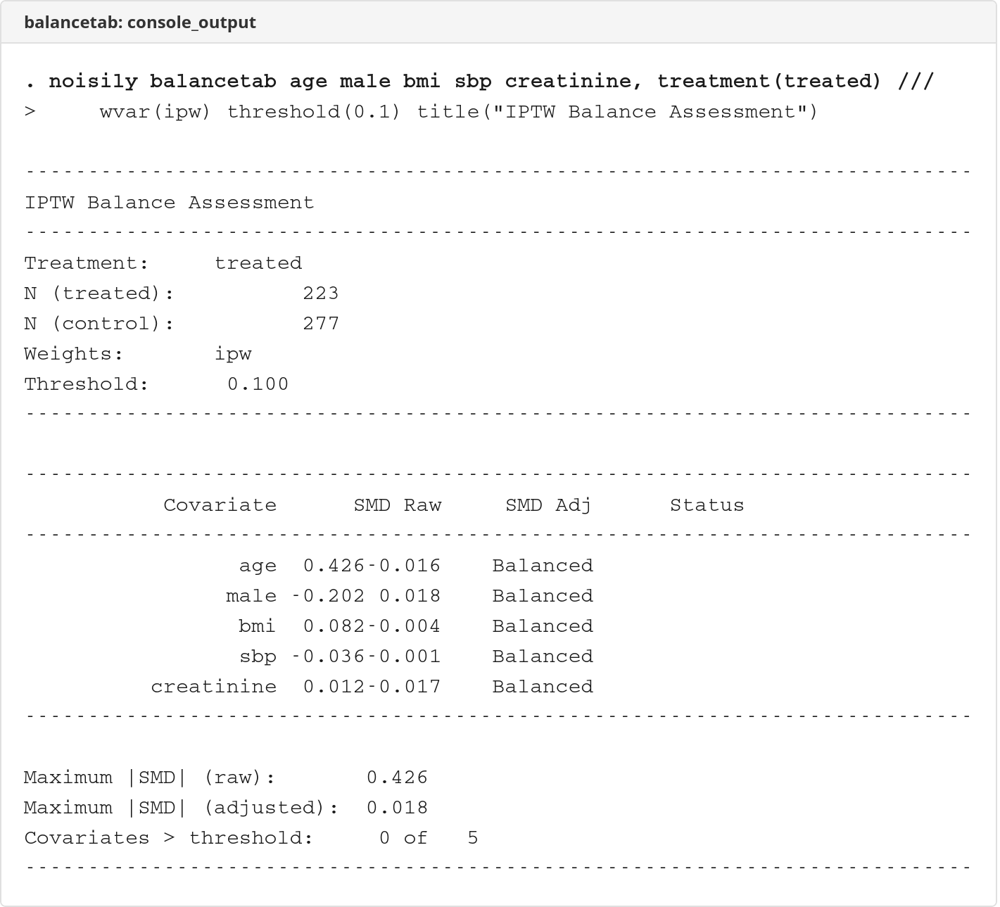
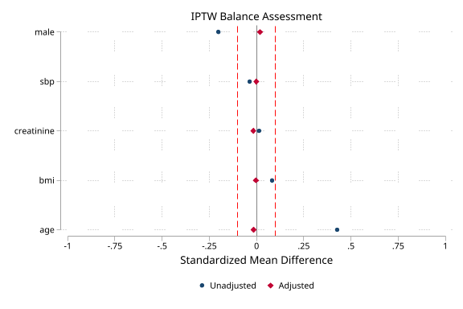
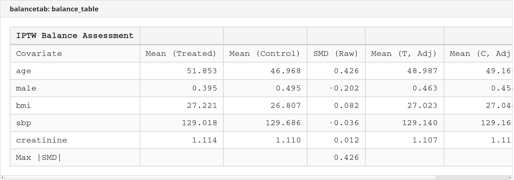

# balancetab

 

Propensity score balance diagnostics with standardized mean differences, Love plots, and Excel export.

## Description

`balancetab` calculates and displays covariate balance diagnostics for propensity score analysis. It computes standardized mean differences (SMD) before and after matching or weighting, generates Love plots for visualization, and exports balance tables to Excel.

Key features:
- Standardized mean differences before/after matching or weighting
- Love plot visualization for balance assessment
- Excel export of balance tables
- Configurable imbalance thresholds
- Pairs naturally with `effecttab` for causal inference workflows

## Screenshots

### Console Output


### Love Plot


### Balance Table


## Installation

```stata
net install balancetab, from("https://raw.githubusercontent.com/tpcopeland/Stata-Tools/main/balancetab")
```

## Syntax

```stata
balancetab varlist [if] [in], treatment(varname) [options]
```

## Options

| Option | Default | Description |
|--------|---------|-------------|
| **treatment(varname)** | *(required)* | Binary treatment indicator (0/1) |
| **wvar(varname)** | - | Weight variable (e.g., IPTW weights); mutually exclusive with `matched` |
| **matched** | off | Indicates data has been matched; mutually exclusive with `wvar()` |
| **threshold(#)** | 0.1 | SMD threshold for imbalance |
| **xlsx(filename)** | - | Export balance table to Excel |
| **sheet(name)** | "Balance" | Excel sheet name |
| **loveplot** | off | Generate Love plot |
| **saving(filename)** | - | Save Love plot to file |
| **scheme(schemename)** | - | Graph scheme for Love plot (e.g., `plotplainblind`) |
| **graphoptions(string)** | - | Additional twoway options for Love plot (e.g., `note("Source: RCT")`) |
| **format(fmt)** | %6.3f | Display format for SMD |
| **title(string)** | - | Title for output/plot |

## Examples

### Basic balance check (unadjusted)

```stata
* Derive treatment (Prep 1A) and merge comorbidities (Prep 1E)
use _examples/cohort.dta, clear
merge 1:1 id using _examples/treatment.dta, nogen keep(match)
merge 1:1 id using _examples/comorbidities.dta, nogen keep(master match)
replace diabetes = 0 if missing(diabetes)
replace hypertension = 0 if missing(hypertension)
replace anxiety = 0 if missing(anxiety)

balancetab index_age female education income_quintile ///
    born_abroad diabetes hypertension anxiety, ///
    treatment(treated)
```

Note: `balancetab` does not accept `i.` factor variable notation. Pass raw variable names.

### Balance after IPTW

```stata
* Estimate propensity scores and create weights
logit treated index_age female i.education i.income_quintile ///
    born_abroad diabetes hypertension anxiety
predict double ps, pr
label variable ps "Propensity score"
gen double ipw = cond(treated==1, 1/ps, 1/(1-ps))
label variable ipw "Inverse probability weight"

* Check balance (no i. notation for balancetab)
balancetab index_age female education income_quintile ///
    born_abroad diabetes hypertension anxiety, ///
    treatment(treated) wvar(ipw)
```

### With Love plot and Excel export

```stata
balancetab index_age female education income_quintile ///
    born_abroad diabetes hypertension anxiety, ///
    treatment(treated) wvar(ipw) ///
    xlsx(balancetab/demo/balance.xlsx) loveplot saving(balancetab/demo/loveplot.png)
```

## Interpreting SMD

The standardized mean difference quantifies the difference between treatment and control groups in standard deviation units:

| SMD | Interpretation |
|-----|----------------|
| < 0.1 | Good balance |
| 0.1-0.25 | Acceptable balance |
| > 0.25 | Poor balance |

## Stored Results

`balancetab` stores the following in `r()`:

**Scalars:**

| Result | Description |
|--------|-------------|
| `r(N)` | Total number of observations |
| `r(N_treated)` | Number in treatment group |
| `r(N_control)` | Number in control group |
| `r(max_smd_raw)` | Maximum absolute SMD before adjustment |
| `r(max_smd_adj)` | Maximum absolute SMD after adjustment (only when `wvar()` specified) |
| `r(n_imbalanced)` | Number of covariates exceeding threshold |
| `r(threshold)` | Threshold used |

**Macros:**

| Result | Description |
|--------|-------------|
| `r(treatment)` | Treatment variable name |
| `r(varlist)` | Covariates assessed |
| `r(wvar)` | Weight variable (if specified) |

**Matrices:**

| Result | Description |
|--------|-------------|
| `r(balance)` | Matrix of balance statistics |

## Requirements

- Stata 16.0 or higher

## Version

- **Version 1.1.1** (26 February 2026): Added explicit `scheme()` option for Love plot
- **Version 1.1.0** (25 February 2026): Added `graphoptions()` passthrough for Love plot twoway options
- **Version 1.0.1** (25 February 2026): Bug fixes — removed unimplemented strata option, fixed Love plot axis labels, fixed zero-variance SMD handling, added wvar/matched mutual exclusivity, improved matched-only display
- **Version 1.0.0** (21 December 2025): Initial release

## Author

Timothy P Copeland<br>
Department of Clinical Neuroscience<br>
Karolinska Institutet

## License

MIT License

## See Also

- `help effecttab` - Format treatment effects tables
- `help iptw_diag` - IPTW weight diagnostics
- `help teffects` - Treatment effects estimation
