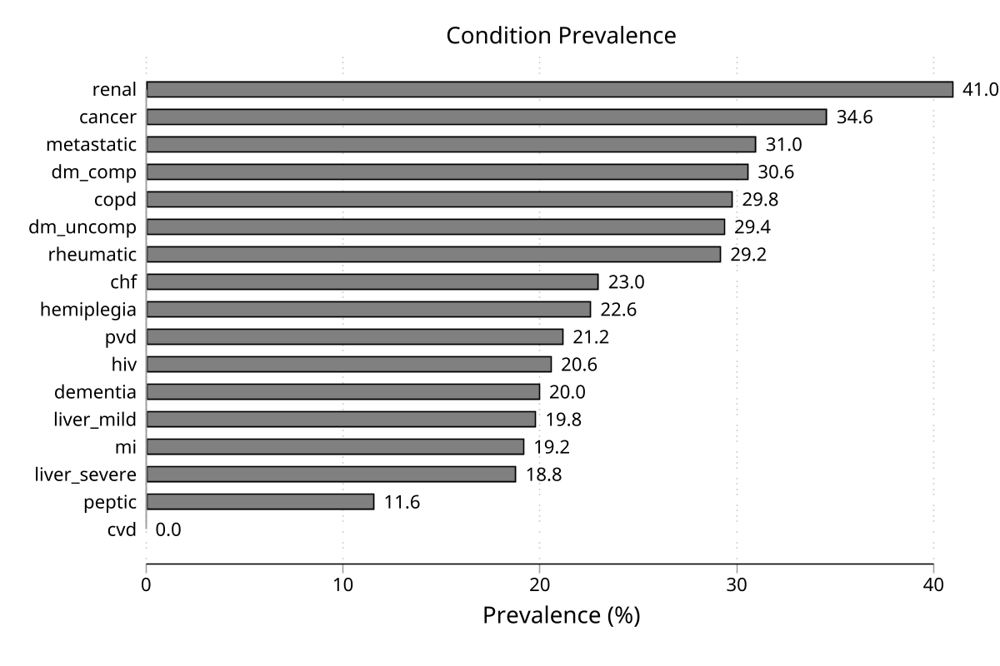

# codescan — Scan wide-format diagnosis, procedure, and medication code fields

**Version 4.0.1** | 2026-07-18

`codescan` scans wide-format code slots (such as `dx1`–`dx30` or `proc1`–`proc20`) with anchored regex or prefix rules and creates condition indicators, counts, or patient-level summaries — all without reshaping your data. `codescan_describe` is the reconnaissance companion: it shows what codes are actually present before you commit to a scanning rule set.

## What it does

You tell `codescan` which code patterns to look for and what to name each condition. The command scans every code slot on every row, marks which conditions are present, and returns a summary with the prevalence of each condition. You can:

- Stay at the **row level** (one 0/1 indicator per encounter per condition)
- **Collapse** to one row per patient with `collapse`
- **Merge** patient-level results back onto encounter rows with `merge`
- Apply **time windows** relative to a reference date
- **Export** prevalence tables and co-occurrence matrices to `.xlsx` or `.csv`

It works with any string code system: ICD-10, ICD-9, KVÅ, CPT, ATC, OPCS, or proprietary codes.

## Requirements

- Stata 16 or later
- No external package dependencies

## Installation

```stata
capture ado uninstall codescan
net install codescan, from("https://raw.githubusercontent.com/tpcopeland/Stata-Tools/main/codescan") replace
```

## Quick Start

Self-contained — paste the whole block into a clean Stata session.

```stata
clear
input long pid str6 dx1 str6 dx2
1 "E110" "I10"
1 "Z00"  "E119"
2 "I50"  ""
2 "E102" ""
3 "Z00"  ""
end

* What codes are actually in the data?
codescan_describe dx1 dx2

* Flag type 2 diabetes and hypertension on every encounter row.
codescan dx1 dx2, define(dm2 "E11" | htn "I1[0-35]")

* Same rules, one row per patient. `replace` is needed because the row-level
* call above already created dm2 and htn in memory.
codescan dx1 dx2, define(dm2 "E11" | htn "I1[0-35]") id(pid) collapse replace
```

The row-level call reports prevalence across the 5 encounters (dm2 40%, 2 of 5); the `collapse` call reports it across the 3 patients (dm2 33%, 1 of 3 — both `E11` encounters belong to the same patient). The denominator is the analysis unit, so it changes when the output shape does — see [Choosing the Output Shape](#choosing-the-output-shape). Both calls leave the prevalence table in `r(summary)` for programmatic use.

## Commands

| Command | Description |
|---------|-------------|
| `codescan` | Scan wide-format code variables and generate indicators, counts, or patient-level summaries |
| `codescan_describe` | Inspect the raw code inventory before writing scan rules |

## How It Works

The recommended workflow has four steps:

1. **Inspect the code inventory** with `codescan_describe`. This shows which codes and chapter prefixes actually occur in your data, and suggests patterns to target.
2. **Draft simple rules** with `define()` and check the row-level results. At this stage the created variables appear alongside the original data so you can verify matches.
3. **Choose the output shape.** Stay row-level for auditing, `collapse` to one row per `id()`, or `merge` patient-level summaries back to encounter rows.
4. **Add advanced features last.** Once basic matches look right, layer on time windows (`lookback()`/`lookforward()`), date summaries (`alldates`), and export/save options.

## Which Variables to Scan

The words between `codescan` and the comma are a normal Stata varlist: they tell `codescan` which columns contain codes. The rules in `define()` or `codefile()` are then applied to every variable in that varlist.

```stata
codescan dx1 dx2 dx3, define(dm2 "E11")
codescan dx1-dx30, define(dm2 "E11")
codescan dx*, define(dm2 "E11")
codescan dx1-dx30 proc1-proc20, define(dm2 "E11" | proc "XF001")
```

Use explicit names (`dx1 dx2 dx3`) when there are only a few variables. Use a range (`dx1-dx30`) when the variables sit next to each other in the dataset order. Use a wildcard (`dx*`) when all variables with that prefix should be scanned. You can mix groups in one varlist when the same definitions should be checked across all of them.

If diagnosis codes, procedure codes, and medication codes need different dictionaries, run separate scans and use `generate()` so the output names do not collide:

```stata
codescan dx1-dx30, define(dm2 "E11" | htn "I1[0-35]") generate(dx_)
codescan proc1-proc20, define(mammo "XF001|XF002" | colectomy "JFB|JFH") ///
    mode(prefix) generate(proc_)
```

For troubleshooting, add `detail` to see how many matches came from each scanned variable. `codescan_describe dx1-dx30` is for inventory: it pools the nonempty codes across the listed variables so you can decide what rules to write.

## Regex Patterns in Plain English

`mode(regex)` is the default. For each code value, `codescan` uses Stata's unicode-aware regex engine (`ustrregexm()`) and automatically adds a start-of-string anchor. That means `define(dm2 "E11")` is checked like `ustrregexm(code, "^(E11)")`: the code must start with `E11`. With `nocase`, matching folds case across unicode (so `"Å"` matches `å`).

Common patterns:

- `"E11"` matches `E110`, `E119`, and `E11.9`; it does not match `AE11`.
- `"I1[0-35]"` matches `I10`, `I11`, `I12`, `I13`, and `I15`. The brackets mean "one character from this set"; `[0-35]` means `0`, `1`, `2`, `3`, or `5`.
- `"E1[01]"` matches `E10` and `E11`.
- `"C7[7-9]|C80"` matches `C77`, `C78`, `C79`, or `C80`. A `|` inside a quoted regex pattern means "or".

The unquoted `|` in `define()` has a different job: it separates conditions.

```stata
* Two conditions: dm2 and htn
codescan dx1 dx2, define(dm2 "E11" | htn "I1[0-35]")

* One condition with two regex alternatives: metastatic
codescan dx1 dx2, define(metastatic "C7[7-9]|C80")
```

Use `~` for exclusions. This keeps the broad rule readable while removing specific subcodes:

```stata
codescan dx1 dx2, define(dm2 "E11" ~ "E116")
```

In `mode(prefix)`, regex metacharacters are not special. The pattern is treated as one or more simple starts-with tokens separated by `|`, so `"XF001|XF002"` means "starts with `XF001` or starts with `XF002`".

**Patterns that can match without consuming a character are rejected** with `r(198)`. Because every pattern is anchored, such a pattern matches *every* code — as an inclusion it would flag the whole dataset, and as an exclusion it would empty it, in both cases silently. This rules out the empty pattern, `()`, `(())`, a trailing empty alternative like `(E11|)`, zero-width quantifiers like `A*`, `A?`, and `A{0}`, and a zero-width assertion used on its own, such as a bare `\b` or a bare lookahead. Assertions remain usable as part of a pattern that does consume a code, so `"\bE11"` is accepted. To match any nonempty code on purpose, use `.` — one arbitrary character — rather than `.*`.

## Choosing the Output Shape

| Goal | Use | What remains in memory |
|------|-----|------------------------|
| Check whether rules match the right encounters | No `collapse` or `merge` | Original rows plus condition variables |
| Build an analysis dataset with one row per patient | `id(pid) collapse` | One row per `id()` |
| Keep encounter rows but attach patient-level flags | `id(pid) merge` | Original rows plus patient-level results |
| Keep the original data untouched and store results separately | `frame(results) replace` | Original data plus a new frame |
| Save the transformed dataset to disk | `saving(results.dta, replace)` | Same data as the selected output shape |
| Save the prevalence summary table | `export(results.xlsx)` or `export(results.csv)` | Data in memory are unchanged by the export |

For most analytic workflows, start with row-level output while checking the rules, then use `collapse` once the definitions are stable.

## Worked Examples

### 1. Build a small toy dataset

`codescan` is designed for wide-format code slots, so the examples use a compact inline dataset representing five encounters for three patients, with diagnosis codes, a procedure code, and dates.

```stata
clear
input long pid str6 dx1 str6 dx2 str6 proc1 double visit_dt double index_dt
1 "E110" "I10"  "XF001" 21914 21915
1 "Z00"  "E119" ""      21880 21915
2 "I50"  ""     "JFB10" 21900 21915
2 "E102" ""     ""      22020 21915
3 "Z00"  ""     ""      21910 21915
end
format visit_dt index_dt %td
```

### 2. Inspect the code inventory before writing rules

Start here when you do not yet know which prefixes or patterns are in the raw data. `codescan_describe` tabulates unique codes across wide-format variables, showing the top N by frequency and a chapter summary grouped by first character.

```stata
codescan_describe dx1 dx2, top(10)
```

You can also save a draft CSV codefile from the chapter summary:

```stata
codescan_describe dx1 dx2, save(chapter_rules.csv)
```

### 3. Start with a row-level scan

This is the simplest use case. It creates one 0/1 output variable per named condition. Keep the first pass simple and verify the matches before adding windows or patient-level aggregation.

```stata
codescan dx1 dx2, define(dm2 "E11" | htn "I1[0-35]" | chf "I50")
```

After this command, `dm2` is 1 on rows where `dx1` or `dx2` starts with `E11`; `htn` is 1 where either slot starts with `I10`, `I11`, `I12`, `I13`, or `I15`; and `chf` is 1 for `I50*`.

### 4. Collapse to one row per patient with a lookback window

Once the rule set looks right, add IDs and dates. `lookback(365)` limits matches to the prior year relative to `refdate()`, and `alldates` requests `_first`, `_last`, and `_count` date-summary variables for each condition.

```stata
codescan dx1 dx2, id(pid) date(visit_dt) refdate(index_dt) ///
    define(dm2 "E11" | htn "I1[0-35]" | chf "I50") ///
    lookback(365) inclusive collapse alldates
```

### 5. Use exclusion patterns

Use `~` after the inclusion pattern to exclude specific codes. Here `dm2` matches all `E11*` codes except `E116`:

```stata
codescan dx1 dx2, define(dm2 "E11" ~ "E116" | htn "I1[0-35]")
```

### 6. Prefix matching for procedure codes

`regex` is the default. Switch to `mode(prefix)` when simple starts-with logic is enough and you do not need regex features. Pipe-separated tokens are alternative prefixes.

```stata
codescan proc1, define(mammo "XF001|XF002" | colectomy "JFB|JFH") mode(prefix)
```

### 7. Save reusable definitions, then load them back as a codefile

This is the transition from ad hoc rule drafting to a reusable dictionary workflow. `save()` writes the parsed `define()` rules to a CSV, and `codefile()` reads them back.

```stata
codescan dx1 dx2, define(dm2 "E11" | htn "I1[0-35]") save(dm_rules.csv)
codescan dx1 dx2, codefile(dm_rules.csv) replace
```

The first run leaves the `dm2` and `htn` indicators in memory, so the codefile re-run adds `replace` to overwrite them. A fresh session that loads only the saved rules does not need `replace`.

### 8. Non-destructive workflow with frames

`frame()` stores the collapsed result in a named frame, leaving the original data untouched. This is the recommended pattern when you need both encounter-level data and a patient-level summary in the same session.

```stata
codescan dx1 dx2, define(dm2 "E11" | htn "I1[0-35]") id(pid) collapse ///
    frame(results) replace
frame results: list
```

### 9. Export a summary table and save the result dataset

Use `export()` for the prevalence table and `saving()` for the transformed dataset. `format()` controls the number format in both the console output and the exported file — with `format(%9.2f)` the workbook's prevalence cell carries the Excel number format `0.00`.

```stata
codescan dx1 dx2, define(dm2 "E11" | htn "I1[0-35]") id(pid) collapse ///
    export(codescan_results.xlsx, replace) ///
    saving(codescan_results.dta, replace) ///
    format(%9.2f)
```

Both `replace` suboptions are what let you re-run this block; drop either one and a second run stops with `r(602)` rather than overwriting your file.

### 10. Merge patient-level results back to original rows

`merge` computes patient-level summaries and joins them back, so every row for a given patient gets the same condition values.

```stata
codescan dx1 dx2, define(dm2 "E11" | htn "I1[0-35]") id(pid) merge
```

### 11. Multi-window sensitivity analysis

Supply several lookback values to compare how prevalence changes across windows. `r(sensitivity)` returns a matrix of prevalences by condition and window.

```stata
codescan dx1 dx2, id(pid) date(visit_dt) refdate(index_dt) ///
    define(dm2 "E11" | htn "I1[0-35]") ///
    lookback(90 365) inclusive collapse
```

### 12. Tell hits apart from cases, and see which slot they came from

A patient coded `E110` in `dx1` and `E119` in `dx2` on the same encounter is *one* case carrying *two* hits. `countmode` reports both: `Hits` (and `r(summary)`'s `total_hits`) counts code slots, while `Units>0` (`positive_units`) counts patients — and prevalence uses the latter.

```stata
codescan dx1 dx2, define(dm2 "E11") id(pid) collapse countmode
matrix list r(summary)
```

`detail` credits that patient's row to `dx1` alone, because binary matching stops at the first slot that matches; scanning `dx2 dx1` would credit `dx2` instead, with an identical cohort. Add `allslots` to count each slot on its own, which makes the table independent of varlist order.

```stata
codescan dx1 dx2, define(dm2 "E11") detail
codescan dx1 dx2, define(dm2 "E11") detail allslots
```

## Demo

`demo/demo_codescan.do` builds synthetic administrative data — 500 patients with 3 encounters each (1,500 rows), 4 wide-format ICD-10 diagnosis slots, and 1 procedure code variable — and scans it with a six-condition rule set:

```stata
codescan dx1 dx2 dx3 dx4, ///
    define(dm "E1[01]" | htn "I1[0-35]" | chf "I50" | copd "J4[0-7]" | ///
           cancer "C[0-7]" ~ "C77|C78|C79|C80" | metastatic "C7[789]|C80") ///
    label(dm "Diabetes" \ htn "Hypertension" \ chf "Heart failure" \ ///
          copd "COPD" \ cancer "Cancer (non-met)" \ metastatic "Metastatic cancer") ///
    id(pid) collapse graph
```

### Prevalence chart — patient level

Prevalence among the 500 **patients**, after `id(pid) collapse`:



The same rules run without `collapse` report prevalence among the 1,500 **encounters** instead, and every number is lower — a patient counts once here but contributes up to three encounter rows there. Neither is more correct; they answer different questions. The console header names the denominator (`observations` versus `pid values`) on every run, so check it before comparing two scans.

### Excel workbook

The demo also writes `demo/codescan_results.xlsx` with a summary sheet and a co-occurrence sheet, via `cooccurrence export(...) format(%9.2f)`.

Reproduce both assets from the repository root or from `codescan/demo/`:

```stata
do demo/demo_codescan.do
```

## Key Behaviors

- **Anchored matching:** patterns are anchored at the start of each code value. `define(dm2 "E11")` matches `E110` and `E119`, not `AE11`.
- **Labels are presentation only:** `label()` (or a codefile `label` column) supplies the text used for the variable label, the `Condition` column of the console table, the `detail` table, the bar labels of `graph`, and a dedicated `label` column in `export()`. Conditions without a label fall back to the condition name. Identifiers never change: `r(conditions)`, every matrix row name, and the export's `condition` column always carry the condition *name*, so relabeling cannot break a do-file. Entries are separated by `\`, not `|`, and label text may not contain a double quote — using `|` by mistake is rejected with `r(198)` rather than silently labelling one condition with the rest of the option.
- **Regex vs. prefix:** `mode(regex)` (default) supports character classes and alternation. `mode(prefix)` uses simple starts-with comparisons and is usually faster.
- **Exclusion patterns:** use `~` after the inclusion pattern, e.g. `define(dm2 "E11" ~ "E116")`. Multiple exclusions are allowed: `define(x "A" ~ "A1" ~ "A2")`.
- **nodots:** strips periods during matching without modifying the stored data.
- **nocase:** performs unicode-aware case-insensitive matching without rewriting regex escapes such as `\d`.
- **tostring:** converts numeric code variables to string before scanning; original data are restored afterward.
- **collapse vs. merge:** `collapse` creates one row per `id()`. `merge` attaches patient-level results back to the original row structure.
- **alldates:** shorthand for `earliestdate`, `latestdate`, and `countdate`. These create `_first`, `_last`, and `_count` date-summary variables.
- **countrows:** creates `_nrows` variables counting the number of rows (not unique dates) with a qualifying match. Does not require `date()`.
- **countmode:** changes created variables from 0/1 indicators to integer counts (number of code slots matched per row, summed across rows after collapse/merge). It reports two quantities that are easy to confuse: `total_hits` counts matching code *slots* (a patient coded `E110` in `dx1` and `E119` in `dx2` contributes 2), while `positive_units` counts observations — or `id()` values under `collapse`/`merge` — with a count above zero. Prevalence is built from `positive_units`, so prevalence means the same thing with and without `countmode`. Both appear in the console table (`Hits`, `Units>0`), `r(summary)`, `r(codelist)`, and `export()`. Without `countmode`, `total_hits` is missing rather than a copy of `positive_units`, because binary matching never counts repeat hits.
- **detail is order-dependent by default:** binary matching stops at the first slot that matches a condition, so `r(varcounts)` credits each row to the **first** matching variable in varlist order. Scanning `dx2 dx1` instead of `dx1 dx2` moves counts between columns without changing the cohort, the prevalence, or `r(summary)`. Add `allslots` to count every matching slot independently; the table is then order-free, its row totals equal the `countmode` hit totals, and the indicators stay 0/1. `r(detail_allslots)` records which rule produced the table.
- **generate:** prefixes all created variable names, useful when running separate diagnosis, procedure, and medication scans on the same dataset.
- **unmatched:** creates a row-level flag with three states — 1 = analyzed and matched nothing, 0 = analyzed and matched, `.` = not analyzed (excluded by `if`/`in`, a missing `id()`, or a time window). So `count if flag == 1` counts genuine non-matches, and `count if !missing(flag)` reproduces `r(N)`.
- **matched_code:** creates a row-level variable holding the first code value that survived matching.
- **frame:** stores the result in a named frame and implies `preserve`, so the original data are untouched.
- **Analysis unit:** the console header names the denominator (`observations` at the row level, `id()` values after `collapse`/`merge`), so row-level prevalence is never misread as person-level.
- **Diagnosis position:** rules apply to every scanned slot equally. To honor first-listed (main) diagnosis validity, scan `dx1` on its own, or run the positions as separate calls with `generate()` prefixes.

### Interpreting prevalence

`codescan` reports the prevalence of the **code definition** you supply — the share of encounters or patients whose codes match your rule — not the prevalence of the underlying disease. The gap between the two is governed by the **positive predictive value and sensitivity** of the codes in your data. Validate your case definition against the relevant register-validation literature before reading the output as disease frequency.

## Definition Rules and Codefiles

Inline definitions use this structure:

```stata
define(name "inclusion_pattern" ~ "exclusion_pattern" | name2 "pattern2")
```

The inclusion and exclusion patterns are anchored at the start of each code value. In default `mode(regex)`, `"I1[0-35]"` matches `I10`, `I11`, `I12`,
`I13`, and `I15`. In `mode(prefix)`, pipe-separated tokens are treated as simple alternative prefixes.

There are three practical ways to list condition definitions:

1. Keep a short rule set inline with `define()`.
2. Put many conditions in a CSV or `.dta` codefile, with one row per condition.
3. Use `codescan_describe, save(chapter_rules.csv)` or `codescan, save(rules.csv)` to create a starter CSV, then edit it.

Definitions apply to all variables in the varlist. To use different definitions for different variable groups, run separate calls with `generate()` prefixes, as shown above.

Reusable codefiles may be CSV or Stata `.dta` files. Column names are matched case-insensitively.

| Column | Required | Meaning |
|--------|----------|---------|
| `name` | Yes | Valid Stata condition name; must be unique and no longer than 26 characters |
| `pattern` | Yes | Inclusion pattern or pipe-separated prefix list |
| `exclusion` | No | Exclusion pattern(s), combined with `|` when more than one is needed |
| `label` | No | Human-readable label for output variables and tables |

Use `save(rules.csv)` to turn an inline `define()` rule set into a reusable codefile. Use `saving(results.dta, replace)` for the final transformed dataset; the two option names deliberately do different jobs.

## Options

| Option | Purpose |
|--------|---------|
| `define()` | Supply inline condition rules |
| `codefile()` | Read condition rules from CSV or `.dta` |
| `id()` | Identify patients/entities for `collapse` or `merge` |
| `date()` | Supply the row-level event date |
| `refdate()` | Supply the reference date for windows |
| `lookback()` | Restrict matching to one or more backward windows |
| `lookforward()` | Restrict matching to a forward window |
| `inclusive` | Include the reference date in a one-direction window |
| `earliestdate` | Create `<condition>_first` |
| `latestdate` | Create `<condition>_last` |
| `countdate` | Create `<condition>_count` for unique matching dates |
| `countrows` | Create `<condition>_nrows` for matching rows/hits |
| `alldates` | Request all three date-summary outputs |
| `label()` | Assign human-readable condition labels |
| `collapse` | Reduce to one row per `id()` |
| `merge` | Broadcast patient-level results back to original rows |
| `mode()` | Choose `regex` (default) or `prefix` matching |
| `replace` | Permit replacement of planned outputs or frames |
| `noisily` | Display per-condition match totals |
| `detail` | Return per-variable match contributions |
| `allslots` | With `detail`, count every matching slot (order-free) |
| `nodots` | Remove dots while matching/tabulating |
| `tostring` | Scan numeric codes through temporary strings |
| `preserve` | Restore the active data after patient-level processing |
| `frame()` | Store results in a named frame and imply `preserve` |
| `cooccurrence` | Return pairwise condition co-occurrence counts |
| `nocase` | Use unicode-aware case-insensitive matching |
| `generate()` | Prefix created variable names |
| `unmatched()` | Create a row-level no-match flag (1/0/`.`) |
| `matched_code()` | Store the first matching code on each row |
| `level()` | Truncate prefix tokens to a fixed length |
| `graph` | Draw a prevalence bar chart |
| `export(f [, replace])` | Write the summary to CSV or Excel |
| `save(f [, replace])` | Write reusable definitions (or describe chapters) to CSV |
| `saving(f [, replace])` | Save the transformed result dataset |
| `format()` | Set the prevalence display format |
| `countmode` | Store code-slot counts instead of binary indicators |
| `top()` | Set the number of codes shown by `codescan_describe` |

File options reject quotes, shell metacharacters, and control characters inside filenames. Ordinary quoted paths containing spaces or hyphens are supported.

`export()`, `save()`, and `saving()` never overwrite an existing file unless you add the `replace` suboption; without it the command stops with `r(602)` before touching your data. That suboption is distinct from the `replace` option, which authorizes overwriting output *variables and frames* and says nothing about files.

## Stored Results

`codescan` creates one variable per condition. Without `countmode`, those variables are 0/1 indicators. With `countmode`, they are integer counts of matching code slots. With `collapse` or `merge`, optional date/count variables are added as requested:

| Option | Created variables |
|--------|-------------------|
| `earliestdate` | `<condition>_first` |
| `latestdate` | `<condition>_last` |
| `countdate` | `<condition>_count` for unique dates |
| `countrows` | `<condition>_nrows` for matching rows or code-slot hits under `countmode` |

`codescan` returns:

| Result | Meaning |
|--------|---------|
| `r(N)` | Analyzed rows or unique IDs |
| `r(n_conditions)` | Number of conditions |
| `r(collapsed)` | Whether `collapse` ran |
| `r(merged)` | Whether `merge` ran |
| `r(mode_count)` | Whether `countmode` was used |
| `r(detail_allslots)` | Whether `detail` counted every slot (with `detail`) |
| `r(conditions)` | Condition names |
| `r(newvars)` | Created variables remaining in memory |
| `r(varlist)` | Scanned variables |
| `r(mode)` | Matching mode |
| `r(nocase)` | Case-insensitive mode marker |
| `r(generate)` | Output prefix |
| `r(define)` | Inline definition text |
| `r(codefile)` | Codefile path |
| `r(id)` | ID variable |
| `r(date)` | Event-date variable |
| `r(lookback)` | Lookback value(s) |
| `r(lookforward)` | Lookforward value |
| `r(refdate)` | Reference-date variable |
| `r(n_excluded_missingdate)` | Rows excluded for missing window dates |
| `r(frame)` | Result frame name |
| `r(summary)` | `count`, `prevalence`, `total_hits`, `positive_units` |
| `r(codelist)` | `count`, `prevalence`, `total_hits`, `positive_units` |
| `r(varcounts)` | Per-variable match counts |
| `r(cooccurrence)` | Pairwise co-occurrence matrix |
| `r(sensitivity)` | Multi-window prevalence matrix |
| `r(sensitivity_n)` | Denominators behind `r(sensitivity)` |

`r(lookback)` is a scalar when one window was requested and a macro of space-separated values when several were. `r(n_excluded_missingdate)` is a scalar, returned only when a window was used.

`codescan_describe` returns:

| Result | Meaning |
|--------|---------|
| `r(n_unique)` | Number of unique nonempty codes |
| `r(n_entries)` | Number of nonempty code entries |
| `r(n_vars)` | Number of variables scanned |
| `r(varlist)` | Variables scanned |
| `r(top_codes)` | Frequency, percent, and cumulative-percent table |
| `r(chapters)` | Code and entry counts by first character |

## Troubleshooting

| Symptom | Likely cause and fix |
|---------|----------------------|
| `not a string variable` | Code variables were imported as numeric; add `tostring` or convert them before scanning |
| `collapse requires id()` | Patient-level output needs an identifier supplied through `id()` |
| `lookback()/lookforward() require both date() and refdate()` | Windowing needs an event date and a reference date, both stored as numeric Stata daily dates |
| `variable ... already exists` | Add `replace` only after confirming that overwriting existing output variables is intended |
| A condition matches zero observations | Check spelling, dots, case, anchoring, and whether `mode(regex)` or `mode(prefix)` matches the intended rule |
| Multi-window `lookback()` fails | Multiple windows require `collapse` or `merge` because the comparison is patient-level |

## QA

The QA suite is in `qa/` and uses a curated `run_all.do` runner with `quick`, `core`, and `full` lanes.

The per-suite file index, test counts, lane membership, and the coverage map live in `qa/README.md` and are not duplicated here. A hand-maintained copy of those counts sat in this file and went stale silently — it read 26 suites and 680 assertions while the full lane ran 723. The authoritative counts are the `RESULT: ... tests=N` sentinels each suite prints, aggregated by `run_all.do`.

## Version History

### 4.0.1 (2026-07-18)

- **Bugfix — `saving()` under `merge` no longer leaks internal tempvars.** With `merge` (and any of `countrows`/date summaries/`cooccurrence`/`tostring`), the file written by `saving()` previously contained codescan's internal scratch variables (`__000000` etc.) alongside the intended result columns. `saving()` now drops those tempvars before writing, so the deliverable holds only the id/date/scan/result columns — matching what `frame()` and the in-memory result already returned.
- **Robustness — `codescan` self-heals after `mata: mata clear`.** The Mata scanning engine now lives in `_codescan_engine.ado` and is recompiled on demand. Previously, clearing Mata mid-session left every later `codescan` call failing with a cryptic `r(3499)` until the user ran `discard`.
- **Stricter — case-variant duplicate condition/output names are rejected.** Names that differ only in case (`DM2` vs `dm2`) create distinct Stata variables and are almost always a typo; `define()`, `codefile()`, and the output planner now reject them (`r(198)`) instead of silently creating both.
- **Clearer error — datetime `date()`/`refdate()`.** A `%tc`/`%tC` datetime passed to `date()` or `refdate()` is rejected up front with a `dofc()` hint, instead of producing an opaque `r(2000)` or a silently near-empty cohort (time windows are measured in days).
- **Docs.** Clarified `nodots` (patterns are matched against the undotted data), `merge` (fully-excluded ids receive `.`, not 0), `level()` (truncates inclusion prefixes only; exclusions match at full precision), `detail` under `collapse`/`merge` (contributions are row-level), and `r(codelist)` (a legacy exact copy of `r(summary)`). Removed a stale "prevalence CIs" phrase left over from the 4.0.0 CI removal.

### 4.0.0 (2026-07-17)

- **BREAKING: confidence intervals removed.** `codescan` no longer computes or displays the Wilson score interval for prevalence. The console table drops its `[level% CI]` column, `r(summary)` drops the `ci_low` and `ci_high` columns (now four columns: `count`, `prevalence`, `total_hits`, `positive_units`), `export()` output drops the `ci_low`/`ci_high` columns, and `r(ci_level)` is no longer returned. Prevalence, counts, and every other stored result are unchanged. Code that read `r(ci_level)` or the `ci_low`/`ci_high` columns of `r(summary)` or the exported table must be updated.

### 3.0.2 (2026-07-17)

- **Bugfix (widens 3.0.1's zero-length guard):** the guard rejects a pattern that can match without consuming a character by probing one code per leading character. 3.0.1 probed only `[A-Za-z0-9._-]`, so an assertion keyed to any other character — `"(?=/)"`, `"(?= )"` — scored zero against every probe and still returned a **100% cohort at rc=0** on codes beginning with that character. Same defect as 3.0.1 fixed, one alphabet further out. The probe now spans printable ASCII, covering every character real code systems use (ICD `.` and `+`, NDC `-`, Read `%`, space-padded codes). Still a domain guard, not a proof: an assertion keyed to a non-ASCII character on non-ASCII codes is not probed.

### 3.0.1 (2026-07-17)

- **Bugfix (completes 3.0.0's C2 guard):** a `regex` pattern or exclusion that can match *without consuming a character* is now rejected. 3.0.0 rejected patterns that match an empty string — `"()"`, `"A*"`, `"E11|"` — by probing them against an empty subject. A zero-width assertion escapes that probe: `"\b"` finds no word boundary in an empty string and so passed validation, then matched a zero-length string at the start of every real code, silently producing a **100% cohort at rc=0** (or, as an exclusion, dropping every row). This is the defect class 3.0.0 was released to eliminate, reached on an axis the empty-subject probe could not see. Patterns that consume a code are unaffected, including assertions used as part of one: `"\bE11"` still works.

### 3.0.0 (2026-07-17)

Breaking release. It repairs five defects that could lose data or produce a silently wrong cohort, and it repairs an analytical contract that promised more than it delivered. Do-files that parse `codescan` output or rely on silent file overwrite need review.

**Breaking changes**

- Output files are never overwritten without authorization. `export()`, `save()`, and `saving()` — and `codescan_describe`'s `save()` — now take `filename [, replace]`. Writing over an existing file without the `replace` suboption is an error (`r(602)`), raised before any data are touched. This is separate from the `replace` option, which still governs variables and frames only.
- Regex patterns that can match an empty string are rejected with `r(198)`. Anchoring makes such a pattern match every code, so an inclusion of that shape silently flagged the whole dataset and an exclusion silently emptied it. Rejected shapes include `()`, `(())`, `(E11|)`, `A*`, `A?`, and `A{0}`. **`.*` is rejected too** — the match-any-nonempty idiom is now `.`.
- `unmatched()` distinguishes analyzed from excluded rows: 1 = analyzed and matched nothing, 0 = analyzed and matched, `.` = not analyzed. Previously rows dropped by `if`, `in`, a missing `id()`, or a time window were coded 0, which inflated any denominator built from the flag.
- `label()` now reaches the console table, the `graph` bar labels, and a new `label` column in `export()`. Previously it set the variable label and nothing else, so tables and workbooks documented as labelled showed raw condition names. Identifiers are unaffected: `r(conditions)`, matrix row names, and the export's `condition` column still carry the condition name.
- `label()` text may no longer contain a double quote (`r(198)`). The common cause is writing `define()`'s `|` separator instead of `label()`'s `\`, which used to label one condition with the remainder of the option text and leave the rest unlabelled, at `rc=0`.
- `r(summary)` gained two columns (`total_hits`, `positive_units`) and `r(codelist)` gained the same two. Existing column positions are unchanged and `count` keeps its old meaning, so `summary[i,1..4]` still reads what it read before; `matrix colnames` output differs.
- `export()` gained the `label`, `total_hits`, and `positive_units` columns. `matches` is retained with its old value.

**Fixes**

- A late error no longer deletes pre-existing variables. Output-variable creation and rollback are now transactional, so a failure leaves the caller's data exactly as it was. Previously the cleanup path could delete a variable that a `restore` had already put back.
- Optional `codefile()` columns of the wrong type now fail explicitly. A numeric `exclusion` or `label` column was silently treated as absent, so exclusions were dropped and the resulting cohort was wrong at `rc=0`.
- Numeric extended missing values (`.a` through `.z`) no longer enter matching or `codescan_describe` totals as the literal codes `.a`–`.z` under `tostring`.

**New**

- `r(sensitivity_n)` returns the denominator behind each `r(sensitivity)` cell. Each lookback window analyzes a different number of observations, so a prevalence that moves across windows may reflect a changing denominator rather than a changing numerator.
- `allslots` makes `detail` count every matching slot rather than crediting each row to its first matching variable. The default table is order-dependent — scanning `dx2 dx1` instead of `dx1 dx2` moves counts between columns without changing the cohort — which is now stated in the help, the README, and the `detail` output itself. `allslots` is order-free and leaves the indicators 0/1. `r(detail_allslots)` records which rule was used.
- `countmode` reports total hits and positive units separately, in the console (`Hits`, `Units>0`), in `r(summary)`/`r(codelist)`, and in `export()`. The single reported quantity was the slot-hit total under a name (`matches`) that reads like a case count, while prevalence was built from positive units.

### 2.0.9 (2026-07-09)

- **Bugfix:** `nocase` in regex mode now uses ICU's case-insensitive flag instead of uppercasing the regex text, which changed escapes such as `\d` into their opposites (`\D`). Prefix matching retains unicode-aware case folding.
- **Bugfix:** `merge` restores the caller's original row order after its internal grouping and patient-level joins.
- **Bugfix:** `codescan, tostring` now scans numeric code variables through temporary strings and leaves their original storage types and values unchanged.
- **Bugfix:** `codescan_describe` now quotes arbitrary code values used as matrix row names, uses unicode characters for chapter grouping, and writes valid unique condition names for punctuation chapters.
- **Hardening:** malformed empty alternatives are rejected in prefix rules, and every file-path option rejects unsafe shell/control characters. QA adds six proven-fail regression cases.

### 2.0.8 (2026-07-07)

- **Bugfix:** a `label()` entry whose text contained a backslash — a Windows path such as `label(dm2 "C:\data")` or any regex/text with `\` — aborted with an opaque `r(132)` and produced no output. The `\` entry separator is now parsed quote-aware, so a backslash inside quoted label text is kept while `\` between entries still separates them.
- **Bugfix:** a bare `.` in a code slot (a common missing-value placeholder in registry extracts) was scanned by `codescan` as a real code — so a broad pattern like `".*"` matched those rows — even though `codescan_describe` treated `.` as missing and hid it. The two commands now agree: `.` (and any all-dots value under `nodots`) is skipped by both.
- **Internal:** `if`/`in` sample restriction is now evaluated before `tostring`, so an `if` expression that references a numeric scan variable (e.g. `if dx1 > 5`) is tested against the call-time data instead of failing after the variable is recast to string. Removed a shadowed row count in the `merge` path and stopped preparing collapse-only date tempvars on the `merge` path. No change to any documented output or stored result.

### 2.0.7 (2026-07-06)

- **Bugfix:** a `regex` pattern (or exclusion) with an empty alternation branch — a stray leading, trailing, or doubled `|` such as `"E11|"`, `"|E11"`, or `"E11||E12"` — is now rejected with an error. Its empty branch anchored to `^(...|...)` matched the start of *every* code, so a single mistyped pipe silently produced a match-everything cohort (or, in an exclusion, dropped every row) with no error. Well-formed alternations (`"E11|E12"`), a literal `|` inside a character class (`"E1[1|2]"`), and an escaped `\|` are unaffected.
- **Bugfix:** a scan variable that appears more than once in `varlist` — directly or through overlapping ranges such as `dx1-dx5 dx3-dx8` — is now rejected in both `codescan` and `codescan_describe`. A repeated column was read once per occurrence, silently double-counting its codes under `countmode`, `countrows`, and `detail`.

### 2.0.6 (2026-07-02)

- **Bugfix:** with `countmode` + `merge`, patients merged back with a *missing* count (no rows inside the analysis window, or excluded by `if`/`in`) were counted as matches in the console summary, `r(summary)`, and `r(codelist)` — missing is greater than zero in Stata — which could push the reported prevalence past 100%. Missing counts are now screened out; the stored count variables themselves were always correct.
- **Usability:** `strL` scan variables are now rejected up front with a clear message (convert with `compress` or `recast`) in both `codescan` and `codescan_describe`, instead of aborting with a raw Mata `st_sview()` traceback (r3300).

### 2.0.5 (2026-07-01)

- **Docs:** the help file and README now state plainly that the reported prevalence is the prevalence of the **code definition** — subject to the codes' positive predictive value and sensitivity — not the prevalence of the underlying disease, and that the Wilson CI reflects sampling error only, not misclassification.
- **Docs:** new guidance on diagnosis position (scan `dx1` alone, or separate calls with `generate()`, when first-listed diagnosis validity matters).
- **Usability:** the console header now names the analysis unit (`observations` at the row level, `id()` values after `collapse`/`merge`), so row-level prevalence is never misread as person-level. No change to any `r()` result, option, or created variable.

### 2.0.4 (2026-06-30)

- **Internal:** the scan engine was restructured to classify each *distinct* code value once and reuse the result, rather than re-evaluating repeated codes. Results are byte-identical to v2.0.3 — no change to any output, option, or stored result.
- QA: added `test_codescan_perf_equiv.do` (memoized result equals an independent brute-force reference; row-order independence). The full suite passes unmodified.

### 2.0.3 (2026-06-30)

- **Behavior change (regex):** `regex` patterns are now matched with the unicode-aware `ustrregexm()` engine. A structurally invalid pattern (unbalanced bracket, empty group, malformed quantifier such as `a{2,1}`) is now **rejected with an error** instead of silently matching nothing — a typo can no longer quietly produce an all-zero cohort. Valid ASCII patterns are unaffected.
- **`nocase` is now unicode-aware:** case folding uses `ustrupper()`, so a pattern such as `"Å"` matches both `å` and `Å` (relevant for Nordic register codes).
- New: `r(n_excluded_missingdate)` reports the number of rows dropped from the time window for a missing `date()`/`refdate()`, with a console note, when `lookback()`/`lookforward()` is used.
- QA: added `test_codescan_v203_hardening.do` (malformed-regex rejection across `define()`/`codefile()`/exclusion, unicode `nocase`, ASCII regression guard, missing-date scalar) and a `benchmark_codescan_scale.do` guardrail; re-baselined the full suite under the ICU engine.

### 2.0.2 (2026-06-26)

- Fix: `codescan, export()` now reloads the post-scan dataset if CSV/XLSX writing fails, preserving both the active data state and the analytical `r()` payload.
- QA: added a failed-export regression and expanded runner cleanup for generated CSV/DTA artifacts.

### 2.0.1 (2026-06-25)

- Fix: `codescan_describe, save()` now restores caller data after failed file writes and posts analytical `r()` results before the save side effect.
- Fix: `codescan, graph` now posts returns before graph rendering and restores the active data even if graph rendering fails.
- QA: standardized the v2 no-scoring suite result sentinel and canonicalized release metadata checks.

### 2.0.0 (2026-06-19)

- **BREAKING:** comorbidity scoring removed. `score()`, `hierarchy()`, the bundled Charlson/Elixhauser example codefiles, and basename codefile resolution are gone. Comorbidity indices now live in the dedicated `comorbidity` command, which is currently under development. codescan is now a pure code-field scanner.

### 1.1.4 (2026-06-14)
- Docs: the "save reusable definitions, then load them back as a codefile" example (help Example 5 / README Example 7) now adds `replace` to the second run. The first run leaves the condition indicators in memory, so the verbatim two-line block previously stopped with `variable dm2 already exists` (`r(110)`) when copy-pasted. A regression test now runs the documented sequence as printed.
- Usability: `codescan` now prints a note when `level()` is supplied with `mode(regex)`, where it has no effect (it applies only in `mode(prefix)`). Previously the option was silently ignored.

### 1.1.3 (2026-06-14)
- Cleanup: removed a dead duplicate copy of the internal `_codescan_validate_regex()` Mata function from `codescan.ado`. The live definition and its only callers live in `_codescan_definitions.ado`; the unused copy was dead weight and a divergence risk. No user-facing behavior change.
- Consistency: the private `_codescan_parse_codefile` helper now declares `CODEFile()` (matching the public `codefile()` abbreviation capitalization) instead of `CODEFILE()`. No user-facing behavior change.

### 1.1.2 (2026-05-30)
- Fix: bundled helper files (`_codescan_codefile`, `_codescan_definitions`, `_codescan_hierarchy`, `_codescan_outputs`, `_codescan_score`) now precede every `program define` with `capture program drop`. Because the loader re-runs a whole helper file whenever any one of its programs is missing from memory, a partial-load state could otherwise crash a second in-session invocation with `program ... already defined`. All sub-programs are now idempotent on reload.

### 1.1.1 (2026-05-28)
- Fix: `matched_code()` no longer captures codes from observations outside the primary analysis window when combined with a multi-window `lookback()` and `merge`. The supplementary sensitivity scan previously reused the matched-code buffer and populated it for secondary-window-only rows.
- Docs: corrected the `codescan_describe.ado` header to list the `save()` option and the `r(top_codes)`/`r(chapters)` matrices.

## Author

Timothy P Copeland, Karolinska Institutet

## License

MIT
