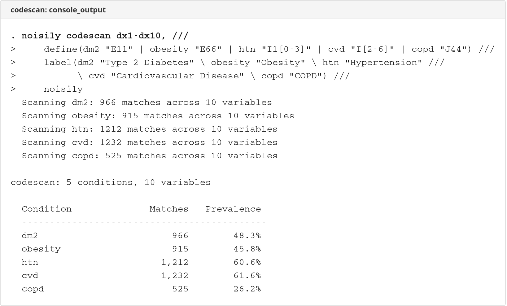
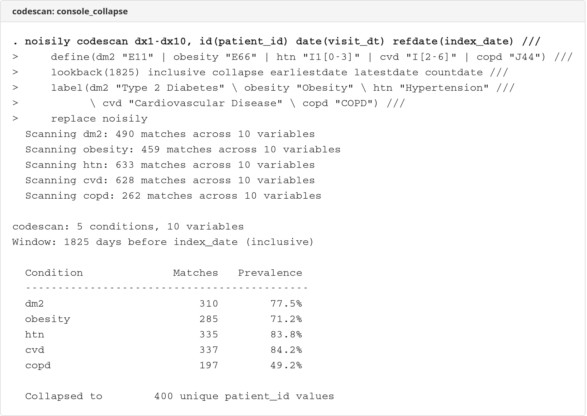

# codescan

  

Scan wide-format code variables for pattern matches and collapse to patient-level indicators.

## Description

`codescan` replaces the 50-150 lines of boilerplate code typically needed to scan wide-format code variables (dx1-dx30, proc1-proc20, etc.) with `regexm()` or `substr()` inside `forvalues` loops.

A single `codescan` call:
- Defines conditions as name-pattern pairs
- Scans across all specified code variables
- Optionally applies time windows relative to an index date
- Collapses to patient-level indicators with date summaries

Works with any string code system: ICD, KVA, CPT, ATC, OPCS, or any other classification.

## Installation

```stata
net install codescan, from("https://raw.githubusercontent.com/tpcopeland/Stata-Dev/main/codescan")
```

## Syntax

```stata
codescan varlist [if] [in], define(string) [options]
```

## Options

| Option | Default | Description |
|--------|---------|-------------|
| **define(string)** | *(required)* | Name-pattern pairs: `define(dm2 "E11" \| obesity "E66")` |
| **id(varname)** | | Patient/entity ID (required with `collapse`) |
| **date(varname)** | | Row-level date variable |
| **refdate(varname)** | | Reference/index date for time windows |
| **lookback(#)** | | Days before refdate to include |
| **lookforward(#)** | | Days after refdate to include |
| **inclusive** | off | Include refdate in single-direction windows |
| **collapse** | off | Collapse to patient level (max indicators) |
| **earliestdate** | off | Create *name*_first variables (requires `date` + `collapse`) |
| **latestdate** | off | Create *name*_last variables (requires `date` + `collapse`) |
| **countdate** | off | Create *name*_count variables (requires `date` + `collapse`) |
| **label(string)** | | Variable labels: `label(dm2 "Type 2 Diabetes" \ obesity "Obesity")` |
| **mode(string)** | regex | `regex` (default) or `prefix` |
| **replace** | off | Allow overwriting existing variables |
| **noisily** | off | Show per-variable scan progress |

## Time Windows

| Configuration | Window | Refdate |
|--------------|--------|---------|
| `lookback(#)` only | [refdate - #, refdate) | excluded |
| `lookforward(#)` only | (refdate, refdate + #] | excluded |
| Both together | [refdate - lookback, refdate + lookforward] | auto-included |
| Single + `inclusive` | includes refdate | included |

## Screenshots

### Row-level scan


### Collapse with time window


## Examples

### Basic row-level indicators

```stata
codescan dx1-dx30, define(dm2 "E11" | obesity "E66")
```

### Full collapse with time window and date summaries

```stata
codescan dx1-dx30, id(lopnr) date(visit_dt) refdate(index_date) ///
    define(dm2 "E11" | htn "I1[0-35]" | cvd "I2[0-5]|I6[0-9]") ///
    lookback(1825) collapse earliestdate latestdate countdate ///
    label(dm2 "Type 2 Diabetes" \ htn "Hypertension" \ cvd "CVD")
```

### Bidirectional window

```stata
codescan dx1-dx30, id(lopnr) date(visit_dt) refdate(index_date) ///
    define(dm2 "E11" | htn "I1[0-35]") ///
    lookback(365) lookforward(365) collapse
```

### Prefix mode for procedure codes

```stata
codescan proc1-proc20, id(lopnr) date(proc_dt) refdate(index_date) ///
    define(mammo "XF001|XF002" | colectomy "JFB|JFH") ///
    mode(prefix) lookback(1825) inclusive collapse
```

## Stored Results

`codescan` stores the following in `r()`:

**Scalars:**

| Result | Description |
|--------|-------------|
| `r(N)` | Number of observations (post-collapse if collapsed) |
| `r(n_conditions)` | Number of conditions defined |
| `r(lookback)` | Lookback days (if specified) |
| `r(lookforward)` | Lookforward days (if specified) |

**Macros:**

| Result | Description |
|--------|-------------|
| `r(conditions)` | Space-separated condition names |
| `r(varlist)` | Variables scanned |
| `r(mode)` | Matching mode (regex or prefix) |
| `r(refdate)` | Reference date variable (if time window used) |

**Matrices:**

| Result | Description |
|--------|-------------|
| `r(summary)` | Matrix with rows=conditions, columns=count and prevalence |

## Requirements

- Stata 16.0 or higher

## Version

- **Version 1.0.1** (27 February 2026): Add numeric validation for date/refdate, remove unnecessary captures, subroutine best-practice settings
- **Version 1.0.0** (27 February 2026): Initial release

## Author

Timothy P Copeland<br>
Department of Clinical Neuroscience<br>
Karolinska Institutet

## License

MIT License
