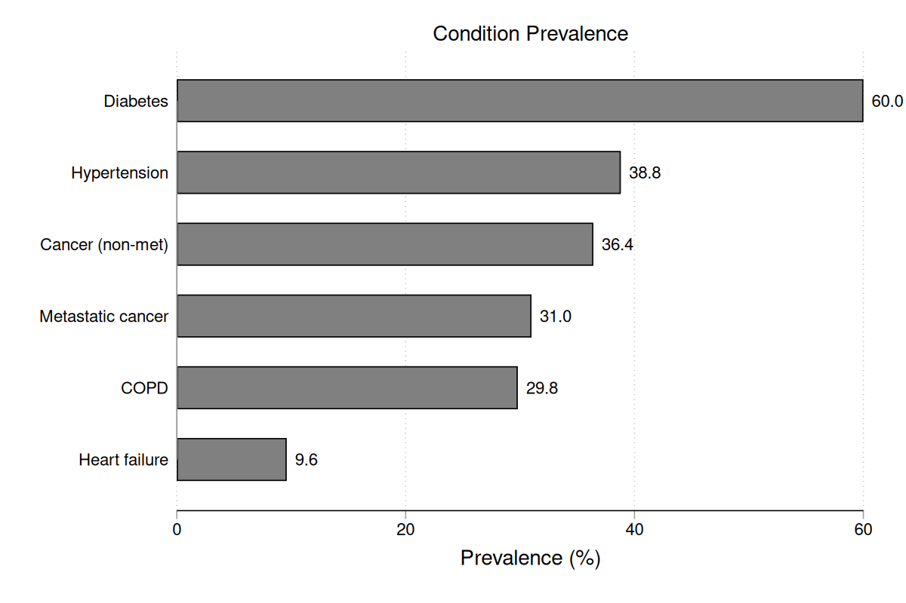

# codescan — Scan wide-format code fields without reshaping

**Version 4.1.5** | 2026-08-19

`codescan` scans wide-format diagnosis, procedure, medication, registry, and claims code slots with anchored regex or prefix rules and produces row-level indicators, counts, patient-level summaries, and exports. `codescan_describe` inventories the codes first so you can draft rules from the data you actually have.

## Quick Start

This self-contained example runs after installation and shows inventory, row-level matching, and patient-level output.

```stata
clear
input long pid str6 dx1 str6 dx2
1 "E110" "I10"
1 "Z00"  "E119"
2 "I50"  ""
2 "E102" ""
3 "Z00"  ""
end

codescan_describe dx1 dx2
codescan dx1 dx2, define(dm2 "E11" | htn "I1[0-35]")
codescan dx1 dx2, define(dm2 "E11" | htn "I1[0-35]") id(pid) collapse replace
matrix list r(summary)
```

The first `codescan` call leaves one indicator per condition on each row; the second reduces the data to one row per `pid`. `r(summary)` reports the counts and prevalence for the final analysis unit.

## Requirements

- Stata 16 or later
- No external package dependencies

## Installation

```stata
capture ado uninstall codescan
net install codescan, from("https://raw.githubusercontent.com/tpcopeland/Stata-Tools/main/codescan") replace
```

## Commands

| Command | Description |
|---------|-------------|
| `codescan` | Scan wide-format code variables and generate indicators, counts, or patient-level summaries |
| `codescan_describe` | Inspect the raw code inventory before writing scan rules |

## How It Works

The usual workflow is to inspect the inventory, draft a small rule set, verify row-level matches, choose the output shape, and then add windows, date summaries, diagnostics, or file outputs.

### Variable lists

The words between the command and the comma are a normal Stata varlist. Explicit names work for a few slots, ranges such as `dx1-dx30` work for adjacent variables, and wildcards such as `dx*` select every matching variable.

```stata
codescan dx1 dx2 dx3, define(dm2 "E11")
codescan dx1-dx30, define(dm2 "E11")
codescan dx*, define(dm2 "E11")
codescan dx1-dx30 proc1-proc20, define(dm2 "E11" | proc "XF001")
```

Run separate scans with `generate()` when diagnosis, procedure, or medication fields need different rule sets and output names.

### Matching rules

`mode(regex)` is the default. Every inclusion and exclusion pattern is anchored at the start of the code, so `"E11"` matches `E110` and `E119` but not `AE11`; character classes and alternation are supported. `mode(prefix)` treats pipe-separated tokens as simple starts-with prefixes and is useful when regex features are unnecessary.

The unquoted `|` in `define()` separates conditions, while a `|` inside a quoted pattern is part of that regex or prefix list. Use `~` after an inclusion pattern for exclusions, for example `define(dm2 "E11" ~ "E116")`.

Regex patterns that can match without consuming a character are rejected because an anchored empty match would identify every code; empty alternatives in prefix lists are rejected for the same reason. In `mode(regex)`, use `.` to match any nonempty code rather than `.*`; in `mode(prefix)`, a period is literal. `nocase` enables unicode-aware case-insensitive matching, and `nodots` removes periods from the data before matching without changing the stored data.

## Choosing a Workflow

| Goal | Call pattern | Result |
|------|--------------|--------|
| Inspect the raw code distribution | `codescan_describe dx1-dx30` | Top codes and first-character chapter counts |
| Audit rules on encounters | `codescan ...` without `collapse` or `merge` | Original rows plus condition variables |
| Build one row per patient or entity | `codescan ..., id(pid) collapse` | One row per `id()` |
| Keep encounters and attach patient flags | `codescan ..., id(pid) merge` | Original rows plus patient-level results |
| Keep the active data unchanged | Add `frame(results)` or `preserve` | A named result frame or restored data |
| Save the prevalence table | Add `export(results.xlsx, replace)` | CSV or Excel summary |
| Save the transformed dataset | Add `saving(results.dta, replace)` | The final collapsed or merged result dataset |

`frame(name)` implies `preserve`; add `replace` when the named frame already exists. `save()` writes reusable rule definitions, whereas `saving()` writes the transformed result dataset.

## Worked Examples

The examples below use this small wide-format dataset. Run the setup before each example that changes the data in memory.

```stata
clear
input long pid str6 dx1 str6 dx2 str6 proc1 double visit_dt double index_dt
1 "E110" "I10"  "XF001" 21914 21915
1 "Z00"  "E119" ""      21880 21915
2 "I50"  ""     "JFB10" 21900 21915
2 "E102" ""     ""      22020 21915
3 "Z00"  ""     ""      21910 21915
end
format visit_dt index_dt %td
```

### 1. Inspect the inventory

Start with `codescan_describe` when you do not yet know which code values or first-character chapters occur in the selected slots.

```stata
codescan_describe dx1 dx2, top(10)
matrix list r(top_codes)
```

The command returns the ranked code table in `r(top_codes)` and the first-character summary in `r(chapters)`.

### 2. Create row-level indicators

The default regex mode anchors each rule at the start of every selected code value and creates one 0/1 variable per condition.

```stata
codescan dx1 dx2, define(dm2 "E11" | htn "I1[0-35]" | chf "I50") replace
```

### 3. Collapse within a time window

Use `id()` and daily Stata dates when the analysis unit is a patient or other entity. `alldates` requests the first, last, and unique qualifying dates for each condition.

```stata
codescan dx1 dx2, id(pid) date(visit_dt) refdate(index_dt) ///
    define(dm2 "E11" | htn "I1[0-35]" | chf "I50") ///
    lookback(365) inclusive collapse alldates replace
```

### 4. Match procedure prefixes and avoid name collisions

In prefix mode, pipe-separated tokens are alternative prefixes. `generate()` keeps a procedure scan separate from other condition variables.

```stata
codescan proc1, define(mammo "XF001|XF002" | colectomy "JFB|JFH") ///
    mode(prefix) generate(proc_) replace
```

### 5. Exclude specific codes and save reusable rules

Use `~` for exceptions and `save()` to write the parsed inline definitions to a CSV. The second call reads that CSV as a reusable codefile.

```stata
codescan dx1 dx2, define(dm2 "E11" ~ "E116" | htn "I1[0-35]") ///
    save(dm_rules.csv, replace)
codescan dx1 dx2, codefile(dm_rules.csv) replace
```

The CSV contains `name`, `pattern`, `exclusion`, and `label` columns. The first call creates the condition variables, so `replace` permits the codefile call to recreate them.

### 6. Keep the original data in a frame

Use `frame()` when the encounter-level data must remain available alongside a collapsed patient-level result.

```stata
codescan dx1 dx2, define(dm2 "E11" | htn "I1[0-35]") id(pid) ///
    collapse frame(results) replace
frame results: list
```

### 7. Compare hits with positive units

`countmode` stores the number of matching code slots rather than binary indicators. `r(summary)` separates those slot hits from the number of observations or IDs with at least one hit.

```stata
codescan dx1 dx2, define(dm2 "E11") id(pid) collapse countmode replace
matrix list r(summary)
```

Add `detail allslots` in a row-level scan when every matching slot should be credited independently; without `allslots`, binary detail is attributed to the first matching variable in varlist order.

### 8. Run sensitivity windows and write deliverables

Several `lookback()` values require `collapse` or `merge` and return prevalence by window plus the denominator behind each window. The Excel export gets a second sheet when `cooccurrence` is also requested.

```stata
codescan dx1 dx2, id(pid) date(visit_dt) refdate(index_dt) ///
    define(dm2 "E11" | htn "I1[0-35]") ///
    lookback(90 365) inclusive collapse cooccurrence replace ///
    export(codescan_results.xlsx, replace) ///
    saving(codescan_results.dta, replace) format(%9.2f)
matrix list r(sensitivity)
matrix list r(sensitivity_n)
```

## Demo

The checkout demo `demo/demo_codescan.do` creates synthetic administrative data, produces the prevalence chart and Excel workbook below, and can be run from the Stata-Tools repository root, the `codescan` directory, or `codescan/demo/`. It optionally uses `tc_schemes` when already installed and installs the local codescan source into the caller's PLUS directory, so restore your usual codescan installation afterward if needed.



The workbook [`demo/codescan_results.xlsx`](demo/codescan_results.xlsx) contains a summary sheet and a co-occurrence sheet. The image and workbook are regenerated by the named demo script; they are repository checkout assets, not files installed by `net install`.

## Command Reference

### `codescan`

```stata
codescan varlist [if] [in], define(string asis) | codefile(string) [options]
```

Exactly one of `define()` or `codefile()` is required. Inline definitions use `name "pattern" [~ "exclusion" ...] | name2 "pattern2"`; a codefile is a CSV or Stata dataset with string `name` and `pattern` columns and optional string `exclusion` and `label` columns (column names are case-insensitive). Condition names must be valid, unique Stata names no longer than 26 characters so generated date/count suffixes remain within Stata's name limit.

### `codescan_describe`

```stata
codescan_describe varlist [if] [in] [, top(#) nodots tostring save(filename [, replace])]
```

The command pools nonempty values across all selected variables, excluding the bare `.` placeholder, reports the most frequent codes, and groups all codes by their first character. Use `save()` to write a draft CSV with one row per first-character chapter, then edit the names, patterns, exclusions, and labels before using it with `codescan, codefile()`. When the inventory is empty, `save()` writes the four-column header with no data rows.

## Key Options

### Definition source

| Option | Use |
|--------|-----|
| `define()` | Supply inline condition definitions separated by an unquoted pipe |
| `codefile()` | Read string `name` and `pattern` definitions from CSV or `.dta`, with optional `exclusion` and `label` columns |
| `label()` | Add presentation labels using `\` between entries; labels do not change condition identifiers |
| `save()` | With `codescan`, write `define()` rules (not `codefile()`) to `.csv`; with `codescan_describe`, write a chapter draft; use the `replace` suboption to overwrite a file |

### Identifiers and windows

| Option | Use |
|--------|-----|
| `id()` | Identify patients or entities for `collapse` and `merge` |
| `date()` | Supply a numeric Stata daily event-date variable; required for windows and date summaries |
| `refdate()` | Supply the numeric daily reference date for `lookback()` or `lookforward()` |
| `lookback()` | Restrict matches to one or more nonnegative backward windows; requires `date()` and `refdate()`; multiple windows require `collapse` or `merge` |
| `lookforward()` | Restrict matches to a nonnegative forward window; requires `date()` and `refdate()` |
| `inclusive` | Include `refdate()` in a single-direction window; with both directions it is already included |

### Result dataset

| Option | Use |
|--------|-----|
| `collapse` | Reduce the active data to one row per `id()` |
| `merge` | Attach patient-level results to the original row structure; fully excluded IDs receive missing values |
| `earliestdate` | Create `<condition>_first` variables from qualifying daily dates |
| `latestdate` | Create `<condition>_last` variables from qualifying daily dates |
| `countdate` | Create `<condition>_count` variables counting unique qualifying dates |
| `countrows` | Create `<condition>_nrows` variables counting qualifying rows or slot hits under `countmode` |
| `alldates` | Shorthand for `earliestdate latestdate countdate` |
| `preserve` | Restore the original data after patient-level processing |
| `frame()` | Store the final result in a named frame and imply `preserve` |
| `saving()` | Save the final collapsed or merged dataset to `.dta` |

### Diagnostics and reporting

| Option | Use |
|--------|-----|
| `detail` | Display and return per-variable match contributions in `r(varcounts)`; default attribution is the first matching slot per row |
| `allslots` | With `detail`, count every matching slot instead of the first matching variable; requires `detail`; `countmode` uses this rule automatically |
| `cooccurrence` | Return pairwise condition counts in `r(cooccurrence)` and add a sheet to an Excel export; counts rows or unique IDs according to output shape |
| `unmatched()` | Create a row-level flag: 1 analyzed and unmatched, 0 analyzed and matched, `.` not analyzed |
| `matched_code()` | Create a row-level string containing the first code that survived matching |
| `graph` | Draw a horizontal prevalence bar chart |
| `export()` | Write the summary to `.csv` or `.xlsx` with an optional `replace` suboption |
| `format()` | Set the prevalence display and export format; default is `%9.1f` |

### Matching behavior and naming

| Option | Use |
|--------|-----|
| `mode()` | Choose `regex` (default, anchored and unicode-aware) or `prefix` |
| `level()` | Truncate inclusion prefixes to 1–10 characters in `mode(prefix)`; exclusions remain full precision |
| `nocase` | Use unicode-aware case-insensitive matching |
| `nodots` | Remove periods from values before matching or tabulating |
| `tostring` | Scan numeric code variables through temporary strings while leaving the originals unchanged |
| `countmode` | Store integer code-slot counts instead of binary indicators |
| `generate()` | Prefix all generated condition and summary variable names |
| `replace` | Allow overwriting planned output variables or an existing `frame()` |
| `noisily` | Display per-condition progress and match totals |

### `codescan_describe` options

| Option | Use |
|--------|-----|
| `top()` | Set the number of ranked codes to display; default is `top(20)` |
| `nodots` | Remove periods before tabulating, so dotted and undotted values are pooled |
| `tostring` | Convert numeric code variables temporarily before tabulating |
| `save()` | Write the chapter summary as a draft CSV codefile |

File options accept ordinary quoted paths with spaces or hyphens, reject unsafe shell/control characters, and never overwrite an existing file without the option-specific `replace` suboption.

## Stored Results

### `codescan`

| Result | Meaning |
|--------|---------|
| `r(N)` | Analyzed observations, or unique `id()` values after `collapse` or `merge` |
| `r(n_conditions)` | Number of conditions |
| `r(collapsed)` | 1 when `collapse` was used, otherwise 0 |
| `r(merged)` | 1 when `merge` was used, otherwise 0 |
| `r(mode_count)` | 1 when `countmode` was used, otherwise 0 |
| `r(detail_allslots)` | 1 when `r(varcounts)` used all-slot attribution; returned with `detail` |
| `r(lookforward)` | Requested forward-window length, when specified |
| `r(n_excluded_missingdate)` | Rows excluded from a window because `date()` or `refdate()` was missing |
| `r(conditions)` | Condition names in output order |
| `r(newvars)` | Created variables left in memory on exit |
| `r(varlist)` | Scanned variables |
| `r(mode)` | `regex` or `prefix` |
| `r(nocase)` | `nocase` when case-insensitive matching was used |
| `r(generate)` | The output prefix supplied to `generate()` |
| `r(define)` | The inline definition string, when `define()` was used |
| `r(codefile)` | The codefile path, when `codefile()` was used |
| `r(id)` | The identifier variable, when specified |
| `r(date)` | The event-date variable, when specified |
| `r(lookback)` | The one lookback value as a scalar, or space-separated values as a macro for multiple windows |
| `r(refdate)` | The reference-date variable when windowing was used |
| `r(frame)` | The result frame name, when `frame()` was used |
| `r(summary)` | Matrix with `count`, `prevalence`, `total_hits`, and `positive_units` columns |
| `r(codelist)` | Legacy exact copy of `r(summary)` |
| `r(varcounts)` | Per-variable match contributions, with `detail`; default attribution is first-slot per row, while `allslots` or `countmode` credits every slot |
| `r(cooccurrence)` | Pairwise condition counts, with `cooccurrence`; rows are counted at row level and unique IDs after `collapse` or `merge` |
| `r(sensitivity)` | Prevalence by condition and lookback window, with multiple windows |
| `r(sensitivity_n)` | The denominator for each `r(sensitivity)` column |

Without `countmode`, `total_hits` is missing because binary matching does not count repeated slots; `count` then represents `positive_units`. With `countmode`, `count` and `total_hits` are slot hits, while `positive_units` is the number of observations or IDs with at least one hit. `r(newvars)` is empty after `preserve` or `frame()` because the active data are restored.

When `detail` is requested, `r(detail_allslots)` records the attribution used for `r(varcounts)`: it is 1 for `allslots` or `countmode`, and 0 for default first-slot attribution.

Before publishing a successful result set, `codescan` clears prior `r()` contents. A successful call that omits `detail` therefore does not retain `r(detail_allslots)` or `r(varcounts)` from an earlier call; both are absent unless `detail` is specified.

### `codescan_describe`

| Result | Meaning |
|--------|---------|
| `r(n_unique)` | Number of unique nonempty codes, excluding the bare `.` placeholder |
| `r(n_entries)` | Number of nonempty, non-`.` code entries across scanned variables |
| `r(n_vars)` | Number of variables scanned |
| `r(varlist)` | Scanned variables |
| `r(top_codes)` | Matrix with `frequency`, `percent`, and `cumul_pct` columns |
| `r(chapters)` | Matrix with `codes` and `entries` columns grouped by first character |
| `r(top_code_#)` | Exact code value for each displayed `r(top_codes)` row; needed when a code is too long for a Stata matrix row name |

The displayed tables, returned matrices, and draft codefile are ordered by descending frequency with alphabetical tie-breaking, so repeated runs over the same data are deterministic. For a code longer than Stata's 32-character matrix row-name limit, `r(top_codes)` uses a bounded alias; use the matching `r(top_code_#)` macro to recover the exact code value.

## Assumptions and Limits

- The reported prevalence is the prevalence of the supplied code definition, not the prevalence of the underlying disease; positive predictive value and sensitivity of the codes determine the gap between the two.
- Scan variables must be fixed-width strings; `tostring` handles numeric variables through temporary strings, while `strL` variables are rejected and should be converted first.
- Empty strings and the bare `.` placeholder are skipped as code values; with `nodots`, values that become empty after periods are removed are skipped too.
- `date()` and `refdate()` must be numeric Stata daily dates; datetime variables such as `%tc` are rejected because windows are measured in days.
- Missing `id()` values are excluded from `collapse` and `merge`, and rows with missing dates are excluded whenever a time window is active.
- `unmatched()` and `matched_code()` are row-level outputs and are not retained after `collapse`; use `merge` when they must remain with encounter rows.
- Rules apply equally to every variable in the varlist; when first-listed diagnosis validity matters, scan positions separately or use distinct `generate()` prefixes.
- Labels are presentation text only: identifiers in `r(conditions)`, matrix row names, and the export `condition` column remain the condition names.

## Troubleshooting

| Symptom | Likely cause and fix |
|---------|----------------------|
| `not a string variable` | Add `tostring` or convert the code variable to a fixed-width string |
| `collapse requires id()` | Supply the patient or entity identifier with `id()` |
| Window options require dates | Supply numeric daily `date()` and `refdate()` variables |
| `variable ... already exists` | Add `replace` only when overwriting the planned output is intended |
| `file already exists` or `r(602)` | Add the option-specific file suboption, for example `export(results.xlsx, replace)` |
| A condition matches zero observations | Check spelling, anchoring, dots, case, and whether `mode(regex)` or `mode(prefix)` is intended |
| Multi-window `lookback()` fails | Multiple windows require `collapse` or `merge` |

## QA

QA suites and how to run them are documented in [`qa/README.md`](qa/README.md).

## Version History

### 4.1.5 (2026-08-19)

- Fix false-positive prefix matches on multibyte UTF-8 characters (e.g. Nordic ICD codes with `Å`, `Ä`, `Ö`) when `level()` truncated to a byte boundary instead of a character boundary.
- Fix `export()` silently truncating `pattern` and `exclusion` columns at 80 characters; now uses `str244` matching `save()`.
- Fix `codescan_describe` deferring `save()` extension validation until after the full scan; now rejects non-`.csv` filenames before any work.
- Fix `graph` bar label format ignoring user-specified `format()` option.
- Fix duplicate "no observations" error message in `codescan_describe`.

### 4.1.4 (2026-08-13)

- `collapse` no longer discards its own result when a later side effect fails. A failing `export()`, `saving()`, or `graph` used to leave the caller with a dataset holding nothing but `id()`: the rows were already gone to the collapse, and the error path then dropped every indicator. Dropping the outputs is a rollback only while the pre-call data is still there to roll back to, so it is now skipped once `collapse` has consumed the data. The `preserve`, `frame()`, `merge`, and row-level paths are unchanged and still roll back in full.
- `codescan_describe` no longer loses a code or chapter identity in `r(top_codes)` and `r(chapters)`. A row name that cannot survive Stata's macro-expanded `matrix rownames` — one beginning or ending with a space, or containing `"`, `$`, a backquote, or `:` — was silently replaced by Stata's positional default (`r1`, `r2`), so a chapter of `" "` or `":"` came back unidentifiable. Such rows now receive a bounded `_cs_code_#` / `_cs_chapter_#` alias. The previous guard tested length only.
- New `r(chapter_#)` returns the exact leading character for each `r(chapters)` row, in row order, mirroring the existing `r(top_code_#)`. It is the reliable way to read a chapter identity when a row was aliased.

### 4.1.3 (2026-08-10)

- `codescan_describe` now restores `varabbrev` and honors `save()` when the selected observations contain no codes; the resulting draft CSV contains the documented four-column header and no data rows.
- `saving()` with an extension-less filename now applies `.dta` before the overwrite check, so the refusal happens up front instead of after `export()` and `graph` have already written their files.

### 4.1.2 (2026-08-09)

- `codescan_describe` now handles code values longer than Stata's 32-character matrix row-name limit by using bounded row-name aliases while returning each exact displayed code in `r(top_code_#)`.

### 4.1.1 (2026-08-05)

- Clears prior `r()` contents before publishing a successful call, so an omitted `detail` option cannot leak `r(detail_allslots)` or `r(varcounts)`; corrected matching, window, saving, codefile, co-occurrence, and stored-result documentation.

### 4.1.0 (2026-07-25)

- Made `codescan_describe` ordering deterministic by breaking frequency ties alphabetically, including at the `top()` cutoff and in chapter-based draft codefiles.
- Corrected `r(detail_allslots)` under `countmode`, rejected explicit negative `lookforward()` and zero `level()` inputs, and rejected dotted prefix patterns when `nodots` would make them impossible to match.
- Widened `matched_code()` to the widest scanned fixed string up to `str2045`, rejected repeated lookback windows, and added a note when row-level outputs are discarded by `collapse`.

### 4.0.1 (2026-07-18)

- Fixed `saving()` under `merge` so internal temporary variables are not written, made the Mata engine reload after `mata clear`, rejected case-variant duplicate names, and added a clear guard for datetime window variables.

### 4.0.0 (2026-07-17)

- Removed confidence intervals from the console, matrices, and exports; prevalence and the other stored results were unchanged apart from the removed CI fields.

### 3.0.0 (2026-07-17)

- Added transactional output handling, three-state `unmatched()`, richer labels and exports, `allslots`, and `countmode`; malformed or empty-matching regex rules now error instead of producing silent cohorts.

### 2.0.0 (2026-06-19)

- Removed the former comorbidity-scoring features; `codescan` is now a pure wide-format code-field scanner.

## Author

Timothy P Copeland, Karolinska Institutet

## License

MIT
