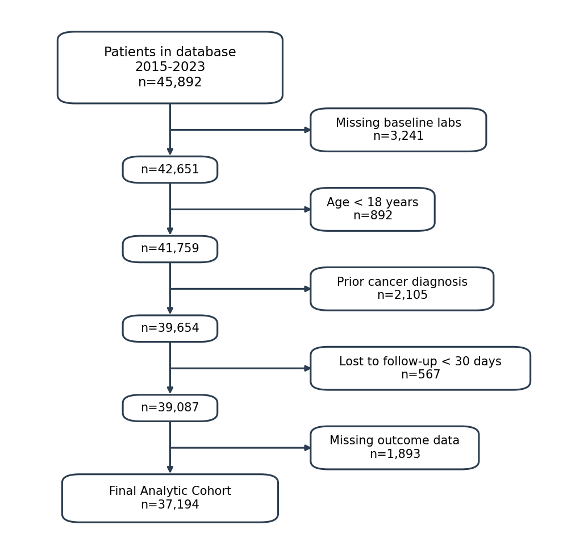

# consort

  

Generate CONSORT-style exclusion flowcharts for observational research directly from Stata.



## Overview

The `consort` command creates publication-ready CONSORT (Consolidated Standards of Reporting Trials) style flowcharts that visualize how observations are excluded from your dataset during data cleaning. This is essential for transparent reporting in observational research.

## Installation

```stata
net install consort, from("https://raw.githubusercontent.com/tpcopeland/Stata-Tools/main/consort")
```

### Requirements

- **Stata**: Version 16 or higher recommended
- **Python**: Version 3.6 or higher with matplotlib

To install matplotlib:
```bash
pip install matplotlib
```

Or in Stata:
```stata
shell pip install matplotlib
```

## Quick Start

```stata
* Load your data
use patient_data, clear

* Initialize the diagram
consort init, initial("All patients in database 2015-2023")

* Apply exclusions - each drops matching observations and records the step
consort exclude if missing(baseline_lab), label("Missing baseline labs")
consort exclude if age < 18, label("Age < 18 years")
consort exclude if prior_cancer == 1, label("Prior cancer diagnosis")

* Generate the diagram
consort save, output("consort_diagram.png") final("Final Analytic Cohort")
```

## Syntax

### Initialize a diagram

```stata
consort init, initial(string) [file(string)]
```

| Option | Description |
|--------|-------------|
| `initial(string)` | **Required.** Label for the initial population box |
| `file(string)` | Path to store CSV data (default: temp file) |

### Add exclusion steps

```stata
consort exclude if condition, label(string) [remaining(string)]
```

| Option | Description |
|--------|-------------|
| `if condition` | **Required.** Condition identifying observations to exclude |
| `label(string)` | **Required.** Label for the exclusion box |
| `remaining(string)` | Custom label for the remaining population box |

### Generate the diagram

```stata
consort save, output(string) [final(string) shading python(string) dpi(integer)]
```

| Option | Description |
|--------|-------------|
| `output(string)` | **Required.** Output image path (.png recommended) |
| `final(string)` | Label for final cohort box (default: "Final Cohort") |
| `shading` | Enable colored box shading |
| `python(string)` | Path to Python executable |
| `dpi(integer)` | Image resolution (default: 150; use 300 for publication) |

### Clear diagram state

```stata
consort clear [, quiet]
```

## Examples

### Basic workflow

```stata
sysuse auto, clear

consort init, initial("All cars in dataset")
consort exclude if rep78 == ., label("Missing repair record")
consort exclude if foreign == 1, label("Foreign manufacture")
consort save, output("auto_exclusions.png") final("Domestic cars for analysis")
```

### With milestone labels

Mark intermediate stages in your exclusion process:

```stata
use mydata, clear

consort init, initial("Source population")
consort exclude if missing(exposure), label("Missing exposure data") remaining("Exposure cohort")
consort exclude if missing(outcome), label("Missing outcome data") remaining("Complete cases")
consort exclude if followup < 365, label("Less than 1 year follow-up")
consort save, output("figure1.png") final("Study population") shading dpi(300)
```

### Preserving original data

Since `consort exclude` drops observations, preserve your data if needed:

```stata
preserve
consort init, initial("All records")
consort exclude if condition1, label("Criterion 1")
consort exclude if condition2, label("Criterion 2")
consort save, output("diagram.png")
restore
* Original data is back
```

## Stored Results

### consort init

| Result | Description |
|--------|-------------|
| `r(N)` | Initial number of observations |
| `r(initial)` | Initial population label |
| `r(file)` | Path to CSV file |

### consort exclude

| Result | Description |
|--------|-------------|
| `r(n_excluded)` | Number of observations excluded |
| `r(n_remaining)` | Number of observations remaining |
| `r(step)` | Exclusion step number |
| `r(label)` | Exclusion label |

### consort save

| Result | Description |
|--------|-------------|
| `r(N_initial)` | Initial number of observations |
| `r(N_final)` | Final number of observations |
| `r(N_excluded)` | Total number excluded |
| `r(steps)` | Number of exclusion steps |
| `r(output)` | Output file path |
| `r(final)` | Final cohort label |

## How It Works

1. `consort init` records the starting observation count and creates a CSV file
2. Each `consort exclude` drops matching observations and appends to the CSV
3. `consort save` calls a Python script (matplotlib) to render the flowchart

The exclusion data is stored in a simple CSV format that can be edited manually:

```csv
label,n,remaining
All patients 2015-2023,10000,
Missing lab values,234,
Age < 18 years,89,Eligible patients
```

## Troubleshooting

### Python not found

Specify the Python path explicitly:
```stata
consort save, output("diagram.png") python("/usr/local/bin/python3")
```

### matplotlib not installed

```stata
shell pip install matplotlib
```

### Permission errors

Ensure you have write access to the output directory.

## Author

Timothy P Copeland<br>
Department of Clinical Neuroscience<br>
Karolinska Institutet

## License

MIT License

## Version

Version 1.0.1, 2025-12-15
