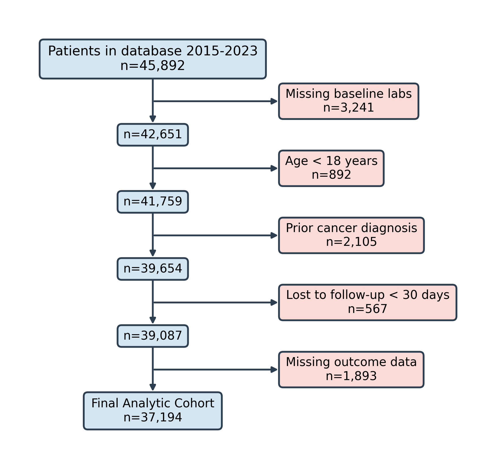
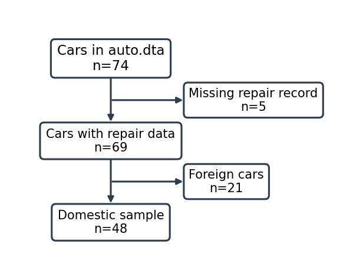

# consort — CONSORT-style exclusion flowcharts for observational research

**Version 1.1.1** | 2026-08-05

`consort` records sequential exclusions from a Stata dataset and renders the resulting participant-flow diagram. It is for analysts who need reproducible exclusion counts, publication-ready flowcharts, and optional machine-readable exports.

## Quick Start

Build a shaded flowchart from Stata's built-in `auto` data:

```stata
sysuse auto, clear
preserve
consort init, initial("Cars in auto.dta")
consort exclude if missing(rep78), label("Missing repair record")
consort exclude if foreign, label("Foreign cars")
consort save, output("consort_auto.png") final("Domestic analytic sample") shading
restore
```

The workflow writes `consort_auto.png` in the current working directory and restores the original data after the diagram is saved. Python 3 with `matplotlib` must be available to Stata's shell; see [Requirements](#requirements) if it is not installed.

## Requirements

- Stata 16.0 or later
- Python 3.7 or later, available to the shell launched by Stata
- Python package `matplotlib`

The bundled `consort_diagram.py` renderer uses only `matplotlib`. The `xlsx()` export is written by Stata and does not require an additional Python package such as `openpyxl`.

Install `matplotlib` into the same Python environment that Stata will call:

```bash
python -m pip install matplotlib
```

Use `python3 -m pip install matplotlib` when `python3` is the executable available on your system, or specify the executable with `python()` in `consort save`.

## Installation

Install the released package from Stata-Tools:

```stata
capture ado uninstall consort
net install consort, from("https://raw.githubusercontent.com/tpcopeland/Stata-Tools/main/consort") replace
```

The installation includes both `consort.ado` and the bundled `consort_diagram.py` renderer. Check the installation with:

```stata
which consort
help consort
```

## Commands

| Command | Description |
|---------|-------------|
| `consort` | Manage a stateful exclusion workflow and generate a CONSORT-style flowchart |

The command has four subcommands: `init`, `exclude`, `save`, and `clear`.

## How It Works

1. `consort init` records the current observation count and creates a backing CSV with the initial population label.
2. `consort exclude` counts observations matching an `if` condition, records the exclusion, and drops those observations from the active dataset.
3. `consort save` updates the final label, calls the bundled Python renderer, and optionally writes resolved CSV and Excel tables alongside the image.
4. `consort clear` abandons the active workflow and removes temporary state without generating a figure.

Exclusions are applied sequentially, so each later condition acts on the observations that remain after earlier exclusions. A condition matching zero observations is reported and skipped: no observations are dropped, no backing-CSV row is added, and the exclusion-step counter is not incremented. A successful `save` clears the active workflow state.

## Worked Examples

### 1. Basic workflow with a milestone label

Use `remaining()` to label an important intermediate population rather than displaying only its count.

```stata
sysuse auto, clear
preserve

consort init, initial("Cars in auto.dta")
consort exclude if missing(rep78), label("Missing repair record") remaining("Cars with repair data")
consort exclude if foreign, label("Foreign cars")
consort save, output("consort_milestones.png") final("Domestic analytic sample")

restore
```

### 2. High-resolution shaded output with an explicit Python executable

Pass the executable name or full path when Stata does not see the Python installation you want to use. `dpi(300)` is suitable for many print workflows.

```stata
sysuse auto, clear
preserve

consort init, initial("Cars in auto.dta")
consort exclude if missing(rep78), label("Missing repair record")
consort exclude if foreign, label("Foreign cars")
consort save, output("consort_300dpi.png") python("python3") shading dpi(300)

restore
```

### 3. Export resolved CSV and Excel data with the figure

Request either or both companion tables with `csv()` and `xlsx()`. Both exports contain one resolved row per diagram node.

```stata
sysuse auto, clear
preserve

consort init, initial("Cars in auto.dta")
consort exclude if missing(rep78), label("Missing repair record") remaining("Cars with repair data")
consort exclude if foreign, label("Foreign cars")
consort save, output("flow.png") final("Domestic sample") csv("flow.csv") xlsx("flow.xlsx")

restore
```

### 4. Keep and inspect the intermediate backing CSV

Use `file()` when you want the raw exclusion record available for inspection or controlled editing before `save`.

```stata
sysuse auto, clear
preserve

tempfile consort_backing
consort init, initial("Cars in auto.dta") file("`consort_backing'")
consort exclude if missing(rep78), label("Missing repair record")
consort exclude if foreign, label("Foreign cars")
consort save, output("consort_from_backing.png") final("Domestic sample")

restore
```

## Demo

From a Stata-Tools checkout, run `stata-mp -b do consort/demo/demo_consort.do` from the repository root to regenerate the shipped figures and the CSV/XLSX export example. The demo script is a checkout workflow for documentation assets; it is not part of the `net install` payload.

| Output | Focus |
|--------|-------|
|  | Sequential exclusions, shading, and high-DPI output |
|  | `csv()` and `xlsx()` output from the same workflow |

## Command Reference

### `consort init`

```stata
consort init, initial(string) [file(filename)]
```

Starts a diagram with the current number of observations. With no `file()`, the command uses a temporary backing CSV; with `file()`, it writes the raw exclusion record to the requested path. Only one diagram can be active at a time.

### `consort exclude`

```stata
consort exclude if exp, label(string) [remaining(string)]
```

Counts and drops observations satisfying `if exp`, then appends the exclusion label and count to the backing CSV. The `remaining()` label applies to the population box after that step. The command requires an active diagram.

### `consort save`

```stata
consort save, output(filename) [final(string) shading python(path) dpi(#) csv(filename) xlsx(filename)]
```

Renders the backing CSV through `consort_diagram.py` and writes the image to `output()`. At least one nonempty exclusion step is required. The output directory and any directories used by `csv()` or `xlsx()` must already exist.

The optional data exports are resolved from the same backing CSV used for the figure. They contain `step`, `cohort_label`, `n_remaining`, `exclusion_label`, `n_excluded`, and `pct_of_initial`.

### `consort clear`

```stata
consort clear [, quiet]
```

Removes the active diagram state and deletes a temporary backing CSV. The `quiet` option suppresses the confirmation message. An explicitly supplied `file()` is not treated as temporary.

## Key Options

### Initialization options

| Option | Default | Description |
|--------|---------|-------------|
| `initial(string)` | Required | Label for the initial population box |
| `file(filename)` | Temporary CSV | Path for the raw backing CSV with `label,n,remaining` columns; the parent directory must already exist |

### Exclusion options

| Option | Default | Description |
|--------|---------|-------------|
| `label(string)` | Required | Label for the observations excluded by the `if` condition |
| `remaining(string)` | Empty | Label for the remaining population box after the exclusion; intermediate boxes without it show the count only |

### Save options

| Option | Default | Description |
|--------|---------|-------------|
| `output(filename)` | Required | Image path; PNG is recommended, and other formats supported by `matplotlib` may work |
| `final(string)` | `"Final Cohort"` when no final milestone label exists | Label for the last population box; an explicitly supplied value overrides a `remaining()` label on the last exclusion |
| `shading` | Off | Applies light-blue shading to flow boxes and light-red shading to exclusion boxes |
| `python(path)` | `python3` on Unix when found, otherwise `python` | Python executable or path used to run the bundled renderer |
| `dpi(#)` | `150` | Positive image resolution in dots per inch |
| `csv(filename)` | Not written | Writes the resolved diagram table as CSV |
| `xlsx(filename)` | Not written | Writes the same resolved diagram table as an Excel workbook using Stata |

### Clear options

| Option | Default | Description |
|--------|---------|-------------|
| `quiet` | Off | Suppresses the `consort clear` confirmation message |

## Stored Results

`consort init` returns:

| Result | Type | Meaning |
|--------|------|---------|
| `r(N)` | Scalar | Initial number of observations |
| `r(initial)` | Local macro | Initial population label |
| `r(file)` | Local macro | Backing CSV path |

`consort exclude` returns `r(n_excluded)`, `r(n_remaining)`, and `r(label)` for every call. When at least one observation matches, it also returns `r(step)`; for a zero-match condition, `r(n_excluded)` is `0` and no step is recorded.

| Result | Type | Meaning |
|--------|------|---------|
| `r(n_excluded)` | Scalar | Number of observations excluded in the call |
| `r(n_remaining)` | Scalar | Number of observations remaining after the call, or the current count for a zero-match call |
| `r(step)` | Scalar | Exclusion step number when the call records a step |
| `r(label)` | Local macro | Exclusion label |

`consort save` returns:

| Result | Type | Meaning |
|--------|------|---------|
| `r(N_initial)` | Scalar | Initial number of observations |
| `r(N_final)` | Scalar | Number of observations remaining at save time |
| `r(N_excluded)` | Scalar | Total number excluded |
| `r(steps)` | Scalar | Number of recorded exclusion steps |
| `r(output)` | Local macro | Image output path |
| `r(final)` | Local macro | Final-label argument; defaults to `"Final Cohort"` when `final()` is omitted |
| `r(csv)` | Local macro | CSV export path, only when `csv()` is requested |
| `r(xlsx)` | Local macro | Excel export path, only when `xlsx()` is requested |

When `final()` is omitted and the last exclusion has a nonempty `remaining()` label, that milestone label is retained in the diagram; `r(final)` still reports the default `"Final Cohort"` value.

## Assumptions and Limits

- `consort exclude` permanently drops matching observations from the active dataset. Use `preserve` before `consort init` and `restore` after `consort save` when the original data must remain in memory.
- Exclusions are sequential and their order affects both the counts and the diagram. Do not manually drop or modify observations between `consort exclude` calls unless you intentionally accept responsibility for keeping the recorded counts aligned.
- A zero-match condition is skipped rather than recorded. `consort save` also requires at least one recorded exclusion step.
- Only one diagram can be active at a time. Use `consort clear` to abandon the current state before starting another workflow.
- The output image and requested companion files are replaced when generated. Create their parent directories before calling `consort save`.
- If you edit a backing CSV supplied through `file()`, preserve its `label,n,remaining` structure. The image and resolved exports follow that file, while the Stata summary counts the observations currently in memory.

## Troubleshooting

### Python is not found

Check the executables visible to Stata:

```stata
shell python --version
shell python3 --version
```

Then pass the working executable or full path explicitly:

```stata
consort save, output("diagram.png") python("/usr/local/bin/python3")
```

### `matplotlib` is not installed

Install it into the environment used by the same executable passed to `python()`:

```stata
shell python -m pip install matplotlib
```

Use `shell python3 -m pip install matplotlib` when `python3` is the executable Stata can access.

### The output directory does not exist

Create the directory before saving, or write the output to the current working directory:

```stata
capture mkdir "results"
consort save, output("results/diagram.png")
```

The directories for `csv()` and `xlsx()` must also exist before `save` runs.

### No exclusion step is recorded

Confirm that `consort init` ran successfully and that at least one `if` condition matches observations. Conditions matching zero observations are deliberately skipped and do not satisfy the requirement for `consort save`.

## References

The package uses the CONSORT naming convention for participant-flow diagrams; consult the [CONSORT Statement](https://www.consort-spirit.org/) and the reporting guidance for your study design when adapting the figure.

## QA

QA suites are available in [`qa/`](qa/).

## Version History

- **1.1.1** (2026-08-05): Clarify final-label return behavior, output-directory requirements, and runnable help examples.
- **1.1.0** (2026-06-24): Add `csv()` and `xlsx()` options to `consort save` for writing a resolved, machine-readable table of the diagram data (one row per node) alongside the figure; paths returned in `r(csv)`/`r(xlsx)`
- **1.0.0** (2026-04-08): Initial Stata-Tools release for stateful CONSORT-style flowchart generation from Stata

## Author

Timothy P Copeland, Karolinska Institutet

## License

MIT
