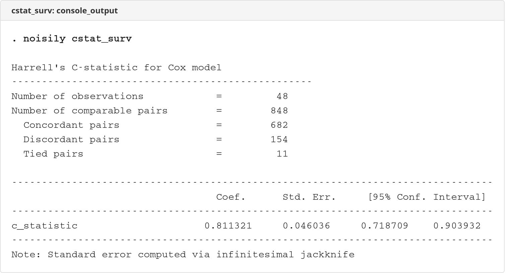

# cstat_surv

  

Calculate Harrell's C-statistic for survival models.

## Description

`cstat_surv` calculates the C-statistic (concordance statistic) for survival models after fitting a Cox proportional hazards model. The C-statistic measures the model's ability to discriminate between subjects who experience the event and those who do not.

The command must be run immediately after fitting a Cox model with `stcox`. It calculates the C-statistic directly by comparing all comparable pairs of observations, accounting for censoring in survival data.

### C-statistic Interpretation

The C-statistic ranges from 0 to 1:
- **C = 0.5**: No discrimination (random predictions)
- **C > 0.7**: Acceptable discrimination
- **C > 0.8**: Excellent discrimination

The C-statistic is equivalent to the area under the ROC curve (AUC) for binary outcomes and represents the probability that, for a randomly selected comparable pair, the model assigns a higher risk to the subject who experienced the event earlier.

## Screenshots

### Console Output


## Installation

```stata
net install cstat_surv, from("https://raw.githubusercontent.com/tpcopeland/Stata-Tools/main/cstat_surv")
```

## Syntax

```stata
cstat_surv [, level(#)]
```

Must be run immediately after `stcox`.

### Options

- **`level(#)`** — set confidence level; default is `level(95)` or as set by `set level`

## Requirements

1. Stata 16.0 or higher
2. Your data must be `stset` before running the Cox model
3. You must have just run `stcox` in the current session

## How It Works

The command works by:

1. Predicting hazard ratios from the fitted Cox model
2. Comparing all comparable pairs of observations
3. Calculating concordance (pairs where higher predicted risk corresponds to earlier event)
4. Computing standard errors via infinitesimal jackknife

A pair of observations is comparable if the observation with the shorter survival time experienced the event. For tied survival times where both subjects experienced events, each possible ordering is counted as half concordant and half discordant.

## Examples

### Basic Example

Setup:
```stata
webuse drugtr
stset studytime, failure(died)
```

Fit a Cox proportional hazards model:
```stata
stcox age drug
```

Calculate the C-statistic:
```stata
cstat_surv
```

The output displays the C-statistic with standard error and 95% confidence interval, along with pair comparison statistics.

### More Complex Example

```stata
* Load cohort with treatment and comorbidities
use _data/cohort.dta, clear
merge 1:1 id using _data/treatment.dta, nogen keep(match)
merge 1:1 id using _data/comorbidities.dta, nogen keep(match)

* Merge outcomes
merge 1:1 id using _data/outcomes.dta, nogen

* Create event indicator and follow-up time
gen byte cv_event = (cv_event_date < . & cv_event_date <= study_exit)
gen double fu_time = cond(cv_event, cv_event_date, study_exit) - study_entry
replace fu_time = fu_time / 365.25

* Declare survival data and drop excluded obs
stset fu_time, failure(cv_event)
drop if _st == 0

* Fit Cox model with multiple predictors
stcox treated index_age i.female i.education diabetes hypertension

* Calculate model discrimination
cstat_surv

* Interpret results:
* C > 0.7 suggests good predictive ability
```

## Stored Results

`cstat_surv` stores the following in `e()`:

### Scalars

| Result | Description |
|--------|-------------|
| `e(c)` | C-statistic |
| `e(se)` | Standard error (infinitesimal jackknife) |
| `e(ci_lo)` | Lower bound of confidence interval |
| `e(ci_hi)` | Upper bound of confidence interval |
| `e(df_r)` | Degrees of freedom |
| `e(somers_d)` | Somers' D statistic (= 2C - 1) |
| `e(N)` | Number of observations |
| `e(N_comparable)` | Number of comparable pairs |
| `e(N_concordant)` | Number of concordant pairs (may be fractional with tied times) |
| `e(N_discordant)` | Number of discordant pairs (may be fractional with tied times) |
| `e(N_tied)` | Number of tied pairs |
| `e(level)` | Confidence level |

### Macros

| Result | Description |
|--------|-------------|
| `e(cmd)` | `cstat_surv` |
| `e(depvar)` | `_t` |
| `e(title)` | Harrell's C-statistic |
| `e(vcetype)` | Jackknife |

### Matrices

| Result | Description |
|--------|-------------|
| `e(b)` | Coefficient vector (C-statistic) |
| `e(V)` | Variance-covariance matrix |

## Author

Timothy P Copeland<br>
Department of Clinical Neuroscience<br>
Karolinska Institutet

## License

MIT License

## Version

Version 1.0.0, 2026-04-08

## See Also

- [stcox](https://www.stata.com/manuals/ststcox.pdf) - Cox proportional hazards regression
- [stset](https://www.stata.com/manuals/ststset.pdf) - Declare survival-time data
