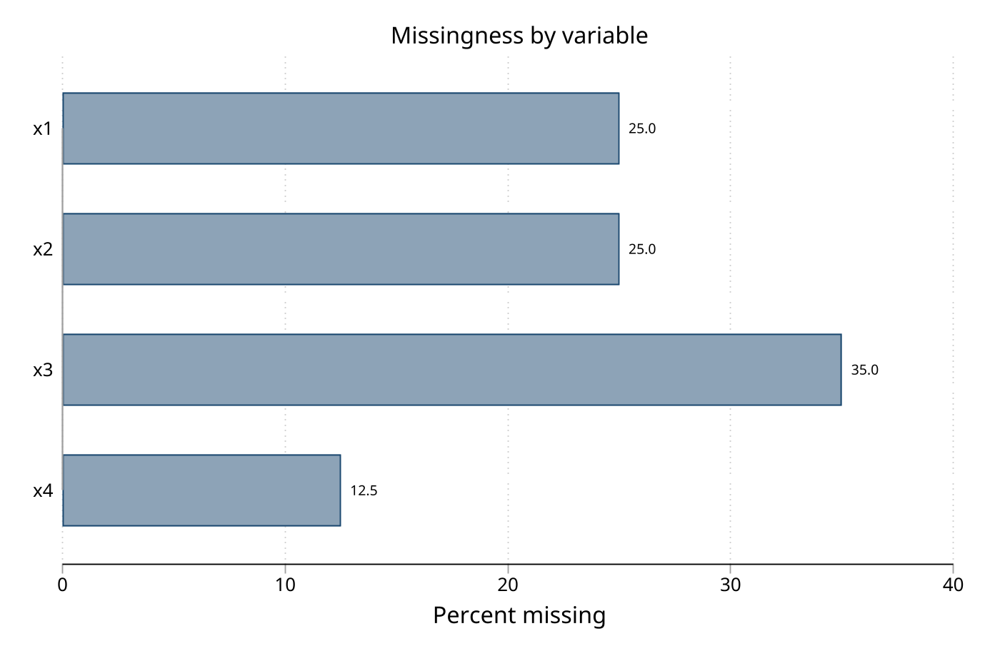

# datamap — Privacy-safe dataset maps and Markdown dictionaries

**Version 1.5.2** | 2026-07-09

`datamap` documents Stata datasets without exporting row-level data. It produces four kinds of output:

- **`datamap`** writes structured text or JSON designed for LLM prompts, internal data handoffs, or automated pipelines. It includes privacy controls (`exclude()`, `datesafe`, `mincell()`), likely-identifier warnings, compact output, automatic structure detection (panel, survival, survey), data quality flags, and missing-data summaries.
- **`datadict`** writes a Markdown data dictionary suitable for GitHub, documentation sites, or conversion to PDF/Word/HTML via Pandoc. It includes document metadata (`title()`, `author()`, `version()`), optional missing-value/statistics/detail columns, structured metadata export via `saving()`, manifests, and separate-output routing with `outdir()`/`suffix()`.
- **`datacheck`** profiles a dataset to the console — per-class distributions, missingness, and key-structure/uniqueness — and can gate a do-file on declared expectations (`expectn()`, `isid()`, `inrange()`, `notmissing()`, ...), halting with `r(9)` when reality does not match what you declared.
- **`datamvp`** analyzes missing-value patterns: pattern-frequency tables, monotone-missingness tests for multiple imputation, stratified analysis, and missingness graphics (a fork of Jeroen Weesie's `mvpatterns`). `datacheck`'s `patterns` option calls it.

`datamap`, `datadict`, and `datacheck` share one classification engine and preserve the dataset in memory. `datamap` and `datadict` accept data in memory, a single `.dta` file, a directory scan, or a named file list; `datadict` also accepts line-delimited manifests for path-safe batch dictionaries.

## Requirements

- Stata 16 or later
- [Pandoc](https://pandoc.org/) (optional) — only needed if you want to convert `datadict` Markdown output to PDF, HTML, or Word

## Installation

```stata
capture ado uninstall datamap
net install datamap, from("https://raw.githubusercontent.com/tpcopeland/Stata-Tools/main/datamap") replace
```

## Commands

| Command    | Output format | Purpose |
|------------|---------------|---------|
| `datamap`  | Plain text or JSON | LLM context, internal documentation, QA, privacy-controlled sharing, automated metadata pipelines |
| `datadict` | Markdown      | GitHub repos, report appendices, Pandoc conversion, IRB submissions |
| `datacheck`| Console (+ optional saved profile) | Interactive QC, distribution review, key/uniqueness checks, expectation gates before an analysis or export |
| `datamvp`  | Console + graphics | Missing-value pattern tables, monotone-missingness tests, stratified analysis, missingness graphs |

## How It Works

1. **Choose the input source.** Load data into memory (the default), or point at a file with `single()`, a folder with `directory()`, or a list of names with `filelist()`.
2. **Pick the output command.** Use `datamap` for plain text or `datadict` for Markdown.
3. **Layer on options.** Add privacy controls (`exclude()`, `datesafe`, `mincell()`), classifier overrides (`continuous()`, `categorical()`, `date()`/`datevars()`), reusable project defaults (`config()`), compact output (`compact`), JSON output (`format(json)`), or structured metadata export (`saving()`). Use `datacheck compare()` to detect schema drift against a saved profile.
4. **Write the output.** One combined file by default, or separate files per dataset with `separate`.

## Worked Examples

### 1. Quick text map from data in memory

The fastest starting point. `datamap` inspects the current dataset and writes a text summary to `datamap.txt`.

```stata
sysuse auto, clear
datamap
```

### 2. Quick Markdown dictionary from data in memory

```stata
sysuse auto, clear
datadict
```

This writes `data_dictionary.md` in the current directory.

### 3. Privacy controls with detection and quality checks

For sensitive data, exclude identifiers, suppress exact dates, and enable diagnostics:

```stata
sysuse auto, clear
datamap, exclude(make) quality missing(detail) autodetect output(auto_map.txt)
```

### 4. JSON for a metadata pipeline

```stata
sysuse auto, clear
datamap, format(json) output(auto_map.json)
```

### 5. Markdown dictionary with statistics and metadata

`datadict` is the presentation-oriented companion. Add document metadata and optional columns:

```stata
sysuse auto, clear
datadict, output(auto_dictionary.md) ///
    title("Auto Data Dictionary") ///
    author("Timothy P Copeland, Karolinska Institutet") ///
    missing stats
```

Write structured metadata alongside the Markdown dictionary:

```stata
sysuse auto, clear
datadict price mpg foreign, output(auto_dictionary.md) ///
    detail missing stats datasignature ///
    saving(auto_dictionary_meta, replace)
```

### 6. Document a saved dataset by filename

Both commands work on `.dta` files without loading them first:

```stata
sysuse auto, clear
tempfile auto_example
save `auto_example', replace

datamap, single("`auto_example'") output(auto_example_map.txt)
datadict, single("`auto_example'") output(auto_example_dict.md) title("Saved auto")
```

### 7. Scale up to a directory

Document every `.dta` file in a folder — combined or one file per dataset:

```stata
datamap, directory("analysis_data") recursive output(project_map.txt)
datadict, directory("analysis_data") recursive separate outdir("docs") suffix("_dict")
```

### 8. Interactive QC and an expectation gate with `datacheck`

`datacheck` profiles the data to the console — distributions, missingness, and key structure — and can gate a do-file on declared expectations. Run it as the last line before an analysis:

```stata
sysuse auto, clear

* Descriptive: classify, profile by type, report missingness and key structure
datacheck, id(make)

* Gated: halt the do-file unless the data matches what you declared
datacheck, expectn(74) isid(make) notmissing(mpg weight) inrange(mpg 10 50)
```

The gate evaluates every expectation, prints all violations at once, and exits with `r(9)` (Stata's assertion code) on any failure — or add `warn` to report violations without halting while you build the script.

## Demo

The demo script (`datamap/demo/demo_datamap.do`) builds synthetic datasets, installs `datamap` from the local package manifest, runs the updated syntax, verifies generated file content, and converts console logs to Markdown with `logdoc`.

Run it from the Stata-Tools repo root:

```bash
stata-mp -b do datamap/demo/demo_datamap.do
```

Generated demo artifacts include:

- `demo/datamap_privacy_warning.txt` and `demo/console_privacy.md`
- `demo/datamap_clinical.txt` and `demo/console_clinical.md`
- `demo/datamap_json.json`, `demo/datamap_compact.txt`, and `demo/console_json_compact.md`
- `demo/datamap_missing.txt`
- `demo/datadict_auto.md`
- `demo/datadict_clinical.md` and `demo/console_datadict.md`

### Privacy Controls And Identifier Warnings

This example leaves identifier-like variables unexcluded first so the warning is visible, then reruns with `exclude()`, `datesafe`, `mincell(5)`, `autodetect`, `quality`, `samples(3)`, and detailed missingness.

<details>
<summary>Privacy demo output</summary>

```stata
. datamap, single("datamap/demo/_demo_cohort.dta") ///
>     output("datamap/demo/datamap_privacy_warning.txt") ///
>     exclude(patient_name) compact
```

```
warning: likely identifier variable(s) not in exclude(): patient_id subject_id
Output written to: datamap/demo/datamap_privacy_warning.txt
```

```
DISCLOSURE RISK SUMMARY
-----------------------
Excluded variables: 1
Small-cell threshold: 5
Date-safe mode: off
Likely identifiers not excluded: patient_id subject_id
```

```stata
. datamap, single("datamap/demo/_demo_cohort.dta") ///
>     output("datamap/demo/datamap_clinical.txt") ///
>     exclude(patient_id subject_id patient_name) ///
>     datesafe mincell(5) autodetect quality samples(3) missing(detail)
```

```
DISCLOSURE RISK SUMMARY
-----------------------
Excluded variables: 3
Small-cell threshold: 5
Date-safe mode: on
Likely identifiers not excluded: 0
```

```
Survival Analysis Variables Detected
  Likely time variables: follow_up_time
  Likely event indicators: event
    event rate: 25%

Missing Data Summary
  Variables with >50% missing: 0
  Variables with >10% missing: 3
  Observations with complete data: 79 (49.4%)
```

```
Suppressed frequency cells:
    9 = Satellite clinic: suppressed (<5)
    1 = Present: suppressed (<5)
    1 (Present): suppressed (<5)
```

```
Date-safe sample rows:
| [MASKED] | [MASKED] | [MASKED] | -3 | 1 | 1 | 27.5 | 157 | 1.39 | 83.7 | [DATE SUPPRESSED] | [DATE SUPPRESSED] | .29 | 1 | 1 | 9 | 1 |
```

</details>

### JSON Metadata

`format(json)` writes structured metadata for downstream tools while preserving disclosure controls such as `mincell()` and `datesafe`.

<details>
<summary>JSON demo output</summary>

```stata
. datamap, single("datamap/demo/_demo_cohort.dta") ///
>     output("datamap/demo/datamap_json.json") ///
>     format(json) exclude(patient_id subject_id patient_name) ///
>     datesafe
```

```json
{
  "datamap_version": "1.5.2",
  "format": "json",
  "datasets": [
    {
      "name": "_demo_cohort.dta",
      "observations": 160,
      "variables": 17,
      "privacy": {
        "mincell": 5,
        "datesafe": true,
        "excluded_variables": 3,
        "likely_identifiers_not_excluded": 0
      },
      "class_counts": {
        "categorical": 6,
        "continuous": 6,
        "date": 2,
        "string": 0,
        "excluded": 3
      }
    }
  ]
}
```

</details>

### Compact Output

`compact` keeps the disclosure summary and quick-reference table, then omits guidance-heavy sections.

<details>
<summary>Compact demo output</summary>

```stata
. datamap, single("datamap/demo/_demo_cohort.dta") ///
>     output("datamap/demo/datamap_compact.txt") ///
>     compact exclude(patient_id subject_id patient_name) datesafe
```

```
DISCLOSURE RISK SUMMARY
-----------------------
Excluded variables: 3
Small-cell threshold: 5
Date-safe mode: on
Likely identifiers not excluded: 0

QUICK REFERENCE
----------------------------------------
  Variable                Type      Class          Miss%  Unique
  patient_id              double    excluded        0.0%       .
  subject_id              double    excluded        0.0%       .
  patient_name            str32     excluded        0.0%       .
  age                     double    continuous      0.0%     136
  sex                     double    categorical     0.0%       2
  smoking                 double    categorical    16.3%       3
  site                    double    categorical     0.0%       7
```

</details>

### Missingness And Markdown Dictionaries

The demo also shows `missing(pattern)` for structured missingness and `datadict` with metadata, statistics, and missing-value columns.

<details>
<summary>Missingness and dictionary output</summary>

```stata
. datamap, single("datamap/demo/_demo_missing.dta") ///
>     output("datamap/demo/datamap_missing.txt") ///
>     missing(pattern) quality
```

```
Missing Data Summary
  Variables with >50% missing: 0
  Variables with >10% missing: 4
  Observations with complete data: 38 (47.5%)
```

```stata
. datadict, single("datamap/demo/_demo_cohort.dta") ///
>     output("datamap/demo/datadict_clinical.md") ///
>     title("SYNTH-01 Clinical Trial Data Dictionary") ///
>     author("Timothy P Copeland, Karolinska Institutet") ///
>     missing stats
```

```markdown
# SYNTH-01 Clinical Trial Data Dictionary

| Variable | Label | Type | Missing | Statistics/Values |
|---|---|---|---|---|
| `patient_id` | Patient identifier | Numeric | 0 (0.0%) | N=160<br>Median=100,080; IQR=100,040-100,120 |
| `enroll_date` | Date of enrollment | Date | 0 (0.0%) | N=160<br>Range: 2021/01/02 to 2023/06/16 |
```

</details>

### Console QC And Expectation Gates (datacheck)

`datacheck` profiles the cohort to the console — per-class distributions, missingness, key structure, and quality flags — then re-runs the expectations as a gate. The cohort carries a deliberate `age = -3`, a 120.5% adherence value, and a rare "Satellite clinic" site, so the flags and gate violations are populated.

<details>
<summary>datacheck QC profile and gate output</summary>

```stata
. datacheck age sex smoking bmi pct_adherence site, id(patient_id) outliers(3) rare(5)
```

```
datacheck: 160 obs, 6 variables profiled  (complete cases: 99 = 61.9%)

QUICK REFERENCE
  Variable              Class       Type       Miss%   Unique  Flag
  age                   continuous  double      0.0%      136  outliers
  sex                   categorical double      0.0%        2
  smoking               categorical double     16.3%        3  missing
  bmi                   continuous  double      8.1%      104  missing
  pct_adherence         continuous  double     23.8%      110  missing
  site                  categorical double      0.0%        7  rare

CONTINUOUS
  age:  N=160  mean=57.27  sd=13.43
    min=-3  p25=48.8  p50=56.8  p75=65.35  max=96.8
    1 outlier(s) (0.6%) beyond 3 IQR
```

```stata
. datacheck age pct_adherence, expectn(160) isid(patient_id) ///
>     notmissing(age sex) inrange(age 18 110 \ pct_adherence 0 100) warn
```

```
KEY STRUCTURE
  (id() not given; inferred from identifier-like names)
  key (patient_id):  160 obs, 160 distinct, records/key min/median/max = 1/1/1, 0 key(s) with >1 record

WARNINGS (2)
  inrange(age): 1 obs outside [18, 110]  (min -3, max 96.8)
  inrange(pct_adherence): 14 obs outside [0, 100]  (min 34.1, max 120.5)
```

With `warn` the violations are reported and execution continues; drop `warn` to halt the do-file with `r(9)` instead.

</details>

### Missing-Value Patterns (datamvp)

`datamvp` tabulates which variables are jointly missing and tests for monotone missingness (the precondition for sequential multiple imputation). `datacheck`'s `patterns` option calls it.



<details>
<summary>datamvp pattern table and monotone test</summary>

```stata
. datamvp x1 x2 x3 x4, percent sort
```

```
Missing value patterns

  +----------------------------------+
  | _pattern   _miss   _freq    _pct |
  |----------------------------------|
  |     ++++       0      38   47.50 |
  |     ++.+       1      14   17.50 |
  |     ..++       2       8   10.00 |
  |     .+++       1       7    8.75 |
  |     ..+.       3       7    8.75 |
  |     ....       4       3    3.75 |
  |     ...+       3       2    2.50 |
  |     .+.+       2       1    1.25 |
  +----------------------------------+

Total observations:              80
Complete cases:                  38  ( 47.5%)
Unique patterns:                  8
```

```stata
. datamvp x1 x2 x3 x4, monotone
```

```
Monotone missingness test:
  Observations with monotone pattern:       41 ( 51.2%)
  Pattern is non-monotone
```

</details>

## Feature Reference

### datamap options

| Category | Options |
|----------|---------|
| Input | `single()`, `directory()`, `filelist()`, `recursive` |
| Output | `output()`, `format(text\|json)`, `separate`, `append` (text only), `saving()` |
| Project defaults | `config()` |
| Content | `nostats`, `nofreq`, `nolabels`, `maxfreq()`, `maxcat()`, `noguidance`, `compact` |
| Privacy | `exclude()`, `datesafe`, `dateformat()`, `mincell()` |
| Classification | `continuous()`, `categorical()`, `date()` |
| Detection | `detect()`, `autodetect`, `panelid()`, `survivalvars()` |
| Quality | `quality`, `quality2(strict)`, `missing(detail\|pattern)` |
| Sample data | `samples()` |

### datadict options

| Category | Options |
|----------|---------|
| Input | `single()`, `directory()`, `filelist()`, `recursive` |
| Output | `output()`, `separate` |
| Metadata | `title()`, `subtitle()`, `version()`, `author()`, `date()` |
| Content | `notes()`, `changelog()`, `missing`, `stats`, `maxcat()`, `maxfreq()`, `mincell()`, `dateformat()` |
| Technical metadata | `detail`, `columns()`, `datasignature`, `saving()` |
| Batch/project workflow | `manifest()`, `outdir()`, `suffix()`, `config()` |
| Privacy/classification | `exclude()`, `continuous()`, `categorical()`, `datevars()` |

### datacheck additions

| Category | Options |
|----------|---------|
| Project defaults | `config()` |
| Schema drift | `compare()` |
| Metadata export | `saving()` with the shared metadata schema |

### Variable classification (datamap, datadict, datacheck)

| Priority | Condition | Class |
|----------|-----------|-------|
| 1 | Listed in `exclude()` | Excluded |
| 2 | Listed in `continuous()`, `categorical()`, or `date()`/`datevars()` | Forced class |
| 3 | String type (`str#`, `strL`) | String |
| 4 | Date format (`%t*`, `%d*`) | Date |
| 5 | Value labels or ≤ `maxcat()` unique values | Categorical |
| 6 | Everything else | Continuous |

## Choosing Between the Commands

- **`datamap`** when you need a technical inventory: LLM context windows, internal handoffs, automated pipelines, or privacy-controlled documentation.
- **`datadict`** when you need a publication-quality Markdown document: GitHub repositories, report appendices, IRB submissions, or Pandoc conversion.
- **`datacheck`** when you need to eyeball distributions interactively or enforce expectations: run it as the last line before an analysis or export and have it stop the do-file when the data does not match what you declared.
- **`datamvp`** when you need to understand the *structure* of missingness: which patterns occur, whether they are monotone (relevant for multiple imputation), and how missingness varies across groups.
- Use **`separate`** with `datamap`/`datadict` when each dataset should get its own output file.
- Start with a single dataset; switch to **`directory()`** + **`recursive`** once the output looks right.

## Privacy Notes

- `datamap` suppresses categorical and binary frequency cells smaller than `mincell()`; the default is `mincell(5)`.
- Set `mincell(0)` only after reviewing disclosure risk.
- `datamap` warns when variable names look like identifiers but are not listed in `exclude()`.
- `samples()` prints raw rows by design; excluded variables are masked, and date variables are suppressed when `datesafe` is specified.

## QA

Run the full Stata QA suite from the package root:

```bash
cd qa
stata-mp -b do run_all.do
```

The suite covers all four public commands with 14 QA files: 12 functional test files, 2 validation files, and 0 cross-validation suites.

- `test_datacheck.do` - 106 tests
- `test_datadict_v14.do` - 27 tests
- `test_datamap.do` - 84 tests
- `test_datamap_bugfixes.do` - 13 tests
- `test_datamap_float_format.do` - 5 tests
- `test_datamap_v2.do` - 54 tests
- `test_datamap_v11.do` - 42 tests
- `test_datamap_v15.do` - 6 tests
- `test_datamap_privacy.do` - 22 tests
- `test_datamap_golden.do` - 9 tests (9 golden cases)
- `test_datamvp.do` - 72 tests
- `test_datamvp_labels.do` - 20 tests
- `validation_datamap.do` - 56 validations
- `validation_datamvp.do` - 60 validations

## Changelog

### 1.5.2 (2026-07-09)

- Fix `format(json)` aborting with `r(198)` whenever a reported number was negative and smaller than 1 in magnitude (any continuous variable with, say, a mean of `-0.03`). JSON output was unusable on most real datasets.
- Large datasets now map several times faster. Classification counted distinct values with `tabulate`, which builds a full frequency table and aborts above ~12k levels, then fell back to `duplicates report`, which sorts the whole dataset once per variable. Both are replaced by a single-column `uniqrows()` count. On a 500k x 60 dataset, `datamap` drops from ~25s to ~9s; the classification pass itself drops from ~20s to ~4s.
- Fix inflated `unique_values` for high-cardinality numeric variables containing missing values: the `duplicates report` fallback counted `.` and `.a`-`.z` as distinct values, while low-cardinality variables (counted with `tabulate`) excluded them. All numeric counts now exclude missing.

### 1.5.1 (2026-07-08)

- Fix crashes (`r(198)`) on datasets with long variable names: per-variable locals keyed by variable name overflowed Stata's 31-character macro-name limit in `datacheck`, `datamap`/`datacheck` `saving()`, `datamap` `samples()` and value-label output, and `datamvp`.
- Fix `r(134)` crashes on high-cardinality identifier/design variables: `datamap` panel/survey/survival detection and the dataset summary now count distinct values without `tabulate`, and the panel-structure fallback no longer relies on a statistic `codebook, compact` never stores.
- Fix `datamvp`'s `generate()` silently overwriting one indicator when two long variable names truncated to the same stub, and its leak of `set varabbrev off` on the no-missing-values exit path.
- Fix privacy-safe documentation dropping `$name`/backtick text from variable, value, and data labels in both text and JSON output.
- `datamap` now rejects negative `maxfreq()`/`maxcat()`/`mincell()`/`samples()` at every legal abbreviation instead of silently substituting the default.
- Internal: `datamap` JSON output derives its version from the package header (no drift); removed a permanent "File modified: unavailable" line from `datadict`; removed unused legacy code.

### 1.5.0 (2026-06-19)

- Add shared classifier overrides across `datamap`, `datadict`, and `datacheck`: `continuous()`, `categorical()`, `date()` for `datamap`/`datacheck`, and `datevars()` for `datadict`.
- Add shared project `config()` parsing for reusable privacy, classification, and threshold defaults.
- Add `datamap saving()` and align `datamap`, `datadict`, and `datacheck` metadata exports on a common variable-level schema.
- Add `datacheck compare()` to detect added, dropped, type-changed, class-changed, and row-count drift against a saved profile or raw dataset.
- Extend `datadict` privacy controls with `exclude()` and `mincell()` suppression.
- Add v1.5 regression QA for metadata schema, privacy suppression, classifier overrides, config loading, and schema comparison.

### 1.4.1 (2026-06-19)

- Fix float-formatting in text output: rounded statistics, percentages, and sample-row values no longer leak full double precision (e.g. `49.40000000000001%` now renders `49.4%`). Affects `datamap` continuous distributions, panel/survival/survey detection, the missing-data summary, and sample observations.

## Author

Timothy P Copeland, Karolinska Institutet
