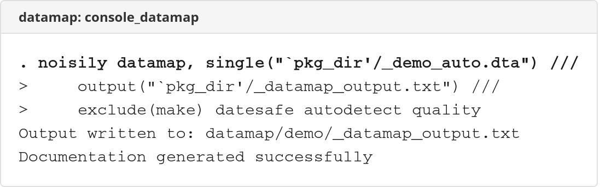
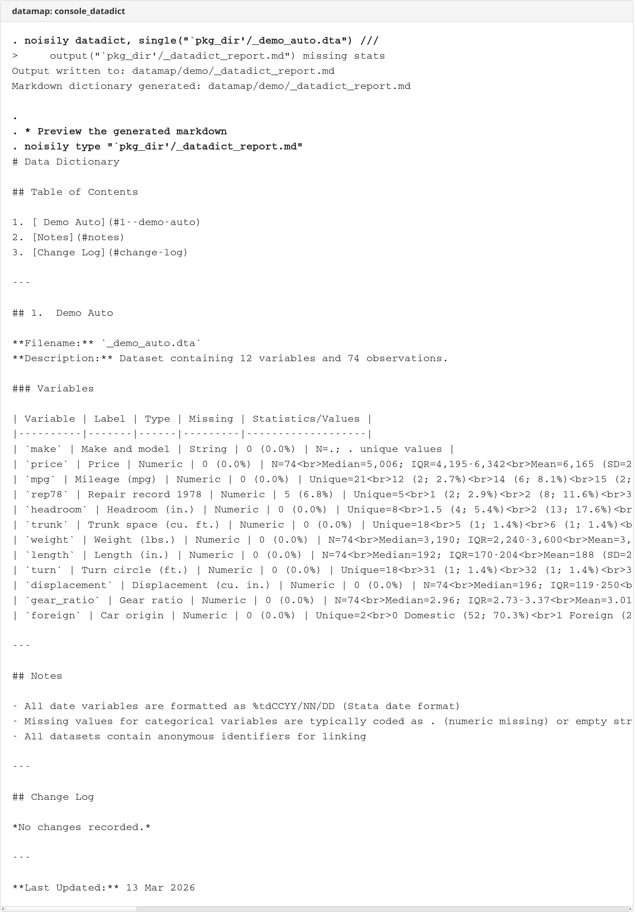

# datamap


Privacy-safe dataset documentation and Markdown data dictionaries for Stata.

## Description

The **datamap** package provides two complementary commands for documenting Stata datasets:

| Command | Purpose | Output Format |
|---------|---------|---------------|
| **datamap** | Privacy-safe dataset documentation with statistics, detection features, and quality checks | Plain text (.txt) |
| **datadict** | Professional data dictionaries for GitHub, documentation systems, and Pandoc conversion | Markdown (.md) |

Both commands automatically classify variables (categorical, continuous, date, string) and support multiple input modes (data in memory, single file, directory scan, dataset list).

## Screenshots

### datamap Console Output


### datadict Console Output


## Installation

```stata
net install datamap, from("https://raw.githubusercontent.com/tpcopeland/Stata-Tools/main/datamap")
```

This installs both `datamap` and `datadict` commands.

## Quick Start

```stata
* Document data currently in memory
sysuse auto, clear
datamap

* Privacy-safe text documentation from file
datamap, single(mydata) exclude(patient_id name) datesafe

* Markdown data dictionary
datadict, single(mydata) title("Study Dataset") author("Research Team") missing stats

* Document all datasets in a directory
datamap, directory(.) recursive output(all_datasets.txt)

* Separate Markdown files per dataset
datadict, directory(data) separate
```

## Key Features

**datamap** features:
- Privacy controls: `exclude()`, `datesafe`, `nostats`, `nofreq`, `nolabels`
- Detection: `detect(panel survival survey binary common)` or `autodetect`
- Data quality: `quality` / `quality2(strict)` for plausibility checks
- Missing data: `missing(detail)` / `missing(pattern)`
- Sample data: `samples(#)` with automatic masking of excluded variables

**datadict** features:
- Document metadata: `title()`, `subtitle()`, `version()`, `author()`, `date()`
- Content sections: `notes(file)`, `changelog(file)`
- Enhanced output: `missing` (adds Missing column), `stats` (adds statistics)
- Automatic table of contents with anchor links

**Shared features:**
- Three input modes: `single()`, `directory()`, `filelist()`
- Separate output files: `separate`
- Categorical threshold: `maxcat(#)`, `maxfreq(#)`
- Recursive directory scanning: `recursive`

## Dependencies

None. Both commands use only built-in Stata functionality.

## Detailed Help

For complete syntax, all options, and runnable examples:

```stata
help datamap
help datadict
```

## Author

Timothy P Copeland<br>
Department of Clinical Neuroscience<br>
Karolinska Institutet

## License

MIT License

## See Also

**Stata commands:** `describe`, `codebook`, `labelbook`, `summarize`

**External tools:** [Pandoc](https://pandoc.org) (convert Markdown to PDF/HTML/Word)
