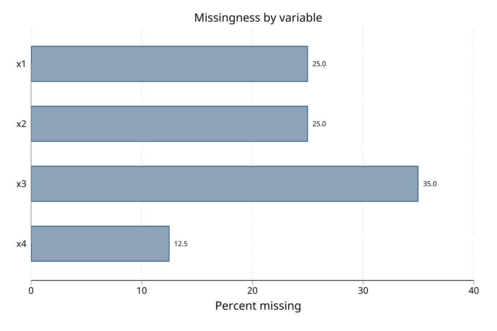

# datamap — Privacy-safe dataset maps and Markdown dictionaries

**Version 1.6.8** | 2026-08-30

`datamap` automatically classifies variables and creates privacy-aware aggregate dataset maps in text or JSON. `datadict`, `datacheck`, and `datamvp` extend the workflow with Markdown dictionaries, console QC gates, and missing-value pattern analysis.

## Quick Start

This self-contained example runs after installation and writes a privacy-safe text map for Stata's example data.

```stata
sysuse auto, clear
datamap, output(auto_map.txt)
```

## Requirements

- Stata 16 or later
- No external package dependencies for the four commands
- Pandoc is optional and is needed only when converting a `datadict` Markdown file to HTML, PDF, or Word

The repository demo uses the sibling `logdoc` and `tc_schemes` packages to regenerate console transcripts and the gallery graph. It installs them from the checkout when available and otherwise uses their public Stata-Tools sources.

## Installation

```stata
capture ado uninstall datamap
net install datamap, from("https://raw.githubusercontent.com/tpcopeland/Stata-Tools/main/datamap") replace
```

## Commands

| Command | Purpose |
|---------|---------|
| `datamap` | Create aggregate text or JSON documentation for one dataset or a collection of `.dta` files |
| `datadict` | Create a Markdown data dictionary with optional metadata, missingness, statistics, and separate-file output |
| `datacheck` | Profile data in the console and enforce declared expectations or schema comparisons |
| `datamvp` | Tabulate missing-value patterns, test monotone missingness, and draw missingness graphs |

## How It Works

`datamap`, `datadict`, and `datacheck` use the same classifier. It applies `exclude()` first, then explicit `continuous()`, `categorical()`, and date overrides, followed by string type, date formats, value labels or low cardinality, and continuous fallback; `config()` can supply reusable settings.

The default input is the dataset in memory. `single()` reads one `.dta` file, `directory()` scans `.dta` files, and `filelist()` reads a named list of files; add `recursive` for nested directories. `datadict` also accepts a line-delimited `manifest()` and can use a varlist only with in-memory data or `single()` input.

`datamap` writes text by default and switches to JSON with `format(json)`. `datadict` writes Markdown. `separate` creates one output per input dataset, while `saving()` writes the variable-level metadata table used by downstream checks or other project tooling.

`datamap` and `datadict` aggregate values by default. `datamap`'s `samples()` option deliberately adds row-level sample values; use `exclude()` and `datesafe` when those rows must not expose identifiers or date values. `mincell(5)` is the default small-cell threshold for categorical and binary frequencies, and `uniqcap(1000)` is the default cap for distinct-value counts.

On successful in-memory runs, `datamap` and `datadict` leave the caller's observations, variables, sort order, labels, characteristics, and data signature unchanged. File-based routes preserve and restore the caller's data; `datacheck` always restores it, and `datamvp` is `sortpreserve`.

## Choosing a Workflow

| Goal | Command | Result |
|------|---------|--------|
| Build a technical inventory for a handoff or pipeline | `datamap` | Privacy-aware text or JSON map with classifications, summaries, and optional samples |
| Publish a readable variable reference | `datadict` | CommonMark Markdown with optional metadata, missingness, statistics, and notes |
| Inspect or gate a dataset before analysis | `datacheck` | Console profile, expectation verdict, and optional profile or violation artifact |
| Understand joint missingness | `datamvp` | Pattern-frequency table, monotone test, generated indicators, or graph |

Start with one dataset and the default output. Add `exclude()` and `datesafe` before sharing a map, then move to `directory()` plus `recursive` for nested collections; for `datadict`, use `manifest()` when the single-dataset contract is settled.

## Worked Examples

The examples use only Stata's built-in `auto` data and temporary files created by the examples. Run each example independently unless it explicitly carries state forward.

### 1. Write an aggregate text map

```stata
sysuse auto, clear
datamap, output(auto_map.txt) quality missing(detail)
```

The output contains variable classes, aggregate summaries, value labels, missingness, and quality guidance without exporting sample rows.

### 2. Apply privacy controls and automatic structure detection

```stata
sysuse auto, clear
datamap, output(auto_private.txt) exclude(make) compact autodetect quality
```

`compact` keeps the disclosure summary and quick-reference content while omitting the longer guidance sections.

### 3. Produce JSON and save the metadata table

```stata
sysuse auto, clear
datamap, format(json) output(auto_map.json) saving(auto_metadata.dta, replace)
```

The JSON is suitable for programmatic consumers, and `auto_metadata.dta` contains one row per documented variable plus the shared classification and privacy fields.

### 4. Create a Markdown dictionary with statistics

```stata
sysuse auto, clear
datadict, output(auto_dictionary.md) title("Auto data dictionary") missing stats detail datasignature
```

Use `columns()` when the default dictionary columns should be replaced or reordered, and use `notes()` or `changelog()` for document-level content.

### 5. Document a saved dataset without changing the active data

```stata
sysuse auto, clear
quietly datasignature
local before "`r(datasignature)'"
tempfile auto_file
local auto_file "`auto_file'.dta"
save "`auto_file'", replace
datadict, single("`auto_file'") output(auto_from_file.md) missing stats
quietly datasignature
assert "`before'" == "`r(datasignature)'"
```

The `single()` route loads the file for processing and restores the caller's in-memory data afterward.

### 6. Build separate dictionaries from a temporary directory

```stata
tempfile marker
local inputs "`marker'_inputs"
local outputs "`marker'_outputs"
mkdir "`inputs'"
mkdir "`outputs'"

sysuse auto, clear
save "`inputs'/auto_original.dta", replace
replace mpg = mpg + 1
save "`inputs'/auto_changed.dta", replace

datadict, directory("`inputs'") recursive separate outdir("`outputs'") suffix("_dictionary")
```

`outdir()` must already exist. The command writes one Markdown file per dataset with the requested suffix.

### 7. Profile data and enforce expectations

```stata
sysuse auto, clear
datacheck price mpg weight, detail outliers(3)
datacheck, expectn(74) isid(make) notmissing(price mpg weight) inrange(mpg 10 50)
```

Gate failures exit with return code 9; add `warn` when violations should be reported without stopping the do-file.

### 8. Save a profile and compare a refreshed dataset

```stata
sysuse auto, clear
tempfile baseline violations
local baseline "`baseline'.dta"
local violations "`violations'.dta"
datacheck, saving("`baseline'", replace)
generate byte readme_added = 1
datacheck, compare("`baseline'") violations("`violations'", replace) warn
```

`compare()` reports added, dropped, type-changed, and class-changed variables; `violations()` can save a structured `.dta` artifact or write to a frame.

### 9. Inspect missingness patterns and draw a graph

```stata
sysuse auto, clear
datamvp price mpg rep78, percent sort monotone
datamvp price mpg rep78, graph(bar) gname(auto_missing)
graph export auto_missing.png, as(png) replace
```

`datamvp` treats empty strings as missing, returns pattern counts and monotone status, and supports `generate()` or `save()` when the pattern data should be reused.

## Demo

From a Stata-Tools repository checkout, run the named demo script from the repository root:

```bash
stata-mp -b do datamap/demo/demo_datamap.do
```

The script installs the local `datamap` source plus `logdoc` and `tc_schemes` from the checkout or their public Stata-Tools sources, writes reproducible assets under `datamap/demo/`, and removes its temporary logs at the end. The generated assets are checkout documentation, not files installed by `net install`.

- [Privacy-safe map transcript](demo/console_datamap_privacy.md)
- [JSON output transcript](demo/console_datamap_json.md)
- [Markdown dictionary transcript](demo/console_datadict.md)
- [Console QC transcript](demo/console_datacheck.md)
- [Missingness-pattern transcript](demo/console_datamvp.md)
- [Generated JSON metadata](demo/datamap_metadata.json)
- [Clinical Markdown dictionary](demo/datadict_clinical.md)



## Command Reference

### `datamap`

```stata
datamap [, options]
```

See [datamap.sthlp](datamap.sthlp) for the full syntax, classification rules, output schema, privacy warnings, and examples.

### `datadict`

```stata
datadict [varlist] [, options]
```

See [datadict.sthlp](datadict.sthlp) for Markdown column contracts, manifests, metadata, conversion, and separate-output workflows.

### `datacheck`

```stata
datacheck [varlist] [if] [in] [, options]
```

See [datacheck.sthlp](datacheck.sthlp) for profile fields, gate syntax, reusable `.dta` check specifications, comparison artifacts, and return codes.

### `datamvp`

```stata
datamvp [varlist] [if] [in] [, options]
```

See [datamvp.sthlp](datamvp.sthlp) for pattern filters, monotone tests, generated indicators, graph options, and saved results.

## Key Options

### `datamap`

| Options | Purpose |
|-------|----------------------|
| `single()`, `directory()`, `filelist()`, `recursive` | Input routes and nested-directory scanning. |
| `output()`, `format(text)`, `format(json)`, `separate`, `append`, `saving()`, `config()` | Output format, routing, metadata, and reusable settings. |
| `nostats`, `nofreq`, `nolabels`, `maxfreq(25)`, `maxcat(25)`, `mincell(5)`, `uniqcap(1000)`, `compact`, `noguidance` | Summary detail, thresholds, and report length. |
| `exclude()`, `continuous()`, `categorical()`, `date()`, `dateformat()`, `detect()`, `autodetect`, `panelid()`, `survivalvars()` | Privacy exclusions, classification overrides, and structure detection. |
| `datesafe`, `samples()`, `missing(detail/pattern)`, `quality`, `quality2(strict)` | Sample-row privacy, missingness, and quality diagnostics. |

`format(text)` is the default and uses `datamap.txt` when `output()` is omitted; JSON uses `datamap.json`. `append` is available for combined text output, not JSON.

### `datadict`

| Options | Purpose |
|-------|----------------------|
| `single()`, `directory()`, `filelist()`, `manifest()`, `recursive` | Input routes and nested-directory scanning. |
| `output()`, `separate`, `outdir()`, `suffix(_dictionary)`, `saving()`, `config()` | Output routing, metadata, and reusable settings. |
| `title()`, `subtitle()`, `version()`, `author()`, `date()`, `notes()`, `changelog()` | Document metadata and explanatory sections. |
| `missing`, `stats`, `detail`, `columns()`, `datasignature` | Dictionary content and technical metadata. |
| `exclude()`, `continuous()`, `categorical()`, `datevars()`, `dateformat()` | Privacy exclusions and classification overrides. |
| `maxcat(25)`, `maxfreq(25)`, `mincell(5)`, `uniqcap(1000)` | Category, frequency, suppression, and distinct-count thresholds. |

The default output is `data_dictionary.md`. `date()` sets document metadata, while `datevars()` overrides which variables are classified as dates.

### `datacheck`

| Options | Purpose |
|-------|----------------------|
| `single()`, `id()`, `exclude()`, `continuous()`, `categorical()`, `date()`, `detail`, `maxfreq(20)`, `rare()`, `outliers(0)`, `mincell(0)`, `maskrare` | Profile variables, distributions, rare cells, and outliers. |
| `nomissing`, `patterns` | Missingness summaries and pattern analysis. |
| `expectn()`, `isid()`, `nodups`, `require()`, `notmissing()`, `inrange()`, `allowed()`, `forbid()`, `regex()`, `notvalues()`, `warn`, `gatesonly`, `onlyflagged`, `show(flagged)` | Expectations, gates, display filters, and halting behavior. |
| `by()`, `over()`, `checks()`, `makespec()`, `compare()`, `saving()`, `violations()`, `config()` | Grouped checks, reusable specs, comparisons, artifacts, and settings. |

`rare()` flags low-frequency levels, `outliers(#)` uses an IQR rule, and `maskrare` masks cells below the effective rare/minimum-cell threshold. Gate failures exit with return code 9 unless `warn` is used.

### `datamvp`

| Options | Purpose |
|-------|----------------------|
| `minfreq(1)`, `notable`, `skip`, `sort`, `nodrop`, `percent`, `cumulative`, `ascending`, `minmissing()`, `maxmissing()`, `nosummary`, `wide` | Pattern table filters, ordering, and display. |
| `correlate`, `monotone`, `generate()`, `save()` | Missingness analysis and reusable outputs. |
| `graph(bar|patterns|matrix|correlation)`, `scheme()`, `title()`, `subtitle()`, `gname()`, `gsaving()`, `nodraw`, `horizontal`, `vertical`, `top()`, `barcolor()`, `misscolor()`, `obscolor()`, `textlabels`, `colorramp()`, `gby()`, `over()`, `stacked`, `groupgap()`, `legendopts()`, `graphoptions()` | Graph types, styling, grouping, and export. |

The default graph orientation for `graph(bar)` is horizontal. `matrix` graphs automatically sample up to 500 observations when the dataset is larger and accept only the documented `sample(#)` and `sort` suboptions. The command accepts at most 244 variables. `generate()` checks every output name before creating variables and refuses to overwrite existing targets.

## Stored Results

The help files document the complete stored-result contracts. The following tables list the results most useful in a pipeline.

### `datamap`

| Result | Meaning |
|--------|---------|
| `r(nfiles)`, `r(nobs)`, `r(nvars)` | Input-file, observation, and variable counts; `r(nobs)` and `r(nvars)` are returned when applicable. |
| `r(format)`, `r(output)`, `r(input_source)`, `r(mincell)` | Output mode, output path, input route, and effective small-cell threshold. |
| `r(n_categorical)`, `r(n_continuous)`, `r(n_date)`, `r(n_string)` | Counts by classified variable type. |
| `r(n_excluded)`, `r(n_suggested_exclude)`, `r(excluded_vars)`, `r(suggested_exclude)` | Explicit exclusions and identifier-like suggestions. |
| `r(categorical_vars)`, `r(continuous_vars)`, `r(date_vars)`, `r(string_vars)` | Classified variable lists. |
| `r(metadata)` | Saved metadata path when `saving()` is used. |

### `datadict`

| Result | Meaning |
|--------|---------|
| `r(nfiles)`, `r(nvars_total)`, `r(nobs_total)` | Number of inputs and total variables/observations processed. |
| `r(mode)`, `r(files)`, `r(outputs)`, `r(output)` | Input mode, input paths, output paths, and combined output path when applicable. |
| `r(metadata)` | Saved metadata path when `saving()` is used. |

### `datacheck`

| Result | Meaning |
|--------|---------|
| `r(N)`, `r(complete_cases)`, `r(complete_pct)` | Profile denominator and complete-case summary. |
| `r(n_checks)`, `r(n_passed)`, `r(n_failed)`, `r(n_violations)` | Gate and violation counts. |
| `r(violations)`, `r(failed_checks)` | Variable lists or structured violation identifiers. |
| `r(compare_added)`, `r(compare_dropped)`, `r(compare_type_changed)`, `r(compare_class_changed)`, `r(compare_changed)` | Schema comparison counts. |

### `datamvp`

| Result | Meaning |
|--------|---------|
| `r(N)`, `r(N_complete)`, `r(N_incomplete)`, `r(N_patterns)` | Observation, completeness, and pattern counts. |
| `r(N_vars)`, `r(max_miss)`, `r(mean_miss)`, `r(N_mv_total)` | Variable and missingness summaries. |
| `r(N_monotone)`, `r(pct_monotone)`, `r(monotone_status)` | Monotone-missingness results when `monotone` is requested. |
| `r(corr_miss)` | Missingness correlation matrix when `correlate` or a correlation graph is requested. |

## Assumptions and Limits

- `datamap` and `datadict` use aggregate summaries by default; `samples()` is an explicit row-level export option.
- `mincell()` suppresses categorical and binary frequency cells below the threshold, and `uniqcap()` reports a lower-bound count when the distinct-value cap is exceeded.
- `datamap` and `datadict` in-memory failures are not rolled back after partial processing; use file-based input or a copy when failure isolation is required.
- `datadict` requires an existing `outdir()` for separate outputs, and `checks()`, `compare()`, and file-based `violations()`/`makespec()` routes use Stata datasets rather than text specifications.
- `datacheck` treats `warn` as a non-halting gate mode; without it, failed expectations exit with return code 9.
- `datamvp` is limited to 244 analyzed variables, and generated indicator names are shortened and disambiguated to stay within Stata's name limit; reserved-name or existing-target collisions stop with an error before any output variable is created.

## References

`datamvp` is a fork of Jeroen Weesie's `mvpatterns` (STB-61: dm91); attribution and implementation notes are in [datamvp.sthlp](datamvp.sthlp).

## QA

QA suites and how to run them are documented in [qa/README.md](qa/README.md).

## Version History

### 1.6.8 (2026-08-30)

Preserved quoted text, dollar signs, backticks, pipes, and angle brackets in `datadict` labels and document metadata and in `datamvp` labels and graph titles; restored pattern-graph facet labels and `varabbrev` on the in-memory file-list path; and repaired Viewer-width help tables.

### 1.6.7 (2026-08-19)

Formatted numeric dictionary categories with their Stata display formats, preventing binary floating-point artifacts from appearing in Markdown output while retaining exact values for frequency counts.

### 1.6.6 (2026-08-11)

Prevented generated-variable and stored-result name collisions, tightened matrix graph parsing, preserved analytical returns after graph failures, repaired separate in-memory output, preserved quoted text and apostrophes in dictionaries and paths, and replaced temporary in-memory identities with stable `memory` labels.

### 1.6.5 (2026-08-09)

Preserved closing parentheses in `saving()` metadata paths across `datamap`, `datadict`, and `datacheck`; expanded path and return-contract QA.

### 1.6.4 (2026-08-05)

Corrected input-mode, successful-state, stored-result, and generated-name help contracts.

### 1.6.3 (2026-08-05)

Fixed Viewer-width rendering in the command help files and corrected the documented in-memory rollback behavior.

### 1.6.2 (2026-07-27)

Made shipped help self-contained by removing contributor-only references.

### 1.6.1 (2026-07-15)

Reduced peak memory for exact distinct counts without changing user-visible counts or output.

### 1.6.0 (2026-07-14)

Added capped distinct-value counts, `unique_values_capped` metadata, and frame-based report processing for lower memory use.

### 1.5.4 (2026-07-10)

Restored the documented dictionary privacy default, rejected negative thresholds, and tightened `datamvp` option validation.

### 1.5.3 (2026-07-10)

Completed the `datacheck` option and return contract and improved help-file rendering.

### 1.5.2 (2026-07-09)

Fixed negative fractional values in JSON output and replaced high-cardinality distinct counting with the shared counter.

### 1.5.1 (2026-07-08)

Fixed long-name, high-cardinality, privacy, generated-name, and state-restoration edge cases.

### 1.5.0 (2026-06-19)

Added shared classifier overrides, project `config()`, metadata exports, and `datacheck compare()`.

### 1.4.1 (2026-06-19)

Fixed floating-point formatting in text output, summaries, detection, missingness, and sample rows.

## Author

Timothy P Copeland, Karolinska Institutet

## License

MIT (see the repository [LICENSE](../LICENSE))
