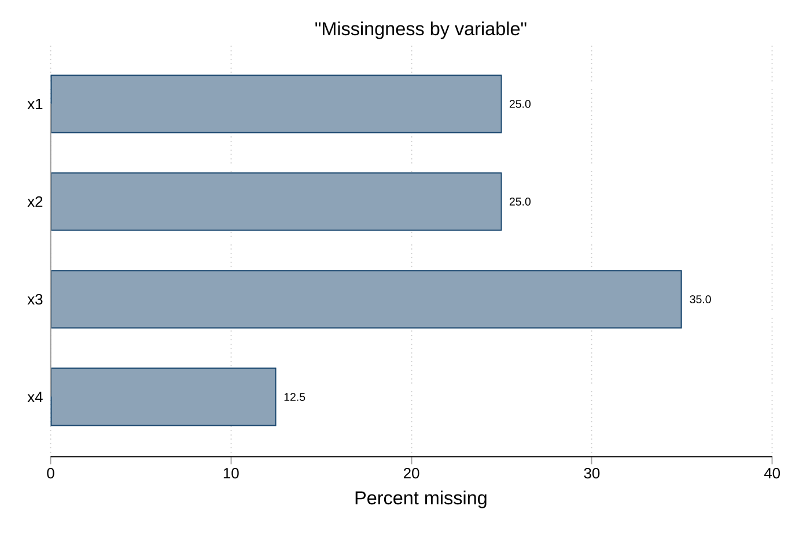

# datamap — Privacy-safe dataset maps and Markdown dictionaries

**Version 1.8.1** | 2026-09-30

`datamap` automatically classifies variables and creates privacy-aware aggregate dataset maps in text or JSON. `datadict`, `datacheck`, `dataqa`, and `datamvp` extend the workflow with Markdown dictionaries, console QC gates, a structured QA ledger, and missing-value pattern analysis.

## Quick Start

This self-contained example runs after installation and writes a privacy-safe text map for Stata's example data.

```stata
sysuse auto, clear
datamap, output(auto_map.txt)
```

## Requirements

- Stata 16 or later
- No external package dependencies for the five commands
- Pandoc is optional and is needed only when converting a `datadict` Markdown file to HTML, PDF, or Word

The repository demo uses the sibling `logdoc` and `tc_schemes` packages to regenerate console transcripts and the gallery graph. It installs them from the checkout when available and otherwise uses their public Stata-Tools sources.

## Installation

```stata
capture ado uninstall datamap
net install datamap, from("https://raw.githubusercontent.com/tpcopeland/Stata-Tools/main/datamap") replace
```

## Commands

| Command | Purpose |
|---------|---------|
| `datamap` | Create aggregate text or JSON documentation for one dataset or a collection of `.dta` files |
| `datadict` | Create a Markdown data dictionary with optional metadata, missingness, statistics, and separate-file output |
| `datacheck` | Profile data in the console and enforce declared invariants, sanity bands, and schema comparisons |
| `dataqa` | Set session QA defaults and report, assert, compare, and export the ledger `datacheck` writes |
| `datamvp` | Tabulate missing-value patterns, test monotone missingness, and draw missingness graphs |

## How It Works

`datamap`, `datadict`, and `datacheck` use the same classifier. It applies `exclude()` first, then explicit `continuous()`, `categorical()`, and date overrides, followed by string type, date formats, value labels or low cardinality, and continuous fallback; `config()` can supply reusable settings.

The default input is the dataset in memory. `single()` reads one `.dta` file, `directory()` scans `.dta` files, and `filelist()` reads a named list of files; add `recursive` for nested directories. `datadict` also accepts a line-delimited `manifest()` and can use a varlist only with in-memory data or `single()` input.

`datamap` writes text by default and switches to JSON with `format(json)`. `datadict` writes Markdown. `separate` creates one output per input dataset, while `saving()` writes the variable-level metadata table used by downstream checks or other project tooling.

`datamap` and `datadict` aggregate values by default. `datamap`'s `samples()` option deliberately adds row-level sample values; use `exclude()` and `datesafe` when those rows must not expose identifiers or date values. `mincell(5)` is the default small-cell threshold for categorical and binary frequencies, and `uniqcap(1000)` is the default cap for distinct-value counts.

On successful in-memory runs, `datamap` and `datadict` leave the caller's observations, variables, sort order, labels, characteristics, and data signature unchanged. File-based routes preserve and restore the caller's data; `datacheck` always restores it, and `datamvp` is `sortpreserve`.

## Choosing a Workflow

| Goal | Command | Result |
|------|---------|--------|
| Build a technical inventory for a handoff or pipeline | `datamap` | Privacy-aware text or JSON map with classifications, summaries, and optional samples |
| Publish a readable variable reference | `datadict` | CommonMark Markdown with optional metadata, missingness, statistics, and notes |
| Inspect or gate a dataset before analysis | `datacheck` | Console profile, expectation verdict, and optional profile or violation artifact |
| Keep a structured record of every gate run | `dataqa` | Ledger rows per gate entry, a register draft, and an assert that every expected dataset was checked |
| Understand joint missingness | `datamvp` | Pattern-frequency table, monotone test, generated indicators, or graph |

Start with one dataset and the default output. Add `exclude()` and `datesafe` before sharing a map, then move to `directory()` plus `recursive` for nested collections; for `datadict`, use `manifest()` when the single-dataset contract is settled.

## Worked Examples

The examples use only Stata's built-in `auto` data and temporary files created by the examples. Run each example independently unless it explicitly carries state forward.

### 1. Write an aggregate text map

```stata
sysuse auto, clear
datamap, output(auto_map.txt) quality missing(detail)
```

The output contains variable classes, aggregate summaries, value labels, missingness, and quality guidance without exporting sample rows.

### 2. Apply privacy controls and automatic structure detection

```stata
sysuse auto, clear
datamap, output(auto_private.txt) exclude(make) compact autodetect quality
```

`compact` keeps the disclosure summary and quick-reference content while omitting the longer guidance sections.

### 3. Produce JSON and save the metadata table

```stata
sysuse auto, clear
datamap, format(json) output(auto_map.json) saving(auto_metadata.dta, replace)
```

The JSON is suitable for programmatic consumers, and `auto_metadata.dta` contains one row per documented variable plus the shared classification and privacy fields.

### 4. Create a Markdown dictionary with statistics

```stata
sysuse auto, clear
datadict, output(auto_dictionary.md) title("Auto data dictionary") missing stats detail datasignature
```

Use `columns()` when the default dictionary columns should be replaced or reordered, and use `notes()` or `changelog()` for document-level content.

### 5. Document a saved dataset without changing the active data

```stata
sysuse auto, clear
quietly datasignature
local before "`r(datasignature)'"
tempfile auto_file
local auto_file "`auto_file'.dta"
save "`auto_file'", replace
datadict, single("`auto_file'") output(auto_from_file.md) missing stats
quietly datasignature
assert "`before'" == "`r(datasignature)'"
```

The `single()` route loads the file for processing and restores the caller's in-memory data afterward.

### 6. Build separate dictionaries from a temporary directory

```stata
tempfile marker
local inputs "`marker'_inputs"
local outputs "`marker'_outputs"
mkdir "`inputs'"
mkdir "`outputs'"

sysuse auto, clear
save "`inputs'/auto_original.dta", replace
replace mpg = mpg + 1
save "`inputs'/auto_changed.dta", replace

datadict, directory("`inputs'") recursive separate outdir("`outputs'") suffix("_dictionary")
```

`outdir()` must already exist. The command writes one Markdown file per dataset with the requested suffix.

### 7. Profile data and enforce expectations

```stata
sysuse auto, clear
datacheck price mpg weight, detail outliers(3)
datacheck, expectn(74) isid(make) notmissing(price mpg weight) inrange(mpg 10 50)
```

Gate failures exit with return code 9; add `warn` when violations should be reported without stopping the do-file.

### 8. Save a profile and compare a refreshed dataset

```stata
sysuse auto, clear
tempfile baseline violations
local baseline "`baseline'.dta"
local violations "`violations'.dta"
datacheck, saving("`baseline'", replace)
generate byte readme_added = 1
datacheck, compare("`baseline'") violations("`violations'", replace) warn
```

`compare()` reports added, dropped, type-changed, and class-changed variables; `violations()` can save a structured `.dta` artifact or write to a frame.

### 9. Inspect missingness patterns and draw a graph

```stata
sysuse auto, clear
datamvp price mpg rep78, percent sort monotone
datamvp price mpg rep78, graph(bar) gname(auto_missing)
graph export auto_missing.png, as(png) replace
```

`datamvp` treats empty strings as missing, returns pattern counts and monotone status, and supports `generate()` or `save()` when the pattern data should be reused.

### 10. Record gate results in a QA ledger

```stata
tempfile ledger
dataqa set maskrare mincell(5) ledger("`ledger'") run(demo)
sysuse auto, clear
datacheck, gatesonly isid(make) rule("heavy": weight > 1500) bands(expectn(70 80) stat(mean mpg 18 25)) name(auto_cars)
dataqa report
dataqa assert, expect(auto_cars)
dataqa set clear
```

Each gate entry, passed or failed, becomes one ledger row with its kind (invariant, band, or review), masked observation, and expectation. `dataqa assert` exits with return code 9 if any gate in the run failed (or an invariant only warned under bare `warn`), the run has no rows, or a named dataset has no rows; `dataqa report, markdown()` drafts register rows that list the dispositions each kind allows.

## Demo

From a Stata-Tools repository checkout, run the named demo script from the repository root:

```bash
stata-mp -b do datamap/demo/demo_datamap.do
```

The script installs the local `datamap` source plus `logdoc` and `tc_schemes` from the checkout or their public Stata-Tools sources, writes reproducible assets under `datamap/demo/`, and removes its temporary logs at the end. The generated assets are checkout documentation, not files installed by `net install`.

- [Privacy-safe map transcript](demo/console_datamap_privacy.md)
- [JSON output transcript](demo/console_datamap_json.md)
- [Markdown dictionary transcript](demo/console_datadict.md)
- [Console QC transcript](demo/console_datacheck.md)
- [Missingness-pattern transcript](demo/console_datamvp.md)
- [Generated JSON metadata](demo/datamap_metadata.json)
- [Clinical Markdown dictionary](demo/datadict_clinical.md)



## Command Reference

### `datamap`

```stata
datamap [, options]
```

See [datamap.sthlp](datamap.sthlp) for the full syntax, classification rules, output schema, privacy warnings, and examples.

### `datadict`

```stata
datadict [varlist] [, options]
```

See [datadict.sthlp](datadict.sthlp) for Markdown column contracts, manifests, metadata, conversion, and separate-output workflows.

### `datacheck`

```stata
datacheck [varlist] [if] [in] [, options]
```

See [datacheck.sthlp](datacheck.sthlp) for profile fields, gate syntax, reusable `.dta` check specifications, comparison artifacts, and return codes.

### `dataqa`

```stata
dataqa set [options | clear]
dataqa report [using ledger] [, run() markdown() replace]
dataqa assert [using ledger] [, run() expect()]
dataqa export [using ledger], saving() [run() replace threshold()]
dataqa compare [using ledger] [, run() baseline() baseledger() ntol() stattol()]
```

See [dataqa.sthlp](dataqa.sthlp) for the session defaults, the register grammar, and the dispositions each kind allows; the ledger columns are listed under `ledger()` in [datacheck.sthlp](datacheck.sthlp).

### `datamvp`

```stata
datamvp [varlist] [if] [in] [, options]
```

See [datamvp.sthlp](datamvp.sthlp) for pattern filters, monotone tests, generated indicators, graph options, and saved results.

## Key Options

### `datamap`

| Options | Purpose |
|-------|----------------------|
| `single()`, `directory()`, `filelist()`, `recursive` | Input routes and nested-directory scanning. |
| `output()`, `format(text)`, `format(json)`, `separate`, `append`, `saving()`, `config()` | Output format, routing, metadata, and reusable settings. |
| `nostats`, `nofreq`, `nolabels`, `maxfreq(25)`, `maxcat(25)`, `mincell(5)`, `uniqcap(1000)`, `compact`, `noguidance` | Summary detail, thresholds, and report length. |
| `exclude()`, `continuous()`, `categorical()`, `date()`, `dateformat()`, `detect()`, `autodetect`, `panelid()`, `survivalvars()` | Privacy exclusions, classification overrides, and structure detection. |
| `datesafe`, `samples()`, `missing(detail/pattern)`, `quality`, `quality2(strict)` | Sample-row privacy, missingness, and quality diagnostics. |

`format(text)` is the default and uses `datamap.txt` when `output()` is omitted; JSON uses `datamap.json`. `append` is available for combined text output, not JSON.

### `datadict`

| Options | Purpose |
|-------|----------------------|
| `single()`, `directory()`, `filelist()`, `manifest()`, `recursive` | Input routes and nested-directory scanning. |
| `output()`, `separate`, `outdir()`, `suffix(_dictionary)`, `saving()`, `config()` | Output routing, metadata, and reusable settings. |
| `title()`, `subtitle()`, `version()`, `author()`, `date()`, `notes()`, `changelog()` | Document metadata and explanatory sections. |
| `missing`, `stats`, `detail`, `columns()`, `datasignature` | Dictionary content and technical metadata. |
| `exclude()`, `continuous()`, `categorical()`, `datevars()`, `dateformat()` | Privacy exclusions and classification overrides. |
| `maxcat(25)`, `maxfreq(25)`, `mincell(5)`, `uniqcap(1000)` | Category, frequency, suppression, and distinct-count thresholds. |

The default output is `data_dictionary.md`. `date()` sets document metadata, while `datevars()` overrides which variables are classified as dates.

### `datacheck`

| Options | Purpose |
|-------|----------------------|
| `single()`, `id()`, `exclude()`, `continuous()`, `categorical()`, `date()`, `detail`, `maxfreq(20)`, `rare()`, `outliers(0)`, `mincell(0)`, `maskrare` | Profile variables, distributions, rare cells, and outliers. |
| `nomissing`, `patterns` | Missingness summaries and pattern analysis. |
| `expectn()`, `isid()`, `nodups`, `require()`, `notmissing()`, `inrange()`, `allowed()`, `forbid()`, `regex()`, `notvalues()`, `rule()`, `stat()`, `binary()`, `events()`, `intervals()`, `keyset()`, `constant()`, `sets()` | Invariant gates. |
| `bands()`, `bandwarn`, `coverage()` | Sanity bands kept apart from invariants; `bandwarn` makes only bands warn. |
| `review()`, `heaping()`, `groupstat()`, `complete()`, `jumps()` | Review items that print and never halt (or gate with a threshold). |
| `warn`, `gatesonly`, `onlyflagged`, `show(flagged)`, `minversion()` | Halting behavior, display filters, and a version probe. |
| `by()`, `over()`, `checks()`, `makespec()`, `compare()`, `saving()`, `violations()`, `ledger()`, `name()`, `signature`, `config()` | Grouped checks, reusable specs, comparisons, artifacts, the QA ledger, and settings. |

`maskrare` masks every printed count below the threshold (gate messages, missingness and groupwise blocks, the `patterns` table), withholds percentages and complements that would recover one, and replaces minima and maxima with guarded p1 and p99. `stat()` accepts mean, sd, percentiles, `sum`, `n`, `distinct`, `pmiss`, `ess` (Kish effective sample size), and `ratio num den`, each with an optional `if` per entry. `events()` requires an event at every covariate level, `intervals()` checks overlap, gaps, order, and event placement on its own sort, `keyset()` compares keys with a saved file, and `constant()` requires time-fixed values within a key. Gates inside `bands()` are sanity bands: with `bandwarn` they warn while invariants still halt. Under `gatesonly` the profile is skipped and only the gate columns are kept. Gate failures exit with return code 9; a run where every gate passes prints a `PASS:` line naming the dataset and the active masking.

### `datamvp`

| Options | Purpose |
|-------|----------------------|
| `minfreq(1)`, `notable`, `skip`, `sort`, `nodrop`, `percent`, `cumulative`, `ascending`, `minmissing()`, `maxmissing()`, `nosummary`, `wide` | Pattern table filters, ordering, and display. |
| `correlate`, `monotone`, `bytable()`, `generate()`, `save()` | Missingness analysis, percent missing by group, and reusable outputs. |
| `mincell()`, `maskrare`, `top()` | Small-cell masking, pooling of rare patterns, and a cap on the pattern table. |
| `graph(bar\|patterns\|matrix\|correlation)`, `scheme()`, `title()`, `subtitle()`, `gname()`, `gsaving()`, `nodraw`, `horizontal`, `vertical`, `top()`, `barcolor()`, `misscolor()`, `obscolor()`, `textlabels`, `colorramp()`, `gby()`, `over()`, `stacked`, `groupgap()`, `legendopts()`, `graphoptions()` | Graph types, styling, grouping, and export. |

Under `mincell()` or `maskrare`, patterns below the threshold are pooled into one final row, so the displayed frequencies still sum to N. `top()` caps the pattern table (at 20 by default under masking) and pools the rest into the same row. The default graph orientation for `graph(bar)` is horizontal. `matrix` graphs automatically sample up to 500 observations when the dataset is larger and accept only the documented `sample(#)` and `sort` suboptions. The command accepts at most 244 variables. `generate()` checks every output name before creating variables and refuses to overwrite existing targets.

## Stored Results

The help files document the complete stored-result contracts. The following tables list the results most useful in a pipeline.

### `datamap`

| Result | Meaning |
|--------|---------|
| `r(nfiles)`, `r(nobs)`, `r(nvars)` | Input-file, observation, and variable counts; `r(nobs)` and `r(nvars)` are returned when applicable. |
| `r(format)`, `r(output)`, `r(input_source)`, `r(mincell)` | Output mode, output path, input route, and effective small-cell threshold. |
| `r(n_categorical)`, `r(n_continuous)`, `r(n_date)`, `r(n_string)` | Counts by classified variable type. |
| `r(n_excluded)`, `r(n_suggested_exclude)`, `r(excluded_vars)`, `r(suggested_exclude)` | Explicit exclusions and identifier-like suggestions. |
| `r(categorical_vars)`, `r(continuous_vars)`, `r(date_vars)`, `r(string_vars)` | Classified variable lists. |
| `r(metadata)` | Saved metadata path when `saving()` is used. |

### `datadict`

| Result | Meaning |
|--------|---------|
| `r(nfiles)`, `r(nvars_total)`, `r(nobs_total)` | Number of inputs and total variables/observations processed. |
| `r(mode)`, `r(files)`, `r(outputs)`, `r(output)` | Input mode, input paths, output paths, and combined output path when applicable. |
| `r(metadata)` | Saved metadata path when `saving()` is used. |

### `datacheck`

| Result | Meaning |
|--------|---------|
| `r(N)`, `r(complete_cases)`, `r(complete_pct)` | Profile denominator and complete-case summary. |
| `r(n_checks)`, `r(n_passed)`, `r(n_failed)`, `r(n_violations)`, `r(n_errors)`, `r(n_warnings)`, `r(n_reviews)` | Gate, violation, warning, and review counts. |
| `r(violations)`, `r(failed_checks)`, `r(checks_run)` | Families of failed entries and of the gates that ran. |
| `r(version)`, `r(dataset)`, `r(masked)`, `r(ledger)`, `r(ledger_seq)` | Installed version, dataset name, masking, and ledger position. |
| `r(singlelevel_vars)`, `r(n_singlelevel)` | Variables with exactly one observed nonmissing value (not set on the `gatesonly` fast path). |
| `r(compare_added)`, `r(compare_dropped)`, `r(compare_type_changed)`, `r(compare_class_changed)`, `r(compare_changed)` | Schema comparison counts. |

### `dataqa`

| Result | Meaning |
|--------|---------|
| `r(defaults)` | `dataqa set`: the session-default option string. |
| `r(N)`, `r(n_datasets)`, `r(n_failed)`, `r(n_warned)`, `r(ledger)`, `r(run)` | `dataqa report`: rows read, datasets, failed and warned rows, and the ledger and run read; `r(markdown)` and `r(n_rows)` with `markdown()`. |
| `r(N)`, `r(n_failed)`, `r(missing)`, `r(run)` | `dataqa assert`: rows, halting rows, and expected datasets without rows, set also when it halts with r(9). |
| `r(N)`, `r(n_scope_dropped)`, `r(saving)` | `dataqa export`: rows written, scope expressions blanked, and the release copy. |
| `r(n_flags)`, `r(baseline)` | `dataqa compare`: items to review and the baseline run. |

### `datamvp`

| Result | Meaning |
|--------|---------|
| `r(N)`, `r(N_complete)`, `r(N_incomplete)`, `r(N_patterns)` | Observation, completeness, and pattern counts. |
| `r(N_vars)`, `r(max_miss)`, `r(mean_miss)`, `r(N_mv_total)` | Variable and missingness summaries. |
| `r(N_monotone)`, `r(pct_monotone)`, `r(monotone_status)` | Monotone-missingness results when `monotone` is requested. |
| `r(corr_miss)` | Missingness correlation matrix when `correlate` or a correlation graph is requested. |
| `r(N_patterns_pooled)`, `r(mincell)`, `r(masked)`, `r(miss_by)` | Pooled patterns, mask threshold, masking flag, and the `bytable()` matrix. |

## Assumptions and Limits

- `datamap` and `datadict` use aggregate summaries by default; `samples()` is an explicit row-level export option.
- `mincell()` suppresses categorical and binary frequency cells below the threshold, and `uniqcap()` reports a lower-bound count when the distinct-value cap is exceeded.
- `datamap` and `datadict` in-memory failures are not rolled back after partial processing; use file-based input or a copy when failure isolation is required.
- `datadict` requires an existing `outdir()` for separate outputs, and `checks()`, `compare()`, and file-based `violations()`/`makespec()` routes use Stata datasets rather than text specifications.
- `datacheck` treats `warn` as a non-halting gate mode for every gate and `bandwarn` as one for sanity bands only; without them, failed expectations exit with return code 9.
- Stored results are never masked; only printed output is. The working `dataqa` ledger and `datamvp` `save()` files hold small cells and belong with the data; `dataqa export` writes the copy that may leave the server and refuses one that shows a small cell.
- `datamvp` is limited to 244 analyzed variables, and generated indicator names are shortened and disambiguated to stay within Stata's name limit; reserved-name or existing-target collisions stop with an error before any output variable is created.

## References

`datamvp` is a fork of Jeroen Weesie's `mvpatterns` (STB-61: dm91); attribution and implementation notes are in [datamvp.sthlp](datamvp.sthlp).

`datacheck`'s `stat(ess ...)` is the Kish effective sample size, (sum w)^2 / sum w^2: Kish, L. 1965. *Survey Sampling*. New York: Wiley.

## QA

QA suites and how to run them are documented in [qa/README.md](qa/README.md).

## Version History

### 1.8.1 (2026-09-30)

- `dataqa`: `dataqa set ..., replace` removes the rows already under `run()` from the ledger (a note is printed when a run already has rows); `report`, `assert`, and `export` read only the latest call of each gate, so a fixed failure no longer halts a same-run rerun (`r(n_superseded)`), while a rerun with changed bounds is a new gate and leaves the old failure visible; `compare` keys entries the same way; `export` refuses a `saving()` path that resolves to the ledger it reads (r(602)).
- Disclosure: `datamap` and `datadict` withhold a complementary cell when a lone suppressed cell could be recovered from N and the missing count, and apply `mincell()` to the survival event rate and the complete-case count; `datesafe` withholds date-class survival time ranges; `saving()` rows of excluded variables carry no value-label name, notes, or characteristics. `datacheck` masks a small complement in `stat()` `n`/`sum`/`distinct`/`pmiss`, `sets(values)`, the DATE window, and KEY STRUCTURE, and withholds an excluded variable's Miss% and `inrange()` extremes. `datamvp` graphs follow the table's mask: `graph(bar)` withholds masked bars, `graph(patterns)` draws only table-shown patterns, and `graph(matrix)`, which plots individual observations, is refused under masking.
- Display: a masked share prints as `[masked]` (or `n/a` for an empty denominator) rather than `.%`, and an excluded variable's share as `[excluded]`, which widens the `datacheck` QUICK REFERENCE Miss% column; `groupstat()` columns stay separated for 12-character names, a failing band value prints at full precision, and with `relative` the cells show the group-to-pooled ratio that the band tests.
- `exclude()` in `datamap` and `datadict` expands wildcards and ranges; a range that cannot be resolved in a file is an error (r(111)) before any output is written, and a token matching no variable prints a note. `filelist()` keeps quoted names with spaces; a quoted whole list is split into names only when the words cannot be one path (bare names, or every word written with `.dta` or a path), so a mixed form such as `filelist("sub/a b")` must list each name separately. Zero-observation files are documented. String `unique` counts exclude the empty string in every command.
- `datacheck`: `checks()` `isid`/`expectn` rows add gates instead of replacing the command-line ones, and `isid()` takes `\`-separated keys; `forbid()`/`notvalues()` with an explicit missing code (`.`, `.a`-`.z`) now match that code, so a call that passed can halt; `regex()` on a numeric variable matches integers in full and other values at `%16.0g`; `makespec()` writes specs that read back as passing on the same data (a string variable with a level containing `$`, a quote, a backtick, or `\` gets no allowed row); `keyset()` accepts quoted filenames with commas or spaces; `heaping()` and `coverage()` explain how to give a date variable a daily display format when they refuse it.
- Gates that passed on data they did not test now fail: `events()` with an all-missing covariate, `groupstat()` bands with an empty scope or no group tested, and `intervals()` rows with a missing id; float values are compared at float precision at `intervals()` `tol()`, `jumps()` `ratio()`, and `groupstat()` percentile bounds.
- `datamvp` restores the random-number state after sampling for `graph(matrix)`, and preserves an existing or absent `S_2` legacy global on success, the no-missing shortcut, and refusal.

### 1.8.0 (2026-09-30)

- Disclosure: under `maskrare`, `datacheck` masks every printed count below the threshold, including failing-row counts in gate messages and in `violations()`, the MISSINGNESS and GROUPWISE blocks (small groups pooled), key structure, and profile counts, and never prints a percentage or complement that would recover one; `isid()` reports only the masked number of duplicated rows. `datamvp` gains `mincell()` and `maskrare`, pooling patterns below the threshold into one row, and `datacheck, patterns maskrare` passes the masking on. `r(masked)` reports whether anything was masked.
- Speed: `gatesonly` without `compare()`, `saving()`, or `makespec()` skips classification and the profile and keeps only the gate columns (a 44-column, 1M-row gate call fell from 39 s to under 1 s), no longer scans groupwise missingness, and tags `isid()`/`nodups` keys once per call instead of once per `by()` group.
- New invariant gates: `events()`, `intervals()`, `keyset()`, `constant()`, and `sets()`; `stat()` adds `sum`, `n`, `distinct`, `pmiss`, `ess`, and `ratio` with an optional `if` per entry; `inrange()` takes several variables per bound pair and open bounds.
- `bands()` and `bandwarn` keep sanity bands apart from invariants in one call; new `coverage()` band and `review()`, `heaping()`, `groupstat()`, `complete()`, and `jumps()` review items.
- The verdict names the dataset (or `name()`) and the active masking; `minversion()` and `r(version)`; `signature`; `ledger()` appends one row per gate entry, passed or failed.
- New command `dataqa`: `set` (session defaults read by `datacheck` and `datamvp`), `report` (register draft with the dispositions each kind allows), `assert`, `export` (a release copy that refuses small cells), and `compare` (drift against a baseline run).
- `datamvp` also adds `bytable()`, applies `top()` to the pattern table, and sizes the Obs and Miss columns from the largest count with comma format throughout.
- Fixed: range bounds written as date strings (`inrange(dt 01jan2020 31dec2020)`) failed with r(198) instead of being parsed as dates; ISO and slash dates (`2020-01-01`) are read as dates rather than as arithmetic, `%tc` bounds in milliseconds, and a bound naming a variable is refused.

### 1.7.1 (2026-09-29)

- Apply `datesafe` to saved metadata as well as reports.
- Preserve exact double category membership in dictionary frequencies and reject colliding separate dictionary destinations before writing.
- Resolve file-owned grouping variables after loading `single()` inputs; accept the documented config display flags and avoid caller-variable frequency collisions.
- Preserve the caller’s active estimation sample and legacy Stata globals during documentation and profiling.
- Handle complete-data sorting and pattern-table name collisions in `datamvp`; report the tetrachoric failure code when using Pearson fallback.

### 1.7.0 (2026-09-29)

Added three `datacheck` gates: `rule("label": expression)` for labelled row-level rules evaluated in the data's sort order, `stat()` for a mean, sd, median, or percentile band, and `binary()` for 0/1 flags that must show both levels. Added `r(singlelevel_vars)` and `r(n_singlelevel)` for variables with one observed nonmissing value, and a `PASS:` line when every gate passes. `rule`, `stat`, and `binary` rows are accepted in `checks()` files. Under `maskrare`, the continuous and date profiles and `inrange()` violation messages report guarded p1/p99 instead of minima and maxima, and dates at month precision. Fixed profile lines ("single level (constant)", outlier and max-category notes, and blank lines from frequency tables) that printed under `quietly`; `violations()` and `makespec()` with `replace` now create a frame that does not yet exist instead of failing with r(111); `rule()` expressions containing string literals print and save intact in violation messages; and `nodups` compares only the dataset's own columns.

### 1.6.9 (2026-09-29)

Stopped `exclude()` variables from leaking through the dataset description's date range and the panel, survival, and survey detectors; made `survivalvars()` select the survival variables it names; reported event rates only for 0/1 indicators and ignored missing IDs in panel detection; classified left-justified date formats (`%-td`, `%-tc`) as dates in all four commands; escaped control characters in JSON; kept caller matrices named `vals`/`freqs` intact; printed small continuous statistics and float category levels without rounding to zero or IEEE noise; counted `strL` variables exactly under `uniqcap(0)` and `panelid()`; applied `maxcat()`/`uniqcap()` to `saving()` metadata; counted `datadict` string levels containing quotes or backticks exactly; compared float variables at float precision in `datacheck` value and range gates and reported date spans in their own time units; kept `datamvp, sort` ties in input order with a private matrix-graph label; drew `datamvp` `gby()`/`over()` bar and pattern graphs correctly for non-integer (float) group levels, which had produced empty bars or r(198); kept excluded variables out of `datacheck`'s `r(missing_vars)`, `r(flagged_vars)`, and `patterns` table; made `format(json)` refuse `detect()`, `autodetect`, `panelid()`, `survivalvars()`, `samples()`, `quality`, and `missing()` (r(198)) instead of silently dropping them; implemented `missing(pattern)`'s joint missing-value pattern table (previously identical to `missing(detail)`); and wrote frequency tables for string variables forced into the categorical class in text and JSON output.

### 1.6.8 (2026-08-30)

Preserved quoted text, dollar signs, backticks, pipes, and angle brackets in `datadict` labels and document metadata and in `datamvp` labels and graph titles; restored pattern-graph facet labels and `varabbrev` on the in-memory file-list path; and repaired Viewer-width help tables.

### 1.6.7 (2026-08-19)

Formatted numeric dictionary categories with their Stata display formats, preventing binary floating-point artifacts from appearing in Markdown output while retaining exact values for frequency counts.

### 1.6.6 (2026-08-11)

Prevented generated-variable and stored-result name collisions, tightened matrix graph parsing, preserved analytical returns after graph failures, repaired separate in-memory output, preserved quoted text and apostrophes in dictionaries and paths, and replaced temporary in-memory identities with stable `memory` labels.

### 1.6.5 (2026-08-09)

Preserved closing parentheses in `saving()` metadata paths across `datamap`, `datadict`, and `datacheck`; expanded path and return-contract QA.

### 1.6.4 (2026-08-05)

Corrected input-mode, successful-state, stored-result, and generated-name help contracts.

### 1.6.3 (2026-08-05)

Fixed Viewer-width rendering in the command help files and corrected the documented in-memory rollback behavior.

### 1.6.2 (2026-07-27)

Made shipped help self-contained by removing contributor-only references.

### 1.6.1 (2026-07-15)

Reduced peak memory for exact distinct counts without changing user-visible counts or output.

### 1.6.0 (2026-07-14)

Added capped distinct-value counts, `unique_values_capped` metadata, and frame-based report processing for lower memory use.

### 1.5.4 (2026-07-10)

Restored the documented dictionary privacy default, rejected negative thresholds, and tightened `datamvp` option validation.

### 1.5.3 (2026-07-10)

Completed the `datacheck` option and return contract and improved help-file rendering.

### 1.5.2 (2026-07-09)

Fixed negative fractional values in JSON output and replaced high-cardinality distinct counting with the shared counter.

### 1.5.1 (2026-07-08)

Fixed long-name, high-cardinality, privacy, generated-name, and state-restoration edge cases.

### 1.5.0 (2026-06-19)

Added shared classifier overrides, project `config()`, metadata exports, and `datacheck compare()`.

### 1.4.1 (2026-06-19)

Fixed floating-point formatting in text output, summaries, detection, missingness, and sample rows.

## Author

Timothy P Copeland, Karolinska Institutet

## License

MIT (see the repository [LICENSE](../LICENSE))
