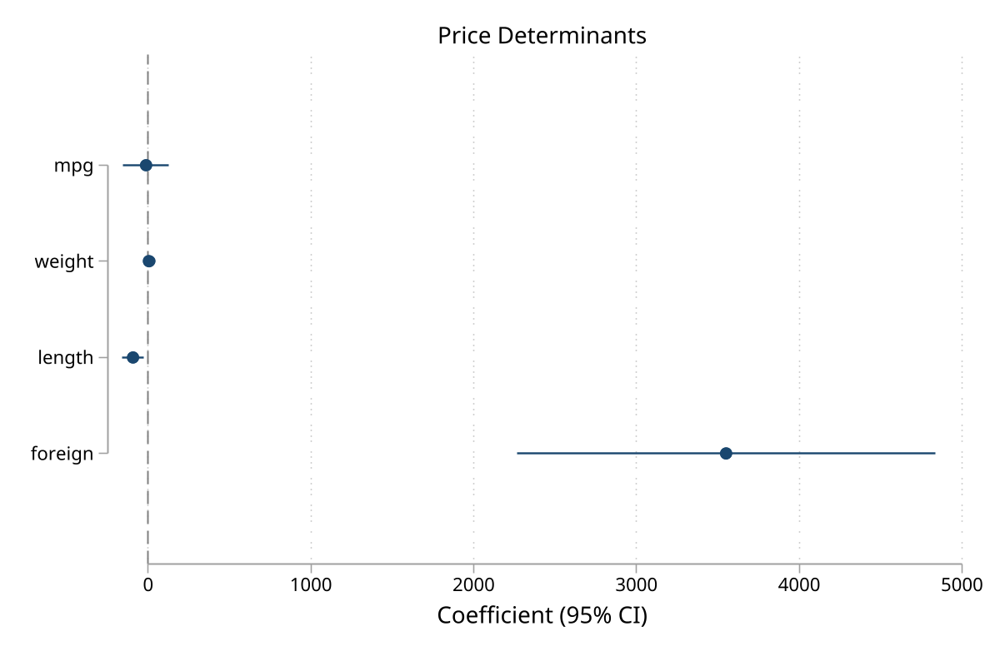
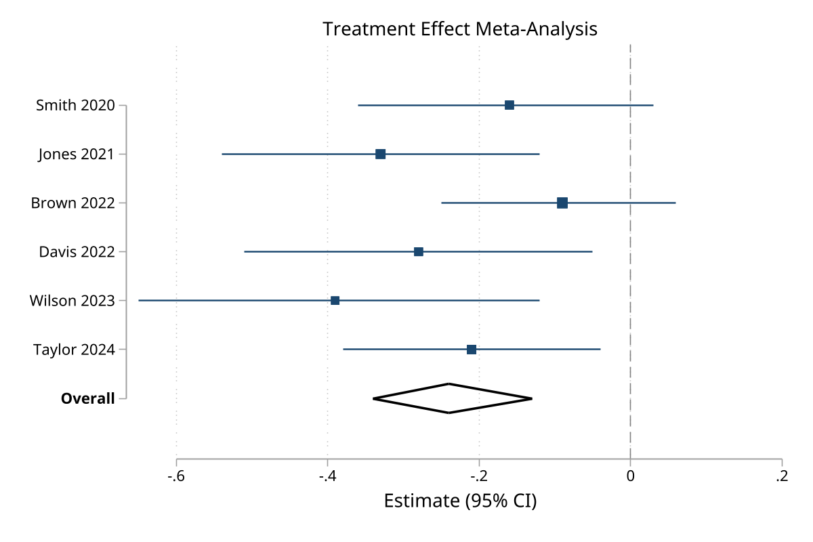

# eplot

 

Unified effect plotting command for creating forest plots and coefficient plots in Stata.

## Overview

`eplot` provides a single, intuitive interface for visualizing effect sizes with confidence intervals from:

- **Data in memory** - Variables containing effect sizes and confidence limits (e.g., meta-analysis results)
- **Stored estimates** - Coefficients from regression models

## Installation

```stata
net install eplot, from("https://raw.githubusercontent.com/tpcopeland/Stata-Dev/main/eplot")
```

## Syntax

### From data in memory

```stata
eplot esvar lcivar ucivar [if] [in], [options]
```

### From stored estimates

```stata
eplot [namelist], [options]
```

Use `.` to refer to active estimation results.

## Key Features

- **Unified syntax** for both data and estimates modes
- **Group labeling** with `groups()` option
- **Section headers** with `headers()` option
- **Eform transformation** for odds ratios, hazard ratios, etc.
- **Weighted markers** that scale with study/observation weights
- **Diamond rendering** for pooled effects (subgroup and overall)
- **Horizontal or vertical** layout options
- **Full customization** via standard Stata graph options

## Screenshots

### Coefficient Plot


### Forest Plot


## Examples

### Basic Forest Plot

```stata
// Create sample data
clear
input str20 study es lci uci weight
"Smith 2020"    -0.16  -0.36  0.03  15.2
"Jones 2021"    -0.33  -0.54 -0.12  18.4
"Brown 2022"    -0.09  -0.25  0.06  22.1
"Wilson 2023"   -0.39  -0.65 -0.12  12.8
"Overall"       -0.24  -0.34 -0.13   .
end

gen byte type = cond(study=="Overall", 5, 1)

eplot es lci uci, labels(study) weights(weight) type(type)
```

### Odds Ratio Forest Plot

```stata
eplot es lci uci, labels(study) weights(weight) type(type) ///
    eform effect("Odds Ratio") ///
    title("Meta-analysis of Treatment Effect")
```

### Coefficient Plot from Regression

```stata
sysuse auto, clear
regress price mpg weight length foreign

eplot ., drop(_cons) ///
    coeflabels(mpg = "Miles per Gallon" ///
               weight = "Vehicle Weight (lbs)" ///
               length = "Length (inches)" ///
               foreign = "Foreign Make") ///
    xline(0) ///
    title("Determinants of Car Price")
```

### Grouped Effects

```stata
regress price mpg weight length turn foreign rep78

eplot ., drop(_cons) ///
    groups(mpg weight length turn = "Vehicle Specs" ///
           foreign rep78 = "Other Factors") ///
    title("Grouped Coefficient Plot")
```

### Coefficient Plot for Propensity Score Model

```stata
* After deriving treatment (Prep 1A) and comorbidities (Prep 1E)
use _examples/cohort.dta, clear
merge 1:1 id using _examples/treatment.dta, nogen keep(match)
merge 1:1 id using _examples/comorbidities.dta, nogen keep(match)

logit treated index_age female i.education diabetes hypertension anxiety

eplot ., drop(_cons) eform ///
    coeflabels(index_age = "Age at Entry" ///
               1.female = "Female" ///
               2.education = "Secondary Education" ///
               3.education = "Tertiary Education" ///
               1.diabetes = "Diabetes" ///
               1.hypertension = "Hypertension" ///
               1.anxiety = "Anxiety Disorder") ///
    xline(1) effect("Odds Ratio") ///
    title("Propensity Score Model: SNRI vs SSRI")
```

### Hazard Ratio Forest Plot from Cox Model

```stata
* After stset survival data (see cstat_surv workflow)
stcox treated index_age i.female i.education

eplot ., drop(_cons) eform ///
    coeflabels(1.treated = "SNRI vs SSRI" ///
               index_age = "Age" ///
               1.female = "Female" ///
               2.education = "Secondary" ///
               3.education = "Tertiary") ///
    effect("Hazard Ratio") ///
    title("Cox Model: Antidepressant Class and CV Risk")
```

## Options

### Data Specification

| Option | Description |
|--------|-------------|
| `labels(varname)` | Variable containing row labels |
| `weights(varname)` | Variable for marker sizing |
| `type(varname)` | Row type (1=effect, 3=subgroup, 5=overall, 0=header) |

### Coefficient Selection

| Option | Description |
|--------|-------------|
| `keep(coeflist)` | Keep specified coefficients (wildcards supported) |
| `drop(coeflist)` | Drop specified coefficients (e.g., `drop(_cons)`) |
| `rename(spec)` | Rename coefficients (estimates mode only) |

### Labeling

| Option | Description |
|--------|-------------|
| `coeflabels(spec)` | Custom labels for coefficients/effects |
| `groups(spec)` | Define groups with headers |
| `headers(spec)` | Insert section headers |

### Transform

| Option | Description |
|--------|-------------|
| `eform` | Exponentiate (OR, HR, RR) |
| `rescale(#)` | Multiply estimates by # |

### Reference Lines

| Option | Description |
|--------|-------------|
| `xline(numlist)` | Add reference lines |
| `null(#)` | Null line position (default: 0, or 1 if eform) |
| `nonull` | Suppress null line |

### Layout & Display

| Option | Description |
|--------|-------------|
| `horizontal` | Horizontal layout (default) |
| `vertical` | Vertical layout |
| `effect(string)` | X-axis title for effects |
| `level(#)` | Confidence level (default: 95) |
| `noci` | Suppress confidence intervals |
| `dp(#)` | Decimal places (default: 2) |

## Type Variable Values

When using `type(varname)`:

| Value | Meaning | Display |
|-------|---------|---------|
| 1 | Effect/Study | Marker + CI |
| 2 | Missing | Text "(Insufficient data)" |
| 3 | Subgroup total | Diamond |
| 5 | Overall total | Diamond |
| 0 | Header | Bold text |
| 6 | Blank | Spacing |

## Stored Results

`eplot` stores the following in `r()`:

| Result | Description |
|--------|-------------|
| `r(N)` | Number of effects plotted |
| `r(cmd)` | Graph command executed |

## Author

Timothy P Copeland<br>
Department of Clinical Neuroscience<br>
Karolinska Institutet

## License

MIT License

## Version

Version 1.0.2, 2026-02-25

## Acknowledgments

Inspired by:
- `forestplot` by David Fisher (UCL)
- `coefplot` by Ben Jann (University of Bern)
