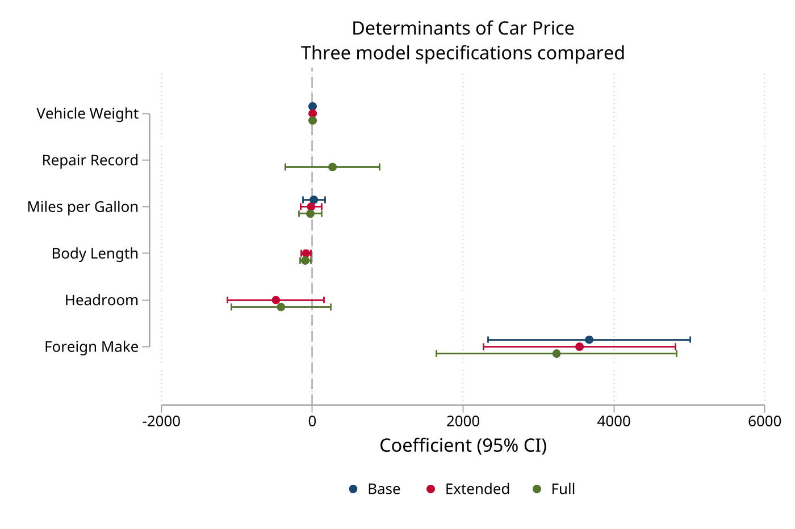
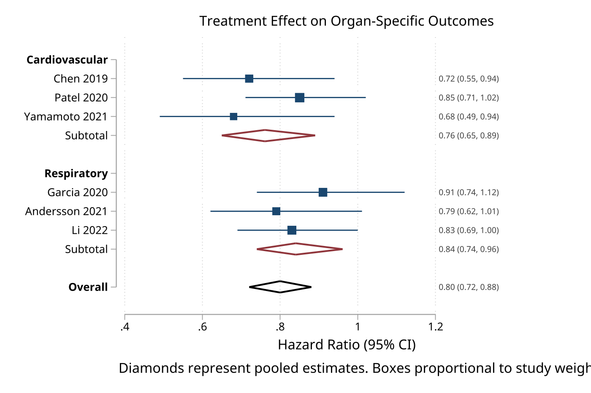
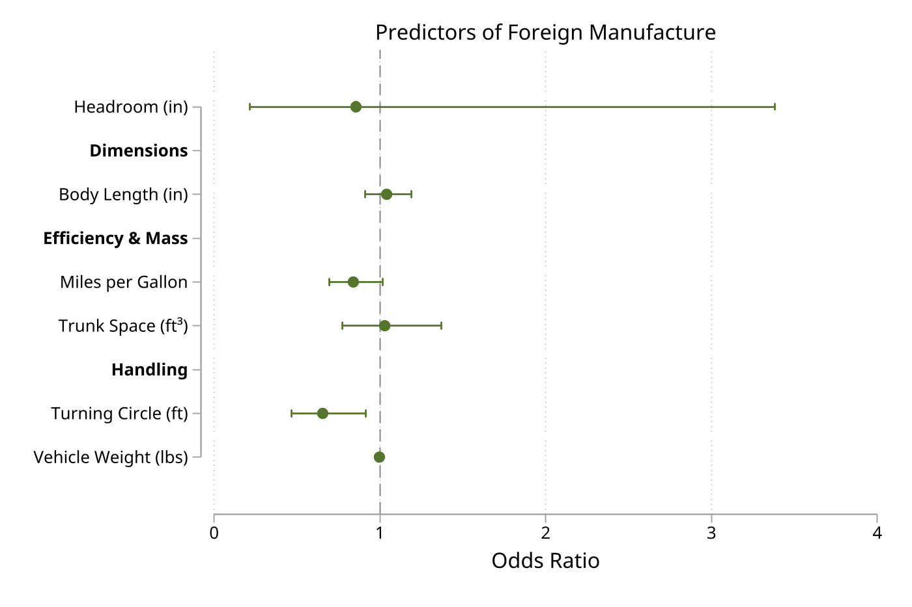

# eplot

 

Unified effect plotting command for creating forest plots and coefficient plots in Stata.

## Overview

`eplot` provides a single, intuitive interface for visualizing effect sizes with confidence intervals from:

- **Data in memory** - Variables containing effect sizes and confidence limits (e.g., meta-analysis results)
- **Stored estimates** - Coefficients from regression models, with multi-model comparison
- **Matrices** - Stata matrices with (b, se) or (b, lci, uci) columns

## Installation

```stata
net install eplot, from("https://raw.githubusercontent.com/tpcopeland/Stata-Tools/main/eplot")
```

## Key Features

- **Multi-model comparison** - Plot coefficients from 2+ models side by side with automatic coloring and legend
- **Values annotation** - Display formatted effect text (e.g., "0.80 (0.72, 0.88)") beside each row
- **Unified syntax** for data, estimates, and matrix modes
- **Group labeling** with bold section headers via `groups()` and `headers()`
- **Eform transformation** for odds ratios, hazard ratios, etc.
- **Weighted markers** that scale with study/observation weights
- **Diamond rendering** for pooled effects (subgroup and overall)
- **Sort/order** coefficients by effect size or explicit ordering
- **Capped CI lines** with the `cicap` option
- **Color palette** for multi-model with full marker/CI customization
- **Matrix mode** for plotting from pre-computed matrices
- **Full customization** via standard Stata graph options

## Screenshots

### Multi-Model Comparison


### Forest Plot with Values Annotation


### Grouped Coefficient Plot


## Syntax

### From data in memory

```stata
eplot esvar lcivar ucivar [if] [in], [options]
```

### From stored estimates (single or multi-model)

```stata
eplot [namelist], [options]
```

Use `.` to refer to active estimation results.

### From matrix

```stata
eplot, matrix(matname) [options]
```

Matrix must have 2 columns (b, se) or 3 columns (b, lci, uci).

## Examples

### Multi-Model Coefficient Comparison

```stata
sysuse auto, clear

quietly regress price mpg weight foreign
estimates store base

quietly regress price mpg weight length headroom foreign
estimates store extended

eplot base extended, drop(_cons) ///
    modellabels("Base" "Extended") ///
    coeflabels(mpg = "Miles per Gallon" ///
               weight = "Vehicle Weight" ///
               length = "Body Length" ///
               headroom = "Headroom" ///
               foreign = "Foreign Make") ///
    cicap scheme(plotplainblind)
```

### Forest Plot with Values Annotation

```stata
clear
input str20 study es lci uci weight
"Smith 2020"    0.72  0.55  0.94  15.2
"Jones 2021"    0.85  0.71  1.02  18.4
"Brown 2022"    0.68  0.49  0.94  22.1
"Overall"       0.76  0.65  0.89   .
end

gen byte type = cond(study=="Overall", 5, 1)

eplot es lci uci, labels(study) weights(weight) type(type) ///
    values vformat(%4.2f) nonull ///
    effect("Hazard Ratio (95% CI)") ///
    scheme(plotplainblind)
```

### Grouped Coefficient Plot

```stata
sysuse auto, clear
logit foreign mpg weight length headroom trunk turn

eplot ., drop(_cons) eform ///
    coeflabels(mpg = "Miles per Gallon" ///
               weight = "Vehicle Weight" ///
               length = "Body Length" ///
               headroom = "Headroom" ///
               trunk = "Trunk Space" ///
               turn = "Turning Circle") ///
    groups(mpg weight = "Efficiency & Mass" ///
           length headroom trunk = "Dimensions" ///
           turn = "Handling") ///
    cicap mcolor(forest_green) ///
    effect("Odds Ratio") scheme(plotplainblind)
```

### Matrix Mode

```stata
matrix R = (1.5, 1.1, 2.0 \ 0.8, 0.6, 1.2 \ 1.2, 0.9, 1.6)
matrix rownames R = "Treatment_A" "Treatment_B" "Treatment_C"
eplot, matrix(R) effect("Odds Ratio") scheme(plotplainblind)
```

## Options

### Data Specification

| Option | Description |
|--------|-------------|
| `labels(varname)` | Variable containing row labels |
| `weights(varname)` | Variable for marker sizing |
| `type(varname)` | Row type (1=effect, 3=subgroup, 5=overall, 0=header) |

### Coefficient Selection

| Option | Description |
|--------|-------------|
| `keep(coeflist)` | Keep specified coefficients (wildcards supported) |
| `drop(coeflist)` | Drop specified coefficients (e.g., `drop(_cons)`) |
| `rename(spec)` | Rename coefficients (estimates mode only) |

### Labeling

| Option | Description |
|--------|-------------|
| `coeflabels(spec)` | Custom labels for coefficients/effects |
| `groups(spec)` | Define groups with bold headers |
| `headers(spec)` | Insert section headers |

### Transform

| Option | Description |
|--------|-------------|
| `eform` | Exponentiate (OR, HR, RR) |
| `rescale(#)` | Multiply estimates by # |

### Display

| Option | Description |
|--------|-------------|
| `values` | Annotate rows with formatted effect text |
| `vformat(fmt)` | Format for values (default: %5.2f) |
| `sort` | Sort coefficients by effect size |
| `order(coeflist)` | Explicit coefficient ordering |
| `cicap` | Capped CI lines |
| `effect(string)` | X-axis title for effects |
| `level(#)` | Confidence level (default: 95) |
| `noci` | Suppress confidence intervals |

### Multi-Model

| Option | Description |
|--------|-------------|
| `modellabels(strlist)` | Custom legend labels for each model |
| `offset(#)` | Vertical spacing between models (default: 0.15) |
| `palette(colorlist)` | Color palette for models |
| `legendopts(string)` | Additional legend options |

### Markers & CI

| Option | Description |
|--------|-------------|
| `mcolor(color)` | Marker color |
| `msymbol(symbol)` | Marker symbol (default: O) |
| `msize(size)` | Marker size |
| `cicolor(color)` | CI line color |
| `ciwidth(lwstyle)` | CI line width |
| `boxscale(#)` | Box size scaling (percentage) |
| `nobox` | Suppress weighted boxes |
| `nodiamonds` | Use markers instead of diamonds for pooled effects |

### Reference Lines

| Option | Description |
|--------|-------------|
| `xline(numlist)` | Add reference lines |
| `null(#)` | Null line position (default: 0, or 1 if eform) |
| `nonull` | Suppress null line |

## Stored Results

`eplot` stores the following in `r()`:

| Result | Description |
|--------|-------------|
| `r(N)` | Number of effects plotted |
| `r(n_models)` | Number of models (estimates mode) |
| `r(cmd)` | Graph command executed |

## Author

Timothy P Copeland<br>
Department of Clinical Neuroscience<br>
Karolinska Institutet

## License

MIT License

## Version

Version 2.0.0, 2026-03-13
