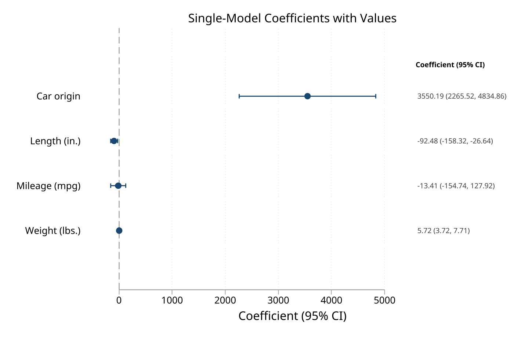
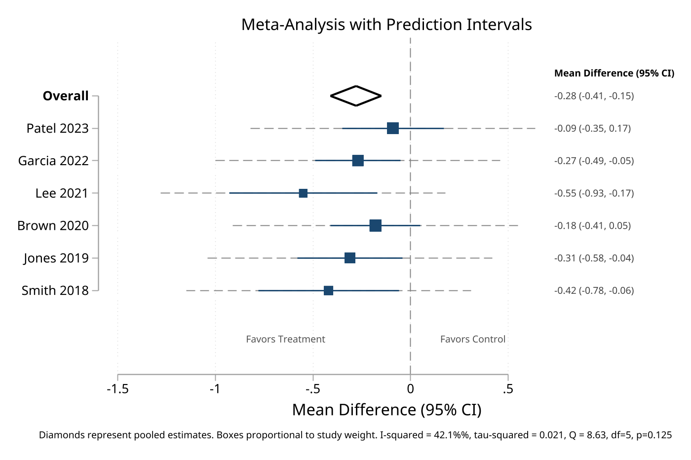
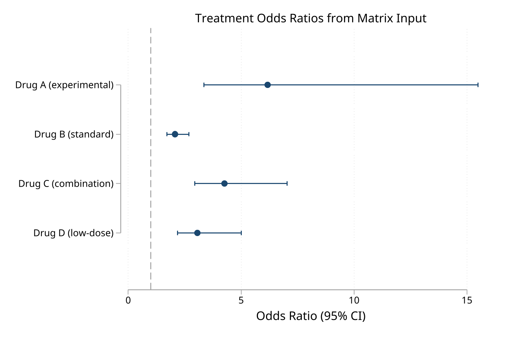
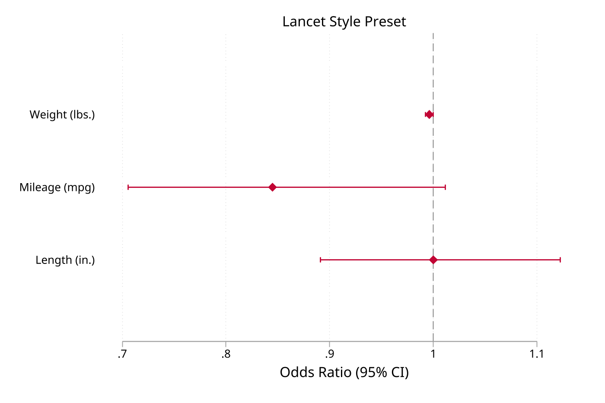
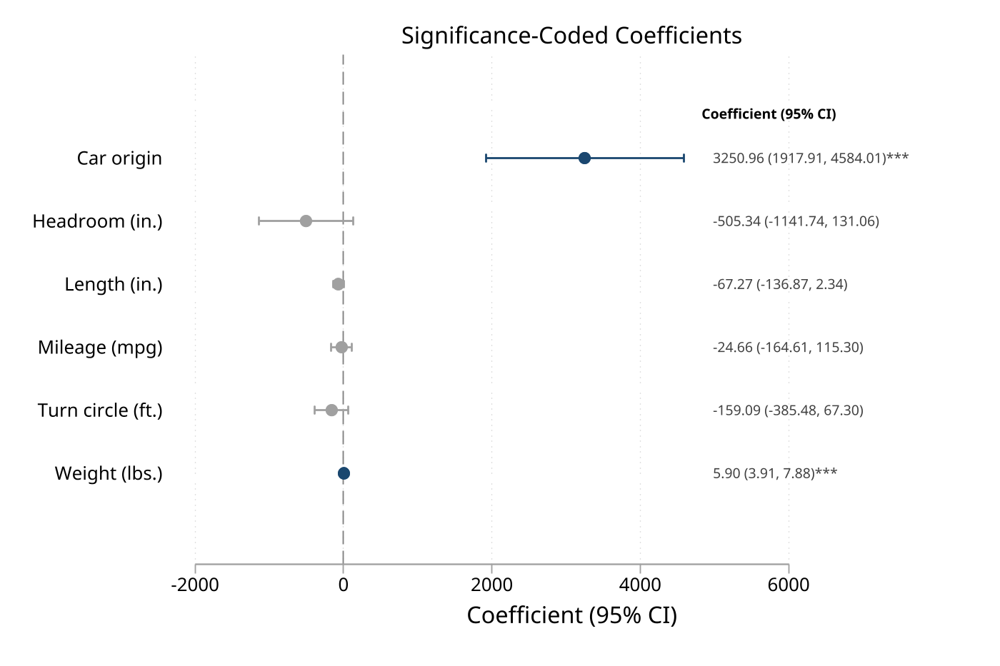

# eplot — Unified effect plotting from data, estimates, matrices, and frames

**Version 1.2.0** | 2026-06-06

`eplot` creates forest plots and coefficient plots from four sources — variables in memory, active or stored estimation results, preassembled matrices, and graph-ready frames — under one command with one set of options.

## Quick Start

Run a regression and plot the coefficients in two lines:

```stata
sysuse auto, clear
regress price mpg weight foreign
eplot ., drop(_cons) cicap
```

That's it. `eplot .` reads the active estimation results and draws a coefficient plot with capped confidence intervals.

## Requirements

- Stata 16 or later
- No external package dependencies

## Installation

```stata
capture ado uninstall eplot
net install eplot, from("https://raw.githubusercontent.com/tpcopeland/Stata-Tools/main/eplot") replace
```

## Commands

| Command | Description |
|---------|-------------|
| `eplot` | Draw effect plots from data in memory, estimation results, matrices, or graph-ready frames |

## How It Works

`eplot` detects its input mode automatically from the arguments you supply:

| Call | Mode | When to use |
|------|------|-------------|
| `eplot es lci uci, ...` | **Data** | Effect sizes already in variables (meta-analysis, imported results) |
| `eplot .` or `eplot m1 m2, ...` | **Estimates** | Plot coefficients from a regression you just ran, or compare stored models |
| `eplot, matrix(R) ...` | **Matrix** | Results assembled in a Stata matrix |
| `eplot, frame(F) ...` | **Frame** | Results assembled in a graph-ready Stata frame, including tabtools `eplotframe()` output |

Mode detection gives precedence to explicit `frame()` and `matrix()` calls, then to data mode when the first three tokens are numeric variables. In ambiguous cases, use `eplot .` to force estimates mode, `matrix()` to force matrix mode, or `frame()` to force frame mode explicitly.

## Feature Highlights

- **One command, four input modes** — data in memory, estimation results, matrices, and graph-ready frames share one option vocabulary
- **Tabtools bridge** — plot frames emitted by `regtab`, `effecttab`, `comptab`, and `hrcomptab` through their `eplotframe()` options
- **Journal style presets** — `style(lancet)`, `style(jama)`, `style(nejm)`, `style(bmj)` apply ready-made looks; override any individual element
- **Multi-model comparison** — overlay stored estimates side by side with `modellabels()`, `offset()`, and `palette()`
- **Values annotation** — add formatted effect text next to each marker with `values`; customize with `vformat()` and `stars`
- **Significance coloring** — `sigcolors` draws significant and non-significant effects in contrasting colors
- **Grouped and annotated layouts** — `groups()`, `headers()`, `gap()`, and `favors()` organize complex plots
- **Meta-analysis support** — prediction intervals (`pi()`), heterogeneity statistics (`i2()`, `tau2()`, `qstat()`), weighted boxes, and diamond pooled effects
- **Eform with auto-labeling** — `eform` exponentiates coefficients and sets the axis label automatically (Odds Ratio, Hazard Ratio, IRR)

## Worked Examples

### 1. Coefficient plot with custom labels

The fastest way to use `eplot` — run a regression, then plot the results immediately.

```stata
sysuse auto, clear
regress price mpg weight foreign

eplot ., drop(_cons) ///
    coeflabels(mpg = "Miles per Gallon" ///
               weight = "Vehicle Weight" ///
               foreign = "Foreign Make") ///
    cicap values
```



### 2. Compare two stored models

Multi-model estimates mode is useful when you want to compare a base model and an adjusted model side by side.

```stata
sysuse auto, clear

quietly regress price mpg weight foreign
estimates store base

quietly regress price mpg weight length foreign headroom
estimates store extended

eplot base extended, drop(_cons) ///
    modellabels("Base" "Extended") ///
    coeflabels(mpg = "Miles per Gallon" ///
               weight = "Vehicle Weight" ///
               length = "Body Length" ///
               headroom = "Headroom" ///
               foreign = "Foreign Make") ///
    cicap
```


### 3. Forest plot from data in memory

Use data mode when you already have effect sizes and confidence limits in variables — for example, after a meta-analysis or when reading results from another system.

```stata
clear
input str20 study es lci uci weight
"Smith 2020"   -0.16  -0.36   0.03  15.2
"Jones 2021"   -0.33  -0.54  -0.12  18.4
"Brown 2022"   -0.09  -0.25   0.06  22.1
"Wilson 2023"  -0.39  -0.65  -0.12  12.8
"Overall"      -0.24  -0.34  -0.13   .
end

gen byte type = cond(study == "Overall", 5, 1)

eplot es lci uci, labels(study) weights(weight) type(type) ///
    values effect("Mean Difference (95% CI)")
```


### 4. Meta-analysis forest plot with heterogeneity

Data mode supports prediction intervals and heterogeneity statistics for publication-ready meta-analysis plots.

```stata
clear
input str20 study es lci uci weight byte type
"Smith 2018"   -0.42  -0.78  -0.06  12.3  1
"Jones 2019"   -0.31  -0.58  -0.04  16.8  1
"Brown 2020"   -0.18  -0.41   0.05  21.5  1
"Lee 2021"     -0.55  -0.93  -0.17  10.2  1
"Garcia 2022"  -0.27  -0.49  -0.05  19.1  1
"Patel 2023"   -0.09  -0.35   0.17  20.1  1
"Overall"      -0.28  -0.41  -0.15   .    5
end

eplot es lci uci, labels(study) weights(weight) type(type) ///
    values vformat(%4.2f) ///
    i2("42.1") tau2("0.021") qstat("8.63, df=5, p=0.125") ///
    effect("Mean Difference (95% CI)")
```



### 5. Plot from a matrix

Matrix mode is useful when the effect table is already assembled programmatically.

```stata
matrix R = (1.5, 1.1, 2.0 \ 0.8, 0.6, 1.2 \ 1.2, 0.9, 1.6)
matrix rownames R = "Treatment_A" "Treatment_B" "Treatment_C"

eplot, matrix(R) eform ///
    effect("Odds Ratio") ///
    values
```



### 6. Logistic regression with odds ratios

After a logistic model, `eform` exponentiates coefficients to odds ratios and sets the axis label automatically. Factor variables are labeled using Stata's value labels.

```stata
sysuse auto, clear
logit foreign mpg weight i.rep78
eplot ., eform cicap values
```

### 7. Grouped coefficients with significance coloring

Layer options to organize and annotate complex plots. `groups()` adds section headers, `gap()` adds space between groups, `sigcolors` highlights statistical significance, and `stars` adds asterisks.

```stata
sysuse auto, clear
regress price mpg weight length turn foreign rep78

eplot ., noconstant ///
    groups(mpg weight length turn = "Vehicle Characteristics" ///
           foreign rep78 = "Other Factors") ///
    gap(0.5) ///
    stars values sigcolors
```


### 8. Journal style presets

Apply a journal-style preset, then override individual elements as needed.

```stata
sysuse auto, clear
regress price mpg weight foreign
eplot ., noconstant style(lancet)
```



### 9. Significance coloring with custom colors

```stata
eplot ., noconstant sigcolors sigcolor(navy) insigncolor(gs12) cicap
```



## Option Reference

Options are organized by function. Not every option works in every mode — see `help eplot` for per-option mode availability.

| Category | Options |
|----------|---------|
| **Data specification** | `labels()`, `weights()`, `type()` |
| **Coefficient selection** | `keep()`, `drop()`, `rename()`, `noconstant` |
| **Labeling** | `coeflabels()`, `groups()`, `headers()`, `gap()` |
| **Transform** | `eform`, `rescale()` |
| **Reference lines** | `null()`, `nonull`, `xline()`, `xlabel()` |
| **Confidence intervals** | `level()`, `noci`, `cicap` |
| **Display** | `dp()`, `effect()`, `values`, `vformat()`, `stars`, `sigcolors`, `sigcolor()`, `insigncolor()`, `style()`, `favors()` |
| **Prediction/heterogeneity** | `pi()`, `i2()`, `tau2()`, `qstat()` |
| **Layout** | `horizontal`, `vertical`, `sort`, `order()` |
| **Multi-model** | `modellabels()`, `offset()`, `palette()`, `legendopts()` |
| **Markers** | `mcolor()`, `msymbol()`, `msize()`, `boxscale()`, `nobox`, `nodiamonds`, `cicolor()`, `ciwidth()` |
| **Graph** | `title()`, `subtitle()`, `note()`, `name()`, `saving()`, `scheme()`, `plotregion()`, `graphregion()`, `aspect()`, plus any `twoway` option |

## Also See

- `help eplot` — full documentation with clickable examples
- [`coefplot`](https://repec.sowi.unibe.ch/stata/coefplot/) (Ben Jann, SSC) — comprehensive coefficient plotting
- [`metan`](https://ideas.repec.org/c/boc/bocode/s456798.html) (SSC) — meta-analysis with forest plots
- Stata 18+: `meta forestplot` — official meta-analysis forest plots

## Version History

- **1.2.0** (2026-06-06): Added frame input mode via `eplot, frame(framename)` with default `estimate`, `ll`, `ul`, `label`, `rowtype`, `pvalue`, and weight-variable detection for tabtools companion frames
- **1.1.1** (2026-04-30): Fixed y-axis ordering bug where categorical labels appeared in reverse order across all plotting modes (data, estimates, matrix)
- **1.1.0** (2026-04-19): Added `gap()` for grouped spacing, effect-axis `xlabel()` passthrough, automatic value-annotation margin sizing, and clearer mode-detection documentation
- **1.0.0** (2026-04-12): Initial release with data, estimates, and matrix modes; multi-model comparison; journal style presets; significance coloring; meta-analysis features

## Author

Timothy P Copeland, Karolinska Institutet
