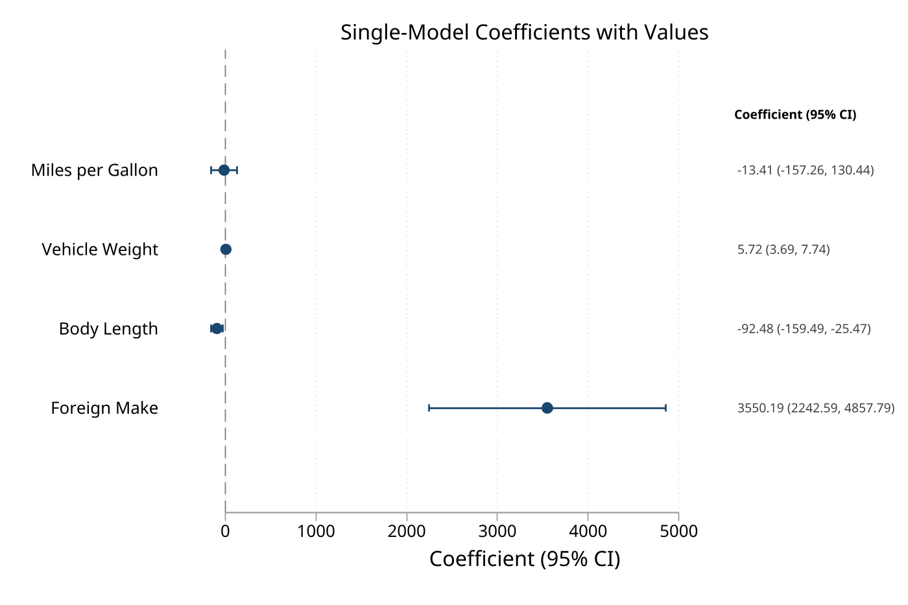
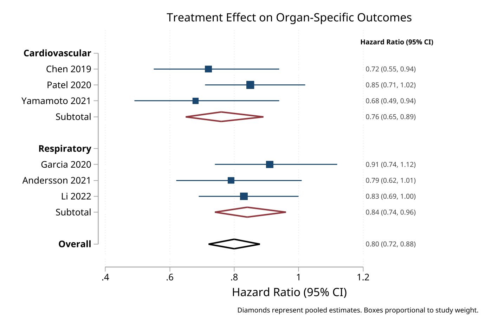
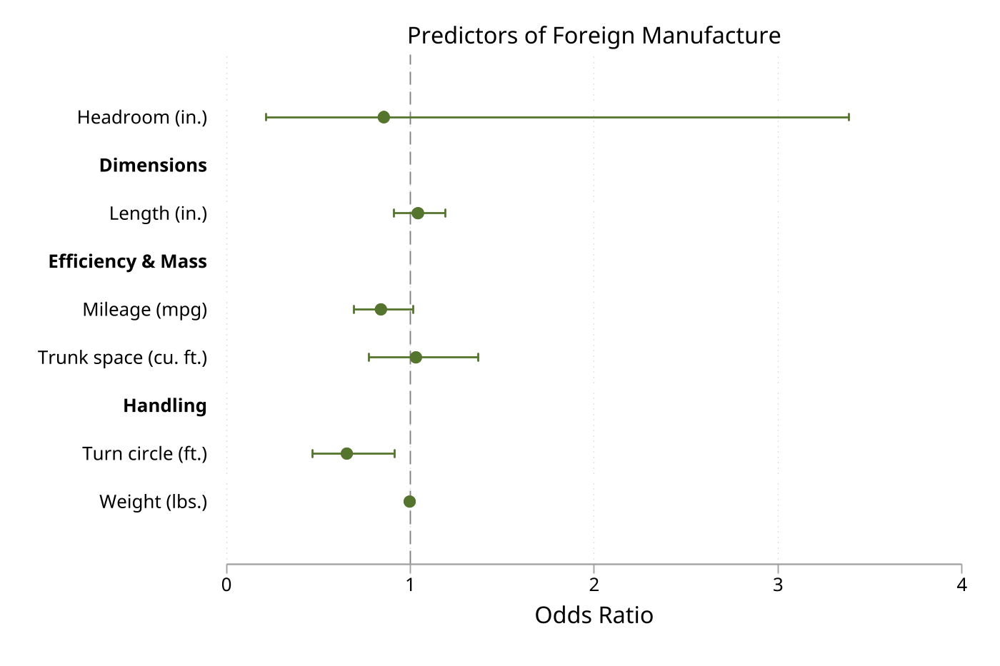
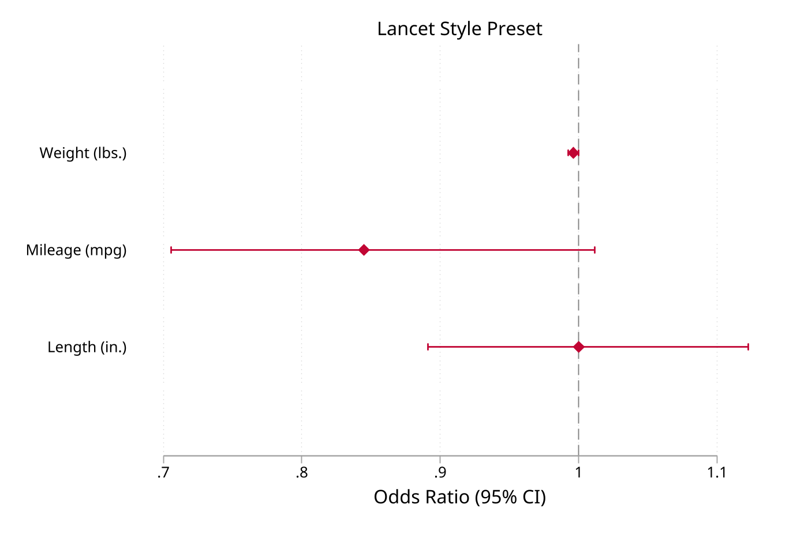
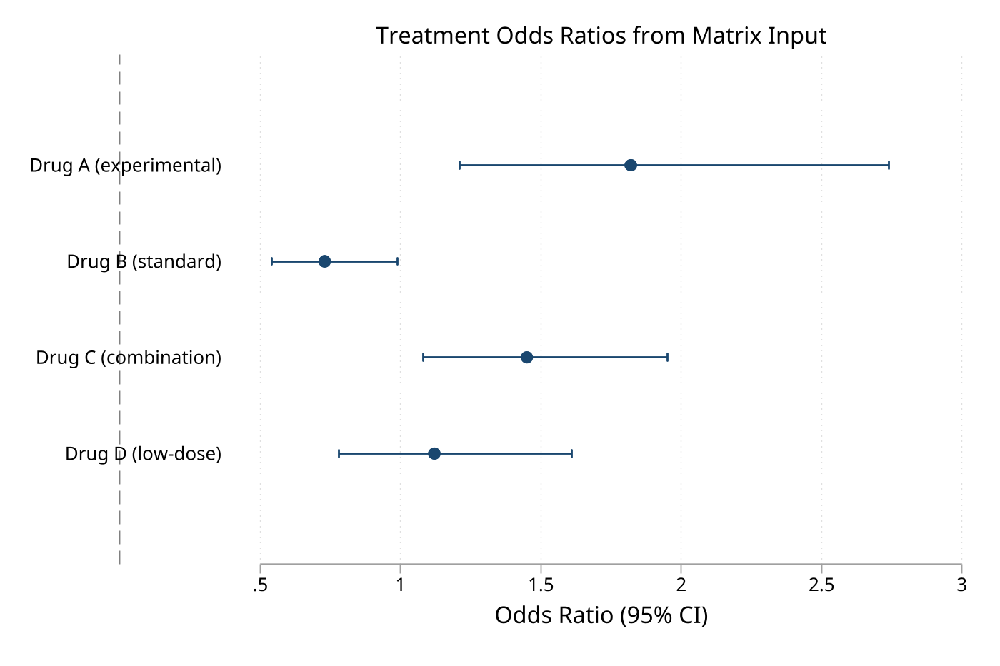
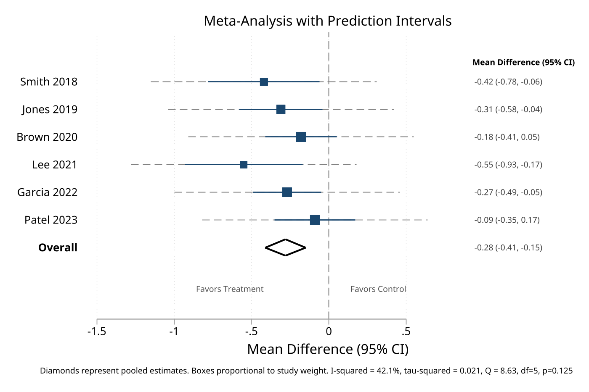
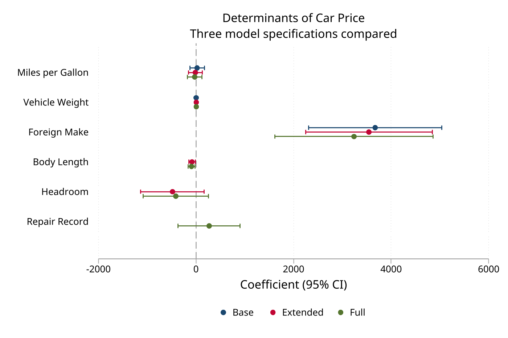
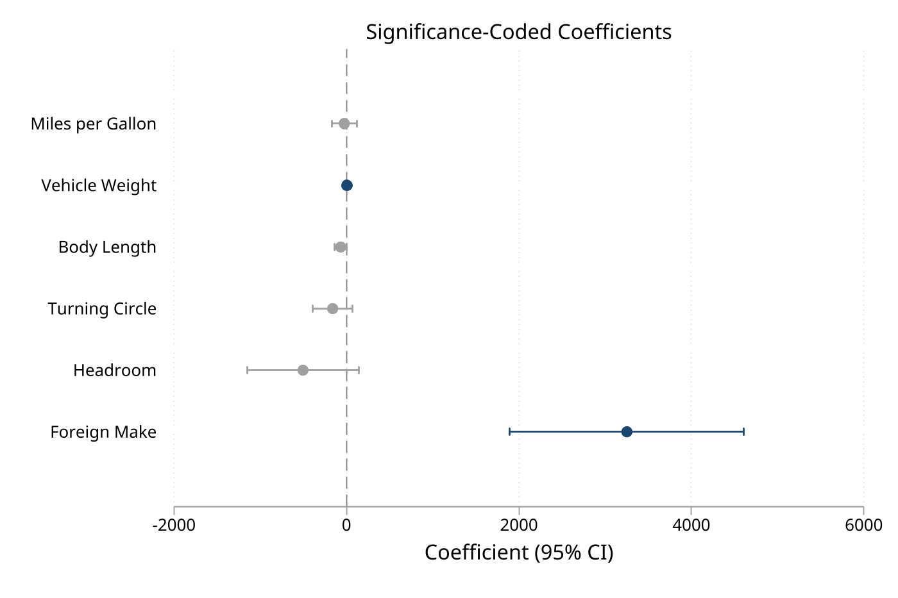

# eplot — Unified effect plotting from data, estimates, matrices, and frames

**Version 1.2.6** | 2026-08-05

`eplot` creates forest plots and coefficient plots from variables, estimation results, matrices, or graph-ready frames. It gives applied Stata users one plotting workflow for effect sizes, confidence intervals, model comparison, and publication-oriented annotations.

## Quick Start

```stata
sysuse auto, clear
regress price mpg weight foreign
eplot ., drop(_cons) cicap
```

`eplot .` plots the active estimation results; `cicap` draws capped confidence intervals.

## Requirements

- Stata 16 or later
- No required external packages
- The optional `tabtools` companion-frame workflow requires sibling `tabtools`; its `regtab`, `effecttab`, `comptab`, and `hrcomptab` commands require Stata 17 or later

## Installation

Install the released package from Stata-Tools:

```stata
capture ado uninstall eplot
net install eplot, from("https://raw.githubusercontent.com/tpcopeland/Stata-Tools/main/eplot") replace
```

For a local Stata-Tools checkout, replace the URL with the package directory:

```stata
capture ado uninstall eplot
net install eplot, from("/path/to/Stata-Tools/eplot") replace
```

## Commands

| Command | Description |
|---------|-------------|
| `eplot` | Draw forest and coefficient plots from data, estimates, matrices, or frames |

## How It Works

`eplot` selects an input mode from the call and then applies a shared plotting vocabulary to the resulting effects and confidence limits.

| Calling convention | Mode | Use it when |
|--------------------|------|-------------|
| `eplot esvar lcivar ucivar [if] [in], ...` | Data | Point estimates and confidence limits are variables in the active dataset |
| `eplot [namelist], ...` | Estimates | Plot active estimates with `eplot .` or compare stored models |
| `eplot, matrix(matname) ...` | Matrix | Results are assembled in a Stata matrix |
| `eplot, frame(framename) ...` | Frame | A graph-ready result table is stored in a Stata frame |

Mode detection checks explicit `matrix()` first, then `frame()`. With no namelist or with `.` it uses active estimation results; a call with three leading numeric variables selects data mode, and estimate names select estimates mode. Use an explicit selector when a variable name and stored estimate name could be confused.

Data mode uses the three variables as estimate, lower confidence limit, and upper confidence limit. Optional `type()` values identify headers, regular effects, pooled subgroup/overall effects, heterogeneity rows, and blank spacers. Matrix mode accepts either two columns (`b`, `se`) or three columns (`b`, `ll`, `ul`), and row names supply plot labels when present.

Frame mode requires numeric `estimate`, `ll`, and `ul` variables unless `estimate()`, `ll()`, and `ul()` override those names. It automatically uses string `label`, numeric or string `rowtype` or `type`, numeric `weight` or `weights`, and numeric `pvalue` variables when they are present; `type()` and `rowtype()` are mutually exclusive. Frame mode reuses the data-mode plotting options, including groups, headers, pooled rows, weights, prediction intervals, and heterogeneity notes.

The optional `tabtools` bridge lets `regtab`, `effecttab`, `comptab`, and `hrcomptab` produce companion frames for `eplot, frame()`. The repository demo documents that workflow and requires sibling `tabtools`, `tc_schemes`, and `logdoc` packages, the `_data/` fixtures, and Stata 17 or later.

## Worked Examples

### 1. Data mode: forest plot from variables

Use data mode when point estimates and confidence limits already exist in the dataset.

```stata
clear
input str20 study double es lci uci weight byte type
"Study A"  -.16  -.36   .03  15.2  1
"Study B"  -.33  -.54  -.12  18.4  1
"Study C"  -.09  -.25   .06  22.1  1
"Overall" -.24  -.34  -.13      .  5
end

eplot es lci uci, labels(study) weights(weight) type(type) values ///
    effect("Mean Difference (95% CI)")
```

The type-5 row is drawn as a pooled diamond, while the study rows use weight-proportional boxes.

### 2. Estimates mode: compare stored models

Store models in the order you want them shown, then supply their names and optional legend labels.

```stata
sysuse auto, clear
quietly regress price mpg weight foreign
estimates store base
quietly regress price mpg weight length headroom foreign
estimates store extended

eplot base extended, drop(_cons) ///
    modellabels("Base" "Extended") cicap
```

A single active model uses `eplot .`; multiple models share coefficient rows and receive separate legend entries.

### 3. Matrix mode: exponentiated effects with stars

A two-column matrix is interpreted as `b` and `se`, so confidence limits and p-values can be computed.

```stata
matrix R = (0.20, 0.10 \ -0.10, 0.08 \ 0.30, 0.12)
matrix rownames R = Treatment_A Treatment_B Treatment_C

eplot, matrix(R) eform values stars ///
    effect("Odds Ratio (95% CI)")
```

Use a three-column matrix when the second and third columns are already the lower and upper confidence limits.

### 4. Frame mode: plot a graph-ready frame

Frame mode can consume a custom frame directly and auto-detect its `pvalue` variable for `stars`.

```stata
clear
input str12 label double estimate ll ul pvalue byte rowtype
"Age"     1.12 1.04 1.20 0.004 1
"Sex"     0.86 0.70 1.06 0.150 1
"Overall" 1.03 0.97 1.10 0.320 5
end
frame put label estimate ll ul pvalue rowtype, into(effects)

eplot, frame(effects) values stars rowtype(rowtype) ///
    effect("Odds Ratio (95% CI)")
frame drop effects
```

The active dataset is restored after the frame is copied and plotted.

### 5. Estimates mode: eform, grouping, and style

Use `eform` for log-scale model output; explicit labels and groups can be layered over a journal preset.

```stata
sysuse auto, clear
logit foreign mpg weight length headroom trunk turn

eplot ., noconstant eform style(lancet) values ///
    groups(mpg weight = "Efficiency and mass" ///
           length headroom trunk turn = "Vehicle dimensions") ///
    gap(.5)
```

In estimates mode, `eform` sets the null line to 1 and suppresses `_cons` automatically.

## Gallery

The eight core figures below are reproducible from a repository checkout; run `demo/demo_eplot.do` to regenerate them. Run `demo/demo_tabtools_eplot.do` to regenerate the two bridge figures; that optional integration workflow also needs sibling `tabtools`, `tc_schemes`, `logdoc`, the repository `_data/` fixtures, and Stata 17 or later. These demos are checkout workflows and are not part of the `net install` payload.

| Output | Command focus |
|--------|---------------|
|  | `values` after a single regression |
|  | `comptab` forest bridge |
|  | `regtab` to `eplot, frame()` |
|  | `type()`, `weights()`, and pooled rows |
|  | `groups()` and `eform` |
|  | `style(lancet)` |
|  | `matrix()` and `eform` |
|  | `pi()`, `i2()`, `tau2()`, and `qstat()` |
|  | `modellabels()` and `palette()` |
|  | `sigcolors`, `sigcolor()`, and `insigncolor()` |

## Key Options

Availability tags are `D` = data, `E` = estimates, `M` = matrix, and `F` = frame. Frame mode accepts the data-mode plotting options after its frame selector. Options not marked with a mode are accepted in all four modes; additional `twoway` graph options are passed through.

### Input and row structure

| Option | Modes | Contract and default |
|--------|-------|----------------------|
| `matrix(matname)` | M | Selects a two- or three-column matrix |
| `frame(framename)` | F | Selects a graph-ready frame |
| `estimate(varname)`, `ll(varname)`, `ul(varname)` | F | Override frame variables; defaults are `estimate`, `ll`, and `ul` |
| `labels(varname)` | D, F | String row labels; data mode defaults to `Row 1`, `Row 2`, and so on; frame mode auto-detects `label` |
| `weights(varname)` | D, F | Numeric marker/box weights; frame mode auto-detects `weight`, then `weights` |
| `type(varname)` | D, F | Row-role variable; omitted rows are regular effects |
| `rowtype(varname)` | F | Frame synonym for `type()`; auto-detected when present |
| `pvalue(varname)` | D, F | Numeric p-values for `stars` and `r(pvalues)`; frame mode auto-detects `pvalue` |
| `pi(lci_var uci_var)` | D, F | Prediction-limit variables drawn as dashed whiskers behind confidence intervals |

Data/frame `type()` values are 0 = header, 1 = regular effect, 2 = missing/excluded, 3 = subgroup pooled effect, 4 = heterogeneity row, 5 = overall pooled effect, and 6 = blank spacer. String values `header`/`section`, `missing`/`reference`, `subgroup`, `hetinfo`, `overall`, and `blank` are also recognized.

### Selection and labeling

| Option | Modes | Contract and default |
|--------|-------|----------------------|
| `keep(coeflist)` | D, E, M, F | Keep only listed names; `*` and `?` wildcards are supported |
| `drop(coeflist)` | D, E, M, F | Drop listed names; `*` and `?` wildcards are supported |
| `rename(spec)` | E | Rename estimates for display before labels/groups are applied |
| `noconstant` | D, E, M, F | Add `_cons` to the drop list |
| `coeflabels(spec)` | D, E, M, F | Replace displayed coefficient/effect labels |
| `groups(spec)` | D, E single, F | Insert bold group headers |
| `headers(spec)` / `headings(spec)` | D, E single, F | Insert a header before a named effect; `headings()` is an alias |
| `gap(#)` | D, E single, F | Extra group spacing; default is `0` |

### Transform, reference lines, and intervals

| Option | Modes | Contract and default |
|--------|-------|----------------------|
| `eform` | D, E, M, F | Exponentiate estimates and limits; the null defaults to 1 instead of 0 |
| `rescale(#)` | D, E, M, F | Multiply estimates and limits; default is `1` |
| `xline(numlist[, line_options])` | D, E, M, F | Add reference lines; bare positions use a light dashed style |
| `xlabel(spec)` | D, E, M, F | Set effect-axis ticks in either orientation |
| `null(#)` | D, E, M, F | Null line position; default is `0`, or `1` with `eform` |
| `nonull` | D, E, M, F | Suppress the null line |
| `level(#)` | E, M | Confidence level for constructed intervals; default is current `c(level)`, normally 95 |
| `noci` | D, E, M, F | Suppress confidence-interval whiskers |
| `cicap` | D, E, M, F | Use capped `rcap` intervals instead of `rspike` |

### Display, significance, and meta-analysis

| Option | Modes | Contract and default |
|--------|-------|----------------------|
| `dp(#)` | D, E, M, F | Decimal places for `values`; default is `2` |
| `effect(string)` | D, E, M, F | Effect-axis title; data/frame default to `Estimate (95% CI)` or `Effect (95% CI)` with `eform`, while estimates/matrix use the current CI level |
| `values` | D, E single, M, F | Annotate rows with estimate and interval text; requires horizontal layout |
| `vformat(fmt)` | D, E, M, F | Numeric `values` format; default is `%5.2f`, or a format based on `dp()` |
| `stars` | D, E single, M 2-column, F | Append p-value stars to `values`; data mode requires `pvalue()`, while frame mode uses `pvalue()` or an auto-detected `pvalue` variable |
| `sigcolors` | D, E single, M, F | Color single-model effects by whether the interval excludes `null()`; multi-model estimates use `palette()` colors |
| `sigcolor(color)` | D, E single, M, F | Significant-effect color when `sigcolors` is set; default is `cranberry` |
| `insigncolor(color)` | D, E single, M, F | Non-significant-effect color when `sigcolors` is set; default is `gs10` |
| `favors(left right)` | D, E, M, F | Add directional labels below a horizontal effect axis |
| `i2(string)`, `tau2(string)`, `qstat(string)` | D, F | Add supplied heterogeneity text to the graph note; values are not computed |
| `style(name)` | D, E, M, F | Presets: `forest`, `coef`, `lancet`, `jama`, `nejm`, and `bmj`; explicit options override preset defaults |

### Layout and model comparison

| Option | Modes | Contract and default |
|--------|-------|----------------------|
| `horizontal` / `vertical` | D, E, M, F | Horizontal is the default; vertical puts effects on the y-axis |
| `sort` | D, E, M, F | Sort regular effects by estimate; data/frame headers, pooled rows, and blanks retain their original row slots |
| `order(coeflist)` | D, E, M, F | Explicit order; unmatched names are placed last |
| `modellabels(strlist)` | E | Legend labels in model order |
| `offset(#)` | E | Vertical model spacing; default is `0.15` |
| `palette(colorlist)` | E | Model colors; default is `navy cranberry forest_green dkorange purple teal maroon olive_teal` |
| `legendopts(string)` | E | Additional legend options; default is `rows(1) pos(6) size(small)` |

### Markers and graph options

| Option | Modes | Contract and default |
|--------|-------|----------------------|
| `mcolor(color)` | D, E, M, F | Marker color; default is `navy` in single-model plots, while multi-model estimates use `palette()` colors |
| `msymbol(symbol)` | D, E, M, F | Marker symbol; default is `O` |
| `msize(size)` | D, E, M, F | Marker size; default is `medium`, or `medsmall` for multi-model estimates |
| `boxscale(#)` | D, F | Weighted-box scaling; default is `100` percent |
| `nobox` | D, F | Replace weight-proportional squares with standard markers |
| `nodiamonds` | D, F | Replace pooled-effect diamonds with standard markers |
| `cicolor(color)` | D, E, M, F | CI line color; default follows `mcolor()` in single-model plots, while multi-model estimates use `palette()` colors |
| `ciwidth(lwstyle)` | D, E, M, F | CI line width; default is `medium` |
| `title(string)`, `subtitle(string)`, `note(string)` | D, E, M, F | Graph title, subtitle, and note |
| `name(string)`, `saving(filename)`, `scheme(schemename)` | D, E, M, F | Graph name, saved graph path, and scheme |
| `plotregion(options)`, `graphregion(options)`, `aspect(#)` | D, E, M, F | Standard Stata graph-region and aspect options |
| `twoway` options | D, E, M, F | Other options are appended to the generated `twoway` command |

## Stored Results

After a successful call, `eplot` returns r-class results. Use `return list` and `matrix list r(table)` to inspect them.

| Result | Type | Meaning |
|--------|------|---------|
| `r(N)` | Scalar | Number of display rows, including generated `groups()`/`headers()` rows and data/frame non-effect rows retained through `type()` |
| `r(k)` | Scalar | Number of regular plotted effects; pooled rows and headers are excluded where applicable |
| `r(n_models)` | Scalar | Number of models in estimates mode; not returned for other modes |
| `r(cmd)` | Local macro | Full generated `twoway` command |
| `r(table)` | Matrix | `b`, `ll`, and `ul` columns; multi-model estimates use `b_1 ll_1 ul_1 ...` |
| `r(pvalues)` | Matrix | P-values when supplied in data/frame mode, available for one-model estimates, or requested for a two-column matrix with `stars` |

For a single estimates model or a matrix, `r(table)` is k × 3. For multiple estimates it is k × (3 × number of models), with three columns per model. Data- and frame-mode pooled subgroup and overall rows appear in `r(table)` even though `r(k)` counts regular type-1 rows.

## Assumptions and Limits

- Data and frame modes take confidence limits from supplied variables; `level()` is only for intervals constructed in estimates and matrix modes.
- Data/frame effect titles therefore default to 95% CI wording; estimates/matrix titles use the current `c(level)`, and estimates-mode `eform` can auto-label odds ratios, hazard ratios, or IRRs from the estimation command.
- Matrix mode requires exactly two columns (`b`, `se`) or three columns (`b`, `ll`, `ul`); two-column input is the only matrix form that supports `stars`.
- `values` and `favors()` require horizontal layout; `values` is available only for a single estimates model.
- `groups()`, `headers()`, and `gap()` apply to data/frame mode and single-model estimates; they are ignored for multi-model estimates.
- `eform` exponentiates supplied values, sets the null to 1, and suppresses `_cons` automatically in estimates and matrix modes.
- In data mode, three leading numeric variables win mode detection even if their names also match stored estimates; use `eplot .`, `matrix()`, or `frame()` to disambiguate.
- In multi-model estimates, `palette()` controls per-model colors; `sigcolors`, `mcolor()`, and `cicolor()` do not override that palette.
- Style presets supply defaults only; explicitly supplied options take precedence.

## References

- [coefplot](https://repec.sowi.unibe.ch/stata/coefplot/) by Ben Jann — a comprehensive coefficient-plot command available from SSC
- [metan](https://ideas.repec.org/c/boc/bocode/s456798.html) — a user-written meta-analysis command available from SSC
- Stata 18+: `meta forestplot` — the official meta-analysis forest-plot command

## QA

QA suites and how to run them are documented in [`qa/README.md`](qa/README.md).

## Version History

- **1.2.6** (2026-08-05): Kept non-effect rows in their original slots when sorting data/frame input; aligned frame-mode option documentation, dynamic confidence-level defaults, row-type aliases, graph-option prose, and the tabtools integration demo with current behavior.
- **1.2.5** (2026-07-10): Returned `r(pvalues)` for 2-column matrix input with `stars`, as documented; rows with unavailable p-values are now excluded consistently from the estimates-mode p-value matrix.
- **1.2.4** (2026-07-06): `xline()` now accepts an optional `line_options` clause after the positions, while bare `xline(numlist)` keeps the default light dashed look.
- **1.2.3** (2026-06-15): Internal hygiene declared label-mutating helpers `nclass` and aligned the estimates-mode stars p-value guard with matrix mode; no user-visible behavior change.
- **1.2.2** (2026-06-14): Suppressed the category axis line and tick marks by default in data and matrix modes, and made estimates-mode `coeflabels()` override variable labels reliably.
- **1.2.1** (2026-06-14): Fixed `insigncolor()`, restored estimates-mode model order, improved mistyped-estimate errors, and made the ado file safe to re-run in a session.
- **1.2.0** (2026-06-06): Added frame input mode through `eplot, frame(framename)` with automatic companion-variable detection.
- **1.1.1** (2026-04-30): Fixed y-axis ordering across data, estimates, and matrix modes.
- **1.1.0** (2026-04-19): Added `gap()`, effect-axis `xlabel()` passthrough, dynamic values-column margins, and clearer mode detection.
- **1.0.0** (2026-04-12): Initial release with data, estimates, and matrix modes, multi-model comparison, journal presets, significance coloring, and meta-analysis features.

## Author

Timothy P Copeland, Karolinska Institutet

## License

MIT; see the [repository license](../LICENSE).
