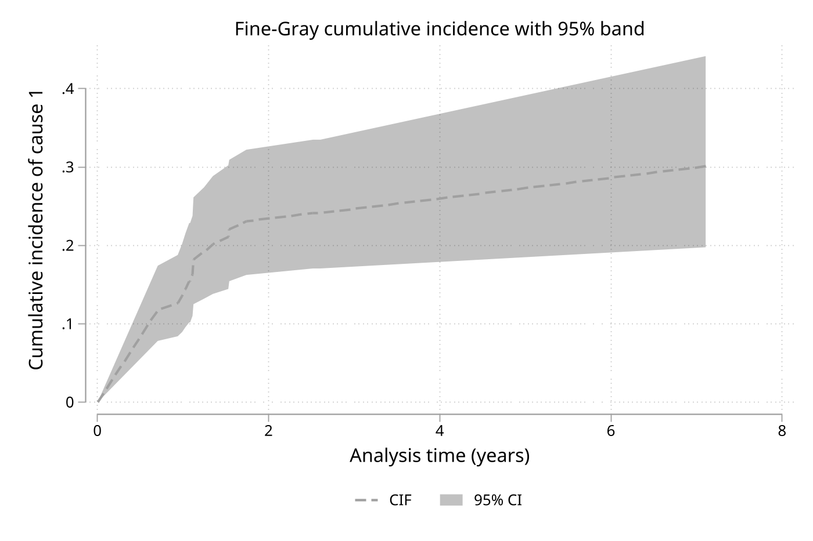

# finegray - Fast Fine-Gray competing risks regression

**Version 1.1.0** | 2026-06-21

`finegray` fits the Fine and Gray (1999) subdistribution hazards model for competing risks data. It uses a native Mata forward-backward scan implementation that avoids data expansion, so it remains practical on datasets where `stcrreg` becomes slow or infeasible.

The package also includes post-estimation tools for prediction, cumulative incidence curves, and proportional subdistribution hazards diagnostics. The intended workflow is `finegray` for estimation, `finegray_predict` for `xb`, CIF, or Schoenfeld residuals, `finegray_cif` for cumulative incidence curves and fixed-horizon CIF with confidence intervals, and `finegray_phtest` for the proportional hazards check.

## Requirements

- Stata 16 or later
- Data must be `stset` with `id()`
- Datasets with multiple records per subject (delayed entry, `(start,stop]` intervals, `stsplit`) are supported automatically when covariates are constant within subject; genuinely time-varying covariates are not (the subdistribution hazard is undefined with them)

## Installation

```stata
capture ado uninstall finegray
net install finegray, from("https://raw.githubusercontent.com/tpcopeland/Stata-Tools/main/finegray") replace
```

## Commands

| Command | Description |
|---------|-------------|
| `finegray` | Fit a Fine-Gray subdistribution hazards model |
| `finegray_predict` | Generate `xb`, CIF (with optional CI), or Schoenfeld residuals after `finegray` |
| `finegray_cif` | Plot cumulative incidence curves with confidence bands; report fixed-horizon CIF with CI |
| `finegray_phtest` | Test the proportional subdistribution hazards assumption |

## How It Works

The workflow has three parts:

1. `stset` the data with one record per subject and an `id()` variable.
2. Fit `finegray` with a `compete()` event-type variable and `cause()` for the event of interest.
3. Use `finegray_predict` or `finegray_phtest` after estimation.

Operational details that matter:

- `compete()` is usually coded as `0 = censored`, `1 = cause 1`, `2 = cause 2`, and so on
- `cause(#)` selects the event type of interest
- `finegray_predict, xb` can be used on datasets that contain the model covariates
- `finegray_predict, cif` additionally requires a time variable (`_t` or `timevar()`)
- `finegray_predict, schoenfeld` and `finegray_phtest` require the original `stset` estimation data
- `finegray_predict` reproduces `stcrreg`'s post-estimation quantities: `xb` matches `predict, xb`, the baseline CIF matches `predict, basecif`, and `e(basehaz)` is the cumulative-subhazard analogue (`H0 = -ln(1 - basecif)`). The per-observation `cif` is the covariate-adjusted CIF, which `stcrreg` produces via `stcurve, cif at()` rather than `predict`; `finegray_predict, cif` matches it to numerical precision. Schoenfeld residuals match `stcrreg` exactly at untied event times; at tied event times the per-event split differs by convention while the per-time total is identical (see below)
- Factor-variable models are supported, but prediction on new data still requires the same factor-level support as the estimation sample

## Worked Examples

These examples use Stata's built-in `webuse hypoxia` data because it is a natural competing-risks dataset for the package.

### 1. Fit the basic Fine-Gray model

`failtype` identifies competing event types. After creating a clean event-type variable, `finegray` estimates the subdistribution hazard ratio for cause 1.

```stata
webuse hypoxia, clear
gen byte status = failtype
stset dftime, failure(dfcens==1) id(stnum)

finegray ifp tumsize pelnode, compete(status) cause(1)
```

This is the canonical starting point. By default, the command reports exponentiated subdistribution hazard ratios with sandwich standard errors.

### 2. Predict cumulative incidence after estimation

Use `finegray_predict, cif` when you want the fitted cumulative incidence at each observation's event time or at an explicitly supplied time variable.

```stata
webuse hypoxia, clear
gen byte status = failtype
stset dftime, failure(dfcens==1) id(stnum)
finegray ifp tumsize pelnode, compete(status) cause(1)

finegray_predict cif_hat, cif
gen double t5 = 5
finegray_predict cif_at5, cif timevar(t5)
```

`cif_hat` uses each subject's current `_t`. `cif_at5` instead asks for the fitted CIF at time 5 for every observation.

### 3. Run the proportional hazards diagnostic

`finegray_phtest` is the post-estimation check for time-varying effects. It uses scaled Schoenfeld residuals and therefore must be run on the original estimation data.

```stata
webuse hypoxia, clear
gen byte status = failtype
stset dftime, failure(dfcens==1) id(stnum)
finegray ifp tumsize pelnode, compete(status) cause(1)

finegray_phtest
finegray_phtest, time(log)
```

Use the default rank-based test first. `time(log)` is a sensible sensitivity check when you suspect departures later in follow-up.

### 4. Common model variations

The package supports factor variables, stratified censoring distributions, cluster-robust inference, and model-based standard errors.

```stata
webuse hypoxia, clear
gen byte status = failtype
stset dftime, failure(dfcens==1) id(stnum)

finegray i.pelnode##c.ifp tumsize, compete(status) cause(1)
finegray ifp tumsize, compete(status) cause(1) strata(pelnode)
finegray ifp tumsize pelnode, compete(status) cause(1) norobust
finegray ifp tumsize pelnode, compete(status) cause(1) noshr
```

`norobust` switches from the default sandwich variance to the observed-information variance. `noshr` reports log-SHR coefficients instead of exponentiated SHRs.

### 5. Cumulative incidence curves and fixed-horizon CIF

`finegray_cif` draws the predicted CIF with a pointwise confidence band (an analogue of `stcurve, cif` that can also plot the interval) and reports the CIF at specific horizons. `finegray_predict, cif ci` adds per-subject confidence limits.

```stata
webuse hypoxia, clear
gen byte status = failtype
stset dftime, failure(dfcens==1) id(stnum)
finegray ifp tumsize pelnode, compete(status) cause(1)

finegray_cif, ci                                   // curve at covariate means, 95% band
finegray_cif, at(pelnode=1 ifp=20) ci              // curve for a covariate profile
finegray_cif, attime(1 5 8) ci                     // CIF at 1, 5, 8 years with CI
finegray_cif, ci nograph saving(cifcurve.dta)      // export the numeric estimates

gen double t5 = 5
finegray_predict cif5, cif timevar(t5) ci          // per-subject 5-year CIF + cif5_lci/cif5_uci
```

## Demonstration

`finegray_cif` produces a cumulative incidence curve with a pointwise confidence band (the `stcurve, cif` analogue that can also plot the interval). The figure below is generated by `demo/demo_finegray.do`:

```stata
finegray ifp tumsize pelnode, compete(status) cause(1)
finegray_cif, ci
```



The same demo also prints the fixed-horizon CIF table (`finegray_cif, attime(1 3 5 8) ci`), per-subject CIF limits (`finegray_predict, cif ci`), and confirms that multiple-record (`stsplit`) data reproduce the single-record fit exactly.

## Features

- Native forward-backward scan implementation without data expansion
- Automatic reduction of multiple-record (delayed entry / `stsplit`) data with subject-constant covariates
- Support for factor variables and interactions
- Stratified censoring distributions via `strata()`
- Robust, clustered, or model-based standard errors
- CIF prediction on estimation data or at user-supplied times, with confidence intervals
- Cumulative incidence curves with confidence bands and exportable estimates (`finegray_cif`)
- Approximate proportional subdistribution hazards test after estimation
- Support for left-truncated data handled through `stset`

## Validation

The package QA cross-validates `finegray` against Stata's `stcrreg` and independent R implementations of Fine-Gray regression (`cmprsk`, `riskRegression`). The validation files under `qa/` cover coefficients, standard errors, log pseudo-likelihoods, CIF predictions (point estimates bit-exact against `riskRegression`), CIF confidence intervals (validated against a subject bootstrap), baseline hazards, multiple-record reduction, and stratified censoring behavior.

`qa/crossval_predict_stcrreg.do` cross-validates every `finegray_predict` path directly against `stcrreg`'s native post-estimation predictions (no external dependency, so it never skips): `xb`, the relative subhazard `exp(xb)`, the covariate-adjusted CIF, the baseline CIF (`basecif`), the baseline cumulative subhazard (`e(basehaz)`), Schoenfeld residuals, and the subhazard ratios with their standard errors and 95% confidence intervals. All agree to numerical precision, with one documented and asserted exception:

- **Schoenfeld residuals at tied event times.** At an event time shared by two or more cause events, `finegray` and `stcrreg` partition the residual among the simultaneous events using different conventions, so an individual residual at a tied time can differ. The QA suite asserts that (a) residuals match `stcrreg` exactly at untied event times and (b) the sum of the residuals within each event time — and hence the overall score, which is zero at the estimate — is identical. Only the per-observation values at tied times differ; untied times, per-time totals, and every event-time aggregate are unaffected.

Standard errors are robust (sandwich) by default in both commands and agree to roughly 0.5% relative; this small gap reflects `stcrreg` computing its sandwich on an expanded dataset, as described in `help finegray`.

## References

- Fine JP, Gray RJ. A proportional hazards model for the subdistribution of a competing risk. *Journal of the American Statistical Association*. 1999;94(446):496-509.
- Grambsch PM, Therneau TM. Proportional hazards tests and diagnostics based on weighted residuals. *Biometrika*. 1994;81(3):515-526.
- Kawaguchi ES, Shen JI, Suchard MA, Li G. Scalable algorithms for large competing risks data. *Journal of Computational and Graphical Statistics*. 2021;30(3):685-693.

## Version History

- **1.1.0** (2026-06-21): Feature release.
  - New command `finegray_cif`: cumulative incidence curves with pointwise confidence bands (an `stcurve, cif` analogue that also plots the interval), fixed-horizon CIF tables (`attime()`), curves on a custom time grid (`timepoints()`), an exact subject-bootstrap band (`bootstrap()`/`seed()`), and exportable estimates via `saving()`. The CIF plot's legend defaults to a single row, and all `twoway` graph options (including `legend()` — e.g. `legend(off)`, `legend(pos(6))`) pass through and override the defaults.
  - `finegray_predict, cif ci` adds per-subject CIF confidence limits (influence-function SE, complementary log-log scale), with an optional exact `bootstrap()` band. The analytic SE now builds its influence functions from the full estimation sample even when prediction is restricted with `if`/`in`.
  - `finegray` now accepts datasets with multiple records per subject (delayed entry / `(start,stop]` / `stsplit`) when covariates are constant within subject, reducing them automatically; time-varying covariates are rejected with a clear message.
  - Documentation clarification (from the unreleased 1.0.1): `finegray_predict, cif` evaluates the CIF at each observation's own analysis time `_t`; `timevar()` gives a common horizon and `e(basehaz)` is the `stcrreg basecif` analogue.
- **1.0.0** (2026-04-06): Initial Stata-Tools release of `finegray`, `finegray_predict`, and `finegray_phtest`

## Author

Timothy P Copeland, Karolinska Institutet

## License

MIT
