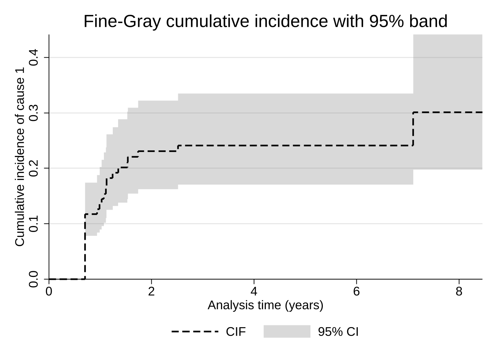
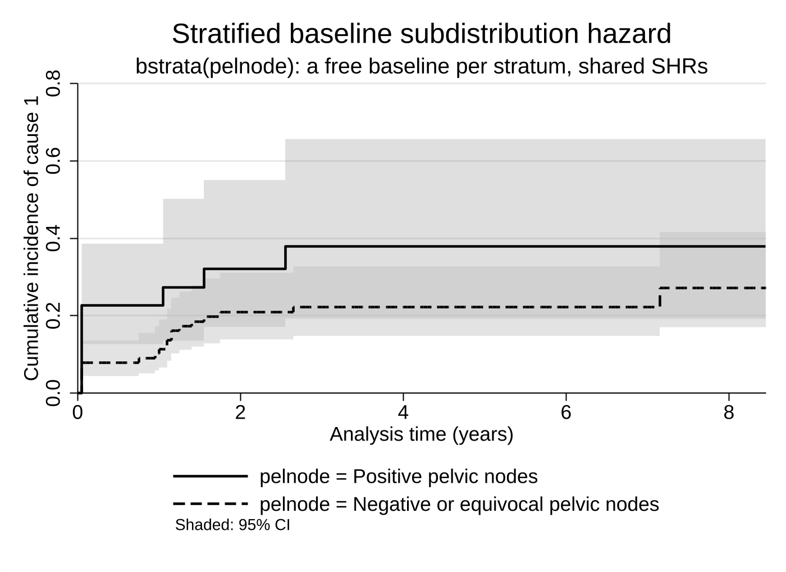

# finegray — Fast Fine-Gray competing-risks regression

**Version 1.3.0** | 2026-09-02

`finegray` fits Fine-Gray subdistribution hazard models for a selected competing event in Stata 16 or later. The package also provides individual prediction, cumulative-incidence profiles and curves, proportional-hazards diagnostics, delayed-entry support, a stratified baseline subdistribution hazard, piecewise-constant time-varying effects, sampling (`pweight`) and frequency weights, and optional bootstrap confidence intervals for cumulative-incidence quantities.

## Quick Start

After installation, fit a model and request cumulative incidence at selected horizons:

```stata
webuse hypoxia, clear
gen byte status = failtype
stset dftime, failure(dfcens == 1) id(stnum)

finegray ifp tumsize pelnode, compete(status) cause(1)
finegray_cif, attime(1 5 8) ci
```

The selected event is `cause(1)` in `status`; `status == 0` is treated as censored by default. The fitted model uses the declared `stset` analysis time and subject identifier.

Use `finegray_predict` for observation-level predictions and `finegray_phtest` for a proportional-hazards diagnostic:

```stata
finegray_predict double cif_hat, cif
finegray_phtest, time(log)
```

## Requirements

- Stata 16 or later.
- Data declared with `stset`; an `id()` identifier is required, including when the data contain one record per subject.
- No external software or additional Stata package is required.

## Installation

Install the released package from the Stata-Tools repository:

```stata
capture ado uninstall finegray
net install finegray, from("https://raw.githubusercontent.com/tpcopeland/Stata-Tools/main/finegray") replace
```

For a local checkout, replace the `from()` directory with the path to its `finegray` folder:

```stata
net install finegray, from("/path/to/Stata-Tools/finegray") replace
```

## Commands

| Command | Purpose |
| --- | --- |
| `finegray` | Fit a Fine-Gray subdistribution hazard model. |
| `finegray_predict` | Generate linear predictors, cumulative incidence, Schoenfeld residuals, or the baseline cumulative subdistribution hazard. |
| `finegray_cif` | Evaluate cumulative incidence at profiles or time points, optionally with confidence intervals or bootstrap confidence limits. |
| `finegray_phtest` | Inspect proportional-hazards behavior using raw Schoenfeld residual-time correlations. |

Methods, formulas, grounding and the refusal rationales live in a separate help topic, `help finegray_methods`. It documents no command; each option's help entry links into it.

## How It Works

`finegray` estimates regression coefficients for the subdistribution hazard of the integer event value selected by `cause()` in the `compete()` variable. Competing events remain represented in the risk-set construction, while inverse-probability-of-censoring weights account for right censoring; the implementation uses a native Mata scan rather than expanding the data into pseudo-observations.

With a proportional subdistribution-hazards model, the exponentiated coefficient is a subdistribution hazard ratio (SHR), and the fitted baseline subdistribution hazard is combined with the linear predictor to obtain a cumulative-incidence function (CIF). The default display is exponentiated coefficients; use `noshr` for log-SHR coefficients.

The usual workflow is to declare survival-time data, fit one model, use `finegray_predict` for row-level quantities, use `finegray_cif` for a covariate profile or a curve, and use `finegray_phtest` to explore time-varying effects. `xb` can score compatible new data. Point `cif` and `basecshazard` predictions can also use compatible data while the active fit's cached event-time structure or a posted `e(basehaz)` is available; those quantities need `_t` or `timevar()`. `finegray_cif`, `finegray_phtest`, and the `ci`, `schoenfeld`, and `bootstrap()` paths of `finegray_predict` require the original, unchanged `stset` data.

For delayed entry, declare `enter(time ...)` in `stset` and fit with the package's Weight 1 risk-set construction. Use `strata()` for censoring groups and `truncstrata()` for entry groups; when both are specified, observed combinations form joint weighting groups. Inspect `e(lt_weight)`, `e(lt_vce)`, and the weight diagnostics before interpreting the result.

Three different things are called strata here, and they are three separate options. `bstrata(varname)` stratifies the **baseline** subdistribution hazard — the stratified model of Zhou, Latouche, Rocha and Fine (2011), one unconstrained baseline per level with the coefficient vector shared, and the only one of the three that means what `stcox, strata()` means. `strata()` stratifies the censoring distribution, `truncstrata()` the entry distribution. The axes are independent and compose; `bstrata(v) strata(v)` is the paper's regularly stratified regime. `bstrata()` is right-censoring only and is refused with delayed entry, and it requires `bstratum(#)` when asking `finegray_cif` for a curve.

## Performance

There are three ways to fit a Fine-Gray model in Stata: `finegray`, Stata's built-in `stcrreg`, and `stcrprep` (Lambert, SSC) followed by a weighted `stcox`. `stcrreg` forms the weighted risk sets internally at every iteration; `stcrprep` expands the data once with time-dependent censoring weights and hands the expanded rows to `stcox`; `finegray` scans the original rows in Mata and expands nothing.

Simulated competing-risks data, three covariates, median of three timed runs after one untimed warm-up, on Linux x86-64 under Stata 17 with `c(processors)` = 16:

| N | finegray | stcrreg | stcrprep + stcox | stcox alone | vs `stcrreg` | vs `stcrprep` |
|------:|---------:|---------:|-----------------:|------------:|-------------:|--------------:|
| 109 (hypoxia) | 0.009s | 0.045s | 0.020s | 0.006s | **5.0x** | **2.2x** |
| 500 | 0.031s | 1.279s | 0.130s | 0.034s | **41.3x** | **4.2x** |
| 1,000 | 0.049s | 3.160s | 0.353s | 0.126s | **64.5x** | **7.2x** |
| 2,000 | 0.087s | 11.835s | 1.635s | 0.520s | **136.0x** | **18.8x** |
| 5,000 | 0.214s | 76.496s | 14.848s | 5.896s | **357.5x** | **69.4x** |
| 10,000 | 0.358s | 334.140s | 76.550s | 35.374s | **933.4x** | **213.8x** |

The `stcrprep + stcox` column is the whole pipeline, which is what one Fine-Gray fit costs from a standing start. `stcox alone` is what a second model on the same expanded weights costs, since `stcrprep` is designed to compute the weights once and reuse them — and even on that best case it is slower than a *complete* `finegray` fit from N=1,000 upward (35.374s vs 0.358s at N=10,000). The expansion is why: it turns 5,000 subjects into 487,458 weighted rows and 10,000 into 1,790,932, and every operation afterwards pays for them.

A `tvc()` fit runs the same scan once per interval, so it costs roughly `J` times a proportional fit and keeps the same shape in `N`. Measured on simulated competing-risks data with three covariates, one time-varying, boundaries at the cause-event quartiles, `set processors 1`:

| N | proportional | `tvc()`, J=2 | `tvc()`, J=4 |
|------:|-------------:|-------------:|-------------:|
| 2,000 | 0.057s | 0.094s (1.65x) | 0.199s (3.49x) |
| 10,000 | 0.249s | 0.435s (1.75x) | 0.827s (3.32x) |
| 50,000 | 1.554s | 2.629s (1.69x) | 4.970s (3.20x) |

The ratio is flat across a 25-fold change in `N`, which is the point: the piecewise fit is still linear in the original rows and still expands nothing. `qa/test_finegray_tvc.do` gates that shape rather than the seconds.

Absolute seconds are machine-dependent; the ratios are the portable quantity. All three commands fit the same model — the benchmark scripts print the maximum relative coefficient difference across the three fits alongside the timings (4.6e-11 on `hypoxia`, 1.3e-08 to 3.2e-08 across the simulated sizes). Methodology, the on-demand `stcrprep` install, and how to reproduce the table: [`demo/README.md`](demo/README.md).

## Which Standard Error Am I Getting?

One table, and one machine-readable counterpart per row: `e(vce_meat)` for the coefficients, `r(se_method)` for a CIF interval.

**Coefficients** — `e(b)`, `e(V)`:

| You type | You get | `e(vce_meat)` |
| --- | --- | --- |
| *(default)* | fixed-weight sandwich | `fixed_weight` |
| `nuisance` | eta+psi, Fine & Gray (1999) eq. 7–8 | `nuisance_adjusted` |
| `norobust` | model-based inverse information | `not_applicable` |
| `cluster()` | cluster-robust, Zhou et al. (2012) | `fixed_weight` |
| `bstrata()` | per-stratum sandwich, summed | `fixed_weight` |
| `bstrata()` `nuisance` | Zhou et al. (2011) §4.1 Σ_r | `nuisance_adjusted` |
| `tvc()` | per-interval sandwich, summed | `fixed_weight` |
| `tvc()` `nuisance` | piecewise eta+psi | `nuisance_adjusted` |
| delayed entry | fixed-weight sandwich | `fixed_weight` |
| delayed entry + `nuisance` | Zhang, Zhang & Fine (2011) Appendix B terms added (pooled weight) | `nuisance_adjusted` |
| delayed entry + `nuisance` + `strata()`/`truncstrata()` | **refused**, `r(198)` | — |
| `[pweight=]` | sandwich with meat Σ (w_i s_i)², N/(N−1); Wogu et al. (2021) eq. 3 score | `fixed_weight` |
| `[pweight=]` `cluster()` | the same, summed within cluster | `fixed_weight` |
| `[pweight=]` `norobust` | **refused**, `r(198)` | — |
| `[fweight=]` | replication semantics: meat Σ w_i s_i s_i', N = Σ w; `norobust` allowed | `fixed_weight` |

**CIF intervals** — `finegray_cif`, `finegray_predict`:

| You type | You get | `r(se_method)` |
| --- | --- | --- |
| `ci` | analytic influence function | `analytic` |
| `ci bootstrap(#)` | resampled SD over replications | `bootstrap` |

Both CIF routes work on every fit this package produces, `tvc()` and `bstrata()` included. The analytic route is fixed-weight in all cases — it does not propagate the uncertainty in Ĝ even after a `nuisance` fit — so only `bootstrap()` propagates weight re-estimation.

**What is still refused, and why.** Three cells on the delayed-entry branch, and the design-weight cells, all `r(198)`, each for its own reason:

| Cell | Reason |
| --- | --- |
| `nuisance` + delayed entry + weight strata | The pooled-weight term (Zhang, Zhang & Fine 2011, Appendix B) is implemented; for the stratified weight their own Appendix E ships the first part only, "treating the weight function known", which is the default sandwich. |
| `bstrata()` + delayed entry | No source. Both stratified-subdistribution papers are right-censoring-only, and Kim et al. (2020) calls the left-truncated case an open research problem. |
| `tvc()` + delayed entry | No source for time-varying subdistribution coefficients under left truncation at all, and the delayed-entry branch is already this package's own extension. |
| weights + `nuisance` | The estimated-Ĝ term is not derived under design weights in this release (Wogu et al. 2021 §4 write it with a weighted at-risk count that differs from their §3 estimator). |
| weights + `strata()` / `truncstrata()` | No cross-validation arm. For `strata()` this is conservatism rather than a missing oracle: a `strata()` term in `survival::finegray`'s formula does stratify the censoring Kaplan-Meier, and the same call takes weights. For `truncstrata()` no source weights the delayed-entry side at all. |
| weights + `bstrata()` / `tvc()` | Linear in the same per-subject terms, but each cell needs its own cross-validation arm before it opens. |
| weights + delayed entry | The delayed-entry branch is this package's own extension of Zhang, Zhang & Fine (2011); no source weights it. |
| `finegray_phtest` after a weighted fit | The correlation summary has no weighted form in the corpus; `predict, schoenfeld` still returns the residuals. |

## Choosing a Workflow

| Goal | Command or pattern | Main considerations |
| --- | --- | --- |
| Fit a model | `finegray x1 x2, compete(status) cause(1)` | Declare `stset` and `id()` first. |
| Score observations | `finegray_predict newvar, xb` | Compatible new data can be scored for the linear predictor. |
| Estimate row-level CIFs | `finegray_predict newvar, cif timevar(t)` | Use `timevar()` to evaluate all rows at a common horizon. |
| Compare a covariate profile | `finegray_cif, at(...) attime(...)` | `at()` supplies a profile; default profile values are estimation-sample means. |
| Draw a CIF curve | `finegray_cif, timepoints(...)` | Use `ci`, `nograph`, `saving()`, and twoway options as needed. |
| Explore proportional hazards | `finegray_predict stub, schoenfeld`; then `finegray_phtest` | The residual variables are optional for inspection; the diagnostic reports correlations, not an omnibus chi-squared test. |
| Account for delayed entry | `stset ..., enter(time entry)` plus `finegray, truncstrata(...)` | Name the covariates entry depends on in `truncstrata()`; check positivity and the posted weight diagnostics. |

## Worked Examples

The examples below are intended to be run separately from a clean Stata session. Most use Stata's `webuse hypoxia` example dataset; examples 3a and 12 use `webuse hiv_si` and `webuse pneumonia`, the datasets of [ST] `stcrreg` examples 4 and 5.

### 1. Fit a basic model and inspect the estimates

```stata
webuse hypoxia, clear
gen byte status = failtype
stset dftime, failure(dfcens == 1) id(stnum)
finegray ifp tumsize pelnode, compete(status) cause(1)
ereturn list
```

### 2. Generate linear predictors and common-horizon CIFs

```stata
webuse hypoxia, clear
gen byte status = failtype
stset dftime, failure(dfcens == 1) id(stnum)
finegray ifp tumsize pelnode, compete(status) cause(1)
finegray_predict double xb_hat, xb
gen double horizon5 = 5
finegray_predict double cif5, cif timevar(horizon5) ci level(95)
summarize xb_hat cif5 cif5_lci cif5_uci
```

### 3. Estimate a profile-specific CIF table

```stata
webuse hypoxia, clear
gen byte status = failtype
stset dftime, failure(dfcens == 1) id(stnum)
finegray ifp tumsize pelnode, compete(status) cause(1)
finegray_cif, at(pelnode=1 ifp=20 tumsize=5) attime(1 3 5 8) ci
return list
```

### 3a. Compare cumulative incidence between two exposure groups

`hiv_si` is the Amsterdam Cohort dataset of [ST] `stcrreg` example 4: appearance of the SI HIV phenotype as the event of interest, an AIDS diagnosis as the competing event, and one binary covariate.

```stata
webuse hiv_si, clear
gen byte any_event = status > 0
stset time, failure(any_event == 1) id(patnr)
finegray ccr5, compete(status) cause(2)
finegray_cif, over(ccr5) attime(2 5 10) ci
finegray_cif, over(ccr5) ci
```

`over(varname)` evaluates one curve per level of a model variable in a single call: a table per level with `attime()`, otherwise one graph with a legend entry per level and each band shaded in its own curve's color. Every curve is the same computation as the standalone `at(ccr5=#)` call, `r(table)` carries a sixth column `over` naming each row's level, and `r(at)` has one row per curve. The same option draws every fitted baseline stratum after a `bstrata()` fit (`over(pelnode)` after `bstrata(pelnode)`), and a factor variable in an interaction with the other covariate fixed by `at()`:

```stata
webuse hypoxia, clear
gen byte status = failtype
stset dftime, failure(dfcens == 1) id(stnum)
finegray i.pelnode c.ifp i.pelnode#c.ifp tumsize, compete(status) cause(1)
finegray_cif, over(pelnode) at(ifp=20) ci
```

### 4. Save a confidence-banded CIF curve on a custom grid

```stata
webuse hypoxia, clear
gen byte status = failtype
stset dftime, failure(dfcens == 1) id(stnum)
finegray ifp tumsize pelnode, compete(status) cause(1)
tempfile cifout
finegray_cif, timepoints(1 2 3 4 5 6 7 8) ci nograph saving("`cifout'", replace)
use "`cifout'", clear
list time cif se lci uci, noobs
```

### 5. Use factor variables and inspect proportional hazards

```stata
webuse hypoxia, clear
gen byte status = failtype
stset dftime, failure(dfcens == 1) id(stnum)
finegray i.pelnode c.ifp##c.tumsize, compete(status) cause(1)
finegray_predict double schoenfeld, schoenfeld
finegray_phtest, time(log) detail
```

### 6. Fit with censoring strata and clustered robust inference

```stata
webuse hypoxia, clear
gen byte status = failtype
gen int site = ceil(_n / 10)
stset dftime, failure(dfcens == 1) id(stnum)
finegray ifp tumsize pelnode, compete(status) cause(1) strata(pelnode) cluster(site)
display "clusters = " e(N_clust)
```

### 6a. Fit with a stratified baseline subdistribution hazard

```stata
webuse hypoxia, clear
gen byte status = failtype
stset dftime, failure(dfcens == 1) id(stnum)
finegray ifp tumsize, compete(status) cause(1) bstrata(pelnode)
display "baseline strata = " e(k_bstrata)
finegray_cif, attime(1 5) bstratum(0) ci nograph
finegray_cif, attime(1 5) bstratum(1) ci nograph
finegray_predict double h0, basecshazard
tabstat h0, by(pelnode) stat(min max)
```

### 6b. Fit a piecewise-constant time-varying effect

```stata
webuse hypoxia, clear
gen byte status = failtype
stset dftime, failure(dfcens == 1) id(stnum)
finegray ifp tumsize pelnode, compete(status) cause(1) tvc(pelnode) tsplit(1)
test [tvc1]pelnode = [tvc2]pelnode
finegray_predict double xb_late, xb attime(2)
finegray_cif, at(ifp=20 tumsize=5 pelnode=0) attime(1 3 5) nograph
```

The coefficient table gains one equation per interval — `main` for the effects
held proportional, then `tvc1`, `tvc2`, … — with the interval bounds and the
cause-event count behind each one printed underneath. `test [tvc1]x = [tvc2]x`
is the Wald test of whether the effect is in fact constant.

`stcrreg` fits the same two-interval model through a threshold time interaction, and the two parameterizations map onto each other: `stcrreg`'s `main` coefficient is `finegray`'s `[tvc1]`, and `main` + `tvc` is `[tvc2]`.

```stata
stset dftime, failure(status == 1) id(stnum)
stcrreg ifp tumsize pelnode, compete(status == 2) tvc(pelnode) texp(_t > 1) noshr
```

### 6c. Fit with sampling weights

```stata
webuse hypoxia, clear
gen byte status = failtype
gen double sw = cond(pelnode == 1, 2, 1)
stset dftime, failure(dfcens == 1) id(stnum)
finegray ifp tumsize [pweight = sw], compete(status) cause(1)
finegray_cif, attime(1 5) ci nograph
display "`e(wtype)' `e(wexp)'  sum of weights = " e(sum_w)
```

`[pweight=]` multiplies every subject's risk-set contribution, event term and Breslow increment by its weight — the design-weighted subdistribution score of Wogu et al. (2021) — while the censoring distribution stays unweighted, as in `survival::finegray`. The variance is the sandwich with meat Σ (w_i s_i)², so `norobust` is refused; `[fweight=]` is replication throughout and allows it. Weights must be constant within `id()` and are for right-censored data only. A weight declared in `stset` is *not* inherited — unlike `stcox`, `finegray` takes its weight from the command line, and fitting on weighted `stset` data with no weight typed is `r(198)` rather than a silently unweighted fit. `_n` and `_N` are refused inside a weight expression, because they name no variable and so cannot enter `e(datasignature)`; anything else the expression reads that is not a variable (a scalar, an `e()` value, a subscript such as `w[1]`) is caught the other way, because every post-estimation command reconciles the total of the rebuilt weight column against `e(sum_w)` and refuses with `r(459)` when it has moved.

### 7. Use bootstrap confidence intervals for a CIF profile

```stata
webuse hypoxia, clear
gen byte status = failtype
gen int site = ceil(_n / 10)
stset dftime, failure(dfcens == 1) id(stnum)
finegray ifp tumsize pelnode, compete(status) cause(1) cluster(site)
finegray_cif, attime(1 5 8) ci bootstrap(25) seed(24680)
return list
```

The minimum is 25 replications; use substantially more replications for substantive inference.

### 8. Fit a delayed-entry model and inspect the weight path

Left truncation needs a cohort in which entry is *not* a function of the outcome time. In the cohort below, entry depends on `z1`, censoring does not, and `z1` is a model covariate — so the specification these data call for is `truncstrata(z1)` with no `strata()`.

```stata
clear
set seed 20260713
set obs 24000
gen byte z1 = runiform() < 0.5
gen double z2 = rnormal()
gen byte g4 = ceil(runiform() * 4)
gen double ez = exp(0.5*z1 - 0.5*z2)
gen double p1 = 1 - (1 - 0.5)^ez
gen byte cause = cond(runiform() < p1, 1, 2)
gen double v = runiform()
gen double event_time = -ln(1 - (1 - (1 - v*p1)^(1/ez))/0.5) if cause == 1
replace event_time = rexponential(1/(0.5*exp(0.5*z1 + 0.5*z2))) if cause == 2
gen double censor_time = min(rexponential(1/0.15), 6)
gen double entry_time = rexponential(1/cond(z1 == 1, 1.6, 0.5))
gen double time = min(event_time, censor_time)
gen byte status = cond(event_time <= censor_time, cause, 0)
drop if !(entry_time < time)
keep in 1/4000
gen long id = _n
gen byte any_event = status > 0
stset time, failure(any_event == 1) id(id) enter(time entry_time)

finegray z1 z2, compete(status) cause(1) truncstrata(z1)
display "weight method = " "`e(lt_weight)'"
display "smallest weight probability = " e(min_weight_prob)
display "largest entry weight = " e(max_lt_weight)
```

Pooling an entry distribution that is not in fact common is not a cosmetic choice. Dropping `truncstrata(z1)` on these data leaves the posted weight as `zzf1_geskus` and attenuates the log-SHR on `z1` from 0.472 to 0.368 — about 22%:

```stata
finegray z1 z2, compete(status) cause(1) noshr
display "weight method = " "`e(lt_weight)'"
```

`strata()` and `truncstrata()` are separate axes and compose. Naming the same variable in both gives the fully stratified weight (`zzf1_stratified`); naming different variables gives the factorized extension (`zzf1_factorized`), which `finegray` reports in the header rather than applying silently.

```stata
finegray z1 z2, compete(status) cause(1) strata(z1) truncstrata(z1)
finegray z1 z2, compete(status) cause(1) strata(g4) truncstrata(z1)
finegray_cif, attime(1 3 5) ci nograph
```

### 9. Request the baseline hazard and baseline cumulative subdistribution hazard

```stata
webuse hypoxia, clear
gen byte status = failtype
stset dftime, failure(dfcens == 1) id(stnum)
finegray ifp tumsize pelnode, compete(status) cause(1) basehaz
matrix list e(basehaz)
finegray_predict double baseline_subhaz, basecshazard
summarize baseline_subhaz
```

### 10. Pool a fit over multiply imputed data

```stata
webuse hypoxia, clear
gen byte status = failtype
replace ifp = . in 1/12
mi set wide
mi register imputed ifp
mi register regular tumsize pelnode status dftime dfcens stnum
mi impute regress ifp = tumsize pelnode, add(10) rseed(20260825)
mi stset dftime, failure(dfcens == 1) id(stnum)
mi estimate, cmdok eform("SHR"): finegray ifp tumsize pelnode, compete(status) cause(1)
```

`cmdok` is required because `mi estimate`'s supported-command list is internal to Stata. `eform("SHR")` labels the pooled column on the scale the coefficients are reported on elsewhere; without it `mi estimate` prints unlabeled log-SHRs. Post-estimation on an `mi` fit is refused with `r(301)` — use `mi extract #, clear` and refit to predict.

### 11. Bootstrap the coefficients

`finegray_cif, bootstrap()` resamples the CIF. Coefficient inference that also propagates weight-estimation uncertainty has to resample the whole estimation sequence, which means re-running `stset` on the resampled subject identifiers — the `bootstrap` prefix cannot do that on its own. Wrap the sequence:

```stata
webuse hypoxia, clear
gen byte status = failtype
stset dftime, failure(dfcens == 1) id(stnum)
program define fgboot, eclass
    version 16.0
    capture drop _st _d _t _t0
    quietly stset dftime, failure(dfcens == 1) id(newid)
    finegray ifp tumsize pelnode, compete(status) cause(1) noshr nolog
end
bootstrap _b, reps(200) seed(13579) cluster(stnum) idcluster(newid): fgboot
```

### 12. What happens with an internal time-varying covariate

`pneumonia` is the multiple-record dataset of [ST] `stcrreg` example 5: ICU patients, death in the ICU as the cause of interest, discharge as the competing event, and an exposure that switches from 0 to 1 mid-stay.

```stata
webuse pneumonia, clear
gen byte status = cond(died == 1, 1, cond(discharged == 1, 2, 0))
bysort id (ndays): gen byte outcome = status[_N]
gen byte any_event = status > 0
stset ndays, id(id) failure(any_event == 1)
finegray age pneumonia, compete(outcome) cause(1)
```

That fit stops with `r(198)`: `pneumonia` varies within `id()`. `stcrreg` handles these data by carrying each subject's last exposure value into the risk sets after a competing event; `finegray` refuses instead, because once a subject has failed from the competing risk its covariate path has no meaning while the subdistribution risk set still retains it. The exposure *at admission* is subject-constant and is accepted — a baseline-exposure model, a different estimand from the time-updated coefficient `stcrreg` reports:

```stata
bysort id (ndays): gen byte pneu0 = pneumonia[1]
finegray age pneu0, compete(outcome) cause(1)
```

## Demo

From the root of a Stata-Tools checkout, run the comprehensive demonstration:

```bash
stata-mp -b do finegray/demo/demo_finegray.do
```

The script adds the local package directory to the session-only `adopath`, exercises fitting, prediction, diagnostics, CIF tables, grouped CIF curves on `hiv_si`, the internal time-varying covariate refusal on `pneumonia`, delayed entry with entry strata, string identifiers, CIF and coefficient bootstrap inference, a stratified baseline subdistribution hazard, a piecewise-constant time-varying effect, `mi estimate, cmdok eform("SHR"):`, and graph export, and regenerates both figures below. Agreement with `stcrreg` on two datasets, the `tvc()`/`texp()` parameterization mapping, and the split-record reduction are recomputed and asserted rather than narrated. A sibling `tc_schemes` checkout is optional for graph styling; the script falls back to Stata's `s2color` scheme.

The repository also includes `demo/benchmark_finegray.do` and `demo/benchmark_large.do` for optional timing comparisons.

The main demo regenerates this cumulative-incidence curve with a pointwise 95% confidence band:



It also regenerates the `bstrata()` comparison below: one unconstrained baseline subdistribution hazard per stratum, one shared coefficient vector, with the two curves evaluated at the estimation-sample covariate means, drawn in one call by `finegray_cif, over(pelnode)`.



## Command Reference

### `finegray`

```stata
finegray varlist [if] [in] [pweight fweight], compete(varname) cause(integer) [censvalue(integer) noshr level(#) strata(varlist) truncstrata(varlist) bstrata(varname) tvc(varlist) tsplit(numlist) cluster(varname) norobust noadjust nolog basehaz nuisance iterate(integer) tolerance(#)]

finegray [, noshr level(#)]
```

The second form replays the last `finegray` results without refitting; `noshr` and `level()` are honored on replay.

`varlist` accepts numeric factor-variable notation, including continuous terms, indicators, interactions, and expanded interactions. `compete()` identifies the event-type variable and `cause()` selects the integer event value whose subdistribution hazard is modeled; `censvalue()` defaults to 0. The `stset` declaration supplies analysis time, failure coding, subject identifier, and optional delayed-entry time.

The default variance is a finite-sample-adjusted fixed-weight sandwich variance; with delayed entry, both censoring and entry weights are treated as fixed. The default display is the SHR scale. `norobust` requests the model-based inverse-information variance; `noadjust` suppresses the finite-sample sandwich adjustment and is available only with the robust variance. `cluster()` changes the sandwich clustering and `strata()` stratifies the right-censoring model.

`truncstrata()` is for delayed-entry risk-set weighting and requires delayed entry. `bstrata()` fits a stratified baseline subdistribution hazard with shared coefficients (Zhou et al. 2011); it is right-censoring only and is not available with `nuisance`. `nuisance` adds the Fine-Gray right-censoring nuisance term to the sandwich variance and is not available for delayed entry or `bstrata()`. `basehaz` posts the optional baseline matrix needed for direct inspection. `nolog`, `iterate()`, and `tolerance()` control optimization output and convergence.

`[pweight=exp]` fits the design-weighted subdistribution score of Wogu, Zhao, Nichols & Cai (2021, eq. 3): every subject's risk-set contribution, event term and Breslow increment is multiplied by its weight, the censoring Kaplan-Meier stays unweighted (as in `survival::finegray`), and the variance is the sandwich with meat Σ (w_i s_i)² (cluster-summed under `cluster()`); `norobust` is refused. `[fweight=exp]` has replication semantics throughout — an fweighted fit equals the fit of the `expand`ed data — and allows `norobust`. Weights are for right-censored data and must be constant within `id()`; they do not compose with `nuisance`, `strata()`, `truncstrata()`, `bstrata()`, `tvc()` or delayed entry, and `finegray_phtest` is refused after a weighted fit. A weight carried by `stset` is not inherited and is refused with `r(198)`; `_n` and `_N` are refused inside the weight expression. `e(wtype)`, `e(wexp)` and `e(sum_w)` record the weight; post-estimation re-evaluates `e(wexp)`, whose variables are in `e(datasignaturevars)` and therefore covered by `e(datasignature)`, so a changed weight is refused with `r(459)` rather than answered under different weights.

### `finegray_predict`

```stata
finegray_predict [type] newvar [if] [in], [xb cif schoenfeld basecshazard timevar(varname) ci level(#) bootstrap(#) seed(#) attime(#)]
```

An optional storage type such as `double` may precede `newvar`. The default is `xb`. `cif` generates cumulative incidence at each observation's `_t`, or at the numeric values in `timevar()`. `ci` adds `newvar_lci` and `newvar_uci`; confidence intervals require `cif`, and bootstrap intervals additionally require `bootstrap()` with at least 25 replications. `seed()` requires `bootstrap()`.

`schoenfeld` generates a stub for the raw Schoenfeld residuals, followed by numbered variables for additional model terms. `basecshazard` generates the fitted baseline cumulative subdistribution hazard and cannot be combined with `ci` or `bootstrap()`. The prediction types are mutually exclusive.

After a `tvc()` fit, `xb` is evaluated at each row's own `_t` unless `attime(#)` names a single time; `cif` accumulates the baseline interval by interval; `basecshazard` is unchanged. `schoenfeld` is refused, and `ci` is available only with `bootstrap()`.

### `finegray_cif`

```stata
finegray_cif [, at(string) over(varname) attime(numlist) timepoints(numlist) bstratum(#) ci level(#) saving(filename[, replace]) bootstrap(#) seed(#) nograph twoway_options]
```

Use `at()` to define a covariate profile; unspecified covariates default to estimation-sample means. `over(varname)` draws one curve per level of a model variable, or per baseline stratum after `bstrata()`, in one call; each curve is bit-identical to its standalone `at()`/`bstratum()` call, and the results are stacked with an `over` column. Use `attime()` for a table at requested horizons or `timepoints()` for a curve grid; the two options are mutually exclusive. With neither option, the command uses the distinct baseline event-time grid, thinned when necessary.

`bstratum(#)` names the baseline stratum and is required after a `bstrata()` fit with more than one level: once the baselines are free, a covariate profile alone no longer identifies a curve. `ci` requests pointwise confidence limits, `nograph` suppresses the graph, and `saving()` writes `time`, `cif`, `se`, `lci`, and `uci` to a Stata dataset. `bootstrap()` refits the model for at least 25 subject- or cluster-level replications; `seed()` requires `bootstrap()`. Remaining options are passed to the underlying twoway graph. In `attime()` mode, graph options are ignored with a note.

### `finegray_phtest`

```stata
finegray_phtest [, time(function) detail]
```

The default `time(rank)` scale uses event-time ranks; `time(log)` uses log event time and `time(identity)` uses event time. The command reports term-level correlations between raw Schoenfeld residuals and the selected time scale, along with event counts. `detail` displays the first 20 event-level residual contributions. This is an exploratory diagnostic and does not post an omnibus chi-squared statistic or p-value.

## Options

### Estimation options

| Option | Default and use |
| --- | --- |
| `compete(varname)` | Required event-type variable; it must agree with the `stset` failure coding. |
| `cause(#)` | Required integer event code to model; it must differ from `censvalue()`. |
| `censvalue(#)` | `0`; value treated as right censoring in `compete()`. |
| `strata(varlist)` | None; stratifies the right-censoring model. |
| `truncstrata(varlist)` | None; delayed-entry truncation strata for Weight 1 estimation. |
| `bstrata(varname)` | None; stratifies the **baseline** subdistribution hazard with a shared coefficient vector. Composes with `nuisance` and `tvc()`. Right censoring only; not available with delayed entry. |
| `tvc(varlist)` | None; covariates whose coefficient is piecewise constant in analysis time. Requires `tsplit()`. Composes with `bstrata()` and `nuisance`. Right censoring only; not available with delayed entry. |
| `tsplit(numlist)` | None; the *J*−1 interior interval boundaries for `tvc()`, strictly ascending and positive. Requires `tvc()`. Intervals are (lower, upper], so an event exactly on a boundary falls in the earlier interval. |
| `cluster(varname)` | None; cluster variable for the sandwich variance. |
| `norobust` | Off; use model-based rather than sandwich variance. |
| `noadjust` | Off; suppress the finite-sample sandwich adjustment. |
| `noshr` | Off; display log-SHR coefficients instead of exponentiated coefficients. |
| `level(#)` | `c(level)`; confidence level on Stata's `cilevel` rule — 10 to 99.99 inclusive, at most two decimals — for displayed intervals and postestimation. |
| `nolog` | Off; suppress the iteration log. |
| `basehaz` | Off; post the baseline cumulative subdistribution hazard in `e(basehaz)`. |
| `nuisance` | Off; add the right-censoring nuisance term to the sandwich variance. Not available with delayed entry. |
| `iterate(#)` | `200`; maximum number of optimization iterations. |
| `tolerance(#)` | `1e-8`; convergence tolerance. |

`norobust`, `noadjust`, and `nuisance` have compatibility restrictions documented in the command help. In particular, `noadjust` is meaningful only with the sandwich variance, and the model-based path cannot be combined with `cluster()`.

### Prediction options

| Option | Use |
| --- | --- |
| `xb` | Generate the linear predictor; this is the default prediction type. After a `tvc()` fit it is a function of time, evaluated at each row's own `_t`. |
| `attime(#)` | Evaluate `xb` at the single time `#` instead of each row's `_t`. Requires `xb` and a `tvc()` fit. |
| `cif` | Generate cumulative incidence at `_t` or at `timevar()`. |
| `schoenfeld` | Generate raw Schoenfeld residual variables on the original estimation data. |
| `basecshazard` | Generate the baseline cumulative subdistribution hazard. |
| `timevar(varname)` | Numeric evaluation time for `cif` or `basecshazard`. |
| `ci` | Add lower- and upper-confidence-limit variables for `cif`. |
| `level(#)` | `c(level)`; confidence level on Stata's `cilevel` rule (10 to 99.99, at most two decimals) for `ci`. |
| `bootstrap(#)` | At least 25 refits for bootstrap CIF confidence limits. |
| `seed(#)` | Reproducible bootstrap seed; requires `bootstrap()`. |

### CIF and diagnostic options

| Option | Use |
| --- | --- |
| `at(string)` | Profile values for `finegray_cif`; unspecified covariates use estimation-sample means. |
| `over(varname)` | One curve per level of a model variable (at most 20 distinct values), or per fitted baseline stratum when `varname` is the `bstrata()` variable; may not be combined with `at()` on the same variable or with `bstratum()`. |
| `attime(numlist)` | Fixed horizons for a returned CIF table. |
| `timepoints(numlist)` | Evaluation grid for a returned CIF curve. |
| `bstratum(#)` | Baseline stratum to evaluate; required after a `bstrata()` fit with more than one level, because a covariate profile alone no longer identifies a curve. |
| `ci` | Add pointwise confidence limits to the `finegray_cif` table and curve. |
| `level(#)` | `c(level)`; confidence level on Stata's `cilevel` rule (10 to 99.99, at most two decimals) for `finegray_cif`; requires `ci`. |
| `bootstrap(#)` | At least 25 subject- or cluster-level refits for a bootstrap `finegray_cif` band; requires `ci`, and is refused after an `fweight` fit. |
| `seed(#)` | Reproducible bootstrap seed for `finegray_cif`; requires `bootstrap()`. |
| `saving(filename[, replace])` | Save CIF curve data with `time`, `cif`, `se`, `lci`, and `uci` (plus `over` with `over()`). |
| `nograph` | Suppress the CIF graph. |
| `twoway_options` | Graph options passed to the CIF twoway graph. |
| `time(function)` | Time scale for `finegray_phtest`: `rank`, `log`, or `identity`; default `rank`. |
| `detail` | Show the first 20 rows of the raw Schoenfeld residual matrix for `finegray_phtest`. |

For `finegray_cif`, `attime()` and `timepoints()` cannot be combined. `ci` uses pointwise influence-function limits; `bootstrap()` uses refitted subject- or cluster-level samples and can report requested, successful, and failed replications in `r()`.

## Stored Results

### After `finegray`

Standard estimation results include `e(b)`, `e(V)`, `e(sample)`, `e(N)`, `e(depvar)`, and `e(properties)`. `e(depvar)` is `_t`, the `stset` analysis time, as it is after `stcrreg`; the event-type variable is `e(compete)`. For a factor-variable fit, `e(b)` and `e(V)` are named with the terms you typed (`1.pelnode`, `1.pelnode#c.ifp`) and carry each base level (`0b.pelnode`) as a zero coefficient with a zero row and column, as `stcox` posts them, so `test`, `testparm`, `estimates table`, `margins`, `contrast`, and `pwcompare` address them directly; the internal design columns, one per estimated coefficient, are listed in `e(designvars)`. The command also posts these scalars (with `e(N_clust)` when clustering is used):

`e(N_fail)`, `e(N_compete)`, `e(N_cens)`, `e(sum_w)` (only with weights), `e(ll)`, `e(ll_0)`, `e(chi2)`, `e(p)`, `e(df_m)`, `e(rank)`, `e(N_clust)`, `e(converged)`, `e(N_delayed)`, `e(N_G_trunc)`, `e(k_bstrata)`, `e(n_intervals)`, `e(k_tvc)`, `e(level)`, `e(cause)`, `e(censvalue)`, `e(iterate)`, `e(tolerance)`, `e(N_weight_strata)`, `e(min_weight_prob)`, `e(max_lt_weight)`, `e(N_prob_warn)`, and `e(N_weight_warn)`.

Posted macros are `e(cmd)`, `e(cmdline)`, `e(refitcmd)`, `e(predict)`, `e(compete)`, `e(compete_values)`, `e(designvars)`, `e(entryvar)`, `e(mi_data)`, `e(postest)`, `e(fvvarlist)`, `e(fvsemantic)`, `e(strata)`, `e(truncstrata)`, `e(bstrata)`, `e(bstrata_noevent)`, `e(tvc)`, `e(tsplit)`, `e(tvc_covariates)`, `e(tvc_pos)`, `e(tsplit_nfail)`, `e(clustvar)`, `e(wtype)` and `e(wexp)` (only with weights), `e(lt_weight)`, `e(lt_vce)`, `e(bh_seq)`, `e(weight_warn_strata)`, `e(vce)`, `e(vce_meat)`, `e(title)`, `e(marginsok)`, `e(datasignature)`, and `e(datasignaturevars)`.

The optional matrix `e(basehaz)` has columns for event time and cumulative baseline subdistribution hazard and is posted only when `basehaz` is specified. `e(N_clust)` is posted when clustering is used; delayed-entry diagnostics are populated when delayed-entry weighting applies.

### After `finegray_cif`

The returned matrix `r(table)` contains the CIF table or curve (with `over()`, one block per curve and a sixth column `over`), and `r(at)` contains the evaluated profile (one row per curve with `over()`). Scalars are `r(level)` and `r(cause)`, plus `r(bstratum)` and macro `r(bstrata)` after a `bstrata()` fit, and macros `r(over)` and `r(levels)` with `over()`. With `bootstrap()`, the command additionally posts `r(bootstrap_requested)`, `r(bootstrap_success)`, and `r(bootstrap_failed)`; `r(profile_vars)` identifies the profile variables used.

### After `finegray_phtest`

The command posts `r(N_fail)`, `r(time)`, `r(residual_scale)`, and matrix `r(phtest)`. The matrix contains term-level correlations and event counts; no omnibus chi-squared result is posted.

### After `finegray_predict`

`finegray_predict` clears `r()` and does not post estimation results. It creates the requested variable, plus `_lci` and `_uci` variables for `cif, ci`, or numbered Schoenfeld-residual variables when the requested stub represents multiple model terms.

## Assumptions and Limits

- `stset` must define the analysis time, failure indicator, and `id()`; `finegray` rejects an empty analysis sample and inconsistent competing-event coding.
- Multiple records per subject are supported when intervals are contiguous and covariates, censoring strata, truncation strata, and cluster membership are constant within subject. The estimation sample is reduced to one subject-level record for the fitted model, while interval records remain available for relevant postestimation quantities.
- Time-varying **covariates** and `by` prefixes are not supported. A covariate that varies within `id()` is refused with `r(198)` rather than reduced to one of its values; worked example 12 shows the refusal on `webuse pneumonia` and the subject-constant baseline-exposure fit that is accepted instead. Factor variables and interactions are supported, but a scoring dataset must contain compatible values and factor levels.
- Time-varying **effects** are supported through `tvc()` with `tsplit()`: the coefficient on a fixed covariate may be piecewise constant in analysis time. This is a different thing from a time-varying covariate — the covariate value stays known for every subject at every time, including after a competing event, so the subdistribution risk set and the CIF remain well defined. Every interval must carry at least one cause-of-interest event or the fit is refused (`r(459)`), and the per-interval event counts are printed with the results because an interval resting on a handful of events can reach a monotone likelihood and still converge. Not available with delayed entry, `bstrata()`, or `nuisance`; after such a fit `finegray_predict, schoenfeld` and `finegray_phtest` are refused and CIF confidence intervals are available by `bootstrap()` only.
- The default variance treats estimated censoring weights as fixed and, with delayed entry, also treats entry weights as fixed; it uses a sandwich estimator. `norobust` requests model-based information-matrix variance and is not a general replacement when weights are estimated. Worked example 11 shows the wrapper that bootstraps the coefficients over the whole estimation sequence, `stset` included.
- `nuisance` adds the weight-estimation (psi) term to the sandwich variance: Fine & Gray (1999) eq. 7–8 without delayed entry, the Zhang, Zhang & Fine (2011) Appendix B terms under delayed entry with the pooled weight; it is refused with `strata()`/`truncstrata()` under delayed entry. The default delayed-entry variance is fixed-weight; `e(lt_vce)` says which was computed.
- Delayed entry uses the package's Weight 1 construction. It checks censoring/truncation positivity and observed grouping support; weights can exceed 1. `strata()` defines censoring groups and `truncstrata()` defines entry groups; observed combinations form joint weight strata, with at most 100 cells and at least 20 estimation-sample subjects per cell. Continuous covariate-dependent entry is not supported.
- Postestimation requires a converged fit. `finegray_cif`, `finegray_phtest`, and the `ci`, `schoenfeld`, and `bootstrap()` paths of `finegray_predict` require the original, unchanged `stset` data. Point `xb` predictions work on compatible new data; point `cif` and `basecshazard` predictions can also do so while the active fit has its cached or posted baseline. Package-created factor-design columns may be dropped and rebuilt on demand, but retain `_fg_entry` for postestimation after a multiple-record fit; modifying a present `_fg_*` design column in place is rejected.
- `finegray_phtest` is a residual-correlation diagnostic rather than a formal omnibus test. Interpret it alongside the scientific model and the observed event-time support.

## References

- Fine JP and Gray RJ (1999). A proportional hazards model for the subdistribution of a competing risk. *Journal of the American Statistical Association*, 94(446), 496–509. [doi:10.1080/01621459.1999.10474144](https://doi.org/10.1080/01621459.1999.10474144).
- Zhang X, Zhang M-J, and Fine J (2011). A proportional hazards regression model for the subdistribution with right-censored and left-truncated competing risks data. *Statistics in Medicine*, 30(16), 1933–1951. [doi:10.1002/sim.4264](https://doi.org/10.1002/sim.4264).
- Geskus RB (2011). Cause-specific cumulative incidence estimation and the Fine and Gray model under both left truncation and right censoring. *Biometrics*, 67(1), 39–49. [doi:10.1111/j.1541-0420.2010.01420.x](https://doi.org/10.1111/j.1541-0420.2010.01420.x).
- Bellach A, Kosorok MR, Gilbert PB, and Fine JP (2020). General regression model for the subdistribution of a competing risk under left-truncation and right-censoring. *Biometrika*, 107(4), 949–964. [doi:10.1093/biomet/asaa034](https://doi.org/10.1093/biomet/asaa034).
- Kawaguchi ES, Shen JI, Suchard MA, and Li G (2021). Scalable algorithms for large competing risks data. *Journal of Computational and Graphical Statistics*, 30(3), 685–693. [doi:10.1080/10618600.2020.1841650](https://doi.org/10.1080/10618600.2020.1841650).
- Li J, Scheike TH, and Zhang MJ (2015). Checking Fine and Gray subdistribution hazards model with cumulative sums of residuals. *Lifetime Data Analysis*, 21(2), 197–217. [doi:10.1007/s10985-014-9313-9](https://doi.org/10.1007/s10985-014-9313-9).
- Zhou B, Latouche A, Rocha V, and Fine J (2011). Competing risks regression for stratified data. *Biometrics*, 67(2), 661–670. [doi:10.1111/j.1541-0420.2010.01493.x](https://doi.org/10.1111/j.1541-0420.2010.01493.x).
- Zhou B, Fine J, Latouche A, and Labopin M (2012). Competing risks regression for clustered data. *Biostatistics*, 13(3), 371–383. [doi:10.1093/biostatistics/kxr032](https://doi.org/10.1093/biostatistics/kxr032).
- Fekadu Wogu A, Zhao S, Bogan Nichols H, and Cai J (2021). Proportional subdistribution hazards model for competing risks in case-cohort studies. *American Journal of Applied Mathematics*, 9(5), 165–174. [doi:10.11648/j.ajam.20210905.12](https://doi.org/10.11648/j.ajam.20210905.12).

## QA

QA suites and how to run them are documented in [`qa/README.md`](qa/README.md).

## Version History

- **1.3.0** (2026-09-02): Variance unification, composable option axes, and weighted estimation. New features: `mi estimate, cmdok:` compatibility; `bstrata(varname)` for the stratified baseline model of Zhou et al. (2011); `tvc(varlist)` with `tsplit(numlist)` for piecewise-constant time-varying effects; `finegray_cif, over(varname)` for grouped CIF curves; `[pweight=]` and `[fweight=]` for sampling and frequency weights (Wogu et al. 2021); and native `margins`/`contrast`/`pwcompare` support for factor terms. The three right-censoring option pairs (`nuisance`, `bstrata()`, `tvc()`) compose freely, and `nuisance` is now accepted on delayed-entry fits with the pooled weight (Zhang, Zhang & Fine 2011 Appendix B). Methods, formulas, grounding and refusal rationales are split into the new shipped help topic `finegray_methods.sthlp`. Worked examples expanded with `webuse hiv_si` and `webuse pneumonia`. Without the new options, `e(b)`, `e(V)`, `e(ll)` and `e(basehaz)` are bit-identical to 1.2.0. Breaking change: `e(covariates)` renamed to `e(designvars)`; results saved by an earlier build are refused with `r(301)`. Pre-release review fixes: `bootstrap()` is refused (`r(198)`) after an `fweight` fit, because `bsample` resamples rows rather than the replicated subjects the frequency weights stand for (the analytic `ci` is exact there); data in which a subject's failure record is not its last record (a second failure, or follow-up continued past it, as `stset ..., exit(time .)` permits) are refused (`r(198)`) instead of being silently reduced to each subject's last record; `bootstrap()` now restores the caller's random-number state; duplicate values in `finegray_cif, attime()`/`timepoints()` are collapsed instead of printing duplicate rows; and `finegray_phtest` widens its variable column so long design names are no longer abbreviated into collisions.
- **1.2.0** (2026-08-16): Added delayed-entry Weight 1 paths, robust-variance adjustment controls, nuisance-adjusted sandwich inference, optional baseline-hazard output, expanded CIF and diagnostic workflows, and a display and documentation pass (replay with no `varlist`, typed factor-variable coefficient names, a fuller header, profile-aware `finegray_cif` output). Correctness fixes: a record with a missing `compete()` value is refused with `r(198)` instead of silently dropped from the estimation sample; `finegray_cif, at()` handles variables inside interactions; post-estimation after `estimates use` works regardless of when the dataset was saved; and `level()` is validated by Stata's `cilevel` rule in all four commands.
- **1.1.0** (2026-07-10): Added CIF curves, multiple-record support, stratified censoring, and postestimation confidence intervals.
- **1.0.0** (2026-04-06): Initial Stata-Tools release of `finegray`, `finegray_predict`, and `finegray_phtest`.

## Author

Timothy P Copeland, Karolinska Institutet

## License

MIT
