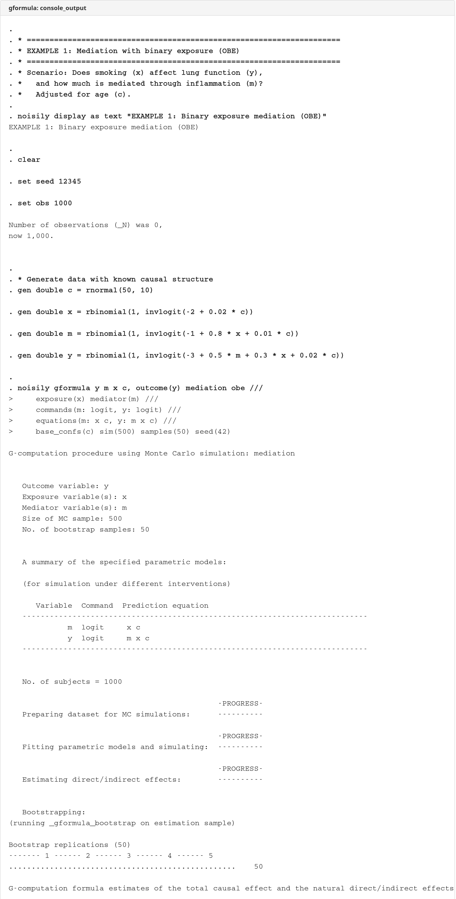
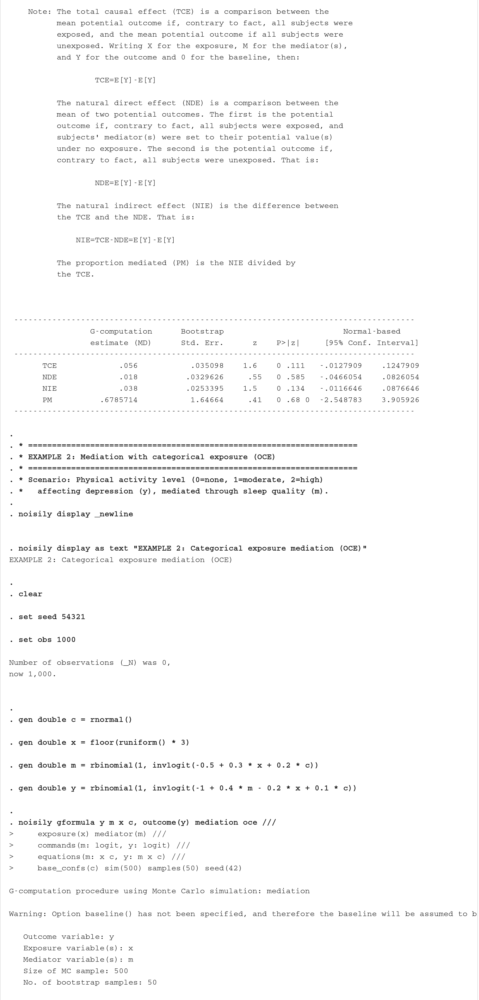
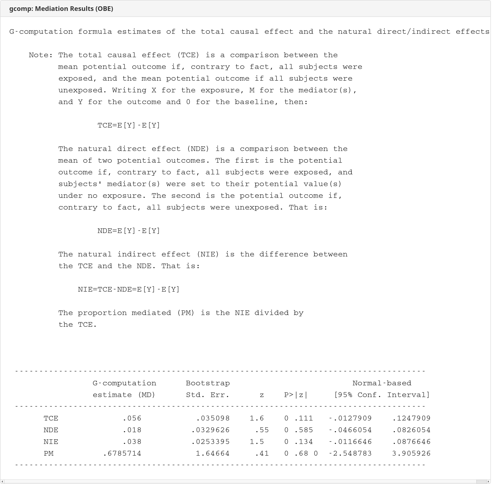
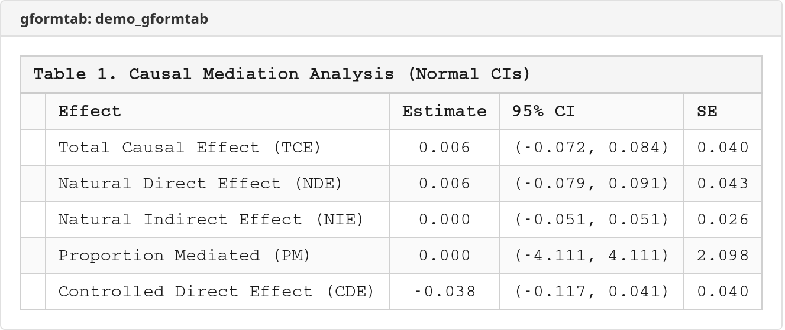

# gcomp — G-Computation Formula for Stata

 

**Version**: 1.3.0 (2026-03-01)
**Forked from**: SSC `gformula` v1.16 beta (Rhian Daniel, 2021)

## Overview

Implements Robins' parametric g-computation formula (Robins 1986) using Monte Carlo simulation for:

- **Time-varying confounding**: Estimates causal effects of time-varying exposures on outcomes in the presence of time-varying confounders affected by prior exposure
- **Causal mediation**: Estimates total causal effects (TCE), natural direct effects (NDE), natural indirect effects (NIE), proportion mediated (PM), and controlled direct effects (CDE)

## Commands

| Command | Description |
|---------|-------------|
| `gcomp` | G-computation formula for causal inference and mediation |
| `gcomptab` | Export gcomp mediation results to publication-ready Excel |

## Installation

```stata
net install gcomp, from("https://raw.githubusercontent.com/tpcopeland/Stata-Tools/main/gcomp/") replace
```

## Syntax

### gcomp — Time-varying confounding

```stata
gcomp varlist [if] [in], outcome(varname) commands(string) equations(string)
    idvar(varname) tvar(varname) varyingcovariates(varlist)
    intvars(varlist) interventions(string) [options]
```

### gcomp — Causal mediation

```stata
gcomp varlist [if] [in], outcome(varname) commands(string) equations(string)
    mediation exposure(varlist) mediator(varlist) base_confs(varlist)
    effect_type [options]
```

where `effect_type` is one of: `obe`, `oce`, `linexp`, `specific`, or `baseline(string)`.

### gcomptab — Export mediation results to Excel

```stata
gcomptab, xlsx(filename) sheet(string) [ci(string) effect(string)
    title(string) labels(string) decimal(#)]
```

## Key Options

### Required (both modes)

| Option | Description |
|--------|-------------|
| `outcome(varname)` | Outcome variable |
| `commands(string)` | Model type for each variable, e.g., `commands(m: logit, y: logit)` |
| `equations(string)` | Prediction equations, e.g., `equations(m: x c, y: m x c)` |

### Required (time-varying)

| Option | Description |
|--------|-------------|
| `idvar(varname)` | Subject identifier |
| `tvar(varname)` | Time variable |
| `varyingcovariates(varlist)` | Time-varying confounders affected by prior exposure |
| `intvars(varlist)` | Variables to intervene on |
| `interventions(string)` | Intervention rules, e.g., `interventions(t: 0)` |

### Mediation options

| Option | Description |
|--------|-------------|
| `mediation` | Enable mediation analysis mode |
| `exposure(varlist)` | Exposure variable(s) |
| `mediator(varlist)` | Mediator variable(s) |
| `base_confs(varlist)` | Baseline confounders |
| `control(string)` | Controlled direct effect level(s) |
| `post_confs(varlist)` | Post-treatment confounders of mediator-outcome |
| `logOR` / `logRR` | Report log odds ratio or log risk ratio |
| `boceam` | BOCE-AM estimation for multi-mediator settings |

### Time-varying options

| Option | Description |
|--------|-------------|
| `eofu` | Outcome measured at end of follow-up |
| `pooled` | Pooled logistic regression across visits |
| `monotreat` | Monotone treatment assumption |
| `dynamic` | Dynamic treatment regime |
| `death(varname)` | Competing death/censoring variable |
| `msm(string)` | Marginal structural model specification |
| `fixedcovariates(varlist)` | Time-invariant covariates |
| `laggedvars(varlist)` | Variables with lagged effects |
| `lagrules(string)` | Custom lag specification rules |
| `derived(varlist)` | Deterministically derived variables |
| `derrules(string)` | Derivation rules |

### Imputation

| Option | Description |
|--------|-------------|
| `impute(varlist)` | Variables to impute (MAR assumption) |
| `imp_eq(string)` | Imputation prediction equations |
| `imp_cmd(string)` | Imputation model commands |
| `imp_cycles(#)` | Chained-equation cycles (default: 10) |

### Simulation

| Option | Description |
|--------|-------------|
| `simulations(#)` | Monte Carlo sample size (default: sample size) |
| `samples(#)` | Bootstrap replications (default: 1000) |
| `seed(#)` | Random number seed |
| `minsim` | Use expected values instead of random draws |
| `moreMC` | Allow MC sample size larger than N |

### Output

| Option | Description |
|--------|-------------|
| `all` | Report all four CI types (normal, percentile, BC, BCa) |
| `graph` | Graph potential outcomes |
| `saving(filename)` | Save bootstrap dataset |
| `replace` | Overwrite existing saved file |

### gcomptab options

| Option | Description |
|--------|-------------|
| `xlsx(filename)` | Output Excel filename (must end with `.xlsx`) |
| `sheet(string)` | Sheet name to create/replace |
| `ci(string)` | CI type: `normal` (default), `percentile`, `bc`, `bca` |
| `decimal(#)` | Decimal places for estimates (default: 3, range: 1-6) |

## Examples

### Example 1: Binary exposure mediation (OBE)

Does smoking affect lung function, and how much is mediated through inflammation?

```stata
* Generate data with known causal structure
clear
set seed 12345
set obs 1000
gen double c = rnormal(50, 10)
gen double x = rbinomial(1, invlogit(-2 + 0.02 * c))
gen double m = rbinomial(1, invlogit(-1 + 0.8 * x + 0.01 * c))
gen double y = rbinomial(1, invlogit(-3 + 0.5 * m + 0.3 * x + 0.02 * c))

* Run g-computation mediation
gcomp y m x c, outcome(y) mediation obe ///
    exposure(x) mediator(m) ///
    commands(m: logit, y: logit) ///
    equations(m: x c, y: m x c) ///
    base_confs(c) sim(500) samples(200) seed(42)
```

### Example 2: Time-varying confounding

What is the causal effect of sustained treatment on a binary outcome, adjusting for time-varying confounders?

```stata
* Panel data: 500 subjects, 5 time points
* Confounder L is affected by prior treatment A
gcomp outcome L A, outcome(outcome) ///
    idvar(id) tvar(time) ///
    varyingcovariates(L) ///
    commands(L: logit, outcome: logit) ///
    equations(L: A, outcome: L A) ///
    intvars(A) interventions(always: 1, never: 0) ///
    sim(500) samples(200) seed(42)
```

### Example 3: Export results to Excel

```stata
* After running gcomp, export to Excel
gcomptab, xlsx(mediation_results.xlsx) sheet("Table 1") ///
    title("Causal Mediation: Smoking → Inflammation → Lung Function")
```

### Example 4: Categorical exposure mediation (OCE)

```stata
* Physical activity level (0=none, 1=moderate, 2=high) → depression,
* mediated through sleep quality
clear
set seed 54321
set obs 1000
gen double c = rnormal()
gen double x = floor(runiform() * 3)
gen double m = rbinomial(1, invlogit(-0.5 + 0.3 * x + 0.2 * c))
gen double y = rbinomial(1, invlogit(-1 + 0.4 * m - 0.2 * x + 0.1 * c))

gcomp y m x c, outcome(y) mediation oce ///
    exposure(x) mediator(m) ///
    commands(m: logit, y: logit) ///
    equations(m: x c, y: m x c) ///
    base_confs(c) sim(500) samples(200) seed(42)
```

## Demo Output

### Console output







### Excel export (gcomptab)



## Stored Results

### gcomp

`gcomp` stores the following in `e()`:

**Scalars:**
| Result | Description |
|--------|-------------|
| `e(N)` | Number of subjects |
| `e(MC_sims)` | Monte Carlo simulation size |
| `e(samples)` | Number of bootstrap replications |
| `e(tce)` | Total causal effect |
| `e(nde)` | Natural direct effect |
| `e(nie)` | Natural indirect effect |
| `e(pm)` | Proportion mediated |
| `e(cde)` | Controlled direct effect (with `control()`) |

**Matrices:**
| Result | Description |
|--------|-------------|
| `e(b)` | Coefficient vector with named columns |
| `e(V)` | Diagonal variance matrix |
| `e(se)` | Standard error vector |
| `e(ci_normal)` | Normal-based confidence intervals |
| `e(ci_percentile)` | Percentile CIs (with `all`) |
| `e(ci_bc)` | Bias-corrected CIs (with `all`) |
| `e(ci_bca)` | Bias-corrected accelerated CIs (with `all`) |

**Macros:**
| Result | Description |
|--------|-------------|
| `e(cmd)` | `gcomp` |
| `e(analysis_type)` | `mediation` or `time_varying` |
| `e(mediation_type)` | `obe`, `oce`, `linexp`, or `specific` |
| `e(scale)` | `RD`, `logOR`, or `logRR` |

### gcomptab

`gcomptab` stores the following in `r()`:

| Result | Description |
|--------|-------------|
| `r(N_effects)` | Number of effects (always 5) |
| `r(tce)` | Total causal effect |
| `r(nde)` | Natural direct effect |
| `r(nie)` | Natural indirect effect |
| `r(pm)` | Proportion mediated |
| `r(cde)` | Controlled direct effect |
| `r(xlsx)` | Excel filename |
| `r(sheet)` | Sheet name |
| `r(ci)` | CI type used |

## Changelog

### v1.3.0 (2026-03-01)
- **gcomptab: Fixed broken data pipeline** — gcomptab now reads from `e()` results instead of global matrices that gcomp drops before returning. This was the root cause of "No gcomp mediation results found" errors after running gcomp.
- **gcomptab: Added validation** — Checks `e(cmd)`, `e(analysis_type)`, and `e(mediation_type)` before extracting results. Rejects `oce` mediation type (unsupported column layout).
- **gcomptab: Named column lookups** — Uses `colnumb()` instead of positional indices for robustness.

## Changes from SSC v1.16

### Bug fixes
1. **Hardcoded `by id:`** - Survival/death path now correctly uses `idvar()` variable
2. **Broken baseline auto-detect with `oce`** - Fixed backtick macro bug that silently produced wrong results
3. **Global macro pollution** - Eliminated `$maxid`, `$check_delete`, `$check_print`, `$check_save`, `$almost_varlist` globals

### Modernization
- Merged `gformula_.ado` into single file (no more separate bootstrap program)
- Replaced deprecated `uniform()` with `runiform()` and `invnormal(uniform())` with `rnormal()`
- Added `double` precision to all numeric `gen` statements
- Inlined `detangle`/`formatline`/`chkin` dependencies (no more `ice` package dependency)
- Added `version 16.0`, `set varabbrev off`, `set more off`
- Namespaced internal variables to prevent collisions

## Validation

The `qa/` directory contains **51 tests** across 5 test files, all passing.

### Cross-validation (crossval_gcomp.do — 13 tests)

Cross-validates gcomp mediation estimates against analytical ground truth and R `mediation` 4.5.1 (Imai, Keele & Tingley 2010) on a shared binary mediation DGP (X→M→Y with confounder C, all logistic).

**V1: Known DGP — analytical ground truth (7 tests).** Generates N=5,000 from a known DGP and compares gcomp's OBE estimates against analytical potential outcome means (computed via N=100,000 MC integration over C). All effects recover the correct direction and magnitude: TCE within 0.011 of truth (0.056), NDE within 0.003 of truth (0.041), NIE within 0.008 of truth (0.015). PM falls in the plausible range [0.05, 0.60] (true: 0.272).

**V2: R `mediation` cross-validation (6 tests).** Runs gcomp on the same N=5,000 dataset used to generate R benchmarks. TCE agrees within 0.002, NDE within 0.009, NIE within 0.010. The gcomp TCE estimate falls within R's 95% CI [0.039, 0.088]. Both tools identify the same effect decomposition pattern (NDE > NIE). The additive decomposition TCE = NDE + NIE holds exactly (residual < 0.001).

R benchmarks, shared dataset, and the R script that generated them are in `qa/data/`.

### Functional tests (test_gcomp.do — 9 tests)

- Verifies all internal programs load correctly (`_gcomp_detangle`, `_gcomp_formatline`)
- Runs mediation analysis (OBE and OCE modes) and confirms `e()` stored results: `e(tce)`, `e(nde)`, `e(nie)`, `e(pm)`, `e(se_tce)`, `e(ci_normal)`
- Regression test for SSC bug #2: OCE mode without `baseline()` correctly auto-detects baseline levels
- Confirms no global macro pollution (SSC bug #3) and no deprecated `uniform()` calls

### gcomptab validation (validation_gcomptab.do — 29 tests)

- Tests Excel export pipeline with known mock results across 8 sections
- Validates stored result accuracy (relative tolerance < 0.01%), Excel structure (7 rows × 5 columns), all 4 CI types (normal, percentile, BC, BCa), decimal precision, custom labels, and edge cases (negative effects, very small effects, large effects)

## References

- Robins JM (1986). A new approach to causal inference in mortality studies with a sustained exposure period. *Mathematical Modelling* 7:1393-1512.
- Daniel RM, De Stavola BL, Cousens SN (2011). gformula: Estimating causal effects in the presence of time-varying confounding or mediation using the g-computation formula. *The Stata Journal* 11(4):479-517.

## Credits

Original author: Rhian Daniel (LSHTM)
Fork maintainer: Timothy P Copeland (Karolinska Institutet)
