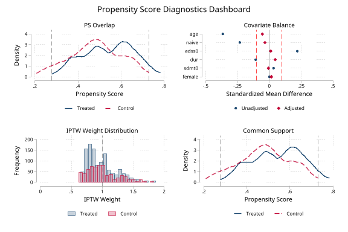
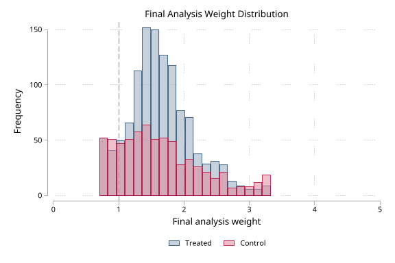

# iivw - Inverse intensity of visit weighting and diagnostics for longitudinal data

**Version 1.9.6** | 2026-07-10

`iivw` corrects bias from informative visit timing in irregular longitudinal data and provides diagnostics for separating sampling bias from residual measurement artifact.  In clinic-based studies, sicker patients often visit more frequently, so they contribute more rows to the dataset and bias naive analyses.  This package re-weights each observation so the fitted outcome model targets the patient population more directly rather than the clinic-visit process.

Three weighting strategies are available:

- **IIW** (inverse intensity weighting) — corrects for outcome-dependent visit frequency
- **IPTW** (inverse probability of treatment weighting) — corrects for confounding by treatment indication
- **FIPTIW** (IIW × IPTW) — corrects for both simultaneously

Outcome models are fit via GEE-style estimation (GLM with clustered robust SEs) or mixed effects, either unweighted or with IIW/IPTW/FIPTIW weights.

## Requirements

- Stata 16 or later
- Stata 17 or later for `iivw_fit, model(mixed)`
- Optional: `tabtools` for the `regtab` model-table Excel examples
- Optional: `psdash` for treatment-propensity diagnostics (`psdash combined`, `psdash weights`) in IPTW/FIPTIW workflows

## Installation

```stata
capture ado uninstall iivw
net install iivw, from("https://raw.githubusercontent.com/tpcopeland/Stata-Tools/main/iivw") replace
```

## Commands

| Command | Description |
|---------|-------------|
| `iivw` | Package overview and available commands |
| `iivw_weight` | Compute IIW, IPTW, or FIPTIW weights |
| `iivw_balance` | Check weight leverage and visit-model balance |
| `iivw_fit` | Fit weighted or unweighted outcome models through a consistent interface |
| `iivw_exogtest` | Check whether lagged outcome/disease activity predicts future visit timing |
| `iivw_diagnose` | Compare unweighted, weighted, and artifact-adjusted marginal/reference-slope estimates |

## Stored Results

Running `iivw` stores the installed package version in `r(version)`, the
space-separated public-command list in `r(commands)`, and its length in
`r(n_commands)`.

| Result | Description |
|---|---|
| `r(version)` | Installed package version |
| `r(commands)` | Space-separated list of public workflow commands |
| `r(n_commands)` | Number of public workflow commands |

## Plain-Language Summary

Longitudinal clinic data usually has one row per visit.  If some patients visit more often because they are getting worse, those patients also appear more often in the dataset.  A standard regression then partly answers the wrong question: it estimates an association in the visit process, not only in the patient population.

`iivw` estimates how likely each observed visit was, then gives less influence to visits that were very likely to occur and more influence to visits that were less likely to occur.  If treatment assignment is also confounded, `iivw` can multiply those visit weights by propensity-score treatment weights.

Use the package as a weighting workflow:

1. `iivw_weight` creates weights and stores the panel metadata.
2. `iivw_balance` checks whether those weights have enough leverage and a usable visit-model balance profile.
3. `iivw_fit` reads those weights and fits the weighted outcome model.

## When Do I Need This?

You likely need this package if:

1. Your data comes from a clinical registry, electronic health records, or any setting where visit times are determined by clinical need rather than a fixed protocol.
2. You have longitudinal data with unequal numbers of visits per subject, and sicker (or healthier) patients are observed more often.
3. You want to estimate a treatment effect, disease trajectory, or covariate association and need to remove bias from informative visit timing.

You probably do *not* need this if visits follow a fixed protocol (e.g., randomized trial with scheduled assessments) or if the main concern is dropout rather than differential visit frequency.

## How It Works

1. **Compute weights** with `iivw_weight`.  You always specify `id()` and `time()`.  For IIW/FIPTIW, the command fits an Andersen-Gill recurrent-event Cox model to estimate each subject's visit intensity; for IPTW-only, it fits only the treatment propensity model.  It then creates a weight variable in the dataset.
2. **Choose the weighting strategy** that matches the scientific problem (see table below).
3. **Inspect diagnostics** with `iivw_balance` for the visit-intensity model.  When `treat()` and `treat_cov()` are used, run `psdash combined` for treatment-propensity overlap, common support, balance, and treatment-weight diagnostics.
4. **Fit the outcome model** with `iivw_fit`.  It reads the weight variable and panel structure from the dataset automatically.

### Two default-modeling choices worth changing

Two `iivw_weight` options materially affect the weights and are worth setting deliberately rather than leaving at their backward-compatible defaults:

- **`nobaseevent` for registry/EHR designs.** By default the baseline visit is modeled as a recurrent event in the Andersen-Gill intensity model, which lets its covariates predict its own occurrence (a circularity). When the baseline visit is an enrollment event common to everyone — registry cohorts, EHR extracts, non-protocol data — `nobaseevent` treats it as study entry instead, removing the circularity. It is the more defensible specification for most observational designs; retain the default only when the first observed visit is itself part of the modeled visit process.
- **`stabcov()` to stabilize the weights.** Without a stabilization numerator the IIW weight is `exp(-xb)`, which can be volatile. A stabilization model leaves the estimand unchanged but typically lowers weight variance and effective-sample-size loss (Buzková & Lumley 2007). `iivw_weight` prints a note when `stabcov()` is omitted.

## Recommended Analysis Recipes

Use these as starting templates, then adapt the covariates to the study design.

### Descriptive disease trajectory in registry data

Goal: estimate a population-average longitudinal trajectory when sicker patients are seen more often.

```stata
iivw_weight, id(id) time(months) ///
    visit_cov(age sex baseline_score baseline_edss clinic_year) ///
    lagvars(current_score relapse) truncate(1 99) efron nolog

iivw_fit current_score age sex baseline_score, ///
    timespec(ns(3)) nolog
```

Report the visit model, the weight distribution, effective sample size, and whether the trajectory changes materially when using `timespec(linear)` instead of `timespec(ns(3))`.

### Binary treatment comparison with informative visits

Goal: compare treatment groups when both treatment assignment and follow-up frequency depend on baseline severity.

```stata
iivw_weight, id(id) time(months) ///
    visit_cov(age sex baseline_edss baseline_score clinic_year) ///
    lagvars(current_score relapse) ///
    treat(treated) treat_cov(age sex baseline_edss baseline_score) ///
    truncate(1 99) efron replace nolog

psdash combined, saving(treatment_ps_dashboard.png)
psdash weights, iivwcomponent(final) graph saving(final_fiptiw_weight.png)
iivw_balance, agrefit nolog

iivw_fit current_score treated age sex baseline_score, ///
    timespec(linear) nolog
```

Use this only when `treated` is a binary, time-invariant subject-level exposure. If treatment switches during follow-up, this package is not a substitute for a time-varying treatment MSM.

### Time-varying treatment effect or treatment trajectory

Goal: test whether the treatment contrast changes as follow-up accumulates.

```stata
iivw_fit current_score treated age sex baseline_score, ///
    timespec(ns(3)) interaction(treated) replace nolog
```

Interpret the interaction terms as a sensitivity description unless the time scale and functional form were prespecified. For a single clinically interpretable contrast at a time point, use Stata post-estimation tools such as `margins` or `lincom` after `iivw_fit`.

### Sampling bias versus measurement artifact

Goal: compare movement from weighting against movement from direct adjustment for repeated measurement, test practice, or cumulative testing.

Use the detailed diagnostic workflow below. The main decomposition target should be a marginal or reference-arm time slope, not the treatment-by-time contrast.

## Diagnostic Workflow: Sampling Bias vs Measurement Artifact

IIVW corrects bias from the observation process. It cannot remove bias that lives inside the measurement itself, such as practice effects from repeated cognitive testing. The diagnostic workflow compares how much the marginal/reference-arm time slope moves after weighting and how much it moves after direct adjustment for the measurement process.

```stata
* 1. Unweighted model through the same outcome-model interface
iivw_fit sdmt_score treatment months_since_tx interaction age sex, ///
    unweighted id(id) time(months_since_tx) timespec(none) nolog
estimates store M_unweighted

* 2. FIPTIW weighted model
iivw_weight, id(id) time(months_since_tx) ///
    visit_cov(treatment age sex bl_edss bl_sdmt) ///
    lagvars(sdmt_score recent_relapse) ///
    treat(treatment) treat_cov(age sex bl_edss bl_sdmt) ///
    truncate(1 99) efron replace nolog

iivw_balance, nolog

iivw_fit sdmt_score treatment months_since_tx interaction age sex, ///
    timespec(none) nolog
estimates store M_weighted

* 3. Measurement-process adjustment
gen double log_test_number = log(test_number + 1)
iivw_fit sdmt_score treatment months_since_tx interaction age sex log_test_number, ///
    timespec(none) replace nolog
estimates store M_adjusted

* 4. Check exogeneity of testing schedule
iivw_exogtest sdmt_score recent_relapse, ///
    id(id) time(months_since_tx) adjust(age sex bl_edss bl_sdmt) ///
    by(treatment) efron nolog

* 5. Check whether a null weighting movement is informative
iivw_balance, nolog

* 6. Quantify diagnostic movement
iivw_diagnose months_since_tx, ///
    unweighted(M_unweighted) weighted(M_weighted) adjusted(M_adjusted) ///
    exogeneity(unknown)
```

The decomposition target is the marginal or reference-arm time slope. A large unweighted-to-weighted movement suggests sampling bias. A small weighting movement but large measurement-adjustment movement suggests residual measurement artifact. Treatment x time contrasts can be reported as ordinary sensitivity estimates, but they should not be interpreted with the sampling/artifact share formula. If `iivw_exogtest` finds lagged outcome predictors of visit timing, the measurement-process adjustment may be endogenous and should be read as a bound or sensitivity result rather than a clean correction.

`iivw_balance` returns `r(informative)`, a single workflow flag that is 1 only when weight leverage is not low and the modeled visit-covariate balance flag is good. `iivw_diagnose` returns point diagnostic quantities. It does not produce an interval for the artifact share; that requires a subject-level bootstrap that refits all three models together.

## Diagnostic Decision Guide

| Pattern | Practical interpretation | Reporting language |
|---------|--------------------------|--------------------|
| Large unweighted-to-weighted movement, small measurement-adjustment movement | The visit process likely explains much of the naive trajectory distortion | "Results were sensitive to IIVW/FIPTIW correction, suggesting informative visit timing." |
| Small weighting movement, large measurement-adjustment movement | Repeated measurement or practice/test artifact may dominate | "Direct measurement-process adjustment changed the marginal slope more than weighting." |
| `iivw_exogtest` p-values small | Lagged outcomes predict future testing or visits; direct adjustment may be endogenous | "The adjusted estimate is presented as a sensitivity bound rather than a clean correction." |
| Total gap near zero | Share estimates are unstable because there is little movement to decompose | "The three estimates were similar; artifact shares are not informative." |
| Sampling or artifact shares outside 0 to 1 | Model movement is sign-inconsistent | "The decomposition is descriptive and sign-inconsistent; focus on the three estimates." |

For expert analyses, the diagnostic workflow is best treated as a structured sensitivity analysis. The package helps make the comparison reproducible, but the scientific claim still depends on whether the visit model, treatment model, and measurement-process adjustment are credible for the design.

## Choosing a Weight Type

| Weight type | When to use | Key `iivw_weight` options |
|-------------|-------------|---------------------------|
| `iivw` | Visit timing is informative, but treatment weighting is not needed | `id()` `time()` `visit_cov()` |
| `iptw` | Treatment confounding only (visits are protocol-driven) | `treat()` `treat_cov()` `wtype(iptw)` |
| `fiptiw` | Both informative visit timing and treatment confounding | `id()` `time()` `visit_cov()` `treat()` `treat_cov()` |

By default, `iivw_weight` auto-detects the type: specifying `treat()` triggers FIPTIW; omitting it triggers IIW.  Override with `wtype()`.

## Data Contract

`iivw_weight` expects long panel data: one row per subject-visit.  `id()` identifies the subject, and `time()` identifies visit time.  The `id()` and `time()` combination must be unique and nonmissing.  For IIW and FIPTIW, each subject needs at least two visits because the command estimates a visit-intensity model from inter-visit intervals.

For IPTW and FIPTIW, `treat()` must be a binary 0/1 treatment indicator, observed on every row, and constant within subject.  Treatment-model covariates are supplied with `treat_cov()` and are not inferred from `visit_cov()`.  IPTW-only analyses can use one row per subject by specifying `wtype(iptw)`.

## What Gets Added to the Data

By default, `iivw_weight` creates `_iivw_weight`, the final weight used by `iivw_fit`.  It also creates component variables when needed: `_iivw_iw` for visit-intensity weights, `_iivw_ps` for the treatment propensity score, and `_iivw_tw` for treatment weights.  Use `generate(prefix)` to change the prefix.

The visit-intensity component (`_iivw_iw`) is normalized to mean 1.  The raw IIW weight `exp(-xb)` has an arbitrary scale — the Andersen-Gill Cox model has no intercept and its linear predictor is uncentered — so its raw mean depends on covariate location rather than model fit.  Rescaling to mean 1 leaves the weighted point estimates and the cluster-robust standard errors unchanged (a constant weight factor cancels in the estimating equation and in both the bread and meat of the sandwich), but it makes the reported weight mean, effective sample size, and `max > 10` thresholds interpretable on a common scale.

The weighting step also stores dataset metadata, including the panel ID, time variable, weight type, weight variable, component variables, prefix, expanded visit-model covariate list, treatment variable, treatment-model covariates, and the treatment propensity-score contract.  `iivw_balance`, `iivw_fit`, and `psdash` read that metadata automatically, so the usual workflow is to run `iivw_weight`, inspect the relevant diagnostics, and then run `iivw_fit` without re-entering the panel structure.

## Using psdash with iivw

When `iivw_weight` is run with `treat()` and `treat_cov()`, the treatment propensity model can be diagnosed with `psdash`.

Run `psdash combined` immediately after `iivw_weight` to inspect treatment-propensity overlap, common support, treatment-covariate balance, and treatment-weight distribution. Then run `iivw_balance` for the visit-intensity component. The two diagnostics answer different questions: `psdash` checks treatment positivity and treatment-model balance; `iivw_balance` checks whether visit-intensity weights have enough leverage and whether modeled visit covariates are balanced.

```stata
iivw_weight, id(id) time(months) ///
    visit_cov(age sex bl_edss bl_sdmt) ///
    lagvars(sdmt relapse) ///
    treat(treated) treat_cov(age sex bl_edss bl_sdmt) ///
    truncate(1 99) efron replace nolog

psdash combined, saving(treatment_ps_dashboard.png)
psdash weights, iivwcomponent(final) graph saving(final_fiptiw_weight.png)
iivw_balance, agrefit nolog
iivw_fit sdmt treated age sex bl_edss, timespec(ns(3)) nolog
```

## Choosing Covariates

The most common practical mistake is treating `visit_cov()` and `treat_cov()` as interchangeable lists. They answer different design questions.

| Covariate role | Put it in | Rationale |
|----------------|-----------|-----------|
| Baseline disease severity that drives both visits and treatment | `visit_cov()` and `treat_cov()` | It can confound both observation and treatment assignment |
| Previous outcome value or recent event | `lagvars()` or a precomputed lag in `visit_cov()` | It predicts future visit intensity without using the current visit outcome to explain itself |
| Demographic or calendar design variable | Usually both models if it affects both mechanisms | It can capture structural visit access and treatment patterns |
| Post-treatment mediator | Usually neither treatment model nor primary outcome covariate unless explicitly planned | It can change the estimand if adjusted for casually |
| Cumulative test count or practice-effect proxy | Outcome model diagnostic adjustment, not `visit_cov()` by default | It is part of the measurement process being evaluated |

Start with a subject-matter model that is smaller than the full dataset dictionary. Add variables because they plausibly drive the visit or treatment process, not because they improve in-sample fit. If the final weights are extreme or ESS is poor, simplify before interpreting a highly variable weighted estimate.

## Assumptions and Limits

The weights are a tool for a specific bias problem.  They do not make a weak study design causal by themselves.

| Requirement | Why it matters |
|-------------|----------------|
| **Conditional non-informativeness of the visit process** — visit intensity is independent of the current outcome given the visit-model covariates | This is the core identifying assumption of IIW. It is violated if you put the *concurrent* outcome in `visit_cov()` (use `lagvars()` or baseline values instead). `iivw_exogtest` is a falsification check, not proof, of this condition |
| Visit model covariates capture the drivers of visit timing | IIW only removes bias explained by measured covariates |
| Treatment model covariates capture measured treatment confounding | IPTW/FIPTIW assume no unmeasured confounding after adjustment |
| Treatment is binary and time-invariant within subject | Current IPTW/FIPTIW implementation is not for treatment switching |
| Positivity/overlap is plausible | Subjects with near-certain treatment or visits create extreme weights |
| Outcome model includes the scientific predictors of interest | Weights correct sampling/visit imbalance; they do not choose the outcome model |
| Standard errors treat weights as fixed *by default* | The sandwich SE and the default bootstrap hold the weights fixed; add `iivw_fit, bootstrap(#) refitweights` to re-estimate the weights inside each replicate and propagate weight-estimation uncertainty |

For dropout or censoring, use an IPCW strategy.  For time-varying treatment decisions, use a marginal structural model designed for that setting.

## Worked Examples

These examples use a self-contained synthetic panel because Stata does not ship a built-in irregular-visit dataset that exercises the full workflow.

### 1. Create example longitudinal data

This creates 80 subjects with 4 visits each, a continuous disability outcome (EDSS), a binary treatment, and a binary event (relapse) that also predicts visit frequency.

```stata
clear
set seed 20260417
set obs 320
gen long id = ceil(_n/4)
bysort id: gen byte visit = _n
gen double days = (visit - 1) * 90 + runiform() * 20
replace days = 0 if visit == 1
gen double edss_bl = 2 + 3 * runiform()
bysort id: replace edss_bl = edss_bl[1]
gen double age = 35 + 15 * runiform()
bysort id: replace age = age[1]
gen byte sex = runiform() > 0.5
bysort id: replace sex = sex[1]
gen byte treated = (runiform() < invlogit(-0.8 + 0.5 * edss_bl))
bysort id: replace treated = treated[1]
gen double edss = edss_bl + 0.012 * days - 0.7 * treated + rnormal(0, 0.45)
gen byte relapse = (runiform() < invlogit(-2 + 0.4 * edss))
gen byte treatment = cond(treated == 0, 0, cond(edss_bl < 3.5, 1, 2))
label define arm 0 "Placebo" 1 "Low dose" 2 "High dose"
label values treatment arm
```

### 2. IIW only: correct the visit process

When the main concern is that patients with worse disease are seen more often, but treatment assignment is either randomized or not being analyzed:

```stata
iivw_weight, id(id) time(days) ///
    visit_cov(edss_bl age sex) lagvars(edss relapse) nolog
iivw_balance
summarize _iivw_weight, detail
iivw_fit edss treated edss_bl, model(gee) timespec(linear)
```

After computing weights, always inspect the distribution before fitting the outcome model.  If the weight tails are extreme (e.g., max > 10), re-run `iivw_weight` with `truncate(1 99)`.  For real analyses, prefer baseline or lagged time-varying predictors in the visit model when the current visit measurement should not be used to explain the timing of that same visit.

### 3. FIPTIW: correct visit timing and treatment confounding together

Add `treat()` and `treat_cov()` when treatment assignment is also non-random:

```stata
iivw_weight, id(id) time(days) ///
    visit_cov(edss_bl age sex) lagvars(edss relapse) ///
    treat(treated) treat_cov(age sex edss_bl) ///
    truncate(1 99) replace nolog

iivw_fit edss treated age sex edss_bl, model(gee) timespec(quadratic)
```

### 4. Add time-varying effects in the weighted outcome model

Once weights are in place, `iivw_fit` can add flexible time trends and time × covariate interactions:

```stata
iivw_fit edss treated age sex edss_bl, ///
    model(gee) timespec(ns(3)) interaction(treated) replace
```

Use `timespec(linear)`, `timespec(quadratic)`, `timespec(cubic)`, `timespec(ns(#))`, `timespec(categorical)`, or `timespec(none)` depending on how flexible the time trend should be.  Start with `linear`, then compare to `ns(3)` to check sensitivity. Use `categorical` when time is a small set of meaningful visit waves or calendar periods.

### 5. Use categorical predictors in the outcome model

`categorical()` expands a multi-level variable into labeled dummy variables.  It affects the outcome model only — it does not create multi-arm IPTW.

```stata
iivw_weight, id(id) time(days) ///
    visit_cov(edss_bl age sex) lagvars(edss relapse) replace nolog
iivw_fit edss treatment edss_bl, ///
    categorical(treatment) timespec(ns(3)) interaction(treatment) replace
```

### 6. Use categorical time for visit-wave effects

`timespec(categorical)` expands the stored time variable into labeled non-reference time indicators.  Use value labels on the time variable so `collect` and `regtab` get readable rows.

```stata
label define wave 1 "Baseline" 2 "Month 6" 3 "Month 12", replace
label values visit_wave wave

iivw_weight, id(id) time(visit_wave) ///
    visit_cov(edss_bl relapse) replace nolog
iivw_fit edss treatment edss_bl, ///
    timespec(categorical) timebasecat(1) ///
    categorical(treatment) interaction(treatment) replace collect
regtab, xlsx(iivw_results.xlsx) sheet(Waves) title(Treatment by Visit Wave)
```

Generated coefficient names stay short and predictable, such as `_iivw_tcat_1` and `_iivw_ix_drug_tcat_1`, while variable labels carry table-ready text such as `Visit wave: Month 6 (vs. Baseline)` and `Drug x Visit wave: Month 6`. Use the generated names for post-estimation commands and the labels for exported tables.

### 7. Bootstrap standard errors

By default, bootstrap replicates apply to the outcome model fit with fixed weights — the weights are not re-estimated inside each bootstrap draw.  Bootstrap clustering uses `cluster()` when specified and otherwise defaults to the subject ID stored by `iivw_weight`:

```stata
iivw_fit edss treated edss_bl, bootstrap(500) nolog replace
```

Add `refitweights` to re-estimate the IIW/IPTW/FIPTIW weights from scratch inside every bootstrap replicate, so the interval reflects weight-estimation uncertainty as well as outcome-model uncertainty.  Each replicate is a subject-level (cluster) bootstrap: it resamples whole subjects, refits the Andersen-Gill visit-intensity model (and, for FIPTIW/IPTW, the treatment propensity model) on the resampled panel using the specification stored by `iivw_weight`, then refits the outcome model with the fresh weights.  The point estimates are identical to the fixed-weight fit; only the standard errors change, and they can be larger or smaller depending on how the visit and outcome models share covariates:

```stata
iivw_fit edss treated edss_bl, bootstrap(500) refitweights nolog replace
```

`refitweights` requires `bootstrap(#)` with `# > 0`, is not compatible with `unweighted`, resamples at the stored subject `id()` (so a different `cluster()` is not supported), and needs the weighting metadata from a preceding `iivw_weight` run.  It is substantially slower than the fixed-weight bootstrap because the weight models are refit in every replicate.

### 8. Export results to Excel

Use the `collect` option with non-bootstrap `model(gee)` fits and `regtab` (from the `tabtools` package) to build publication-ready model tables:

```stata
collect clear
iivw_fit edss treated edss_bl, model(gee) nolog replace collect
regtab, xlsx(iivw_results.xlsx) sheet(Results) title(IIW Analysis) stats(n)
```

`iivw_balance`, `iivw_exogtest`, and `iivw_diagnose` can also export their diagnostic tables directly, without requiring `tabtools`:

```stata
iivw_balance, xlsx(iivw_results.xlsx) sheet(Balance) replace

iivw_exogtest sdmt_score recent_relapse, ///
    id(id) time(months_since_tx) adjust(age sex bl_edss bl_sdmt) ///
    by(treatment) efron nolog xlsx(iivw_results.xlsx) sheet(Exogeneity)

iivw_diagnose months_since_tx, ///
    unweighted(M_unweighted) weighted(M_weighted) adjusted(M_adjusted) ///
    exogeneity(unknown) xlsx(iivw_results.xlsx) sheet(Diagnostics) replace
```

These direct exports are workbook-only: each command writes a styled `.xlsx` sheet with tabtools/regtab-style title, group-header, statistic-header, label-column, border, width, and footnote conventions. Existing workbooks are updated by replacing only the named sheet. `iivw_balance` and `iivw_exogtest` use variable-label row headers when labels are available. For `iivw_exogtest`, `replace` still means overwrite generated lag variables, not Excel workbook replacement.

## Weight Diagnostics

After running `iivw_weight`, check these before fitting the outcome model:

| Diagnostic | What to look for | Action if concerning |
|------------|------------------|---------------------|
| `iivw_balance` | `r(leverage) == "low"` or `r(informative) == 0` | Treat null weighting movement as uninformative; revisit visit model |
| `summarize _iivw_weight, detail` | Max > 10, max/min ratio > 100 | Add `truncate(1 99)` |
| Effective sample size (reported automatically) | ESS much less than N | Simplify the visit model or truncate |
| Weight mean (reported automatically) | Mean far from 1.0 | Check model specification |
| Compare with/without truncation | Treatment effect changes substantially | Result may be driven by a few extreme weights |
| `psdash combined` (IPTW/FIPTIW only) | Poor treatment PS overlap, common-support loss, or residual treatment-covariate imbalance | Revisit `treat_cov()` and treatment positivity |
| `psdash weights, iivwcomponent(final) detail graph` | Extreme final FIPTIW/IPTW analysis weights | Check both treatment and visit components; consider truncation |

## Common Problems and Fixes

| Symptom | Likely cause | Fix |
|---------|--------------|-----|
| `treat() contains missing values` | Treatment is missing on one or more visit rows | Fill the baseline treatment consistently within subject, or exclude those subjects deliberately |
| `treat() must be time-invariant` | Treatment changes over time | Do not use this IPTW/FIPTIW implementation; use a time-varying treatment/MSM approach |
| `requires at least 2 visits per subject` | IIW/FIPTIW needs repeated visits | Use repeated-visit data, or use `wtype(iptw)` for treatment weighting only |
| Very large weights | Sparse overlap, overfit model, or unusual visit patterns | Inspect covariates, simplify the model, and try `truncate(1 99)` |
| `variable ... already exists` | Re-running created-variable steps | Add `replace` if overwriting is intended |
| `iivw_fit` says weights are missing | Dataset changed or weights were dropped after `iivw_weight` | Re-run `iivw_weight` immediately before `iivw_fit` |

## Interpreting Results

- **Coefficients** (default GEE with gaussian family) are the change in the outcome per one-unit change in the predictor, averaged over the population.
- **Treatment effect**: The coefficient on the treatment variable is the weighted treatment contrast.  A causal interpretation additionally requires a correctly specified visit model, a correctly specified propensity model for IPTW/FIPTIW, no unmeasured confounding, and a treatment assignment mechanism appropriate for the chosen weight type.
- **Standard errors** are sandwich (robust) SEs clustered at `cluster()` when specified and otherwise at the subject ID stored by `iivw_weight`.  By default they do not account for weight estimation uncertainty; use `bootstrap(#) refitweights` to obtain SEs that re-estimate the weights inside each replicate.
- **Few clusters**: cluster-robust SEs are anti-conservative when the number of clusters (subjects) is modest, and weighting concentrates influence on a few subjects, which worsens the effective-cluster count.  `iivw_fit` prints a note when fewer than 40 clusters contribute; prefer `bootstrap(#)` for inference in that regime.
- **GEE vs mixed with weights**: `model(gee)` is the defensible primary weighted estimator — it is the marginal estimating equation that IIW theory identifies.  `model(mixed)` applies IIVW weights through a single observation-level `[pw=]`, which Stata does not rescale across levels, so the random-effects variance components are not consistently weight-estimated (Rabe-Hesketh & Skrondal 2006).  For a weighted mixed fit, interpret the fixed-effect (mean) structure only; `iivw_fit` prints a note to this effect.
- **Post-estimation**: All standard Stata post-estimation commands work after `iivw_fit` (`predict`, `lincom`, `test`, `margins`).

## What to Report

For technical reports and papers, include enough detail for readers to assess the weighting step:

- weight type used (`iivw`, `iptw`, or `fiptiw`)
- visit model covariates and whether `efron` tie handling was used
- treatment model covariates for IPTW/FIPTIW
- whether weights were stabilized with `stabcov()` and/or truncated with `truncate()`
- weight diagnostics: mean, min, max, selected percentiles, and effective sample size
- `iivw_balance` leverage, balance flag, and `r(informative)` result
- outcome model family/link, time specification, clustering level, and whether SEs were sandwich or bootstrap
- unweighted, weighted, and measurement-adjusted estimates for the marginal/reference time-slope coefficient when using the diagnostic workflow
- the `iivw_exogtest` specification and whether lagged outcome or disease-activity variables predicted visit timing
- the `iivw_diagnose` sampling/artifact gaps or endogenous diagnostic range
- the definition of the measurement-process adjustment, such as raw cumulative test count, `log(test+1)`, inter-test interval, or categorical test occasion

## Practical Notes

- `treat()` must be observed on every row used in IPTW/FIPTIW, binary (0/1), and time-invariant within each subject.  For time-varying treatments, consider marginal structural models instead.
- `treat_cov()` is required for IPTW and FIPTIW; treatment-model covariates are not inferred from `visit_cov()`.
- IPTW-only analyses may use one row per subject.  IIW and FIPTIW require repeated visits because they estimate a visit-intensity model.
- `iivw_balance` automatically reads the stored visit-model covariates from `iivw_weight`; rerun `iivw_weight` if older datasets do not contain that metadata.
- `iivw_fit` automatically reads the weight variable, panel ID, and time variable stored by `iivw_weight`.
- `iivw_fit, unweighted` can fit the same outcome-model surface before weights are computed; specify `id()` and `time()` if no package metadata are present.
- `categorical()` is for the outcome model only.  It does not define IPTW treatment levels.
- `lagvars()` is useful when a time-varying variable should enter the visit model using its previous-visit value rather than its current-visit value.
- `iivw_exogtest` is a falsification diagnostic, not proof that visit or testing is exogenous.
- `iivw_diagnose` is intended for the marginal/reference-arm time slope, not for assigning artifact shares to treatment x time contrasts.
- `bootstrap()` reflects outcome-model uncertainty only because the weights are treated as fixed; add `refitweights` to also propagate weight-estimation uncertainty by re-estimating the weights inside each replicate.
- `efron` in `iivw_weight` uses the Efron tie-handling method in the Cox model (matches R's `coxph()` default; Breslow remains the Stata default).

## Reproducible Analysis Checklist

Before showing results, check:

- `isid id time` succeeds or the duplicate visit-times have been resolved deliberately
- `treat()` is binary and constant within subject for IPTW/FIPTIW
- `summarize _iivw_weight, detail` has no implausible tails after any planned truncation
- `iivw_balance` does not report low leverage or an uninformative balance result
- the effective sample size is acceptable relative to the scientific precision needed
- the unweighted and weighted models use the same outcome, predictors, time specification, and clustering level unless a difference is explicitly justified
- documentation of the final analysis includes the weight type, visit model, treatment model, truncation rule, tie method, outcome model, and diagnostic decisions

## Validation

The package ships with functional, validation, simulation, reporting-export, install-smoke, and cross-validation QA under `qa/`, including comparisons against independent R workflows for both IIW-style weighting and the FIPTIW setting.

Run the fast release gate from the package QA directory:

```bash
cd iivw/qa && stata-mp -b do run_all.do quick
```

Run the full release gate, including simulation and R cross-validation lanes:

```bash
cd iivw/qa && stata-mp -b do run_all.do
```

## Demo

The demo script builds a synthetic SDMT-like longitudinal panel inspired by the NTZ/RTX application workflow in the methods study. It demonstrates the current end-to-end diagnostic path: unweighted GEE through `iivw_fit, unweighted`, FIPTIW weighting, treatment-propensity diagnostics through `psdash`, visit-intensity diagnostics through `iivw_balance`, direct `log(test+1)` measurement-artifact adjustment, `iivw_exogtest`, and `iivw_diagnose`. It also demonstrates styled `.xlsx` sheet exports from `iivw_balance`, `iivw_exogtest`, and `iivw_diagnose`, plus the `regtab` workbook export for model tables.

Regenerate from the repository root with:

```stata
do iivw/demo/demo_iivw.do
```

Generated outputs:

- [`demo/iivw_psdash_dashboard.png`](demo/iivw_psdash_dashboard.png) — psdash treatment-propensity overlap, support, balance, and treatment-weight dashboard using `_iivw_ps` and `_iivw_tw`
- [`demo/iivw_psdash_final_weights.png`](demo/iivw_psdash_final_weights.png) — final FIPTIW analysis-weight distribution from `psdash weights, iivwcomponent(final)`
- `demo/iivw_results.xlsx` — Excel workbook with a diagnostic model-comparison sheet and a `Visit waves` sheet showing categorical-time interaction labels
- `demo/iivw_reporting_exports.xlsx` — direct reporting workbook with `Balance`, `Exogeneity`, and `Diagnostics` sheets

The script verifies the generated psdash graph files, the direct export workbook sheets, and expected rows in all three styled worksheets.

### psdash treatment-propensity diagnostics

After `iivw_weight` creates `_iivw_ps`, `_iivw_tw`, `_iivw_iw`, and `_iivw_weight`, the demo calls `psdash combined` with no treatment or propensity-score arguments. `psdash` reads the iivw dataset contract and uses the treatment component for PS overlap, common support, treatment-covariate balance, and treatment IPTW diagnostics.



The final FIPTIW analysis weight can be summarized separately with `iivwcomponent(final)`.



The key diagnostic pattern in the demo mirrors the study logic: weighting moves the marginal/reference time slope only modestly, while the measurement-process adjustment moves it sharply. Because the exogeneity check finds that lagged outcomes predict future visit timing, `iivw_diagnose` reports a diagnostic range rather than a point artifact share.

## References

- Buzkova P, Lumley T. Longitudinal data analysis for generalized linear models with follow-up dependent on outcome-related variables. *Canadian Journal of Statistics*. 2007;35(4):485-500. doi:10.1002/cjs.5550350402.
- Lin H, Scharfstein DO, Rosenheck RA. Analysis of longitudinal data with irregular, outcome-dependent follow-up. *Journal of the Royal Statistical Society: Series B (Statistical Methodology)*. 2004;66(3):791-813. doi:10.1111/j.1467-9868.2004.b5543.x.
- Pullenayegum EM. Multiple outputation for the analysis of longitudinal data subject to irregular observation. *Statistics in Medicine*. 2016;35(11):1800-1818. doi:10.1002/sim.6829.
- Rabe-Hesketh S, Skrondal A. Multilevel modelling of complex survey data. *Journal of the Royal Statistical Society: Series A (Statistics in Society)*. 2006;169(4):805-827. doi:10.1111/j.1467-985X.2006.00426.x.
- Tompkins G, Dubin JA, Wallace M. On flexible inverse probability of treatment and intensity weighting: Informative censoring, variable selection, and weight trimming. *Statistical Methods in Medical Research*. 2025;34(5):915-937. doi:10.1177/09622802241313289.

## Changelog

### v1.9.6 (2026-07-10)

- **Fixed `iivw_diagnose` ignoring `set level`.** The option was declared `level(real 95)` rather than `level(cilevel)`, so the command silently produced 95% coefficient intervals -- in the console table, in `r(estimates)`, and in the Excel export -- regardless of the session's `set level` value, while `iivw_fit`, `iivw_balance`, and `iivw_exogtest` all honoured it. A user who ran `set level 90` and then compared `iivw_fit` output against `iivw_diagnose` output was silently comparing a 90% interval with a 95% one. Passing `level(#)` explicitly always worked and is unaffected. `level()` now defaults to `c(level)` and takes Stata's standard `cilevel` semantics, so `iivw_diagnose` accepts exactly what `iivw_fit`, `iivw_balance`, and `iivw_exogtest` accept. Two edges of the accepted set moved to match: `level(99.99)` is now valid (it previously errored), and `level(#)` now allows at most two decimal places (Stata's own rule), so a level such as `68.268949` -- the exact one-standard-error coverage -- must be given as `68.27`
- Removed an unreachable "could not be opened automatically" branch from the Excel export helper: Stata's `shell` never propagates the child's exit status, so `_rc` is always 0 there and the note could never fire
- Documented that `iivw_exogtest`'s `r(n_ids)` is summed over fitted models, so a `by()` variable that varies within subject counts a subject once per group; `r(N)` is unaffected because every row belongs to exactly one group

### v1.9.5 (2026-07-10)

- **Documented the limits of artifact-adjustment covariates in `iivw_fit`.** A cumulative test count or visit index is usually near-collinear with follow-up time, so a model that adjusts for it attributes the time trend to the test count and the marginal time slope can attenuate sharply or reverse sign. When the artifact is *outcome-dependent*, additive separability fails and no adjustment of this form recovers the truth. `iivw_fit.sthlp` now documents both cases and points to `iivw_diagnose`'s `exogeneity(endogenous)` sensitivity range. No command behavior changed
- Replaced the simulation gates' single blanket bias bound (`|bias| > 3`, against a true effect of 0.5) with per-estimator, per-scenario assertions: the unweighted GEE must miss the truth, FIPTIW must remove more than 60% of that bias and beat the naive estimator's coverage, and the confirmed residual must stay inside a documented envelope. Tolerances are derived from recorded runs rather than guessed
- Simulation gates now emit the standard `RESULT: <name> tests=N pass=N fail=N` sentinel and exit nonzero on failure, so `qa parse` and `run_all.do` can see them; previously they could not fail
- Removed `set varabbrev off, perm` from the three simulation scripts, which permanently changed the user's Stata preference

- Hardened direct Excel exports against unsafe shell metacharacters in `xlsx()` paths before the optional `open` action
- Preserved embedded double quotes in report titles and footnotes across the public-command/helper boundary instead of silently deleting them
- Ensured `iivw_balance` and `iivw_diagnose` always drop temporary export frames after failures, and added defensive estimate-state cleanup to `iivw_weight`
- Added focused v1.9.4 regression QA and a complete `qa/README.md` file index, coverage map, and lane guide

### v1.9.3 (2026-07-07)

- **Fixed the `model(mixed)` bootstrap collapsing resampled subjects into one random-effect group.** `iivw_fit, model(mixed) bootstrap(#)` (without `refitweights`) resampled clusters but did not relabel them, so a subject drawn twice kept its original panel id and entered `mixed` as a single merged random-effect group. This biased the resampled random-effects variance components and understated the intercept standard error (the gap widens with smaller panels or higher resampling). The bootstrap now passes `idcluster()` and fits each replicate on the fresh per-draw id, matching the `refitweights` path. GEE bootstrap is unaffected (cluster resampling without `idcluster()` is valid for GLM)
- **Cluster-robust standard errors in the `iivw_balance, agrefit` Cox refits.** Both the unweighted and weighted Andersen-Gill refits now request `vce(cluster` _id_ `)`. The counting-process intervals of a subject are correlated, so the previous naive standard errors were anti-conservative; hazard-ratio point estimates are unchanged
- **Documented `refitweights` in the flagship help.** The `iivw` overview help previously stated that `bootstrap()` never re-fits the weights; it now points to `iivw_fit`'s `refitweights` option, which re-estimates the IIW/IPTW/FIPTIW weights inside every replicate so the interval also propagates weight-estimation uncertainty

### v1.9.2 (2026-07-03)

- **Fixed string subject ids being silently rejected as "no observations".** `iivw_fit`, `iivw_exogtest`, and `iivw_balance` extended their estimation sample with `markout` on the id/cluster/by variable, but `markout` without `strok` marks *every* observation out when the variable is a string -- so a perfectly valid string subject id (which `stset`, `stcox`, `glm, vce(cluster)`, and `mixed` all accept, and which `iivw_weight` handles correctly) died downstream with a misleading `no observations` error. The sample screens now use `strok`, which also correctly treats empty-string ids as missing
- **Noted first visits at time 0.** In the default (baseline-visit-modeled) mode, a first visit at exactly time 0 spans a zero-length risk interval, so `stset` excludes it from the visit-intensity model while the row still receives the conventional baseline weight of 1. `iivw_weight` now prints a note with the affected subject count instead of leaving the exclusion buried in the `stset` table (invisible under `quietly`). Under `nobaseevent` baseline rows are excluded by design and no note is printed

### v1.9.1 (2026-07-01)

- **Rejected negative visit times.** `iivw_weight` (IIW/FIPTIW) and `iivw_exogtest` now stop with an error when `time()` contains negative values. The Andersen-Gill counting process is at risk from time 0, so `stset` was silently dropping every interval ending at or before 0 from the visit-intensity Cox model while weights were still produced for all rows -- on a centered time scale this could discard half the visit events without any warning. Negative `entry()` times remain accepted (first visits at time 0 require them) but now print a note that risk time before 0 is not counted
- **Aligned `iivw_balance, agrefit` with the stored weighting contract.** The AG refit now rebuilds its counting-process intervals using the stored `entry()` times and, under `nobaseevent`, again excludes each subject's baseline visit from the modeled events. Previously the refit always started risk at 0 and treated the baseline visit as an event, so its hazard ratios were computed over different risk sets than the weight-generating model
- **Rejected backslash in export sheet names.** `xlsx()` exports now refuse `sheet()` names containing a backslash, which Excel forbids alongside the other invalid worksheet characters already checked

### v1.9.0 (2026-07-01)

- **Normalized the IIW component to mean 1.** `iivw_weight` now rescales `_iivw_iw` (and hence the FIPTIW product) so the visit-intensity weight averages 1 over the estimating sample. The raw `exp(-xb)` weight has an arbitrary scale because the Andersen-Gill Cox model has no intercept and its linear predictor is uncentered, so the previous weight mean depended on covariate location rather than model fit. **Weighted point estimates and cluster-robust SEs are unchanged** (a constant weight factor cancels in the estimating equation and in both halves of the sandwich), but the reported weight mean, effective sample size, and `max > 10` diagnostics are now interpretable on a common scale. `iivw_fit, refitweights` inherits the normalization automatically because it recomputes weights through `iivw_weight`
- **Fenced the weighted `mixed` path.** `iivw_fit, model(mixed)` now prints a note when weights are applied, explaining that a single observation-level `[pw=]` is not rescaled across levels, so the random-effects variance components are not consistently weight-estimated (Rabe-Hesketh & Skrondal 2006). `model(gee)` remains the defensible primary weighted estimator; the mixed fixed-effect (mean) structure is the interpretable target under weighting
- **Added a few-cluster inference note.** `iivw_fit` prints a note when fewer than 40 clusters contribute to an analytic-SE (non-bootstrap) fit, since cluster-robust SEs are anti-conservative with few clusters and weighting concentrates influence on a few subjects. The note recommends `bootstrap(#)`
- **Promoted the conditional non-informativeness assumption** to the first row of the Assumptions and Limits table, and documented it as the core identifying assumption of IIW: visit intensity independent of the current outcome given the visit-model covariates
- Documentation: documented the mean-1 normalization, the few-cluster note, and the GEE-vs-mixed weighting caveat in the README and the `iivw_weight`/`iivw_fit` help files; added the Rabe-Hesketh & Skrondal (2006) reference

### v1.8.0 (2026-07-01)

- **Added `iivw_fit, bootstrap(#) refitweights`**: a subject-level (cluster) bootstrap that re-estimates the IIW/IPTW/FIPTIW weights from scratch inside every replicate, so the resulting interval reflects weight-estimation uncertainty rather than holding the weights fixed. Each replicate resamples whole subjects, refits the Andersen-Gill visit-intensity model (and the treatment propensity model for FIPTIW/IPTW) on the resampled panel using the stored weighting specification, then refits the outcome model. Point estimates are unchanged from the fixed-weight fit; only the standard errors differ. New helper `_iivw_bs_refit.ado`; `iivw_weight` now stores a weight-construction replay spec (`stabcov`, `truncate`, `efron`, `entry`) and `_iivw_get_settings` exposes it. `e(iivw_refitweights)` records the mode
- **Added a stabilization nudge**: `iivw_weight` now prints a one-line note for IIW/FIPTIW runs when `stabcov()` is omitted, since stabilized weights leave the estimand unchanged but usually lower weight variance and ESS loss
- **Reframed `nobaseevent`** in the help and README as the recommended specification for registry/EHR designs where the baseline visit is study entry rather than a clinically triggered follow-up visit; the default is retained for backward compatibility
- Documentation: documented `refitweights` and the stabilization note in `iivw_fit.sthlp` and `iivw_weight.sthlp`; updated the SE/assumptions guidance

### v1.7.4 (2026-06-26)

- Fixed the default thin/medium Excel export frame so `iivw_balance` sheets draw the rightmost vertical border on the final column.
- Added regression QA that checks the styled `iivw_balance` workbook with the shared border/shading validator.

### v1.7.3 (2026-06-26)

- **Fixed `iivw_balance, agrefit efron`**: the weighted Andersen-Gill refit previously failed silently (`rc 101` — Stata forbids Efron ties with probability weights), dropping the weighted hazard ratio. The weighted refit now uses Breslow ties (the only method `stcox` permits with `pweights`) and emits a one-time note; Efron still applies to the unweighted refit.
- Removed redundant version lines from the sub-command help files; the package version is recorded once in the flagship `iivw.sthlp`.

### v1.7.2 (2026-06-25)

- Added `qa/validation_iivw_recovery.do` — known-truth parameter recovery: a simulated DGP with the true marginal slope and the true marginal treatment effect set analytically, asserting that IIVW recovers the population slope and FIPTIW recovers the treatment effect (within MC tolerance) while naive/IIW-only estimators miss. QA-only; no change to package behavior.

### v1.7.1 (2026-06-17)

- **Restructured the `iivw_diagnose` Excel sheet** from six columns (A-F) to five (A-E). The standalone "Value" column (F) is removed; each diagnostic and bias value now sits in the `Estimate` column, merged across the estimate columns
- Added a bold **`Diagnostic values` divider row** between the model-estimate rows and the single-value diagnostic rows, so the gaps, shares, bounds, and bias rows read as their own labeled block instead of lone numbers under `Estimate`
- Internal-only: `_iivw_export_table` gains a `valuespanfrom()` option driving the new divider/value-row merges; the generic `iivw_exogtest` and gap exports are unaffected (default `0` preserves prior behavior)

### v1.7.0 (2026-06-17)

- Added Excel styling options to `iivw_balance`, `iivw_diagnose`, and `iivw_exogtest`, matching the `tabtools` house style: `borderstyle()` (`thin` | `medium` | `academic` | `default`), `headershade`, `theme()` (journal presets), `headercolor()`, `zebracolor()`, and `zebra`
- **Changed default Excel appearance:** styled worksheets now render a full thin grid (`borderstyle(thin)`) with no header shading by default, so exports match `table1_tc`/`regtab`/`puttab` output in a combined workbook. Pass `borderstyle(academic)` for the previous three-rule look
- The numeric values, cell contents, and `r()` surface of every reporting command are unchanged

### v1.6.0 (2026-06-15)

- **Breaking:** Removed the `excel()` option synonym from `iivw_balance`, `iivw_diagnose`, and `iivw_exogtest`. Use `xlsx()` (the documented canonical name) instead
- **Breaking:** Removed the `digits()` option synonym from `iivw_balance`, `iivw_diagnose`, and `iivw_exogtest`. Use `decimals()` (which still abbreviates to `dec()`) instead
- **Breaking:** `iivw_diagnose` no longer returns the individual decomposition scalars (`r(b_unweighted)`, `r(se_weighted)`, `r(sampling_gap)`, `r(artifact_share)`, `r(bounds_lower)`, `r(bias_*)`, `r(true)`, etc.). The estimate columns remain in the existing `r(estimates)` matrix; the derived diagnostics are now grouped in a new `r(decomp)` matrix (rows `sampling_gap`, `artifact_gap`, `total_gap`, `sampling_share`, `artifact_share`, `bounds_lower`, `bounds_upper`), and the bias quantities in a new `r(bias)` matrix (rows `true`, `bias_unweighted`, `bias_weighted`, `bias_adjusted`, returned only with `true()`). Read a value with, e.g., `r(decomp)["sampling_gap", "value"]`. The numeric values are unchanged
- The `decimals()`/`xlsx()` numeric and file behaviour is otherwise identical to v1.5.3

### v1.5.3 (2026-06-14)

- Unified the Excel-export contract across the three reporting commands (`iivw_balance`, `iivw_diagnose`, `iivw_exogtest`): writing to a worksheet that already exists without `replace` now warns and still returns the diagnostic results in `r()` (rc 602 is softened) instead of `iivw_balance`/`iivw_diagnose` erroring out and discarding `r()`; genuine option errors (missing/invalid `xlsx()`, conflicting files, out-of-range `decimals()`) still hard-fail as before
- Fixed `iivw_exogtest` so `replace` is forwarded to the workbook writer, allowing an existing worksheet to be overwritten (previously the sheet could never be replaced)
- Corrected the `replace` help text in `iivw_balance` and `iivw_diagnose`, which described the option as a compatibility no-op; it is required to overwrite an existing worksheet
- `iivw` now derives its displayed version from the `.ado` header so it cannot drift on a bump
- Documented that the `iivw_fit` effects table reports normal-approximation intervals for bootstrap fits, with full bootstrap CIs available via `estat bootstrap`
- Minor internal cleanups (removed a dead `level()` guard in `iivw_diagnose` and an unused local in the export helper)

### v1.5.2 (2026-06-14)

- Harmonized the `decimals()` option across the Excel-exporting diagnostics: `iivw_exogtest` now accepts the `dec()` abbreviation and a `digits()` synonym, matching `iivw_balance` and `iivw_diagnose` (default remains 3)

### v1.5.1 (2026-06-11)

- Enforced `decimals()`/`digits()` bounds in `iivw_balance` and `iivw_diagnose` before export dispatch
- Fixed `iivw_diagnose` workbook exports so the diagnostics header honors the requested `level()`
- Protected existing workbook sheets from accidental overwrite unless `replace` is specified
- Fixed unlabeled negative categorical levels in `iivw_fit` so generated dummy names are valid Stata names
- Made `entry()` validation match the documented `nobaseevent` behavior in `iivw_weight`
- Hardened captured display paths so SMCL headings and error-help text do not produce spurious `r(199)` returns
- Added regression QA for balance thresholds, export footnotes, diagnostics export confidence-level headers, categorical-time `e()` metadata, workbook sheet protection, negative categorical levels, `nobaseevent` entry handling, and deterministic diagnostic known answers

### v1.5.0 (2026-05-29)

- Persisted the treatment propensity score as `_iivw_ps` for IPTW/FIPTIW runs
- Added the shared iivw treatment-PS metadata contract consumed by `psdash`
- Added treatment-component returns from `iivw_weight` and `_iivw_get_settings`
- Documented the `psdash combined` handoff for treatment-propensity diagnostics

### v1.4.0 (2026-05-29)

- Added styled `.xlsx` sheet export to `iivw_exogtest`, including variable-label predictor rows, per-group hazard-ratio blocks, joint-test rows, and `r(xlsx)`, `r(sheet)`, and `r(decimals)` returns
- Restyled the direct `iivw_balance` and `iivw_diagnose` workbook sheets to match the tabtools/regtab export layout, including grouped headers and readable row labels
- Updated exogeneity QA to verify local package loading, workbook creation, by-group export rows, soft export failure, and `decimals()` bounds

### v1.3.1 (2026-05-28)

- `iivw_fit` now errors instead of silently ignoring `collect` when it is combined with `model(mixed)` or `bootstrap()`; the `collect:` prefix is only applied to non-bootstrap `model(gee)` fits. Added a Stata 17+ guard for `collect`
- Documented the valid `iivw_diagnose, level()` range (greater than 10 and less than 99.99)
- Removed unused internal locals in `iivw_diagnose`

### v1.3.0 (2026-05-27)

- Added `iivw_weight, nobaseevent`: treats each subject's first visit as study entry (risk onset) rather than a modeled visit-intensity event. The Andersen-Gill model then fits only follow-up visits, removing the circularity of the baseline visit predicting its own occurrence, and lets single-visit subjects pass through (they contribute a baseline row with weight 1 instead of triggering the "requires at least 2 visits" error). Default behavior is unchanged
- Improved the 2-visit error message to point users to `nobaseevent`
- Stored `r(nobaseevent)` and `_dta[_iivw_baseevent]` to record the mode
- Added styled direct `.xlsx` sheet reporting exports to `iivw_balance` and `iivw_diagnose`

### v1.2.3 (2026-05-26)

- Fixed `iivw_fit, bootstrap()` so the bootstrap results table honors `level()`; previously the bootstrapped output always reported 95% intervals while the iivw summary table used the requested confidence level

### v1.2.2 (2026-05-26)

- Added `iivw_fit, timespec(categorical)` for visit-wave or period indicators, with `timebasecat()` to choose the reference time category
- Added stable generated categorical-time names and table-ready variable labels for time dummies and time interactions, including categorical predictor x categorical time terms for `collect`/`regtab`
- Stored categorical-time metadata in `e()` and dataset characteristics, and added QA for generated labels, interactions, and `regtab` export

### v1.2.1 (2026-05-25)

- Refreshed the diagnostic documentation and demo around the current `iivw_balance`, `iivw_exogtest`, and `iivw_diagnose` workflow

### v1.2.0 (2026-05-24)

- Added `iivw_balance` for weight-leverage and visit-model balance diagnostics
- Stored expanded visit-model covariates in `iivw_weight` metadata for downstream diagnostics
- Added balance QA and updated package command inventory, help, README, and install manifest

### v1.1.0 (2026-05-24)

- Added `iivw_fit, unweighted` for fitting the baseline outcome model through the same surface as weighted models
- Added `iivw_exogtest` to test whether lagged outcomes or disease activity predict future visit/test timing
- Added `iivw_diagnose` to compute marginal/reference-slope sampling and measurement-artifact movement across stored models
- Added Scenario E QA for nonseparable headroom-dependent measurement artifact
- Updated package overview, help, README, and install manifest for the diagnostic workflow

### v1.0.6 (2026-05-18)

- Rejected the panel time variable in `iivw_fit` `indepvars` when `timespec()` also adds it (prevents silent collinear duplication)
- Deferred `iivw_weight` and `iivw_fit` metadata wipes past input validation so validation-stage failures preserve prior weights/fit state
- Formatted effects table now shows an `(omitted)` row for predictors dropped by the estimator instead of silently skipping them
- Added an Intercept row to the formatted effects table
- Fixed `iivw_weight.sthlp` abbreviation documentation for `treat_cov()` (minimum abbreviation is `treat`)
- Softened convergence-warning advisory lines from `as error` to `as text`; standardized `exit 198` → `error 198` and removed a dead post-filter line
- Added v1.0.6 regression QA covering all of the above

### v1.0.5 (2026-05-09)

- Rejected invalid long `generate()` prefixes before creating partial outputs
- Rejected missing `treat()` values for IPTW/FIPTIW and negative `bootstrap()` counts
- Added exact known-answer validation and stricter R fixture coefficient checks

### v1.0.4 (2026-05-06)

- Added hard validation that `id()` and `time()` are nonmissing before `iivw_weight` reaches `stset`
- Enforced `entry()` as nonmissing, constant within subject, and strictly earlier than each subject's first visit
- Added adversarial QA lanes for weighting, outcome fitting, release/install/docs, validation guards, and external R cross-validation
- Integrated quick/full QA runner modes with full-mode R reference regeneration

### v1.0.3 (2026-04-30)

- Allowed IPTW-only weighting for one-row-per-subject datasets
- Required explicit `treat_cov()` for IPTW/FIPTIW treatment models
- Allowed `iivw_fit` time-only and intercept-only weighted outcome models
- Expanded the formatted effects summary to include time and interaction terms
- Made cross-validation path resolution robust to running from the package or repository root

### v1.0.2 (2026-04-26)

- Added `efron` option to `iivw_weight` for Efron tie-handling in the Cox model (matches R's coxph default; Breslow remains the Stata default)
- Added `collect` option to non-bootstrap GEE fits in `iivw_fit` for Stata's collect framework integration
- Improved `stabcov()` documentation with guidance on numerator model specification in FIPTIW settings
- Added Remarks in `iivw_fit.sthlp` for choosing between GEE and mixed models, and for timespec selection
- Expanded `entry()` documentation for late-entry/left-truncation designs
- Fixed `iivw.sthlp` Example 1 to match README (was showing wrong predictors)
- Improved error message for time-varying treatment (suggests MSMs as alternative)

## Author

Timothy P Copeland, Karolinska Institutet
