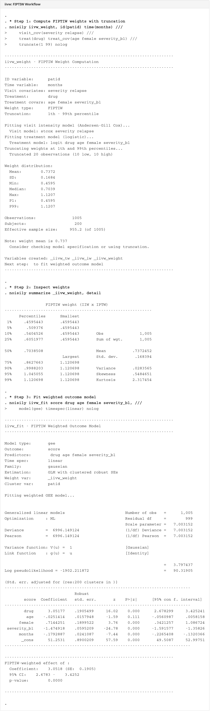

# iivw

 

Inverse intensity of visit weighting for longitudinal data with informative visit processes.

## The Problem

In observational longitudinal studies, patients are not seen on a fixed schedule. Sicker patients tend to visit more often, meaning the observed data over-represents high-severity timepoints. Naive analyses of these data produce biased treatment effect estimates because the outcome influences when it is measured.

`iivw` corrects this by computing observation-level weights that account for the informative visit process, restoring the analysis to what would have been observed under a non-informative (e.g., fixed-interval) design.

## Weighting Methods

| Method | Corrects for | Model |
|--------|-------------|-------|
| **IIW** | Informative visit timing | Andersen-Gill recurrent-event Cox |
| **IPTW** | Confounding by indication | Cross-sectional logistic regression |
| **FIPTIW** | Both simultaneously | IIW x IPTW (product weight) |

**IIW** (inverse intensity weighting; Buzkova & Lumley 2007) models the visit process as a recurrent event using an Andersen-Gill counting-process Cox model. Covariates that drive visit frequency (e.g., disease severity, recent clinical events) enter the intensity model. Each observation receives weight exp(-xb), down-weighting visits that occurred because the patient was sicker and up-weighting visits from patients who visited less frequently than expected.

**IPTW** (inverse probability of treatment weighting) fits a logistic propensity score model on cross-sectional data (one row per subject) to estimate P(treatment | confounders). Weights are always stabilized: the numerator is the marginal treatment prevalence, preventing extreme weights from subjects with near-certain treatment assignment.

**FIPTIW** (Tompkins et al. 2025) combines both corrections as a simple product. This is the recommended approach when treatment assignment is non-random and visit timing is outcome-dependent, which is the typical situation in observational registry data.

Stabilized IIW weights are also supported via `stabcov()`, fitting a marginal intensity model in the numerator to further reduce weight variability.

## Commands

| Command | Purpose |
|---------|---------|
| `iivw_weight` | Compute IIW, IPTW, or FIPTIW weights |
| `iivw_fit` | Fit weighted outcome model (GEE or mixed) |

`iivw_weight` handles the full weight pipeline: counting-process construction, Cox model fitting, propensity score estimation, weight computation, optional truncation, and diagnostic reporting. It stores metadata in dataset characteristics so that `iivw_fit` can automatically retrieve the weight variable, panel structure, and weight type.

`iivw_fit` fits the weighted outcome model using either GEE-equivalent estimation (GLM with clustered sandwich SEs, as required by IIW theory) or mixed-effects models. Time can enter the model as linear, polynomial, or natural cubic spline terms. Bootstrap SEs are available for inference that accounts for the weight estimation step.

## Installation

```stata
net install iivw, from("https://raw.githubusercontent.com/tpcopeland/Stata-Tools/main/iivw")
```

## Quick Start

```stata
* Load longitudinal MS visit data (500 patients, ~4,400 irregular visits)
use relapses.dta, clear

* Prepare time variable and event indicator
sort id edss_date
gen double days = edss_date - dx_date
gen byte relapse = !missing(relapse_date)
bysort id (days): gen double edss_bl = edss[1]
```

### IIW only (correct for visit timing)

```stata
iivw_weight, id(id) time(days) visit_cov(edss relapse) nolog
iivw_fit edss relapse, model(gee) timespec(linear)
```

### FIPTIW (correct for visit timing + treatment confounding)

```stata
iivw_weight, id(id) time(days) ///
    visit_cov(edss relapse) ///
    treat(treated) treat_cov(age sex edss_bl) ///
    truncate(1 99) replace nolog

iivw_fit edss treated age sex edss_bl, model(gee) timespec(quadratic)
```

### FIPTIW with treatment-time interaction

```stata
iivw_weight, id(id) time(days) ///
    visit_cov(edss relapse) ///
    treat(treated) treat_cov(age sex edss_bl) ///
    truncate(1 99) replace nolog

iivw_fit edss treated age sex edss_bl, ///
    model(gee) timespec(ns(3)) interaction(treated)
```

### With lagged covariates and bootstrap SEs

```stata
iivw_weight, id(id) time(days) ///
    visit_cov(edss relapse) lagvars(edss relapse) ///
    replace nolog

iivw_fit edss relapse, bootstrap(500) nolog
```

## Demo Output



## Key Options

### `iivw_weight`

| Option | Description |
|--------|-------------|
| `id(varname)` | Subject identifier (required) |
| `time(varname)` | Continuous visit time (required) |
| `visit_cov(varlist)` | Covariates for the visit intensity Cox model (required) |
| `treat(varname)` | Binary treatment indicator (triggers FIPTIW) |
| `treat_cov(varlist)` | Covariates for propensity score model |
| `stabcov(varlist)` | Covariates for stabilized IIW numerator model |
| `lagvars(varlist)` | Time-varying covariates to lag by one visit |
| `truncate(# #)` | Percentile trimming (e.g., `truncate(1 99)`) |
| `wtype(string)` | Override auto-detection: `iivw`, `iptw`, or `fiptiw` |
| `entry(varname)` | Subject-specific study entry time (default: 0) |
| `generate(name)` | Prefix for weight variables (default: `_iivw_`) |

### `iivw_fit`

| Option | Description |
|--------|-------------|
| `model(string)` | `gee` (default) or `mixed` |
| `timespec(string)` | `linear`, `quadratic`, `cubic`, `ns(#)`, or `none` |
| `family(string)` | GLM family (default: `gaussian`) |
| `link(string)` | GLM link function (default: canonical) |
| `interaction(varlist)` | Create time x covariate interaction terms |
| `bootstrap(#)` | Bootstrap replicates (0 = sandwich SE) |
| `cluster(varname)` | Override clustering variable |

## Cross-Validation

The package includes a QA suite (`qa/`) with 49 tests, including cross-validation against two independent R implementations.

### Part A: IrregLong (Phenobarb dataset)

Cross-validated against R's [IrregLong](https://CRAN.R-project.org/package=IrregLong) package (Pullenayegum 2020) using the Phenobarb pharmacokinetic dataset (59 neonates, 155 concentration measurements at irregular times).

| Test | Result |
|------|--------|
| Cox coefficients vs R `coxph` (Efron ties) | Match within 0.005 |
| IIW weight correlation with IrregLong `iiw.weights()` | r = 0.997 |

### Part B: FIPTIW Simulation (Tompkins et al. 2025)

Cross-validated against the [FIPTIW](https://github.com/grcetmpk/FIPTIW) R implementation using Tompkins et al.'s simulation DGP (200 subjects, thinned Poisson visit process, known treatment effect beta = 0.5).

| Test | Result |
|------|--------|
| Cox coefficients (D, Wt, Z) vs R | Match within 0.01 |
| IPTW weights vs R | Max difference < 0.001 |
| FIPTIW weight correlation with R | r = 0.80 |
| Treatment effect recovery (beta = 0.5) | Within 1.0 of truth |

The small residual difference in FIPTIW correlation stems from the IIW component: Stata's `stcox` uses Breslow tie-breaking by default while R's `coxph` uses Efron. Cox coefficients and IPTW weights match to floating-point precision.

### Test Summary

| Suite | Tests | Status |
|-------|-------|--------|
| Functional (`test_iivw.do`) | 34 | All pass |
| Validation (`validation_iivw.do`) | 15 | All pass |
| Cross-validation (`xval_iivw.do`) | 9 | All pass |

R reference data and scripts are included in `qa/` for reproducibility.

## Stored Results

### `iivw_weight` (r-class)

`r(N)`, `r(n_ids)`, `r(mean_weight)`, `r(sd_weight)`, `r(min_weight)`, `r(max_weight)`, `r(p1_weight)`, `r(p99_weight)`, `r(ess)`, `r(n_truncated)`, `r(weighttype)`, `r(weight_var)`

### `iivw_fit` (e-class)

All results from the underlying `glm` or `mixed` command, plus: `e(iivw_cmd)`, `e(iivw_model)`, `e(iivw_weighttype)`, `e(iivw_timespec)`, `e(iivw_weight_var)`, `e(iivw_interaction)`, `e(iivw_ix_vars)`

## Requirements

- Stata 16.0 or higher

## Version

- **1.1.0** (2026-03-07): Add `interaction()` option to `iivw_fit` for time x covariate product terms
- **1.0.0** (2026-03-06): Initial release

## Author

Timothy P Copeland
Department of Clinical Neuroscience, Karolinska Institutet

## License

MIT License

## References

- Buzkova P, Lumley T (2007). Longitudinal data analysis for generalized linear models with follow-up dependent on outcome-related variables. *Canadian Journal of Statistics* 35(4):485-500.
- Tompkins G, Dubin JA, Wallace M (2025). On flexible inverse probability of treatment and intensity weighting. *Statistical Methods in Medical Research*.
- Pullenayegum EM (2016). Multiple outputation for the analysis of longitudinal data subject to irregular observation. *Statistics in Medicine* 35(11):1800-1818.
- Pullenayegum EM (2020). IrregLong: Analysis of longitudinal data with irregular observation times. R package. CRAN.
- Lin H, Scharfstein DO, Rosenheck RA (2004). Analysis of longitudinal data with irregular, outcome-dependent follow-up. *Journal of the Royal Statistical Society B* 66(3):791-813.
