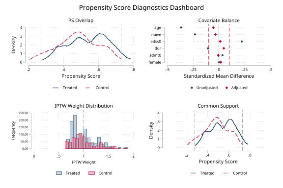
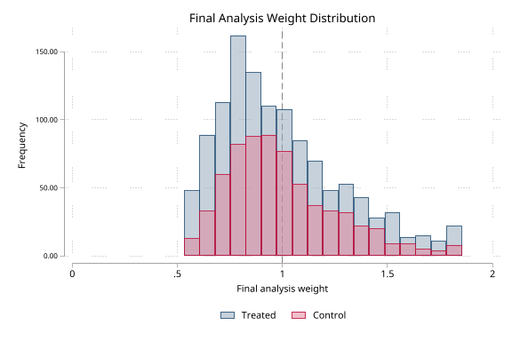

# iivw — Inverse intensity of visit weighting for longitudinal data

**Version 3.4.3** | 2026-08-17

`iivw` corrects over-representation caused by informative visit timing in irregular longitudinal observational data, and can also apply treatment-propensity weights. It gives Stata users a workflow for estimating weights, checking leverage and the person-time target, fitting outcome models, and comparing sampling with measurement-process movement.

## Quick Start

The following creates a small irregular-visit panel, computes IIW weights, checks them, and fits a weighted population-average model.

```stata
clear
set seed 20260417
set obs 240
gen long id = ceil(_n/4)
bysort id: gen byte visit = _n
gen double time = 3 * (visit - 1) + runiform() * .05
replace time = 0 if visit == 1
gen double x = rnormal()
bysort id: replace x = x[1]
gen byte treated = runiform() < invlogit(.4 + .5 * x)
bysort id: replace treated = treated[1]
gen double y = 1 + .1 * time + x + rnormal()

iivw_weight, id(id) time(time) visit_cov(x) lagvars(y) maxfu(12) nolog
iivw_balance
iivw_fit y x, vce(fixed) nolog
```

`vce(fixed)` is explicit here so the short example uses the weights-known analytic sandwich. For weighted GEE fits using IIW or IPTW, the supported default when no variance option is supplied is a 999-draw subject-level refit bootstrap; see [Inference](#inference).

## Requirements

- Stata 16 or later.
- Stata 17 or later for `iivw_fit, model(mixed)` and the `collect` option.
- No external runtime dependency is required for the core `iivw` commands or their direct `xlsx()` reporting exports.
- Optional: `tabtools` for `regtab` model-table exports, and `psdash` for treatment-propensity diagnostics after IPTW/FIPTIW weighting.
- The repository demo additionally uses `tc_schemes` for its graph scheme.

## Installation

Install the released package from the public Stata-Tools distribution:

```stata
capture ado uninstall iivw
net install iivw, from("https://raw.githubusercontent.com/tpcopeland/Stata-Tools/main/iivw") replace
```

Install optional companion packages only when you need their workflows:

```stata
net install tabtools, from("https://raw.githubusercontent.com/tpcopeland/Stata-Tools/main/tabtools") replace
net install psdash, from("https://raw.githubusercontent.com/tpcopeland/Stata-Tools/main/psdash") replace
```

## Commands

| Command | Description |
|---|---|
| `iivw` | Display the package overview and return the available command list |
| `iivw_weight` | Compute IIW, IPTW, or FIPTIW weights |
| `iivw_balance` | Report weight leverage, composition shifts, and the visit-model target-SMD diagnostic |
| `iivw_fit` | Fit weighted or unweighted GEE-style and mixed-effects outcome models |
| `iivw_exogtest` | Test whether lagged outcomes or disease activity predict subsequent visit timing |
| `iivw_diagnose` | Decompose movement in a stored marginal or reference-slope estimate across three models |

## How It Works

The package addresses a visit-level sampling problem: when patients who are sicker, or otherwise different, are seen more often, a row-per-visit analysis can over-represent them. The visit model estimates the conditional intensity of observation, and the resulting weights make the outcome analysis less dominated by differential visit frequency.

| Weight type | Use when | Construction |
|---|---|---|
| IIW | Visit timing is informative but treatment weighting is not needed | Inverse intensity weights from an Andersen–Gill recurrent-event Cox model |
| IPTW | Treatment assignment is confounded but visit timing is not being corrected | Stabilized inverse treatment-propensity weights from a one-row-per-subject logistic model |
| FIPTIW | Both visit timing and treatment assignment are informative or confounded | The product of the IIW and IPTW components |

The usual workflow is:

1. `iivw_weight` estimates the visit and, when requested, treatment models, creates the final weight, and stores the panel contract in dataset characteristics.
2. `iivw_balance` reports leverage, effective sample size, descriptive composition shifts, and the target standardized mean difference for the visit model.
3. `iivw_fit` reads the stored weight and panel metadata and fits the outcome model.
4. `iivw_exogtest` and `iivw_diagnose` are optional diagnostics for separating observation-process movement from residual measurement-process movement.

For IIW and FIPTIW, give the study's observation window with exactly one of `censor()`, `maxfu()`, or `endatlastvisit`. A subject-specific or common administrative end is usually the design-relevant choice; `endatlastvisit` is available for studies whose follow-up genuinely ends at the last observed visit.

Visit-model covariates must be measured before the interval whose visit they explain. Put baseline and externally updated variables in `visit_cov()`; use `lagvars()` for visit-measured outcomes, disease activity, or recent events. The weight-model varlists accept plain numeric variables, not factor-variable or inline spline notation, so expand such terms into physical columns before weighting.

## Choosing a Workflow

| Study question | Starting workflow |
|---|---|
| Irregular registry or EHR visits distort a disease trajectory | Use IIW, inspect `iivw_balance`, and compare `timespec(linear)` with a flexible time specification |
| Treatment is binary and time-invariant, with confounding by baseline severity | Use IPTW or FIPTIW with `treat()` and `treat_cov()`; inspect treatment components with optional `psdash` |
| Both treatment and visit timing are confounded | Use FIPTIW; `treat()` is included in the visit-intensity model by default |
| Repeated measurement may create practice or test-count artifact | Fit unweighted, weighted, and measurement-adjusted models, then use `iivw_exogtest` and `iivw_diagnose` |

## Worked Examples

Run the Quick Start setup first if you want to reuse its synthetic data. The examples below are sequenced so that the same panel can support IIW, FIPTIW, inference, exogeneity, and decomposition workflows.

### 1. IIW only

Correct informative visit timing without a treatment-propensity component. The default `baseline(entry)` treats each subject's first row as study entry.

```stata
iivw_weight, id(id) time(time) visit_cov(x) lagvars(y) maxfu(12) replace nolog
iivw_balance
iivw_fit y x, model(gee) timespec(linear) vce(fixed) nolog
```

### 2. FIPTIW for treatment confounding and informative visits

Adding `treat()` makes the default weight type FIPTIW and adds treatment to the visit-intensity model. `stabcov(treated)` is valid here because `treated` is also in the outcome design shown below.

```stata
iivw_weight, id(id) time(time) visit_cov(x) lagvars(y) maxfu(12) ///
    treat(treated) treat_cov(x) stabcov(treated) replace nolog
iivw_balance, component(final) nolog
iivw_fit y treated x, model(gee) timespec(linear) vce(fixed) nolog
```

### 3. Refit-bootstrap inference

For a weighted IIW or IPTW analysis, the recommended variance route refits the nuisance models inside each subject-level bootstrap replicate. FIPTIW intervals requested explicitly are nominal and are labeled in the stored inference status.

```stata
iivw_fit y treated x, model(gee) ///
    vce(bootstrap, reps(999) seed(20260417)) ///
    citype(percentile) nolog
```

### 4. Exogeneity diagnostic for visit timing

The diagnostic creates one-visit lags of the tested variables and fits counting-process Cox models for subsequent visits. Use the same end-of-follow-up contract as the weighting call.

```stata
iivw_exogtest y, id(id) time(time) maxfu(12) ///
    adjust(x) by(treated) replace nolog
```

### 5. Sampling movement versus measurement-process movement

Store three comparable models for the coefficient of interest, then ask `iivw_diagnose` to report the sampling gap, artifact gap, and descriptive shares. Use `estimand(contrast)` when the coefficient is a treatment contrast; that reports movement but suppresses the share decomposition.

```stata
iivw_fit y time x, unweighted id(id) time(time) ///
    timespec(none) nolog
estimates store M_unweighted

iivw_fit y time x, timespec(none) vce(fixed) replace nolog
estimates store M_weighted

gen double log_visit = log(visit + 1)
iivw_fit y time x log_visit, timespec(none) ///
    vce(fixed) replace nolog
estimates store M_adjusted

iivw_diagnose time, unweighted(M_unweighted) ///
    weighted(M_weighted) adjusted(M_adjusted) ///
    estimand(marginal) exogeneity(unknown)
```

The direct reporting commands can write styled workbook sheets without `tabtools`:

```stata
iivw_balance, xlsx("iivw_reporting_exports.xlsx") sheet("Balance") replace
iivw_exogtest y, id(id) time(time) maxfu(12) adjust(x) ///
    by(treated) replace nolog xlsx("iivw_reporting_exports.xlsx") ///
    sheet("Exogeneity")
iivw_diagnose time, unweighted(M_unweighted) ///
    weighted(M_weighted) adjusted(M_adjusted) ///
    xlsx("iivw_reporting_exports.xlsx") sheet("Diagnostics") replace
```

## Demo

The repository checkout workflow is [demo/demo_iivw.do](demo/demo_iivw.do). It creates synthetic SDMT-like data, installs the optional companion packages needed for graph and model-table output, and is the source for the checked-in assets below; the demo script is not part of the `net install` payload.

| Asset | Contents |
|---|---|
|  | `psdash combined` treatment-propensity overlap, support, balance, and treatment-weight diagnostics |
|  | Final analysis-weight distribution from `psdash weights, iivwcomponent(final)` |
| [Model-comparison and visit-wave workbook](demo/iivw_results.xlsx) | `collect`/`regtab` output for model comparison and categorical-time interactions |
| [Direct reporting workbook](demo/iivw_reporting_exports.xlsx) | `iivw_balance`, `iivw_exogtest`, and `iivw_diagnose` export sheets |

## Command Reference

### iivw

Syntax:

```stata
iivw
```

With no arguments, `iivw` displays the package overview and returns `r(version)`, `r(commands)`, and `r(n_commands)`.

### iivw_weight

Syntax:

```stata
iivw_weight, id(varname) time(varname) [options]
```

| Option | Default | Purpose |
|---|---|---|
| `id(varname)` | Required | Subject identifier in long panel data |
| `time(varname)` | Required | Numeric, nonnegative visit time, unique within subject |
| `visit_cov(varlist)` | Required for IIW/FIPTIW unless `lagvars()` supplies covariates | Numeric covariates for the visit-intensity Cox model; ignored for IPTW-only with a note |
| `treat(varname)` | None | Binary 0/1 treatment, constant within subject; required for IPTW/FIPTIW |
| `treat_cov(varlist)` | None | Numeric covariates for the treatment logistic model; required when treatment weighting is requested |
| `wtype(iivw\|iptw\|fiptiw)` | Auto-detected | IIW when `treat()` is absent, FIPTIW when it is present; use `iptw` to skip the visit model |
| `stabcov(varlist)` | None | Covariates for the IIW stabilization numerator |
| `lagvars(varlist)` | None | Raw visit-measured sources to lag by one visit before use in the visit model |
| `entry(varname)` | 0 | Subject-specific study entry time |
| `censor(varname)` | None | Subject-specific end of follow-up; mutually exclusive with `maxfu()` and `endatlastvisit` |
| `maxfu(#)` | None | Common end of follow-up; mutually exclusive with the other end-of-follow-up options |
| `endatlastvisit` | None | End each subject's risk window at their last visit; use only when that is the study design |
| `baseline(entry\|event)` | `entry` | Treat the first visit as study entry or as a modeled recurrent event |
| `truncvisit(# #)` | None | Trim the IIW component at row-level percentiles |
| `trunctreat(# #)` | None | Trim the IPTW component at subject-level percentiles |
| `truncfinal(# #)` | None | Trim the final analysis weight at row-level percentiles |
| `experimentalnotreatvisit` | Off | FIPTIW sensitivity mode that omits treatment from the visit model; outside the supported contract |
| `generate(name)` | `_iivw_` | Prefix for generated weights and metadata-linked variables |
| `replace` | Off | Overwrite variables owned by a prior `iivw` call |
| `nolog` | Off | Suppress model iteration logs |
| `efron` | On | Use Efron handling for tied visit times |
| `breslow` | Off | Use Breslow handling, mainly for compatibility with pre-3.0.0 analyses |
| `allownonconverged` | Off | Continue after a nonconverged weight model; use only as an explicit sensitivity/debugging choice |
| `allowmissingweights` | Off | Accept rows with no computed weight as a complete-case analysis; otherwise missing-weight rows are an error |

`truncate()` is removed and errors. Choose `truncvisit()`, `trunctreat()`, or `truncfinal()` so the component being altered is explicit.

### iivw_balance

Syntax:

```stata
iivw_balance [varlist] [if] [in], [options]
```

The optional numeric `varlist` adds covariates to the displayed table; the stored visit-model covariates remain the target of the balance verdict. The command applies to IIW and FIPTIW metadata, not IPTW-only weights.

| Option | Default | Purpose |
|---|---|---|
| `component(iiw\|final)` | `iiw` | Describe the visit component or the final analysis weight; the target verdict always uses the IIW component |
| `cvcut(#)` | 0.10 | CV below this threshold is classified as low leverage |
| `essratiocut(#)` | 0.95 | ESS/N above this threshold is classified as low leverage |
| `balcut(#)` | 0.10 | Maximum absolute target SMD allowed for `within_rule` |
| `agrefit` | Off | Display hazard ratios from the refitted visit-intensity model |
| `level(#)` | `c(level)` | Confidence level for refit hazard-ratio intervals |
| `efron`, `breslow` | Stored setting | Ignored as fit requests; the refit replays the tie method used to create the weights |
| `nolog` | Off | Suppress Cox iteration logs in the refit |

For the workbook options shared by the reporting commands, see [Excel reporting](#excel-reporting).

### iivw_fit

Syntax:

```stata
iivw_fit depvar [indepvars] [if] [in], [options]
```

| Option | Default | Purpose |
|---|---|---|
| `unweighted` | Off | Fit without applying stored weights |
| `id(varname)` | Stored metadata for weighted fits | Panel ID for an unweighted fit without package metadata |
| `time(varname)` | Stored metadata for weighted fits | Time variable for an unweighted fit without metadata when time is modeled |
| `model(gee\|mixed)` | `gee` | Use `glm` with clustered robust SEs, or `mixed` with a subject random intercept |
| `family(string)` | `gaussian` | GLM family for GEE-style fits |
| `link(string)` | Canonical link | GLM link override |
| `timespec(string)` | `linear` | `linear`, `quadratic`, `cubic`, `ns(#)`, `categorical`, or `none` |
| `interaction(varlist)` | None | Create interactions between listed covariates and all generated time terms |
| `categorical(varlist)` | None | Expand integer-valued outcome predictors into labeled dummies |
| `basecat(#)` | Lowest observed level | Reference level for variables in `categorical()` |
| `timebasecat(#)` | Lowest observed time | Reference level for `timespec(categorical)` |
| `cluster(varname)` | Stored panel ID | Cluster variable for analytic robust SEs |
| `vce(bootstrap, reps(#) [seed(#)] [fixedweights]\|fixed\|stacked)` | Weight-type dependent | Refit bootstrap, fixed-weight bootstrap, fixed-weight analytic sandwich, or FIPTIW two-step stacked sandwich; details are below |
| `bootstrap(#)` | Omitted | Legacy spelling for bootstrap variance; prefer `vce()` |
| `refitweights` | Off | Legacy request to refit weights inside bootstrap draws; prefer `vce(bootstrap)` |
| `citype(none\|wald\|percentile\|basic\|bca)` | `wald`, except bare FIPTIW is `none` | Select point-only, normal/Wald, percentile, basic, or BCa endpoints |
| `allowfailedreps` | Off | Accept an incomplete bootstrap and record the failed-replicate counts |
| `level(#)` | `c(level)` | Confidence level |
| `nolog` | Off | Suppress the underlying estimator's iteration log |
| `allownonconverged` | Off | Continue after outcome-model nonconvergence |
| `experimentalmixed` | Off | Required for a weighted `model(mixed)` fit |
| `replace` | Off | Overwrite generated time, categorical, and interaction variables |
| `collect` | Off | Use Stata's `collect` framework for non-bootstrap GEE fits |
| `geeopts(string)` | None | Pass additional options to `glm`, except options that take control of the package-owned variance |
| `mixedopts(string)` | None | Pass additional options to `mixed` |

### iivw_exogtest

Syntax:

```stata
iivw_exogtest varlist [if] [in], id(varname) time(varname) [options]
```

| Option | Default | Purpose |
|---|---|---|
| `id(varname)` | Required | Subject identifier |
| `time(varname)` | Required | Numeric, nonnegative visit or measurement time |
| `adjust(varlist)` | None | Baseline or design covariates in the timing model |
| `by(varname)` | None | Fit separate diagnostics by a subject-constant group |
| `bystart` | Off | Permit a time-varying `by()` variable and classify intervals by the value at their start |
| `entry(varname)` | 0 | Subject-specific study entry time |
| `censor(varname)`, `maxfu(#)`, `endatlastvisit` | Exactly one required | End-of-follow-up contract; use the same choice as `iivw_weight` |
| `generate(name)` | `_iivw_exog_` | Prefix for generated one-visit lag variables |
| `replace` | Off | Overwrite owned lag variables and an existing export worksheet |
| `efron` | On | Efron ties in `stcox` |
| `breslow` | Off | Breslow ties for compatibility or sensitivity analysis |
| `nolog` | Off | Suppress Cox iteration logs |
| `level(#)` | `c(level)` | Confidence level for hazard-ratio intervals |

For the workbook options, see [Excel reporting](#excel-reporting); `decimals()` defaults to 3 for this command.

### iivw_diagnose

Syntax:

```stata
iivw_diagnose coefficient, unweighted(estname) weighted(estname) adjusted(estname) [options]
```

| Option | Default | Purpose |
|---|---|---|
| `unweighted(estname)` | Required | Stored unweighted model |
| `weighted(estname)` | Required | Stored IIW, IPTW, or FIPTIW-weighted model |
| `adjusted(estname)` | Required | Stored weighted model with a direct measurement-process adjustment |
| `exogeneity(exogenous\|endogenous\|unknown)` | `unknown` | State how the adjustment should be interpreted; this is not tested by the command |
| `estimand(marginal\|contrast)` | `marginal` | Compute shares for a marginal/reference slope or movement only for a contrast |
| `true(#)` | None | Supply a known truth and return bias quantities |
| `force` | Off | Bypass the comparability check and label the result descriptive/non-decomposable |
| `level(#)` | `c(level)` | Confidence level for the three stored estimates |

The three estimates must refer to the same outcome, coefficient, model scale, and clustering variable unless `force` is used. For workbook options, see [Excel reporting](#excel-reporting); `decimals()` defaults to 4 for this command.

## Key Options

### Weight construction

`iivw_weight` auto-detects IIW versus FIPTIW from `treat()`; use `wtype(iptw)` for treatment weighting without a visit model. The treatment variable must be binary and time-invariant within subject, and the treatment model is fit cross-sectionally on one row per subject. Under FIPTIW, treatment is included in the visit-intensity model unless the explicit experimental sensitivity option is used.

The default `baseline(entry)` treats the first visit per subject as study entry and assigns it the normalized entry weight. `baseline(event)` models the first visit as a recurrent event and is retained for designs where that first visit is genuinely part of the monitoring process.

The default tie method is Efron in `iivw_weight` and `iivw_exogtest`. `iivw_balance` replays the stored method and may withhold its target-SMD verdict for tied Efron fits because the target is based on the Breslow score residual; leverage and effective-sample-size summaries remain available.

### Inference

For IIW and IPTW GEE fits with no explicit variance request, `iivw_fit` uses `vce(bootstrap, reps(999))` with subject-level nuisance-model refitting. `vce(bootstrap, reps(#) fixedweights)` resamples subjects while holding weights fixed, and `vce(fixed)` uses the analytic cluster-robust sandwich with weights treated as known. The latter two omit weight-estimation uncertainty and should be described as such.

For a bare weighted FIPTIW GEE fit, the default is point-only at every sample size: coefficients are reported without a covariance matrix or nominal interval. Explicit `vce()` or `citype()` requests nominal inference and records its status in `e(iivw_inference_status)`; explicit `vce(stacked)` propagates the fitted-weight terms but remains `uncleared-stacked-analytic` because its larger-sample study was diagnostic rather than a release gate. Fewer than 999 bootstrap draws are allowed but are marked `uncleared-low-reps`; failed draws are an error unless `allowfailedreps` explicitly accepts them.

`citype(wald)` uses a normal/Wald transformation, `citype(percentile)` uses empirical bootstrap quantiles, `citype(basic)` reflects those quantiles around the observed estimate, and `citype(bca)` adds bias correction and delete-one-subject acceleration. The asymmetric choices require bootstrap draws.

### Excel reporting

`iivw_balance`, `iivw_exogtest`, and `iivw_diagnose` write direct styled `.xlsx` sheets when `xlsx(filename)` is supplied. `sheet()` defaults are `Balance`, `Exogeneity`, and `Diagnostics`, respectively. `replace` overwrites only the named sheet, `open` opens the workbook, and `title()`/`footnote()` add optional rows.

The reporting defaults are `decimals(4)` for `iivw_balance` and `iivw_diagnose`, `decimals(3)` for `iivw_exogtest`, and `borderstyle(thin)` with header shading and zebra rows off. `borderstyle()`, `headershade`, `theme()`, `headercolor()`, `zebracolor()`, and `zebra` control the workbook presentation and require `xlsx()` when they affect an export.

## Stored Results

The commands also leave dataset characteristics or estimation results so later steps can verify that the weights and model specification still match the data. The in-Stata help files list every stored name; the following are the main user-facing results.

### iivw

`iivw` returns `r(version)`, `r(commands)`, and `r(n_commands)` for the package version and available public workflow commands.

### iivw_weight

`r(weighttype)`, `r(weight_var)`, `r(iw_var)`, `r(tw_var)`, and `r(ps_var)` identify the weight type and generated variables. Weight summaries include `r(mean_weight)`, `r(min_weight)`, `r(max_weight)`, `r(p1_weight)`, `r(median_weight)`, `r(p99_weight)`, `r(ess)`, and `r(ess_ratio)`.

The command also returns analysis and model counts such as `r(N)`, `r(n_ids)`, missing-weight and treatment-arm loss counts, truncation cutpoints, propensity-score extrema, and visit-model event counts. `r(visit_b)` contains the visit-intensity coefficients, and the returned macros record the raw and expanded covariate lists, lag variables, follow-up contract, treatment covariates, and contract version.

### iivw_balance

Key scalars are `r(weight_cv)`, `r(ess)`, `r(ess_ratio)`, `r(ess_cluster)`, `r(ess_cluster_ratio)`, `r(balance_max_shift)`, and `r(balance_max_tsmd)`. The diagnostic labels are in `r(leverage)`, `r(balance_flag)`, `r(target_status)`, and `r(component)`. `r(balance)` contains the covariate table and `r(hr_unweighted)` contains refit hazard ratios when available.

### iivw_fit

`iivw_fit` is an `eclass` command. Standard results include `e(cmd)`, `e(b)`, `e(V)` when an interval-bearing fit is requested, and `e(sample)`. Important package metadata include `e(iivw_model)`, `e(iivw_weighttype)`, `e(iivw_weight_var)`, `e(iivw_vce)`, `e(iivw_underlying_vce)`, `e(iivw_underlying_cmd)`, `e(iivw_refitweights)`, `e(iivw_ci_type)`, `e(iivw_ci)`, and `e(iivw_inference_status)`.

Bootstrap provenance is recorded in `e(iivw_bs_reps_requested)`, `e(iivw_bs_reps_completed)`, `e(iivw_bs_reps_failed)`, `e(iivw_resample_unit)`, `e(iivw_vce_seed)`, `e(iivw_rng)`, and `e(iivw_rngstate_start)`. The fitted design is recorded in `e(iivw_id)`, `e(iivw_time)`, `e(iivw_timespec)`, `e(iivw_time_vars)`, `e(iivw_interaction)`, and `e(iivw_categorical)`.

### iivw_exogtest

The result matrix `r(results)` contains model-by-term coefficients, standard errors, tests, hazard ratios, intervals, and sample counts. Useful scalars include `r(N)`, `r(n_ids)`, `r(n_models)`, `r(n_skipped)`, `r(n_unknown)`, `r(min_p)`, `r(joint_min_p)`, `r(holm_min_p)`, `r(history_association_flag)`, `r(tie_multiplicity)`, `r(n_event_times)`, and `r(n_modeled_events)`.

Macros record `r(id)`, `r(time)`, `r(testvars)`, `r(lagvars)`, `r(adjust)`, `r(by)`, indexed group/term labels, `r(result_row_labels)`, `r(result_columns)`, and `r(conclusion)`. Export results are returned in `r(xlsx)`, `r(sheet)`, and `r(decimals)` when an export succeeds.

### iivw_diagnose

Scalars include `r(decomposable)`, `r(sample_identical)`, `r(n_sample_unweighted)`, `r(n_sample_weighted)`, and `r(n_sample_adjusted)`. Macros record the coefficient, three stored model names, `r(exogeneity)`, `r(estimand)`, `r(depvar)`, confidence-interval distributions, `r(noncollapsible)`, and `r(conclusion)`.

`r(estimates)` contains the three model estimates and limits, `r(decomp)` contains the sampling/artifact/total gaps and shares when decomposable, and `r(bias)` is returned when `true()` is supplied. Workbook results use `r(xlsx)`, `r(sheet)`, and `r(decimals)`.

## Assumptions and Limits

### Study design

These weights address measured visit timing and, when requested, measured treatment confounding; they do not make an observational design causal without credible exchangeability, positivity, and model specification. Unmeasured confounding, unmeasured visit drivers, and misspecified functional forms remain limitations.

The treatment implementation is for a binary, time-invariant treatment. Treatment switching requires a time-varying treatment marginal structural model, which this package does not implement. The package models when visits occur; it does not fit a dropout or censoring model. `censor()` and `maxfu()` define the at-risk window rather than estimating a censoring weight.

Current visit measurements must not be used as if they were known before the visit. Use `lagvars()` for previous-visit information, and remember that time-varying covariates are carried forward over the terminal at-risk interval.

### Diagnostics and stability

A large composition shift is descriptive and can be evidence that the weights are doing work; the target SMD is the diagnostic with a reference distribution. Read `r(balance_flag)` together with leverage and effective sample size, and treat `unknown` or `not_assessed` as absence of a supported verdict rather than as balance.

Extreme weights, low effective sample size, rare treatment patterns, few clusters, and nonconvergence can make estimates unstable. The default is to stop on nonconvergence or missing weights; `allownonconverged`, `allowmissingweights`, and `allowfailedreps` are explicit acknowledgments of weakened analyses, not repairs.

### Compatibility notes

Version 2.0.0 made the end-of-follow-up contract explicit, changed the first-visit default to `baseline(entry)`, removed `truncate()`, and made stale or missing weight state fail closed. Re-run `iivw_weight` when using a dataset whose older weighting contract lacks the stored replay information required by refit bootstrap or balance replay.

Weighted `model(mixed)` requires `experimentalmixed` because a single observation-level probability weight does not consistently weight the random-effects variance components. Use weighted `model(gee)` for the primary marginal analysis; interpret weighted mixed-model fixed effects as an experimental sensitivity analysis.

## References

- Buzkova P, Lumley T. Longitudinal data analysis for generalized linear models with follow-up dependent on outcome-related variables. *Canadian Journal of Statistics*. 2007;35(4):485–500. doi:10.1002/cjs.5550350402.
- Coulombe J, Moodie EEM, Platt RW. Weighted regression analysis to correct for informative monitoring times and confounders in longitudinal studies. *Biometrics*. 2021;77(1):162–174. doi:10.1111/biom.13285.
- Lin H, Scharfstein DO, Rosenheck RA. Analysis of longitudinal data with irregular, outcome-dependent follow-up. *Journal of the Royal Statistical Society: Series B*. 2004;66(3):791–813. doi:10.1111/j.1467-9868.2004.b5543.x.
- Rabe-Hesketh S, Skrondal A. Multilevel modelling of complex survey data. *Journal of the Royal Statistical Society: Series A*. 2006;169(4):805–827. doi:10.1111/j.1467-985X.2006.00426.x.
- Tompkins G, Dubin JA, Wallace M. On flexible inverse probability of treatment and intensity weighting: Informative censoring, variable selection, and weight trimming. *Statistical Methods in Medical Research*. 2025;34(5):915–937. doi:10.1177/09622802241313289.
- Hertz-Picciotto I, Rockhill B. Validity and efficiency of approximation methods for tied survival times in Cox regression. *Biometrics*. 1997;53(3):1151–1156.

## QA

QA suites and how to run them are documented in [qa/README.md](qa/README.md).

## Version History

- **3.4.3** (2026-08-17): Compares a subject's end of follow-up against their last visit time past a representation tolerance rather than exactly. A visit falling ON the end of follow-up makes `censor()`/`maxfu()` and `time()` the same instant, but they are reached by different expressions and often stored at different types; a float encoding of `days/365.25` sits up to one float epsilon below the double encoding, which an exact `<` read as a visit after censoring and aborted the run. The same tolerance keeps that case on the `alreadythere` branch, so it no longer appends a censoring interval of length ~5e-07. `iivw_weight`, `iivw_exogtest` and `iivw_balance` each build the Andersen-Gill risk set from their own copy of that code and all three now apply the tolerance: previously `iivw_exogtest` still aborted on data `iivw_weight` accepted, and `iivw_balance` still built the terminal intervals `iivw_weight` had declined to build, so the balance diagnostic evaluated against a different risk set than the weights it was checking.
- **3.4.2** (2026-08-11): Restores `c(varabbrev)` on captured early-error and helper-success branches, makes every internal program class explicit, repairs the `iivw_fit` stored-results table width, and makes the coverage-gate runbook relocatable. The release QA now inventories every shipped `.ado` dynamically and regression-tests the session-state and documentation contracts.

- **3.4.1** (2026-08-10): Corrects the FIPTIW inference default introduced in 3.4.0. Bare FIPTIW fits are point-only at every sample size because the R=200 stacked-sandwich study was explicitly diagnostic, not a release gate, and covered only one identity-link DGP. Explicit `vce(stacked)` remains available and is stamped `uncleared-stacked-analytic`; the option table now lists it.

- **3.4.0** (2026-08-08): FIPTIW fits with >= 600 clusters now default to `vce(stacked)` Wald intervals instead of point-only. Coverage is 0.940 at n=600 and 0.960 at n=1200 (Wilson contains 0.95, no overcoverage). Below 600 clusters the default remains point-only: the oracle (true SE) itself covers only 0.943 at n=300, so no variance estimator can deliver nominal coverage there. Explicit `vce(stacked)` remains available at any sample size and is stamped `uncleared-stacked-analytic`; the new auto-default is stamped `cleared-stacked-at-studied-settings`.
- **3.3.0** (2026-08-07): `iivw_fit` gains `vce(stacked)`, the two-step (stacked) influence-function sandwich that Buzkova & Lumley (2007) and Coulombe, Moodie & Platt (2021) derive: unlike the fixed sandwich it carries the uncertainty from having estimated the weights, in one pass with no resampling. It requires the new `iivw_weight, scores` option, which emits the influence-function inputs at the point the nuisance models are fitted, since they cannot be reconstructed afterwards. The variance is **empirically uncleared** — no coverage gate has been run for it — and is stamped `uncleared-stacked-analytic`; no default changed and the FIPTIW default remains point-only. Canonical links and `model(gee)` only; weight trimming is refused.
- **3.2.2** (2026-08-06): `iivw_fit`'s help now carries a compact table of what each fit does with no `vce()` and what is recommended, making the FIPTIW point-only default and the absence of any recommended FIPTIW interval scannable rather than buried in prose. Documentation only; no behavior changed.
- **3.2.1** (2026-08-04): Reporting exports now preserve quoted worksheet names and workbook paths through the internal writer; package and QA release hygiene was updated.
- **3.2.0** (2026-08-03): Constant outcomes now fail explicitly, follow-up and weight-contract documentation was corrected, and shipped help examples were repaired.
- **3.1.0** (2026-07-25): Treatment-weight trimming uses subject-level percentiles, while visit and final-weight trimming retain their row-level definitions.

## Author

Timothy P Copeland, Karolinska Institutet

## License

MIT
