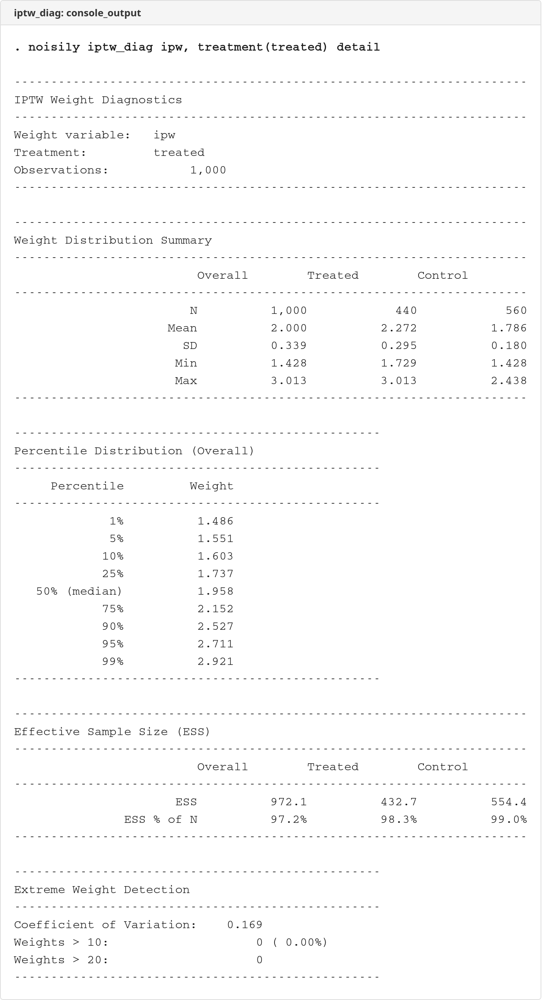
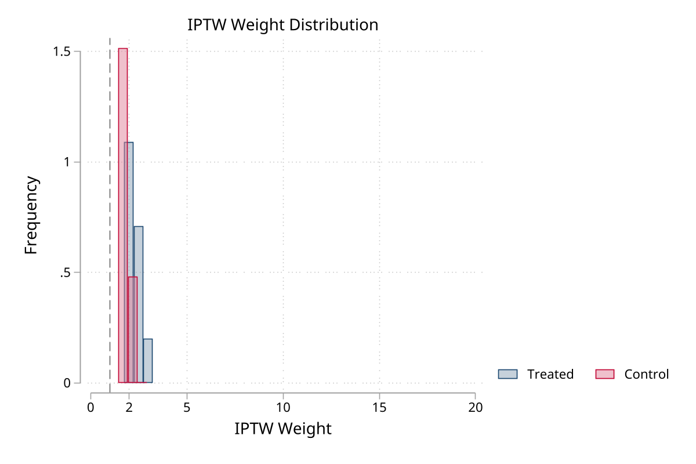

# iptw_diag

 

IPTW weight diagnostics - distribution summaries, effective sample size, extreme weight detection, and trimming/stabilization utilities.

## Description

`iptw_diag` provides comprehensive diagnostics for inverse probability of treatment weights (IPTW). It helps identify potential issues with propensity score weights and provides tools to address them.

Key features:
- Weight distribution summaries (mean, SD, min, max, percentiles)
- Effective sample size (ESS) calculation
- Extreme weight detection
- Weight trimming at specified percentiles
- Weight truncation at maximum values
- Stabilized weight calculation
- Distribution visualization

## Screenshots

### Console Output


### Weight Distribution


## Installation

```stata
net install iptw_diag, from("https://raw.githubusercontent.com/tpcopeland/Stata-Dev/main/iptw_diag")
```

## Syntax

```stata
iptw_diag wvar [if] [in], treatment(varname) [options]
```

## Options

| Option | Default | Description |
|--------|---------|-------------|
| **treatment(varname)** | *(required)* | Binary treatment indicator (0/1) |
| **trim(#)** | - | Trim weights at specified percentile (50-99.9) |
| **truncate(#)** | - | Truncate weights at maximum value |
| **stabilize** | off | Calculate stabilized weights |
| **generate(name)** | - | Name for modified weight variable |
| **replace** | off | Allow replacing existing variable |
| **detail** | off | Show detailed percentile distribution |
| **graph** | off | Display weight distribution histogram |
| **saving(filename)** | - | Save graph to file |

## Examples

### Basic diagnostics

```stata
* After deriving treatment (Prep 1A) and comorbidities (Prep 1E)
use _examples/cohort.dta, clear
merge 1:1 id using _examples/treatment.dta, nogen keep(match)
merge 1:1 id using _examples/comorbidities.dta, nogen keep(master match)
replace diabetes = 0 if missing(diabetes)

logit treated index_age female i.education diabetes hypertension
predict double ps, pr
label variable ps "Propensity score"
gen double ipw = cond(treated==1, 1/ps, 1/(1-ps))
label variable ipw "Inverse probability weight"

* Run diagnostics
iptw_diag ipw, treatment(treated)
```

### With detailed percentiles

```stata
iptw_diag ipw, treatment(treated) detail
```

### Trim at 99th percentile

```stata
iptw_diag ipw, treatment(treated) trim(99) generate(ipw_trim)
```

### Create stabilized weights

```stata
iptw_diag ipw, treatment(treated) stabilize generate(ipw_stab)
```

### With histogram

```stata
iptw_diag ipw, treatment(treated) graph saving(iptw_diag/demo/weights.png)
```

## Interpretation Guidelines

### Effective Sample Size (ESS)

| ESS as % of N | Interpretation |
|---------------|----------------|
| > 50% | Acceptable |
| 25-50% | Concerning |
| < 25% | Problematic |

### When to Modify Weights

Consider trimming or truncating when:
- Maximum weight > 10-20
- Coefficient of variation > 1
- ESS < 50% of N
- Few observations with extreme weights drive results

### Stabilized vs Unstabilized Weights

- **Unstabilized IPTW**: w = 1/P(T|X) for treated, 1/(1-P(T|X)) for controls
- **Stabilized IPTW**: w = P(T)/P(T|X) for treated, (1-P(T))/(1-P(T|X)) for controls

Stabilized weights typically have mean 1 and smaller variance, often providing more stable estimates.

## Stored Results

`iptw_diag` stores the following in `r()`:

**Scalars:**

| Result | Description |
|--------|-------------|
| `r(N)` | Total number of observations |
| `r(N_treated)` | Number in treatment group |
| `r(N_control)` | Number in control group |
| `r(mean_wt)` | Mean weight |
| `r(sd_wt)` | Standard deviation of weights |
| `r(min_wt)` | Minimum weight |
| `r(max_wt)` | Maximum weight |
| `r(cv)` | Coefficient of variation |
| `r(ess)` | Effective sample size (overall) |
| `r(ess_pct)` | ESS as percentage of N |
| `r(ess_treated)` | ESS for treated group |
| `r(ess_control)` | ESS for control group |
| `r(n_extreme)` | Number of extreme weights (>10) |
| `r(pct_extreme)` | Percentage of extreme weights |
| `r(p1)` | 1st percentile of weights |
| `r(p5)` | 5th percentile of weights |
| `r(p95)` | 95th percentile of weights |
| `r(p99)` | 99th percentile of weights |

**When `generate()` is used:**

| Result | Description |
|--------|-------------|
| `r(new_mean)` | Mean of modified weights |
| `r(new_sd)` | SD of modified weights |
| `r(new_max)` | Maximum of modified weights |
| `r(new_ess)` | ESS of modified weights |
| `r(new_ess_pct)` | ESS percentage of modified weights |

**Macros:**

| Result | Description |
|--------|-------------|
| `r(wvar)` | Weight variable name |
| `r(treatment)` | Treatment variable name |
| `r(generate)` | Name of generated variable (if applicable) |

## Requirements

- Stata 16.0 or higher

## Version

- **Version 1.0.2** (26 February 2026): Added `scheme()` and `graphoptions()` for graph customization
- **Version 1.0.1** (25 February 2026): Validation and option conflict fixes
- **Version 1.0.0** (21 December 2025): Initial release

## Author

Timothy P Copeland<br>
Department of Clinical Neuroscience<br>
Karolinska Institutet

## License

MIT License

## See Also

- `help balancetab` - Propensity score balance diagnostics
- `help effecttab` - Format treatment effects tables
- `help teffects ipw` - IPTW estimation
