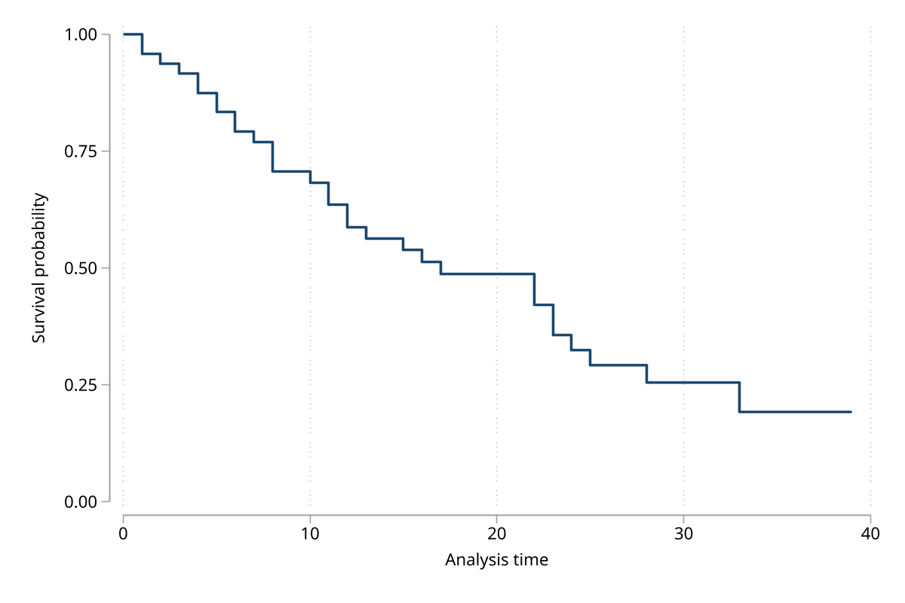
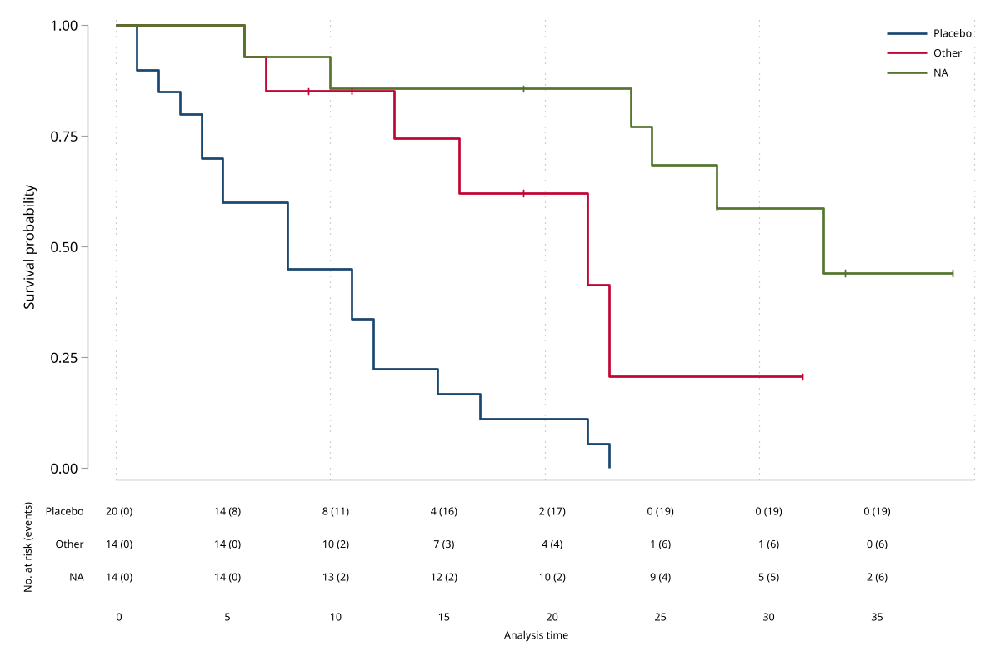
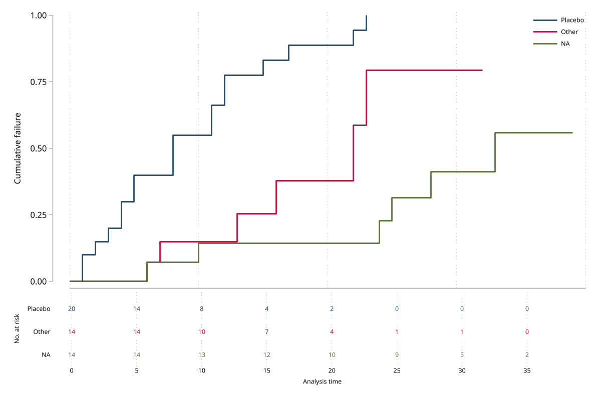

# kmplot - Publication-ready Kaplan-Meier and cumulative-incidence graphs

**Version 1.0.1** | 2026-04-10

`kmplot` turns an `stset` dataset into publication-ready survival graphics with sensible defaults for confidence intervals, number-at-risk tables, median survival lines, censoring marks, and log-rank p-values. It keeps the flexibility of native Stata graphics while removing most of the repetitive styling work that usually follows `sts graph`.

## Requirements

- Stata 16 or later
- Data must already be `stset`

## Installation

```stata
capture ado uninstall kmplot
net install kmplot, from("https://raw.githubusercontent.com/tpcopeland/Stata-Tools/main/kmplot") replace
```

## Commands

| Command | Description |
|---------|-------------|
| `kmplot` | Kaplan-Meier or cumulative-incidence graph with optional confidence intervals, risk table, median lines, censoring marks, p-value, and direct export |

## Quick Start

The basic workflow is always the same: `stset` the data, draw the curve, then add the options you need for grouping, uncertainty, and publication styling.

```stata
sysuse cancer, clear
stset studytime, failure(died)

* Single overall Kaplan-Meier curve
kmplot

* Stratified publication plot
kmplot, by(drug) ci risktable median medianannotate pvalue censor
```

## How It Works

- `kmplot` reads the current `stset` definition. There is no separate model-fitting step.
- Add `by()` when you want one curve per group and a log-rank p-value.
- Add `failure` when you want cumulative incidence, that is `1 - S(t)`, instead of survival.
- Add `ci`, `risktable`, `median`, `censor`, and `pvalue` to build up a publication figure from the same underlying data.
- Use `export()` when you want the graph written directly to PDF, PNG, EPS, or SVG.

## Worked Examples

### 1. Kaplan-Meier curves by treatment group

This is the standard grouped survival plot. `drug` is the treatment indicator in Stata's built-in `cancer` example data, so the command is runnable immediately after installation.

```stata
sysuse cancer, clear
stset studytime, failure(died)
kmplot, by(drug)
```

### 2. Full publication-style figure

This adds the features that usually matter in a manuscript figure: confidence bands, a number-at-risk table, median survival lines, censoring marks, and the log-rank p-value.

```stata
sysuse cancer, clear
stset studytime, failure(died)
kmplot, by(drug) ci risktable median medianannotate pvalue censor
```

### 3. Cumulative incidence instead of survival

Use `failure` when you want the y-axis to show cumulative incidence rather than the Kaplan-Meier survival function.

```stata
sysuse cancer, clear
stset studytime, failure(died)
kmplot, by(drug) failure risktable
```

### 4. Export a finished figure directly from Stata

`export()` passes its file target and suboptions through to `graph export`, so the same command that draws the graph can also save it.

```stata
sysuse cancer, clear
stset studytime, failure(died)
kmplot, by(drug) ci median export(km_figure.pdf, replace)
```

### 5. Override styling while keeping the default workflow

`kmplot` respects the active Stata graph scheme by default, but you can still override colors, line patterns, titles, and other graph options when needed.

```stata
sysuse cancer, clear
stset studytime, failure(died)
kmplot, by(drug) ci ///
    colors(navy cranberry) ///
    lpattern(solid dash) ///
    title("Kaplan-Meier Curves by Treatment")
```

## Key Features

- Shaded confidence bands or dashed CI lines via `cistyle(band)` and `cistyle(line)`
- Risk tables aligned below the graph, with optional cumulative event counts
- Median survival reference lines and note annotations
- Censoring marks with thinning via `censorthin()`
- Log-rank p-value placement via `pvaluepos()`
- Direct graph export through `export()`
- Pass-through support for standard `twoway` graph options such as `xsize()` and `ysize()`

## Preview

Representative outputs from `demo/demo_kmplot.do`:







## Version History

- **1.0.1** (2026-04-10): Initial Stata-Tools release with Kaplan-Meier, cumulative-incidence, risk-table, censoring, median-line, and export support.

## Author

Timothy P Copeland, Karolinska Institutet
