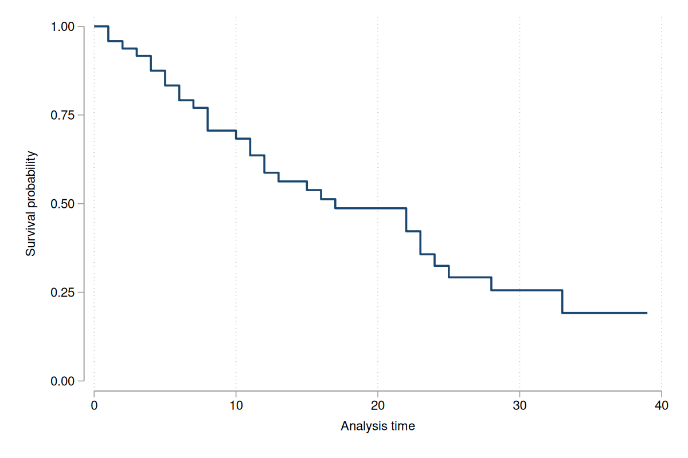
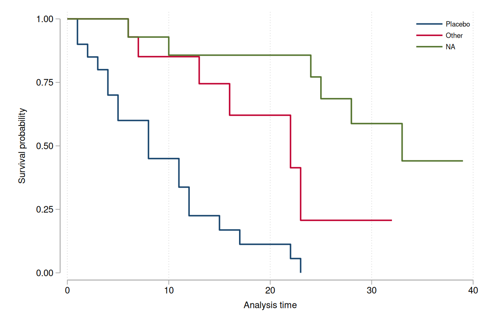
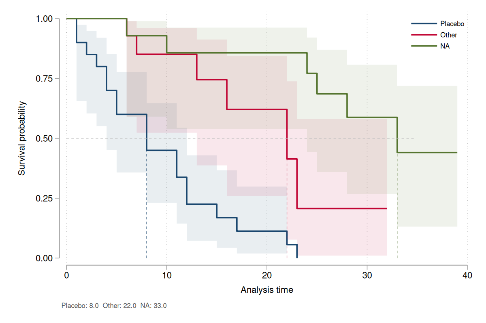
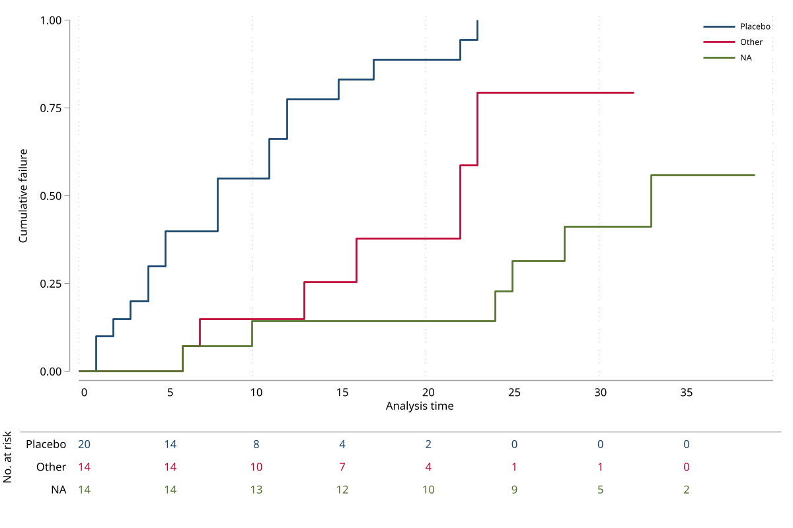
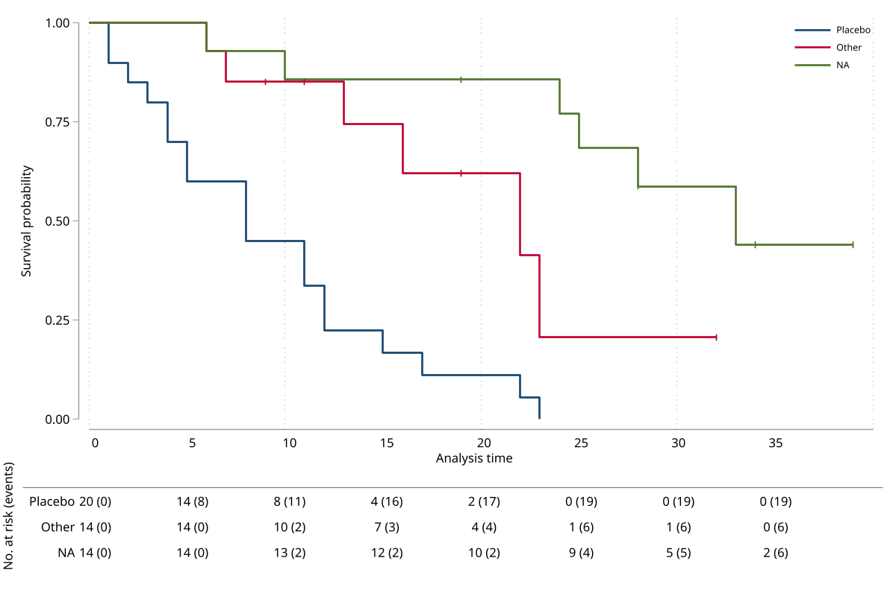
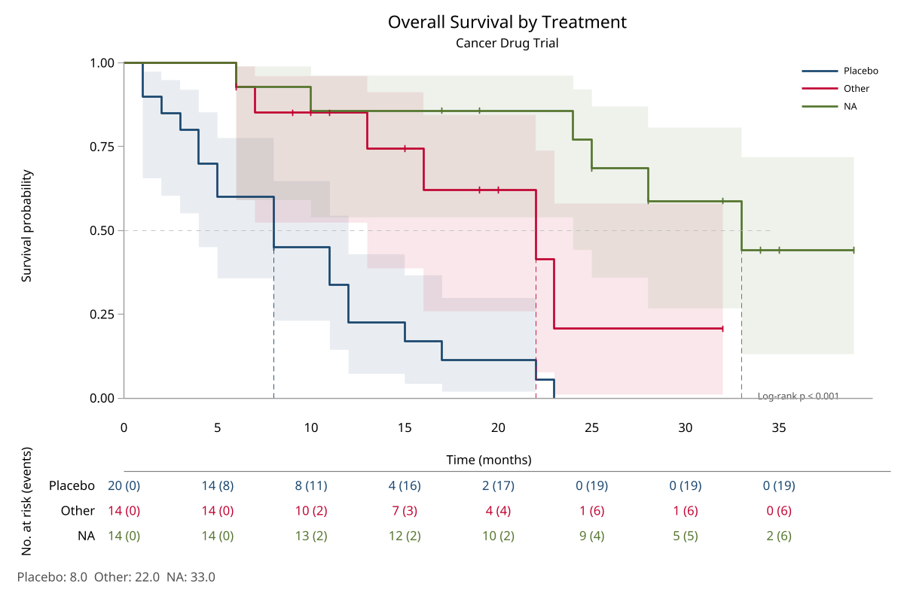
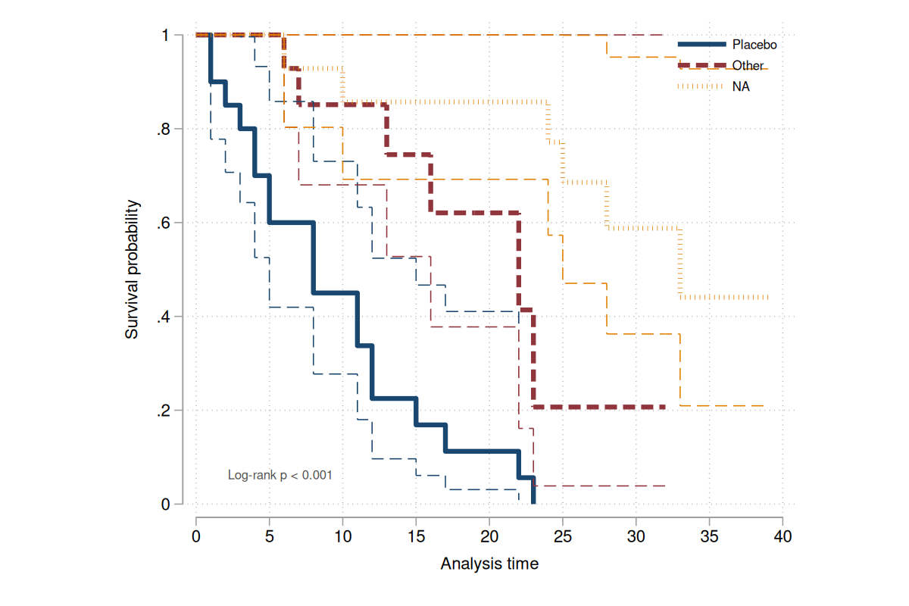
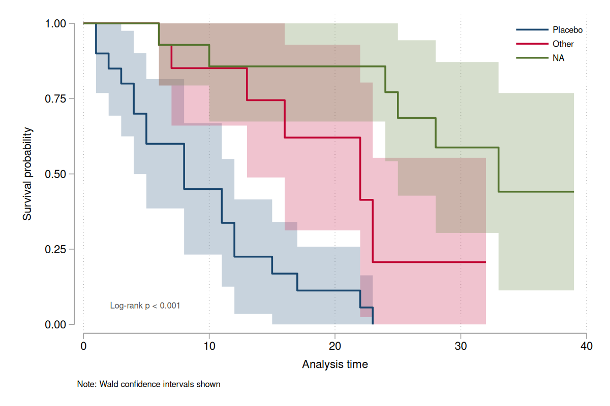
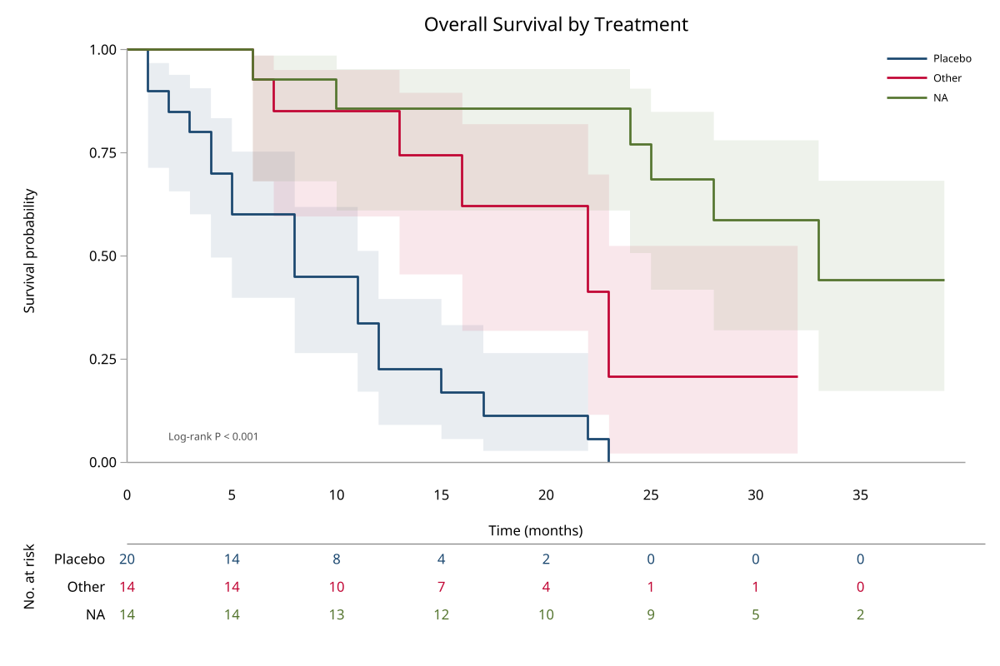

# kmplot — Publication-ready Kaplan-Meier survival and cumulative failure plots

**Version 1.2.8** | 2026-08-21

`kmplot` creates publication-ready Kaplan-Meier survival or cumulative failure plots for Stata users who need confidence intervals, risk tables, fixed-time estimates, and reusable graph data in one workflow. It uses the current `stset` definition, returns optional risk-table and landmark summaries plus plot metadata in `r()`, and can save curve data with `saving()`.

## Quick Start

Use the built-in cancer data to draw stratified survival curves with 95% confidence bands and a number-at-risk table:

```stata
sysuse cancer, clear
stset studytime, failure(died)
kmplot, by(drug) ci risktable
```

## Requirements

- Stata 16 or later
- Data declared with `stset`
- No external packages

## Installation

```stata
capture ado uninstall kmplot
net install kmplot, from("https://raw.githubusercontent.com/tpcopeland/Stata-Tools/main/kmplot") replace
```

## Commands

| Command | Description |
|---------|-------------|
| `kmplot` | Draw Kaplan-Meier survival or cumulative failure curves with publication-oriented defaults |

## How It Works

`kmplot` reads the current `stset` definition and plots a step-function Kaplan-Meier estimate for the analysis sample; no separate model-fitting command is required.

- The default graph is survival, `S(t)`. Add `failure` to plot cumulative failure, `1 - S(t)`.
- Add `by(varname)` for one curve per group; numeric and string grouping variables are supported, and value labels are used when available.
- Add `ci` for confidence intervals. The default is a shaded log-log interval; `cistyle(line)` draws dashed interval lines, and `citransform(log)` or `citransform(plain)` changes the transformation.
- Add `risktable` for a number-at-risk table, `landmark()` for fixed-time estimates, `median` for median reference lines, and `censor` for censoring marks. Risk tables place the time axis above a separating rule, use larger default text, count subjects in multiple-record data, and honor active `stset` weights.
- Add `pvalue` with `by()` when at least two groups are present to display the Stata log-rank p-value; invalid p-value requests exit with return code 198.
- `saving()` and `risksaving()` write reusable curve and risk-table datasets, while `export()` writes the graph through Stata's `graph export`.
- Standard `twoway` graph options are passed through after the named `kmplot` options.

## Choosing a Workflow

| Goal | Starting point |
|------|----------------|
| One overall survival curve | `kmplot` |
| Curves by treatment or another group | `kmplot, by(group)` |
| Manuscript-style comparison | `kmplot, by(group) ci risktable median pvalue censor` |
| Cumulative failure display | Add `failure` to the stratified workflow |
| Fixed-time reporting or reproducible data export | Add `landmark()`, `saving()`, or `risksaving()` |

## Worked Examples

### 1. Basic Kaplan-Meier curve

The default is a single survival curve with step-function rendering.

```stata
sysuse cancer, clear
stset studytime, failure(died)
kmplot
```

### 2. Stratified publication-style figure

This combines confidence bands, a risk table, median reference lines, censoring marks, and a log-rank p-value for the treatment groups.

```stata
sysuse cancer, clear
stset studytime, failure(died)
kmplot, by(drug) ci risktable median medianannotate pvalue censor
```

### 3. Cumulative failure with selected risk-table times

Use `failure` for `1 - S(t)` and specify the risk-table columns explicitly with `timepoints()`.

```stata
sysuse cancer, clear
stset studytime, failure(died)
kmplot, by(drug) failure risktable timepoints(0 5 10 15 20 25 30 35)
```

### 4. Fixed-time estimates and saved datasets

`landmark()` returns estimates at the requested analysis times; the two saving options create datasets that can be reused in a table or downstream figure.

```stata
sysuse cancer, clear
stset studytime, failure(died)
kmplot, by(drug) ci risktable landmark(12 24) saving(km_curve.dta, replace) risksaving(km_risk.dta, replace)
matrix list r(landmarks)
matrix list r(risktable)
```

### 5. Custom confidence intervals, styling, and export

The graph can use line confidence intervals, a different transform, custom colors and patterns, a repositioned p-value, and a directly exported PDF.

```stata
sysuse cancer, clear
stset studytime, failure(died)
kmplot, by(drug) ci cistyle(line) citransform(log) colors(navy maroon dkorange) lpattern(solid dash dot) pvalue pvaluepos(bottomleft) export(km_figure.pdf, replace)
```

## Gallery

Run `demo/demo_kmplot.do` from a package checkout to regenerate the PNGs below from `sysuse cancer`. The images are repository documentation assets and are not part of the `net install` payload.

| Output | Command focus |
|--------|---------------|
|  | Basic `kmplot` workflow |
|  | `by()` |
|  | `ci`, `median`, and `medianannotate` |
|  | `failure`, `risktable`, and `timepoints()` |
|  | `riskevents`, `riskmono`, and `censor` |
|  | Combined manuscript workflow |
|  | `cistyle(line)`, `colors()`, `lpattern()`, and `pvaluepos()` |
|  | `citransform(plain)`, `ciopacity()`, and `note()` |
|  | `level(90)`, `pvaluetext()`, and `pvalueformat()` |

## Options

| Option | Default | Effect |
|--------|---------|--------|
| `by(varname)` | none | Stratify curves by a numeric or string variable |
| `failure` | survival | Plot cumulative failure, `1 - S(t)`, instead of survival |
| `ci` | off | Draw confidence intervals |
| `level(#)` | 95 | Set the confidence level for `ci`; values must be between 0 and 100, exclusive |
| `cistyle(string)` | `band` | Use shaded bands or dashed `line` intervals; requires `ci` |
| `ciopacity(#)` | 12 | Set shaded-band opacity from 0 to 100; requires `ci` with band intervals |
| `citransform(string)` | `loglog` | Use `loglog`, `log`, or `plain` confidence intervals; requires `ci` |
| `median` | off | Draw median reference lines for groups whose median is reached |
| `medianannotate` | off | Add median values to the graph note; requires `median` |
| `risktable` | off | Add a separated number-at-risk table below the graph, with the time axis above it |
| `riskevents` | off | Add cumulative events as `N (events)` in the risk table; requires `risktable` |
| `riskcompact` | off | Synonym for `riskevents`; requires `risktable` |
| `riskmono` | off | Display risk-table numbers in black instead of line colors; requires `risktable` |
| `riskheight(#)` | auto | Set risk-table height; requires `risktable` or `risksaving()`; supplied values must be greater than 0 and no more than 80 |
| `timepoints(numlist)` | auto | Set risk-table timepoints; requires `risktable` or `risksaving()` |
| `landmark(numlist)` | none | Return survival or cumulative-failure estimates at fixed analysis times |
| `censor` | off | Show censoring marks on the curves |
| `censorthin(#)` | 1 | Show every Nth censor mark; requires `censor` and a value of at least 1 |
| `pvalue` | off | Display the log-rank p-value; requires `by()` |
| `pvaluepos(string)` | `bottomright` | Place the p-value at `bottomright`, `topright`, `topleft`, or `bottomleft` |
| `pvalueformat(string)` | `%5.3f` | Set the numeric display format for the p-value |
| `pvaluetext(string)` | `Log-rank p` | Set the text printed before the p-value |
| `pvalueat(y x)` | none | Place the p-value at explicit graph coordinates; may not be combined with `pvaluepos()` |
| `colors(colorlist)` | colorblind-safe palette | Set curve colors |
| `lwidth(string)` | `medthick` | Set curve line width |
| `lpattern(patternlist)` | `solid` | Set curve line patterns |
| `title(string)` | none | Set the graph title |
| `subtitle(string)` | none | Set the graph subtitle |
| `xtitle(string)` | `Analysis time` | Set the x-axis title |
| `ytitle(string)` | mode-dependent | Set the y-axis title; the default is `Survival probability` or `Cumulative failure` |
| `xlabel(string)` | automatic | Set x-axis labels; numeric positions also set risk-table columns when `timepoints()` is omitted |
| `ylabel(string)` | `0(0.25)1` | Set y-axis labels |
| `legend(string)` | automatic | Supply a custom legend specification |
| `note(string)` | none | Add a graph note; if `medianannotate` is also requested, the user note replaces the automatic median annotation |
| `scheme(string)` | current Stata scheme | Set the graph scheme |
| `name(string)` | `kmplot` | Set the graph name |
| `aspectratio(string)` | none | Set the graph aspect ratio |
| `export(string)` | none | Export to a file; the format is inferred from `.pdf`, `.png`, `.eps`, or `.svg`, and graph-export suboptions are passed through |
| `saving(filename[, replace])` | none | Save curve data with `group`, `group_label`, `time`, `estimate`, `se`, `lower`, `upper`, `censor`, and `anchor` variables |
| `risksaving(filename[, replace])` | none | Save risk-table data with `group`, `group_label`, `time`, `at_risk`, `events`, and cumulative censoring exits in `censored` |

`kmplot` also accepts standard `twoway` graph options through its trailing pass-through syntax.

## Stored Results

`kmplot` is an `rclass` command and stores the following results after it computes a plot. If a requested graph or dataset write fails after plotting, analytical results remain available even though the command returns an error; `r(export)` records an attempted export path, while `r(saving)` and `r(risksaving)` are stored only after successful dataset saves.

### Scalars

| Result | Meaning |
|--------|---------|
| `r(N)` | Number of observations in the analysis sample |
| `r(n_groups)` | Number of plotted groups |
| `r(level)` | Confidence level used |
| `r(failure)` | 1 if `failure` was requested, otherwise 0 |
| `r(ci)` | 1 if `ci` was requested, otherwise 0 |
| `r(n_landmarks)` | Number of requested landmark timepoints |
| `r(n_timepoints)` | Number of risk-table timepoints, or 0 when neither `risktable` nor `risksaving()` was used |
| `r(riskheight)` | Risk-table height when `risktable` or `risksaving()` computed risk data |
| `r(p)` | Log-rank p-value when `pvalue` was used with `by()` and at least two groups were present |
| `r(pvalue_y)` | Explicit p-value y coordinate when `pvalueat()` was used with `pvalue` |
| `r(pvalue_x)` | Explicit p-value x coordinate when `pvalueat()` was used with `pvalue` |
| `r(median_)` | Group-specific median result family; actual returned names are `r(median_1)`, `r(median_2)`, and so on, for groups whose median is reached |

### Macros

| Result | Meaning |
|--------|---------|
| `r(cmd)` | `kmplot` |
| `r(graph_name)` | Graph name |
| `r(plot_type)` | `survival` or `failure` |
| `r(scheme)` | Graph scheme used |
| `r(by)` | Grouping-variable name when `by()` was specified |
| `r(cistyle)` | CI style used |
| `r(citransform)` | CI transformation used |
| `r(colors)` | Color list used |
| `r(lpattern)` | Line-pattern list supplied |
| `r(timepoints)` | Risk-table timepoints used |
| `r(landmark_times)` | Landmark timepoints requested |
| `r(group_labels)` | Group labels joined by a vertical bar |
| `r(xtitle)` | X-axis title |
| `r(ytitle)` | Y-axis title |
| `r(export)` | Requested export path when `export()` was specified, including after a failed file write |
| `r(saving)` | Curve dataset path when `saving()` succeeded |
| `r(risksaving)` | Risk-table dataset path when `risksaving()` succeeded |
| `r(pvalue_text)` | Displayed p-value text when the log-rank p-value was computed |
| `r(pvalue_label)` | P-value label text when the log-rank p-value was computed |
| `r(pvalue_format)` | P-value numeric format when the log-rank p-value was computed |
| `r(pvalue_pos)` | P-value position keyword when the log-rank p-value was computed |
| `r(pvalue_at)` | Explicit p-value coordinates when supplied; otherwise empty when the log-rank p-value was computed |

### Matrices

| Result | Columns |
|--------|---------|
| `r(medians)` | Group and median for each group when `median` was requested |
| `r(landmarks)` | Group, time, estimate, lower, and upper when `landmark()` was requested; bounds are populated when `ci` is requested |
| `r(risktable)` | Group, time, at-risk, events, and censored when `risktable` or `risksaving()` was used |

## Assumptions and Limits

- Run `stset` before `kmplot`; the command uses the current survival-time definition and analysis sample.
- `failure` is the complement of the Kaplan-Meier survival estimate, `1 - S(t)`. It is not a competing-risk cumulative incidence function, and `kmplot` does not implement Aalen-Johansen or Fine-Gray estimators.
- Confidence intervals use Greenwood standard errors with the selected `level()` and `citransform()`; `loglog` is the default, with `log` and `plain` alternatives.
- `pvalue` uses Stata's log-rank test and requires `by()` with at least two groups in the analysis sample.
- If a group's survival curve does not reach 0.5, `median` draws no line for that group and its median entry is missing in `r(medians)`.
- Risk-table counts honor delayed entry, active `stset` weights, and subject identifiers. In multiple-record data, each subject is counted once at a timepoint; contiguous records within the same group are not marked as censoring, while departures from a group and terminal censored records are counted in `censored`.
- `saving()` and `risksaving()` support the `replace` suboption only; `export()` passes graph-export suboptions to Stata.

## References

- Kaplan EL, Meier P. “Nonparametric Estimation from Incomplete Observations.” *Journal of the American Statistical Association* 53(282), 457–481 (1958). [doi:10.1080/01621459.1958.10501452](https://doi.org/10.1080/01621459.1958.10501452)
- StataCorp. [Survival Analysis Reference Manual](https://www.stata.com/manuals/st.pdf), including `stset`, `sts generate`, and `sts test`.

## QA

QA suites and how to run them are documented in [`qa/README.md`](qa/README.md).

## Version History

- **1.2.8** (2026-08-21): Corrected risk-table endpoint alignment under Stata's `stcolor` scheme while retaining the legacy-scheme layout.
- **1.2.7** (2026-08-21): Aligned risk-table time labels and counts with the main plot's x-axis positions, enlarged row labels, and moved the risk-table title outward.
- **1.2.6** (2026-08-11): Placed the x-axis title directly below its values, added a solid separator above the risk table, and enlarged default risk-table text.
- **1.2.5** (2026-08-11): Isolated internal graph names and failure cleanup, fixed custom-color recycling and risk-table median annotations, supported dotted export paths, and made landmark lookup exact for continuous event times and large samples.
- **1.2.4** (2026-08-11): Corrected subject-level, weighted, delayed-entry, and group-transition risk-table counts; excluded contiguous same-group records from censoring; and rejected ineffective dependent-option combinations.
- **1.2.3** (2026-08-05): Corrected p-value requirements and stored-result conditions, documented `note()` precedence with `medianannotate`, and aligned help abbreviations with the parser.
- **1.2.2** (2026-08-05): Corrected the documented export-return contract, completed prose for graph appearance, label, and output options, and repaired Viewer-width overflow in the help synopsis and stored-results table.
- **1.2.1** (2026-07-10): Added stepped confidence bands, automatic risk-table height, `saving()` without `ci`, and a p-value/CI-level demo panel; removed risk-table gridlines and improved combined-figure spacing.
- **1.2.0** (2026-06-26): Added `level()`, `riskheight()`, `landmark()`, `saving()`, `risksaving()`, p-value display controls, richer `r()` metadata and matrices, delayed-entry risk-table support, cumulative-failure terminology, and method notes.
- **1.0.3** (2026-06-25): Replaced internal graph-working variables with `tempvar`s, restored preserved data on error paths, guarded `export()` paths, and preserved analytical returns across export failures.
- **1.0.2** (2026-04-22): Refactored the varabbrev wrapper to cover syntax, validation, and main logic; fixed literal-quote rendering in user-supplied title options; and guarded export success messages with file confirmation.
- **1.0.1** (2026-04-10): Initial Stata-Tools release with Kaplan-Meier, cumulative-failure, risk-table, censoring, median-line, and export support.

## Author

Timothy P Copeland, Karolinska Institutet

## License

MIT License
