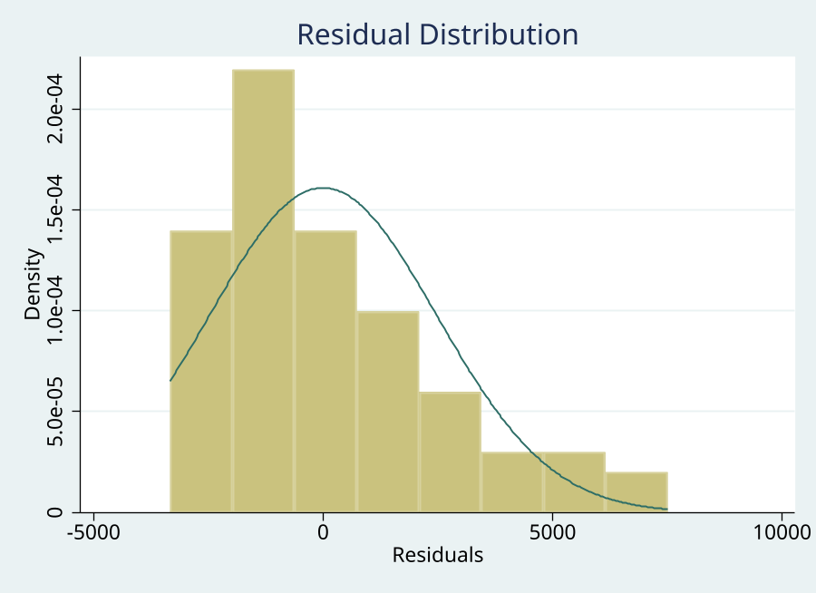
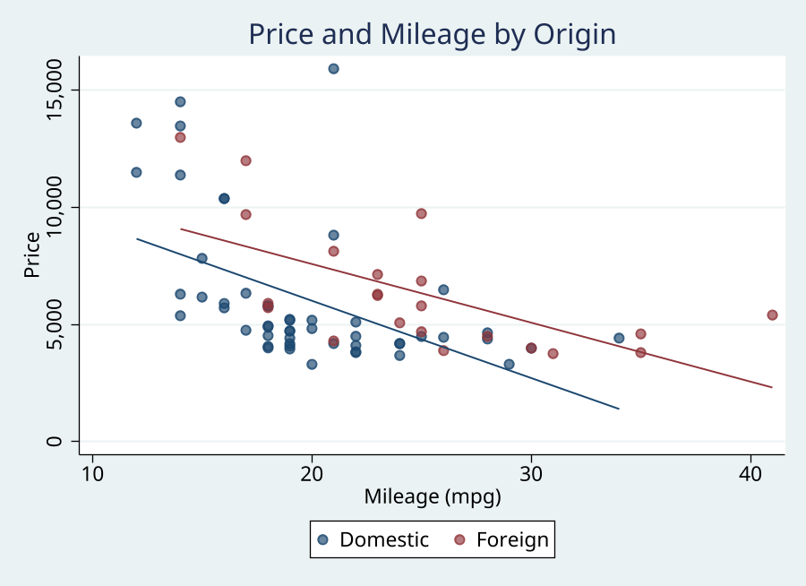

# logdoc

   

Convert Stata SMCL/log files to faithful HTML, Markdown, Word, LaTeX, Quarto, or PDF documents.

## Description

`logdoc` transforms Stata `.smcl`, `.log`, or `.do` files into styled, shareable documents. HTML output is faithful by default: Stata's monospace alignment, SMCL result/input/error coloring, table spacing, and horizontal rules are preserved rather than reinterpreted. The result is fully self-contained -- CSS is inlined, graphs are base64-encoded, and the HTML can be emailed, uploaded, or printed to PDF directly from a browser.

Semantic enhancements are now opt-in. Syntax highlighting, parsed HTML tables, collapsible output, copy buttons, and Download .do controls are available when requested, but the default renderer stays close to what Stata showed in the Results window.

## Features

- **Faithful default HTML** with monospace Stata output, exact table alignment, and Stata-style input/result/error coloring
- **Seven output formats**: HTML, Markdown, Quarto Markdown (.qmd), Word (.docx), LaTeX (.tex), PDF, or dual HTML+MD
- **Opt-in syntax highlighting** with `highlight`
- **Opt-in HTML table parsing** with `tables`; default output keeps all Stata tables monospace
- **Opt-in collapsible sections** with `fold`
- **Opt-in copy/download controls** with `copy` and `download`
- **Base64-embedded graphs** -- fully standalone HTML, no external image files
- **Light and dark themes** -- faithful Stata-style light and dark rendering
- **Live session mode** -- `logdoc start` / `logdoc stop` wraps your interactive session
- **Notebook mode** -- Jupyter-style cell layout with In/Out labels
- **Table of contents** -- auto-generated from `* # Section` comment markers
- **Keep/drop filtering** -- show only specific commands in the output
- **Batch conversion** -- convert all logs in a directory with one command
- **Diff view** -- compare two log files side by side
- **Email-safe HTML** -- inline CSS for email client compatibility
- **Annotations** -- embed notes alongside commands
- **Stamp** -- add Stata version, date, and data filename to the header
- **Line numbers** -- numbered command blocks for reference
- **Legacy mode** -- `legacy` enables the pre-1.4 HTML enhancement defaults
- **Project config** -- `.logdocrc` file for per-project defaults
- **Print-optimized CSS** -- clean output for paper/PDF
- **Dialog box** -- GUI interface via `db logdoc`

## Installation

```stata
capture ado uninstall logdoc
net install logdoc, from("https://raw.githubusercontent.com/tpcopeland/Stata-Tools/main/logdoc/") replace
```

## Setup

logdoc requires Python 3.6+ (standard library only -- no pip packages). After installing, run the setup diagnostic:

```stata
logdoc_py
```

If it reports "logdoc Python check passed", you are ready. If Python is not found:

1. **Configure Stata's Python** (recommended -- one-time, persistent):
   ```stata
   set python_exec "/path/to/python3", permanently
   logdoc_py
   ```

2. **Or set Python for the current session only:**
   ```stata
   logdoc_py, python("/usr/local/bin/python3") set
   ```

3. **Or save a per-project Python path** to `.logdocrc`:
   ```stata
   logdoc_py, python("/usr/local/bin/python3") save
   ```

Run `logdoc_py, verbose` to see every candidate that was tried and why each was accepted or rejected.

**Optional: PDF output** — the recommended method is `xhtml2pdf`, a pure Python library:

```stata
logdoc_py, install(xhtml2pdf)
```

Alternatively, `wkhtmltopdf` works as a system executable:

```bash
# Ubuntu / Debian
sudo apt install wkhtmltopdf

# macOS (Homebrew)
brew install wkhtmltopdf

# RHEL / Fedora
sudo dnf install wkhtmltopdf

# Windows (Chocolatey)
choco install wkhtmltopdf
```

logdoc tries xhtml2pdf first, then falls back to wkhtmltopdf. Verify either is available:

```stata
logdoc_py, check pdf
```

## Requirements

- Stata 16.0+
- Python 3.6+ (standard library only -- no pip packages needed)
- `format(docx)` requires Stata 17+
- `format(pdf)` requires xhtml2pdf (`logdoc_py, install(xhtml2pdf)`) or wkhtmltopdf

## Syntax

```stata
logdoc using filename, output(filename) [options]

logdoc start, output(filename) [options]
logdoc stop

logdoc diff using file1, compare(file2) output(filename) [replace]
logdoc batch, input(pattern) outdir(path) [options]
logdoc replay [, theme() format() open]
```

### Options

| Option | Description |
|--------|-------------|
| `output(filename)` | Output file path (**required**) |
| `format(html\|md\|qmd\|both\|docx\|tex\|pdf)` | Output format; default `html` (auto-detected from extension) |
| `theme(light\|dark)` | CSS theme; default `light` |
| `css(filename)` | Custom CSS file (overrides theme) |
| `title(string)` | Document title; defaults to input filename |
| `date(string)` | Date subtitle shown below the title |
| `footer(string)` | Custom footer text |
| `generated` | Add "Generated YYYY-MM-DD HH:MM" timestamp footer |
| `stamp` | Add Stata version, date/time, and data filename to header |
| `run` | Execute a `.do` file first, then convert (auto-sets `replace`) |
| `stataexe(string)` | Override the batch Stata executable used by `run` (default: auto-detected from flavor/OS) |
| `preformatted` | Compatibility option; HTML tables are monospace by default |
| `nofold` | Compatibility option; folding is off by default |
| `nodots` | Strip dot prompts for script-style display |
| `fold` | Collapse long output blocks into expandable sections |
| `highlight` | Add conservative Stata syntax highlighting to command blocks |
| `tables` | Parse supported Stata tables into HTML tables |
| `copy` | Add copy-to-clipboard buttons to command blocks |
| `download` | Add a Download .do toolbar button |
| `legacy` | Enable the pre-1.4 HTML enhancement defaults |
| `linenumbers` | Show line numbers in command blocks |
| `toc` | Generate table of contents from `* # Section` markers |
| `notebook` | Jupyter-style cell layout with In/Out labels |
| `email` | Email-safe HTML with inline CSS |
| `nograph` | Skip graph detection and embedding |
| `graphwidth(#)` | Set graph display width in pixels |
| `graphheight(#)` | Set graph display height in pixels |
| `keep(pattern)` | Only include matching commands |
| `drop(pattern)` | Exclude matching commands |
| `open` | Open output in default browser after generation |
| `append` | Append to existing HTML, Markdown, LaTeX, or `both` output; not supported for `docx`/`pdf` |
| `annotate(filename)` | Annotation file with notes to embed |
| `python(string)` | Explicit path to Python 3 executable; defaults to Stata's configured Python |
| `quiet` | Suppress status messages |
| `verbose` | Show detailed processing information |
| `replace` | Overwrite existing output file |

### Input formats

| Extension | Behavior |
|-----------|----------|
| `.smcl` | Faithful SMCL rendering with Stata input/result/error colors |
| `.log` | Plain text log file conversion |
| `.do` | Requires `run` option; executes in batch mode, then converts |

The `run` option launches a batch Stata child session using the executable that
matches your flavor and OS (`stata-mp`/`stata-se`/`stata` on Unix/macOS,
`StataMP-64`/`StataSE-64`/`Stata-64` on Windows); the binary must be on your
`PATH`. Override it with `stataexe()` when your install uses a nonstandard name
or location, e.g. `stataexe(/opt/stata18/stata-mp)`.

### Output formats

| Format | Description |
|--------|-------------|
| `html` | Self-contained HTML with inlined CSS and base64 graphs |
| `md` | Markdown with YAML front matter |
| `qmd` | Quarto-flavored Markdown with YAML front matter |
| `both` | HTML + Markdown from one command |
| `docx` | Word document via `html2docx` (Stata 17+) |
| `tex` | LaTeX with listings and booktabs |
| `pdf` | PDF via wkhtmltopdf |

## Examples

```stata
* Basic: SMCL log to HTML
logdoc using "analysis.smcl", output("analysis.html") replace

* Auto-detected Markdown (from .md extension)
logdoc using "results.smcl", output("results.md") replace

* Dark theme with title and date
logdoc using "output.smcl", output("output.html") theme(dark) ///
    title("Survival Analysis") date("March 2026") replace

* Word document
logdoc using "results.smcl", output("results.docx") replace

* LaTeX
logdoc using "results.smcl", output("results.tex") replace

* Quarto Markdown
logdoc using "results.smcl", output("results.qmd") replace

* Opt-in parsed/enhanced HTML
logdoc using "analysis.smcl", output("enhanced.html") ///
    highlight tables fold copy download replace

* Notebook mode with TOC and line numbers
logdoc using "analysis.smcl", output("notebook.html") ///
    notebook linenumbers toc replace

* Filter to show only regressions
logdoc using "results.smcl", output("regressions.html") ///
    keep("regress") replace

* Live session
logdoc start, output("session.html") theme(dark) open
sysuse auto, clear
regress price mpg weight
logdoc stop

* Batch convert all SMCL files
logdoc batch, input("*.smcl") outdir("reports/") replace

* Compare two logs
logdoc diff using "old.smcl", compare("new.smcl") ///
    output("diff.html") replace

* Replay with different theme
logdoc replay, theme(light)
```

## Demo

### Live session

```stata
. logdoc start, output("session.html") title("Live Session Example") notebook replace

logdoc session started
Output will be saved to: session.html
Use logdoc stop to end and convert

. sysuse auto, clear
(1978 automobile data)

. summarize price mpg

    Variable │        Obs        Mean    Std. dev.       Min        Max
─────────────┼─────────────────────────────────────────────────────────
       price │         74    6165.257    2949.496       3291      15906
         mpg │         74     21.2973    5.785503         12         41

. regress price mpg weight

      Source │       SS           df       MS      Number of obs   =        74
─────────────┼──────────────────────────────────   F(2, 71)        =     14.74
       Model │   186321280         2  93160639.9   Prob > F        =    0.0000
    Residual │   448744116        71  6320339.67   R-squared       =    0.2934
─────────────┼──────────────────────────────────   Adj R-squared   =    0.2735
       Total │   635065396        73  8699525.97   Root MSE        =      2514

─────────────┬──────────────────────────────────────────────────────────────────────
        price │ Coefficient   Std. err.       t    P>|t|      [95% conf. interval]
─────────────┼──────────────────────────────────────────────────────────────────────
         mpg │   -49.51222    86.15604     -0.57    0.567     -221.3025      122.278
      weight │    1.746559    .6413538      2.72    0.008       .467736     3.025382
       _cons │    1946.069     3597.05      0.54    0.590     -5226.245     9118.382
─────────────┴──────────────────────────────────────────────────────────────────────

. logdoc stop

Generating document...
Output: session.html
```

### Embedded graphs

logdoc detects `graph export` commands in the log and embeds the images as base64 directly in the HTML — no external files needed.





### Option showcase

<details>
<summary>Key options demonstrated in the demo (click to expand)</summary>

```stata
* Basic HTML with title, date, footer, and Stata version stamp
logdoc using "analysis.smcl", output("report.html") ///
    title("Auto Dataset Analysis") date("28 April 2026") ///
    footer("Generated from demo_logdoc.do") stamp replace

* Dark theme with custom graph dimensions
logdoc using "analysis.smcl", output("dark.html") ///
    theme(dark) graphwidth(520) graphheight(320) replace

* Enhanced HTML: syntax highlighting, parsed tables, folding, copy/download
logdoc using "analysis.smcl", output("enhanced.html") ///
    legacy toc linenumbers generated replace

* Notebook mode with clean output (no dot prompts)
logdoc using "analysis.smcl", output("notebook.html") ///
    notebook nodots replace

* Filter to show only regressions
logdoc using "analysis.smcl", output("filtered.html") ///
    keep("regress|margins") nodots replace

* Batch convert all SMCL files in a directory
logdoc batch, input("logs/*.smcl") outdir("reports/") replace

* Side-by-side diff of two logs
logdoc diff using "old.smcl", compare("new.smcl") output("diff.html") replace
```

</details>

## Commands

| Command | Description |
|---------|-------------|
| `logdoc` | Convert a log file to a document |
| `logdoc start` / `logdoc stop` | Live session mode |
| `logdoc diff` | Side-by-side diff of two log files |
| `logdoc batch` | Batch convert multiple log files |
| `logdoc replay` | Re-run the last conversion with optional overrides |
| `logdoc_py` | Find, check, and save Python configuration for logdoc |

## logdoc_py

`logdoc_py` is a setup and diagnostic companion for the Python executable used by `logdoc`. Run it before first use, after moving projects between computers, or when `logdoc` reports that Python cannot be found.

```stata
logdoc_py                                           * check the default setup
logdoc_py, verbose                                  * show every candidate tried
logdoc_py, python("/opt/venv/bin/python3") set      * use a specific Python for this session
logdoc_py, python("/opt/venv/bin/python3") save     * save to .logdocrc
logdoc_py, check pdf                                * also check wkhtmltopdf
logdoc_py, install(jinja2) dryrun                   * preview a pip command
```

Actions: `check` (default), `set`, `save`, `install()`. At most one may be specified. See `help logdoc_py` for the full detection order, stored results, and the portable setup contract.

## Project Configuration (.logdocrc)

Create a `.logdocrc` file in your project directory to set defaults for every `logdoc` call made from that directory. Format is one `key=value` per line:

```
theme=dark
python=/usr/local/bin/python3
```

Use `logdoc_py, save` to write the `python=` line automatically. Other keys correspond to logdoc options (e.g., `theme`, `format`).

## Stored Results

**logdoc** (convert, start/stop):

| Result | Type | Contents |
|--------|------|----------|
| `r(output)` | Macro | Output file path |
| `r(input)` | Macro | Input file path |
| `r(format)` | Macro | Output format used |
| `r(theme)` | Macro | Theme used |
| `r(secondary)` | Macro | Secondary output path (`format(both)` only) |
| `r(nblocks)` | Scalar | Number of rendered content blocks parsed |
| `r(filesize)` | Scalar | Output file size in bytes |

**logdoc batch**:

| Result | Type | Contents |
|--------|------|----------|
| `r(n_files)` | Scalar | Number of files processed |
| `r(n_failed)` | Scalar | Number of files that failed |

**logdoc diff**:

| Result | Type | Contents |
|--------|------|----------|
| `r(output)` | Macro | Output file path |
| `r(input)` | Macro | First (left-side) input file path |
| `r(compare)` | Macro | Second (right-side) file path |

## Tips

- Use `.smcl` not `.log` for best results -- SMCL files preserve Stata's input/result/error color semantics
- Use `log using "file.smcl", nomsg` to avoid metadata clutter
- `logdoc start` and `logdoc using ..., run` set Stata's line size to the maximum (`255`) while capturing output; existing logs must be rerun if they were already wrapped
- Structure .do files with `* # Section Title` comments for navigable documents with `toc`
- Use `legacy` when you want the pre-1.4 enhanced HTML defaults in one switch
- Create a `.logdocrc` file with `theme=dark` (or other defaults) for per-project settings
- Run `python query` or `logdoc_py, check verbose` when diagnosing Python setup; the default path uses Stata's configured Python before project or PATH fallbacks

## Version

Version 1.0.2

## Author

Timothy P Copeland, Karolinska Institutet

## License

MIT License
