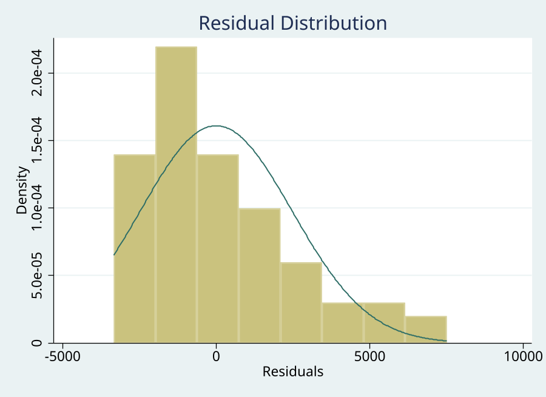
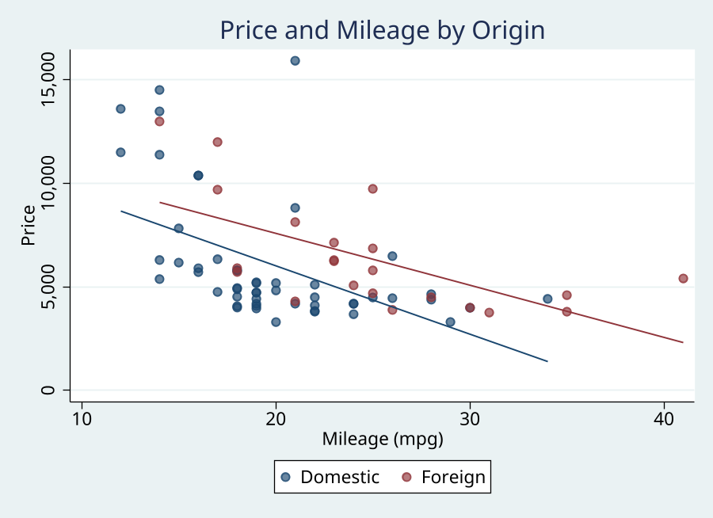

# logdoc — Faithful Stata log conversion

**Version 1.1.4** | 2026-08-09

`logdoc` converts Stata `.smcl` and `.log` files into shareable HTML, Markdown, Quarto Markdown, Word, LaTeX, or PDF documents, and can run `.do` files before conversion. It is for Stata users who want to preserve output alignment and, for SMCL input, Stata's input/result/error colors while adding optional report controls.

## Quick Start

Capture a small SMCL log, check the Python setup, and render a self-contained HTML document:

```stata
capture log close _all
log using "analysis.smcl", replace smcl name(logdoc_demo) nomsg
sysuse auto, clear
* # Data Overview
summarize price mpg weight
* # Regression Results
regress price mpg weight
log close logdoc_demo

logdoc_py
logdoc using "analysis.smcl", output("analysis.html") replace
```

The default HTML keeps Stata's monospace alignment, input/result/error coloring, tables, and horizontal rules close to the original log.

## Requirements

- Stata 16.0 or later.
- Python 3.6 or later; ordinary HTML, Markdown, Quarto Markdown, and LaTeX conversion uses only the Python standard library.
- `format(docx)` requires Stata 17.0 or later because it uses Stata's `html2docx`.
- `format(pdf)` requires either the optional Python package `xhtml2pdf` or the `wkhtmltopdf` system executable.
- The `run` option requires a batch Stata executable on `PATH`, unless `stataexe()` supplies its name or path.

## Installation

Install the released package from Stata's Command window:

```stata
capture ado uninstall logdoc
net install logdoc, from("https://raw.githubusercontent.com/tpcopeland/Stata-Tools/main/logdoc/") replace
logdoc_py
```

`logdoc_py` should report a Python 3.6+ executable and the bundled renderer. If Stata's Python is not configured, set it once or select a Python executable for the current session:

```stata
set python_exec "/path/to/python3", permanently
logdoc_py

logdoc_py, python("/path/to/python3") set
```

To save a project-local Python choice in `.logdocrc`, use `logdoc_py, python("/path/to/python3") save replace`. To enable PDF output with the preferred converter, run:

```stata
logdoc_py, install(xhtml2pdf)
logdoc_py, check pdf
```

## Commands

| Command | Description |
|---------|-------------|
| `logdoc` | Convert an existing SMCL or plain-text log, or run a `.do` file and convert its log |
| `logdoc start` / `logdoc stop` | Capture an interactive session and convert it when the session ends |
| `logdoc diff` | Produce an HTML side-by-side comparison of two logs |
| `logdoc batch` | Convert all files matching a pattern into an output directory |
| `logdoc combine` | Merge two or more logs into one source-sectioned document |
| `logdoc replay` | Repeat the most recent conversion with a theme, format, or open override |
| `logdoc_py` | Find, check, select, and save the Python executable used by `logdoc` |

A dialog interface for the main conversion command is available with `db logdoc`.

## How It Works

`logdoc` parses SMCL or plain-text logs into command, output, table, error, and graph blocks, then sends them to the bundled `logdoc_render.py` renderer. HTML is faithful by default and self-contained: the selected CSS is included in the document, and graph images resolved from the log are embedded as base64 data.

Enhancements are opt-in so that the default HTML remains a readable Stata transcript. `highlight`, `tables`, `fold`, `copy`, and `download` add semantic controls; `legacy` enables all five together, while `notebook`, `toc`, `linenumbers`, `email`, annotations, filtering, and accent colors are independent features.

| Input | Behavior |
|-------|----------|
| `.smcl` | Preserves Stata's SMCL input, result, and error styling |
| `.log` | Converts plain-text log content without SMCL color information |
| `.do` | Requires `run`; executes the do-file in a child Stata session, captures an SMCL log, and converts it |

| Format | Result |
|--------|--------|
| `html` | Self-contained HTML with inlined CSS and graph images embedded when they can be resolved |
| `md` | Markdown with YAML front matter and Markdown image references |
| `qmd` | Quarto-flavored Markdown with YAML front matter; it is rendered Markdown, not executable chunks |
| `both` | HTML and Markdown from one conversion |
| `docx` | Word document through Stata's `html2docx`; Stata 17+ is required |
| `tex` | LaTeX document with listings and booktabs |
| `pdf` | PDF through `xhtml2pdf` first, then `wkhtmltopdf` |

If `format()` is omitted, the output extension selects `md`, `qmd`, `tex`, `docx`, or `pdf`; otherwise the default is `html`. With `format(both)`, an `.html` output path produces a matching `.md` file, an `.md` path produces a matching `.html` file, and a path without an extension produces both formats with those extensions.

Configuration values use one `key=value` entry per line. `logdoc` reads `~/.logdocrc` first and then `.logdocrc` in the current working directory, so project settings override global settings and command options override both. The Python companion uses the same configuration files; its default candidate order is Stata's configured Python, `$LOGDOC_PYTHON`, configuration files, and platform commands such as `python3` or `python`.

## Worked Examples

### 1. Convert an existing SMCL log

The following creates a real Stata log with section markers and converts it to HTML:

```stata
capture log close _all
log using "analysis.smcl", replace smcl name(analysis) nomsg
sysuse auto, clear
* # Data Overview
summarize price mpg weight
* # Regression Results
regress price mpg weight
log close analysis

logdoc using "analysis.smcl", output("analysis.html") replace
```

### 2. Select Markdown or produce both formats

Output extensions are detected automatically. `format(both)` writes HTML and Markdown from the same input.

```stata
logdoc using "analysis.smcl", output("analysis.md") replace
logdoc using "analysis.smcl", output("analysis.html") format(both) replace
```

### 3. Add a table of contents and HTML controls

The `toc` option turns `* # Section Title` comments in the log into headings. `legacy` enables syntax highlighting, parsed supported tables, folding, copy buttons, and Download `.do` controls.

```stata
logdoc using "analysis.smcl", output("analysis_enhanced.html") ///
    legacy toc linenumbers generated replace
```

### 4. Filter a dark-theme report

`keep()` and `drop()` accept pipe-delimited regular-expression patterns matched against command text. `nodots` removes Stata's dot prompts from the displayed command blocks.

```stata
logdoc using "analysis.smcl", output("regressions.html") ///
    theme(dark) keep("regress|margins") nodots replace
```

### 5. Capture a live session

`logdoc start` opens a temporary SMCL log and sets the session line size to 255; `logdoc stop` closes the log, restores the previous line size, and converts the captured session.

```stata
logdoc start, output("session.html") theme(dark) notebook replace
sysuse auto, clear
summarize price mpg
regress price mpg weight
logdoc stop
```

### 6. Run a do-file before conversion

With an existing `analysis.do`, `run` executes it in a child Stata session and converts the resulting SMCL log. The output is automatically replaceable, and `stataexe()` can override the detected child executable.

```stata
logdoc using "analysis.do", output("run.html") run
logdoc using "analysis.do", output("run_custom.html") ///
    run stataexe("stata-mp")
```

### 7. Batch, combine, and compare logs

These commands operate on existing log files. `combine` requires at least two sources, while `diff` always produces HTML.

```stata
logdoc batch, input("logs/*.smcl") outdir("reports") replace
logdoc combine using "logs/setup.smcl" "logs/models.smcl" ///
    output("reports/project.html") toc replace
logdoc diff using "logs/old.smcl", compare("logs/new.smcl") ///
    output("reports/diff.html") replace
```

### 8. Append and replay a conversion

Append mode adds a second log to an existing HTML, Markdown, Quarto Markdown, LaTeX, or dual-format output. Replay remembers the last resolved conversion settings and accepts theme, format, and open overrides.

```stata
logdoc using "analysis.smcl", output("project.html") replace
logdoc using "followup.smcl", output("project.html") append

logdoc using "analysis.smcl", output("replay.html") ///
    title("Analysis") replace
logdoc replay, theme(dark)
```

### 9. Diagnose Python and PDF support

Use `verbose` to see each Python candidate and `set` or `save` to keep the selected executable for the session or project.

```stata
logdoc_py, python("/path/to/python3") verbose
logdoc_py, python("/path/to/python3") set
logdoc_py, python("/path/to/python3") save replace
logdoc_py, check pdf
```

## Demo

Regenerate the checked-in examples by running `do logdoc/demo/demo_logdoc.do` from the Stata-Tools repository root. The script exercises themes, graph embedding, enhancements, filters, annotations, batch/combine/diff/replay, live sessions, and output formats; the demo files are checkout assets rather than part of the `net install` payload.

| Preview or artifact | Focus |
|---------------------|-------|
|  | Graph detection and HTML embedding |
|  | A second log and graph export |
| [`sample_light.html`](demo/sample_light.html) | Faithful default HTML |
| [`sample_enhanced.html`](demo/sample_enhanced.html) | `legacy`, `toc`, line numbers, and generated footer |
| [`sample_notebook.html`](demo/sample_notebook.html) | Notebook-style cells |
| [`sample_diff.html`](demo/sample_diff.html) | Side-by-side log comparison |
| [`sample_both.html`](demo/sample_both.html) and [`sample_both.md`](demo/sample_both.md) | Dual HTML and Markdown output |
| [`sample_pdf.pdf`](demo/sample_pdf.pdf) | PDF output when a converter is available |

## Command Reference

### `logdoc` syntax

```stata
logdoc using filename, output(filename) [options]
logdoc start, output(filename) [options]
logdoc stop
logdoc diff using file1, compare(file2) output(filename) [replace theme(string) python(string) css(filename) accent(#RRGGBB) quiet]
logdoc batch, input(pattern) outdir(path) [options]
logdoc combine using file1 file2 [...], output(filename) [options]
logdoc replay [, theme() format() open]
```

`output()` is required for conversion, live-session start, diff, and combine. `input()` and `outdir()` are required for batch; `compare()` and `output()` are required for diff; combine needs two or more source files.

### Subcommand constraints

- `logdoc start` accepts the conversion display and metadata options but not `run` or `stataexe()`; `logdoc stop` takes no options.
- `logdoc diff` always writes HTML and accepts `replace`, `theme()`, `python()`, `css()`, `accent()`, and `quiet`.
- `logdoc batch` defaults to HTML and writes each matching input basename to the chosen output directory with the selected output extension(s).
- `logdoc combine` supports `html`, `md`, `qmd`, `tex`, and `both`; it rejects `docx` and `pdf`.
- `logdoc replay` requires a previous conversion in the current Stata session and reuses all remembered options except for its documented overrides.

### `logdoc_py` syntax and actions

```stata
logdoc_py [, check|set|save|install(string) python(path) pdf ///
    replace dryrun quiet verbose]
```

`check` is the default action. At most one of `check`, `set`, `save`, and `install()` may be specified. `set` stores the selected executable in `$LOGDOC_PYTHON` for the current session, `save` writes `python=...` to `.logdocrc` in the current working directory, and `install()` runs `-m pip install` through the selected executable when an explicit package request is supplied. `logdoc` itself has no required or optional third-party Python package dependencies.

## Key Options

### Format and theme

| Option | Accepted value | Default and effect |
|--------|----------------|--------------------|
| `output(filename)` | Existing or new output path | Required for conversion, start, diff, and combine |
| `format(string)` | `html`, `md`, `qmd`, `both`, `docx`, `tex`, `pdf` | Extension detection; otherwise `html` |
| `theme(string)` | `light`, `dark` | `light` |
| `css(filename)` | Existing CSS file | Built-in theme CSS |
| `accent(#RRGGBB)` | Six-digit hexadecimal color | None; applied after `css()` |

### Document metadata

| Option | Effect | Default |
|--------|--------|---------|
| `title(string)` | Sets the document title | Input filename |
| `date(string)` | Adds a date subtitle | None |
| `footer(string)` | Adds custom footer text | None |
| `generated` | Adds a generated timestamp footer | Off |
| `stamp` | Adds Stata version, edition, date/time, and current data filename to the header | Off |

### Display and layout

| Option | Effect | Default |
|--------|--------|---------|
| `run` | Executes a `.do` file in batch mode before conversion and automatically enables `replace` | Off |
| `stataexe(string)` | Overrides the child Stata executable used by `run`; an error without `run` | Auto-detected from flavor and operating system |
| `preformatted` | Compatibility option; keeps HTML tables monospace unless `tables` is requested | Off |
| `nofold` | Compatibility option; suppresses folding | Folding is already off |
| `nodots` | Removes dot prompts from command blocks | Off |
| `fold` | Collapses long output blocks into expandable sections | Off |
| `highlight` | Adds conservative Stata syntax highlighting | Off |
| `tables` | Parses supported tables into HTML table elements, with monospace fallback if parsing fails | Off |
| `copy` | Adds copy-to-clipboard buttons to command blocks | Off |
| `download` | Adds a Download `.do` toolbar button | Off |
| `legacy` | Enables `highlight`, `tables`, `fold`, `copy`, and `download` together | Off |
| `linenumbers` | Adds line numbers to command blocks | Off |
| `toc` | Builds a table of contents from section-marker comments such as `* # Results` | Off |
| `notebook` | Uses Jupyter-style `In` and `Out` cell labels | Off |
| `email` | Inlines CSS and removes the `<style>` block for email clients | Off |
| `nograph` | Skips graph detection and embedding | Graph detection enabled |
| `graphwidth(#)` | Sets embedded graph display width in pixels | Renderer default |
| `graphheight(#)` | Sets embedded graph display height in pixels | Renderer default |

### Filtering and other controls

| Option | Effect | Default |
|--------|--------|---------|
| `keep(string)` | Retains commands matching pipe-delimited regular-expression patterns | None |
| `drop(string)` | Removes commands matching pipe-delimited regular-expression patterns | None |
| `open` | Opens the primary output in the default browser or application | Off |
| `append` | Appends to an existing `html`, `md`, `qmd`, `tex`, or `both` output | Off |
| `annotate(filename)` | Adds notes using `@block N: text` or `@command "pattern": text` entries | None |
| `python(string)` | Selects an explicit Python 3 executable | Stata Python, then configured and system candidates |
| `quiet` | Suppresses status messages | Off |
| `verbose` | Shows renderer processing details | Off |
| `replace` | Allows overwriting existing output files | Off |

`quiet` and `verbose` are mutually exclusive. `append` does not require `replace`, but it is not supported for `docx` or `pdf`; `run` enables `replace` automatically. Graph dimensions control display size, while `graph export ..., width()` and `height()` control the source image resolution.

### `logdoc_py` options

| Option or action | Effect | Default |
|------------------|--------|---------|
| `check` | Checks Python and the bundled renderer | Default action |
| `set` | Stores the selected executable in `$LOGDOC_PYTHON` for this session | Off |
| `save` | Writes or updates `python=...` in `.logdocrc` | Off |
| `install(string)` | Runs an explicit pip installation with the selected Python | Off |
| `python(path)` | Checks only the supplied Python executable | Automatic candidate search |
| `pdf` | Checks `xhtml2pdf` and `wkhtmltopdf` | Off |
| `replace` | Allows `save` to replace an existing `python=` entry | Off |
| `dryrun` | Shows the pip command without installing; only valid with `install()` | Off |
| `quiet` | Suppresses nonessential output | Off |
| `verbose` | Shows candidate and renderer checks | Off |

`logdoc_py` checks candidates in this order when `python()` is omitted: Stata's configured Python, `$LOGDOC_PYTHON`, `python=` in global then project `.logdocrc`, and platform commands such as `python3`, `python`, or `py -3`. `quiet` and `verbose` are mutually exclusive.

## Stored Results

### `logdoc` results

Conversion, `logdoc stop`, `logdoc combine`, and `logdoc replay` return the conversion results below. `r(secondary)` is present only for `format(both)`.

| Result | Type | Meaning |
|--------|------|---------|
| `r(output)` | Macro | Output path supplied or resolved |
| `r(input)` | Macro | Input path used for rendering; with `run`, this may be the captured temporary log |
| `r(format)` | Macro | Format used |
| `r(theme)` | Macro | Theme used |
| `r(accent)` | Macro | Accent color, if supplied |
| `r(secondary)` | Macro | Secondary output path for `format(both)` |
| `r(nblocks)` | Scalar | Number of rendered content blocks |
| `r(filesize)` | Scalar | Output size in bytes |
| `r(ngraphs)` | Scalar | Detected graph export commands |
| `r(ntables)` | Scalar | Detected table blocks |
| `r(nwarnings)` | Scalar | Renderer warnings, such as unresolved graph files |

`logdoc combine` additionally returns `r(n_sources)`, the number of source files combined. `logdoc batch` returns `r(n_files)` and `r(n_failed)`. `logdoc diff` returns the macros `r(output)`, `r(input)`, and `r(compare)`.

### `logdoc_py` results

On a successful call, `logdoc_py` returns:

| Result | Type | Meaning |
|--------|------|---------|
| `r(ok)` | Scalar | 1 when the requested action completes |
| `r(python_ok)` | Scalar | 1 when a usable Python executable was found |
| `r(renderer_ok)` | Scalar | 1 when `logdoc_render.py` was found and passed its smoke check |
| `r(pdf_ok)` | Scalar | 1 when `xhtml2pdf` or `wkhtmltopdf` is available; present only with `pdf` |
| `r(installed)` | Scalar | Installation status for `install()`; present only for that action |
| `r(python)` | Macro | Selected Python executable |
| `r(python_version)` | Macro | Python version string |
| `r(python_source)` | Macro | Candidate source: `option`, `global`, `config`, `stata`, or `path` |
| `r(renderer)` | Macro | Path to `logdoc_render.py` |
| `r(config)` | Macro | Configuration path when a configuration file was read or written |
| `r(xhtml2pdf)` | Macro | `installed` when the preferred PDF library is available |
| `r(wkhtmltopdf)` | Macro | Path or command name when `wkhtmltopdf` is found |
| `r(required)` | Macro | Required Python packages; empty for current `logdoc` |
| `r(optional)` | Macro | Optional Python packages; empty for current `logdoc` |
| `r(missing)` | Macro | Missing Python packages; empty for current `logdoc` |
| `r(install_cmd)` | Macro | Pip command used or proposed by `dryrun` |

## Assumptions and Limits

- SMCL is the preferred input because plain `.log` files do not retain Stata's input, result, and error color tags.
- Graphs are embedded when a `graph export` command is detected and the referenced image can be resolved; use a path relative to the log or an absolute path for reliability. `nograph` disables this scan.
- HTML embeds graph images, while Markdown, Quarto Markdown, and LaTeX use image references that must remain resolvable when the output is moved.
- `format(qmd)` produces rendered Markdown with Quarto front matter; it does not create executable Quarto code cells.
- `format(docx)` is unavailable before Stata 17. `format(pdf)` needs `xhtml2pdf` or `wkhtmltopdf`; check it with `logdoc_py, check pdf`.
- `logdoc combine` does not create Word or PDF output. `append` is unsupported for Word and PDF.
- An existing output file requires `replace`, except when `append` is used; `run` sets `replace` automatically.
- `logdoc stop` permits only one active session. If conversion fails, it preserves the captured SMCL log and reports a command that can convert it manually.
- Input, output, annotation, CSS, Python, and pip-package values that contain shell-control characters are rejected before an external shell call.
- The default renderer favors faithful monospace output. Use `tables` only when the supported table parser is appropriate; unsupported or ambiguous tables remain monospace.

## QA

QA suites and how to run them are documented in [`qa/README.md`](qa/README.md).

## Version History

- **1.1.4** (2026-08-09): Prefer caller-local CSS themes, support `stataexe()` paths containing spaces, and render SMCL help links with complete topics and labels; align documented option abbreviations and expand release-surface QA.
- **1.1.3** (2026-08-05): Corrected Quarto format and append guidance, aligned the Python setup help, and shortened help-table descriptions for clean Viewer rendering.
- **1.1.2** (2026-07-10): Reject shell-control characters in user-supplied paths, Python executable values, and pip package requests before external shell calls; preserve embedded double quotes when batch, session, and replay commands rebuild options.
- **1.1.1** (2026-07-07): Report conversion failures even when a previous output exists; use UTF-8 output on Windows; re-execute `run` conversions during replay; preserve captured session logs on failed conversion; read global `.logdocrc`; reject `docx` and `pdf` combine outputs; and require `stataexe()` only with `run`.
- **1.1.0** (2026-06-14): Add faithful-by-default HTML rendering, opt-in enhancements, `run`, `combine`, `accent()`, and `.logdocrc` support.

## Author

Timothy P Copeland, Karolinska Institutet

## License

MIT License
