# msm - Marginal structural models for longitudinal causal analysis

**Version 1.0.1** | 2026-04-30

`msm` is a Stata suite for inverse-probability-weighted marginal structural models in person-period data. It is designed for longitudinal settings with time-varying treatments and confounders, where standard regression adjustment can be biased by treatment-confounder feedback.

The package covers the full workflow for conventional static-regime MSM analyses: study protocol specification, variable mapping, validation, stabilized weighting, diagnostics, outcome modeling, counterfactual prediction, plotting, reporting, Excel export, and sensitivity analysis.

## When to use this package

Use `msm` when your data have all of these features:

- **Longitudinal panel structure** — repeated observations per individual over time.
- **Time-varying treatment** — treatment status can change between periods.
- **Time-varying confounders affected by past treatment** — the classic "treatment-confounder feedback" problem. A confounder like biomarker level may be affected by prior treatment and also predict future treatment. Standard regression adjustment cannot handle this without bias; IPTW solves it by reweighting.
- **Binary treatment and outcome indicators** (0/1). Linear and Cox models are also supported for estimation, but the full prediction workflow requires a binary outcome with a pooled logistic model.

If your treatment is assigned at a single point in time (not time-varying), consider Stata's built-in `teffects ipw` instead.

## Requirements

- Stata 16 or later

## Installation

After SSC acceptance, install the released package with:

```stata
ssc install msm
```

Until then, install the current Stata-Tools release directly:

```stata
capture ado uninstall msm
net install msm, from("https://raw.githubusercontent.com/tpcopeland/Stata-Tools/main/msm") replace
```

The release installs `msm_example.dta`, which the examples below access with `findfile`.

## Commands

### Setup and validation

| Command | Description |
|---------|-------------|
| `msm` | Package overview, workflow guide, and pipeline state check via `msm, status` |
| `msm_protocol` | Record the target trial, causal contrast, weighting plan, and analysis plan (7 components) |
| `msm_prepare` | Map identifier, period, treatment, outcome, censoring, and covariate variables |
| `msm_validate` | Run 10 data-quality checks for person-period data |

### Estimation

| Command | Description |
|---------|-------------|
| `msm_weight` | Estimate stabilized IPTW and optional censoring weights (IPCW) |
| `msm_fit` | Fit weighted pooled logistic, linear, or Cox outcome models |
| `msm_predict` | Generate counterfactual predictions under always-treated and never-treated strategies |

### Diagnostics and output

| Command | Description |
|---------|-------------|
| `msm_diagnose` | Summarize weight distribution and assess covariate balance (SMD before/after) |
| `msm_plot` | Draw weight density, Love plot, survival curves, trajectory, and positivity plots |
| `msm_report` | Produce a compact publication-style results table (console, CSV, or Excel) |
| `msm_table` | Export multi-sheet Excel workbook with all pipeline results |
| `msm_sensitivity` | Compute E-values and confounding-bound sensitivity summaries |

## How It Works

`msm` is organized as a pipeline. Each step stores its results in the dataset as characteristics, matrices, or variables, and downstream commands read those stored artifacts automatically. This means you only specify your variable mapping once (in `msm_prepare`) and do not need to repeat it at every step.

### The pipeline at a glance

```
msm_protocol  →  msm_prepare  →  msm_validate  →  msm_weight
     ↓                                                  ↓
 (document)                                        msm_diagnose
                                                        ↓
                                                    msm_fit
                                                        ↓
                                                   msm_predict
                                                        ↓
                              msm_plot / msm_report / msm_table / msm_sensitivity
```

Run `msm, status` at any point to see the current pipeline stage, what variables are mapped, what artifacts are saved, and what the recommended next step is.

### What each step does

1. **`msm_protocol`** — documents the causal question and analysis plan using 7 components adapted from the target trial emulation framework of Hernan et al. (2020). This is purely for documentation; it does not affect computation.

2. **`msm_prepare`** — maps your dataset's variable names to roles (ID, period, treatment, outcome, censoring, covariates) and stores the mapping in dataset characteristics. Validates the data structure (person-period format, binary variables, constant baseline covariates). This is the entry point for the analysis.

3. **`msm_validate`** — runs 10 data quality checks: person-period format, period gaps, terminal outcomes, treatment variation, missing data, sufficient period sizes, covariate completeness, treatment history patterns, censoring patterns, and positivity by period. Use `strict` to treat all warnings as hard errors.

4. **`msm_weight`** — fits logistic models for the probability of treatment at each period, then combines the period-specific ratios into cumulative stabilized IP weights. Optionally adds censoring weights (IPCW). Truncation at specified percentiles is available to limit the influence of extreme weights.

5. **`msm_diagnose`** — reports the weight distribution (mean, SD, percentiles, effective sample size) and computes standardized mean differences (SMD) for each covariate before and after weighting. A good analysis should see SMDs below 0.1 after weighting.

6. **`msm_fit`** — fits the weighted outcome model. The treatment coefficient from this model is the MSM causal estimate. Standard errors are robust/sandwich, clustered at the individual level.

7. **`msm_predict`** — generates standardized counterfactual predictions: "What would the outcome be if everyone were always treated? Never treated?" Uses Monte Carlo simulation from the coefficient distribution for confidence intervals. Risk differences between strategies are available.

8. **`msm_plot`**, **`msm_report`**, **`msm_table`**, **`msm_sensitivity`** — visualization, reporting, and sensitivity analysis. `msm_table` produces a multi-sheet Excel workbook; `msm_report` produces a single compact summary; `msm_sensitivity` computes E-values for unmeasured confounding.

## Choosing an Outcome Model

| `msm_fit` model | When to use it | Follow-on implications |
|-----------------|----------------|------------------------|
| `model(logistic)` | Binary outcomes when you also want standardized counterfactual predictions | Required for `msm_predict`; use `msm, status` to confirm prediction is available |
| `model(linear)` | Continuous outcomes where the weighted mean difference is the target | `msm_predict` is not available; use `msm, status` to check the current stage before reporting/export |
| `model(cox)` | Time-to-event analyses where a weighted hazard ratio is the main estimand | `msm_predict` is not available; use `msm_report`, `msm_table`, `msm_sensitivity`, and `msm, status` for pipeline state |

## Data Requirements

- Data must be in **person-period format**, with one row per individual-period.
- `id()` and `period()` must uniquely identify observations.
- `period()` must be integer-valued.
- All individuals must share a **common baseline period** before weighting.
- `treatment()` and `outcome()` must be binary 0/1 variables.
- `censor()` is optional but must also be binary 0/1 when used.
- Variables in `baseline_covariates()` must be time-fixed (constant within person).
- `msm_weight` currently rejects delayed entry.
- `msm_predict` requires a prior `msm_fit, model(logistic)` run.

## Interpreting Key Diagnostics

### Weight mean

Stabilized IP weights should have a mean close to 1.0. If the mean deviates substantially (e.g., 0.7 or 1.4), the treatment or numerator model may be misspecified. Check your covariate specification.

### Effective sample size (ESS)

ESS = (sum of weights)² / (sum of squared weights). It measures how much statistical information the weighted sample retains compared to the original sample. If ESS drops below 50% of N, consider simplifying the weight model or applying stronger truncation.

### Standardized mean differences (SMD)

An absolute SMD below 0.1 after weighting is the standard threshold for acceptable covariate balance. SMDs above 0.1 suggest residual confounding for that covariate. If weighting makes balance *worse* for a variable, investigate the weight model specification.

### E-value

The E-value is the minimum strength of association (risk ratio scale) that an unmeasured confounder would need with both treatment and outcome to fully explain away the observed effect. An E-value of 1 means the confidence interval already includes the null. E-values above 2-3 indicate the result is moderately to strongly robust to unmeasured confounding.

## Current Scope and Limits

- `msm` targets static binary treatment strategies. Prediction is implemented for always-treated, never-treated, or both; dynamic and stochastic regimes are not supported.
- `msm_predict` requires a prior `msm_fit, model(logistic)` run. Linear and Cox fits can be estimated, diagnosed, and reported, but they do not feed into `msm_predict`.
- `outcome_cov()` is limited to covariates that are time-fixed within individual; time-varying confounders belong in the weight model.
- `msm_weight` assumes a shared baseline period. Late entry/left truncation is not supported.
- By default, `msm_predict` only allows `times()` within the observed follow-up range. Use `extrapolate` only when you deliberately want out-of-range predictions.

## Demo

The demo runs the full pipeline on the bundled `msm_example.dta` dataset. Console output is rendered as self-contained HTML documents using [logdoc](https://github.com/tpcopeland/Stata-Tools/tree/main/logdoc).

### Console output

<details>
<summary>Setup, protocol, and validation (click to expand)</summary>

[View HTML](demo/console_pipeline_setup.html) | [Source .do file](demo/demo_msm.do)

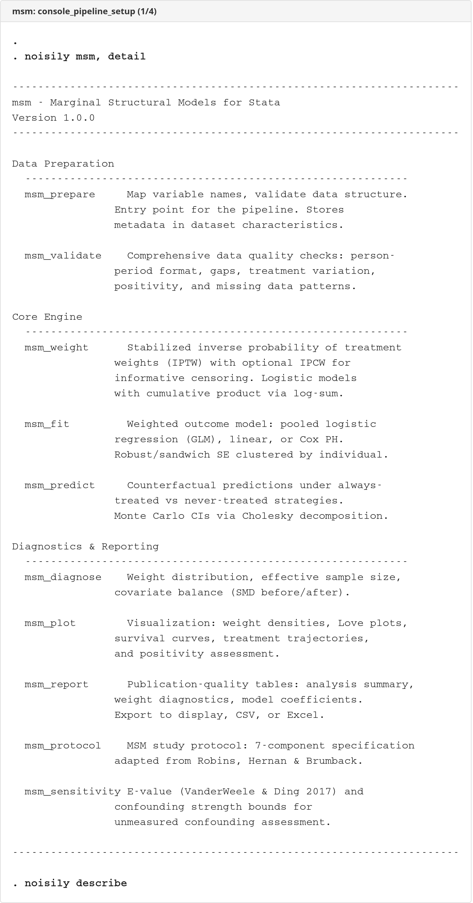
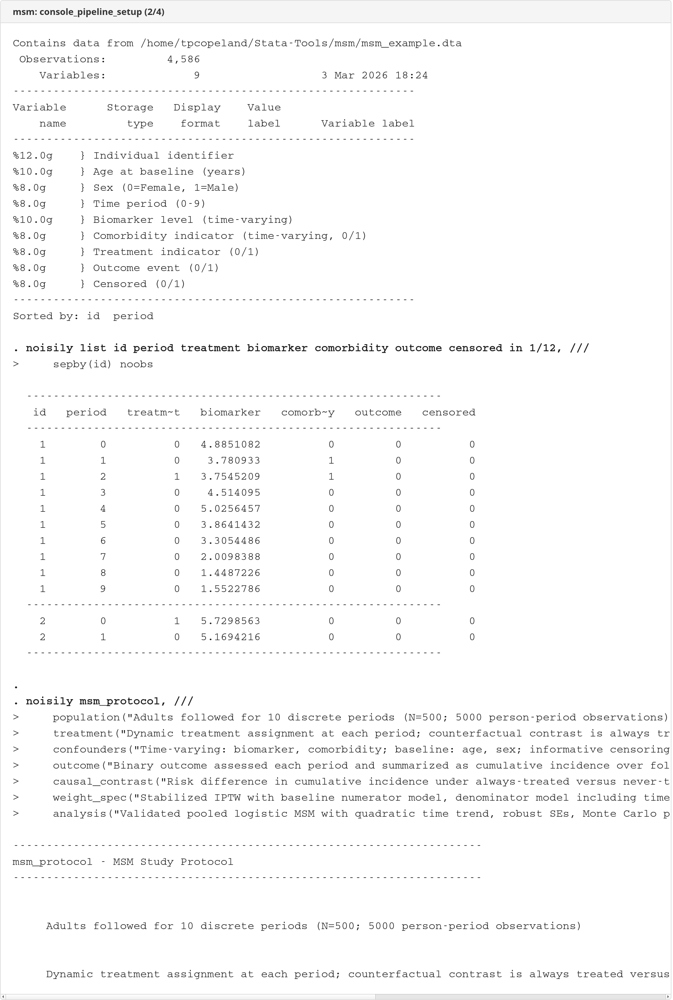
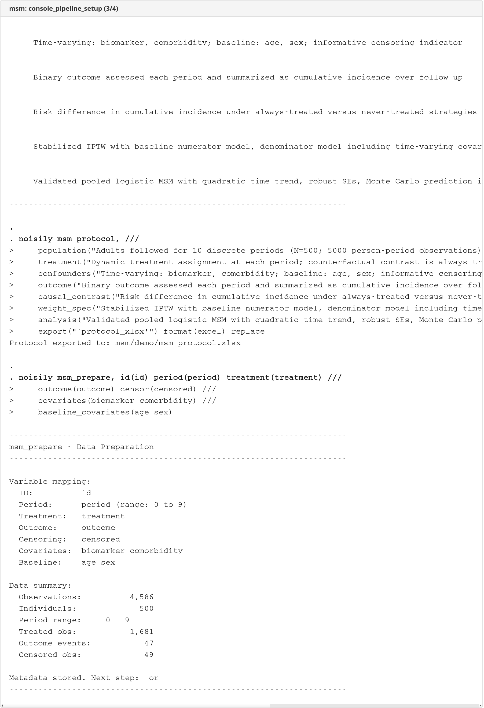
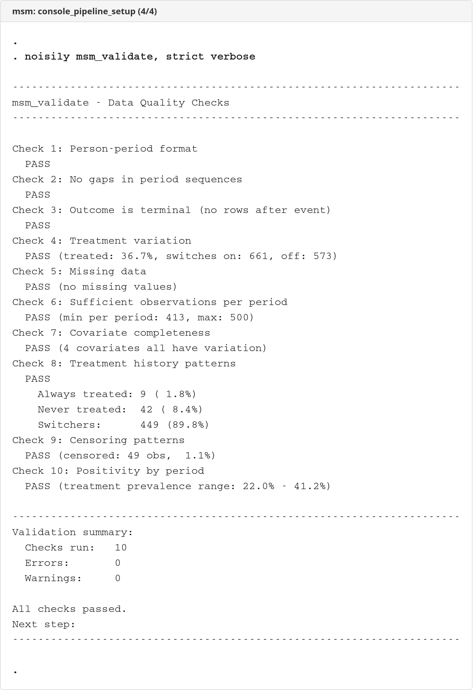

</details>

<details>
<summary>Weighting and diagnostics (click to expand)</summary>

[View HTML](demo/console_pipeline_diagnostics.html)

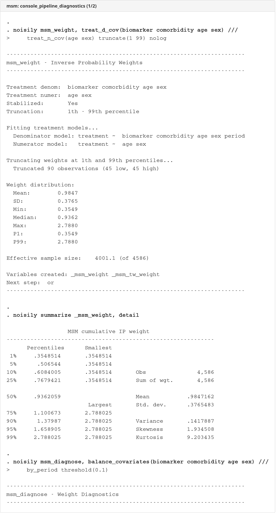
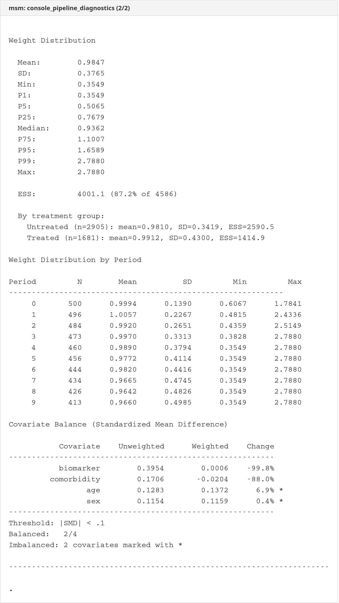

</details>

<details>
<summary>Estimation, prediction, and reporting (click to expand)</summary>

[View HTML](demo/console_pipeline_results.html)

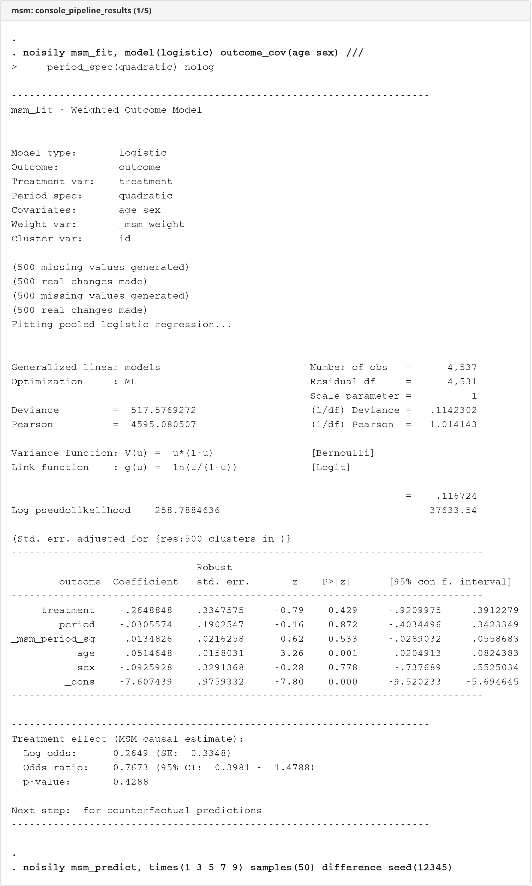
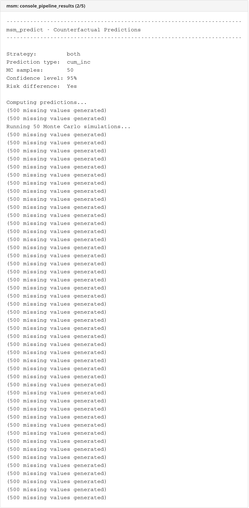
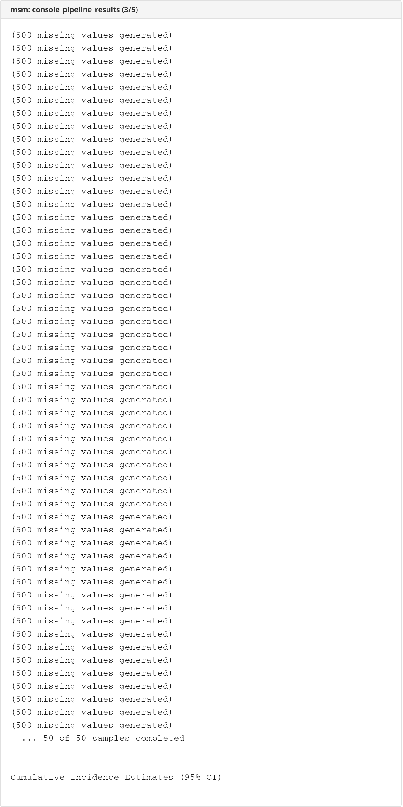
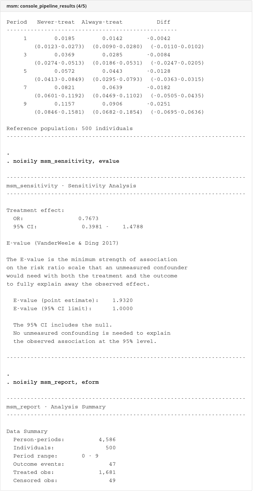
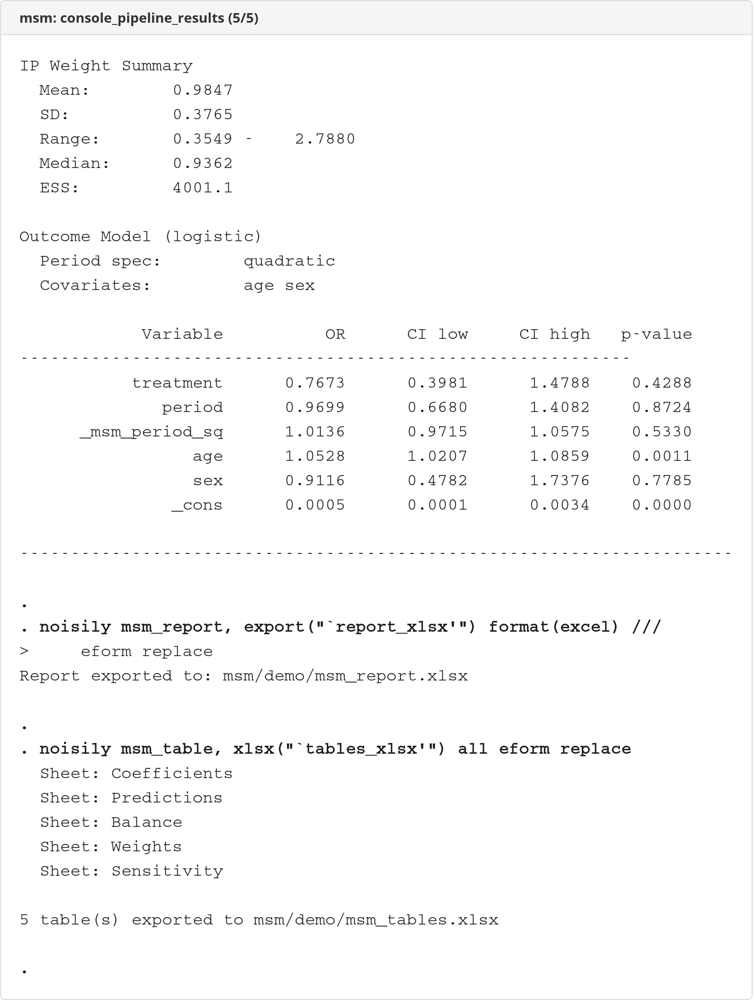

</details>

### Graphs


### Excel exports

<details>
<summary>Excel workbook screenshots (click to expand)</summary>

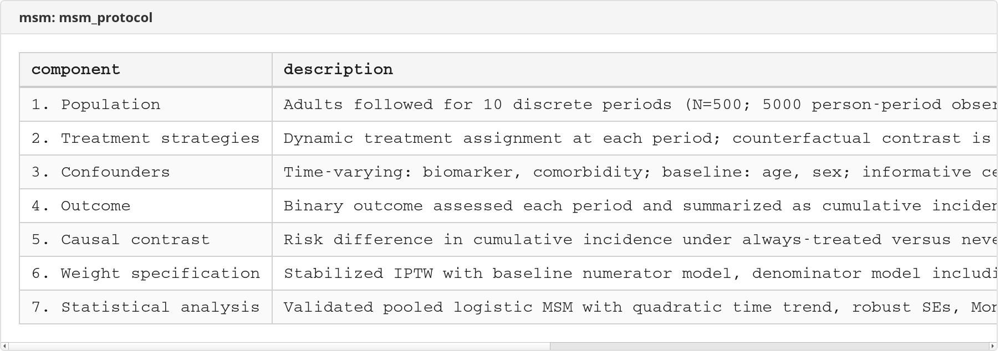

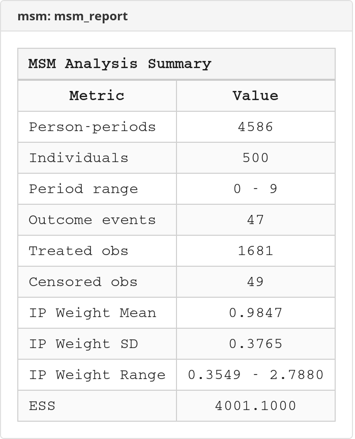


</details>

## Worked Examples

### 1. Full pipeline with the bundled example dataset

This example mirrors the package's intended end-to-end workflow. It stays within the supported scope: static always-treat versus never-treat prediction from a pooled logistic MSM.

```stata
findfile msm_example.dta
use "`r(fn)'", clear

* Step 0: Document the study protocol
msm_protocol, ///
    population("Adults aged 18-65 with condition X") ///
    treatment("Always treat vs. never treat") ///
    confounders("Biomarker (time-varying), comorbidity (time-varying), age, sex") ///
    outcome("Binary clinical endpoint") ///
    causal_contrast("ATE: always treat vs. never treat") ///
    weight_spec("Stabilized IPTW, truncated at 1st/99th percentile") ///
    analysis("Pooled logistic regression, robust SE clustered by ID")

* Step 1: Map variables
msm_prepare, id(id) period(period) treatment(treatment) ///
    outcome(outcome) covariates(biomarker comorbidity) ///
    baseline_covariates(age sex)

* Step 2: Validate data quality
msm_validate, strict verbose

* Step 3: Calculate stabilized IP weights
msm_weight, treat_d_cov(biomarker comorbidity age sex) ///
    treat_n_cov(age sex) truncate(1 99) nolog

* Step 4: Diagnose weights and balance
msm_diagnose, balance_covariates(biomarker comorbidity age sex) ///
    by_period threshold(0.1)

* Step 5: Fit the weighted outcome model
msm_fit, model(logistic) outcome_cov(age sex) nolog

* Check pipeline state
msm, status

* Step 6: Counterfactual predictions
msm_predict, times(1 3 5 7 9) type(cum_inc) difference ///
    samples(200) seed(12345)

* Step 7: Sensitivity analysis
msm_sensitivity, evalue

* Step 8: Reporting and visualization
msm_plot, type(survival) times(1 3 5 7 9) seed(12345)
msm_report, eform
msm_table, xlsx(msm_results.xlsx) all eform replace
```

### 2. Minimal estimation-and-prediction workflow

If you want the core causal estimates first, this shorter sequence gets you from prepared data to standardized counterfactual predictions quickly.

```stata
findfile msm_example.dta
use "`r(fn)'", clear

msm_prepare, id(id) period(period) treatment(treatment) ///
    outcome(outcome) covariates(biomarker comorbidity) ///
    baseline_covariates(age sex)

msm_validate
msm_weight, treat_d_cov(biomarker comorbidity age sex) ///
    treat_n_cov(age sex) nolog
msm_fit, model(logistic) outcome_cov(age sex) nolog
msm, status
msm_predict, times(3 5 7 9) difference seed(12345)
```

### 3. Estimation-only workflow (Cox model)

When the target estimand is a weighted hazard ratio and prediction is not needed:

```stata
findfile msm_example.dta
use "`r(fn)'", clear

msm_prepare, id(id) period(period) treatment(treatment) ///
    outcome(outcome) covariates(biomarker comorbidity) ///
    baseline_covariates(age sex)
msm_weight, treat_d_cov(biomarker comorbidity age sex) ///
    treat_n_cov(age sex) nolog
msm_fit, model(cox) outcome_cov(age sex) nolog
msm_report, eform
```

## Output Notes

- `msm_weight` creates `_msm_weight` and returns weight summaries such as `r(mean_weight)`, `r(ess)`, and `r(n_truncated)`.
- `msm_diagnose` returns a balance matrix in `r(balance)` when `balance_covariates()` is specified.
- `msm_fit` stores the weighted model in `e()` and records the fitted MSM effect matrix in `e(effects)`.
- `msm_predict` returns the prediction matrix in `r(predictions)`, risk differences in `r(rd_#)` when `difference` is requested, and the seed/state used for the Monte Carlo draws in `r(seed)` plus `r(seed_state)`.
- `msm_table` exports formatted Excel workbooks; `msm_report` produces compact summaries to console, CSV, or Excel.

## References

- Robins JM, Hernan MA, Brumback B. Marginal structural models and causal inference in epidemiology. *Epidemiology*. 2000;11(5):550-560.
- Hernan MA, Brumback B, Robins JM. Marginal structural models to estimate the causal effect of zidovudine on the survival of HIV-positive men. *Epidemiology*. 2000;11(5):561-570.
- Cole SR, Hernan MA. Constructing inverse probability weights for marginal structural models. *American Journal of Epidemiology*. 2008;168(6):656-664.
- VanderWeele TJ, Ding P. Sensitivity analysis in observational research: introducing the E-value. *Annals of Internal Medicine*. 2017;167(4):268-274.
- Hernan MA, Robins JM. *Causal Inference: What If*. Boca Raton: Chapman & Hall/CRC, 2020.

## Version History

- **1.0.1** (2026-04-30): Hardened validation edge cases, time-fixed outcome-covariate enforcement, Cox guidance, and protocol export escaping
- **1.0.0** (2026-04-26): Initial Stata-Tools release of the full MSM workflow suite

## Author

Timothy P Copeland, Karolinska Institutet

## License

MIT
