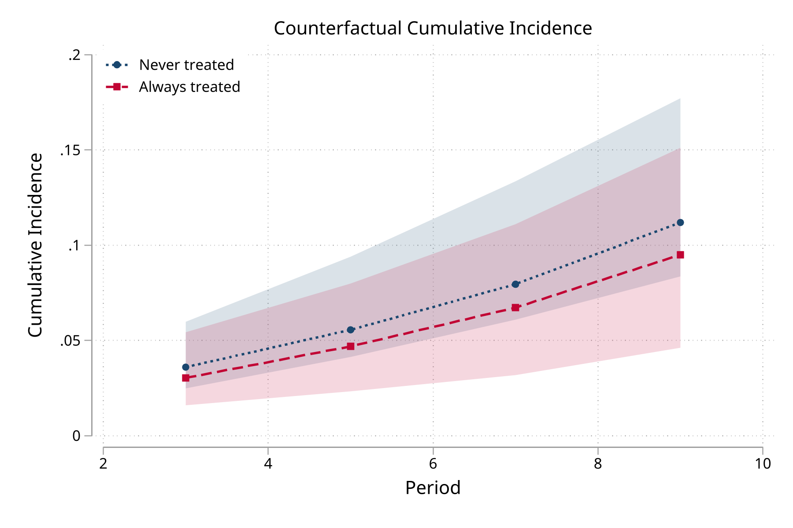
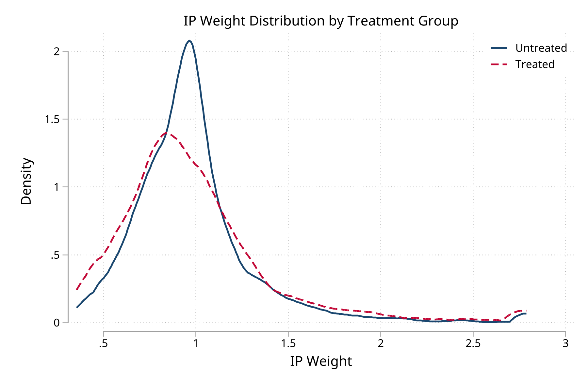
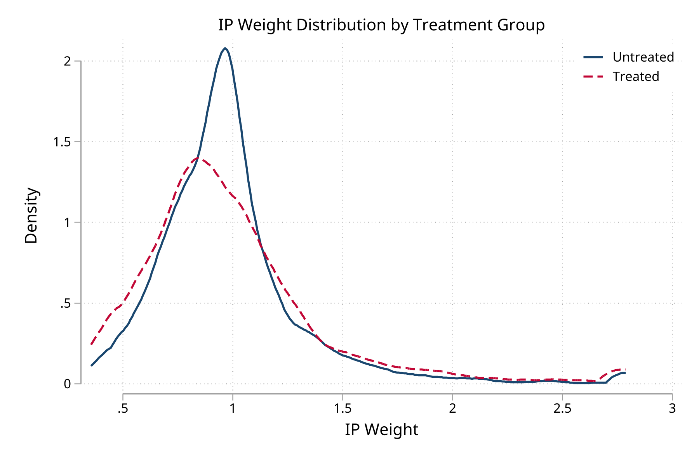
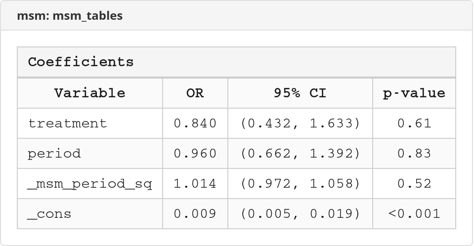

# msm: Marginal Structural Models for Stata

**Version 1.0.0** | 2026-03-03

A comprehensive suite for estimating marginal structural models (MSM) using inverse probability of treatment weighting (IPTW) for time-varying treatments and confounders.

## Overview

Marginal structural models address the challenge of estimating causal treatment effects when time-varying confounders are simultaneously affected by past treatment and predictive of future treatment. Standard regression adjustment cannot handle this structure; IPTW creates a pseudo-population where treatment is independent of measured confounders.

This package implements the complete IPTW pipeline from Robins, Hernan & Brumback (2000).

## Commands

| Command | Description |
|---------|-------------|
| `msm` | Package overview and workflow |
| `msm_prepare` | Map variables and store metadata |
| `msm_validate` | Data quality checks (10 diagnostics) |
| `msm_weight` | Stabilized IPTW (+ optional IPCW) |
| `msm_diagnose` | Weight distribution and covariate balance |
| `msm_fit` | Weighted outcome model (logistic/linear/Cox) |
| `msm_predict` | Counterfactual predictions with CIs |
| `msm_plot` | Weight, balance, survival, trajectory plots |
| `msm_report` | Publication-quality results tables |
| `msm_protocol` | MSM study protocol (7 components) |
| `msm_sensitivity` | E-value and confounding bounds |
| `msm_table` | Publication-quality Excel export |

## Installation

```stata
net install msm, from("https://raw.githubusercontent.com/tpcopeland/Stata-Tools/main/msm")
```

## Quick Start

```stata
use msm_example.dta

* 1. Prepare data
msm_prepare, id(id) period(period) treatment(treatment) ///
    outcome(outcome) covariates(biomarker comorbidity) ///
    baseline_covariates(age sex)

* 2. Validate
msm_validate, verbose

* 3. Calculate weights
msm_weight, treat_d_cov(biomarker comorbidity age sex) ///
    treat_n_cov(age sex) truncate(1 99) nolog

* 4. Diagnose weights
msm_diagnose, by_period threshold(0.1)

* 5. Fit outcome model
msm_fit, model(logistic) outcome_cov(age sex) nolog

* 6. Predict counterfactual outcomes
msm_predict, times(3 5 7 9) difference seed(12345)

* 7. Sensitivity analysis
msm_sensitivity, evalue
```

## Example Output

### Counterfactual Cumulative Incidence

Compare always-treat vs never-treat strategies with bootstrap confidence intervals:



### IP Weight Diagnostics

Assess weight distribution by treatment group after stabilization and truncation:



### Covariate Balance

Standardized mean differences before and after weighting:



### Publication Tables

Export coefficients, predictions, balance, weights, and sensitivity to Excel:



## Requirements

- Stata 16 or later

## References

- Robins JM, Hernan MA, Brumback B. Marginal structural models and causal inference in epidemiology. *Epidemiology*. 2000;11(5):550-560.
- Hernan MA, Brumback B, Robins JM. Marginal structural models to estimate the causal effect of zidovudine on the survival of HIV-positive men. *Epidemiology*. 2000;11(5):561-570.
- VanderWeele TJ, Ding P. Sensitivity analysis in observational research: introducing the E-value. *Annals of Internal Medicine*. 2017;167(4):268-274.
- Cole SR, Hernan MA. Constructing inverse probability weights for marginal structural models. *American Journal of Epidemiology*. 2008;168(6):656-664.

## Author

Timothy P. Copeland
Department of Clinical Neuroscience
Karolinska Institutet, Stockholm, Sweden
timothy.copeland@ki.se
