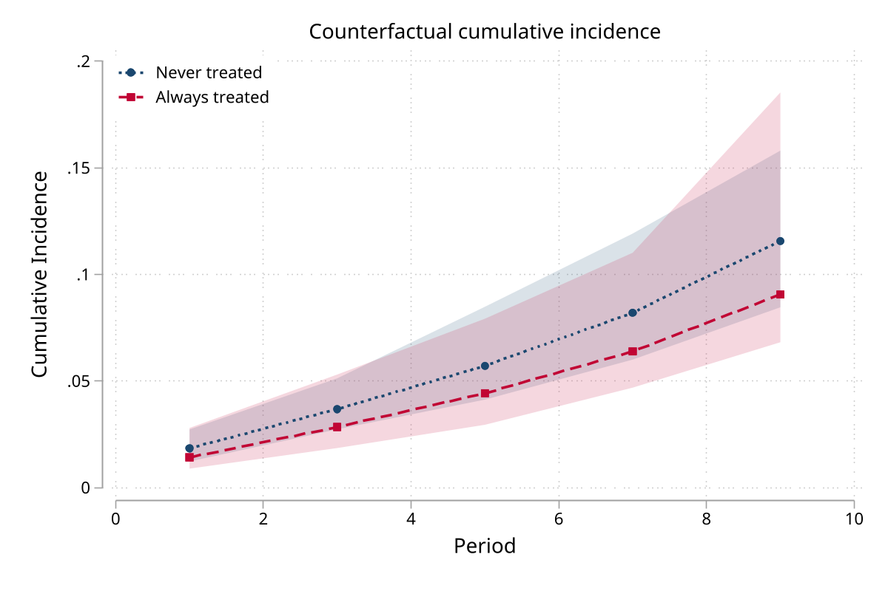
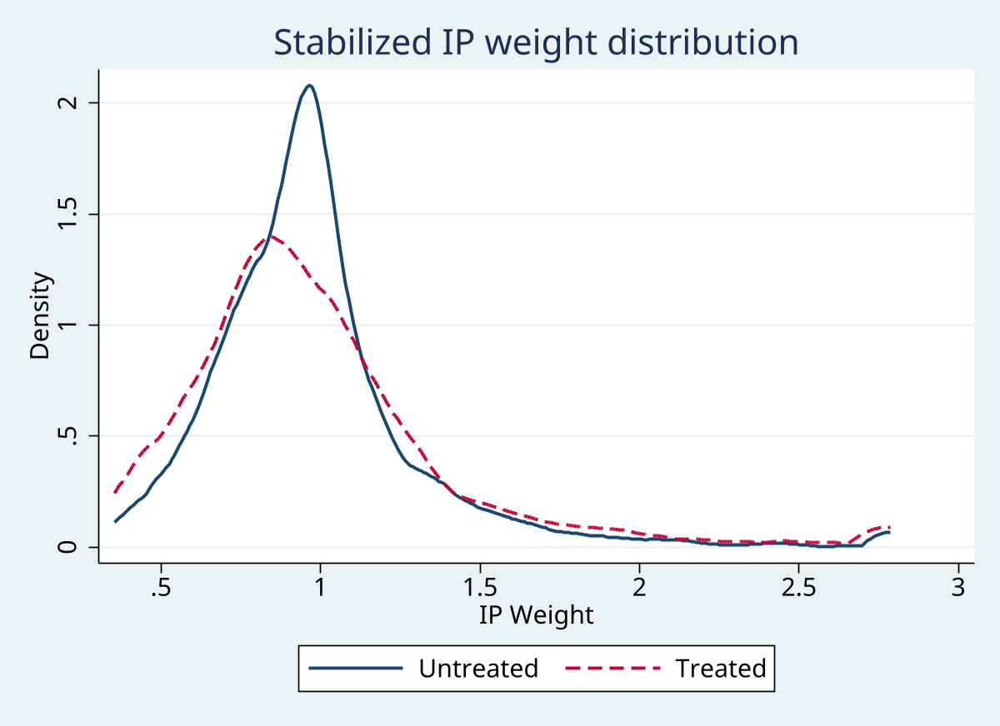
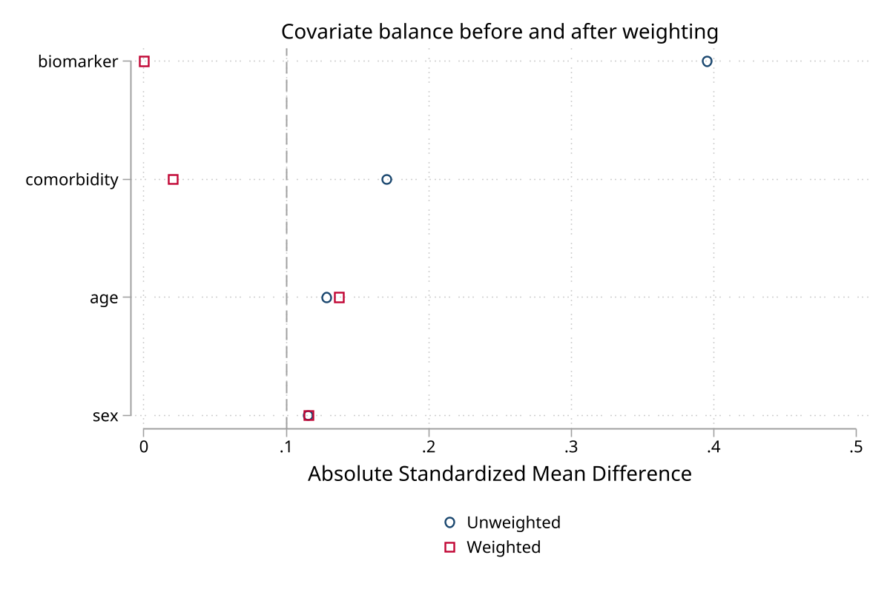

# msm — Marginal structural models for longitudinal causal analysis

**Version 1.4.5** | 2026-08-05

`msm` estimates inverse-probability-weighted marginal structural models for longitudinal person-period data with time-varying treatment and confounding. It takes you from protocol and variable mapping through stabilized IPTW/IPCW, diagnostics, weighted outcome models, counterfactual prediction, plots, exports, and sensitivity analysis.

## Quick Start

Use the bundled person-period example to fit a pooled logistic MSM and obtain counterfactual cumulative-incidence predictions:

```stata
capture confirm file msm_example.dta
if _rc net get msm, from("https://raw.githubusercontent.com/tpcopeland/Stata-Tools/main/msm") replace
use msm_example.dta, clear

msm_prepare, id(id) period(period) treatment(treatment) ///
    outcome(outcome) covariates(biomarker comorbidity) ///
    baseline_covariates(age sex)
msm_validate
msm_weight, treat_d_cov(biomarker comorbidity age sex) ///
    treat_n_cov(age sex) truncate(1 99) nolog
msm_fit, model(logistic) outcome_cov(age sex) nolog
msm_predict, times(1 3 5 7 9) difference seed(12345)
```

The prediction compares standardized outcomes under always-treated and never-treated strategies. Add `msm_diagnose` before `msm_fit` to inspect weights and longitudinal covariate balance.

## Requirements

- Stata 16 or later
- No required external dependencies
- Optional: `psdash` for a per-period propensity-overlap and weight dashboard. Install it separately if needed; the core `msm` workflow does not require it.

## Installation

Install the public Stata-Tools package and replace any older copy:

```stata
capture ado uninstall msm
net install msm, from("https://raw.githubusercontent.com/tpcopeland/Stata-Tools/main/msm") replace
```

The command files and help files are installed by `net install`. Download the ancillary example dataset into the current working directory when you want to run the examples:

```stata
net get msm, from("https://raw.githubusercontent.com/tpcopeland/Stata-Tools/main/msm") replace
```

To use the optional `psdash` integration, install the public companion package:

```stata
net install psdash, from("https://raw.githubusercontent.com/tpcopeland/Stata-Tools/main/psdash") replace
```

## Commands

| Command | Description |
|---------|-------------|
| `msm` | Show the suite overview or inspect pipeline state |
| `msm_protocol` | Record the seven components of an MSM study protocol |
| `msm_prepare` | Map ID, period, treatment, outcome, censoring, and covariate variables |
| `msm_validate` | Run person-period data-quality checks |
| `msm_weight` | Estimate stabilized treatment weights and optional censoring weights |
| `msm_diagnose` | Summarize weights, overlap, effective sample size, and covariate balance |
| `msm_diagtab` | Export accumulated cross-contrast weight diagnostics to Excel |
| `msm_fit` | Fit a weighted pooled logistic, linear, or Cox outcome model |
| `msm_predict` | Predict cumulative incidence or survival under static treatment strategies |
| `msm_plot` | Draw weight, balance, survival, trajectory, or positivity plots |
| `msm_report` | Produce one compact report in the Results window, CSV, or Excel |
| `msm_table` | Export selected or all available pipeline tables to Excel |
| `msm_sensitivity` | Compute E-values or confounding-strength bounds |

## How It Works

`msm` stores the variable mapping and pipeline contracts in dataset characteristics. Weighting creates named analysis variables, fitting persists the coefficient and variance matrices, and downstream commands read those artifacts without requiring the variable mapping to be repeated.

The usual sequence is:

```text
msm_protocol → msm_prepare → msm_validate → msm_weight
                                             ↓
                                        msm_diagnose
                                             ↓
                                          msm_fit
                                             ↓
                                        msm_predict
                                             ↓
                      msm_plot / msm_report / msm_table / msm_sensitivity
```

Run `msm, status` after any step or when reopening a saved dataset. It reports the current stage, mapped variables, available artifacts, fitted model information, and the recommended next command without fitting a model or changing the data. Re-running `msm_prepare` is the restart point for a changed mapping; it clears downstream weighting, fit, prediction, diagnostic, and sensitivity state.

The weight variables created by `msm_weight` include `_msm_weight` (the final treatment-times-censoring weight), `_msm_tw_weight`, optional `_msm_cw_weight`, `_msm_ps`, raw and used treatment/censoring probabilities, and `_msm_decision_risk`. The persisted risk-set marker keeps post-event and post-censor carry-forward rows out of weight and balance summaries.

### Choosing a Workflow

| Goal | Workflow |
|------|----------|
| Document the causal question | Run `msm_protocol` with all seven required components; export it if the protocol belongs in a supplement or manuscript |
| Estimate standardized risks | Use `msm_prepare`, `msm_validate`, `msm_weight`, `msm_diagnose`, `msm_fit, model(logistic)`, and `msm_predict` |
| Estimate a weighted identity-scale effect | Use `msm_fit, model(linear)`; its treatment coefficient is a period-specific probability difference, not a standardized cumulative-incidence difference |
| Estimate a weighted hazard ratio | Use `msm_fit, model(cox)`; prediction is unavailable, but reporting, tables, and sensitivity analysis remain available |
| Model delayed or cumulative treatment effects | Use `msm_fit, history(lag1 cumulative duration interaction)`; these built-in terms remain compatible with static-regime prediction |
| Model a continuous treatment-history summary | Use `msm_fit, exposure(varname)` and, when appropriate, `tvcov(varlist)`; this is estimation-only and disables `msm_predict` |
| Compare several weighted panels | Call `msm_diagnose, accumulate(frame)` for each panel and export the resulting frame with `msm_diagtab` |

## Worked Examples

### 1. Full prediction-ready pipeline

This complete workflow documents the protocol, includes informative censoring, checks the data, fits a pooled logistic MSM, and exports the main results.

```stata
net get msm, from("https://raw.githubusercontent.com/tpcopeland/Stata-Tools/main/msm") replace
use msm_example.dta, clear

msm_protocol, ///
    population("Adults followed over discrete periods") ///
    treatment("Always treated versus never treated") ///
    confounders("Time-varying biomarker and comorbidity; baseline age and sex") ///
    outcome("Binary clinical endpoint") ///
    causal_contrast("Risk difference in cumulative incidence") ///
    weight_spec("Stabilized IPTW and IPCW, truncated at 1st and 99th percentiles") ///
    analysis("Pooled logistic MSM with robust SE clustered by ID")

msm_prepare, id(id) period(period) treatment(treatment) ///
    outcome(outcome) censor(censored) ///
    covariates(biomarker comorbidity) baseline_covariates(age sex)
msm_validate, strict verbose
msm_weight, treat_d_cov(biomarker comorbidity age sex) ///
    treat_n_cov(age sex) censor_d_cov(biomarker comorbidity age sex) ///
    censor_n_cov(age sex) truncate(1 99) nolog
msm_diagnose, balance_covariates(biomarker comorbidity age sex) ///
    by_period threshold(0.1)
msm_fit, model(logistic) outcome_cov(age sex) period_spec(quadratic) nolog
msm_predict, times(1 3 5 7 9) difference samples(200) seed(12345)
msm_sensitivity, evalue
msm_report, eform
msm_table, xlsx("msm_results.xlsx") all eform replace
```

The Excel exporters replace only the report, protocol, or selected table sheets when `replace` is specified, preserving unrelated sheets in the same workbook.

### 2. Minimal estimation and prediction

Use this shorter branch when you need the fitted effect and standardized predictions before preparing publication tables.

```stata
use msm_example.dta, clear
msm_prepare, id(id) period(period) treatment(treatment) ///
    outcome(outcome) covariates(biomarker comorbidity) ///
    baseline_covariates(age sex)
msm_validate
msm_weight, treat_d_cov(biomarker comorbidity age sex) ///
    treat_n_cov(age sex) nolog
msm_fit, model(logistic) outcome_cov(age sex) nolog
msm, status
msm_predict, times(3 5 7 9) difference seed(12345)
matrix list r(predictions)
```

The default prediction strategy is `both` and the default output scale is cumulative incidence. Specify `type(survival)` for survival instead.

### 3. Cox estimation without counterfactual prediction

Choose a Cox MSM when the target estimand is a weighted hazard ratio rather than a standardized risk curve.

```stata
use msm_example.dta, clear
msm_prepare, id(id) period(period) treatment(treatment) ///
    outcome(outcome) covariates(biomarker comorbidity) ///
    baseline_covariates(age sex)
msm_weight, treat_d_cov(biomarker comorbidity age sex) ///
    treat_n_cov(age sex) nolog
msm_fit, model(cox) outcome_cov(age sex) vce(cluster id) nolog
msm_report, eform
```

`msm_predict` does not support Cox or linear fits. Use `msm_report`, `msm_table`, or `msm_sensitivity` after an estimation-only fit.

### 4. Flexible time bases and censoring weights

Preview a weighting specification before fitting it, then use natural cubic splines when a linear time trend is not adequate.

```stata
use msm_example.dta, clear
msm_prepare, id(id) period(period) treatment(treatment) ///
    outcome(outcome) censor(censored) ///
    covariates(biomarker comorbidity) baseline_covariates(age sex)
msm_weight, treat_d_cov(biomarker comorbidity age sex) ///
    treat_n_cov(age sex) censor_d_cov(biomarker comorbidity age sex) ///
    censor_n_cov(age sex) period_d_spec(ns(4)) period_n_spec(ns(4)) preview
return list
msm_weight, treat_d_cov(biomarker comorbidity age sex) ///
    treat_n_cov(age sex) censor_d_cov(biomarker comorbidity age sex) ///
    censor_n_cov(age sex) period_d_spec(ns(4)) period_n_spec(ns(4)) ///
    truncate(1 99) nolog
msm_diagnose, by_period
```

The default weighting basis is `period_d_spec(linear) period_n_spec(none)`. Type both option names in full because they share the `period` prefix.

### 5. Accumulate diagnostics across contrasts

For a loop over separately weighted panels, accumulate one row per panel and render the frame as a single Excel sheet. The example below demonstrates the contract with one bundled panel; the same two commands can be called inside a contrast loop.

```stata
use msm_example.dta, clear
msm_prepare, id(id) period(period) treatment(treatment) ///
    outcome(outcome) covariates(biomarker comorbidity) ///
    baseline_covariates(age sex)
msm_weight, treat_d_cov(biomarker comorbidity age sex) ///
    treat_n_cov(age sex) nolog
capture frame drop diagnostics
msm_diagnose, accumulate(diagnostics) ///
    contrast("Example panel") outcome("Binary endpoint")
msm_diagtab, frame(diagnostics) xlsx("contrast_diagnostics.xlsx") ///
    decimals(2) borderstyle(academic) zebra replace
```

The accumulated frame has one row per contrast with sample size, ESS, weight summaries, extreme-weight counts, and balance summaries.

### 6. Export a standalone protocol

Protocol documentation does not require a prepared dataset and can be exported before analysis.

```stata
msm_protocol, ///
    population("Adults with a chronic condition") ///
    treatment("Drug A initiation versus no initiation") ///
    confounders("Baseline and time-varying measured confounders") ///
    outcome("All-cause mortality") ///
    causal_contrast("Always treated versus never treated") ///
    weight_spec("Stabilized IPTW with explicit positivity policy") ///
    analysis("Weighted pooled logistic regression with clustered SEs") ///
    export("protocol.csv") format(csv) replace
```

## Demo

Regenerate the checked-in graphs and workbooks by running `demo/demo_msm.do` from a package checkout. The compatibility entry point `demo/demo_msm_pipeline.do` delegates to the same canonical script.

| Output | Command focus |
|--------|---------------|
|  | `msm_plot, type(survival)` |
|  | `msm_plot, type(weights)` |
|  | `msm_plot, type(balance)` |
| [Protocol workbook](demo/msm_protocol.xlsx) | `msm_protocol` Excel export |
| [Compact report workbook](demo/msm_report.xlsx) | `msm_report` Excel export |
| [Multi-sheet results workbook](demo/msm_tables.xlsx) | `msm_table` all available sheets |

The demo uses the bundled `msm_example.dta` data and writes the protocol, report, tables, and graphs into the demo directory.

## Command Reference

The signatures below use full option names. Square brackets mark optional syntax; use `help command` inside Stata for the full command-specific narrative.

### `msm`

Syntax: ``msm [, list detail protocol status]``

#### Options

| Option | Description |
|--------|-------------|
| `list` | List the 12 user-facing subcommands |
| `detail` | Show command-by-command descriptions |
| `protocol` | Display the seven-component protocol framework |
| `status` | Report the current stage, mapped variables, artifacts, and next step |

- With no option, displays the suite overview and workflow.
- `list` lists the 12 user-facing subcommands.
- `detail` gives a command-by-command description.
- `protocol` displays the seven-component protocol framework.
- `status` reports the current stage, mapped variables, saved artifacts, and recommended next step without modifying the data.

### `msm_protocol`

Syntax: ``msm_protocol, population(string) treatment(string) confounders(string) outcome(string) causal_contrast(string) weight_spec(string) analysis(string) [export(string) format(string) replace]``

- Required: `population()`, `treatment()`, `confounders()`, `outcome()`, `causal_contrast()`, `weight_spec()`, and `analysis()`.
- `export()` supplies the output path for a file export; it is required with non-display formats.
- `format()` accepts `display` (default), `csv`, `excel`, or `latex`.
- `replace` replaces the Protocol sheet or an existing CSV, Excel, or LaTeX file.

### `msm_prepare`

Syntax: ``msm_prepare, id(varname) period(varname) treatment(varname) outcome(varname) [censor(varname) covariates(varlist) baseline_covariates(varlist)]``

- Required: `id()` identifies individuals; `period()` is an integer-valued time variable; `treatment()` and `outcome()` are numeric 0/1 indicators.
- `censor()` is optional and must be a numeric 0/1 indicator; `msm_validate` checks that censoring is terminal before weighting.
- `covariates()` defaults to none and identifies time-varying covariates.
- `baseline_covariates()` defaults to none and identifies covariates that must be constant within individual.
- The command rejects duplicate `id()`-`period()` rows, noninteger periods, nonbinary structural indicators, and varying baseline covariates.

### `msm_validate`

Syntax: ``msm_validate [, strict verbose]``

- `strict` is off by default; when specified, warnings become errors.
- `verbose` is off by default; when specified, affected individuals, periods, variables, or positivity cells are described.
- The command checks person-period uniqueness, period gaps, terminal outcomes, treatment variation, missingness, small period samples, covariate completeness, treatment histories, censoring patterns, and period-level positivity.

### `msm_weight`

Syntax: ``msm_weight [, treat_d_cov(varlist) treat_n_cov(varlist) censor_d_cov(varlist) censor_n_cov(varlist) period_d_spec(spec) period_n_spec(spec) truncate(numlist) fitfailure(policy) probpolicy(policy) clip(#) preview replace nolog]``

- `treat_d_cov()` defaults to the prepared time-varying plus baseline covariates; `treat_n_cov()` defaults to no baseline covariates, leaving an intercept and the automatically added lagged treatment.
- `censor_d_cov()` is omitted by default; supplying it enables IPCW and requires a mapped `censor()` variable. `censor_n_cov()` defaults to no additional numerator covariates and requires `censor_d_cov()`.
- `period_d_spec()` defaults to `linear` and `period_n_spec()` defaults to `none`. Each accepts `none`, `linear`, `quadratic`, `cubic`, or `ns(#)`.
- `truncate()` is off by default; use one percentile for symmetric truncation or two percentiles such as `truncate(1 99)`.
- `fitfailure()` defaults to `error`. `fitfailure(marginal)` permits a pooled marginal-probability fallback for a failed logistic model.
- `probpolicy()` defaults to `error`. `probpolicy(clip)` requires `clip(#)`, with `0 < # < 0.5`, and explicitly repairs missing or boundary probabilities.
- `preview` shows the resolved specifications without fitting models or creating weight variables.
- `replace` is off by default and is required to overwrite existing `_msm_*` weight variables. `nolog` is off by default and suppresses logistic iteration output when specified.

### `msm_diagnose`

Syntax: ``msm_diagnose [, balance_covariates(varlist) by_period threshold(#) positivity(#) accumulate(name) contrast(string) outcome(string)]``

- `balance_covariates()` defaults to all covariates registered by `msm_prepare`.
- `by_period` is off by default and prints weight statistics separately by period.
- `threshold()` defaults to `0.1` for weighted-SMD balance flags.
- `positivity()` defaults to `0.01` and is applied to the smallest probability of the treatment actually observed, not simply the lower tail of P(A=1).
- `accumulate(name)` is off by default and appends one cross-contrast summary row to a named frame. `contrast()` is required with it; `outcome()` is an optional row label.

### `msm_diagtab`

Syntax: ``msm_diagtab, frame(name) xlsx(filename) [sheet(string) title(string) footnote(string) decimals(#) threshold(#) font(string) fontsize(#) borderstyle(string) zebra open replace]``

- Required: `frame()` names a nonempty frame produced by repeated `msm_diagnose, accumulate()` calls; `xlsx()` must end in `.xlsx`.
- `sheet()` defaults to `Weight Diagnostics`; `title()` defaults to a per-contrast ESS, weight, and balance title.
- `footnote()` defaults to a note defining ESS percentage and the imbalance count.
- `decimals()` defaults to `3`; `threshold()` defaults to `0.1` and documents the threshold used for the accumulated balance count.
- `font()` defaults to `Arial`; `fontsize()` defaults to `10`; `borderstyle()` defaults to `thin` and also accepts `medium` or `academic`.
- `zebra` and `open` are off by default. `replace` is off by default and replaces only the target sheet when specified.

### `msm_fit`

Syntax: ``msm_fit [, model(string) outcome_cov(varlist) exposure(varname) tvcov(varlist) history(string) period_spec(string) cluster(varname) vce(string) strata(varlist) bootstrap(#) level(#) nolog]``

- `model()` defaults to `logistic` and accepts `logistic`, `linear`, or `cox`.
- `outcome_cov()` defaults to none and adds time-fixed outcome covariates. Every treatment or censoring numerator covariate must appear here or, for Cox fits, in `strata()`.
- `exposure()` defaults to the mapped binary treatment; when supplied it replaces that term with a continuous or time-varying exposure summary.
- `tvcov()` defaults to none and adds time-varying outcome covariates for logistic or Cox fits. It may not be combined with `history()` and disables prediction.
- `history()` defaults to none, which records the `no_carryover` assumption. It accepts any of `lag1`, `cumulative`, `duration`, and `interaction`; built-in terms remain prediction-compatible.
- `period_spec()` defaults to `quadratic` and accepts `none`, `linear`, `quadratic`, `cubic`, or `ns(#)`.
- `cluster()` defaults to the mapped ID and is an alternative to `vce(cluster varname)`. `vce()` defaults to clustered sandwich SEs at the mapped ID and also accepts `vce(robust)`.
- `strata()` defaults to none and is available only for `model(cox)`.
- `bootstrap()` defaults to `0` and is reserved; nonzero bootstrap replication is not implemented.
- `level()` defaults to the current `c(level)`. `nolog` is off by default and suppresses the model iteration log when specified.

### `msm_predict`

Syntax: ``msm_predict, times(numlist) [strategy(string) type(string) samples(#) seed(#) level(#) difference extrapolate]``

- Required: `times()` gives integer periods on the mapped period scale.
- `strategy()` defaults to `both` and accepts `always`, `never`, or `both`.
- `type()` defaults to `cum_inc` and accepts `cum_inc` or `survival`.
- `difference` is off by default and adds the always-minus-never contrast on the selected scale when `strategy(both)` is used: a risk difference for `cum_inc` or a survival difference for `survival`.
- `samples()` defaults to `100` Monte Carlo draws and must be at least 10.
- `seed()` defaults to the current session RNG state; specifying it makes the simulation reproducible. `level()` defaults to `c(level)`.
- `extrapolate` is off by default; without it, requested times must be within the fitted risk-set support.

### `msm_plot`

Syntax: ``msm_plot, type(string) [covariates(varlist) threshold(#) times(numlist) samples(#) seed(#) n_sample(#) title(string) saving(string) replace]``

- Required: `type()` accepts `weights`, `balance`, `survival`, `trajectory`, or `positivity`. The `positivity` plot shows the marginal proportion treated by period; it is an exploratory support screen, not a conditional positivity diagnostic.
- For `type(balance)`, `covariates()` defaults to denominator-only balance targets; `threshold()` defaults to `0.1`.
- For `type(survival)`, `times()` is required, `samples()` defaults to `50`, and `seed()` defaults to the current session RNG state.
- For `type(trajectory)`, `n_sample()` defaults to `50` randomly sampled individuals.
- `title()` defaults to a plot-type-specific title; `saving()` is off by default; `replace` is off by default and permits overwriting the saved graph when specified.

### `msm_report`

Syntax: ``msm_report [, export(string) format(string) decimals(#) eform replace title(string) font(string) fontsize(#) borderstyle(string) zebra footnote(string) open]``

- `format()` defaults to `display` and accepts `display`, `csv`, or `excel`. `export()` is required for `csv` and `excel` and is rejected with `format(display)`.
- `decimals()` defaults to `4`; `eform` is off by default and displays ORs for logistic models or HRs for Cox models when specified.
- `replace` is off by default and overwrites the CSV or target Excel sheet when specified.
- For Excel output, `title()` defaults to `MSM Analysis Summary`, `font()` to `Arial`, `fontsize()` to `10`, and `borderstyle()` to `thin`. `borderstyle()` also accepts `medium` or `academic`.
- `zebra`, `footnote()`, and `open` are off or empty by default; they control Excel-only presentation.

### `msm_table`

Syntax: ``msm_table, xlsx(filename) [coefficients predictions balance weights sensitivity all eform decimals(#) sep(string) title(string) replace font(string) fontsize(#) borderstyle(string) nformat(string) zebra boldp(#) highlight(#) footnote(string) open]``

- Required: `xlsx()` must end in `.xlsx`.
- With no selection flag, or with `all`, the command exports every available table and silently skips pipeline artifacts that do not exist. Explicitly requested unavailable tables produce an error.
- Selection flags are `coefficients`, `predictions`, `balance`, `weights`, `sensitivity`, and `all`.
- `eform` is off by default; `decimals()` defaults to `3`; `sep()` defaults to `", "`; `title()` defaults to a sheet-specific title.
- `replace` is off by default and replaces only selected sheets. `font()` defaults to `Arial`; `fontsize()` to `10`; `borderstyle()` to `thin`, with `medium` and `academic` also accepted.
- `nformat()` is empty by default and supplies an Excel number format; `zebra`, `boldp()`, `highlight()`, `footnote()`, and `open` are off or empty by default.

### `msm_sensitivity`

Syntax: ``msm_sensitivity [, evalue confounding_strength(# #) level(#) rarethreshold(#) orapprox]``

- With no option, `evalue` is selected. `evalue` computes point and confidence-limit E-values for logistic or Cox fits; linear fits have no ratio-scale E-value.
- `confounding_strength(# #)` supplies hypothetical RR(U,D) and RR(U,Y), each at least 1, and returns the bias factor and effect shifted toward the null.
- `level()` defaults to `c(level)`. `rarethreshold()` defaults to `0.15` and determines when a logistic OR or Cox HR is used directly as a risk-ratio scale or transformed for a common outcome.
- `orapprox` is off by default and forces the raw OR or HR to be used as the risk-ratio scale even for a common outcome.

## Stored Results

The commands also persist pipeline state in dataset characteristics so that later commands can recover results after intervening Stata work. The package-specific returned results are:

### `msm`

Always returns `r(version)`, `r(commands)`, and `r(n_commands)`. With `status` it additionally returns `r(stage)`, `r(next_step)`, `r(model)`, `r(id)`, `r(period)`, `r(treatment)`, `r(outcome)`, `r(censor)`, `r(covariates)`, `r(baseline_covariates)`, and the state indicators `r(prepared)`, `r(weighted)`, `r(fitted)`, `r(prediction_saved)`, `r(balance_saved)`, `r(diagnostics_saved)`, and `r(sensitivity_saved)`.

### `msm_prepare`

Returns the scalars `r(N)`, `r(n_ids)`, `r(n_periods)`, `r(period_span)`, `r(n_events)`, `r(n_treated)`, and `r(n_censored)`, plus the mapping macros `r(id)`, `r(period)`, `r(treatment)`, `r(outcome)`, `r(censor)`, `r(covariates)`, and `r(baseline_covariates)`.

### `msm_validate`

Returns `r(n_checks)`, `r(n_errors)`, `r(n_warnings)`, and the macro `r(validation)`, which is `passed` when no errors occurred and `failed` otherwise.

### `msm_weight`

In preview mode, returns the resolved specification macros `r(preview)`, `r(treat_d_cov)`, `r(treat_d_cov_source)`, `r(treat_n_cov)`, `r(censor_d_cov)`, `r(censor_n_cov)`, `r(period_d_spec)`, `r(period_n_spec)`, `r(truncate)`, `r(fitfailure_policy)`, and `r(probability_policy)`, plus `r(clip_threshold)` when clipping is selected. After fitting it also returns `r(mean_weight)`, `r(sd_weight)`, `r(min_weight)`, `r(max_weight)`, `r(p1_weight)`, `r(median_weight)`, `r(p99_weight)`, `r(ess)`, `r(n_truncated)`, `r(n_fitfail_fallback)`, `r(fitfailure_fallback)`, `r(n_probability_repairs)`, and the matrix `r(probability_repairs)`. The post-fit macros include `r(weight_var)`, `r(fitfailure_models)`, `r(probability_models)`, and the same resolved specification macros.

### `msm_diagnose`

Returns `r(mean_weight)`, `r(sd_weight)`, `r(min_weight)`, `r(max_weight)`, `r(p1_weight)`, `r(p99_weight)`, `r(ess)`, `r(ess_pct)`, `r(n_extreme)`, `r(n_unavailable)`, `r(positivity_threshold)`, `r(n_positivity_violations)`, and `r(min_obs_probability)`. The matrices are `r(treatment_balance)`, `r(support)`, optional `r(censor_balance)`, and the secondary pooled summary `r(balance)`.

### `msm_fit`

In addition to the standard results from `glm`, `regress`, or `stcox`, returns `e(msm_cmd)`, `e(msm_model)`, `e(msm_treatment)`, `e(msm_exposure)`, `e(msm_tvcov)`, `e(msm_history_spec)`, `e(msm_history_assumption)`, `e(msm_period_spec)`, `e(msm_vce)`, `e(msm_cluster)`, `e(msm_strata)`, `e(msm_inf_dist)`, `e(msm_inf_df)`, `e(msm_n_clusters)`, `e(msm_n_dropped)`, and the matrix `e(effects)`. The named matrices `_msm_fit_b` and `_msm_fit_V` are persisted for downstream commands.

### `msm_predict`

Returns the matrix `r(predictions)`, the macros `r(seed)`, `r(seed_source)`, `r(seed_state)`, `r(type)`, `r(strategy)`, `r(history_spec)`, `r(diff_type)`, and `r(draw_method)`, plus the scalars `r(n_times)`, `r(n_ref)`, `r(samples)`, `r(level)`, `r(min_support)`, `r(max_support)`, and `r(extrapolated)`. With `difference` and both strategies, it additionally returns `r(rd_#)` for cumulative incidence or `r(sd_#)` for survival at each requested time.

### `msm_plot`

Returns `r(plot_type)`. Weight and balance plots also return `r(n_risk)`; a balance plot additionally returns the signed-SMD matrix `r(balance)`.

### `msm_report`

Returns the macros `r(format)` and, when an export path was supplied, `r(export)`.

### `msm_protocol`

Returns the seven protocol macros `r(population)`, `r(treatment)`, `r(confounders)`, `r(outcome)`, `r(causal_contrast)`, `r(weight_spec)`, and `r(analysis)`, plus `r(format)`.

### `msm_sensitivity`

Returns the effect and interval scalars `r(effect)`, `r(effect_lo)`, `r(effect_hi)`, and `r(effect_se)`. E-value runs add `r(evalue_point)` and `r(evalue_ci)`; confounding-strength runs add `r(bias_factor)`, `r(bound)`, `r(corrected_effect)`, `r(rr_ud)`, and `r(rr_uy)`. When available, `r(cumulative_incidence)`, `r(outcome_prevalence)`, and `r(rare_threshold)` describe the outcome-scale decision. The remaining macros are `r(effect_label)`, `r(model)`, `r(rr_scale)`, and `r(approximation)`, with `r(metric_produced)` indicating whether a ratio-scale metric was produced.

### `msm_table` and `msm_diagtab`

These are export commands. Their durable output is the Excel workbook; they do not leave package-specific returned results.

## Assumptions and Limits

- The causal interpretation requires consistency, sequential exchangeability conditional on the measured history, positivity, and adequate treatment, censoring, and marginal outcome-model specification. The commands document and diagnose parts of these conditions but cannot establish them from the data alone.
- Data must be in long person-period form with unique `id()`-`period()` rows, integer periods, binary treatment and outcome, and a common baseline period. Delayed entry or left truncation is not supported by `msm_weight`.
- The mapped treatment is intended to vary over time. A treatment assigned once at baseline is outside this suite’s target; consider Stata’s `teffects ipw` for that setting.
- The prediction workflow supports only static always-treated, never-treated, or both strategies. Dynamic and stochastic regimes are not implemented.
- The automatic treatment-history term in each weighting logit is only the immediately prior treatment. If exchangeability requires richer lagged, cumulative, or trajectory histories, construct them and include them in `treat_d_cov()` and, where relevant, `censor_d_cov()`.
- The default structural model uses current treatment and records `no_carryover`. Use `history(lag1 cumulative duration interaction)` for the supported delayed or cumulative terms; the periods must be consecutive and unit-spaced for these terms.
- `outcome_cov()` variables must be time-fixed. Treatment and censoring numerator covariates are not balanced away, so they must enter the outcome model or, for Cox fits, `strata()`.
- `exposure()` and `tvcov()` are licensed for treatment-history-derived continuous or time-varying terms, not arbitrary time-varying confounders. They disable counterfactual standardization and therefore `msm_predict`.
- The censoring models condition on current treatment, following the within-period ordering `L_t → A_t → C_t → Y_t`. This is deliberate and differs from the printed sw-dagger formula in Hernán, Brumback, and Robins (2000).
- Weighting errors on failed models, missing probabilities, or probabilities at 0 or 1 by default. `fitfailure(marginal)` and `probpolicy(clip) clip(#)` are explicit sensitivity policies, not proof that positivity holds.
- `msm_predict` rejects requested times outside the fitted risk-set support unless `extrapolate` is specified. Its Monte Carlo intervals propagate fitted outcome-coefficient covariance only; they condition on estimated weights, model selection, and the fitted reference population.
- `bootstrap()` is reserved and nonzero bootstrap replication is not implemented.

## Troubleshooting

| Symptom | Response |
|---------|----------|
| `msm_validate` reports gaps or post-event rows | Check that each individual has the intended consecutive periods and no observations remain after an outcome or censoring event |
| `msm_weight` rejects delayed entry | Align the panel to a shared baseline or stop; left truncation is not supported |
| Weight means or ESS are poor | Inspect the denominator and numerator histories, period-specific support, and `r(support)` before considering a scientifically justified truncation or model revision |
| `msm_weight` reports probability support failure | Investigate missing predictors, separation, and positivity first; use `probpolicy(clip) clip(#)` only as an explicitly named sensitivity analysis |
| Balance remains poor | Inspect `r(treatment_balance)` by period and prior treatment history, and inspect censoring balance separately when IPCW is used |
| `msm_predict` refuses to run | Confirm that the latest fit used `model(logistic)` without `exposure()` or `tvcov()` and that `times()` lies within fitted support unless extrapolation is deliberate |
| An Excel export is missing a sheet | Default/all mode exports only available artifacts; request the relevant pipeline step before explicitly selecting a missing sheet |

## References

- Robins JM, Hernan MA, Brumback B. Marginal structural models and causal inference in epidemiology. *Epidemiology*. 2000;11(5):550-560.
- Hernan MA, Brumback B, Robins JM. Marginal structural models to estimate the causal effect of zidovudine on the survival of HIV-positive men. *Epidemiology*. 2000;11(5):561-570.
- Cole SR, Hernan MA. Constructing inverse probability weights for marginal structural models. *American Journal of Epidemiology*. 2008;168(6):656-664.
- Austin PC, Stuart EA. Moving towards best practice when using inverse probability of treatment weighting using the propensity score to estimate causal treatment effects in observational studies. *Statistics in Medicine*. 2015;34(28):3661-3679. doi:10.1002/sim.6607.
- Adenyo D, Guertin JR, Candas B, Sirois C, Talbot D. Evaluation and comparison of covariate balance metrics in studies with time-dependent confounding. *Statistics in Medicine*. 2024. doi:10.1002/sim.10188.
- VanderWeele TJ, Ding P. Sensitivity analysis in observational research: introducing the E-value. *Annals of Internal Medicine*. 2017;167(4):268-274.
- Hernan MA, Robins JM. *Causal Inference: What If*. Boca Raton: Chapman & Hall/CRC, 2020.

## QA

QA suites and how to run them are documented in [`qa/README.md`](qa/README.md).

## Version History

- **1.4.5** (2026-08-05): Made seeded Monte Carlo prediction intervals reproducible across numerically equivalent refits by using the symmetric positive-semidefinite covariance square root.
- **1.4.4** (2026-08-05): Refused rank-deficient fitted specifications before committing package state and corrected stored-result documentation.
- **1.4.3** (2026-07-29): Hardened empty-dataset handling in `msm_prepare` and aligned the flagship version readout with its shipped header.
- **1.4.2** (2026-07-28): Corrected weighted SMD definitions, risk-set plotting, signed-period survival plots, diagnostic reuse, and interpretation of fitted support and conditional Monte Carlo intervals.
- **1.4.1** (2026-07-27): Refined installed help and documentation contracts for the released user surface.
- **1.4.0** (2026-07-26): Added configurable denominator and numerator time bases, including natural cubic splines, with prior-weight-preserving defaults.
- **1.3.0** (2026-07-25): Corrected observed-treatment positivity diagnostics, risk-set pooling, observation-order restoration, and fitted-sample metadata.
- **1.2.4** (2026-07-23): Improved Excel export failure propagation and contextual interpretation of E-values and confounding bounds.
- **1.2.3** (2026-07-04): Improved the failure message for time-invariant treatment processes and documented the baseline-treatment alternative.
- **1.2.2** (2026-07-02): Corrected protective-effect sensitivity bounds, natural-spline edge cases, Excel title handling, weight-specification display, and missing SMD reporting.
- **1.2.1** (2026-06-25): Added a known-truth recovery workflow for the marginal structural log-odds.
- **1.2.0** (2026-06-17): Added continuous exposure and time-varying companion terms for estimation-only dose-duration analyses.
- **1.1.0** (2026-06-14): Added the retained per-period propensity variable and the optional `psdash` diagnostic contract.
- **1.0.4** (2026-05-29): Added accumulated cross-contrast weight diagnostics and the `msm_diagtab` Excel export.
- **1.0.3** (2026-05-06): Added explicit `vce()` control and Cox `strata()` support.
- **1.0.2** (2026-05-06): Hardened state invalidation, missing-weight handling, export restoration, and binary-outcome scope guidance.
- **1.0.1** (2026-04-30): Hardened validation edge cases, time-fixed outcome-covariate enforcement, Cox guidance, and protocol export escaping.
- **1.0.0** (2026-04-26): Initial Stata-Tools release of the MSM workflow suite.

## Author

Timothy P Copeland, Karolinska Institutet

## License

MIT
