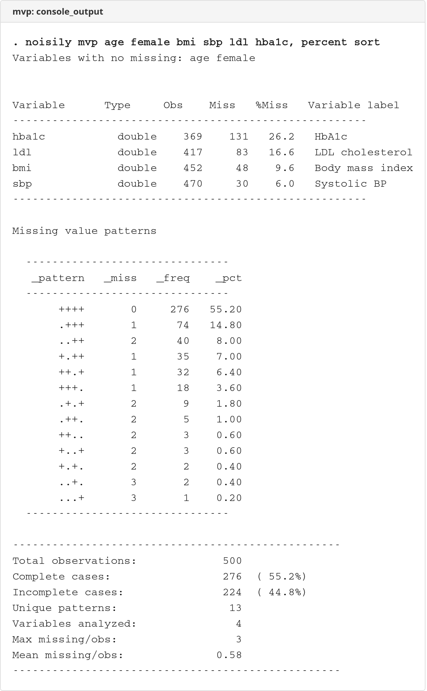
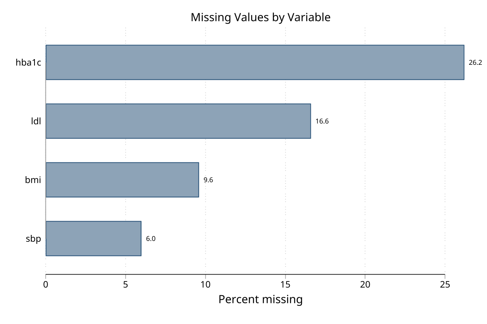
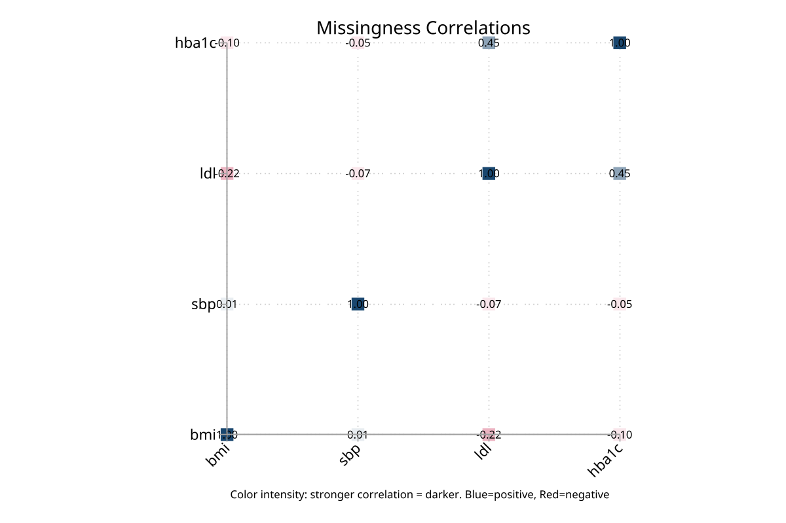

# mvp - Missing Value Pattern Analysis for Stata

**Version 1.0.0** | 2026-04-08

`mvp` analyzes missing-data structure across variables, reports distinct missingness patterns, and can graph missingness as bar charts, pattern-frequency charts, observation-by-variable heatmaps, and missingness-correlation heatmaps. It is a Stata 16+ fork of `mvpatterns` with added graphing, stratification, generated indicators, and monotone-pattern diagnostics.

## Requirements

- Stata 16 or later

## Installation

```stata
capture ado uninstall mvp
net install mvp, from("https://raw.githubusercontent.com/tpcopeland/Stata-Tools/main/mvp") replace
```

## Commands

| Command | Description |
|---------|-------------|
| `mvp` | Summarize, test, save, and graph missing value patterns |

## Quick Start

### 1. Inspect missingness in a built-in dataset

```stata
sysuse auto, clear
mvp price mpg rep78, percent sort
```

This prints the pattern table. In the pattern display, `+` means observed and `.` means missing. `sort` orders the variables by missingness so the sparsest variables are easiest to spot.

### 2. Add a quick graph

```stata
mvp price mpg rep78, graph(bar) sort
```

This switches from the table to a bar chart of percent missing by variable.

## How It Works

- If you omit `varlist`, `mvp` analyzes all variables in memory.
- `generate(stub)` creates per-variable missingness indicators plus `stub_pattern` and `stub_nmiss`.
- `save(name)` saves the pattern dataset either to a frame or to a `.dta` file, depending on the name you supply.
- `graph(bar)`, `graph(patterns)`, `graph(matrix)`, and `graph(correlation)` provide four complementary views of missingness.
- `gby()` and `over()` compare missingness across groups when you are graphing results.
- `monotone` tests whether the missing-data structure is monotone, which is useful when planning imputation workflows.

## Worked Examples

### 1. Built-in workflow with `sysuse auto`

`sysuse auto` is a good first check because `rep78` contains missing values and the example runs immediately after installation.

```stata
sysuse auto, clear

* Tabular overview
mvp price mpg rep78 headroom trunk, percent sort

* Generate indicators for follow-up work
mvp price mpg rep78, generate(m)
tab m_pattern

* Visualize percent missing
mvp price mpg rep78 headroom trunk, graph(bar) sort
```

Use this pattern when you want a quick missing-data audit before modeling or imputation planning.

### 2. Richer graph workflow with a small synthetic dataset

For heatmaps, correlations, and grouped displays, it helps to have several variables with different missingness rates. The block below creates that kind of dataset directly in Stata.

```stata
clear
set seed 12345
set obs 300

gen age = rnormal(50, 12)
gen female = runiform() < 0.5
gen bmi = rnormal(27, 5)
gen sbp = rnormal(130, 18)
gen ldl = rnormal(3.5, 1.1)
gen hba1c = rnormal(5.8, 0.9)

replace bmi = . if runiform() < 0.08
replace sbp = . if runiform() < 0.05
replace ldl = . if runiform() < 0.15
replace hba1c = . if runiform() < 0.20
replace hba1c = . if missing(ldl) & runiform() < 0.4

* Full console summary
mvp age female bmi sbp ldl hba1c, percent sort monotone correlate

* Grouped view by sex
mvp bmi sbp ldl hba1c, graph(bar) gby(female)

* Correlation heatmap of missingness indicators
mvp bmi sbp ldl hba1c, graph(correlation) textlabels
```

This example is useful when you want to see whether missingness clusters by variable, co-occurs across variables, or differs across subgroups.

## Selected Returned Results

`mvp` stores several useful summaries in `r()`, including:

- `r(N)` - observations analyzed
- `r(N_complete)` and `r(N_incomplete)` - complete and incomplete cases
- `r(N_patterns)` - number of unique missingness patterns
- `r(N_vars)` - number of variables analyzed
- `r(monotone_status)` - monotone or non-monotone when `monotone` is requested
- `r(corr_miss)` - missingness correlation matrix when `correlate` or `graph(correlation)` is used

## Screenshots

### Console summary



### Missingness bar chart



### Correlation heatmap



## Author

Timothy P Copeland, Karolinska Institutet

Fork of `mvpatterns` by Jeroen Weesie (STB-61: dm91).

## License

MIT
