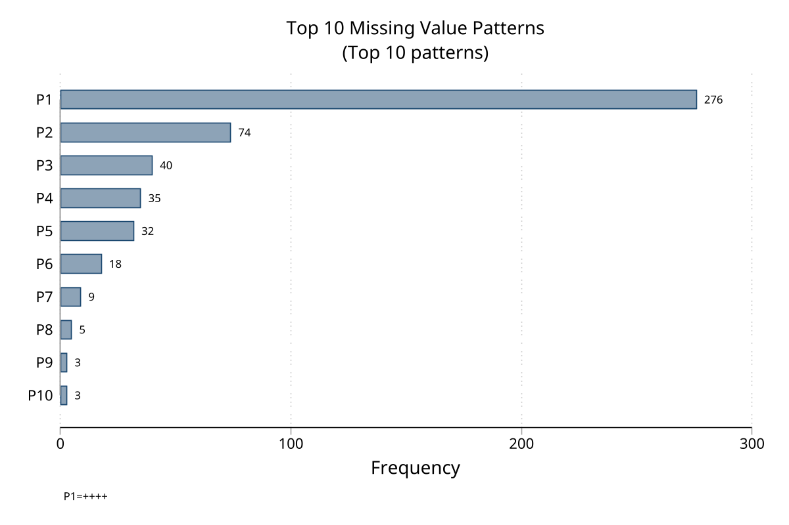
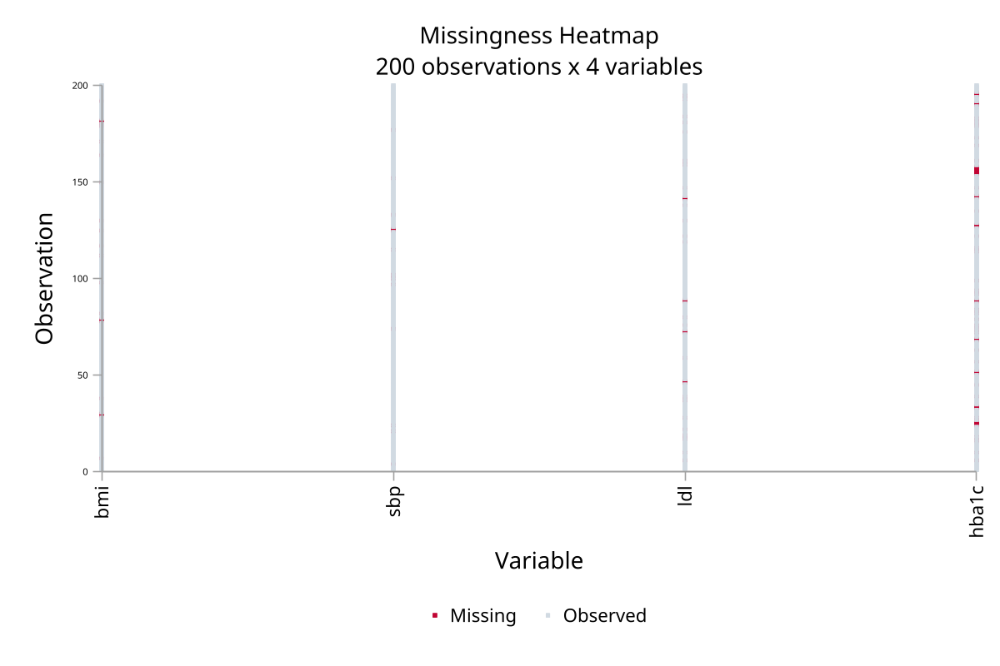
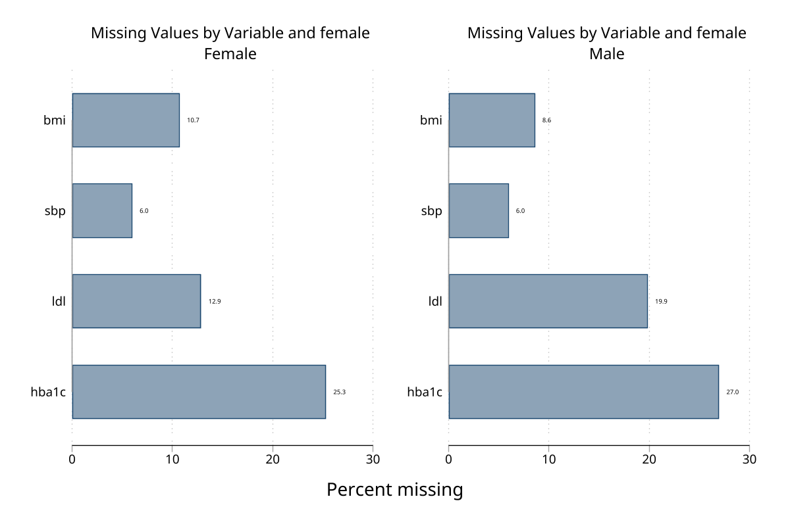
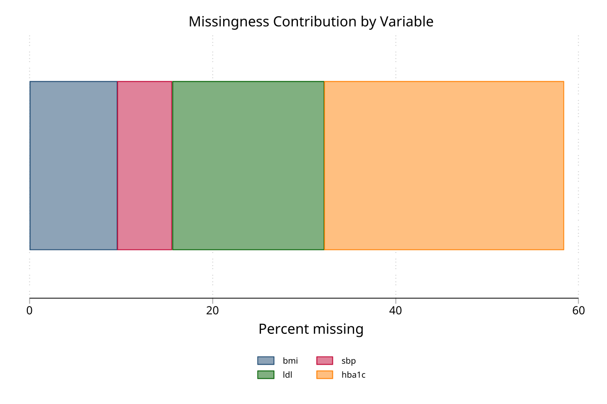
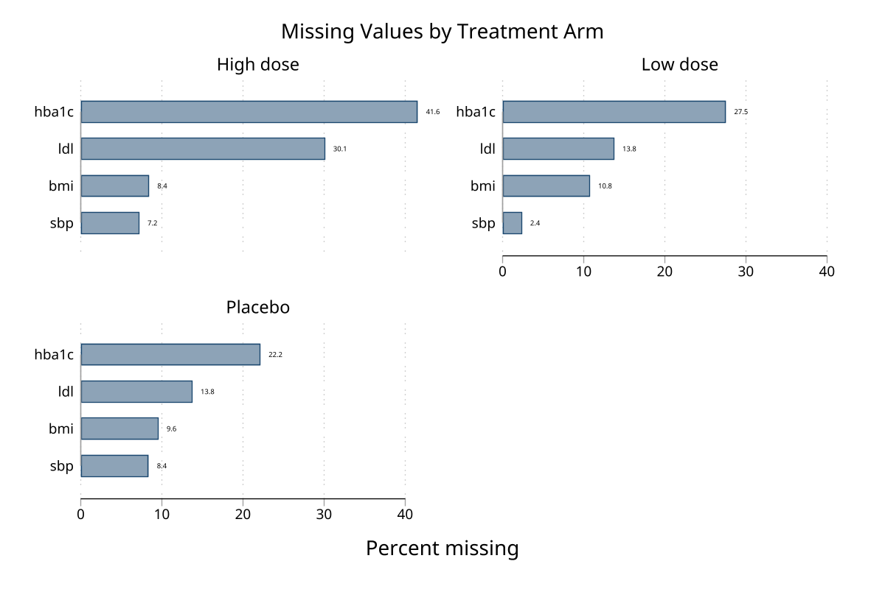
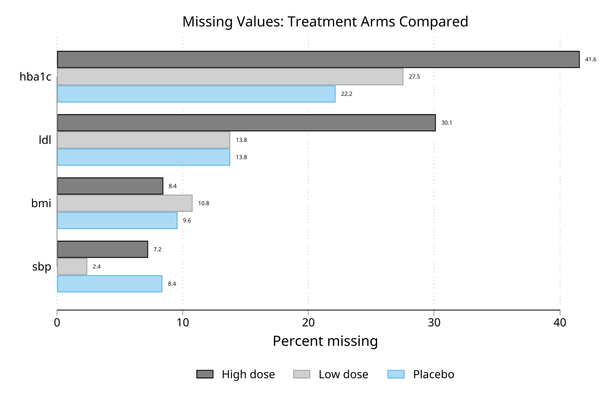
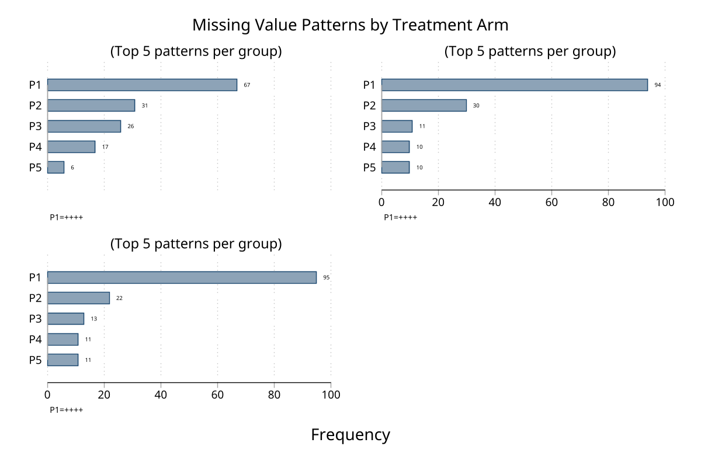

# mvp - Missing value pattern analysis and graphics for Stata

**Version 1.0.0** | 2026-04-08

`mvp` analyzes missing-data structure across variables, reports distinct missingness patterns, and can graph missingness as bar charts, pattern-frequency charts, observation-by-variable heatmaps, and missingness-correlation heatmaps. It is a Stata 16+ fork of `mvpatterns` with added graphing, stratification, generated indicators, and monotone-pattern diagnostics.

## Requirements

- Stata 16 or later
- No external dependencies. When `tetrachoric` is unavailable, `mvp, correlate` falls back to Pearson correlations among missingness indicators.

## Installation

```stata
capture ado uninstall mvp
net install mvp, from("https://raw.githubusercontent.com/tpcopeland/Stata-Tools/main/mvp") replace
```

## Commands

| Command | Description |
|---------|-------------|
| `mvp` | Summarize, test, save, and graph missing value patterns |

## How It Works

- If you omit `varlist`, `mvp` analyzes all variables in memory and drops variables with no missing values from the pattern display unless you specify `nodrop`.
- The main text output has two layers: a variable-level missingness summary and a pattern table where `+` means observed and `.` means missing.
- `generate(stub)` creates one missingness indicator per analyzed variable plus `stub_pattern` and `stub_nmiss` for downstream analysis.
- `save(name)` stores the pattern dataset either in a Stata frame or in a `.dta` file, depending on the name you supply.
- `graph(bar)`, `graph(patterns)`, `graph(matrix)`, and `graph(correlation)` provide four complementary views of missingness. `gby()` and `over()` let you compare groups inside the graph workflows.

## Worked Examples

### 1. Quick audit of missingness in a built-in dataset

`sysuse auto` is a good first check because `rep78` has missing values and the example runs immediately after installation.

```stata
sysuse auto, clear
mvp price mpg rep78 headroom trunk, percent sort
```

Use this pattern when you want a fast table of missingness by variable and by pattern before modeling or imputation planning.

### 2. Generate missingness indicators and save the pattern data

This workflow is useful when you want to reuse the missingness structure later in the same Stata session.

```stata
sysuse auto, clear
mvp price mpg rep78, generate(m) save(patterns)
tab m_pattern
frame patterns: list
```

### 3. Compare missingness across groups with a graph

`gby()` creates faceted graphs so you can see whether missingness changes across categories.

```stata
sysuse auto, clear
mvp price mpg rep78, graph(bar) gby(foreign)
```

### 4. Check monotonicity and co-occurring missingness in a richer synthetic example

For monotone checks and correlation heatmaps, it helps to have several variables with distinct missingness rates.

```stata
clear
set seed 12345
set obs 300

gen age = rnormal(50, 12)
gen female = runiform() < 0.5
gen bmi = rnormal(27, 5)
gen sbp = rnormal(130, 18)
gen ldl = rnormal(3.5, 1.1)
gen hba1c = rnormal(5.8, 0.9)

replace bmi = . if runiform() < 0.08
replace sbp = . if runiform() < 0.05
replace ldl = . if runiform() < 0.15
replace hba1c = . if runiform() < 0.20
replace hba1c = . if missing(ldl) & runiform() < 0.4

mvp age female bmi sbp ldl hba1c, percent sort monotone correlate
mvp bmi sbp ldl hba1c, graph(correlation) textlabels
```

## Graph Workflows

| Workflow | What it shows |
|----------|----------------|
| `graph(bar)` | Percent missing by variable |
| `graph(patterns)` | Frequencies of the most common missingness patterns |
| `graph(matrix)` | Observation-by-variable missingness heatmap |
| `graph(correlation)` | Correlation matrix of missingness indicators |

For large datasets, `graph(matrix)` samples 500 observations by default. Use `graph(matrix, sample(#))` to change that, and add `sort` inside `graph(matrix, sort)` when you want observations grouped by pattern.

## Demo

### Graph gallery

<details>
<summary>Bar chart — % missing by variable (click to expand)</summary>


</details>

<details>
<summary>Pattern frequency chart — top 10 patterns</summary>



</details>

<details>
<summary>Matrix heatmap — observation × variable</summary>



</details>

<details>
<summary>Correlation heatmap — missingness indicators</summary>


</details>

<details>
<summary>Stratified bar chart — by sex (2 groups)</summary>



</details>

<details>
<summary>Stacked bar chart — variable contributions</summary>



</details>

### Multiple treatment groups

The `gby()` and `over()` options support any number of groups. Here the dataset has 3 treatment arms (Placebo, Low dose, High dose) with the high-dose arm receiving extra lab dropout missingness.

<details>
<summary>Faceted bar chart — gby(arm) (click to expand)</summary>



</details>

<details>
<summary>Overlay bar chart — over(arm)</summary>



</details>

<details>
<summary>Faceted pattern chart — gby(arm)</summary>



</details>

Regenerate with:

```stata
do mvp/demo/demo_mvp.do
```

## Selected Returned Results

`mvp` stores several useful summaries in `r()`, including:

- `r(N)`: observations analyzed
- `r(N_complete)` and `r(N_incomplete)`: complete and incomplete cases
- `r(N_patterns)`: number of unique patterns displayed
- `r(N_vars)`: number of variables analyzed
- `r(varlist)`: analyzed variables with missing values
- `r(monotone_status)`: monotone or non-monotone when `monotone` is requested
- `r(corr_miss)`: missingness correlation matrix when `correlate` or `graph(correlation)` is used

## Version History

- **1.0.0** (2026-04-08): Initial Stata-Tools release of the enhanced `mvpatterns` fork with graphics, generated indicators, saved pattern data, and monotone diagnostics.

## Author

Timothy P Copeland, Karolinska Institutet

Fork of `mvpatterns` version 2.0.0 by Jeroen Weesie.
