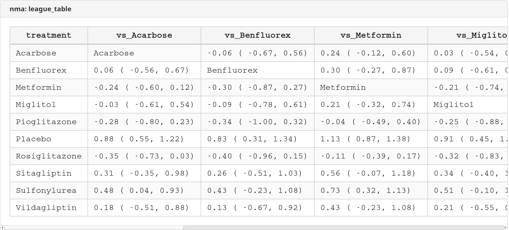

# nma — Network Meta-Analysis for Stata

 

**Version 1.0.4** | 2026-03-03

A comprehensive Stata package for network meta-analysis (mixed treatment comparisons) with **zero external dependencies**. All statistical computation is built-in using Mata, including the multivariate REML engine.

## Table of Contents

- [Installation](#installation)
- [Quick Start](#quick-start)
- [Commands](#commands)
- [The Pipeline](#the-pipeline)
- [Data Formats](#data-formats)
- [Command Reference](#command-reference)
  - [nma_setup](#nma_setup)
  - [nma_import](#nma_import)
  - [nma_fit](#nma_fit)
  - [nma_forest](#nma_forest)
  - [nma_map](#nma_map)
  - [nma_rank](#nma_rank)
  - [nma_compare](#nma_compare)
  - [nma_inconsistency](#nma_inconsistency)
  - [nma_report](#nma_report)
- [Worked Example](#worked-example-senn-et-al-2013-diabetes-nma)
- [Stored Results](#stored-results)
- [References](#references)
- [Version](#version)

---

## Installation

```stata
net install nma, from("https://raw.githubusercontent.com/tpcopeland/Stata-Tools/main/nma/")
```

No external packages required. No Mata library downloads. Everything is self-contained.

---

## Quick Start

```stata
* Binary outcomes (arm-level data: events and totals)
nma_setup events total, studyvar(study) trtvar(treatment)
nma_fit
nma_forest, eform textcol

* Pre-computed effects (contrast-level data: log OR + SE)
nma_import log_or se, studyvar(study) treat1(drug_a) treat2(drug_b) measure(or)
nma_fit, eform
nma_rank, plot cumulative
```

---

## Commands

| Command | Purpose |
|---------|---------|
| `nma` | Package overview and workflow guide |
| `nma_setup` | Import arm-level summary data (events/totals, mean/SD/n, events/person-time) |
| `nma_import` | Import pre-computed effect sizes (log OR, HR, MD, etc.) |
| `nma_fit` | Fit consistency model (REML or ML) |
| `nma_forest` | Evidence decomposition forest plot |
| `nma_map` | Network geometry visualization |
| `nma_rank` | Treatment rankings (SUCRA) with rankograms |
| `nma_compare` | League table of all pairwise comparisons |
| `nma_inconsistency` | Global test + node-splitting |
| `nma_report` | Publication export (Excel/CSV) |

---

## The Pipeline

```
   Arm-level data                   Contrast-level data
   (events, totals)                 (effect, SE)
        │                                │
        ▼                                ▼
   nma_setup                        nma_import
        │                                │
        └──────────┬─────────────────────┘
                   │
                   ▼
               nma_map ◄──── Network geometry (can run before fit)
                   │
                   ▼
               nma_fit ◄──── REML/ML consistency model
                   │
          ┌────────┼────────────┬──────────────┐
          ▼        ▼            ▼              ▼
     nma_forest  nma_rank   nma_compare   nma_inconsistency
          │        │            │              │
          └────────┴────────────┴──────────────┘
                              │
                              ▼
                         nma_report ◄── Excel/CSV export
```

**Start** with either `nma_setup` (arm-level data) or `nma_import` (contrast-level data). Both compute treatment contrasts and validate the network. Then `nma_fit` to estimate, and any combination of post-estimation commands.

---

## Data Formats

### Arm-level (one row per arm per study)

Use `nma_setup`. Auto-detects outcome type from the number of variables:

| Outcome type | Variables | Example |
|-------------|-----------|---------|
| Binary | 2: `events total` | `nma_setup d n, studyvar(study) trtvar(trt)` |
| Continuous | 3: `mean sd n` | `nma_setup mean sd n, studyvar(study) trtvar(trt)` |
| Rate | 2 + `measure(irr)` | `nma_setup events pyears, studyvar(study) trtvar(trt) measure(irr)` |

```
┌────────┬───────────┬────────┬───────┐
│ study  │ treatment │ events │ total │
├────────┼───────────┼────────┼───────┤
│ Study1 │ DrugA     │     15 │   100 │
│ Study1 │ Placebo   │     10 │   100 │
│ Study2 │ DrugA     │     12 │   110 │
│ Study2 │ DrugB     │      8 │   105 │
└────────┴───────────┴────────┴───────┘
```

### Contrast-level (one row per pairwise comparison)

Use `nma_import`. For pre-computed log ORs, log HRs, mean differences, etc.

```
┌────────┬─────────┬─────────┬────────┬──────┐
│ study  │ treat_a │ treat_b │ log_or │   se │
├────────┼─────────┼─────────┼────────┼──────┤
│ Study1 │ DrugA   │ Placebo │   0.50 │ 0.20 │
│ Study2 │ DrugB   │ Placebo │   0.30 │ 0.25 │
└────────┴─────────┴─────────┴────────┴──────┘
```

---

## Command Reference

### nma_setup

Imports arm-level summary data and prepares for NMA.

**Syntax:**
```stata
nma_setup varlist [if] [in], studyvar(varname) trtvar(varname)
    [ref(string) measure(string) zcorrection(#) force]
```

| Option | Description |
|--------|-------------|
| `studyvar(varname)` | Study identifier (**required**) |
| `trtvar(varname)` | Treatment identifier (**required**) |
| `ref(string)` | Reference treatment; default is most connected |
| `measure(string)` | Effect measure: `or` (default), `rr`, `rd`, `md`, `smd`, `irr` |
| `zcorrection(#)` | Continuity correction for zero cells; default `0.5` |
| `force` | Allow disconnected networks |

**Smart defaults:**
- Auto-selects the most connected treatment as reference
- Detects multi-arm studies and builds proper variance-covariance structure
- Applies zero-cell correction automatically when needed
- Validates network connectivity and reports disconnected components

---

### nma_import

Imports pre-computed effect sizes (e.g., from Cox models, adjusted analyses).

**Syntax:**
```stata
nma_import effect se [if] [in], studyvar(varname) treat1(varname)
    treat2(varname) [ref(string) measure(string) covariance(varname) force]
```

| Option | Description |
|--------|-------------|
| `studyvar(varname)` | Study identifier (**required**) |
| `treat1(varname)` | First treatment (**required**) |
| `treat2(varname)` | Second treatment (**required**) |
| `ref(string)` | Reference treatment |
| `measure(string)` | Effect measure label (for display) |
| `covariance(varname)` | Within-study covariance for multi-arm studies |

---

### nma_fit

Fits the network meta-analysis consistency model via multivariate random-effects meta-analysis.

**Syntax:**
```stata
nma_fit [, method(string) common level(#) iterate(#) tolerance(#) nolog eform digits(#)]
```

| Option | Description |
|--------|-------------|
| `method(string)` | `reml` (default) or `ml` |
| `common` | Fixed-effect model (no between-study heterogeneity) |
| `eform` | Display exponentiated coefficients (OR, RR, HR) |
| `nolog` | Suppress iteration log |
| `level(#)` | Confidence level; default `95` |
| `digits(#)` | Decimal places; default `4` |

**Method:** Custom Mata REML engine using Newton-Raphson with Cholesky parameterization of the between-study variance matrix. Results posted to `e()` — standard Stata post-estimation works:

```stata
nma_fit, eform nolog
lincom DrugA - DrugB, eform   // pairwise comparison
test DrugA = DrugB             // hypothesis test
```

---

### nma_forest

Evidence decomposition forest plot showing direct, indirect, and network estimates.

**Syntax:**
```stata
nma_forest [, eform level(#) comparisons(string) textcol dp(#)
    colors(colorlist) diamond xlabel(numlist) xtitle(string)
    title(string) scheme(string) saving(filename) replace]
```

| Option | Description |
|--------|-------------|
| `eform` | Exponentiated scale (OR, RR, HR) |
| `comparisons(string)` | `all` (default) or `mixed` (only mixed-evidence pairs) |
| `textcol` | Show numeric estimates beside each row |
| `dp(#)` | Decimal places for text column; default `2` |
| `colors(colorlist)` | Colors for direct, indirect, network; default `forest_green dkorange navy` |
| `diamond` | Diamond shape for network estimates |

**What it shows:**
- Direct evidence only: Direct + Network estimates
- Indirect evidence only: Indirect estimate
- Mixed evidence: Direct + Indirect + Network (all three)

---

### nma_map

Network geometry plot. Nodes = treatments, edges = direct comparisons.

**Syntax:**
```stata
nma_map [, nodesize(string) edgesize(string) nolabels
    scheme(string) title(string) saving(filename) replace]
```

Can run immediately after `nma_setup`/`nma_import` — does not require a fitted model.

---

### nma_rank

Treatment rankings via Monte Carlo simulation from the joint posterior distribution.

**Syntax:**
```stata
nma_rank [, best(string) reps(#) seed(#) plot cumulative
    scheme(string) saving(filename) replace]
```

| Option | Description |
|--------|-------------|
| `best(string)` | `max` (default) or `min` — which direction is better |
| `reps(#)` | MC replications; default `10000` |
| `seed(#)` | Random seed |
| `plot` | Draw rankogram |
| `cumulative` | Cumulative rankogram (requires `plot`) |

**SUCRA** (Surface Under the Cumulative RAnking curve): 100% = always best, 0% = always worst.

---

### nma_compare

League table of all K x K pairwise comparisons with CIs.

**Syntax:**
```stata
nma_compare [, eform digits(#) level(#) saving(filename)
    format(string) replace]
```

Cell (i, j) shows the effect of treatment i versus treatment j. Indirect-only comparisons marked with `*`.

---

### nma_inconsistency

Tests the consistency (transitivity) assumption.

**Syntax:**
```stata
nma_inconsistency [, method(string) level(#)]
```

| Method | What it tests |
|--------|---------------|
| `global` | Chi-squared test: consistency vs. inconsistency model |
| `nodesplit` | Per-comparison: direct vs. indirect estimate for mixed-evidence pairs |
| `both` (default) | Both tests |

---

### nma_report

Exports a structured report to Excel or CSV.

**Syntax:**
```stata
nma_report using filename [, format(string) eform replace
    sections(string) level(#) digits(#)]
```

| Option | Description |
|--------|-------------|
| `format(string)` | `excel` (default) or `csv` |
| `sections(string)` | Which sections: `setup fit rank` |
| `eform` | Exponentiated effects |

---

## Worked Example: Senn et al. (2013) Diabetes NMA

26 studies, 10 glucose-lowering treatments, HbA1c mean difference. REML estimates match R `netmeta` to 3 decimal places.

```stata
* Load the dataset
use nma/qa/data/senn2013_diabetes.dta, clear

* Import pre-computed treatment effects
nma_import te se_te, studyvar(study) treat1(treat1) treat2(treat2) ///
    measure(md) ref(Placebo)
```


```stata
* Visualize the network
nma_map, scheme(white_tableau)
```


```stata
* Fit the consistency model (REML)
nma_fit
```


```stata
* Evidence decomposition forest plot
nma_forest, comparisons(mixed) textcol
```


```stata
* Treatment rankings (lower HbA1c is better)
nma_rank, best(min) plot cumulative scheme(white_tableau)
```


```stata
* League table and inconsistency testing
nma_compare
nma_inconsistency
```




```stata
* Export full report
nma_report using nma_report.xlsx, replace
```


---

## Stored Results

### nma_setup / nma_import → r()

| Result | Description |
|--------|-------------|
| `r(n_studies)` | Number of studies |
| `r(n_treatments)` | Number of treatments |
| `r(n_comparisons)` | Number of direct comparisons |
| `r(n_direct)` / `r(n_indirect)` / `r(n_mixed)` | Evidence counts |
| `r(connected)` | 1 if network connected |
| `r(treatments)` | Space-separated treatment list |
| `r(ref)` | Reference treatment |
| `r(measure)` | Effect measure |
| `r(outcome_type)` | `binary`, `continuous`, or `rate` |
| `r(evidence)` | K x K evidence classification matrix |
| `r(adjacency)` | K x K adjacency matrix |

### nma_fit → e()

| Result | Description |
|--------|-------------|
| `e(b)` | Coefficient vector (vs. reference) |
| `e(V)` | Variance-covariance matrix |
| `e(Sigma)` | Between-study variance matrix |
| `e(tau2)` | Between-study variance |
| `e(I2)` | I-squared heterogeneity |
| `e(ll)` | Log-likelihood |
| `e(converged)` | 1 if converged |
| `e(k)` | Number of treatments |
| `e(n_studies)` | Number of studies |
| `e(cmd)` | `nma_fit` |
| `e(method)` | `reml` or `ml` |
| `e(ref)` | Reference treatment |

### nma_rank → r()

| Result | Description |
|--------|-------------|
| `r(sucra)` | K x 1 SUCRA values |
| `r(meanrank)` | K x 1 mean ranks |
| `r(rankprob)` | K x K rank probability matrix |

### nma_compare → r()

| Result | Description |
|--------|-------------|
| `r(effects)` | K x K effect matrix |
| `r(se)` | K x K SE matrix |
| `r(ci_lo)` / `r(ci_hi)` | K x K CI bounds |

### nma_inconsistency → r()

| Result | Description |
|--------|-------------|
| `r(chi2)` | Global chi-squared statistic |
| `r(chi2_df)` | Degrees of freedom |
| `r(chi2_p)` | P-value |
| `r(n_nodesplit)` | Node-split comparisons tested |

### nma_forest → r()

| Result | Description |
|--------|-------------|
| `r(n_comparisons)` | Pairs displayed |
| `r(n_direct)` / `r(n_indirect)` / `r(n_mixed)` | Evidence breakdown |

---

## Validation

The `qa/` directory contains **78 tests** across 3 files, all passing.

```
qa/
├── test_nma.do              # 36 functional tests
├── validation_nma.do        # 26 published-dataset validations
├── crossval_nma_vs_r.do     # 16 cross-validations against R netmeta
├── crossval_nma_vs_r.xlsx   # Cross-validation results (auto-generated)
├── 01_r_netmeta.R           # R script to regenerate benchmarks
├── r_results/               # R benchmark CSVs (senn2013, dogliotti2014)
└── data/                    # Test datasets (.dta)
```

### Functional tests (test_nma.do — 36 tests)

Covers all commands: `nma_setup` (binary/continuous), `nma_import`, `nma_fit` (REML/ML/common-effect), `nma_rank` (SUCRA bounds), `nma_compare` (league table dimensions), `nma_inconsistency`, `nma_forest`, `nma_map`, `nma_report`, zero-cell correction, disconnected network handling, and error cases.

### Published dataset validation (validation_nma.do — 26 tests)

Validates the full pipeline on two published datasets:

- **V1 — Dogliotti 2014** (13 tests): Binary arm-level data, 20 RCTs, 8 treatments (stroke in AF). Setup counts, reference selection, zero-cell handling, coefficient count and direction (all logOR < 0 vs Placebo), VKA range check, tau² bounds, SUCRA (Dab150 > 0.7), league table, inconsistency, eform display, common-effect tau²=0.
- **V2 — Senn 2013** (13 tests): Contrast-level continuous, 26 studies, 10 treatments (HbA1c MD). Setup counts, reference auto-selection, coefficient direction (all MD < 0 vs Placebo), Rosiglitazone and Metformin range checks, tau² bounds, SUCRA ordering (Sitagliptin < Rosiglitazone), league table, inconsistency, common-effect tau²=0.

### R `netmeta` cross-validation (crossval_nma_vs_r.do — 16 comparisons)

Cross-validates treatment effect estimates against R `netmeta` 3.3-1 using both datasets. Companion R script (`01_r_netmeta.R`) regenerates benchmarks; results exported to `crossval_nma_vs_r.xlsx`.

**Senn 2013 (9 comparisons, MD scale):** All 9 treatment effects (vs. Placebo) match R within tolerance of 0.05 (e.g., Acarbose: 0.858, Metformin: 1.132, Rosiglitazone: 1.235). Benfluorex (0.096 difference) flagged as tau²-sensitive (only 2 studies). Heterogeneity estimates differ as expected — R uses graph-theoretical REML (Rücker 2012) while Stata uses multivariate REML — but treatment effects converge.

**Dogliotti 2014 (7 comparisons, logOR scale):** All 7 treatment effects match R within 0.05 tolerance (e.g., Apixaban: 1.103, Dab150: 1.322, Rivarox: 1.136). Very low heterogeneity (tau² ≈ 0.016).

## Features

- **Zero dependencies**: All computation in Mata — no R, no external packages
- **Three outcome types**: Binary (events/totals), continuous (mean/SD/n), rate (events/person-time)
- **Pre-computed effects**: Import log ORs, HRs, MDs from any source
- **Smart defaults**: Auto-selects most connected reference, detects multi-arm studies, applies zero-cell corrections
- **Evidence decomposition**: Every comparison tagged as direct, indirect, or mixed
- **Post-estimation compatible**: `lincom`, `nlcom`, `test` all work after `nma_fit`

## Requirements

- Stata 16.0 or later
- No external packages required

## References

- Kulldorff M, Fang Z, Walsh SJ. A tree-based scan statistic for database disease surveillance. *Biometrics*. 2003;59(2):323-331.
- Rücker G. Network meta-analysis, electrical networks and graph theory. *Research Synthesis Methods*. 2012;3:312-324.
- Senn S, Gavini F, Magrez D, Bretz F. Issues in performing a network meta-analysis. *Statistical Methods in Medical Research*. 2013;22(2):169-189.

## Author

Timothy P. Copeland
Department of Clinical Neuroscience
Karolinska Institutet, Stockholm, Sweden

## License

MIT

## Version

Version 1.0.4, 2026-03-03
