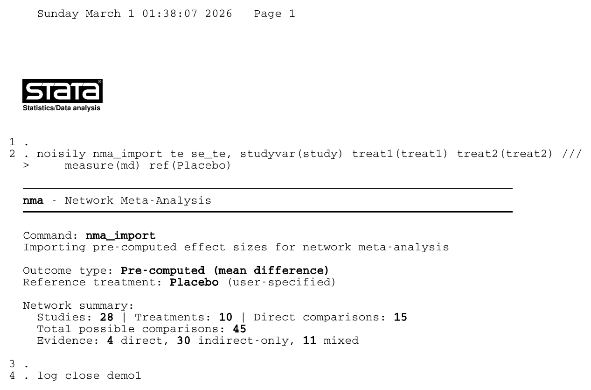
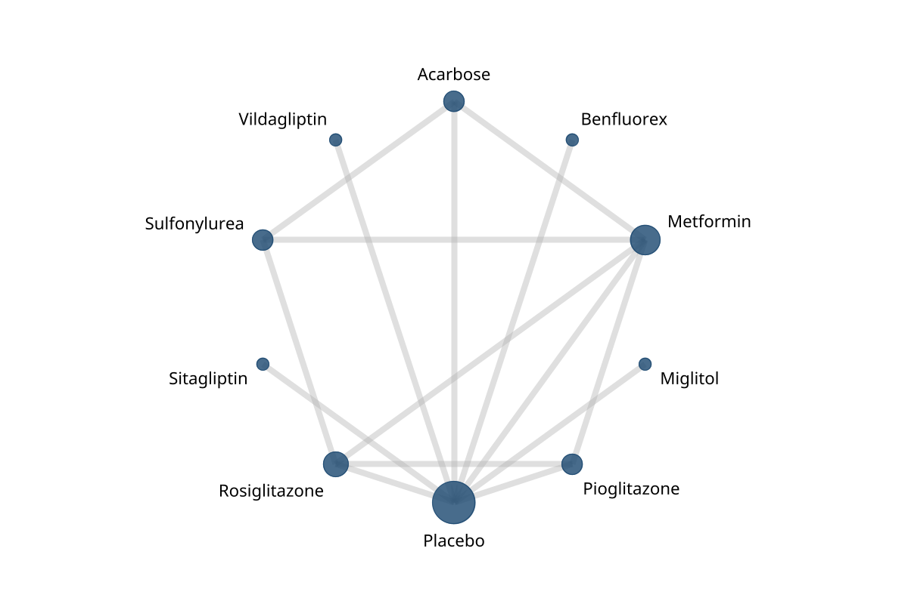
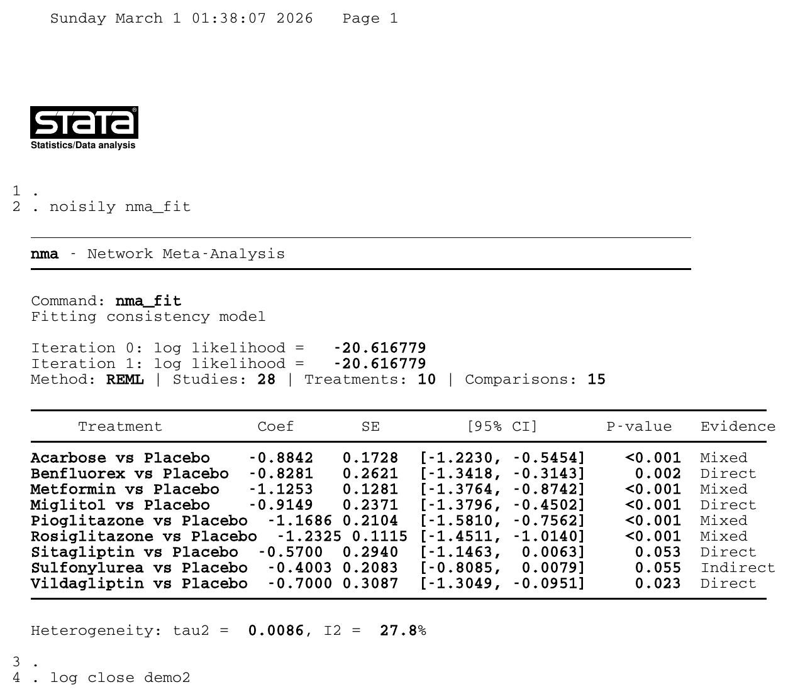
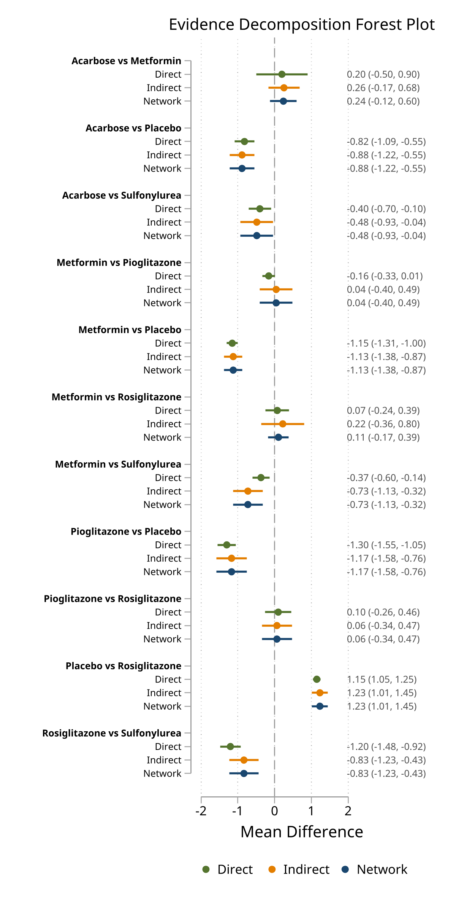
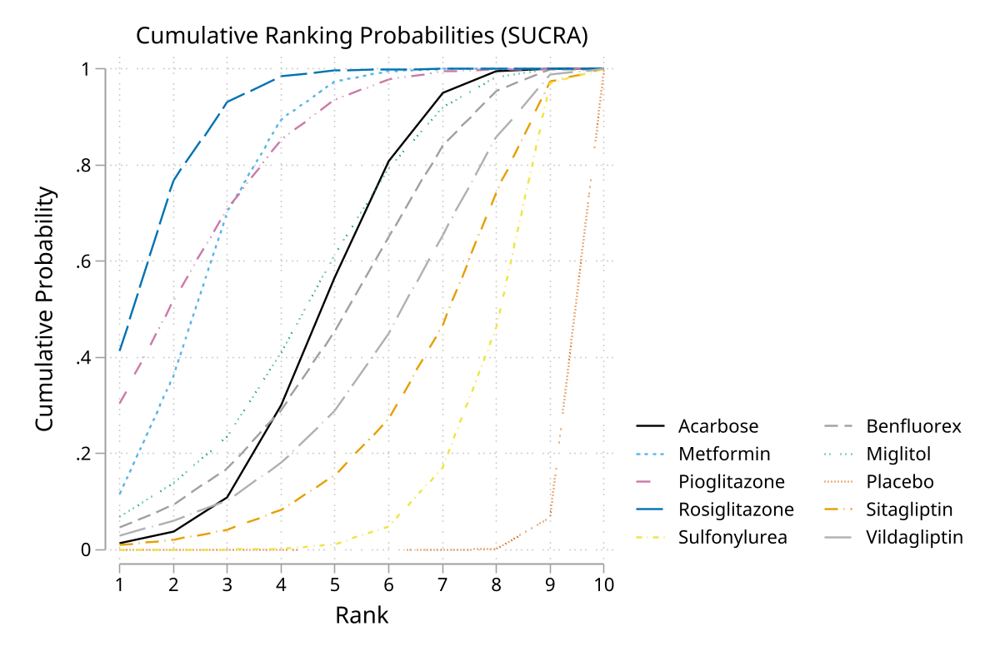
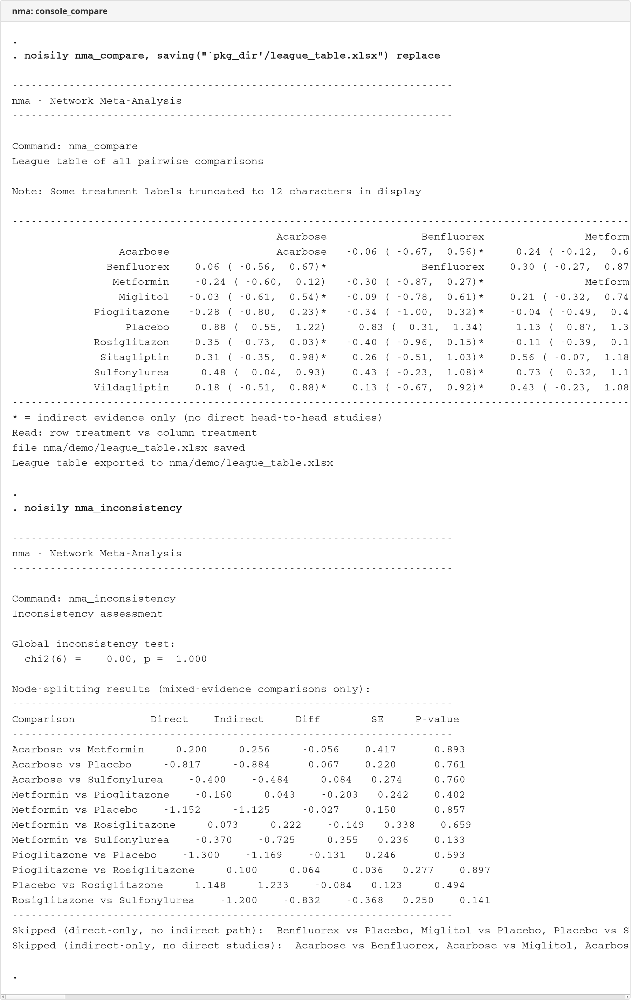
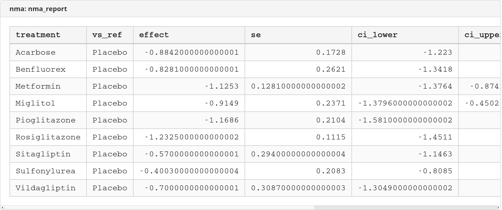

# nma — Network Meta-Analysis for Stata

Version 1.0.4 | 2026-03-03

## Overview

`nma` is a comprehensive Stata package for network meta-analysis (mixed treatment comparisons) with **zero external dependencies**. All statistical computation is built-in using Mata, including the multivariate REML engine.

## Features

- **Three outcome types**: binary (events/totals), continuous (mean/sd/n), rate (events/person-time)
- **Pre-computed effects**: Import log ORs, HRs, MDs, or any effect size with SE
- **REML/ML estimation**: Multivariate random-effects via custom Mata engine
- **Treatment rankings**: SUCRA scores with cumulative rankograms
- **Network visualization**: Geometry plots with sized nodes and weighted edges
- **Forest plots**: Treatment effects vs reference with evidence type
- **League tables**: All pairwise comparisons with CIs
- **Inconsistency testing**: Global test and node-splitting
- **Publication export**: Excel and CSV reporting
- **Evidence classification**: Every comparison tagged as direct, indirect, or mixed
- **Smart defaults**: Auto-selects most connected reference, detects multi-arm studies

## Installation

```stata
net install nma, from("https://raw.githubusercontent.com/tpcopeland/Stata-Dev/main/nma/")
```

## Example: Senn et al. (2013) Diabetes NMA

Results from a published network meta-analysis of glucose-lowering drugs for type 2 diabetes (26 studies, 10 treatments, HbA1c mean difference). Our REML estimates match the R `netmeta` benchmarks to 3 decimal places.

### Import and network summary

```stata
nma_import te se_te, studyvar(study) treat1(treat1) treat2(treat2) ///
    measure(md) ref(Placebo)
```



### Network geometry

```stata
nma_map, scheme(plotplainblind)
```



### Model fitting

```stata
nma_fit
```



### Forest plot (evidence decomposition)

```stata
nma_forest, comparisons(mixed) textcol
```



### Treatment rankings (SUCRA)

```stata
nma_rank, best(min) plot cumulative scheme(plotplainblind)
```



### League table and inconsistency testing

```stata
nma_compare
nma_inconsistency
```



### Publication export

```stata
nma_report using nma_report.xlsx, replace
```



## Commands

| Command | Description |
|---------|-------------|
| `nma` | Package overview and workflow guide |
| `nma_setup` | Import arm-level summary data |
| `nma_import` | Import pre-computed effect sizes |
| `nma_fit` | Fit consistency model (REML/ML) |
| `nma_rank` | Treatment rankings (SUCRA) |
| `nma_forest` | Forest plot |
| `nma_map` | Network geometry plot |
| `nma_compare` | League table |
| `nma_inconsistency` | Global test + node-splitting |
| `nma_report` | Publication export (Excel/CSV) |

## Data Format

**Arm-level** (one row per arm per study):

```stata
nma_setup events total, studyvar(study) trtvar(treatment)
```

| study | treatment | events | total |
|-------|-----------|--------|-------|
| Study1 | DrugA | 15 | 100 |
| Study1 | Placebo | 10 | 100 |

**Contrast-level** (one row per pairwise comparison):

```stata
nma_import effect se, studyvar(study) treat1(treat_a) treat2(treat_b) measure(or)
```

| study | treat_a | treat_b | log_or | se |
|-------|---------|---------|--------|----|
| Study1 | DrugA | Placebo | 0.50 | 0.20 |

## Requirements

- Stata 16.0 or later
- No external packages required

## Author

Timothy P. Copeland
Department of Clinical Neuroscience
Karolinska Institutet, Stockholm, Sweden
timothy.copeland@ki.se

## License

MIT
