# psdash — Propensity Score Diagnostics Dashboard

**Version 1.5.0** | 2026-07-22

Unified diagnostics dashboard for propensity score analyses in Stata. After `teffects`, cross-sectional `tmle`, `iivw_weight`, `logit`/`probit` with manually supplied propensity scores from `predict`, or in fully manual mode, `psdash` assesses the four standard PS diagnostic domains through one command family: overlap between treatment groups (`psdash overlap`), covariate balance before and after weighting (`psdash balance`), weight distribution and effective sample size (`psdash weights`), and common-support regions (`psdash support`). `psdash combined` runs all four and produces a consolidated dashboard. After `ltmle`, `psdash combined` switches to a longitudinal table-first diagnostic instead of running pooled cross-sectional panels.

This package exists because PS diagnostics in Stata are scattered across `tebalance`, user-written helpers, and ad-hoc `summarize`/`tabstat` calls, with each step requiring the analyst to re-specify the treatment variable, covariate list, PS variable, and weighting scheme. `psdash` collapses that friction: when called after `teffects`, cross-sectional `tmle`, or `iivw_weight`, it reads treatment, covariates, propensity scores, and the relevant weighting scheme directly from the estimation or dataset contract. After `logit`/`probit` it still pulls treatment and covariates from the estimation context. In fully manual mode, treatment and PS are passed explicitly; `covariates()` and `wvar()` are supplied to the subcommands that use those inputs. Auto-generated propensity scores and IPTW weights are created as temporary working variables and are not left behind in the user's dataset.

Balance reporting is deliberately richer than the `tebalance summarize` default. `psdash balance` computes raw and weighted standardized mean differences, variance ratios, Kolmogorov-Smirnov statistics, and a Love plot sorted by absolute SMD, with configurable thresholds and Excel export. When a PS is available, it auto-generates IPTW weights for the requested `estimand()` (default ATE) and displays adjusted columns alongside raw columns, so the user sees immediately how much weighting resolves any imbalance — with `nowvar` to suppress weighting and `wvar()` to supply a pre-computed weight variable. Factor and interaction notation (`i.var`, `c.var`, `##`) is expanded into the fitted design columns — one indicator per non-base level, one product per interaction cell — whether supplied through `covariates()` or auto-detected from a fitted `logit`/`probit`/`mlogit`/`teffects` model. Balance is assessed on those design columns rather than on the underlying integer category codes, so categorical and joint-distribution imbalance is not hidden.

The weights subcommand is the complement. `psdash weights` reports mean, SD, range, percentiles, effective sample size, and extreme-weight counts, with on-the-fly `trim(#)`, `truncate(#)`, and `stabilize` modifications exposed through `generate(name)` so the modified weights are kept as a new variable rather than overwriting the original. `psdash support` assesses binary common support via manual thresholds or the Crump et al. (2009) optimal-trimming rule. For multiple treatments, `threshold()` retains a unit only when every component of its generalized propensity-score vector meets the requested practical-positivity floor. All subcommands store results in `r()` and the dashboard output lines use clear status labels plus a "Consider:" action line when follow-up is warranted.

## Quick Start

```stata
sysuse auto, clear
logit foreign mpg weight length
predict double ps, pr
psdash combined foreign ps, covariates(mpg weight length)
```

The combined command uses one complete-case analysis sample for every requested panel and returns `r(N_requested)`, `r(N_analysis)`, and `r(n_common_excluded)`.

## Installation

```stata
* Released version from GitHub:
capture ado uninstall psdash
net install psdash, from("https://raw.githubusercontent.com/tpcopeland/Stata-Tools/main/psdash") replace

* Development install from a local checkout:
capture ado uninstall psdash
net install psdash, from("/path/to/psdash") replace
```

## Requirements

`psdash` requires Stata 16 or later. Core manual, `teffects`, `logit`, `probit`, and `mlogit` workflows have no community-contributed dependency. Automatic producer integration requires the corresponding producer package to be installed so its validity guard can run.

## How It Works

`psdash` is designed to work in nine modes:

- **After `teffects`**: treatment, covariates, propensity scores, and the implied weighting scheme are auto-detected from `e()`. This is the shortest workflow: fit `teffects`, then run `psdash combined` or one of the individual subcommands. The inverse-probability estimators `teffects ipw`, `ipwra`, and `aipw` are supported; `teffects psmatch` is a matching estimator that exposes no propensity-score prediction and is rejected with an explicit error rather than silently diagnosed as IPW. Every panel diagnoses the estimation sample `e(sample)` — observations the fit excluded (via `if`/`in` or missing covariates) are dropped, and `r(n_estimation)`/`r(n_excluded)` report the counts.
- **After cross-sectional `tmle`**: treatment, `_tmle_ps`, covariates, and `estimand()` are read from the tmle contract state. `psdash combined` and individual subcommands can be called without retyping those inputs.
- **After `ltmle`**: run `psdash combined`. It reports period-by-period PS overlap and the contract weight distribution using the LTMLE PS and weight variables. Pooled individual subcommands require explicit variables rather than silently treating the longitudinal data as cross-sectional.
- **After `msm_weight`**: treatment, the per-period treatment propensity `_msm_ps`, the treatment weight `_msm_tw_weight`, and the id/period structure are read from the msm dataset contract. Run `psdash combined` for the longitudinal period-by-period diagnostic; it complements `msm_diagnose` by adding the per-period overlap panel. Pooled subcommands require explicit variables.
- **After `tte_weight ..., save_ps`**: treatment, the saved switch/treatment propensity, the IP weight, and the id/period structure are read from the tte dataset contract. Run `psdash combined` for the longitudinal trial-emulation diagnostic. The `save_ps` option is required so the propensity score survives in the dataset. Pooled subcommands require explicit variables.
- **After `iivw_weight`**: treatment, `_iivw_ps`, treatment-model covariates, and `_iivw_tw` are read from the iivw dataset contract. Run `psdash combined` for treatment-propensity diagnostics, then `iivw_balance` for visit-intensity diagnostics.
- **After `logit`/`probit`**: treatment and covariates are read from the estimation context, but you still supply the PS variable created by `predict`.
- **After `mlogit` (multi-group)**: for multi-valued treatments with nonnegative integer levels, treatment and covariates are auto-detected from `e()`. Run `predict ps1 ps2 ps3, pr` and pass the GPS variables via `psvars(ps1 ps2 ps3)`.
- **Manual mode**: provide treatment and PS explicitly, then pass `covariates()` to balance/combined and `wvar()` to balance/weights/combined when you want to override auto-detection.

### Producer-contract verification and availability

Automatic detection reads the analysis contract that the producing command stamped into the dataset (or `e()`). Those characteristics prove nothing on their own — they can be left behind after rows are dropped, a covariate is edited, or a weight column is overwritten. Before trusting a detected contract, `psdash` calls the producing package's **own validity guard** (`_iivw_check_weighted`, `_msm_check_weighted`, `_tte_get_weight_state`, `_tmle_get_context`, `_ltmle_get_context`), which re-derives the producer's fingerprint and rejects stale or unsigned state. It then checks the stamped contract version against the machine-readable compatibility matrix in `_psdash_contract_info.ado`. Missing, malformed, future, and otherwise unsupported versions fail closed with an explicit compatibility error.

Consequently, a detected integration is only available when the **producing package is installed** so its guard can run:

- **`iivw` and `msm`** are released alongside `psdash` and install from the same repository.
- **`tmle`, `ltmle`, and `tte`** are currently development-only producers. When one of them is not installed, `psdash` cannot verify its contract and refuses it with an explicit "cannot verify the *&lt;source&gt;* analysis contract" message (rather than presenting diagnostics for an unverifiable upstream analysis). Supplying `treatment` and a propensity score explicitly (manual mode) always works and involves no producer guard.

When a PS variable is available, `psdash balance` auto-generates IPTW weights for the requested `estimand()` unless you suppress that with `nowvar` or provide `wvar()` yourself.
Auto-generated propensity scores and weights are temporary working variables and are not left behind in the user's dataset.

## Using psdash with iivw

When `iivw_weight` is run with `treat()` and `treat_cov()`, the treatment propensity model can be diagnosed with `psdash`.

Run `psdash combined` immediately after `iivw_weight` to inspect treatment-propensity overlap, common support, treatment-covariate balance, and treatment-weight distribution. Then run `iivw_balance` for the visit-intensity component. The two diagnostics answer different questions: `psdash` checks treatment positivity and treatment-model balance; `iivw_balance` checks whether visit-intensity weights have enough leverage and whether modeled visit covariates are balanced.

```stata
iivw_weight, id(id) time(months) ///
    visit_cov(age sex bl_edss bl_sdmt) ///
    lagvars(sdmt relapse) ///
    treat(treated) treat_cov(age sex bl_edss bl_sdmt) ///
    truncate(1 99) efron replace nolog

psdash combined, saving(treatment_ps_dashboard.png)
psdash weights, iivwcomponent(final) graph saving(final_fiptiw_weight.png)
iivw_balance, agrefit nolog
iivw_fit sdmt treated age sex bl_edss, timespec(ns(3)) nolog
```

## Using psdash with msm

After `msm_weight` builds inverse-probability-of-treatment weights, the per-period treatment propensity `P(A_t = 1 \mid \text{history})` is kept as `_msm_ps` and the diagnostic contract is recorded in the dataset. Run `psdash combined` with no arguments to get the longitudinal period-by-period overlap and weight-distribution dashboard, then continue the MSM pipeline:

```stata
msm_prepare, id(id) period(period) treatment(treatment) ///
    outcome(outcome) covariates(biomarker comorbidity age sex)
msm_weight, treat_d_cov(biomarker comorbidity age sex) treat_n_cov(age sex) nolog

psdash combined
msm_fit, ...
```

`psdash combined` complements `msm_diagnose`: `msm_diagnose` reports pooled balance, weight summaries, and effective sample size, while `psdash combined` adds the per-period propensity-score overlap panel and a period-by-period weight table. The pooled individual subcommands (`psdash overlap`, `balance`, `weights`, `support`) require explicit treatment and PS variables, since silently pooling the longitudinal data would mix periods.

## Using psdash with tte

After `tte_weight` fits the treatment/switch model in an expanded trial-emulation dataset, pass `save_ps` so the propensity score survives in the data. `psdash combined` then auto-detects the trial arm, the saved propensity score, the IP weight, and the trial/period structure:

```stata
tte_prepare, id(patid) period(period) treatment(treatment) outcome(outcome) ///
    eligible(eligible) censor(censored) covariates(age sex comorbidity biomarker) estimand(PP)
tte_expand, maxfollowup(4) grace(1)
tte_weight, switch_d_cov(age sex comorbidity biomarker) switch_n_cov(age sex) save_ps nolog

psdash combined
```

Without `save_ps`, `psdash` reports that the tte contract does not identify a propensity score and tells you to rerun with `save_ps`. As with msm and ltmle, the pooled individual subcommands require explicit variables.

## What Should I Run?

Most users can start with `psdash combined`. It runs the four diagnostic panels together and prints an overall status line. If one panel raises a caution, rerun that subcommand by itself to inspect the graph, export a table, or create a modified weight/support variable.

| Question | Command | What to look for |
|----------|---------|------------------|
| Do treated and control observations have comparable propensity scores? | `psdash overlap` | Large percentages outside common support, very high AUC, PS values near 0 or 1 |
| Are the covariates balanced after adjustment? | `psdash balance` | Maximum absolute SMD above `threshold()`; variance ratios outside 0.5 to 2.0; large KS statistics |
| Are a few observations dominating the weighted analysis? | `psdash weights` | Low ESS, high coefficient of variation, weights above 10 or 20 |
| Which observations are inside the usable support region? | `psdash support` | Number outside empirical common support and number trimmed by `crump` or `threshold()` |
| Do I need the full dashboard in one step? | `psdash combined` | Overall PASS/FAIL plus every finding and its panel |

## Reading the Output

`psdash` uses the same diagnostics that are common in propensity-score reporting, but it labels the output so a non-specialist can follow the next action:

- **Overlap/support warnings** mean the treatment groups do not share enough comparable observations in part of the propensity-score range. Consider trimming, narrowing the study population, changing the estimand, or revisiting the PS model.
- **Balance warnings** mean one or more observed covariates still differ after adjustment. Consider model revisions, additional covariates or interactions, a different weighting scheme, or reporting the residual imbalance explicitly.
- **Weight warnings** mean the estimated effect may be sensitive to a small number of observations. Consider stabilized weights, percentile trimming, truncation, or an estimand with better support.
- **A PASS or Adequate label is not a causal proof.** It means these observed-diagnostic thresholds were not crossed. Outcome-model assumptions, unmeasured confounding, missing data, and study design still need separate judgment.

## Worked Examples

The README keeps one binary and one multi-group workflow. The installed help file (`help psdash`) remains the authoritative source for complete examples, including `teffects`, ATT, pre-computed weights, focused option examples, and stored-result details.

### 1. Binary manual workflow with `sysuse auto`

Estimate the propensity score with `logit`, save fitted probabilities in `ps`, then run each diagnostic explicitly. Because this is a manual workflow, `balance` is told which covariates to assess.

```stata
sysuse auto, clear
logit foreign mpg weight length
predict double ps, pr
psdash overlap foreign ps
psdash balance foreign ps, covariates(mpg weight length) loveplot
psdash weights foreign ps
psdash support foreign ps, crump generate(in_support)
```

After `logit` or `probit`, treatment and covariates are still available in `e()`, so commands that need only the propensity score can also be called as `psdash overlap ps`, `psdash balance ps, loveplot`, and `psdash weights ps`.

### 2. Multi-group treatment with `mlogit`

When the treatment has more than two levels, estimate generalized propensity scores and pass the K predicted probabilities through `psvars()`.

```stata
clear
set obs 300
set seed 20260506
gen double age = rnormal(60, 10)
gen byte female = runiform() > .5
gen double bmi = rnormal(27, 4)
gen double eta1 = -0.2 + 0.03*(age-60) + 0.25*female - 0.04*(bmi-27)
gen double eta2 = 0.1 - 0.02*(age-60) + 0.02*(bmi-27)
gen double den = 1 + exp(eta1) + exp(eta2)
gen double p0 = 1/den
gen double p1 = exp(eta1)/den
gen double u = runiform()
gen byte arm = cond(u < p0, 0, cond(u < p0 + p1, 1, 2))

mlogit arm age female bmi
predict double ps0 ps1 ps2, pr
psdash overlap arm, psvars(ps0 ps1 ps2)
psdash balance arm, psvars(ps0 ps1 ps2) covariates(age female bmi)
psdash weights arm, psvars(ps0 ps1 ps2) detail
psdash support arm, psvars(ps0 ps1 ps2) threshold(0.1)
psdash balance arm, psvars(ps0 ps1 ps2) covariates(age female bmi) reference(1)
```

For the automatic `teffects` workflow, ATT handling, pre-computed weights, and focused option examples, run `help psdash` after installation.

## Subcommands

| Subcommand | Purpose |
|------------|---------|
| `overlap` | PS density/histogram by treatment group |
| `balance` | SMD balance table + Love plot |
| `weights` | Weight distribution, ESS, extreme weights, trim/stabilize |
| `support` | Common support assessment, Crump optimal trimming |
| `combined` | All diagnostics in a combined dashboard |
| `detect` | Report auto-detection results without running diagnostics |

## Key Options

### Common and multi-group options
- `estimand(ate|att|atc)` - target estimand for generated weights. Default is `ate`; after `teffects`, the value is read from `e(stat)` unless supplied explicitly. For a binary treatment the weights are keyed to the `reference()` (control) arm and are invariant to the arbitrary level coding — `0/1` and, say, `3/5` give identical weights. `atc` is not uniquely defined for a multi-valued treatment (K > 2) and is rejected with an error rather than substituting `ate` weights under an `atc` label; use `att` with `reference()` to target a named arm, or fit a binary contrast.
- `psvars(varlist)` - generalized propensity scores for multi-group treatments, meaning K > 2 or K = 2 with non-0/1 treatment levels. Provide one probability variable per nonnegative integer treatment level, ordered by ascending treatment value.
- `reference(#)` - reference treatment level for pairwise multi-group balance and weight summaries. Default is the smallest observed treatment level.
- `saving(filename)` - save the graph produced by the relevant subcommand. For `combined`, this saves the combined dashboard graph.
- `scheme(schemename)`, `title(string)`, `name(string)`, `graphoptions(string)` - graph styling options where supported by the subcommand.

### overlap
- `histogram` - use overlapping histograms instead of kernel density plots
- `bins(#)` - histogram bins; default is 30
- `bwidth(#)` - kernel density bandwidth; Stata's default is used when omitted
- `nograph` - show the overlap table without drawing a graph
- `xlsx(filename)` - export overlap summary statistics to Excel
- `sheet(string)` - Excel sheet name; default is `"Overlap"`

### balance
- `covariates(varlist)` — covariates to assess (auto-detected if omitted)
- `wvar(varname)` — weight variable (auto-generated from PS if omitted)

> **Default behavior:** When a PS is supplied, `balance` auto-generates IPTW weights for the requested `estimand()` (default: ATE) and displays *adjusted* SMD/VR columns alongside the raw columns. Pass `nowvar` to see raw balance only, or `wvar()` to supply a pre-computed weight variable.
- `matched` - report matched/unweighted balance; mutually exclusive with `wvar()`
- `nowvar`, `noweights` - suppress automatic weight generation and show raw balance only
- `loveplot` — generate Love plot
- `strategies(raw ate att atc)` — overlay SMD under multiple weighting strategies in one Love plot (binary; cobalt-style)
- `distribution(varlist)` — per-covariate kernel-density balance plots by group, with weighted overlays (binary; cobalt `bal.plot`-style)
- `smdmatrix(name)` — save a covariate-by-SMD matrix (raw + adjusted) for `puttab`/`table1_tc`; also returned in `r(smd)`
- `threshold(#)` — SMD threshold (default: 0.1)
- `vrbounds(# #)` — lower/upper variance-ratio bounds for the imbalance count (default: 0.5 2.0). Binary covariates are excluded from the VR count (their VR is fixed by the SMD) and footnoted
- `ks` - display Kolmogorov-Smirnov statistics; raw and (when weighted) a weighted KS from the weighted empirical CDF are stored either way (`r(max_ks_raw)`, `r(max_ks_adj)`)
- `xlsx(filename)` — export to Excel
- `sheet(string)` - Excel sheet name; default is `"Balance"`
- `format(string)` - numeric display format for SMD values; default is `%6.3f`

### weights
- `wvar(varname)` — weight variable (auto-generated from PS if omitted)
- `trim(#)` — trim at percentile (50–99.9)
- `truncate(#)` — cap at fixed value
- `stabilize` — create stabilized weights (valid only for unstabilized 1/PS-scale weights; a note prints when `wvar()` is user-supplied)
- `extreme(# #)` — lower/upper extreme-weight cutoffs (default: 10 20; absolute, so raise for unstabilized ATE weights). Scale-free `r(max_ratio)` (max/mean) is always reported
- `generate(name)` — variable for modified weights
- `replace` - allow `generate()` to replace an existing variable
- `detail` — show percentile distribution
- `graph` — weight distribution histogram
- `xlabel(numlist)` - custom x-axis labels for the histogram
- `xlsx(filename)` — export weight summary statistics to Excel
- `sheet(string)` - Excel sheet name; default is `"Weights"`
- `iivwcomponent(treatment|final|visit)` - choose the stored iivw treatment, final, or visit component for `psdash weights`

### support
- `crump` — Crump et al. (2009) optimal trimming for binary treatments; use `threshold()` for multi-group. The optimal alpha is grid-searched at 0.01 then refined to 0.001
- `threshold(#)` — manual PS trimming threshold, strictly between 0 and 0.5
- `qtrim(#)` — base the common-support region on within-group percentiles (`#`, 100−`#`) instead of the optimistic min–max overlap; strictly between 0 and 50, binary only
- `generate(name)` — create an in-support indicator. With `crump` or `threshold()`, this marks the trimmed region; otherwise it marks the empirical common-support interval.
- `replace` - allow `generate()` to replace an existing variable
- `compare` — report a pre/post-trimming delta (outside-support %, ESS %, max |SMD|); requires trimming, binary only
- `nograph` - show the support table without drawing a graph
- `xlsx(filename)` — export support summary statistics to Excel
- `sheet(string)` - Excel sheet name; default is `"Support"`

### combined
- `nooverlap`, `nobalance`, `noweights`, `nosupport` — suppress panels
- `threshold(#)` — SMD imbalance threshold for the balance panel only
- `overlapmax(#)`, `essmin(#)`, `imbalmax(#)` — configurable verdict thresholds (defaults 10, 50, 0)
- `dryrun` — report auto-detection and exit without running panels (same as `psdash detect`)
- `report(filename)` — write a multi-sheet `.xlsx` workbook (one sheet per panel + a Summary sheet)

### detect
- `psdash detect [treatment] [psvar] [, covariates() wvar() estimand() psvars() reference()]` — run only auto-detection; prints and returns what it resolved, runs no diagnostics

## Stored Results

Each subcommand stores results in `r()`. Technical users can use these values in QA checks, automated reports, or decision rules.

| Subcommand | Key scalars/macros | Matrix |
|------------|--------------------|--------|
| `overlap` | `r(N)`, `r(overlap_lower)`, `r(overlap_upper)`, `r(n_outside)`, `r(pct_outside)`, `r(auc)`, `r(treatment)`, `r(psvar)`, `r(source)` | none |
| `balance` | `r(max_smd_raw)`, `r(max_smd_adj)`, `r(max_vr_raw)`, `r(max_vr_adj)`, `r(max_ks_raw)`, `r(n_imbalanced)`, `r(threshold)`, `r(wvar)`, `r(source)` | `r(balance)`, `r(smd)` |
| `weights` | `r(mean_wt)`, `r(sd_wt)`, `r(cv)`, `r(ess)`, `r(ess_pct)`, `r(n_extreme)`, `r(p1)`, `r(p99)`, `r(wvar)`, `r(source)`, `r(iivwcomponent)`, `r(generate)` | none |
| `support` | `r(lower_bound)`, `r(upper_bound)`, `r(n_outside)`, `r(pct_outside)`, `r(trim_lower)`, `r(trim_upper)`, `r(n_trimmed)`, `r(N_remaining)`, `r(crump_alpha)`, `r(source)`; with `compare`: `r(*_pre)`/`r(*_post)` | none |
| `combined` | Inherits subcommand results via `return add`; also stores `r(verdict)`, `r(n_warnings)`, `r(warnings)`, `r(N_requested)`, `r(N_analysis)`, `r(n_common_excluded)`, `r(overlapmax)`, `r(essmin)`, `r(imbalmax)`, `r(report)`, and source/estimand metadata | inherited when balance runs |
| `detect` | `r(source)`, `r(treatment)`, `r(psvar)`, `r(covariates)`, `r(wvar)`, `r(estimand)`, `r(n_covariates)`, `r(multigroup)`, `r(longitudinal)`, `r(K)`, `r(levels)`, `r(reference)` | none |
| `combined` after `ltmle`/`msm`/`tte` | Stores producer metadata, input/complete/exclusion and missingness counts, overall and minimum period/period-arm ESS, weight diagnostics, and period overlap findings | `r(overlap_by_period)`, `r(weights_by_period)` |

For binary treatments, `r(balance)` has one row per covariate and columns for raw and adjusted means, SMDs, variance ratios, and KS statistics. For multi-group treatments, `r(balance)` has one five-column block per non-reference group, plus adjusted blocks when weights are applied; column names include the compared treatment levels. Excel exports preserve those metrics as numeric cells, include raw and adjusted KS columns, and apply header formatting and readable column widths.

Example:

```stata
psdash balance foreign ps, covariates(mpg weight length)
return list
matrix list r(balance)
* Example decision rule for your own analysis:
* assert r(max_smd_adj) < 0.1
```

## Relationship to Existing Tools

`psdash` consolidates diagnostics that Stata otherwise spreads across `tebalance`, `teoverlap`, and ad-hoc `summarize`/`tabstat` calls. `psdash balance` reports raw and weighted standardized mean differences, variance ratios, and Kolmogorov-Smirnov statistics in one table — richer than the `tebalance summarize` default — while `psdash weights` adds effective sample size, extreme-weight detection, and on-the-fly trimming, truncation, and stabilization that have no direct built-in equivalent. The `overlap` and `support` subcommands round out the four standard PS checks under a single command family.

## Demo

Demo output is generated from `demo/demo_psdash.do`. Run it from the `Stata-Tools` repo root with `stata-mp -b do psdash/demo/demo_psdash.do`.

### Binary treatment (2 groups)

Synthetic data: 800 observations, confounded treatment assignment, propensity scores via `logit`, IPTW weights, a continuous outcome for the automatic `teffects` workflow, and generated support/modified-weight variables.

| Output | Image |
|--------|-------|
| Overlap diagnostics | 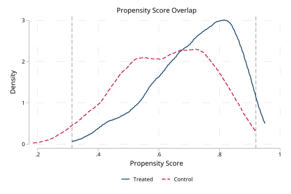 |
| Overlap histogram | 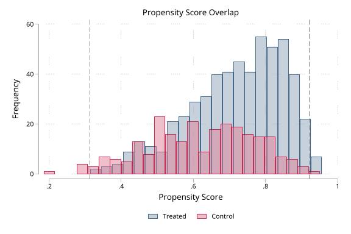 |
| Balance and weight diagnostics | 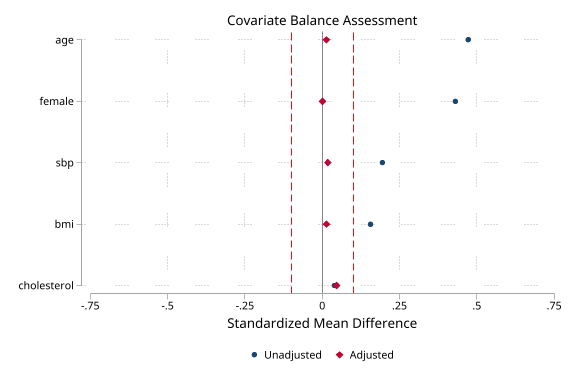 |
| Detailed and modified weights | 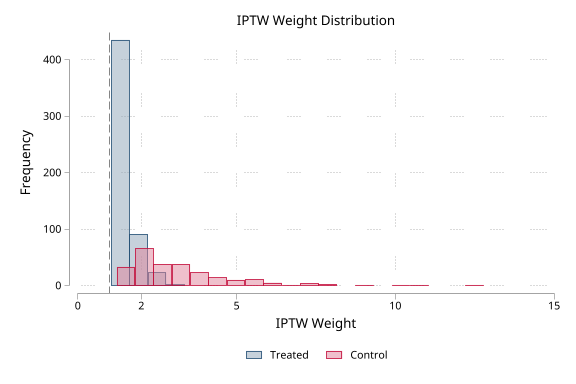 |
| Common support assessment | 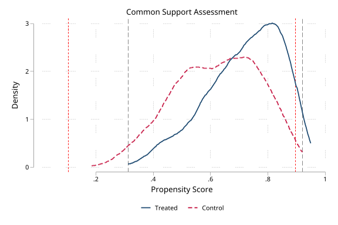 |
| Combined dashboard | 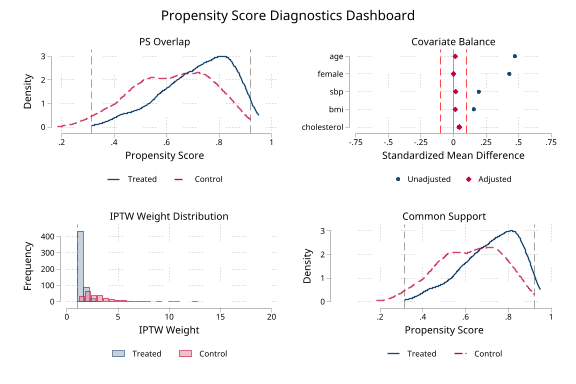 |
| Automatic workflow after `teffects` | 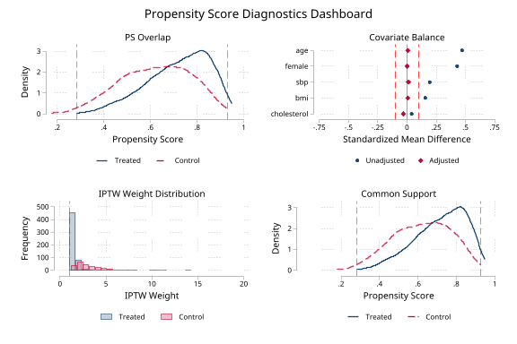 |

### v1.3.0 features (binary)

| Output | Image |
|--------|-------|
| Multi-strategy Love-plot overlay (`strategies()`) | 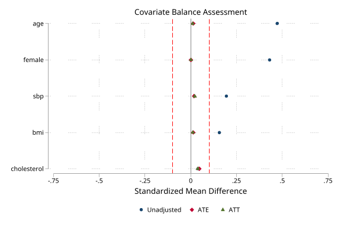 |
| Per-covariate distributional balance (`distribution()`) | 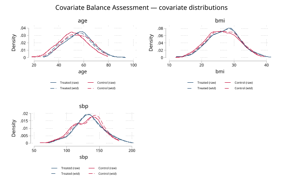 |

The demo also exercises the non-graph v1.3.0 additions: `psdash detect` and the machine-readable `combined` verdict with configurable thresholds (`overlapmax()`/`essmin()`/`imbalmax()`), the `table1_tc`/`puttab`-ready SMD matrix (`smdmatrix()`/`r(smd)`), and the pre/post-trimming comparison (`support, compare`). It writes a one-call publication workbook to `demo/psdash_report.xlsx` (Overlap, Balance, Weights, Support, and Summary sheets) via `combined, report()`, plus a single-panel export (`demo/weights_table.xlsx`) showing the `xlsx()`/`sheet()` parity.

### Multi-group treatment (3 arms)

Synthetic data: 1,200 observations, a 3-arm treatment assigned via multinomial logit, generalized propensity scores via `mlogit`, generalized IPTW weights, threshold-based support indicators, and an alternate reference-arm balance check.

| Output | Image |
|--------|-------|
| Multi-group overlap | 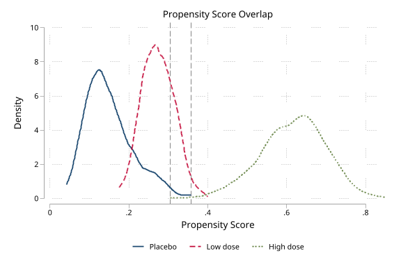 |
| Multi-group balance | 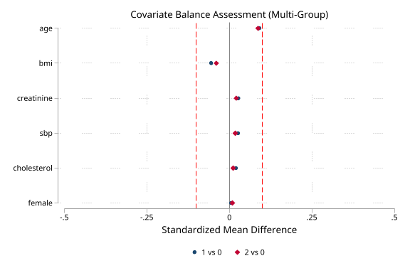 |
| Multi-group combined dashboard | 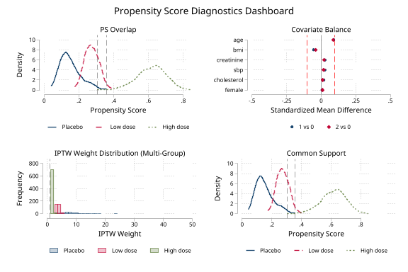 |

## Version History

- **v1.5.0** (22 Jul 2026): Release-readiness hardening. Producer auto-detection now calls the producer's validity guard and enforces a centralized contract-version matrix; unsupported, stale, unsigned, or unavailable producer state fails closed. Multi-arm threshold trimming now uses the full generalized propensity-score vector, combined dashboards use one complete-case sample and return its attrition ledger, and longitudinal diagnostics reject nonpositive weights while reporting period-by-arm ESS and missingness. Excel exports now contain typed numeric cells and complete raw/adjusted balance metrics. Added focused regression, contract, return-surface, Excel-fidelity, and external-reference QA; refreshed documentation, provenance records, and demo artifacts.
- **v1.4.1** (07 Jul 2026): Usability and transparency fixes. `estimand(atc)` with a multi-valued treatment (K>2 groups) now prints a one-time note explaining that ATC is not uniquely defined for K>2 and that generalized ATE weights are used (unchanged behavior); the help recommends `estimand(att)` with `reference()` for a group-targeted estimand. `name()` and `saving()` now accept a redundant `twoway`-style trailing `replace` suboption (e.g. `saving(f.png, replace)`), ignoring it with a note instead of failing with a cryptic error. The combined-command help now documents that inherited per-panel `r()` results with shared names reflect the last-run panel (support).
- **v1.4.0** (01 Jul 2026): Methodological hardening. `balance` now computes a genuine **weighted Kolmogorov-Smirnov** statistic from the weighted empirical CDF (the `KS_Adj` column, previously reserved but unfilled), returned in `r(max_ks_adj)`. Variance ratios are no longer flagged for **binary covariates** (where the VR is determined by the SMD); such covariates are footnoted and excluded from the VR count, and the VR bounds are configurable via `vrbounds()`. `weights` adds configurable extreme-weight cutoffs (`extreme()`) and a scale-free max/mean ratio (`r(max_ratio)`), and warns when `stabilize` is applied to user-supplied (possibly already-stabilized) weights. `support` adds quantile-based common support (`qtrim()`) as a robust alternative to the optimistic min-max overlap, and the Crump optimal alpha is refined from a 0.01 to a 0.001 grid.
- **v1.3.0** (14 Jun 2026): Forward-looking enhancements. New `psdash detect` subcommand and `combined, dryrun` report auto-detection without running panels. `combined` now returns a machine-readable verdict (`r(verdict)`, `r(n_warnings)`, `r(warnings)`) with configurable thresholds (`overlapmax()`, `essmin()`, `imbalmax()`), and a one-call publication workbook via `report()`. `balance` adds a multi-strategy Love-plot overlay (`strategies()`), per-covariate distributional balance plots (`distribution()`), and a `table1_tc`/`puttab`-ready SMD matrix (`smdmatrix()`/`r(smd)`). `support` adds a pre/post-trimming comparison (`compare`). `overlap`, `weights`, and `support` gain Excel export parity (`xlsx()`/`sheet()`). Added a Detection-sources reference table to the help file.
- **v1.2.1** (14 Jun 2026): Documentation polish — clarified that `saving()` exports an image file by extension (use `graph save` for `.gph`), documented the per-subcommand graph defaults (`nograph` vs `loveplot`/`graph`), and added validator-note comments to the `mark`+`markout` sample blocks. No behavior change.
- **v1.2.0** (14 Jun 2026): Added longitudinal dataset-contract auto-detection after `msm_weight` and `tte_weight` (`save_ps`). `psdash combined` now produces period-by-period overlap and weight diagnostics for both, complementing `msm_diagnose`. Generalized the longitudinal diagnostics engine with a `source()` label and added focused msm/tte contract QA.
- **v1.1.0** (29 May 2026): Added iivw dataset-contract auto-detection, `psdash weights, iivwcomponent()`, iivw source labels, and focused iivw contract QA.
- **v1.0.2** (17 May 2026): Rejected invalid manual `estimand()` values, added clean multi-group treatment-level validation, isolated remaining QA installs, and made the demo path handling relocatable with failure-safe cleanup.
- **v1.0.1** (06 May 2026): Hardened PS detection and validation, fixed `teffects` binary PS orientation, K=2 non-0/1 auto-weights, support threshold validation, and binary variance-ratio summaries.
- **v1.0.0** (29 Apr 2026): Initial release with five subcommands

## Author

Timothy P Copeland, Karolinska Institutet

## License

MIT
