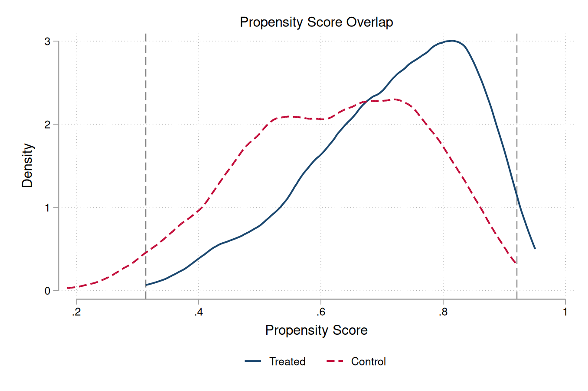
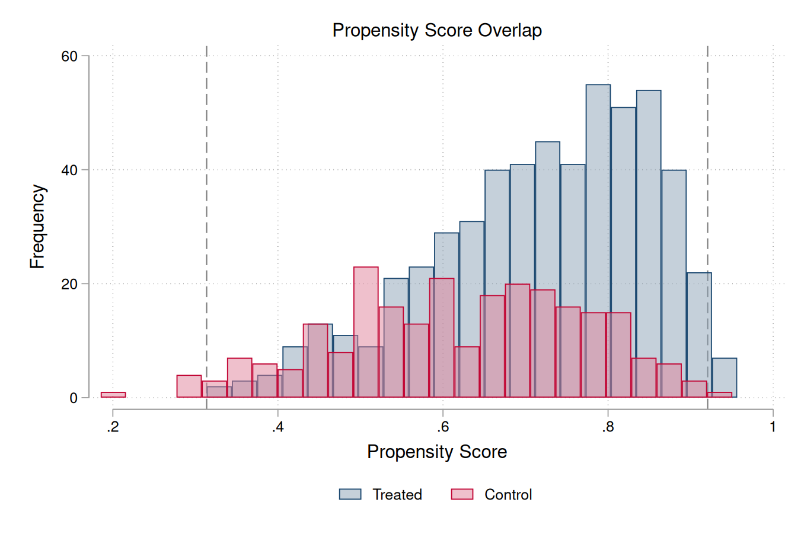
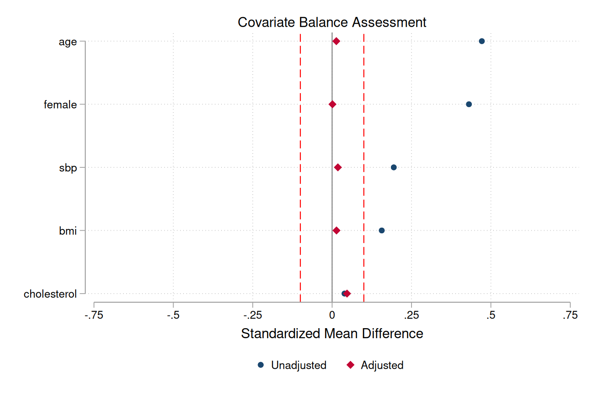
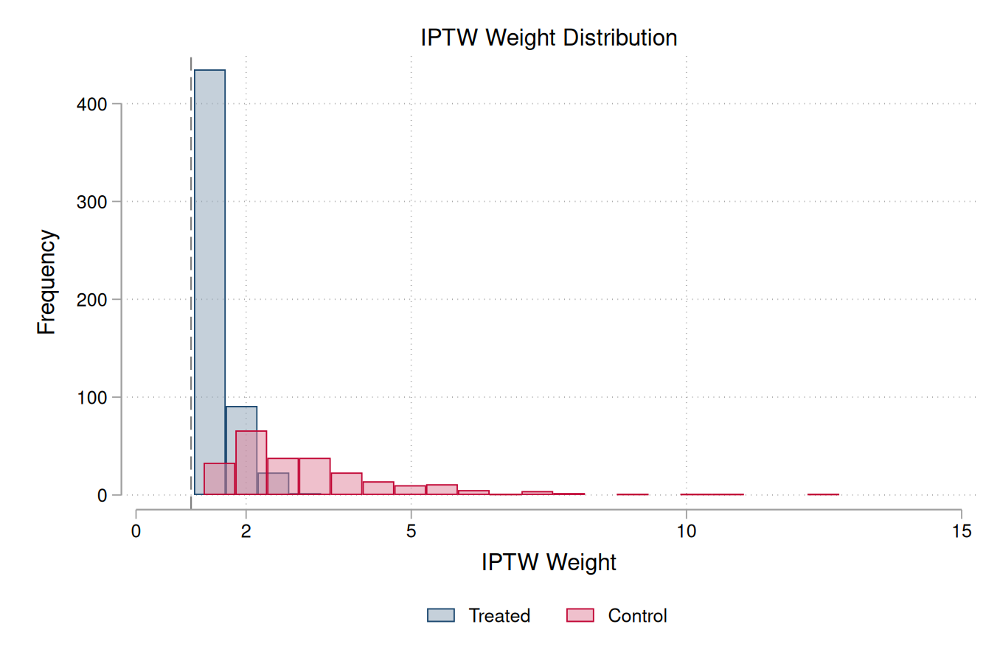
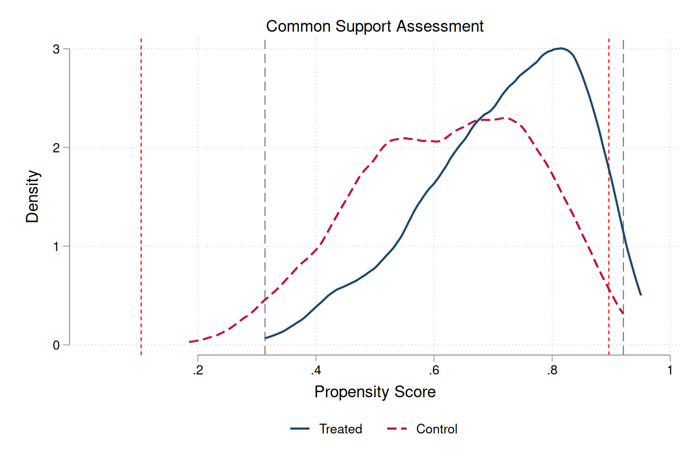
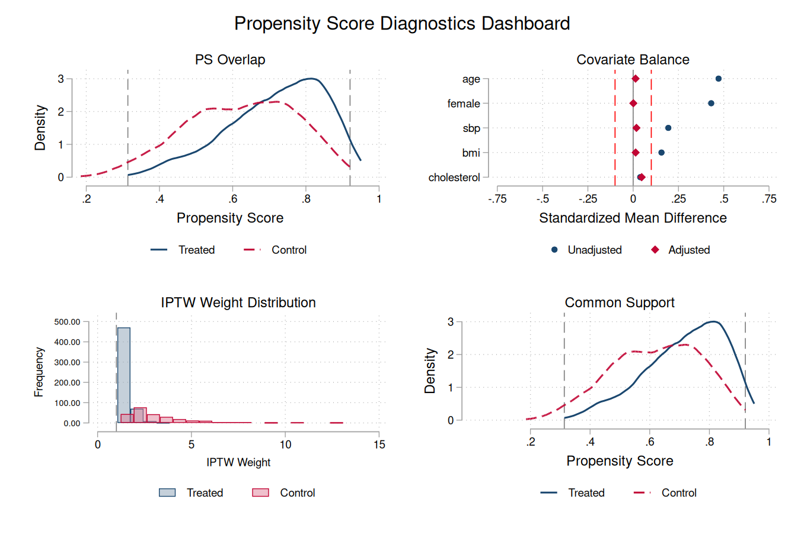
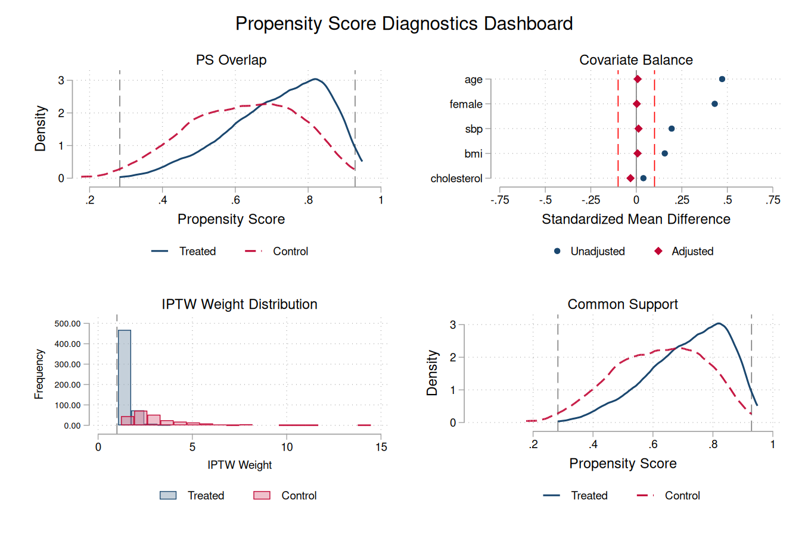
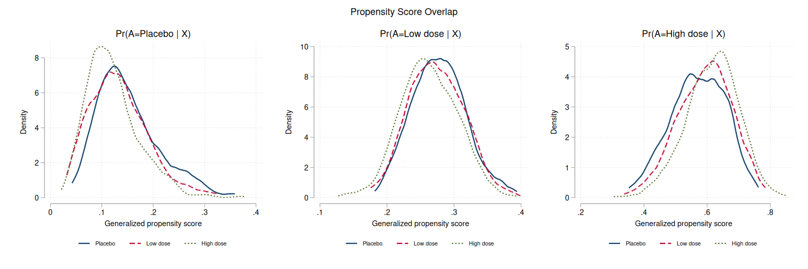
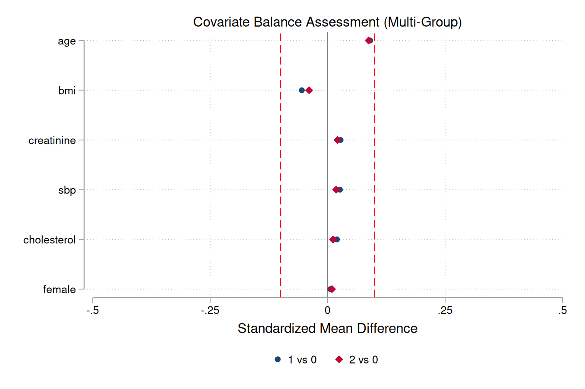
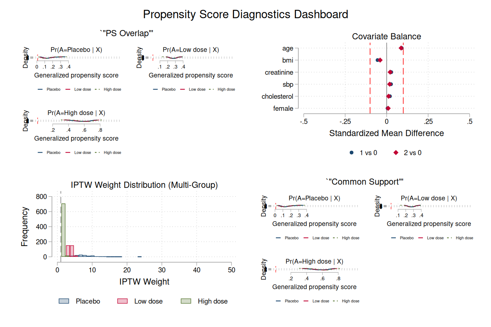

# psdash — Propensity-score diagnostics for Stata

**Version 1.7.1** | 2026-09-04

psdash is a command family for propensity-score overlap, covariate balance, weight stability, and common-support diagnostics. It can read supported estimation or dataset contracts automatically, or work from manually supplied propensity scores, treatment variables, and weights.

## Quick Start

Run a complete binary-treatment diagnostic workflow from a fitted propensity-score model:

```stata
sysuse auto, clear
logit foreign mpg weight length
predict double ps, pr
psdash combined foreign ps, covariates(mpg weight length)
return list
```

For cross-sectional data, combined requests overlap, balance, weight, and support panels by default and returns an overall PASS or FAIL verdict with the analysis-sample ledger. Its shared sample requires treatment, propensity scores, and requested covariates; automatically generated weight missingness cannot silently remove a positivity-boundary observation, and an undefined requested weight fails before panels run. It skips the balance panel when no covariates are detected; longitudinal producer contracts instead route to period-specific diagnostics.

## Requirements

psdash requires Stata 16 or later. Manual workflows and workflows after logit, probit, mlogit, or supported teffects estimators have no additional community-contributed dependency. Automatic detection after tmle, ltmle, msm_weight, tte_weight, or iivw_weight requires the corresponding producer package and a verifiable producer contract.

## Installation

Install the released package from the public GitHub repository:

```stata
capture ado uninstall psdash
net install psdash, from("https://raw.githubusercontent.com/tpcopeland/Stata-Tools/main/psdash") replace
```

For a local checkout, replace the source with the checkout directory:

```stata
capture ado uninstall psdash
net install psdash, from("/path/to/psdash") replace
```

After installation, see help psdash for the complete command-specific help files.

## Commands

| Command | Purpose |
|---|---|
| `psdash` | Display the package overview and available subcommands. |
| `psdash overlap` | Assess propensity-score overlap and report observations outside the empirical region. |
| `psdash balance` | Report raw and adjusted standardized mean differences, variance ratios, KS statistics, and optional Love/distribution plots. |
| `psdash weights` | Summarize weight distribution, effective sample size, coefficient of variation, and extreme weights, with optional modifications. |
| `psdash support` | Assess common support, threshold or quantile trimming, and Crump optimal trimming for binary treatments. |
| `psdash combined` | Run the available diagnostic panels and return a machine-readable overall verdict. |
| `psdash detect` | Resolve the treatment, propensity scores, covariates, weights, estimand, and producer source without running diagnostic panels. |
| `psdash_overlap` | Public overlap-panel entry point; normally use `psdash overlap`. |
| `psdash_balance` | Public balance-panel entry point; normally use `psdash balance`. |
| `psdash_weights` | Public weight-panel entry point; normally use `psdash weights`. |
| `psdash_support` | Public support-panel entry point; normally use `psdash support`. |
| `psdash_combined` | Public combined-dashboard entry point; normally use `psdash combined`. |
| `psdash_detect` | Public detection entry point; normally use `psdash detect`. |

The six `psdash_*` entry points are the autoloaded public programs behind the dispatcher; use the `psdash <subcommand>` forms in new code.

## How It Works

The command family accepts the general form psdash <subcommand> [treatment] [psvar] [if] [in] [, options]. The positional arguments can be omitted when a supported estimation or dataset contract supplies them; use covariates(), wvar(), and psvars() for explicit inputs. A binary workflow uses one propensity-score variable for the treated probability, while a multi-group workflow supplies one generalized propensity score per observed treatment level through psvars().

### Detection contexts

| Context | What psdash resolves | Typical use |
|---|---|---|
| After teffects ipw, ipwra, or aipw | Treatment, covariates, propensity scores, estimand, weights, and e(sample) | psdash combined or an individual panel |
| After cross-sectional tmle | Treatment, _tmle_ps, covariates, and estimand from the producer contract | psdash combined |
| After ltmle | Period-specific propensity scores, weights, identifiers, and periods | Longitudinal psdash combined diagnostics |
| After msm_weight | Period-specific treatment propensity, treatment weight, identifiers, and periods | Longitudinal psdash combined diagnostics |
| After tte_weight, save_ps | Saved switch/treatment propensity, IP weight, identifiers, and periods | Longitudinal psdash combined diagnostics |
| After iivw_weight | Treatment propensity, treatment covariates, treatment weight, and iivw component state | Treatment diagnostics and weights, iivwcomponent() |
| After `logit`/`probit` | Treatment, covariates, and `e(sample)` are read from the estimation context; the predicted PS is supplied by the user | `predict ..., pr`, then a panel command |
| After `mlogit` (multi-group) | Treatment, covariates, and `e(sample)` are read from the estimation context; generalized PS variables are supplied through `psvars()` | Multi-group diagnostics |
| Manual input | Explicit treatment and PS, with covariates() and wvar() when needed | Fully controlled diagnostics |

teffects psmatch is rejected because it does not expose the propensity-score prediction required by these diagnostics. Longitudinal integrations run period-by-period rather than pooling observations across periods. Individual pooled panels require explicit variables for longitudinal data.

### Producer-contract verification

Producer-contract integrations call the producing command's validity guard before using detected state and check the stamped contract version against the supported compatibility matrix. Genuine persisted TMLE and LTMLE dataset contracts can be rediscovered after save/reload without active estimation results; ambiguous simultaneous contracts fail rather than being guessed. Missing, stale, unsigned, malformed, future, or otherwise unsupported producer state fails closed with an explicit error. Built-in teffects, logit, probit, and mlogit contexts use their estimation results instead of a producer contract. Supplying treatment and a propensity score explicitly always uses manual mode and does not require a producer contract.

Combined reports use clear status labels, while `r(verdict)` and `r(warnings)` provide the machine-readable result.

When a usable propensity score is available, balance and weights can create temporary inverse-probability weights for the requested estimand(); these working variables are not left in the dataset. A supplied wvar() takes precedence where the command allows it. Factor variables and interactions in covariates() or auto-detected model terms are expanded into their design columns before balance is calculated.

## Worked Examples

### Binary manual workflow

This workflow estimates a propensity score, runs each individual panel, and creates an in-support indicator. nograph is optional; it is shown here when the table is the main output.

```stata
sysuse auto, clear
logit foreign mpg weight length
predict double ps, pr
psdash overlap foreign ps, nograph
psdash balance foreign ps, covariates(mpg weight length) loveplot
psdash weights foreign ps
psdash support foreign ps, crump generate(in_support) nograph
```

After logit or probit, the estimation context supplies treatment, covariates, and the estimation sample, so a PS-only call such as psdash overlap ps is also supported. With balance or weights, one positional argument plus wvar() (or nowvar for balance) is always explicit treatment-only mode; pass both treatment and PS when both are needed.

### Automatic detection after teffects

The treatment, covariates, propensity score, estimand, weights, and estimation sample are read from the supported teffects result.

The README keeps one binary and one multi-group workflow explicit; focused option and detection examples follow.

```stata
webuse cattaneo2, clear
teffects ipw (bweight) (mbsmoke mage prenatal1 mmarried fbaby)
psdash detect
psdash combined
psdash balance, loveplot
```

### Precomputed weights and modified weights

Use wvar() when the analysis already has a weight variable, and use generate() before trimming, truncating, or stabilizing so that the original weights remain available.

```stata
sysuse auto, clear
logit foreign mpg weight length
predict double ps, pr
gen double iptw = cond(foreign == 1, 1/ps, 1/(1-ps))
psdash balance foreign ps, covariates(mpg weight length) wvar(iptw) ks
psdash weights foreign ps, wvar(iptw) detail
psdash weights foreign ps, wvar(iptw) trim(99) generate(iptw_trim) replace
psdash support foreign ps, threshold(0.05) compare nograph
```

### Multi-group treatment with generalized propensity scores

For a treatment with nonnegative integer levels, pass generalized propensity scores in ascending treatment-level order.

```stata
clear
set obs 300
set seed 20260506
gen double age = rnormal(60, 10)
gen byte female = runiform() > .5
gen double bmi = rnormal(27, 4)
gen double eta1 = -0.2 + 0.03*(age-60) + 0.25*female - 0.04*(bmi-27)
gen double eta2 = 0.1 - 0.02*(age-60) + 0.02*(bmi-27)
gen double den = 1 + exp(eta1) + exp(eta2)
gen double p0 = 1/den
gen double p1 = exp(eta1)/den
gen double u = runiform()
gen byte arm = cond(u < p0, 0, cond(u < p0 + p1, 1, 2))

mlogit arm age female bmi
predict double ps0 ps1 ps2, pr
psdash overlap arm, psvars(ps0 ps1 ps2)
psdash balance arm, psvars(ps0 ps1 ps2) covariates(age female bmi) loveplot
psdash weights arm, psvars(ps0 ps1 ps2) detail
psdash support arm, psvars(ps0 ps1 ps2) threshold(0.1) nograph
psdash balance arm, psvars(ps0 ps1 ps2) covariates(age female bmi) reference(1)
```

reference() defaults to the smallest observed treatment level and changes the pairwise balance and group summaries without changing the supplied GPS ordering.

### Detection, verdicts, and publication output

Use dryrun when you want the resolved analysis inputs before running panels, and use report() when a cross-sectional combined workbook is required.

```stata
sysuse auto, clear
logit foreign mpg weight length
predict double ps, pr
psdash combined foreign ps, covariates(mpg weight length) dryrun
return list
psdash combined foreign ps, covariates(mpg weight length) report(psdash_report.xlsx) saving(psdash_dashboard.png)
```

## Demo

Demo output is generated from [demo/demo_psdash.do](demo/demo_psdash.do). Run the script from a repository checkout; its rendering helpers require the repository's tc_schemes and logdoc packages, and it writes generated files under demo/.

### Binary treatment

| Diagnostic | Example asset |
|---|---|
| Propensity-score overlap |  |
| Overlap histogram |  |
| Covariate balance |  |
| Weight distribution |  |
| Common support |  |
| Combined dashboard |  |
| Automatic teffects workflow |  |

The demo also exercises strategies(), distribution(), detect, dryrun, smdmatrix(), support, compare, combined, report(), and panel-level Excel export.

### Multi-group treatment

| Diagnostic | Example asset |
|---|---|
| Generalized propensity-score overlap |  |
| Multi-group balance |  |
| Multi-group combined dashboard |  |

## Command Reference

### General syntax

```stata
psdash [subcommand] [treatment] [psvar] [if] [in] [, options]
```

With no subcommand, psdash displays an overview. For multi-group treatments, use psvars(varlist) instead of relying on a single positional PS variable. detect accepts the same input context but only resolves and reports it.

### psdash overlap

```stata
psdash overlap [treatment] [psvar] [if] [in] [, covariates(varlist) histogram bins(#) bwidth(#) compact nograph saving(filename) scheme(schemename) graphoptions(string) title(string) name(string) xlsx(filename) sheet(string) gpsfloor(#) estimand(string) psvars(varlist) reference(#)]
```

The default graph is a kernel-density overlap plot; histogram switches to overlapping histograms. Detailed multi-group graphs use a separate data-driven x axis for each GPS component because the components can occupy very different probability ranges. The practical-positivity floor is drawn only when it lies within that component's observed range, avoiding empty axis extensions; three-component graphs use one filled row. compact replaces those detailed panels with one grouped box-plot region containing every GPS component and keeps its treatment-group legend on one row. nograph suppresses the graph, bins(30) is the histogram default, and Stata's default bandwidth is used when bwidth() is omitted.

### psdash balance

```stata
psdash balance [treatment] [psvar] [if] [in] [, covariates(varlist) wvar(varname) matched threshold(#) nowvar noweights xlsx(filename) sheet(string) loveplot strategies(strategylist) distribution(varlist) smdmatrix(name) saving(filename) scheme(schemename) graphoptions(string) format(string) title(string) name(string) ks estimand(string) vrbounds(# #) psvars(varlist) reference(#)]
```

The default SMD threshold is 0.1, variance-ratio bounds are 0.5 2.0, the display format is %6.3f, and the Excel sheet is Balance. balance reports raw balance and, when possible, adjusted balance using automatically generated weights unless nowvar/noweights, matched, or a supplied wvar() changes that behavior. loveplot is required for a Love plot; ks adds KS statistics to the displayed table.

### psdash weights

```stata
psdash weights [treatment] [psvar] [if] [in] [, wvar(varname) trim(#) truncate(#) stabilize generate(name) replace detail graph compact saving(filename) xlabel(numlist) scheme(schemename) graphoptions(string) name(string) xlsx(filename) sheet(string) estimand(string) extreme(# #) psvars(varlist) reference(#) iivwcomponent(string)]
```

No graph is drawn unless graph is specified. compact scales overlaid histograms to within-arm fractions instead of raw frequencies, which is useful in a dashboard or when arm sizes differ. Automatic weight axes use data-driven round tick intervals. When the maximum is more than 1.5 times both p99 and the lower extreme-weight threshold, the graph focuses on the central distribution through a rounded limit based on the larger cutoff and states the omitted count and full maximum in a note; the numerical diagnostics still use every weight. xlabel() requests an explicit full-range axis and disables that automatic display cap. trim(#) uses a percentile from 50 through 99.9, truncate(#) applies a positive fixed cap, and any modification requires generate(name); replace permits overwriting that generated variable. The default absolute extreme cutoffs are 10 20, and the default Excel sheet is Weights.

### psdash support

```stata
psdash support [treatment] [psvar] [if] [in] [, covariates(varlist) crump threshold(#) qtrim(#) gpsfloor(#) generate(name) replace compare compact nograph saving(filename) scheme(schemename) graphoptions(string) title(string) name(string) xlsx(filename) sheet(string) estimand(string) psvars(varlist) reference(#)]
```

The default output includes a graph; nograph suppresses it. Detailed multi-group graphs share the overlap command's component-specific axes, relevant-only floor lines, and filled three-component row. compact replaces the detailed component density panels with one box-plot region of the minimum GPS component by observed arm. For binary treatments, threshold(#) must lie strictly between 0 and 0.5, qtrim(#) must lie strictly between 0 and 50, and crump performs Crump et al. (2009) optimal trimming for binary treatments; use threshold() for multi-group treatments. Crump can return alpha zero only when every assessed score is strictly inside (0,1) and its full-sample inequality holds; exact boundary scores require positive-threshold handling and are excluded, while a sample with no interior score fails the retained-sample guard. For multi-group treatments, gpsfloor(0.01) is the default practical-positivity floor and applies to every GPS component. generate(name) creates an indicator for the retained region, and compare requires a binary trimming operation.

### psdash combined

```stata
psdash combined [treatment] [psvar] [if] [in] [, covariates(varlist) wvar(varname) threshold(#) overlapmax(#) essmin(#) imbalmax(#) nooverlap nobalance noweights nosupport dryrun report(filename) saving(filename) scheme(schemename) title(string) estimand(string) psvars(varlist) reference(#) gpsfloor(#)]
```

All four panels are requested by default when their inputs are available; the balance panel is skipped when no covariates are detected. threshold(0.1) controls the balance SMD finding threshold, overlapmax(10) is the default maximum percentage outside binary-treatment common support, essmin(50) is the default minimum overall ESS percentage, and imbalmax(0) is the default tolerated number of SMD-imbalanced covariates. The combined thresholds replace the corresponding panel defaults while independent findings such as exact propensity-score boundaries, variance-ratio imbalance, per-arm ESS collapse, weight dominance, and GPS-floor violations remain active. For multi-group treatments, gpsfloor() drives the positivity verdict and the legacy observed-arm min/max overlap remains descriptive. To keep the dashboard readable, its overlap panel uses grouped box plots of each GPS component and its support panel uses the minimum GPS component by observed arm; the standalone overlap and support commands retain their detailed one-density-panel-per-component graphs. nooverlap, nobalance, noweights, and nosupport suppress panels; dryrun resolves inputs without running panels; and, for cross-sectional runs, report() writes sheets for the panels that run plus Summary to an .xlsx workbook.

### psdash detect

```stata
psdash detect [treatment] [psvar] [if] [in] [, covariates(varlist) wvar(varname) estimand(string) psvars(varlist) reference(#)]
```

detect has no graph or diagnostic panels. It prints and returns the resolved source, treatment, propensity-score variables, covariates, weights, estimand, treatment levels, reference level, and longitudinal metadata when present.

## Key Options

### Shared input and estimand options

| Option | Default and behavior |
|---|---|
| covariates(varlist) | Auto-detected from a supported cross-sectional estimation/producer context when available; supply it for manual or pooled balance diagnostics. Factor notation and interactions are expanded into design columns. |
| wvar(varname) | Use a supplied analysis-weight variable; otherwise a supported producer weight or an automatically generated IPTW weight is used where permitted. |
| estimand(ate\|att\|atc) | ate by default; after teffects, the detected e(stat) is respected unless estimand() is explicit. For multi-group treatments, atc is not uniquely defined; use att with reference() for a named arm. |
| psvars(varlist) | Required for multi-group generalized PS input; give one probability per nonnegative integer treatment level in ascending level order. Binary input may be one treated probability or two ordered probabilities, which are range- and sum-validated. |
| reference(#) | The smallest observed treatment level by default; controls pairwise multi-group balance and group summaries. |

### Graph and export options

| Option | Default and behavior |
|---|---|
| saving(filename) | Save the graph produced by the command using the filename extension; use Stata's graph save separately for a .gph file. |
| scheme(schemename) | Use the requested graph scheme. |
| graphoptions(string) | Pass additional graph options to the generated graph. |
| title(string) | Replace the command's default graph title. |
| name(string) | Set the graph name. |
| xlsx(filename) | Export a panel summary to an .xlsx workbook. |
| sheet(string) | Excel sheet name; defaults are Overlap, Balance, Weights, or Support by panel. |

### Balance options

| Option | Default and behavior |
|---|---|
| threshold(#) | 0.1; absolute SMDs above this value contribute to the imbalance count. |
| vrbounds(# #) | 0.5 2.0; bounds for variance-ratio findings. Binary covariates are excluded from the VR count because their VR is determined by the SMD. |
| nowvar / noweights | Do not generate or use automatic weights; report raw balance only. |
| wvar(varname) | Use a precomputed weight variable instead of automatic PS-derived weights. |
| matched | Report matched/unweighted balance; mutually exclusive with wvar(). |
| loveplot | Draw a Love plot; off by default. |
| strategies(strategylist) | Overlay requested raw/ATE/ATT/ATC SMD strategies in a Love plot for supported binary workflows. |
| distribution(varlist) | Draw per-covariate distributional balance plots for the requested variables. |
| smdmatrix(name) | Save the raw and adjusted SMD matrix under the requested matrix name and return it in r(smd). |
| ks | Display KS statistics; raw and weighted KS statistics are returned whether or not this display option is used. |
| format(string) | %6.3f for displayed SMD values. |

### Weight options

| Option | Default and behavior |
|---|---|
| trim(#) | No trimming unless requested; percentile range is 50 through 99.9. |
| truncate(#) | No fixed cap unless requested; the cap must be positive. |
| stabilize | Off by default; valid for unstabilized 1/PS-scale weights. A note is printed for user-supplied weights whose scale may already be stabilized. |
| generate(name) | Required whenever trim(), truncate(), or stabilize modifies weights. |
| replace | Allow generate() to replace an existing variable. |
| detail | Display the weight percentile table. |
| graph | Draw the weight histogram; off by default. |
| compact | Scale each arm's histogram to fractions instead of raw frequencies. |
| xlabel(numlist) | Set custom histogram x-axis labels and disable the automatic remote-tail display cap. |
| extreme(# #) | Absolute lower and upper extreme cutoffs; defaults to 10 20. The scale-free maximum-to-mean ratio is also returned. |
| iivwcomponent(treatment\|final\|visit) | Select the treatment, final, or visit component after an iivw_weight contract. |

### Support options

| Option | Default and behavior |
|---|---|
| crump | Use Crump et al. (2009) optimal trimming for binary treatments; use threshold() for multi-group treatments. |
| threshold(#) | No manual trim by default; binary values must be strictly between 0 and 0.5, while multi-group values define a one-sided GPS floor. |
| qtrim(#) | No quantile trim by default; binary-only within-group percentile trim, strictly between 0 and 50. |
| gpsfloor(#) | 0.01 for multi-group overlap/support; units must meet the floor in every GPS component. |
| generate(name) | Create an indicator for the retained support region. |
| replace | Allow generate() to replace an existing variable. |
| compare | Report pre/post trimming changes; requires a binary trimming operation. |
| nograph | Suppress the support graph, which is otherwise drawn by default. |

### Combined options

| Option | Default and behavior |
|---|---|
| nooverlap, nobalance, noweights, nosupport | Do not run the named panel. |
| threshold(#) | 0.1 for the balance panel's SMD findings; it is distinct from support's PS trimming threshold. |
| overlapmax(#) | 10 percent outside binary-treatment common support tolerated before a finding; multi-group verdicts use gpsfloor(). |
| essmin(#) | 50 percent overall ESS tolerated as the minimum before a finding; other weight findings remain active. |
| imbalmax(#) | 0 SMD-imbalanced covariates tolerated before a finding; variance-ratio findings remain active. |
| dryrun | Resolve and display the analysis inputs without running panels. |
| report(filename) | For cross-sectional combined runs, write a multi-sheet .xlsx workbook with panel and summary sheets. |
| gpsfloor(#) | 0.01 for multi-group overlap/support and forwarded to both panels. |

## Stored Results

Diagnostic panel commands store their principal results in r() and print findings with a status and, when appropriate, a concise action line; detect stores resolution metadata without running panels. The defaults are diagnostic heuristics, not automatic evidence that an analysis is valid.

| Command | Important returned results |
|---|---|
| overlap | r(N), r(overlap_lower), r(overlap_upper), r(n_outside), r(pct_outside), r(auc) for binary treatments, treatment/PS/source metadata, and multi-group r(gps_means). |
| balance | r(max_smd_raw), r(max_smd_adj), r(max_vr_raw), r(max_vr_adj), r(max_ks_raw), r(n_imbalanced), r(threshold), weight/source metadata, and matrices r(balance) and r(smd). |
| weights | r(mean_wt), r(sd_wt), r(cv), r(ess), r(ess_pct), r(n_extreme), r(p1), r(p99), r(max_ratio), modification metadata, and r(iivwcomponent) when applicable. |
| support | r(lower_bound), r(upper_bound), r(n_outside), r(pct_outside), r(trim_lower), r(trim_upper), r(n_trimmed), and r(N_remaining) when trimming is requested; r(crump_alpha) when crump is used; comparison results when requested; and multi-group r(gps_means). |
| combined | r(verdict), r(n_warnings), r(warnings), and source/estimand metadata. Cross-sectional runs additionally return r(n_panels), r(N_requested), r(N_analysis), r(n_common_excluded), r(overlapmax), r(essmin), r(imbalmax), and r(report) when report() is used. |
| detect | r(source), r(treatment), r(psvar), r(covariates), r(wvar), r(estimand), r(n_covariates), r(psvar_auto), r(multigroup), r(longitudinal), r(K), r(levels), and r(reference) when applicable. |

Multi-group runs also return group counts, generalized-positivity diagnostics, and the K-by-K r(gps_means) matrix. Longitudinal combined runs return producer metadata, period and arm sample/ESS summaries, missingness and exclusion counts, and the period matrices r(overlap_by_period) and r(weights_by_period).

For cross-sectional combined runs, combined adds panel returns with return add; shared names inherited from panels reflect the last panel run, so run the individual command when a panel-specific return surface is needed. r(balance) has one row per covariate for binary treatments and pairwise blocks for multi-group treatments; r(smd) is the compact SMD matrix intended for downstream reporting.

Example:

```stata
psdash balance foreign ps, covariates(mpg weight length)
return list
matrix list r(balance)
```

## Assumptions and Limits

- A diagnostic PASS means the configured observed-data thresholds were not crossed; it is not a causal proof and does not establish exchangeability, correct model specification, or adequate study design.
- Binary workflows require two observed treatment groups. Multi-group treatment values must be nonnegative integers, and psvars() must contain one generalized propensity score per level in ascending order; invalid ranges, sums, or missing levels fail rather than being guessed.
- Exact propensity-score boundaries can make generated inverse-probability weights undefined. psdash rejects undefined generated weights instead of silently dropping them; inspect the model, support, and requested estimand before proceeding.
- balance uses available complete cases separately by covariate, so a missing covariate can have a smaller effective sample and is reported in the returned missingness fields. Cross-sectional combined runs instead use one complete-case sample across the requested treatment, PS, covariates, and weight inputs and return its exclusion ledger; longitudinal combined runs use period-specific diagnostics.
- For binary covariates, the variance ratio is not counted as a separate imbalance finding. Adjusted SMDs use a common unweighted pooled-SD scale, while adjusted continuous variance ratios use a scale-invariant unbiased weighted variance; multiplying all weights by a constant does not change these adjusted diagnostics.
- crump is binary-only. In multi-group workflows, threshold() and gpsfloor() apply a full-vector positivity rule: every GPS component must meet the floor. Component plots compare the same GPS component across all observed treatment groups; observed-arm score ranges remain descriptive and do not determine the multi-group verdict.
- estimand(atc) is not uniquely defined for more than two treatment groups. Use estimand(att) with reference() for a named arm or define a binary contrast.
- Producer integrations are contract-checked and fail closed when the producer is absent or its state is stale or unsupported. teffects psmatch is not supported because it does not expose the PS prediction required by this package.
- Graph saving() uses the requested filename extension for an image; export tables with xlsx() or report() using .xlsx filenames. Generated graph and workbook files can overwrite existing files according to Stata's graph/export behavior.

## References

- Crump, R. K., V. J. Hotz, G. W. Imbens, and O. A. Mitnik. 2009. “Dealing with limited overlap in estimation of average treatment effects.” Biometrika 96(1): 187–199.
- Li, F., and F. Li. 2019. “Propensity score weighting for causal inference with multiple treatments.” Annals of Applied Statistics 13(4): 2389–2415.
- McCaffrey, D. F., B. A. Griffin, D. Almirall, M. E. Slaughter, R. Ramchand, and L. F. Burgette. 2013. “A tutorial on propensity score estimation for multiple treatments using generalized boosted models.” Statistics in Medicine 32(19): 3388–3414.

## QA

QA suites and how to run them are documented in [qa/README.md](qa/README.md).

## Version History

- **v1.7.1** (4 Sep 2026): Comprehensive audit remediation. Multi-group boundary and missing-weight paths now fail closed without erasing positivity findings; weights and balance expose complete exclusion ledgers, and weights returns both extreme-tail counts. All advertised covariate endpoints accept factor-variable notation, support comparison propagates exact design-mapping failures, reduced-arm `mlogit` samples fail consistently, and detect reports stable automatic-weight labels. Genuine saved TMLE/LTMLE contracts can be rediscovered after reload. QA now resolves both producers through `targetlearn`, separates runner aggregates from leaf assertion totals, derives shipped ado coverage from the manifest, and validates workbook, PDF, and PNG contents. Method prose and leaf examples were expanded and corrected.
- **v1.7.0** (3 Sep 2026): Fail-closed resolve contract for `iivwcomponent()`. `psdash weights` now refuses a call that supplies both `wvar()` and `iivwcomponent()` instead of silently letting the component selection overwrite the explicit weight variable, and it no longer falls back to the raw `_dta[_iivw_*]` characteristics when `_psdash_detect` has not verified the iivw producer contract, so unsigned or stale metadata can no longer select the weight a diagnostic reports on. New internal helper `_psdash_require_meta`.
- **v1.6.9** (30 Aug 2026): Review remediation. The dispatcher and detector restore `varabbrev` on every successful path, `support, compare` rejects calls without binary trimming, quoted overlap/support titles round-trip through Excel exports, export helpers clean up workbook resources, and stored-result tables render within Viewer width limits.
- **v1.6.8** (11 Aug 2026): Compact overlap legend correction. Multi-group compact overlap box plots, including the PS Overlap panel in combined dashboards, now place treatment-group legend entries on one row by default.
- **v1.6.7** (11 Aug 2026): Detailed multi-group graph correction. Standalone overlap and support graphs now place three GPS components in one filled row, use component-specific data ranges instead of extending every axis to an irrelevant positivity floor, align histogram bins within each component, and render clean titles without literal compound-quote markup.
- **v1.6.6** (11 Aug 2026): Dashboard graph correction. Multi-group combined dashboards now use one readable graph region each for overlap and support instead of nesting two three-panel composites, graph titles no longer retain literal quote markup, and compact weight histograms compare within-arm fractions on data-driven round axes with a clearly annotated remote-tail display cap. Standalone multi-group density detail and all numerical diagnostics are unchanged.
- **v1.6.5** (10 Aug 2026): Crump boundary correction. Exact propensity scores of zero or one no longer qualify for the alpha-zero full-sample shortcut; the positive-threshold search excludes them, including in row-level support indicators. The help and README now state the alpha-zero eligibility rule.
- **v1.6.4** (10 Aug 2026): Detection and support correction. Explicit treatment-only balance/weight calls no longer consume stale estimation state; built-in propensity-model contexts honor `e(sample)`; Crump trimming represents the full-sample alpha-zero solution; equal point support is accepted; and multi-treatment references are corrected.
- **v1.6.3** (10 Aug 2026): Bug fix. Multi-group overlap and support graph exports now pass `saving()` paths without adding a second layer of quotes, so valid absolute and nested paths export successfully.
- **v1.6.2** (09 Aug 2026): Producer and verdict-contract correction. Automatic iivw detection now accepts verified contract versions 2 and 3, restoring compatibility with current iivw releases. The combined dashboard now applies overlapmax(), essmin(), and imbalmax() in place of the corresponding panel defaults while retaining independent findings, and multi-group verdicts no longer use the descriptive observed-arm overlap scalarization.
- **v1.6.1** (29 Jul 2026): Method and efficiency correction. Binary balance now uses (b-a)^2 p(1-p) rather than Stata's sample-variance inflation, and adjusted continuous variance ratios use the scale-invariant unbiased weighted variance instead of normalized aweight variance. Exact PS boundaries now enter the machine-readable findings contract, and balance rejects undefined auto-generated weights rather than silently dropping those rows. Multi-treatment overlap/support now compare every GPS component across every observed treatment group, return the K-by-K r(gps_means) table, and reserve the legacy observed-arm scalarization for descriptive output only. Balance reuses sorted empirical CDFs and reference-group summaries; Crump trimming uses one sorted cumulative-sum pass rather than repeated full-data scans.
- **v1.6.0** (26 Jul 2026): Independent-audit remediation. Binary psvars() orientation is now mapped by treatment level and validated, multi-group overlap reports full-vector generalized positivity, stabilize is refused for auto-generated ATT/ATC weights, multi-group support generation uses the GPS-positivity region, longitudinal result matrices are keyed by period value, and balance reports covariate missingness. combined gains gpsfloor() and forwards it to overlap and support. The common-scale SMD convention is documented without the previous citation error, and return-surface documentation is corrected.
- **v1.5.0** (22 Jul 2026): Release-readiness hardening. Producer auto-detection now calls the producer's validity guard and enforces a centralized contract-version matrix; unsupported, stale, unsigned, or unavailable producer state fails closed. Multi-arm threshold trimming uses the full generalized propensity-score vector, combined dashboards use one complete-case sample and return its attrition ledger, and longitudinal diagnostics reject nonpositive weights while reporting period-by-arm ESS and missingness. Excel exports contain typed numeric cells and complete raw/adjusted balance metrics.
- **v1.4.1** (07 Jul 2026): Usability and transparency fixes. estimand(atc) with a multi-valued treatment now explains that ATC is not uniquely defined for more than two groups and recommends estimand(att) with reference(). name() and saving() accept a redundant trailing replace suboption, and combined-command help documents inherited per-panel returns.
- **v1.4.0** (01 Jul 2026): Methodological hardening. balance computes a weighted Kolmogorov-Smirnov statistic, excludes binary covariates from the variance-ratio count, and adds configurable vrbounds(). weights adds configurable extreme-weight cutoffs and a scale-free maximum-to-mean ratio. support adds quantile-based common support and refines the Crump alpha grid.
- **v1.3.0** (14 Jun 2026): Added psdash detect, combined, dryrun, machine-readable combined verdicts and thresholds, report(), multi-strategy Love plots, distributional balance plots, smdmatrix(), support, compare, and Excel export.
- **v1.2.1** (14 Jun 2026): Documentation polish clarified graph export behavior, per-subcommand graph defaults, and validator-note comments in sample blocks.
- **v1.2.0** (14 Jun 2026): Added longitudinal dataset-contract auto-detection after msm_weight and tte_weight, save_ps, with period-by-period overlap and weight diagnostics.
- **v1.1.0** (29 May 2026): Added iivw dataset-contract auto-detection, psdash weights, iivwcomponent(), iivw source labels, and focused iivw contract support.
- **v1.0.2** (17 May 2026): Rejected invalid manual estimands, added multi-group treatment-level validation, and made demo path handling relocatable with failure-safe cleanup.
- **v1.0.1** (06 May 2026): Hardened PS detection and validation, fixed teffects binary PS orientation and K=2 non-0/1 auto-weights, and corrected support-threshold and binary variance-ratio handling.
- **v1.0.0** (29 Apr 2026): Initial release with five subcommands.

## Author

Timothy P Copeland, Karolinska Institutet

## License

MIT
