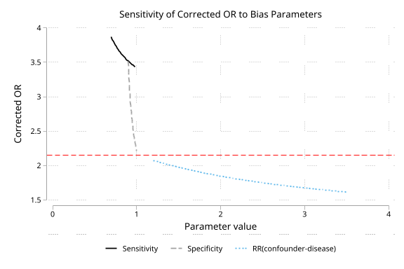
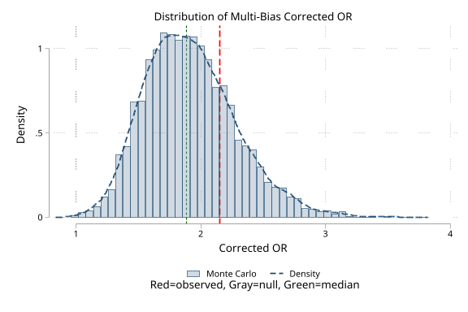
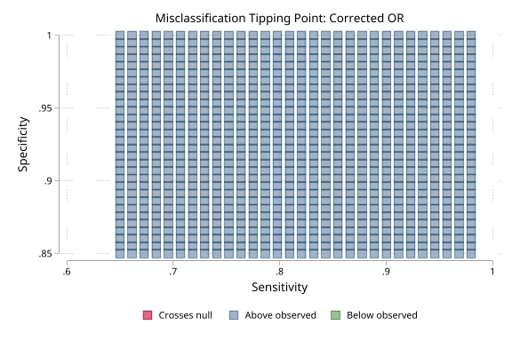

# qba -- Quantitative Bias Analysis for Stata

**Version 1.0.1** | 2026-07-10

Quantitative bias analysis toolkit for epidemiologic data, implementing the methods in Lash, Fox, and Fink's *Applying Quantitative Bias Analysis to Epidemiologic Data* (2nd ed., Springer 2021). Corrects point estimates and confidence intervals for the three major sources of systematic error that survive conventional multivariable adjustment: exposure or outcome misclassification (`qba_misclass`), selection bias from differential participation (`qba_selection`), and unmeasured confounding (`qba_confound`). A multi-bias chain (`qba_multi`) applies all three corrections inside one Monte Carlo simulation, and `qba_plot` provides tornado, Monte Carlo distribution, and tipping-point visualizations.

## Requirements

- Stata 16.0 or higher
- No external dependencies for core `qba` commands
- Optional: `tmle` or `ltmle` only for the post-estimation integration examples

## Setup

### Install from the distribution repository

```stata
capture ado uninstall qba
net install qba, from("https://raw.githubusercontent.com/tpcopeland/Stata-Tools/main/qba") replace
```

### Verify the installation

```stata
qba
```

This displays the package version and lists all available commands. You should see version 1.0.1 and five commands (`qba_misclass`, `qba_selection`, `qba_confound`, `qba_multi`, `qba_plot`).

### Uninstall

```stata
ado uninstall qba
```

## Commands

| Command | Description |
|---------|-------------|
| `qba` | Package overview and available commands |
| `qba_misclass` | Misclassification bias analysis for 2x2 tables |
| `qba_selection` | Selection bias analysis for 2x2 tables |
| `qba_confound` | Unmeasured confounding analysis with E-values |
| `qba_multi` | Multi-bias analysis (chains all three in one simulation) |
| `qba_plot` | Tornado, distribution, and tipping point plots |

## How It Works

The single-bias correction commands run in two modes:

**Simple mode** takes fixed bias parameters (e.g., Se=0.85, Sp=0.95) and returns an algebraically corrected measure. This is the right starting point for understanding the direction and magnitude of bias under a single set of assumptions.

**Probabilistic mode** (`reps()`) draws independent parameter sets from trapezoidal, triangular, uniform, Beta, logit-normal, or constant distributions, re-applies the correction under each draw, and reports median/mean/SD and percentile CIs across the Monte Carlo distribution. This mode propagates uncertainty about the bias parameters into the corrected estimate. `qba_multi` is Monte Carlo only and always requires `reps()`.

The typical analysis workflow is:

1. **Single-bias analysis** -- run `qba_misclass`, `qba_selection`, or `qba_confound` individually to understand each source of error in isolation.
2. **Probabilistic analysis** -- add `reps()` and `dist_*()` options to propagate uncertainty. Save results with `saving()`.
3. **Multi-bias analysis** -- use `qba_multi` to chain all active biases in one Monte Carlo simulation.
4. **Visualize** -- use `qba_plot` to create tornado, distribution, or tipping point plots.

## Worked Examples

### Correct for nondifferential exposure misclassification

A case-control study reports 136 exposed cases, 297 unexposed cases, 1432 exposed controls, and 6738 unexposed controls. A validation study suggests sensitivity of 0.85 and specificity of 0.95 for the exposure classification.

```stata
qba_misclass, a(136) b(297) c(1432) d(6738) seca(.85) spca(.95)
```

The output shows the observed and corrected 2x2 tables, the observed OR, and the corrected OR. The corrected/observed ratio indicates the direction and magnitude of the bias.

### Correct for selection bias

The same study has differential participation rates. Exposed cases participate at 90%, unexposed cases at 85%, exposed controls at 70%, and unexposed controls at 80%.

```stata
qba_selection, a(136) b(297) c(1432) d(6738) ///
    sela(.9) selb(.85) selc(.7) seld(.8)
```

### Correct for unmeasured confounding with E-value

An observed OR of 1.5 might be explained by an unmeasured confounder with prevalence 0.4 among exposed and 0.2 among unexposed, and a confounder-disease RR of 2.0.

```stata
qba_confound, estimate(1.5) p1(.4) p0(.2) rrcd(2.0) evalue ci_bound(1.1)
```

The E-value tells you how strong an unmeasured confounder would need to be -- in terms of its associations with both treatment and outcome -- to fully explain away the observed effect.

### Correct a model coefficient directly

`qba_confound` can read directly from the last estimation command. It auto-detects whether the model is log-scale (logistic, Cox, Poisson) or linear (regress) and applies the appropriate correction formula.

```stata
sysuse auto, clear
logistic foreign mpg weight
qba_confound, from_model coef(mpg) p1(.35) p0(.15) rrcd(1.8) evalue
```

For linear models, the correction is subtractive rather than multiplicative:

```stata
sysuse auto, clear
regress price mpg weight
qba_confound, from_model coef(weight) p1(.3) p0(.1) confeffect(500)
```

### Use qba_confound after tmle or ltmle

After a separately installed `tmle` or `ltmle` command, `qba_confound` can use the active estimation contract without `estimate()` or `from_model`. `qba` only reads the contract left in `e()`; it does not install or provide those commands. Current TMLE/LTMLE effects are additive contrasts, so use `confeffect()` for a subtractive confounding correction:

```stata
tmle x1 x2, outcome(y) treatment(a) nolog
qba_confound, p1(.35) p0(.15) confeffect(.25)

ltmle, id(id) period(t) outcome(y) treatment(a) covariates(l1 l2) nolog
qba_confound, p1(.35) p0(.15) confeffect(.25)
```

`qba_confound, evalue` works after TMLE/LTMLE only when the active contract explicitly reports a ratio-scale effect (`OR` or `RR`). For additive contracts, qba reports the observed effect and skips E-values because E-values require a ratio measure.

### Probabilistic analysis with distributions

Use distributions to encode uncertainty about bias parameters. Lash, Fox, and Fink recommend trapezoidal distributions for expert opinion. Save results for visualization.

```stata
qba_misclass, a(136) b(297) c(1432) d(6738) seca(.85) spca(.95) ///
    reps(10000) dist_se("trapezoidal .75 .82 .88 .95") ///
    dist_sp("trapezoidal .90 .93 .97 1.0") seed(12345) ///
    saving(mc_results, replace)
```

### Multi-bias analysis

Chain misclassification, selection, and confounding corrections in one simulation. The default order follows Lash/Fox/Fink (2021): misclassification -> selection -> confounding.

```stata
qba_multi, a(136) b(297) c(1432) d(6738) reps(10000) ///
    seca(.85) spca(.95) dist_se("trapezoidal .75 .82 .88 .95") ///
    sela(.9) selb(.85) selc(.7) seld(.8) ///
    p1(.4) p0(.2) rrcd(2.0) seed(12345)
```

Only biases with complete parameter sets are activated. You can run any combination of one, two, or all three bias types.

### Visualization

```stata
* Distribution plot from Monte Carlo results
qba_plot, distribution using(mc_results) observed(2.15)

* Tornado sensitivity plot (which parameter matters most?)
qba_plot, tornado a(136) b(297) c(1432) d(6738) ///
    param1(se) range1(.7 1) param2(sp) range2(.8 1)

* Tipping point plot (which Se/Sp combinations cross the null?)
qba_plot, tipping a(136) b(297) c(1432) d(6738) ///
    param1(se) range1(.6 1) param2(sp) range2(.6 1)
```

## Demo

The demo script (`qba/demo/demo_qba.do`) produces three plots. It is a development artifact run from the full Stata-Tools checkout, not from a `net install qba` install: in addition to `qba` it requires the sibling package `tc_schemes` (for the plot scheme), which it locates next to the repository directory. Run it from the repository root with:

```bash
stata-mp -b do qba/demo/demo_qba.do
```

The demo uses a case-control pesticide exposure scenario with 136 exposed cases, 297 unexposed cases, 1432 exposed controls, 6738 unexposed controls, and an observed OR of 2.15. It runs the full range of analyses as a worked example -- fixed single-bias corrections; model-based confounding correction (fitting a logistic outcome model and a linear biomarker model, then applying `qba_confound, from_model`); probabilistic single-bias analyses; multi-bias analysis; and saved Monte Carlo dataset validation -- before building the plots below.

### Demo Plots

The demo regenerates these PNG files and validates the saved Monte Carlo datasets before creating the distribution plot.







## Supported Distributions

For probabilistic analysis, bias parameters can be drawn from six distribution families:

| Distribution | Syntax | Notes |
|-------------|--------|-------|
| Trapezoidal | `trapezoidal min m1 m2 max` | Recommended by Lash/Fox/Fink for expert opinion |
| Triangular | `triangular min mode max` | |
| Uniform | `uniform min max` | |
| Beta | `beta shape1 shape2` | Natural for probabilities; shape params encode prior strength |
| Logit-normal | `logit-normal mean sd` | Mean and SD are on the logit scale; bounded on (0, 1) |
| Constant | `constant value` | Fixed value (no uncertainty) |

Distributions are specified as strings in `dist_*()` options. When `reps()` is specified but a `dist_*()` option is omitted, the corresponding fixed parameter value is used as a constant.

## Stored Results

All commands are `rclass` and store results in `r()`. See individual help files for complete lists.

### Simple mode

| Result | Description | Commands |
|--------|-------------|----------|
| `r(observed)` | Observed measure of association | all |
| `r(corrected)` | Corrected measure of association | all (when correction is performed) |
| `r(ratio)` | Corrected / observed | misclass, selection, confound |
| `r(bias_factor)` | Bias factor | selection (SBF), confound (BF) |
| `r(measure)` | Measure type (`OR`, `RR`, or `coefficient`) | all |
| `r(method)` | `simple`, `probabilistic`, or `multi-bias` | all |
| `r(type)` | Misclassification type | misclass |
| `r(corrected_a)` through `r(corrected_d)` | Corrected cell counts | misclass, selection |
| `r(evalue)` | E-value for point estimate | confound (when `evalue` specified) |
| `r(evalue_ci)` | E-value for CI bound | confound (when available) |
| `r(se)` | Standard error for model/contract-derived source estimate | confound (`from_model` or active contract) |
| `r(correction_type)` | `subtractive` for linear models | confound |

### Probabilistic mode (when `reps()` specified)

| Result | Description | Commands |
|--------|-------------|----------|
| `r(corrected)` | Median corrected measure | all |
| `r(mean)` | Mean of Monte Carlo distribution | all |
| `r(sd)` | Standard deviation | all |
| `r(ci_lower)` / `r(ci_upper)` | Percentile CI bounds | all |
| `r(reps)` | Number of replications requested | all |
| `r(n_valid)` | Valid (non-missing) replications | all |
| `r(n_draw_invalid)` | Draws with out-of-support parameters | confound, multi |
| `r(n_biases)` | Number of bias types corrected | multi |
| `r(order)` | Correction order used | multi |

## Key Features

- **Simple and probabilistic modes**: Fixed-parameter analysis for single-bias commands; Monte Carlo simulation for full uncertainty propagation
- **Six distribution families**: Trapezoidal, triangular, uniform, Beta, logit-normal, and constant
- **Multi-bias chaining**: Combine misclassification, selection, and confounding corrections in one simulation following Lash/Fox/Fink (2021) Chapter 12
- **E-values**: Compute the minimum confounding strength needed to explain away an observed effect (VanderWeele & Ding 2017); OR-based E-values are best interpreted under a rare-outcome approximation
- **Model integration**: `qba_confound` reads directly from Stata estimation results (`from_model`) with auto-detection of measure type and support for linear and log-scale models
- **TMLE/LTMLE integration**: `qba_confound` reads active contracts left by optional `tmle` and `ltmle` commands for post-estimation unmeasured-confounding sensitivity checks
- **Three visualization types**: Tornado sensitivity plots, Monte Carlo distribution plots, and tipping point heatmaps
- **Differential misclassification**: Separate Se/Sp by disease or exposure stratum
- **Subtractive correction**: Linear model coefficients are corrected subtractively rather than by ratio

## Validation

Run the QA suite from `qba/qa/`:

```stata
cd qba/qa
do run_all.do
```

The suite covers the active release surface, known-answer validations, cross-validations, and adversarial regressions:

- **test_qba.do** -- Functional tests for all commands and current option semantics
- **test_qba_v110.do**, **test_qba_v111.do**, **test_qba_v112.do** -- Regression suites locking in correctness and robustness fixes from successive deep-review rounds
- **validation_qba.do** -- Known-answer validation for analytical commands and distribution helpers
- **validation_qba_boundaries.do** -- Boundary-value and multi-bias invariant validation
- **validation_qba_known_misclass.do** -- Focused hand-computed misclassification oracles
- **validation_qba_known_selection.do** -- Focused hand-computed selection-bias oracles
- **validation_qba_known_confound.do** -- Focused hand-computed confounding and from-model oracles
- **validation_qba_known_multi.do** -- Focused hand-computed multi-bias chain oracles
- **validation_qba_known_plot.do** -- Exact known-answer checks for plot grids and returned plot contracts
- **test_qba_docs.do** -- Documentation-contract tests and package surface checks
- **test_qba_plot_release_deep.do** -- Release-surface and installed-user plotting checks
- **crossval_python_qba.do** -- Python oracle cross-validation for formula parity
- **crossval_external_qba.do** -- External R/episensr cross-validation checks
- **test_qba_adversarial_misclass.do** / **test_qba_adversarial_misclass_deep.do** -- Misclassification/helper adversarial tests
- **test_qba_adversarial_selection_confound.do** / **test_qba_adversarial_selection_deep.do** -- Selection and confounding adversarial tests
- **test_qba_adversarial_confound_deep.do** -- Additional from-model and confounding adversarial tests
- **test_qba_adversarial_multi_plot.do** / **test_qba_adversarial_multi_deep.do** -- Multi-bias and plotting adversarial tests

## Version History

**Version 1.0.1** (19 June 2026)

Documentation polish for explicit selection-distribution and stored-result help tokens, helper lint cleanup, and package metadata refresh.

**Version 1.0.0** (2 June 2026)

Initial public release. Simple and probabilistic bias analysis for exposure and outcome misclassification (`qba_misclass`), selection bias (`qba_selection`), and unmeasured confounding with E-values (`qba_confound`); multi-bias chaining following Lash/Fox/Fink (`qba_multi`); and tornado, Monte Carlo distribution, and tipping-point visualizations (`qba_plot`). Six distribution families for probabilistic analysis, model-based confounding correction via `from_model` with TMLE/LTMLE contract support, and a full known-answer, cross-validation, and adversarial QA suite.

## Author

Timothy P Copeland, Karolinska Institutet

## License

MIT License

## References

- Lash TL, Fox MP, Fink AK. *Applying Quantitative Bias Analysis to Epidemiologic Data*. 2nd ed. Springer; 2021.
- VanderWeele TJ, Ding P. Sensitivity analysis in observational research: introducing the E-value. *Ann Intern Med*. 2017;167(4):268-274.
- Schneeweiss S. Sensitivity analysis and external adjustment for unmeasured confounders. *Pharmacoepidemiol Drug Saf*. 2006;15(5):291-303.
- Fox MP, Lash TL, Greenland S. A method to automate probabilistic sensitivity analyses of misclassified binary variables. *Int J Epidemiol*. 2005;34(6):1370-1376.
- Greenland S. Basic methods for sensitivity analysis of biases. *Int J Epidemiol*. 1996;25(6):1107-1116.
