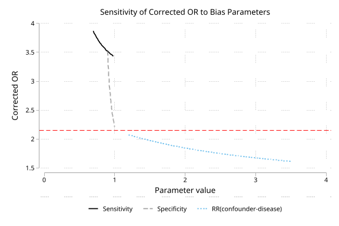
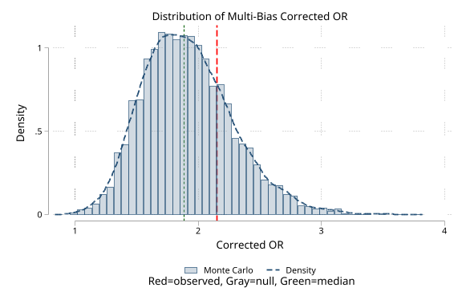
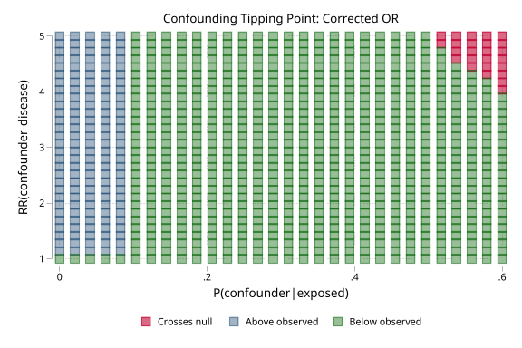

# qba — Quantitative Bias Analysis for Stata

**Version 1.1.2** | 2026-08-09

`qba` provides Stata commands for correcting 2x2 tables and effect estimates for misclassification, selection bias, and unmeasured confounding. It also supports multi-bias Monte Carlo analysis and sensitivity plots for epidemiologic studies.

## Quick Start

Start with a fixed-parameter exposure-misclassification analysis of a 2x2 table:

```stata
qba_misclass, a(136) b(297) c(1432) d(6738) seca(.85) spca(.95)
return list
```

The command reports the observed and corrected table, the observed and corrected odds ratios, and the corrected-to-observed ratio. Add `measure(RR)` for a risk ratio or `reps()` plus distribution options for a probabilistic analysis.

## Requirements

- Stata 16 or later
- No external dependencies for the core commands
- Optional `tmle` or `ltmle` integration requires a separately installed command that leaves an active estimation contract in `e()`

## Installation

Install the released package from the public Stata-Tools distribution repository:

```stata
capture ado uninstall qba
net install qba, from("https://raw.githubusercontent.com/tpcopeland/Stata-Tools/main/qba") replace
```

Run `qba` after installation to display the package version and the available analysis commands.

## Commands

| Command | Description |
|---------|-------------|
| `qba` | Display package information and the available commands |
| `qba_misclass` | Correct a 2x2 table for exposure or outcome misclassification |
| `qba_selection` | Correct a 2x2 table for selection bias |
| `qba_confound` | Correct a ratio measure or linear coefficient for one unmeasured confounder and optionally compute an E-value |
| `qba_multi` | Chain misclassification, selection, and confounding corrections in one Monte Carlo analysis |
| `qba_plot` | Create tornado, Monte Carlo distribution, and tipping-point plots |

## How It Works

`qba_misclass`, `qba_selection`, and `qba_confound` have a simple mode for fixed bias parameters and a probabilistic mode activated by `reps()`. `qba_multi` is always probabilistic and activates whichever complete bias-parameter sets you provide; `qba_plot` visualizes corrected estimates or saved Monte Carlo results.

In probabilistic mode, the commands draw bias parameters, recompute the corrected estimate for each draw, and summarize the valid draws with the median, mean, standard deviation, and percentile limits. The default interval is a systematic-error simulation interval: it propagates uncertainty in the bias parameters, not conventional sampling error, and is not a corrected confidence interval.

When a `dist_*()` option is omitted in probabilistic mode, its corresponding fixed parameter is used as a constant distribution. The supported distribution specifications are documented under [Key Options](#key-options).

For `qba_multi`, misclassification and selection modify the 2x2 table and are applied in the order given by `order()`. Confounding is a measure-level correction and is always applied last; the default cell-level order is `misclass selection` for the active bias types.

## Worked Examples

### 1. Correct exposure misclassification

The cells are ordered as exposed cases (`a`), unexposed cases (`b`), exposed non-cases (`c`), and unexposed non-cases (`d`). With no `reps()`, `qba_misclass` uses the fixed sensitivity and specificity analytically.

```stata
qba_misclass, a(136) b(297) c(1432) d(6738) seca(.85) spca(.95)
```

### 2. Correct selection bias

Supply the probability that each exposure-outcome stratum was selected into the study. The four probabilities correspond to `a`, `b`, `c`, and `d` in the same order as the table.

```stata
qba_selection, a(136) b(297) c(1432) d(6738) ///
    sela(.9) selb(.85) selc(.7) seld(.8)
```

Use `measure(RR)` when the target measure is a risk ratio rather than an odds ratio.

### 3. Correct unmeasured confounding and compute an E-value

This example applies the Schneeweiss parameterization to an observed odds ratio and asks for the E-value at the point estimate and at the supplied confidence-limit bound.

```stata
qba_confound, estimate(1.5) measure(OR) ///
    p1(.4) p0(.2) rrcd(2.0) evalue ci_bound(1.1)
```

Use `rrud()` instead of `rrcd()` for the Greenland parameterization. `commonoutcome` applies the VanderWeele-Ding conversion before an E-value is computed for a common outcome.

### 4. Correct a coefficient from the last model

`from_model` reads active Stata estimation results only when the estimator has a recognized ratio scale or an explicitly supported additive scale. Supported additive models use the coefficient directly and require the signed `confeffect()` correction; unsupported link scales such as probit and ordered logit are rejected rather than guessed.

```stata
sysuse auto, clear
logistic foreign mpg weight
qba_confound, from_model coef(mpg) p1(.35) p0(.15) rrcd(1.8) evalue
```

For a linear model, use `confeffect()` rather than `rrcd()` or `rrud()`:

```stata
sysuse auto, clear
regress price mpg weight
qba_confound, from_model coef(weight) p1(.3) p0(.1) confeffect(500)
```

### 5. Propagate bias-parameter uncertainty and plot it

`reps()` activates Monte Carlo analysis. The saved dataset contains the corrected result variable used by `qba_plot, distribution`.

```stata
qba_misclass, a(136) b(297) c(1432) d(6738) seca(.85) spca(.95) ///
    reps(10000) dist_se("trapezoidal .75 .82 .88 .95") ///
    dist_sp("trapezoidal .90 .93 .97 1.0") seed(12345) ///
    saving("mc_results.dta", replace)

qba_plot, distribution using("mc_results.dta") observed(2.15)
```

### 6. Chain multiple biases

Complete parameter sets activate the corresponding bias corrections. This example applies misclassification, selection, and confounding in the default order and uses fixed parameters inside the simulation.

```stata
qba_multi, a(136) b(297) c(1432) d(6738) reps(10000) ///
    seca(.85) spca(.95) ///
    sela(.9) selb(.85) selc(.7) seld(.8) ///
    p1(.4) p0(.2) rrcd(2.0) seed(12345)
```

Reverse the cell-level order when required by the study design:

```stata
qba_multi, a(136) b(297) c(1432) d(6738) reps(10000) ///
    seca(.85) spca(.95) sela(.9) selb(.85) selc(.7) seld(.8) ///
    order(selection misclass) measure(RR) seed(12345)
```

### 7. Explore sensitivity with tornado and tipping-point plots

Tornado plots vary up to three parameters one at a time. Tipping-point plots vary two parameters of the same bias type and classify whether the corrected estimate crosses the null.

```stata
qba_plot, tornado a(136) b(297) c(1432) d(6738) ///
    param1(se) range1(.7 1) param2(sp) range2(.8 1) steps(30)

qba_plot, tipping a(136) b(297) c(1432) d(6738) ///
    param1(se) range1(.6 1) param2(sp) range2(.6 1) steps(25)
```

### 8. Use qba_confound after tmle or ltmle

When neither `estimate()` nor `from_model` is supplied, `qba_confound` can read an active estimation contract left by separately installed `tmle` or `ltmle` software. The command uses `e(tau)` and any available confidence limits; additive contracts use `confeffect()`, while E-values require an explicitly declared ratio-scale effect.

## Demo

The checkout-only script [`demo/demo_qba.do`](demo/demo_qba.do) regenerates the three tracked PNG assets below. Run it from a Stata-Tools checkout with `stata-mp -b do qba/demo/demo_qba.do`; the script installs the local qba build and also requires the sibling `tc_schemes` package for its graph scheme.

| Output | Focus |
|--------|-------|
|  | Tornado sensitivity across sensitivity, specificity, and the confounder-disease risk ratio |
|  | Histogram and density of the saved multi-bias simulation |
|  | Grid of corrected odds ratios classified by null crossing and relation to the observed estimate |

The demo uses a case-control pesticide-exposure scenario and also illustrates fixed analyses, model-based confounding correction, probabilistic analyses, saved Monte Carlo datasets, and all three plot types. The demo and its assets are documentation artifacts in the repository; core qba commands do not require `tc_schemes`.

## Command Reference

### `qba`

```stata
qba [, version]
```

`qba` displays the package version and the five analysis/visualization commands. The optional `version` flag is accepted for a lightweight version check, but the overview is displayed and `r(version)` and `r(commands)` are stored with or without it.

### `qba_misclass`

```stata
qba_misclass, a(#) b(#) c(#) d(#) seca(#) spca(#) ///
    [secb(#) spcb(#) type(exposure|outcome) measure(OR|RR) ///
     reps(#) dist_se(spec) dist_sp(spec) dist_se1(spec) dist_sp1(spec) ///
     corr(#) totalerror fcase(#) fctrl(#) seed(#) level(#) ///
     saving(filename[, replace])]
```

| Option | Default | Purpose and constraints |
|--------|---------|------------------------|
| `a()` `b()` `c()` `d()` | Required | Non-negative 2x2 table cells; the four cells cannot all be zero |
| `seca()` `spca()` | Required | Group-A sensitivity and specificity in `(0, 1]`; their sum must exceed 1 |
| `type()` | `exposure` | Correct exposure misclassification within disease strata, or outcome misclassification within exposure strata |
| `secb()` `spcb()` | Unset | Supplying either enables differential misclassification; the missing value uses its group-A counterpart and the group-B sum must exceed 1 |
| `measure()` | `OR` | Compute an odds ratio or risk ratio from the corrected table |
| `reps()` | `0` | Fixed-parameter mode when omitted or zero; probabilistic mode requires at least 100 replications |
| `dist_se()` `dist_sp()` | Constant at `seca()`/`spca()` | Distributions for group-A sensitivity and specificity in probabilistic mode |
| `dist_se1()` `dist_sp1()` | Constant at `secb()`/`spcb()` | Distributions for group B in differential probabilistic mode; they require differential mode |
| `corr()` | `0` | Gaussian-copula correlation in `[-1, 1]` between the two strata's sensitivities and, separately, specificities; requires differential mode |
| `totalerror` | Off | Add total-error and random-error-only simulation intervals; requires probabilistic mode, whole-number cells, and all four cells greater than zero |
| `fcase()` `fctrl()` | `1` | Case and non-case source-population sampling fractions in `(0, 1]`; apply only with `type(outcome)` |
| `seed()` | Unset | Set the random-number seed |
| `level()` | `c(level)` (95 by default) | Percentile simulation-interval level |
| `saving()` | None | Save the Monte Carlo dataset; requires `reps()`, and `replace` overwrites an existing file |

`fcase()` and `fctrl()` inflate a sampled case-control table to the source population before outcome misclassification is corrected. They are rejected for exposure misclassification.

### `qba_selection`

```stata
qba_selection, a(#) b(#) c(#) d(#) ///
    sela(#) selb(#) selc(#) seld(#) ///
    [measure(OR|RR) reps(#) dist_sela(spec) dist_selb(spec) ///
     dist_selc(spec) dist_seld(spec) seed(#) level(#) ///
     saving(filename[, replace])]
```

| Option | Default | Purpose and constraints |
|--------|---------|------------------------|
| `a()` `b()` `c()` `d()` | Required | Non-negative 2x2 table cells; the four cells cannot all be zero |
| `sela()` through `seld()` | Required | Selection probabilities for the four cells, each in `(0, 1]` |
| `measure()` | `OR` | Compute an odds ratio or risk ratio from the corrected table |
| `reps()` | `0` | Fixed cell correction when omitted or zero; probabilistic mode requires at least 100 replications |
| `dist_sela()` through `dist_seld()` | Constant at the corresponding fixed probability | Distributions for the four selection probabilities in probabilistic mode |
| `seed()` | Unset | Set the random-number seed |
| `level()` | `c(level)` (95 by default) | Percentile simulation-interval level |
| `saving()` | None | Save the Monte Carlo dataset; requires `reps()`, and `replace` overwrites an existing file |

Simple mode divides each cell by its selection probability and reports the selection bias factor on the odds-ratio scale, even when the requested measure is `RR`.

### `qba_confound`

```stata
qba_confound, [estimate(#) | from_model] ///
    [coef(name) measure(OR|RR|HR|IRR) ///
     p1(#) p0(#) rrcd(#) rrud(#) confeffect(#) ///
     evalue ci_bound(#) commonoutcome ///
     reps(#) dist_p1(spec) dist_p0(spec) dist_rr(spec) ///
     dist_confeffect(spec) seed(#) level(#) ///
     saving(filename[, replace])]
```

| Option | Default | Purpose and constraints |
|--------|---------|------------------------|
| `estimate()` | Unset | Direct observed ratio measure; must be greater than zero and cannot be combined with `from_model` |
| `from_model` | Off | Read the coefficient and standard error from the last estimation command; `coef()` selects the target when needed |
| `coef()` | First eligible coefficient when there is one | Name a non-constant, non-omitted main-equation coefficient when the model has multiple eligible predictors |
| `measure()` | `RR` for `estimate()`; auto-detected from recognized models | Accept `OR`, `RR`, `HR`, or `IRR`; linear `from_model` results are labeled `coefficient` |
| `p1()` `p0()` | Unset | Confounder prevalence among exposed and unexposed, each in `[0, 1]`; required for a bias correction |
| `rrcd()` | Unset | Schneeweiss confounder-disease risk-ratio parameterization; must be greater than zero and cannot be combined with `rrud()` |
| `rrud()` | Unset | Greenland confounder-disease risk-ratio parameterization; must be greater than zero and cannot be combined with `rrcd()` |
| `confeffect()` | Unset | Signed additive confounder effect for linear `from_model` corrections; required instead of `rrcd()`/`rrud()` |
| `evalue` | Off | Compute the E-value for the point estimate and, when available, the confidence-limit bound closest to the null |
| `ci_bound()` | Unset | Positive confidence-limit bound for an E-value when a model-derived interval is unavailable; requires `evalue` |
| `commonoutcome` | Off | Apply the Table 2 conversion for a common outcome before an E-value; requires `evalue` |
| `reps()` | `0` | Simple correction or E-value when omitted or zero; probabilistic correction requires at least 100 replications |
| `dist_p1()` `dist_p0()` | Constant at `p1()`/`p0()` | Distributions for confounder prevalence in probabilistic mode |
| `dist_rr()` | Constant at `rrcd()` or `rrud()` | Distribution for a ratio-scale confounder-disease parameter |
| `dist_confeffect()` | Constant at `confeffect()` | Distribution for a signed additive confounder effect in linear probabilistic mode |
| `seed()` | Unset | Set the random-number seed |
| `level()` | `c(level)` (95 by default) | Percentile simulation-interval level and model-derived confidence-interval level |
| `saving()` | None | Save the Monte Carlo dataset; requires `reps()`, and `replace` overwrites an existing file |

`qba_confound` supports automatic ratio-scale handling for recognized logistic, count, proportional-hazards, and suitable GLM estimators. Additive handling is limited to `regress`, `areg`, `cnsreg`, and identity-link `glm`; other estimator scales are rejected. A model with multiple eligible predictors requires `coef()`.

### `qba_multi`

```stata
qba_multi, a(#) b(#) c(#) d(#) reps(#) ///
    [measure(OR|RR) ///
     seca(#) spca(#) secb(#) spcb(#) mctype(exposure|outcome) ///
     dist_se(spec) dist_sp(spec) dist_se1(spec) dist_sp1(spec) corr(#) ///
     sela(#) selb(#) selc(#) seld(#) ///
     dist_sela(spec) dist_selb(spec) dist_selc(spec) dist_seld(spec) ///
     p1(#) p0(#) rrcd(#) rrud(#) ///
     dist_p1(spec) dist_p0(spec) dist_rr(spec) ///
     order(string) seed(#) level(#) saving(filename[, replace])]
```

| Option | Default | Purpose and constraints |
|--------|---------|------------------------|
| `a()` `b()` `c()` `d()` | Required | Non-negative 2x2 table cells; the four cells cannot all be zero |
| `reps()` | Required | Monte Carlo replications; at least 100 because `qba_multi` has no simple mode |
| `measure()` | `OR` | Compute an odds ratio or risk ratio |
| `seca()` `spca()` | Unset | Together activate misclassification; each is in `(0, 1]` and their sum must exceed 1 |
| `secb()` `spcb()` | Unset | Together or individually enable differential misclassification; a missing counterpart uses group A |
| `mctype()` | `exposure` | Apply misclassification within outcome strata or exposure strata |
| `dist_se()` `dist_sp()` | Constant at group-A values | Distributions for group-A sensitivity and specificity |
| `dist_se1()` `dist_sp1()` | Constant at group-B values | Distributions for differential group-B parameters; require differential mode |
| `corr()` | `0` | Gaussian-copula correlation across differential strata; requires differential mode |
| `sela()` through `seld()` | Unset | Together activate selection-bias correction; each probability is in `(0, 1]` |
| `dist_sela()` through `dist_seld()` | Constant at the corresponding fixed probability | Distributions for active selection probabilities |
| `p1()` `p0()` plus `rrcd()` or `rrud()` | Unset | Together activate confounding correction; `rrcd()` and `rrud()` cannot both be supplied |
| `dist_p1()` `dist_p0()` `dist_rr()` | Constant at the corresponding fixed value | Distributions for active confounding parameters |
| `order()` | Active cell-level biases in `misclass selection` order | Reorder `misclass` and `selection`; all active cell-level biases must appear, and `confound` is always last |
| `seed()` | Unset | Set the random-number seed |
| `level()` | `c(level)` (95 by default) | Percentile simulation-interval level |
| `saving()` | None | Save corrected cell counts and corrected measures; `replace` overwrites an existing file |

At least one complete bias-parameter set is required. `qba_multi` does not offer `totalerror`, E-values, or case-control sampling-fraction adjustment.

### `qba_plot`

```stata
qba_plot, tornado | distribution | tipping ///
    [a(#) b(#) c(#) d(#) measure(OR|RR|coefficient) type(exposure|outcome) ///
     param1(name) range1(# #) param2(name) range2(# #) ///
     param3(name) range3(# #) steps(#) ///
     base_se(#) base_sp(#) base_sela(#) base_selb(#) ///
     base_selc(#) base_seld(#) base_p1(#) base_p0(#) ///
     base_rrcd(#) base_rrud(#) using(filename) observed(#) null(#) ///
     scheme(name) title(string) saving(filename) name(name) replace ///
     twoway_options]
```

| Option | Default | Purpose and constraints |
|--------|---------|------------------------|
| `tornado` `distribution` `tipping` | None | Choose exactly one plot type |
| `a()` `b()` `c()` `d()` | Unset | Required for tornado and tipping plots; non-negative and not all zero |
| `type()` | `exposure` | Misclassification type for tornado and tipping calculations |
| `measure()` | `OR` for grid plots; inferred for distribution plots | Tornado/tipping accept `OR` or `RR`; distribution also accepts `coefficient` |
| `param1()` and `range1()` | Unset | Required for all grid plots; sweep a recognized bias parameter across two endpoints |
| `param2()` and `range2()` | Unset | Required for tipping; optional for tornado |
| `param3()` and `range3()` | Unset | Optional third tornado parameter; not supported for tipping |
| `steps()` | `20` | Grid points per parameter; minimum 2, with `steps()^2` points for tipping |
| `base_se()` `base_sp()` | `0.9` | Baseline sensitivity and specificity for non-swept misclassification parameters |
| `base_sela()` through `base_seld()` | `1` | Baseline selection probabilities for non-swept selection parameters |
| `base_p1()` `base_p0()` | `0.3`, `0.1` | Baseline confounder prevalence values |
| `base_rrcd()` | `2` | Baseline Schneeweiss confounder-disease risk ratio |
| `base_rrud()` | Unset | If supplied, use the Greenland parameterization for confounding sweeps |
| `using()` | Required for distribution | Saved Monte Carlo dataset containing `corrected_or`, `corrected_rr`, or `corrected_coefficient` |
| `observed()` | Required for distribution | Observed measure shown as a reference line |
| `null()` | `1` for OR/RR; `0` for coefficient distributions; `1` for grid plots | Null reference value |
| `scheme()` | Current Stata graph scheme | Graph scheme |
| `title()` | Plot-specific default | Graph title |
| `saving()` | None | Export the graph; `replace` overwrites an existing file |
| `name()` | None | Name the graph in memory; `replace` permits an existing name |
| `replace` | Off | Replace an existing exported file or named graph; `name(foo, replace)` is also accepted |
| `twoway_options` | None | Additional options passed to the underlying `twoway` graph command |

Recognized sweep parameters are `se`/`seca`, `sp`/`spca`, `sela`, `selb`, `selc`, `seld`, `p1`, `p0`, `rrcd`, and `rrud`. Differential `secb()` and `spcb()` are not supported in tornado or tipping plots. Tipping axes must be the same bias type, cannot be selection parameters, and cannot combine `rrcd` with `rrud`.

## Key Options

### Package dispatcher

| Option | Default | Purpose |
|--------|---------|---------|
| `version` | Off | Display and store the package version; the overview is displayed either way |

### Distribution families

Use these forms inside the relevant `dist_*()` option. Parameter order and support are checked by qba.

| Distribution | Specification | Constraints |
|--------------|---------------|-------------|
| Trapezoidal | `trapezoidal min mode1 mode2 max` | `min <= mode1 <= mode2 <= max`; recommended for elicited expert opinion |
| Triangular | `triangular min mode max` | `min <= mode <= max` |
| Uniform | `uniform min max` | `min < max` |
| Beta | `beta shape1 shape2` | Both shape parameters greater than zero |
| Logit-normal | `logit-normal mean sd` | Mean and standard deviation are on the logit scale; `sd` must be positive |
| Constant | `constant value` | One fixed value and no parameter uncertainty |

Probability parameters are screened against their support after drawing: sensitivities, specificities, and selection probabilities must lie in `(0, 1]`, while confounder prevalences may include 0 and 1. Out-of-support draws and undefined corrected measures are retained as missing rows in saved Monte Carlo data and excluded from summaries.

### Saving and plotting Monte Carlo results

`saving(filename, replace)` is available only in probabilistic analyses. The saved file has one row per requested replication and includes the draws and corrected results needed for downstream inspection; `qba_misclass, totalerror` also saves reallocated and error-source-specific measures. The distribution plot selects a unique `corrected_or`, `corrected_rr`, or `corrected_coefficient` variable automatically, or uses the requested `measure()` when more than one is present.

### E-value scale

`qba_confound, evalue` uses the risk-ratio formula from VanderWeele and Ding (2017). `RR` and `IRR` enter directly, `OR` and `HR` enter directly only under the rare-outcome assumption, and `commonoutcome` applies the documented Table 2 conversion for `OR` or `HR`. The scale used is printed and recorded in `r(evalue_rr)` and `r(evalue_conv)`.

## Stored Results

All six public commands are `rclass`. Use `return list` immediately after a command to inspect the current result set.

### `qba`

Stores the local macros `r(version)` and `r(commands)`.

### `qba_misclass`

- Simple mode stores `r(a)`, `r(b)`, `r(c)`, `r(d)`, `r(corrected_a)` through `r(corrected_d)`, `r(observed)`, `r(corrected)`, `r(seca)`, `r(spca)`, `r(type)`, `r(measure)`, and `r(method)`, plus `r(ratio)` when defined and `r(secb)`/`r(spcb)` in differential mode.
- With `fcase()` or `fctrl()`, it additionally stores the fractions and source-population cells as `r(fcase)`, `r(fctrl)`, and `r(adj_a)` through `r(adj_d)`.
- Probabilistic mode stores the observed measure, median corrected measure, `r(mean)`, `r(sd)`, `r(ci_lower)`, `r(ci_upper)`, `r(reps)`, `r(n_valid)`, and the macros `r(type)`, `r(measure)`, `r(method)`, `r(interval)`, `r(dist_se)`, and `r(dist_sp)`.
- A nonzero `corr()` adds `r(corr)`. `totalerror` adds `r(n_valid_te)`, total-error summaries when valid, and the random-error-only summaries `r(re_median)`, `r(re_lower)`, and `r(re_upper)`.

### `qba_selection`

- Simple mode stores the observed and corrected cells, `r(observed)`, `r(corrected)`, `r(bias_factor)`, `r(ratio)` when defined, `r(sela)` through `r(seld)`, and the macros `r(measure)` and `r(method)`.
- Probabilistic mode stores `r(observed)`, the median `r(corrected)`, `r(mean)`, `r(sd)`, `r(ci_lower)`, `r(ci_upper)`, `r(reps)`, `r(n_valid)`, and the macros `r(measure)`, `r(method)`, and `r(interval)`.

### `qba_confound`

- Simple mode stores `r(observed)` and, when a correction is requested, `r(corrected)`, `r(bias_factor)` for ratio measures, `r(ratio)` when defined, the supplied prevalence and confounder parameters, and the macro `r(correction_type)` for linear corrections.
- `evalue` adds `r(evalue)`, `r(evalue_ci)` when a confidence-limit E-value is available, `r(evalue_rr)`, and `r(evalue_conv)`.
- Model-derived estimates add `r(ci_lower)`, `r(ci_upper)`, and `r(se)` when available, together with the contract macros `r(source)`, `r(cmd)`, `r(outcome)`, `r(treatment)`, and `r(estimand)`.
- Probabilistic mode stores `r(observed)`, median `r(corrected)`, `r(mean)`, `r(sd)`, `r(ci_lower)`, `r(ci_upper)`, `r(reps)`, `r(n_valid)`, `r(n_draw_invalid)`, and the macros `r(measure)`, `r(method)`, and `r(interval)`, plus the conditional E-value and contract results above.

### `qba_multi`

Stores `r(observed)`, median `r(corrected)`, `r(mean)`, `r(sd)`, `r(ci_lower)`, `r(ci_upper)`, `r(reps)`, `r(n_valid)`, `r(n_draw_invalid)`, and `r(n_biases)`. It also stores `r(corr)` when nonzero and the macros `r(measure)`, `r(method)`, `r(interval)`, and `r(order)`.

### `qba_plot`

Stores the macros `r(plot_type)`, `r(measure)`, and `r(scheme)`. Tornado and tipping plots also store `r(n_missing)`, the number of infeasible or undefined grid points.

## Assumptions and Limits

- The percentile intervals from `reps()` are systematic-error simulation intervals, not corrected confidence intervals. They reflect uncertainty in the supplied bias distributions and do not automatically include sampling error.
- The minimum accepted `reps()` value is 100, but that is a floor rather than a stability guarantee. Wider or skewed distributions can produce invalid draws; qba warns when more than 20% of replicates are invalid and recommends narrowing the distributions.
- Misclassification matrix inversion requires sensitivity plus specificity greater than 1. Fixed analyses report an undefined corrected measure when any corrected cell is nonpositive, and probabilistic analyses exclude such replicates.
- `totalerror` is available only for `qba_misclass`. It requires integer, strictly positive cells because it draws prevalence values and reallocates cells with binomial draws; `qba_multi` provides no total-error arm.
- For outcome misclassification in a case-control study, use `fcase()` and `fctrl()` so the sampled table is inflated to the source population. These options do not apply to exposure misclassification.
- `qba_confound` corrects ratio measures multiplicatively and linear model coefficients subtractively. E-values require an OR, RR, HR, or IRR; they are skipped for additive coefficients.
- Without `commonoutcome`, applying an E-value directly to an OR or HR assumes a rare outcome. Use `commonoutcome` when the outcome is common, and interpret the result against plausible confounder-treatment and confounder-outcome associations rather than a universal threshold.
- `from_model` requires active estimation results from a recognized ratio or additive estimator and can require `coef()` when multiple eligible predictors are present. Unsupported link scales are rejected. `tmle` and `ltmle` support is contract-based and is not an estimator supplied by qba.
- Tipping plots require two parameters of the same supported bias type, and grid plots can become slow as `steps()` increases, especially because tipping plots evaluate `steps()^2` points.

## References

- Lash TL, Fox MP, Fink AK. *Applying Quantitative Bias Analysis to Epidemiologic Data*. 2nd ed. Springer; 2021.
- Fox MP, Lash TL, Greenland S. A method to automate probabilistic sensitivity analyses of misclassified binary variables. *International Journal of Epidemiology*. 2005;34(6):1370-1376.
- Fox MP, MacLehose RF, Lash TL. SAS and R code for probabilistic quantitative bias analysis for misclassified binary variables and binary unmeasured confounders. *International Journal of Epidemiology*. 2023;52(5):1624-1633.
- Schneeweiss S. Sensitivity analysis and external adjustment for unmeasured confounders in epidemiologic database studies of therapeutics. *Pharmacoepidemiology and Drug Safety*. 2006;15(5):291-303.
- VanderWeele TJ, Ding P. Sensitivity analysis in observational research: introducing the E-value. *Annals of Internal Medicine*. 2017;167(4):268-274.
- Greenland S. Basic methods for sensitivity analysis of biases. *International Journal of Epidemiology*. 1996;25(6):1107-1116.

## QA

QA suites and how to run them are documented in [`qa/README.md`](qa/README.md).

## Version History

- **1.1.2** (2026-08-09): Rejected unsupported `from_model` link scales instead of silently treating them as additive coefficients, expanded release and option/return QA, and added a self-contained SMCL render gate.
- **1.1.1** (2026-08-05): Corrected help contracts for HR/IRR confounding measures and `c(level)` defaults, and made external-oracle QA sentinels independent of the user's interactive shell syntax.
- **1.1.0** (2026-07-26): Added total-error simulation, correlated differential misclassification, case-control sampling-fraction adjustment, common-outcome E-value conversions, and explicit systematic-error interval semantics.
- **1.0.1** (2026-06-19): Documentation polish, stored-result coverage, helper cleanup, and package metadata refresh.
- **1.0.0** (2026-06-02): Initial public release covering misclassification, selection bias, unmeasured confounding, multi-bias simulation, and visualization.

## Author

Timothy P Copeland, Karolinska Institutet

## License

MIT License
