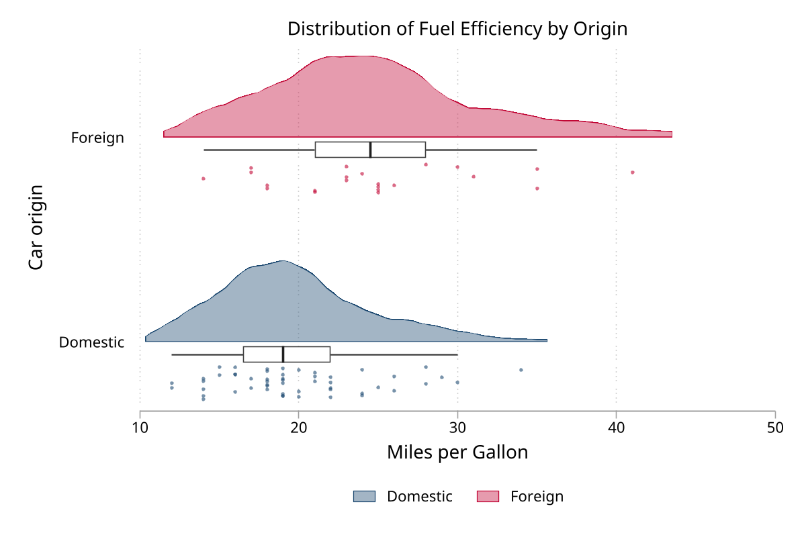
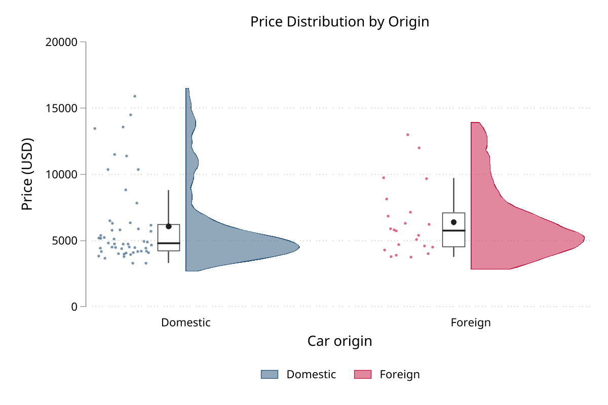
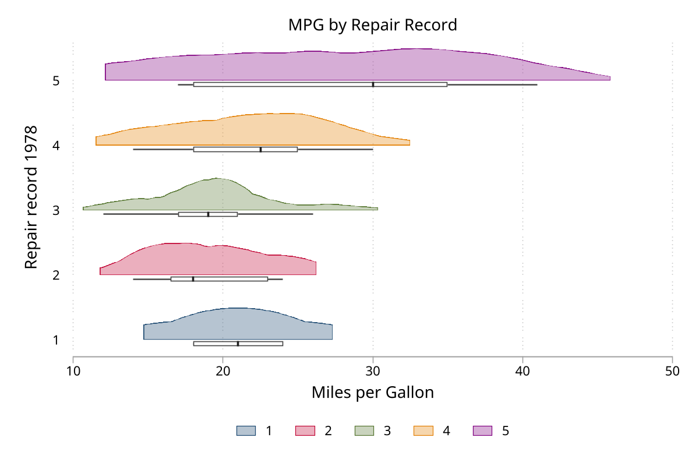

# raincloud

Raincloud plots for Stata: half-violin density + jittered scatter + box-and-whisker elements in a single figure.

Based on Allen et al. (2019) "Raincloud plots: a multi-platform tool for robust data visualization."

## Version

1.0.0

## Installation

```stata
net install raincloud, from("https://raw.githubusercontent.com/tpcop/Stata-Tools/main/raincloud") replace
```

## Syntax

```stata
raincloud varname [if] [in] [weight], [over(varname) options]
```

## Examples

### Horizontal raincloud by groups



### Vertical orientation with mean marker



### Cloud + box only (no scatter), 5 groups



## Quick examples

```stata
sysuse auto, clear

* Basic raincloud
raincloud mpg

* By groups
raincloud mpg, over(foreign)

* Vertical orientation with mean marker
raincloud price, over(foreign) vertical mean

* Customize elements
raincloud mpg, over(foreign) opacity(70) jitter(0.6) bandwidth(2)

* Suppress elements
raincloud mpg, over(foreign) norain    // density + box only
raincloud mpg, over(foreign) nobox     // density + scatter only
```

## Options

| Option | Description |
|--------|-------------|
| `nocloud` | Suppress half-violin density |
| `norain` | Suppress jittered scatter |
| `nobox` / `noumbrella` | Suppress box plot |
| `over(varname)` | Stratify by groups |
| `horizontal` / `vertical` | Orientation (default: horizontal) |
| `bandwidth(#)` | Kernel density bandwidth |
| `kernel(string)` | Kernel function (default: epanechnikov) |
| `opacity(#)` | Cloud fill opacity 0-100 (default: 50) |
| `cloudwidth(#)` | Max density width (default: 0.4) |
| `jitter(#)` | Jitter intensity 0-1 (default: 0.4) |
| `seed(#)` | Random seed for reproducible jitter |
| `boxwidth(#)` | IQR box width (default: 0.08) |
| `median` | Show median as dot instead of bar |
| `mean` | Add mean marker |
| `scheme(string)` | Graph scheme (default: plotplainblind) |

## Stored results

| Result | Description |
|--------|-------------|
| `r(N)` | Number of observations |
| `r(n_groups)` | Number of groups |
| `r(stats)` | Matrix (groups x 7): n, mean, sd, median, q25, q75, iqr |
| `r(varname)` | Variable plotted |
| `r(over)` | Grouping variable |

## Reference

Allen M, Poggiali D, Whitaker K, Marshall TR, Kievit RA (2019). Raincloud plots: a multi-platform tool for robust data visualization. *Wellcome Open Research* 4:63.

## Author

Timothy P Copeland
Department of Clinical Neuroscience, Karolinska Institutet
