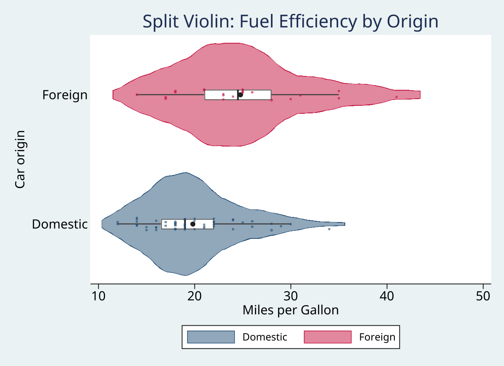

# raincloud - Raincloud plots combining density, points, and box summaries

**Version 1.0.0** | 2026-04-08

`raincloud` draws raincloud plots: a half-violin density, jittered raw points, and a box-and-whisker summary in one figure. The command is built for distributional comparisons where you want the overall shape and the observed values on the same graph.

It supports grouped displays through `over()`, horizontal or vertical orientation, mirror-mode split violins, analytic and frequency weights, and pass-through styling options for the cloud, points, and box layers.

## Requirements

- Stata 16 or later

## Installation

```stata
capture ado uninstall raincloud
net install raincloud, from("https://raw.githubusercontent.com/tpcopeland/Stata-Tools/main/raincloud") replace
```

## Commands

| Command | Description |
|---------|-------------|
| `raincloud` | Draw a raincloud plot with density, scatter, and box elements |

## Quick Start

The easiest place to start is Stata's built-in `auto` dataset.

```stata
sysuse auto, clear
raincloud mpg, over(foreign)
```

This draws separate rainclouds for domestic and foreign cars so you can compare the full MPG distributions, not just the means.

## How It Works

Each raincloud combines three pieces:

- The **cloud** is a half-violin kernel density.
- The **rain** is a jittered scatter of the observed values.
- The **box** is a quartile-and-whisker summary of the same distribution.

You can turn individual layers off with `nocloud`, `norain`, and `nobox` or `noumbrella`. Only one numeric outcome variable is allowed at a time. To compare multiple measures, reshape to long format and use `over()` for the grouping variable.

## Worked Examples

### 1. Single distribution

```stata
sysuse auto, clear
raincloud mpg
```

### 2. Grouped comparison

```stata
sysuse auto, clear
raincloud mpg, over(foreign)
```

Use this when the main question is whether groups differ in spread, skewness, overlap, or outliers.

### 3. Vertical layout with a mean marker

```stata
sysuse auto, clear
raincloud price, over(foreign) vertical mean
```

### 4. Mirror mode and custom styling

```stata
sysuse auto, clear
raincloud mpg, over(foreign) mirror ///
    opacity(70) jitter(0.6) ///
    cloudopts(lwidth(medium)) ///
    pointopts(msymbol(d) msize(tiny)) ///
    boxopts(lwidth(thick)) ///
    colors(navy cranberry)
```

## Common Options

| Option | Description |
|--------|-------------|
| `over(varname)` | Draw one raincloud per group |
| `horizontal` / `vertical` | Choose the plot orientation; horizontal is the default |
| `mirror` | Draw the cloud on both sides of center |
| `nocloud` | Suppress the half-violin density |
| `norain` | Suppress the jittered raw points |
| `nobox` / `noumbrella` | Suppress the box-and-whisker summary |
| `bandwidth(#)` | Set the kernel-density bandwidth; `0` uses Stata's default selector |
| `jitter(#)` | Control point jitter from `0` to `1` |
| `opacity(#)` | Control cloud fill opacity from `0` to `100` |
| `colors(string)` | Supply a space-separated custom palette |
| `mean` | Add a mean marker |
| `seed(#)` | Make the jitter reproducible |

## Returned Results

`raincloud` stores the following in `r()`:

- `r(N)` for the number of observations used
- `r(n_groups)` for the number of groups
- `r(varname)` for the plotted variable
- `r(over)` for the grouping variable, when used
- `r(stats)` for the group-wise summary matrix containing `n`, `mean`, `sd`, `median`, `q25`, `q75`, `iqr`, and bandwidth

## Gallery

### Basic grouped comparison


### Vertical orientation


### Mirror layout



## Reference

- Allen M, Poggiali D, Whitaker K, Marshall TR, Kievit RA. Raincloud plots: a multi-platform tool for robust data visualization. *Wellcome Open Research*. 2019;4:63.

## Version History

- **1.0.0** (2026-04-08): Initial Stata-Tools release of `raincloud`

## Author

Timothy P Copeland, Karolinska Institutet

## License

MIT
