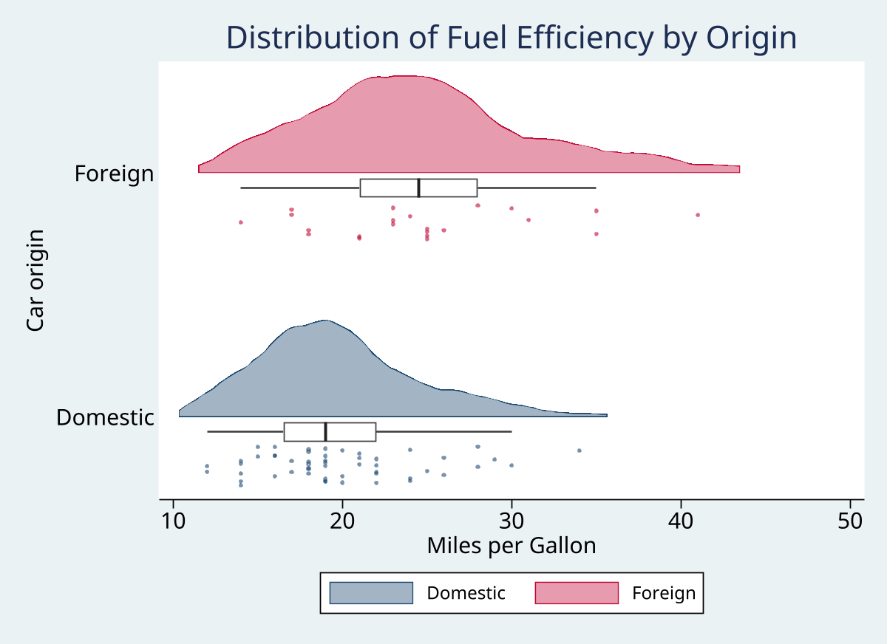
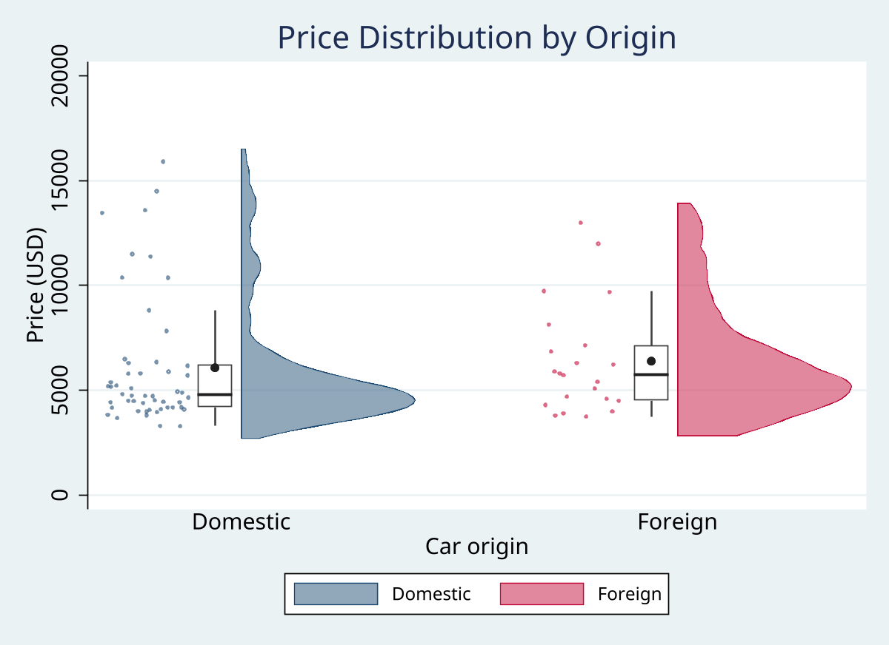
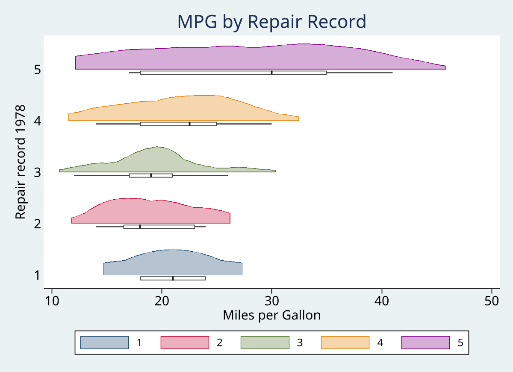
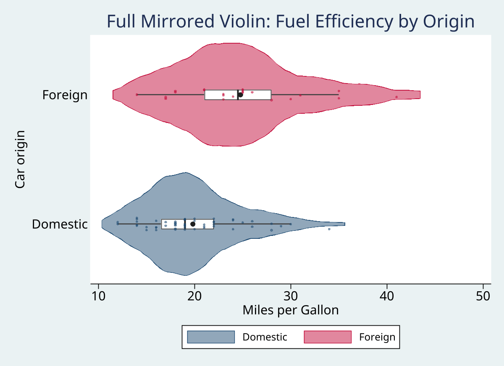
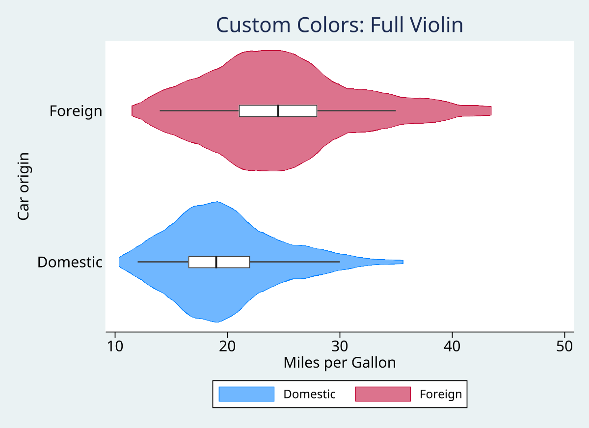
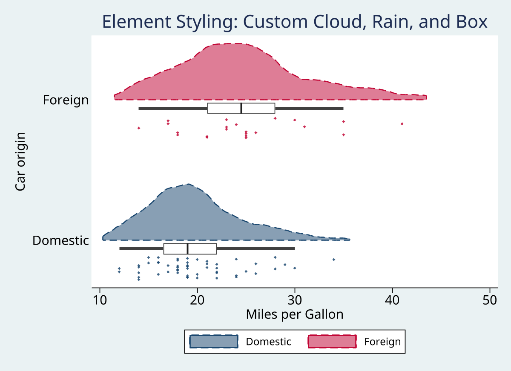
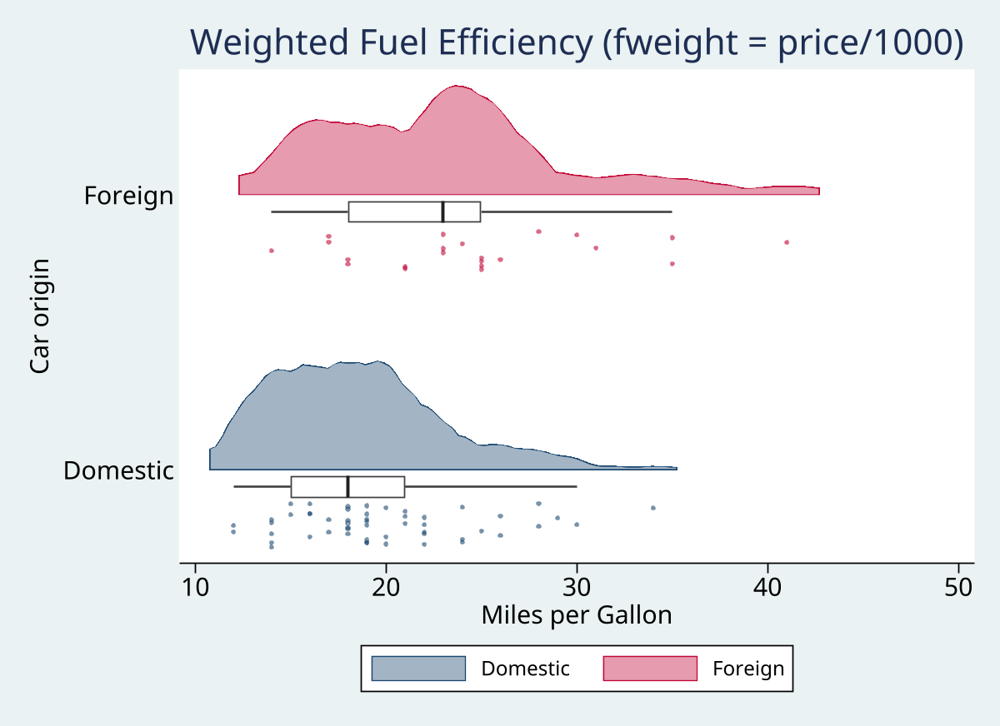

# raincloud — Raincloud plots for distributional comparisons

**Version 1.0.1** | 2026-08-05

`raincloud` combines a kernel-density cloud, jittered observations, and a box-and-whisker summary in one graph. It is for Stata users comparing distribution shape, raw values, and robust summaries across one or more groups.

## Quick Start

Compare fuel-efficiency distributions for domestic and foreign cars with Stata's built-in data:

```stata
sysuse auto, clear
raincloud mpg, over(foreign) seed(2026)
```

The graph shows the density, observed MPG values, and quartile summary for each origin group. `seed(2026)` makes the point jitter reproducible for this plot.

## Requirements

- Stata 16 or later
- No external packages or software

## Installation

Install the released package directly from the public Stata-Tools repository:

```stata
capture ado uninstall raincloud
net install raincloud, from("https://raw.githubusercontent.com/tpcopeland/Stata-Tools/main/raincloud") replace
```

## Commands

| Command | Description |
|---------|-------------|
| `raincloud` | Draw a raincloud plot from one numeric variable |

## How It Works

Each plot combines three views of the same distribution: a half-violin kernel density (`cloud`), jittered raw observations (`rain`), and a box-and-whisker summary (`box`).

Without `over()`, all marked observations are shown as one group. With `over(varname)`, the command creates one raincloud per numeric or string group and uses value labels when available.

The default orientation is horizontal, with the outcome on the x-axis and groups on the y-axis. `vertical` places the outcome on the y-axis and groups on the x-axis; `mirror` draws the density on both sides of the group center to form a split violin.

The cloud is estimated with Stata's `kdensity`, the rain layer uses `scatter`, and the box elements are assembled from group-wise quartiles, medians, means, and whisker endpoints. The command temporarily works on the marked sample and restores the data after drawing the graph.

## Worked Examples

### 1. Single distribution

```stata
sysuse auto, clear
raincloud mpg, seed(2026)
```

With no `over()` option, the command draws one raincloud and labels the group `All`.

### 2. Grouped comparison

```stata
sysuse auto, clear
raincloud mpg, over(foreign) seed(2026) title("MPG by car origin")
```

Use `over()` when the comparison concerns spread, skewness, overlap, or outliers as well as the center of the distribution.

### 3. Vertical layout with a mean marker

```stata
sysuse auto, clear
raincloud price, over(foreign) vertical mean seed(2026)
```

`mean` adds a filled marker at each group mean while the box retains the median and IQR summary.

### 4. Mirror density without points or boxes

```stata
sysuse auto, clear
raincloud mpg, over(foreign) mirror norain nobox seed(2026)
```

This produces a split-violin display of the group densities. At least one of the cloud, rain, or box elements must remain enabled.

### 5. Weights and element styling

```stata
sysuse auto, clear
gen int fw = max(1, round(price / 1000))
raincloud mpg [fweight = fw], over(foreign) seed(2026) ///
    cloudopts(lwidth(medium) lpattern(dash)) ///
    pointopts(msymbol(d) msize(tiny)) ///
    boxopts(lwidth(thick)) ///
    title("Weighted fuel efficiency")
```

`fweight` and `aweight` are supported. The three element-specific options pass graph options to the cloud, points, and box whisker line.

## Demo

The figures below are generated by [`demo/demo_raincloud.do`](demo/demo_raincloud.do) from a Stata-Tools repository checkout; the demo script and images are checkout assets rather than part of the `net install` payload.

| Figure | Focus |
|--------|-------|
|  | Grouped horizontal plot |
|  | `vertical` and `mean` |
|  | `norain` with five groups |
|  | `mirror` and `mean` |
|  | `colors()` and `norain` |
|  | `cloudopts()`, `pointopts()`, and `boxopts()` |
|  | `fweight` support |

From the repository root, run the generator with:

```stata
do raincloud/demo/demo_raincloud.do
```

## Command Reference

### Syntax

```stata
raincloud varname [if] [in] [fweight aweight], ///
    [over(varname) nocloud norain nobox noumbrella ///
     bandwidth(#) kernel(string) n(#) opacity(#) cloudwidth(#) cloudopts(string) ///
     jitter(#) seed(#) pointsize(string) pointopts(string) ///
     boxwidth(#) boxopts(string) nomedian mean ///
     overlap mirror horizontal vertical gap(#) colors(string) ///
     title(string) subtitle(string) note(string) name(string) saving(string) ///
     scheme(string) plotregion(string) graphregion(string) ///
     ytitle(string) xtitle(string) legend(string) *]
```

The command accepts exactly one numeric `varname`, optional `if`/`in` restrictions, and optional `fweight` or `aweight` expressions. The final `*` accepts additional options documented under Stata's `twoway_options`.

## Key Options

### Elements

| Option | Purpose | Default |
|--------|---------|---------|
| `nocloud` | Suppress the half-violin kernel density | Off |
| `norain` | Suppress the jittered raw observations | Off |
| `nobox` | Suppress the box-and-whisker summary | Off |
| `noumbrella` | Synonym for `nobox` | Off |

### Cloud

| Option | Purpose | Default |
|--------|---------|---------|
| `bandwidth(#)` | Use a nonnegative bandwidth for `kdensity`; `0` uses Stata's optimal selector | `0` |
| `kernel(string)` | Select any kernel accepted by `kdensity` | `epanechnikov` |
| `n(#)` | Set the number of density evaluation points; must be at least 10 | `200` |
| `opacity(#)` | Set cloud fill opacity from 0 (transparent) to 100 (opaque) | `50` |
| `cloudwidth(#)` | Set the maximum density width in axis units; must be positive | `0.4` |
| `cloudopts(string)` | Pass options to the cloud's underlying `rarea` layer | None |

### Rain

| Option | Purpose | Default |
|--------|---------|---------|
| `jitter(#)` | Set point-jitter intensity from 0 to 1 | `0.4` |
| `seed(#)` | Set the jitter seed; `-1` uses the current state, nonnegative values make the plot reproducible | `-1` |
| `pointsize(string)` | Set the marker size for the rain layer | `vsmall` |
| `pointopts(string)` | Pass options to the rain layer's underlying `scatter` command | None |

### Box

| Option | Purpose | Default |
|--------|---------|---------|
| `boxwidth(#)` | Set the IQR box width in axis units; must be positive | `0.08` |
| `boxopts(string)` | Pass options to the box whisker line | None |
| `nomedian` | Suppress the median line inside the box | Off |
| `mean` | Add a filled marker at the group mean | Off |

### Layout

| Option | Purpose | Default |
|--------|---------|---------|
| `over(varname)` | Stratify the plot by a numeric or string grouping variable | None |
| `horizontal` | Put the outcome on the x-axis and groups on the y-axis | On |
| `vertical` | Put the outcome on the y-axis and groups on the x-axis | Off |
| `gap(#)` | Set group spacing at positions `1*gap`, `2*gap`, and so on; must be positive | `1.0` |
| `overlap` | Place jittered points over the box instead of offset from it | Off |
| `mirror` | Draw the cloud on both sides of the group center | Off |
| `colors(string)` | Supply a space-separated list of Stata color names; colors cycle across groups | `navy cranberry forest_green dkorange purple teal maroon olive_teal` |

### Graph and twoway options

| Option | Purpose | Default |
|--------|---------|---------|
| `scheme(string)` | Select the graph scheme | Current Stata scheme |
| `title(string)` | Add a graph title | None |
| `subtitle(string)` | Add a graph subtitle | None |
| `note(string)` | Add a graph note | None |
| `name(string)` | Assign a graph name | None |
| `saving(string)` | Save the graph to a file | None |
| `plotregion(string)` | Pass plot-region options to the graph | Default |
| `graphregion(string)` | Pass graph-region options to the graph | Default |
| `xtitle(string)` | Set the x-axis title | Outcome label/name when horizontal; group label/name when grouped vertical |
| `ytitle(string)` | Set the y-axis title | Group label/name when grouped horizontal; outcome label/name when vertical |
| `legend(string)` | Set legend options; grouped plots otherwise receive an automatic legend | Off for one group; automatic for multiple groups |
| `*` | Pass any additional `twoway_options` to the graph command | As specified |

Stata's normal option-abbreviation rules apply; the full option names above are recommended in scripts. The command rejects simultaneous `horizontal` and `vertical`, and it rejects a call that suppresses all three elements.

## Stored Results

After a successful call, `raincloud` displays a short summary of the plotted variable, groups, observations, and active elements and stores the following in `r()`:

| Result | Type | Contents |
|--------|------|----------|
| `r(N)` | Scalar | Number of observations in the marked sample after `if`/`in` restrictions and missing-value exclusion |
| `r(n_groups)` | Scalar | Number of groups; `1` when `over()` is omitted |
| `r(varname)` | Local macro | Name of the plotted numeric variable |
| `r(over)` | Local macro | Name of the grouping variable when `over()` is specified; absent otherwise |
| `r(stats)` | Matrix | Group-wise summary statistics with columns `n`, `mean`, `sd`, `median`, `q25`, `q75`, `iqr`, and `bandwidth` |

Rows of `r(stats)` correspond to the groups in the plot; grouped results receive group row names. `bandwidth` contains the estimated `kdensity` bandwidth when a cloud is computed and is missing when density estimation is suppressed or skipped for a group.

For example:

```stata
sysuse auto, clear
raincloud mpg, over(foreign) seed(2026)
return list
matrix list r(stats)
```

## Assumptions and Limits

- The plotted variable must be numeric, and only one outcome variable can be supplied.
- `over()` accepts numeric or string variables. Observations missing the outcome or grouping value are excluded from the plot and stored counts.
- Groups with one observation or zero variance skip the cloud. A density estimate for a group with fewer than five observations may be unreliable.
- The default palette has eight colors; if fewer colors than groups are supplied, the palette cycles from the beginning.
- `bandwidth()` must be nonnegative, `opacity()` must be between 0 and 100, `jitter()` between 0 and 1, `n()` must be at least 10, and `cloudwidth()`, `boxwidth()`, and `gap()` must be positive.
- Omit `seed()` to use the current random-number state; the jitter consumes that state. With `seed(#)`, the command saves and restores the caller's random-number state after drawing; `-1` is the only negative value allowed.
- The command supports `fweight` and `aweight` expressions and preserves the data and `varabbrev` setting after execution.
- For very large datasets, consider `norain` to avoid rendering many points or reduce `n()` to shorten density estimation.

## References

- Allen M, Poggiali D, Whitaker K, Marshall TR, Kievit RA. 2019. Raincloud plots: a multi-platform tool for robust data visualization. *Wellcome Open Research* 4:63. [doi:10.12688/wellcomeopenres.15191.1](https://doi.org/10.12688/wellcomeopenres.15191.1)

## QA

QA suites and how to run them are documented in [`qa/README.md`](qa/README.md).

## Version History

- **1.0.1** (2026-08-05): Corrected shipped help metadata, documented graph options, and validated bandwidth and seed boundaries
- **1.0.0** (2026-07-10): Initial Stata-Tools release of `raincloud`

## Author

Timothy P Copeland, Karolinska Institutet

## License

MIT
