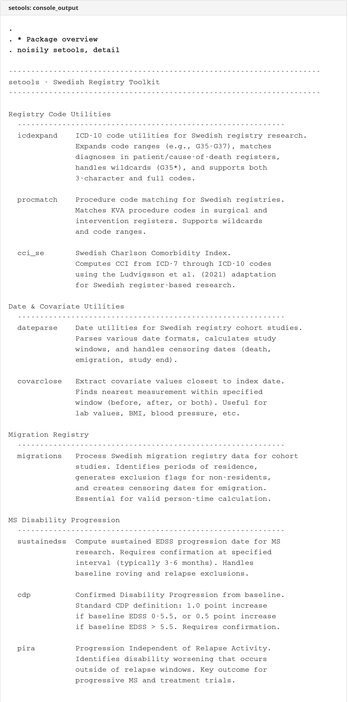
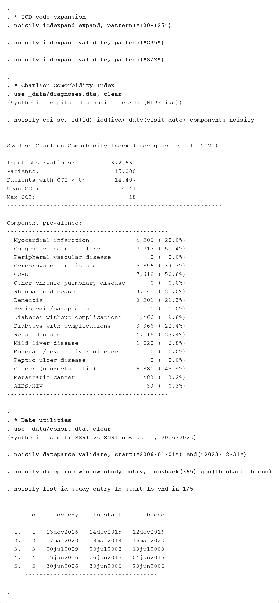

# setools

  

Toolkit for managing Swedish registry data in epidemiological cohort studies.

## Package Overview

**setools** provides commands for processing Swedish registry data, with a focus on comorbidity scoring, migration handling, and MS research:

| Command | Description |
|---------|-------------|
| **setools** | Package overview — lists all commands and categories |
| **cci_se** | Swedish Charlson Comorbidity Index (ICD-7 through ICD-10) |
| **migrations** | Process Swedish migration registry data for cohort studies |
| **procmatch** | KVÅ procedure code matching for Swedish registries |
| **sustainedss** | Compute sustained EDSS threshold dates (e.g., EDSS 4, EDSS 6) |
| **cdp** | Confirmed Disability Progression from baseline EDSS |
| **pira** | Progression Independent of Relapse Activity |
Run `setools` after installation to see all available commands, or `setools, detail` for descriptions.

## Screenshots

### Console Output



---

## cci_se - Swedish Charlson Comorbidity Index

**cci_se** computes the Swedish adaptation of the Charlson Comorbidity Index (CCI) from diagnosis-level registry data, using the algorithm from Ludvigsson et al. (2021). It supports ICD-7 through ICD-10 codes as used in Swedish national health registries, and handles ICD codes with or without dots automatically.

### Syntax

```stata
cci_se [if] [in], id(varname) icd(varname) date(varname) [options]
```

### Options

| Option | Description | Default |
|--------|-------------|---------|
| `id(varname)` | Patient identifier variable | Required |
| `icd(varname)` | String variable with ICD codes | Required |
| `date(varname)` | Date variable (Stata date or YYYYMMDD) | Required |
| `generate(name)` | Name for Charlson score variable | charlson |
| `components` | Generate binary indicators for each comorbidity | - |
| `prefix(string)` | Prefix for component variables | cci_ |
| `dateformat(string)` | Date format: stata, yyyymmdd, or ymd | auto |
| `noisily` | Display summary | - |

### Comorbidities and Weights

| Component | Weight | Component | Weight |
|-----------|--------|-----------|--------|
| Myocardial infarction | 1 | Diabetes (uncomplicated) | 1 |
| Congestive heart failure | 1 | Diabetes (complicated) | 2 |
| Peripheral vascular disease | 1 | Renal disease | 2 |
| Cerebrovascular disease | 1 | Mild liver disease | 1 |
| COPD | 1 | Moderate/severe liver disease | 3 |
| Other chronic pulmonary | 1 | Peptic ulcer disease | 1 |
| Rheumatic disease | 1 | Cancer (non-metastatic) | 2 |
| Dementia | 1 | Metastatic cancer | 6 |
| Hemiplegia/paraplegia | 2 | AIDS/HIV | 6 |

### Examples

```stata
* Basic usage — compute Charlson from synthetic NPR data
use _data/diagnoses.dta, clear
cci_se, id(id) icd(icd) date(visit_date) noisily

* With component indicators
cci_se, id(id) icd(icd) date(visit_date) components noisily

* Merge CCI back into analysis cohort
use _data/diagnoses.dta, clear
cci_se, id(id) icd(icd) date(visit_date)
save _data/cci.dta, replace
use _data/cohort.dta, clear
merge 1:1 id using _data/cci.dta, nogenerate keep(master match)
replace charlson = 0 if missing(charlson)
tab charlson
```

### Stored Results

| Scalar | Description |
|--------|-------------|
| `r(N_input)` | Number of input observations used |
| `r(N_patients)` | Number of unique patients in output |
| `r(N_any)` | Number of patients with CCI > 0 |
| `r(mean_cci)` | Mean Charlson score |
| `r(max_cci)` | Maximum Charlson score |

### Reference

Ludvigsson JF, Appelros P, Askling J, et al. Adaptation of the Charlson comorbidity index for register-based research in Sweden. *Clinical Epidemiology*. 2021;13:21-41.

---

## migrations - Process Swedish Migration Registry Data

**migrations** processes Swedish migration registry data to identify exclusions and censoring dates for cohort studies. It handles the complex logic of determining residency status at study entry and identifying emigration events for survival analysis censoring.

### Syntax

```stata
migrations, migfile(filename) [options]
```

### Options

| Option | Description | Default |
|--------|-------------|---------|
| `migfile(filename)` | Path to migrations_wide.dta file | Required |
| `idvar(varname)` | ID variable | id |
| `startvar(varname)` | Study start date variable | study_start |
| `minresidence(#)` | Minimum days of continuous residence before study start | 0 (disabled) |
| `saveexclude(filename)` | Save excluded observations to file | - |
| `savecensor(filename)` | Save emigration censoring dates to file | - |
| `replace` | Replace existing files | - |
| `verbose` | Display processing messages | - |
| `keepimmigrants` | Include (not exclude) post-start immigrants; generates `migration_in_dt` | - |

### How It Works

**Exclusion Criteria:**

1. **Type 1 - Emigrated before study start**: Last emigration occurred before study start AND last immigration occurred before last emigration (person left Sweden and never returned)

2. **Type 2 - Not in Sweden at baseline**: Only migration record is an immigration after study start (person was not in Sweden at study entry)

3. **Type 3 - Abroad at baseline**: Person emigrated before study start and returned after study start (person was abroad at their study start date but later re-entered Sweden)

**Censoring Logic:**

For individuals not excluded, the command identifies the first permanent emigration date after study start as `migration_out_dt`, representing when the person left Sweden and should be censored from follow-up. Temporary emigrations (where the person subsequently returned) are ignored for censoring purposes.

### Example

```stata
* Reshape migrations to wide format for the migrations command
* Input: long format with id, migration_type (I=immigration, E=emigration), migration_date
* Output: wide format with in_1, in_2, ..., out_1, out_2, ...
use _data/migrations.dta, clear
bysort id migration_type (migration_date): gen seq = _n
gen type_seq = migration_type + string(seq)
reshape wide migration_date, i(id) j(type_seq) string
* Rename to in_/out_ format expected by migrations command
rename migration_dateI* in_*
rename migration_dateE* out_*
save _data/migrations_wide.dta, replace

* Apply migration exclusions and get censoring dates
use _data/cohort.dta, clear
rename study_entry study_start
migrations, migfile("_data/migrations_wide.dta") verbose

* Use migration_out_dt in survival analysis
gen double end_date = min(death_date, migration_out_dt, td(31dec2023))
format end_date %td
stset end_date, failure(death_date < .) origin(study_start)
```

### Stored Results

| Scalar | Description |
|--------|-------------|
| `r(N_excluded_emigrated)` | Number excluded due to emigration before study start |
| `r(N_excluded_inmigration)` | Number excluded due to immigration after study start |
| `r(N_excluded_abroad)` | Number excluded due to being abroad at baseline |
| `r(N_excluded_minresidence)` | Number excluded due to insufficient residence |
| `r(N_excluded_total)` | Total number excluded |
| `r(N_censored)` | Number with emigration censoring dates |
| `r(N_included_inmigration)` | Number of post-start immigrants included (with `keepimmigrants`) |
| `r(N_final)` | Final sample size after exclusions |

---

## procmatch - KVÅ Procedure Code Matching

**procmatch** provides utilities for working with KVÅ (Klassifikation av vårdåtgärder) procedure codes in Swedish health registries. It supports pattern matching against multiple procedure variables and extraction of first occurrence dates.

### Subcommands

| Subcommand | Description |
|------------|-------------|
| `match` | Create binary indicator for procedure code matches |
| `first` | Extract first occurrence date of matching procedures |

### Syntax

```stata
* Match procedures
procmatch match, codes(string) procvars(varlist) [generate(name) replace prefix noisily]

* Get first occurrence
procmatch first, codes(string) procvars(varlist) datevar(varname) idvar(varname) ///
    [generate(name) gendatevar(name) replace prefix noisily]
```

### Example

```stata
* Find ECT procedures (DA024)
use _data/procedures.dta, clear
procmatch match, codes("DA024") procvars(kva_code) ///
    generate(ect) noisily
tab ect

* Find first cardiac procedure (coronary angiography or PCI)
use _data/procedures.dta, clear
procmatch first, codes("FNG02 FNG05") procvars(kva_code) ///
    datevar(proc_date) idvar(id) ///
    generate(cardiac_proc) gendatevar(cardiac_proc_dt) noisily
```

### Stored Results

| Result | Description |
|--------|-------------|
| `r(n_codes)` | Number of procedure codes searched |
| `r(n_matches)` | Number of matching observations |
| `r(n_persons)` | Number of persons with procedure (first only) |

---

## sustainedss - Compute Sustained EDSS Progression

**sustainedss** computes sustained EDSS (Expanded Disability Status Scale) progression dates for multiple sclerosis research. An EDSS progression event is considered "sustained" if the disability level is maintained within a confirmation window.

### Syntax

```stata
sustainedss idvar edssvar datevar [if] [in], threshold(#) [options]
```

### Options

| Option | Description | Default |
|--------|-------------|---------|
| `threshold(#)` | EDSS threshold for progression | Required |
| `generate(newvar)` | Name for generated date variable | sustained#_dt |
| `confirmwindow(#)` | Confirmation window in days | 182 |
| `baselinethreshold(#)` | EDSS level for reversal check | same as threshold() |
| `keepall` | Retain all observations | Keep only patients with events |
| `quietly` | Suppress iteration messages | - |

### Algorithm

1. Identifies the first date when EDSS reaches or exceeds the threshold
2. Examines EDSS measurements within the confirmation window
3. Rejects events where the lowest subsequent EDSS falls below baseline threshold AND the last EDSS in the window is below target threshold
4. For rejected events, replaces the EDSS value with the last observed value and repeats
5. Continues until all remaining events are confirmed as sustained

### Examples

```stata
* Sustained EDSS 4 using synthetic MS data
use _data/relapses.dta, clear
sustainedss id edss edss_date, threshold(4)

* Sustained EDSS 6 with custom variable name
use _data/relapses.dta, clear
sustainedss id edss edss_date, threshold(6) generate(edss6_sustained)

* 3-month confirmation window
use _data/relapses.dta, clear
sustainedss id edss edss_date, threshold(4) confirmwindow(90)
```

### Stored Results

| Scalar | Description |
|--------|-------------|
| `r(N_events)` | Number of sustained events identified |
| `r(iterations)` | Number of iterations required |
| `r(converged)` | 1 if algorithm converged, 0 if iteration limit reached |
| `r(threshold)` | EDSS threshold used |
| `r(confirmwindow)` | Confirmation window in days |

| Macro | Description |
|-------|-------------|
| `r(varname)` | Name of generated variable |

---

## cdp - Confirmed Disability Progression

**cdp** computes confirmed disability progression (CDP) dates from longitudinal EDSS measurements. CDP is a standard outcome in MS clinical trials and observational studies.

### Definition

- **Baseline EDSS**: First measurement within 24 months of diagnosis (or earliest available)
- **Progression threshold**:
  - Baseline EDSS ≤5.5: requires ≥1.0 point increase
  - Baseline EDSS >5.5: requires ≥0.5 point increase
- **Confirmation**: Sustained at subsequent measurement ≥6 months later

### Syntax

```stata
cdp idvar edssvar datevar [if] [in], dxdate(varname) [options]
```

### Options

| Option | Description | Default |
|--------|-------------|---------|
| `dxdate(varname)` | Diagnosis date variable | Required |
| `generate(name)` | Name for CDP date variable | cdp_date |
| `confirmdays(#)` | Days for confirmation | 180 |
| `baselinewindow(#)` | Days from diagnosis for baseline | 730 |
| `roving` | Reset baseline after each progression | - |
| `allevents` | Track all CDP events (requires roving) | - |
| `keepall` | Retain all observations | - |
| `quietly` | Suppress output messages | - |

### Examples

```stata
* Basic CDP with 6-month confirmation
use _data/relapses.dta, clear
cdp id edss edss_date, dxdate(dx_date)

* Track multiple progressions with roving baseline
use _data/relapses.dta, clear
cdp id edss edss_date, dxdate(dx_date) roving allevents keepall
```

### Stored Results

| Result | Description |
|--------|-------------|
| `r(N_persons)` | Number of persons with CDP |
| `r(N_events)` | Total number of CDP events |
| `r(confirmdays)` | Confirmation period in days |
| `r(baselinewindow)` | Baseline window in days |

---

## pira - Progression Independent of Relapse Activity

**pira** identifies confirmed disability progression events that occur outside of a window around relapses, indicating progression not attributable to acute relapse activity.

### Definition

- Runs CDP algorithm to identify confirmed progression
- Checks if progression falls within relapse window (default: 90 days before to 30 days after)
- **PIRA**: Progression outside relapse window
- **RAW**: Relapse-Associated Worsening (progression within relapse window)

### Syntax

```stata
pira idvar edssvar datevar [if] [in], dxdate(varname) relapses(filename) [options]
```

### Options

| Option | Description | Default |
|--------|-------------|---------|
| `dxdate(varname)` | Diagnosis date variable | Required |
| `relapses(filename)` | Path to relapse dataset | Required |
| `relapseidvar(varname)` | ID variable in relapse file | Same as idvar |
| `relapsedatevar(varname)` | Relapse date variable in relapse file | relapse_date |
| `windowbefore(#)` | Days before relapse to exclude | 90 |
| `windowafter(#)` | Days after relapse to exclude | 30 |
| `generate(name)` | Name for PIRA date variable | pira_date |
| `rawgenerate(name)` | Name for RAW date variable | raw_date |
| `confirmdays(#)` | Days for CDP confirmation | 180 |
| `baselinewindow(#)` | Days from diagnosis for baseline EDSS | 730 |
| `rebaselinerelapse` | Reset baseline after relapses | - |
| `keepall` | Retain all observations | - |
| `quietly` | Suppress output messages | - |

### Examples

```stata
* Prepare relapse dataset (one row per relapse)
use _data/relapses.dta, clear
keep if relapse_date < .
keep id relapse_date
save _data/relapses_only.dta, replace

* Basic PIRA analysis
use _data/relapses.dta, clear
pira id edss edss_date, dxdate(dx_date) relapses(_data/relapses_only.dta)

* Lublin 2014 definition (30 days after relapse only)
use _data/relapses.dta, clear
pira id edss edss_date, dxdate(dx_date) relapses(_data/relapses_only.dta) ///
    windowbefore(0) windowafter(30)

* Compare PIRA vs RAW
use _data/relapses.dta, clear
pira id edss edss_date, dxdate(dx_date) relapses(_data/relapses_only.dta) keepall
gen str4 progression_type = cond(!missing(pira_date), "PIRA", ///
    cond(!missing(raw_date), "RAW", "None"))
tab progression_type
```

### Stored Results

| Scalar | Description |
|--------|-------------|
| `r(N_cdp)` | Total CDP events |
| `r(N_pira)` | PIRA events |
| `r(N_raw)` | RAW events |
| `r(windowbefore)` | Days before relapse in window |
| `r(windowafter)` | Days after relapse in window |
| `r(confirmdays)` | Confirmation period in days |
| `r(baselinewindow)` | Baseline window in days |

---

## Installation

Install directly from GitHub:

```stata
net from https://raw.githubusercontent.com/tpcopeland/Stata-Tools/main/setools
net install setools
```

## Requirements

- Stata 16.0 or higher
- No additional dependencies

## Author

Timothy P Copeland
Department of Clinical Neuroscience
Karolinska Institutet, Stockholm, Sweden

## License

MIT License

## Version

Version 1.0.0, 2026-04-08
