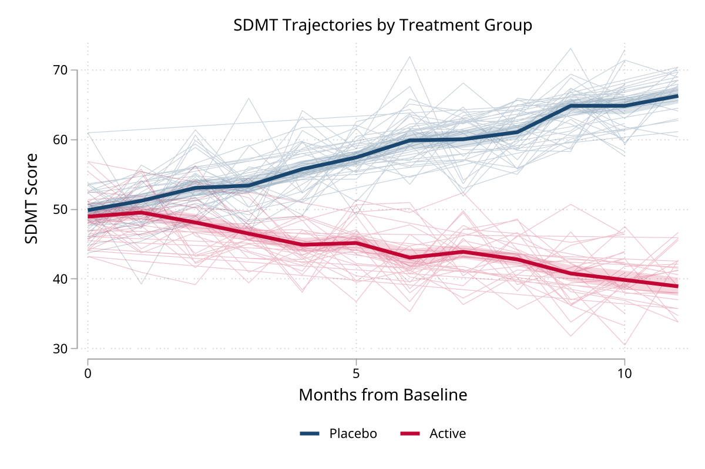
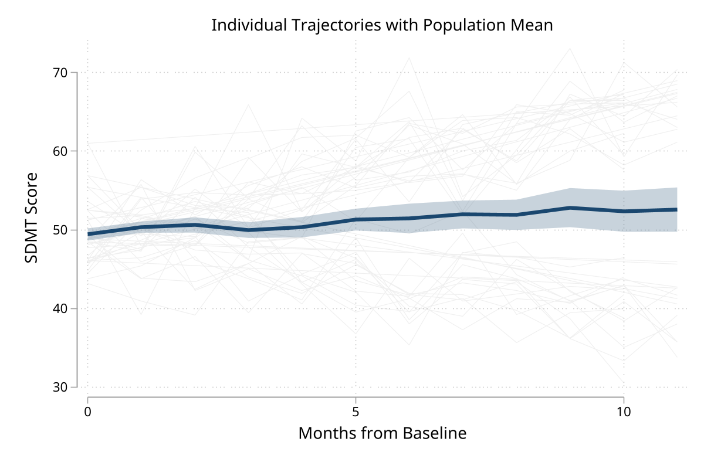
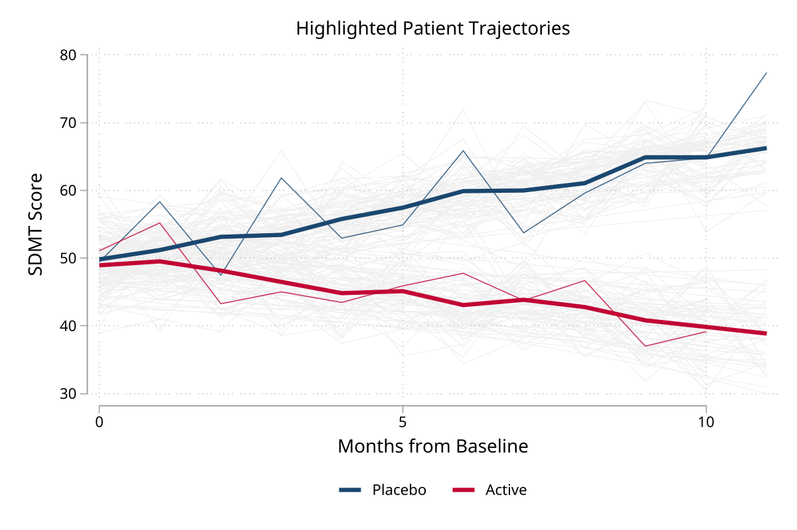
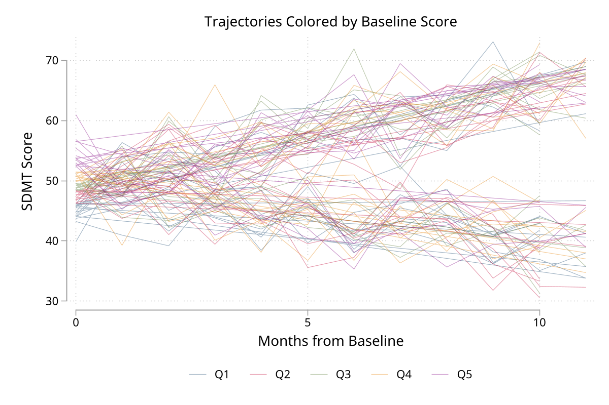

# spaghetti

 

One-command longitudinal trajectory plots with group mean overlays for Stata. Turn thousands of individual time series into a clean, readable visualization.

Version 1.0.0

## The Problem

Visualizing individual trajectories in longitudinal data requires either (a) manually writing one `line` clause per individual, or (b) giving up and only showing the mean. With 500+ patients, neither option works.

```stata
* The painful way: one line per patient, then give up at patient 47
twoway (line sdmt months if patid==1, lcolor(gs12) lwidth(vthin)) ///
       (line sdmt months if patid==2, lcolor(gs12) lwidth(vthin)) ///
       ... // 498 more lines
```

## The Solution

```stata
spaghetti sdmt, id(patid) time(months) by(treatment) mean(bold ci)
```



Individual trajectories as thin background lines, group means as bold overlays with 95% CI bands. Handles 10,000+ individuals with just 1-8 plot elements by using a line-break technique instead of one element per person.

## Installation

```stata
net install spaghetti, from("https://raw.githubusercontent.com/tpcopeland/Stata-Tools/main/spaghetti") replace
```

## Gallery

### Random Sample with Population Mean
```stata
spaghetti sdmt, id(patid) time(months) sample(30) seed(42) mean(bold ci)
```


### Highlighted Individuals
```stata
spaghetti sdmt, id(patid) time(months) by(treatment) ///
    highlight(patid==5 | patid==55) mean(bold)
```


### Color by Baseline Score
```stata
spaghetti sdmt, id(patid) time(months) colorby(baseline_score)
```


## Syntax

```stata
spaghetti varname [if] [in] , id(varname) time(varname) [options]
```

## Options

### Core

| Option | Description |
|--------|-------------|
| `id(varname)` | Individual identifier variable **(required)** |
| `time(varname)` | Numeric time variable **(required)** |
| `by(varname)` | Group variable for colored trajectories + separate means (max 8 levels) |
| `mean(subopts)` | Add group mean overlay. Sub-options: `bold`, `ci`, `smooth(lowess\|linear)` |

### Subsetting

| Option | Description |
|--------|-------------|
| `sample(#)` | Randomly display # individuals (mean computed on full data) |
| `seed(#)` | Random seed for reproducible sampling |
| `highlight(conditions)` | Emphasize specific individuals; others fade to background. Sub-option: `bgopacity(#)` |
| `colorby(varname [, categorical])` | Color trajectories by a variable (continuous: quintiles; categorical: distinct levels) |

### Annotations & Styling

| Option | Description |
|--------|-------------|
| `refline(# [, label() style()])` | Vertical reference line at a timepoint |
| `colors(colorlist)` | Override default palette (navy cranberry forest_green ...) |
| `individual(color() opacity() lwidth())` | Individual line styling (defaults: gs12, 25, vthin) |
| `export(filename [, replace])` | Export graph (.png, .pdf, .svg, .eps) |
| `scheme(name)` | Graph scheme (default: plotplainblind) |

### Standard Graph Options

`title()`, `subtitle()`, `note()`, `ytitle()`, `xtitle()`, `plotregion()`, `graphregion()`, `name()`, `saving()`, and any `twoway` options via passthrough.

## Examples

### Basic Trajectories
```stata
sysuse nlswork, clear
spaghetti ln_wage, id(idcode) time(year)
```

### By-Group with Mean and CI
```stata
spaghetti ln_wage, id(idcode) time(year) by(race) mean(bold ci)
```

### Declutter Large Panels
```stata
spaghetti ln_wage, id(idcode) time(year) sample(100) seed(12345) mean(bold)
```

### Highlight + Background Control
```stata
spaghetti ln_wage, id(idcode) time(year) ///
    highlight(idcode==1 | idcode==2 bgopacity(10))
```

### Custom Styling
```stata
spaghetti ln_wage, id(idcode) time(year) by(race) ///
    individual(color(gs10) opacity(15) lwidth(vthin)) ///
    mean(bold ci) colors(navy cranberry)
```

### Reference Line
```stata
spaghetti sdmt, id(patid) time(months_from_switch) ///
    refline(0, label("Treatment switch") style(dash))
```

## Stored Results

| Result | Description |
|--------|-------------|
| `r(N)` | Number of observations |
| `r(n_ids)` | Number of unique individuals |
| `r(n_sampled)` | Individuals displayed after sampling |
| `r(n_groups)` | Number of by-groups |
| `r(cmd)` | Full graph command executed |
| `r(outcome)` | Outcome variable name |
| `r(id)` | ID variable name |
| `r(time)` | Time variable name |
| `r(by)` | By-variable name (if specified) |

## How It Works

Rather than creating one `(line ...)` plot element per individual (which hits Stata's ~300 element limit), `spaghetti` inserts missing-value rows between individuals and draws all trajectories as a single `line` element with `cmissing(n)`. This scales to arbitrarily large panels.

When `sample()` is specified, the mean overlay is computed on the **full** dataset before sampling, so the population mean is always accurate regardless of how many trajectories are displayed.

## Data Requirements

- Long format (one row per individual-timepoint)
- Numeric outcome variable
- Numeric time variable
- ID variable (numeric or string)

## Author

Timothy P Copeland
Department of Clinical Neuroscience, Karolinska Institutet
