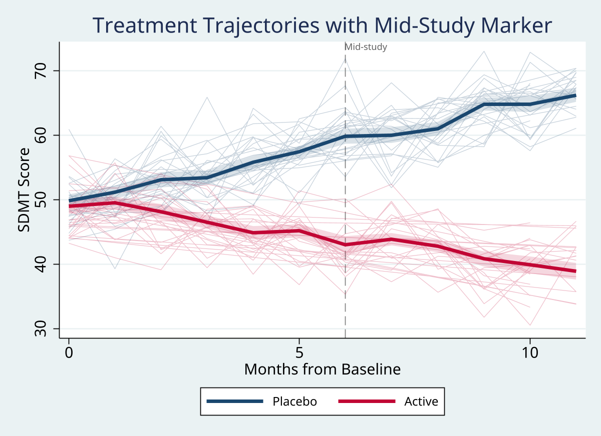
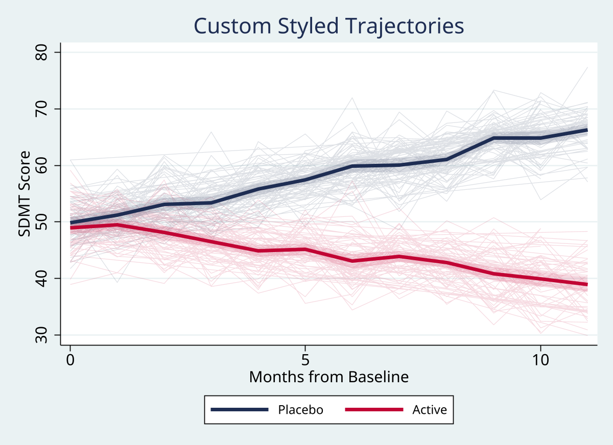

# spaghetti

 

One-command longitudinal trajectory plots with optional group mean overlays for Stata.

`spaghetti` is built for long-format repeated-measures data where you want to show individual trajectories without manually writing hundreds of `line` clauses.

## Installation

```stata
capture ado uninstall spaghetti
net install spaghetti, from("https://raw.githubusercontent.com/tpcopeland/Stata-Tools/main/spaghetti") replace
help spaghetti
```

## How It Works

The command takes one outcome variable plus required `id()` and `time()` variables:

```stata
spaghetti outcome, id(person_id) time(timevar) [options]
```

The most common extensions are:

- `by()` for separate groups
- `mean()` for overlaid group means
- `sample()` when the panel is too dense to show every trajectory clearly
- `highlight()` or `colorby()` when you want to emphasize specific trajectories

Internally, `spaghetti` avoids Stata's practical plot-element limit by combining many individuals into a single broken-line layer rather than drawing one plot element per subject.

## Worked Examples

All examples below use `webuse nlswork`, so they are runnable immediately after installation.

### 1. Start with the plain trajectory plot

```stata
webuse nlswork, clear
spaghetti ln_wage, id(idcode) time(year)
```

### 2. Add by-group mean overlays

This is the default presentation most users want: thin background lines for individuals and a bold mean trend on top.

```stata
webuse nlswork, clear
spaghetti ln_wage, id(idcode) time(year) by(race) mean(bold ci)
```


### 3. Declutter a dense panel with random sampling

`sample()` reduces the number of displayed individual trajectories, while the mean overlay is still computed from the full data.

```stata
webuse nlswork, clear
spaghetti ln_wage, id(idcode) time(year) sample(100) seed(12345) mean(bold)
```


### 4. Highlight specific individuals

Use `highlight()` when a few trajectories deserve emphasis and the rest should fade into the background.

```stata
webuse nlswork, clear
spaghetti ln_wage, id(idcode) time(year) ///
    highlight(idcode == 1 | idcode == 2 bgopacity(10))
```


### 5. Customize styling and group colors

```stata
webuse nlswork, clear
spaghetti ln_wage, id(idcode) time(year) by(race) ///
    individual(color(gs12) opacity(10) lwidth(vthin)) ///
    mean(bold ci) colors(navy cranberry)
```

### 6. Add a reference line

```stata
webuse nlswork, clear
spaghetti ln_wage, id(idcode) time(year) ///
    sample(50) ///
    refline(80, label("Policy change") style(dash))
```

## Key Options

### Core structure

| Option | Description |
| --- | --- |
| `id(varname)` | Required individual identifier |
| `time(varname)` | Required numeric time variable |
| `by(varname)` | Group variable for separate colored trajectories and means |
| `mean(subopts)` | Add mean overlays; suboptions include `bold`, `ci`, and `smooth(lowess|linear)` |

### Decluttering and emphasis

| Option | Description |
| --- | --- |
| `sample(#)` | Randomly display `#` individuals |
| `seed(#)` | Reproducible sampling |
| `highlight()` | Emphasize selected trajectories and fade the background |
| `colorby(varname [, categorical])` | Color trajectories by a continuous or categorical variable |

### Styling and output

| Option | Description |
| --- | --- |
| `refline(# [, label() style()])` | Vertical reference line |
| `colors(colorlist)` | Override the default palette |
| `individual(color() opacity() lwidth())` | Control individual-line appearance |
| `export(filename [, replace])` | Export the graph to disk |
| `scheme(name)` | Graph scheme |

Standard graph options such as `title()`, `subtitle()`, `note()`, `ytitle()`, `xtitle()`, `plotregion()`, `graphregion()`, `name()`, and `saving()` are also passed through.

## Stored Results

| Result | Description |
| --- | --- |
| `r(N)` | Number of observations used |
| `r(n_ids)` | Number of unique individuals |
| `r(n_sampled)` | Number of displayed individuals after sampling |
| `r(n_groups)` | Number of groups in `by()` |
| `r(cmd)` | Full graph command executed |
| `r(outcome)` | Outcome variable |
| `r(id)` | ID variable |
| `r(time)` | Time variable |
| `r(by)` | By-variable, if supplied |

## Gallery

### Color by baseline score


### Reference line



### Custom style



## Data Requirements

- Long format, with one row per person-time observation
- Numeric outcome variable
- Numeric time variable
- ID variable that uniquely identifies individuals

## Version

**Version**: 1.0.0

## Author

Timothy P Copeland, Karolinska Institutet

## License

MIT License
