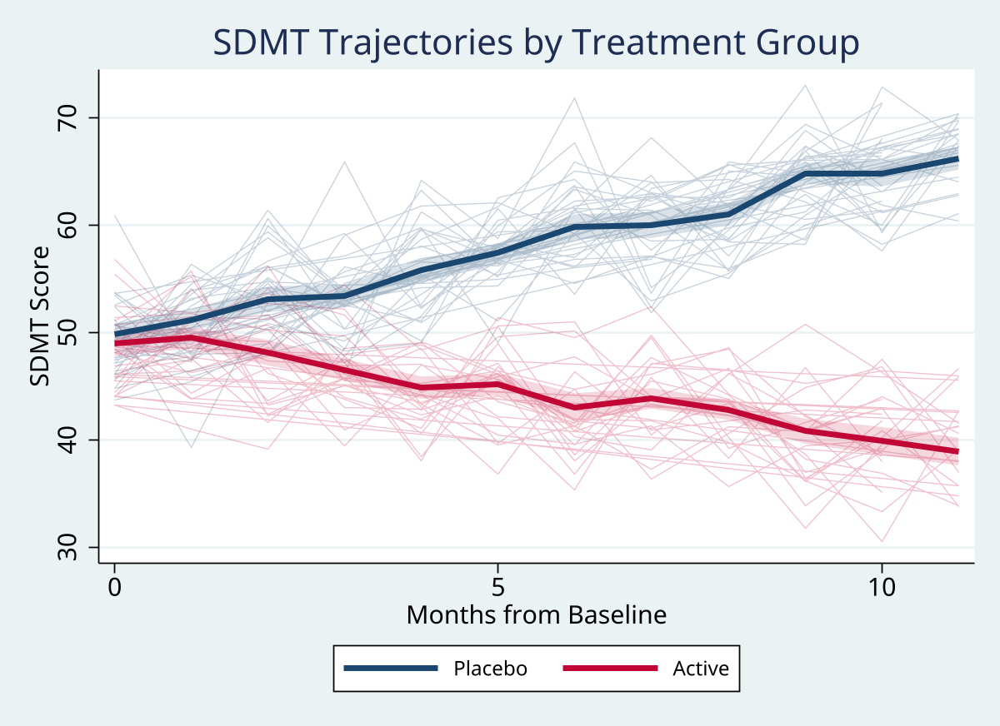
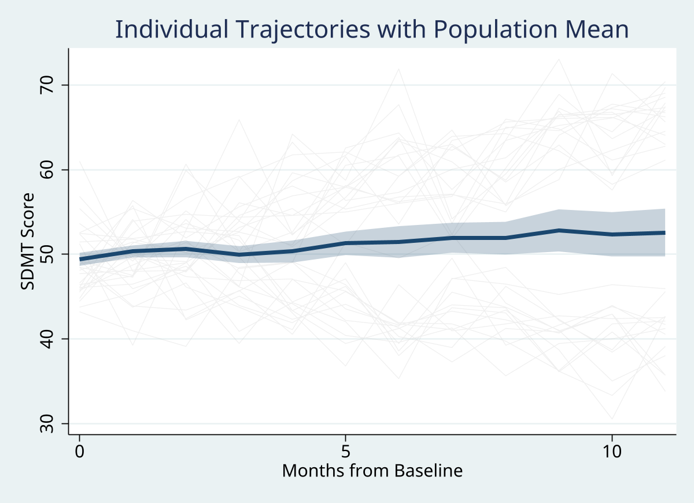
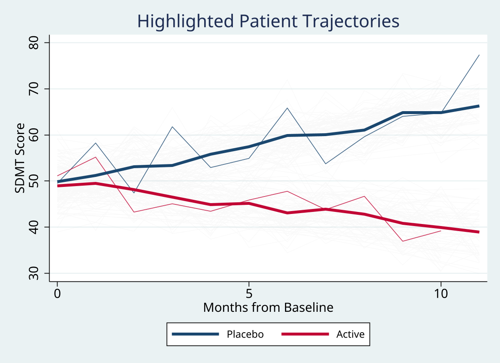
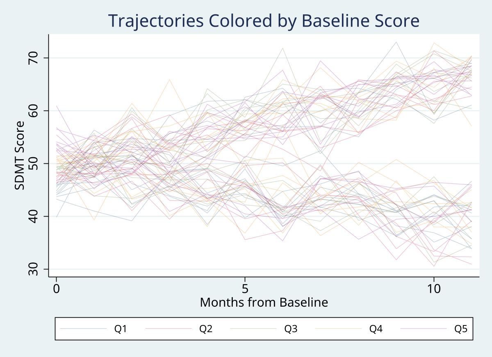
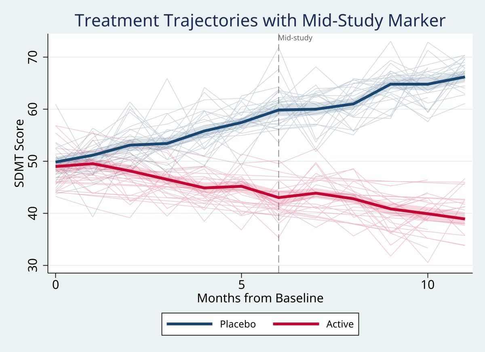
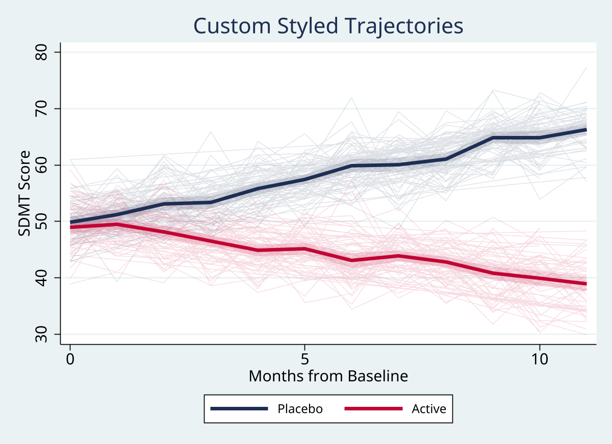
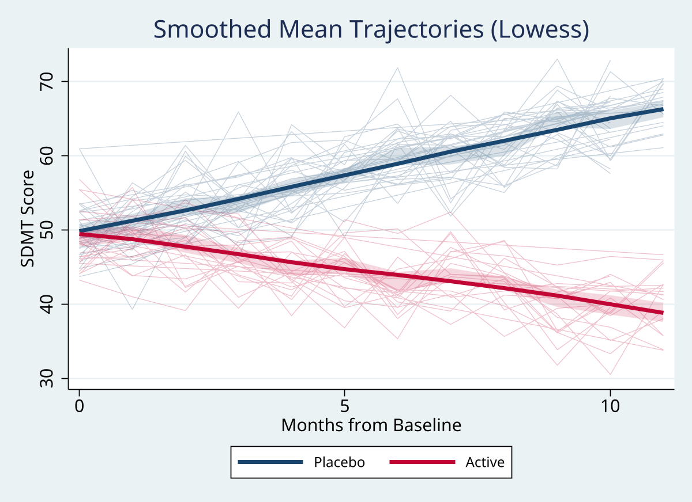

# spaghetti — Longitudinal trajectory plots with mean overlays

**Version 1.0.1** | 2026-08-05

`spaghetti` draws individual trajectories for long-format repeated-measures data in one Stata graph. It is for analysts who need to inspect change over time by group, add mean and confidence-band overlays, or declutter large panels with sampling and highlights.

## Quick Start

After installation, load a longitudinal dataset and add a group-specific mean with a 95% confidence band:

```stata
webuse nlswork, clear
spaghetti ln_wage, id(idcode) time(year) by(race) mean(bold ci)
```

The graph shows one line per individual, colored by `race`, with a bold mean trajectory and confidence band for each group.

## Requirements

- Stata 16 or later
- Long-format data with one row per individual-time observation
- One numeric outcome variable and one numeric time variable; the identifier may be numeric or string

## Installation

```stata
capture ado uninstall spaghetti
net install spaghetti, from("https://raw.githubusercontent.com/tpcopeland/Stata-Tools/main/spaghetti") replace
```

The installation includes the internal helper files used for ID sampling and mean computation.

## Commands

| Command | Description |
|---------|-------------|
| `spaghetti` | Draw individual longitudinal trajectories with optional grouping, coloring, mean overlays, and export |

## How It Works

`spaghetti` marks the observations allowed by `if`/`in` and removes observations missing the outcome, identifier, time, or `by()` variable. It then draws the trajectories in one or more line layers, inserting gaps between individuals so dense panels do not require one graph layer per person.

- `by()` creates separate trajectory layers and, when requested, separate mean overlays for up to 8 group levels.
- `mean()` collapses the retained data to time-specific means before `sample()` is applied. With `by()`, means are computed within groups.
- `sample()` selects individuals rather than individual observations, so all retained rows for a selected ID are shown. The mean remains based on the full retained data.
- `colorby()` uses up to 5 quantile groups for a continuous numeric variable, or distinct levels when `categorical` is specified.
- `highlight()` evaluates Stata expressions and propagates a selected row condition to every retained row for the same individual.
- A successful call restores the original dataset after building the graph and leaves no helper variables behind.

## Worked Examples

### 1. Basic trajectories

Use the required `id()` and `time()` options to connect each individual's observations.

```stata
webuse nlswork, clear
spaghetti ln_wage, id(idcode) time(year)
```

### 2. Group-specific means and confidence bands

`by()` separates the trajectories and mean overlays by group. `mean(ci)` adds a 95% normal-approximation confidence band.

```stata
webuse nlswork, clear
spaghetti ln_wage, id(idcode) time(year) by(race) mean(bold ci)
```

### 3. Sample a dense panel and smooth the mean

Sampling reduces visual clutter without changing the mean overlay. The seed makes the selected IDs reproducible, and `smooth(lowess)` smooths the mean line only.

```stata
webuse nlswork, clear
spaghetti ln_wage, id(idcode) time(year) sample(100) seed(12345) ///
    mean(bold smooth(lowess) ci)
```

### 4. Highlight selected individuals

Conditions can use standard Stata expressions. `bgopacity()` changes the opacity of non-highlighted trajectories.

```stata
webuse nlswork, clear
spaghetti ln_wage, id(idcode) time(year) ///
    highlight(idcode == 1 | idcode == 2 bgopacity(10))
```

### 5. Color by a baseline value and export

Create a value that is constant within each individual, use it for continuous color grouping, and export the resulting graph in a Stata-supported format.

```stata
webuse nlswork, clear
bysort idcode (year): gen baseline_lnwage = ln_wage[1]
spaghetti ln_wage, id(idcode) time(year) colorby(baseline_lnwage) ///
    sample(60) seed(42) ///
    refline(80, label("Mid-study") style(dash)) ///
    export(spaghetti_nlswork.png, replace)
```

## Demo

Regenerate the figures below with `demo/demo_spaghetti.do` from the repository root; the script creates a synthetic 100-person, 12-visit panel and writes the PNGs under `demo/`.

| Output | Command focus |
|--------|---------------|
|  | `by()` with `mean(bold ci)` |
|  | `sample()` with `mean()` |
|  | `highlight()` with `bgopacity()` |
|  | Continuous `colorby()` |
|  | `refline()` with a label |
|  | `colors()` and `individual()` |
|  | `mean(smooth(lowess))` with `by()` |

## Command Reference

```stata
spaghetti varname [if] [in], id(varname) time(varname) ///
    [by(varname) mean(options) sample(#) seed(#) ///
     highlight(conditions [bgopacity(#)]) ///
     colorby(varname [, categorical]) ///
     refline(# [, label("text") style(pattern)]) ///
     export(filename [, replace]) colors(colorlist) ///
     individual(options) title(string) subtitle(string) note(string) ///
     name(name) saving(filename [, replace]) scheme(schemename) ///
     plotregion(options) graphregion(options) ///
     ytitle(string) xtitle(string) twoway_options]
```

`varname` is one numeric outcome variable. `id()` and `time()` are required; `time()` must be numeric. The command also accepts standard `if` and `in` qualifiers. The final `twoway_options` placeholder represents additional options passed through to Stata's `twoway` graph command, including options such as `xlabel()`, `ylabel()`, `xsize()`, and `ysize()`.

## Key Options

### Input and grouping

| Option | Default and behavior |
|--------|----------------------|
| `id(varname)` | Required. Identifies individuals and may be numeric or string. |
| `time(varname)` | Required. Numeric variable used for the x-axis. |
| `by(varname)` | Off. Separates trajectories and mean overlays by group; at most 8 nonmissing levels are allowed. |
| `colorby(varname [, categorical])` | Off. A continuous numeric variable is split into up to 5 quantile groups; `categorical` uses distinct levels directly and permits string variables. Missing color values are excluded. Cannot be combined with `by()` or `highlight()`. |

### Means and subsetting

| Option | Default and behavior |
|--------|----------------------|
| `mean(options)` | Off. Supports `bold`, `ci`, and `smooth(lowess|linear)`. The mean line is `medthick` by default and `thick` with `bold`; `ci` adds a 95% normal-approximation band. |
| `sample(#)` | `0`, meaning no sampling. A positive value randomly selects IDs and keeps all retained rows for each selected ID; a request at least as large as the available ID count keeps all IDs. |
| `seed(#)` | `-1`. When sampling, a nonnegative seed controls ID selection; the command restores the caller's random-number state afterward. |
| `highlight(conditions [bgopacity(#)])` | Off. Evaluates a Stata expression and emphasizes every row for selected IDs. The background opacity defaults to the `individual(opacity())` setting and can be overridden with `bgopacity()`. |

### Annotation and styling

| Option | Default and behavior |
|--------|----------------------|
| `refline(# [, label("text") style(pattern)])` | Off. Draws a vertical line at the specified time; `style()` defaults to `dash`. |
| `colors(colorlist)` | `navy cranberry forest_green dkorange purple teal maroon olive_teal`. Supply at least one color for every `by()` or `colorby()` group. |
| `individual(options)` | `color(gs12) opacity(25) lwidth(vthin)`. Controls non-mean trajectory color, opacity, and line width. |
| `scheme(schemename)` | The current Stata graph scheme. |

### Graph and export options

| Option | Default and behavior |
|--------|----------------------|
| `title(string)` | Off. Sets the graph title. |
| `subtitle(string)` | Off. Sets the graph subtitle. |
| `note(string)` | Off. Sets the graph note. |
| `ytitle(string)` | The outcome variable label, or the outcome variable name when no label exists. |
| `xtitle(string)` | The time variable label, or the time variable name when no label exists. |
| `plotregion(options)` | Stata's default plot-region settings. Passed to `twoway`. |
| `graphregion(options)` | Stata's default graph-region settings. Passed to `twoway`. |
| `name(name)` | Off. Names the graph; an existing graph with that name is replaced by default. |
| `saving(filename [, replace])` | Off. Saves the graph using Stata's `saving()` graph option; add `replace` to overwrite an existing file. |
| `export(filename [, replace])` | Off. Exports the displayed graph, for example to `.png`, `.pdf`, `.svg`, or `.eps`; add `replace` to overwrite an existing file. |

Option names may be abbreviated according to the syntax; the full names above are used in examples.

## Stored Results

After a successful call, `spaghetti` stores the following results in `r()`:

| Result | Type | Meaning |
|--------|------|---------|
| `r(N)` | Scalar | Observations retained after `if`/`in` and required-variable checks, before ID sampling; observations with missing `colorby()` values are also excluded. |
| `r(n_ids)` | Scalar | Unique IDs among the retained observations before sampling. |
| `r(n_sampled)` | Scalar | IDs displayed after sampling, or all retained IDs when sampling is off or the request is large enough to keep everyone. |
| `r(n_groups)` | Scalar | Number of `by()` groups, or `1` when `by()` is not specified. |
| `r(cmd)` | Local macro | The full `twoway` graph command executed. |
| `r(outcome)` | Local macro | The outcome variable name. |
| `r(id)` | Local macro | The identifier variable name. |
| `r(time)` | Local macro | The time variable name. |
| `r(by)` | Local macro | The `by()` variable name, stored only when `by()` is specified. |

Inspect the results with `return list` immediately after the command.

## Assumptions and Limits

- Data should be in long format, with observations ordered by individual and time for the clearest connected trajectories. The command sorts its working copy for line drawing and restores the original data after a successful call.
- Missing outcome, ID, time, and `by()` values are excluded from the graph. Missing values in `colorby()` are excluded as well.
- `by()` supports at most 8 levels, and the supplied color palette must have enough colors for the active groups. The same palette requirement applies to categorical or quantile `colorby()` groups.
- Continuous `colorby()` requires a numeric variable. Use `colorby(varname, categorical)` for string variables or for direct level-based coloring.
- `mean(ci)` uses the normal approximation `mean ± invnormal(.975) * SD/sqrt(N)` at each time point. With `mean(smooth(... ) ci)`, the confidence band is based on the unsmoothed means while the displayed mean line is smoothed.
- `mean(smooth(lowess))` and `mean(smooth(linear))` leave groups with fewer than three collapsed time points unsmoothed.
- `highlight()` uses valid Stata expressions and propagates a selected condition to all rows for the same ID. `colorby()` cannot be combined with `by()` or `highlight()`.

## Version History

- **1.0.1** (2026-08-05): Expanded option documentation and corrected help metadata and rendering details
- **1.0.0** (2026-07-10): Initial Stata-Tools release

## Author

Timothy P Copeland, Karolinska Institutet

## License

MIT License; see the repository [LICENSE](../LICENSE).
