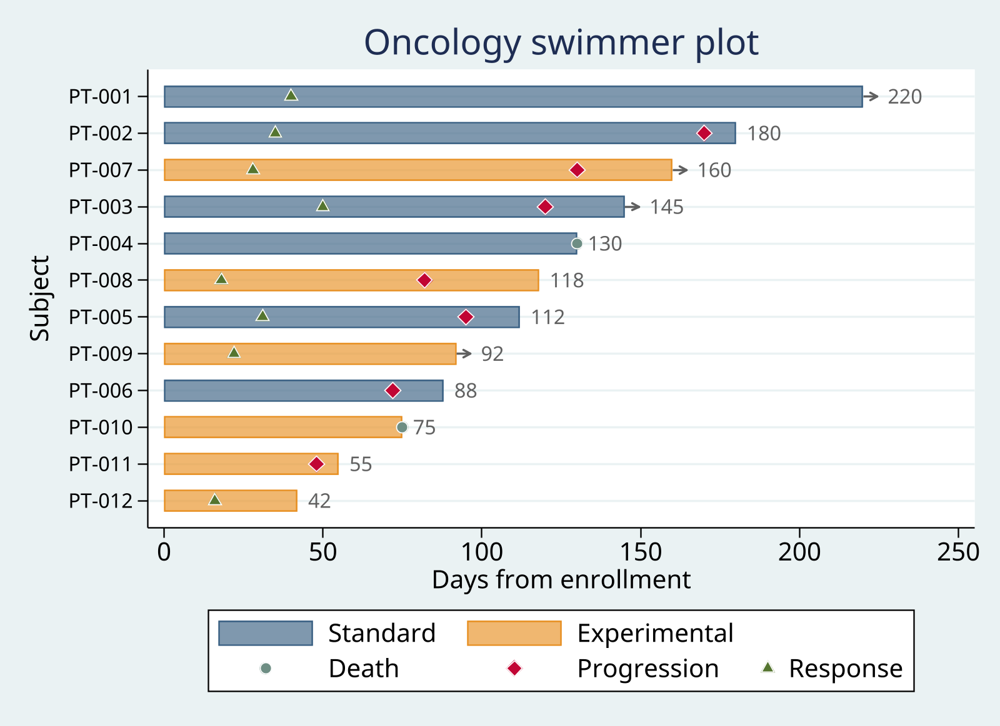
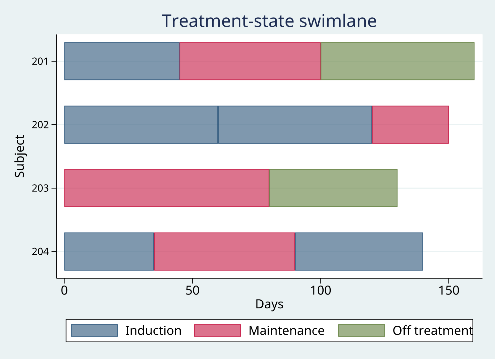
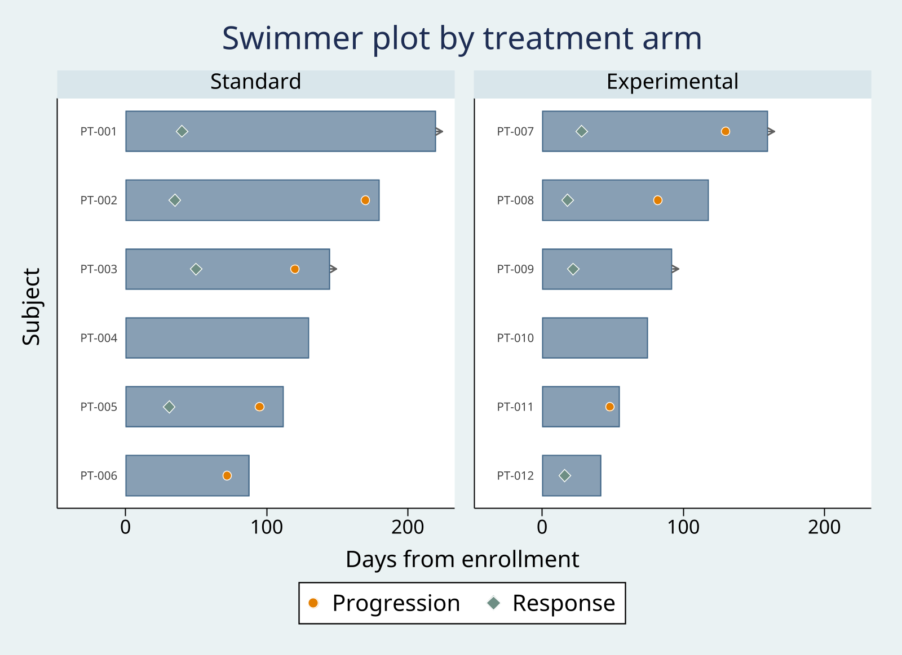
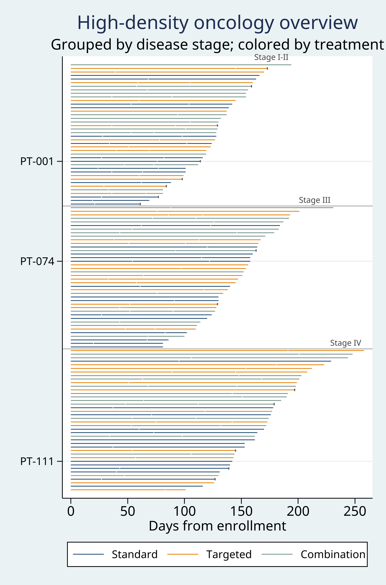
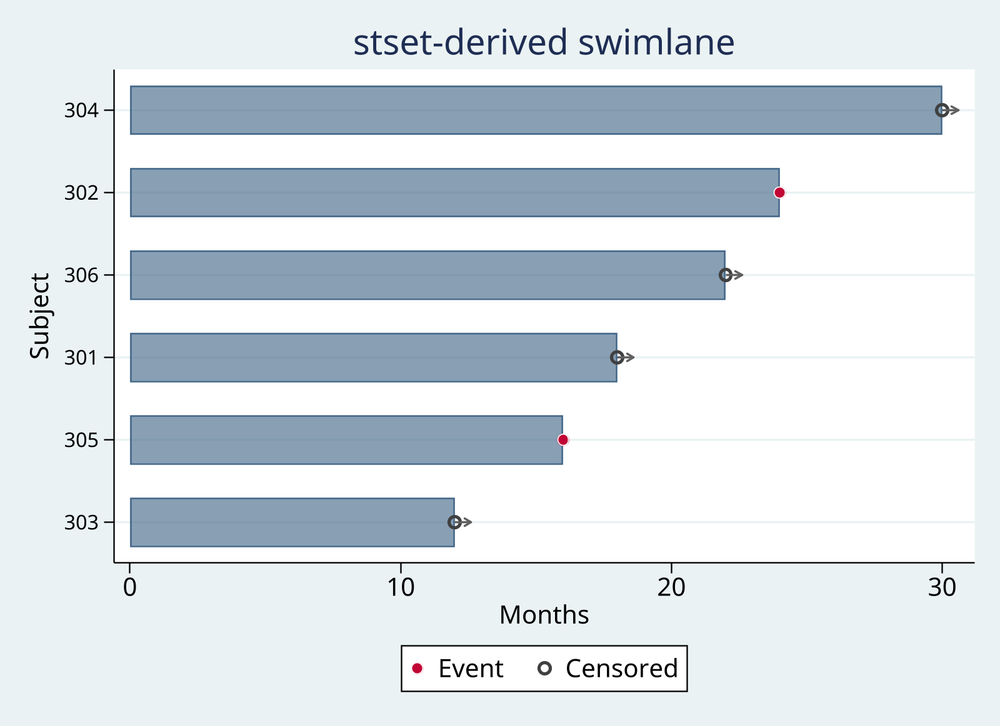
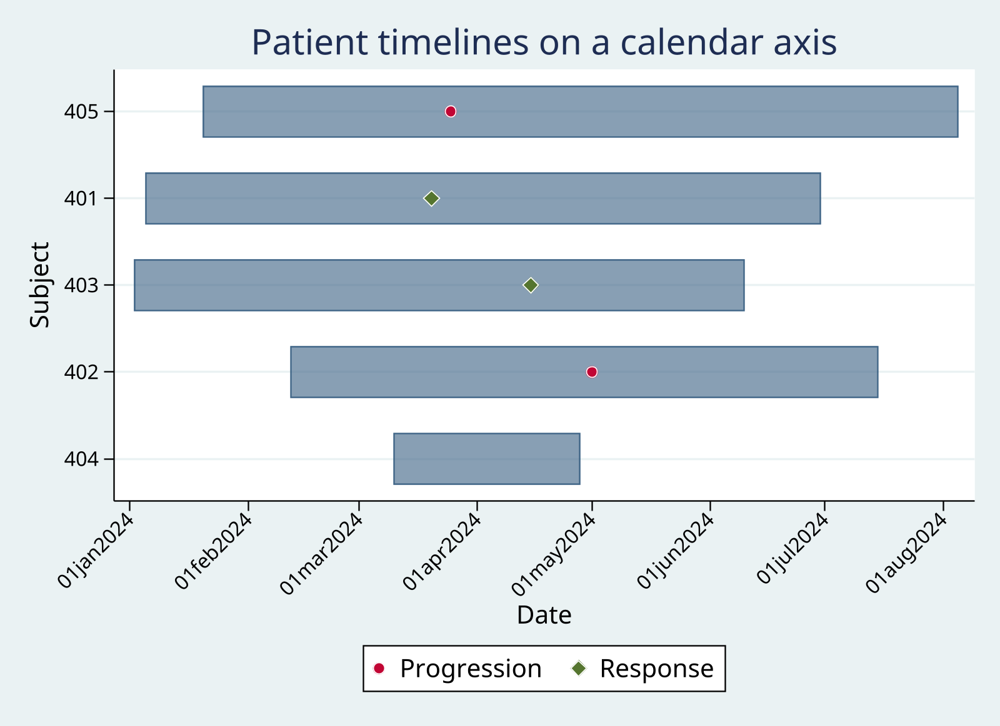

# swimlane — Swimmer and state swimlane plots

**Version 0.1.0** | 2026-06-29

`swimlane` draws swimmer and state swimlane plots for clinical and longitudinal data. It accepts wide subject-level, long interval, or `stset` input and can also write the canonical lane table.

## Quick Start

Create one lane per subject with duration bars, event markers, and arrows for ongoing subjects:

```stata
clear
input id duration response progression ongoing
1 140 30 120 1
2  60 20   . 0
3  30  .  25 0
4 200 80 150 1
end

swimlane, id(id) duration(duration) events(response progression) ///
    eventlabels("Response" "Progression") ongoing(ongoing)
```

## Requirements

- Stata 16 or later

## Installation

Install the released package from Stata-Tools:

```stata
capture ado uninstall swimlane
net install swimlane, from("https://raw.githubusercontent.com/tpcopeland/Stata-Tools/main/swimlane") replace
```

## Commands

| Command | Description |
|---------|-------------|
| `swimlane` | Draw a swimmer or state swimlane plot and optionally export its canonical lane table |

## How It Works

`swimlane` first resolves the input into a canonical lane table and then renders horizontal bars, exact interval layers, event markers, and censoring markers with `twoway`.

- `mode(auto)` is the default. It selects state mode when `state()` is supplied and swimmer mode otherwise; `mode(swimmer)` and `mode(state)` select a mode explicitly.
- Wide input requires exactly one row per subject and uses `duration()` for the bar plus optional `events()` variables for event times. If only `events()` is supplied, zero-width lanes are retained and marked with a tick.
- Long input uses `start()` and `stop()` for interval rows. In swimmer mode, intervals are collapsed to one span per subject; in state mode, each interval is a colored segment from `state()`. Every interval is validated before any collapse. `intervalstart()` and `intervalstop()` add exact response or treatment spans without changing their coordinates.
- Events can be embedded in long input through `eventvar()` or read from a separate Stata frame through `eventframe()`, keyed by `eventid()` and `eventtime()`. An event-only long row may omit `stop()` and, in state mode, `state()`; it remains an event and is excluded from the interval-bar payload.
- When no explicit time source is supplied, recognized `stset` data use `_t0`, `_t`, `_d`, and `_st`; only `_st==1` observations contribute lanes, group levels, and subject-level checks. `censor` adds a distinct marker for final intervals with `_d==0`.
- `idlabel()` separates display aliases from analytic identifiers. With `by()`, `bylayout(aligned)` preserves a common lane grid and `bylayout(compact)` renumbers lanes within each panel.
- State intervals are audited for gaps and overlaps; events outside each retained subject's observed span are counted and reported without clipping. `palette()` supplies accessible named presets, while `addplot()` appends arbitrary layers in the canonical frame.
- `lanetype(line)` replaces filled duration bars with thin, category-colored line segments. `laneheight()` derives a reproducible graph height from points or logical pixels, while `markers()` and `continuation()` independently reduce or suppress point and arrow clutter.
- `density(dense)` coordinates all-subject thin-line output, five-point lanes, minimal markers, capped continuations, and automatic labels; explicit component options override the preset. `density(auto)` chooses standard through 60 subjects and dense above 60, then reports the resolved settings.
- `savedata()` writes the canonical table and `frame()` copies it to a persistent frame. Schema 3 includes global `rank`, facet `panel`, resolved multi-key sort metadata, `label_selected`, and `block`/`blocklab`/`block_start` alongside the drawing columns; `.dta` files and frames carry schema and resolved render characteristics. `rowtype` may be `bar`, `interval`, `event`, or `censor`. `nograph` builds that table and the stored results without drawing the graph.

## Worked Examples

### 1. Inline example data with compact facets

Create de-identified synthetic oncology data, keep analytic identifiers private with `idlabel()`, and remove empty facet rows with `bylayout(compact)`.

```stata
clear
input subject_id str5 display_id duration response progression death ongoing str9 arm
101 "P-101" 140 30 120  . 1 "Control"
102 "P-102"  60 20   .  . 0 "Control"
103 "P-103"  90 25  80 90 0 "Treatment"
104 "P-104" 200 80 150  . 1 "Treatment"
end
swimlane, id(subject_id) idlabel(display_id) duration(duration) ///
    events(response progression death) ///
    eventlabels("Response" "Progression" "Death") ongoing(ongoing) ///
    by(arm) bylayout(compact) palette(colorblind)
```

### 2. Long state intervals

Supply one row per interval and value labels for readable state names. `intervalcheck(warn)` is the state-mode default and reports gaps or overlaps without changing the supplied intervals.

```stata
clear
input id start stop state
1 0 2 1
1 2 4 2
2 0 5 1
3 1 3 3
end
label define state_lbl 1 "Treatment A" 2 "Treatment B" 3 "Off treatment"
label values state state_lbl

swimlane, id(id) start(start) stop(stop) state(state) ///
    stateorder("Treatment A" "Treatment B" "Off treatment") ///
    intervalcheck(warn)
```

### 3. Events from a separate frame

Keep event records in their natural long frame. Every event ID must match a subject in the lane data; the source frame is not modified.

```stata
clear
input id start stop
1 0 200
2 0 150
end

capture frame drop trial_events
frame create trial_events
frame change trial_events
input id evtime str12 evtype
1 40 "Response"
1 120 "Progression"
2 60 "Response"
end
frame change default

swimlane, id(id) start(start) stop(stop) ///
    eventframe(trial_events) eventtime(evtime) eventtype(evtype)
```

### 4. Exact interval layers with direct labels

Response or treatment intervals are plotted exactly as supplied. This example uses `addplot()` in the canonical frame to label the added interval series directly.

```stata
clear
input id start stop response_start response_stop str12 response_type
1 0 200 40 120 "Response"
2 0 150 30  90 "Response"
end

swimlane, id(id) start(start) stop(stop) ///
    intervalstart(response_start) intervalstop(response_stop) ///
    intervaltype(response_type) ///
    addplot((scatter lane stop if rowtype == "interval", ///
        msymbol(none) mlabel(series) mlabposition(3)))
```

### 5. `stset` input with censoring markers

After `stset`, `swimlane` uses the survival-time variables automatically. `censor` adds an open-circle marker for subjects whose final interval has `_d==0`.

```stata
clear
input id t d
1 5 0
2 8 1
3 3 0
end
stset t, failure(d) id(id)

swimlane, id(id) censor
```

## High-density cookbook

Generate one deterministic large-N fixture, then compare the backward-compatible 60-subject view with physically sized 250- and 1,000-subject output:

```stata
clear
set obs 1000
generate long id = _n
generate double duration = 20 + mod(37 * id, 181)
generate byte stage_group = 1 + mod(id - 1, 4)
generate byte arm = 1 + mod(floor((id - 1) / 4), 3)
label define stage_group 1 "Stage I" 2 "Stage II" 3 "Stage III" 4 "Stage IV"
label values stage_group stage_group
label define treatment 1 "Standard" 2 "Targeted" 3 "Combination"
label values arm treatment
generate byte highlight = mod(id, 97) == 0

swimlane if id <= 60, id(id) duration(duration) density(standard)

swimlane if id <= 250, id(id) duration(duration) ///
    density(dense) laneheight(5pt) idlabels(every 25) ///
    export(swimlane_250.pdf, replace)

swimlane, id(id) duration(duration) density(dense) ///
    sort(+stage_group -duration +id missing(last)) ///
    blockby(stage_group) colorby(arm) ///
    idlabels(every 100) labelif(highlight) ///
    export(swimlane_1000.pdf, replace)
```

The standard call deliberately retains the existing 60-subject default. In the 1,000-subject call, `blockby(stage_group)` organizes lanes into disease-stage blocks while the independent `colorby(arm)` option colors treatments within every block. Dense mode implies `maxids(all)`, `lanetype(line)`, `laneheight(5pt)`, `markers(minimal)`, `continuation(cap)`, and `idlabels(auto)` unless an explicit component option overrides it. PDF or SVG is preferable to PNG when zooming or document scaling must preserve thin individual lanes. “All included” does not guarantee “all individually legible” after rasterization; check `r(points_per_lane)` and `r(readability_warning)`.

For an explicit wrapped overview, define panel membership in the source data. This is not automatic pagination, and the canonical `panel` column records the resulting facet:

```stata
generate int page = ceil(id / 50)
swimlane if id <= 250, id(id) duration(duration) density(dense) ///
    sort(+page -duration +id missing(last)) ///
    by(page) bylayout(compact) idlabels(none) ysize(12)
```

### Overview, inspect, drill down, and paginate

Build the population overview once, link the exported global rank back to the subject data, inspect any rank range, and rerun labelled pages under that fixed order:

```stata
swimlane, id(id) duration(duration) density(dense) ///
    sort(+stage_group -duration +id missing(last)) ///
    blockby(stage_group) colorby(arm) ///
    frame(all_lanes, replace)

frame all_lanes: keep if rowtype == "bar" & seg == 1
frame all_lanes: keep id rank
frame all_lanes: isid id
frlink 1:1 id, frame(all_lanes)
frget rank, from(all_lanes)

summarize duration if inrange(rank, 101, 125), detail
swimlane if inrange(rank, 101, 125), id(id) duration(duration) ///
    sort(+rank +id missing(last)) maxids(all) ///
    idlabels(all) laneheight(12pt)

forvalues p = 1/20 {
    local lo = 50 * (`p' - 1) + 1
    local hi = 50 * `p'
    swimlane if inrange(rank, `lo', `hi'), id(id) duration(duration) ///
        sort(+rank +id missing(last)) maxids(all) ///
        idlabels(all) laneheight(12pt) ///
        export(swimlane_page_`p'.pdf, replace)
}
```

For long source data, use `frlink m:1 id` because each subject has multiple source rows. The initial global rank, not a newly inferred order, then governs the drill-down and every page.

### Sorting recipes

Every recipe below states missing-value placement explicitly.

| Goal | Preparation and `sort()` specification |
|------|----------------------------------------|
| Duration, start, or ID | `sort(duration descending missing(last))`, `sort(start ascending missing(last))`, or `sort(id ascending missing(last))` |
| One subject variable | `sort(site ascending missing(last))`; `site` must be constant within subject |
| Wide event time | `sort(progression ascending missing(last))`; absent events remain missing and sort last |
| Arm, then duration | `sort(+arm -duration +id missing(last))` |
| Prespecified review sequence | Create numeric `review_order`, run `assert !missing(review_order)`, then use `sort(+review_order +id missing(last))` |
| First event in long data | `bysort id: egen first_progression = min(cond(event == 1, event_time, .))`, then `sort(+first_progression +id missing(last))` |
| Time in a long-data state | `bysort id: egen time_in_state = total(cond(state == 2, stop - start, 0))`, then `sort(-time_in_state +id missing(last))` |

`swimlane` requires every prepared custom key to be subject-constant and never guesses a first-event or state-duration aggregation from labels.

## Demo

The demo script is a checkout-only workflow. Run `demo/demo_swimlane.do` from the repository root to regenerate the six graph assets and their matching canonical-table markdown files under `swimlane/demo/`.

| Output | Workflow |
|--------|----------|
|  | Synthetic wide data with `idlabel()`, `colorby(arm)`, `palette(colorblind)`, and `barlabel(duration)`; see [swimmer_oncology.md](demo/swimmer_oncology.md) |
|  | Long state intervals with `stateorder()`; see [state_episodes.md](demo/state_episodes.md) |
|  | Bundled data faceted with `by(arm) bylayout(compact)` and `palette(colorblind)`; see [faceted_by_arm.md](demo/faceted_by_arm.md) |
|  | `density(auto)` resolves to thin-line dense rendering for 120 subjects, with `blockby(stage_group)` defining disease-stage blocks, `colorby(arm)` encoding treatments within each block, selected subject labels, minimal event markers omitted from the treatment legend, and capped continuations; see [dense_overview.md](demo/dense_overview.md) |
|  | `stset` input with `censor`; see [stset_survival.md](demo/stset_survival.md) |
|  | Long events with `%td` endpoints and event categories; see [long_events_dates.md](demo/long_events_dates.md) |

## Command Reference

```stata
swimlane [if] [in], id(varname) [options]
```

`id()` is required and may identify subjects with a numeric or string variable. Additional `twoway_options` are passed to the underlying `twoway` call after the package options. The option inventory below uses full option names; Stata also accepts the documented minimum abbreviations shown in the `.sthlp` file.

## Key Options

### Mode and input

| Option | Effect and default |
|--------|-------------------|
| `id(varname)` | Required subject identifier; numeric and string identifiers are accepted, including `strL` values up to 2,045 bytes |
| `idlabel(varname)` | Subject display label kept separate from the analytic ID; must be nonmissing and constant within subject |
| `mode(string)` | Selects `auto`, `swimmer`, or `state`; default is `auto` |
| `start(varname)` | Numeric interval start for long input; must be paired with `stop()` |
| `stop(varname)` | Numeric interval stop for long input; must be paired with `start()` |
| `state(varname)` | Categorical state for colored segments; in `auto` mode it selects state mode |
| `duration(varname)` | Numeric subject duration for wide swimmer input |
| `events(varlist)` | Numeric event-time variables for wide input; missing times produce no marker |
| `eventlabels(string)` | Labels for `events()` in order; defaults to event variable names and requires a matching count |
| `eventvar(varname)` | Nonzero event indicator for long input; requires the `start()` and `stop()` options, while an event-only row may omit its `stop` value and, in state mode, its state |
| `eventtime(name)` | Event time in active long data or a separate event frame; defaults to row `stop` for `eventvar()` and is required for `eventframe()` |
| `eventtype(name)` | Event category in active long data or a separate event frame; value labels are used, and missing categories remain visible in the `Event` series |
| `eventframe(name)` | Separate frame holding event records; IDs must map to the source lane data, records excluded by `if`/`in` are ignored, and the frame is not modified |
| `eventid(name)` | ID variable in `eventframe()`; defaults to the active `id()` variable name |
| `intervalstart(varname)` | Exact start of an additional interval layer in long input; paired with `intervalstop()` |
| `intervalstop(varname)` | Exact stop of an additional interval layer in long input; paired with `intervalstart()` |
| `intervaltype(varname)` | Category and legend label for interval layers; defaults to one `Interval` series |
| `intervalcheck(string)` | State-mode geometry action: `warn` (default), `error`, or `off`; coordinates are never repaired |
| `ongoing(varname)` | Numeric indicator for open-ended bars; nonzero values draw right-pointing arrow caps, missing values mean zero, and an explicit variable overrides the `stset` default |
| `origin(varname)` | Numeric subject-specific time origin for wide input; default is zero and it shifts bar endpoints and relative event times |
| `nostset` | Disables automatic detection of `stset` data |
| `eventsabsolute` | Treats wide `events()` values as absolute time rather than adding `origin()`; requires `events()` |
| `stateorder(string)` | Sets the display order for `state()` categories; requires `state()`, rejects unknown, duplicate, or ambiguous labels, and appends unlisted states afterward in natural order |
| `censor` | Adds an open-circle marker for final `stset` intervals with `_d==0`; requires `stset` data |

### Lane layout

| Option | Effect and default |
|--------|-------------------|
| `sort(string)` | Orders by one legacy key or up to eight signed keys such as `+arm -duration +id`, with explicit `missing(first)` or `missing(last)` and a deterministic ascending-ID tie-break |
| `maxids(#\|all)` | Limits the canonical table and plot to the first sorted subjects or retains everyone with `all`; default is 60 |
| `density(string)` | Renderer preset: backward-compatible `standard` (default), coordinated all-subject `dense`, or thresholded `auto`; explicit component options override a preset |
| `lanetype(string)` | Lane primitive: filled `bar` (default) or thin category-colored `line` |
| `laneheight(spec)` | Physical height per lane, such as `5pt` or `8px`; faceted output uses a deterministic square-root column layout and accounts for every vertical panel row, while total height is capped at Stata's 800-inch graph limit |
| `barwidth(#)` | Sets bar thickness in y-axis units; default is 0.6 and the value must be positive |
| `barlabel(spec)` | `duration` labels bar tips and `none` suppresses labels; default is `none`, and duration labels are swimmer-only |
| `markers(string)` | Event/censor glyph policy: `full`, `minimal`, or `none`; `auto` resolves to `full` in standard mode |
| `continuation(string)` | Open-ended treatment mark: `arrow`, `cap`, or `none`; `auto` resolves to `arrow` in standard mode |
| `idlabels(string)` | Subject labels: `all`, `none`, `auto`, or `every #`; auto requires at least 10 resolved points per lane for all labels |
| `labelif(varname)` | Numeric subject-level highlight flag unioned with periodic or automatic labels; missing means unselected |
| `noylabels` | Alias for `idlabels(none)` |
| `nograph` | Builds the canonical table and stored results without drawing; incompatible with `export()` and `saving()` |
| `bylayout(string)` | Facet layout: `aligned` (default) uses one common lane grid, while `compact` renumbers lanes within panels |

### Grouping and styling

| Option | Effect and default |
|--------|-------------------|
| `by(varname)` | Facets the graph by a subject-level group that is constant within `id()`; no more than 12 group levels are allowed |
| `blockby(varname)` | Adds one-panel headers and separators for contiguous ranked runs of a subject-level variable; it can be paired with `colorby()` to encode a second grouping dimension and is incompatible with `by()` |
| `colorby(varname)` | Colors swimmer duration bars by a subject-level group and can differ from `blockby()`; it cannot be combined with `by()` or `state()` |
| `refline(numlist)` | Adds dashed vertical reference lines |
| `colors(colorlist)` | Overrides the palette; the default is `navy cranberry forest_green dkorange purple teal maroon olive gold sienna emidblue eltgreen`, consumed by bars, interval layers, and then event series |
| `palette(string)` | Named preset: `default`, `colorblind`, `mono`, or `scheme`; an explicit `colors()` list takes precedence |
| `msymbols(symbols)` | Sets event marker symbols; default is `circle diamond triangle square plus X` |
| `msize(markersizestyle)` | Sets event marker size; default is `medium` |
| `title(string)` | Sets the graph title |
| `subtitle(string)` | Sets the graph subtitle |
| `note(string)` | Sets the graph note |
| `xtitle(string)` | Sets the x-axis title; default is `Time` |
| `ytitle(string)` | Sets the y-axis title; default is `Subject` |
| `legend(string)` | Customizes the generated legend; positioning options are merged with generated series labels, while `off` or `order()` takes control |
| `scheme(schemename)` | Sets the graph scheme; default is the active scheme |
| `name(name[, replace])` | Sets the graph name; the default `swimlane` graph is replaced automatically, while explicitly named existing graphs require `replace` |
| `saving(filename[, ...])` | Passes filename and options to graph `saving()` |
| `addplot(plot)` | Appends parenthesized `twoway` layers evaluated against canonical variables such as `lane`, `start`, `stop`, `xpoint`, and `series` |

### Export

| Option | Effect and default |
|--------|-------------------|
| `export(filename[, ...])` | Exports the graph through `graph export` |
| `savedata(filename)` | Writes and replaces the canonical lane table as `.csv`, `.md`, or `.dta` |
| `frame(name[, replace])` | Copies the canonical lane table to a persistent frame; use `replace` for an existing output frame, but not the active input frame or the `eventframe()` source |

## Stored Results

After a successful run, `swimlane` stores the following in `r()`.

### Scalars

| Result | Meaning |
|--------|---------|
| `r(N_subjects)` | Subjects retained after `maxids()` |
| `r(N_subjects_total)` | Subjects available before `maxids()` |
| `r(N_segments)` | Bar or state-segment rows in the canonical table |
| `r(N_events)` | Event rows in the canonical table |
| `r(N_intervals)` | Added interval-layer rows in the canonical table |
| `r(N_ongoing)` | Open-ended subject bars |
| `r(N_censored)` | Censoring rows created by `censor` |
| `r(N_groups)` | Group levels among retained subjects |
| `r(N_series)` | Distinct rendered series labels |
| `r(N_events_outside)` | Events outside their retained subject's observed span |
| `r(N_overlaps)` | Overlapping state-interval starts among retained subjects |
| `r(N_gaps)` | Gaps between state intervals among retained subjects |
| `r(truncated)` | 1 when `maxids()` omitted subjects; otherwise 0 |
| `r(median_duration)` | Median subject duration |
| `r(min_duration)` | Minimum subject duration |
| `r(max_duration)` | Maximum subject duration |
| `r(maxids)` | Lane cap used |
| `r(graph_height)` | Resolved graph height in inches |
| `r(points_per_lane)` | Projected physical points per lane |
| `r(readability_warning)` | 1 when projected lane height is below 1.25 points |
| `r(laneheight)` | Resolved physical points per lane |
| `r(N_panels)` | Number of graph panels |
| `r(N_blocks)` | Number of contiguous `blockby()` runs |

### Macros

| Result | Meaning |
|--------|---------|
| `r(mode)` | Effective mode: `swimmer` or `state` |
| `r(shape)` | Resolved input shape: `wide`, `long`, or `stset` |
| `r(graphname)` | Name of the graph produced; empty under `nograph` |
| `r(cmdline)` | Assembled `twoway` command string |
| `r(timefmt)` | Date/time display format carried to the axis, when present |
| `r(schema_version)` | Canonical table schema version |
| `r(maxids_spec)` | Requested numeric cap or `all` |
| `r(sort_spec)` | Resolved sort key, direction, and missing policy |
| `r(render_mode)` | Resolved renderer preset: `standard` or `dense` |
| `r(lanetype)` | Resolved lane primitive |
| `r(label_policy)` | Resolved subject-label policy |
| `r(markers)` | Resolved marker policy |
| `r(continuation)` | Resolved continuation policy |
| `r(blockby)` | Source variable used for block headers, when present |

### Matrix

| Result | Meaning |
|--------|---------|
| `r(states)` | Series key and count matrix when state or event series exist |

## Assumptions and Limits

- `start()` and `stop()` must be supplied together, and every interval must have `start()` no greater than `stop()` before swimmer-mode collapse.
- `strL` identifiers longer than Stata's 2,045-byte fixed-string limit are rejected rather than truncated. `idlabel()` values must be nonmissing and constant within `id()`.
- Wide input requires one retained observation per `id()`. Long `start()`/`stop()` input cannot be combined with wide `duration()`, `events()`, or `origin()` input.
- `state()` and `events()` select different input modes and cannot be combined. `mode(state)` requires `state()`, while `mode(swimmer)` cannot be combined with `state()`.
- `eventvar()` requires long input with the `start()` and `stop()` options; an event-only row may omit its `stop` value and, in state mode, its state. `eventtime()` and `eventtype()` require either `eventvar()` or `eventframe()`; `eventframe()` requires `eventtime()`, rejects IDs absent from the source lane data, and ignores event records excluded by `if`/`in`.
- `intervalstart()` and `intervalstop()` require long input and must be nonmissing together on interval-layer rows. `intervaltype()` requires the pair. `intervalcheck()` applies only in state mode.
- `eventlabels()` requires `events()` and one label per event variable. `eventsabsolute` also requires `events()`. `stateorder()` requires `state()`.
- `censor` requires `stset` data without explicit long or wide time variables. `colorby()` cannot be combined with `by()` or `state()`.
- `sort()` accepts its legacy single-key form or up to eight signed keys such as `+arm -duration +id`. Custom variables must be constant within `id()`, missing placement applies at every key, and ties always use ascending analytic ID order. For `stset` input, this and all other subject-level checks use only `_st==1` observations.
- `by()` allows at most 12 group levels, and `by()`/`colorby()` variables must be constant within `id()`. `bylayout()` requires `by()`. Numeric `maxids()` must be at least 1; `maxids(all)` disables truncation. `barwidth()` must be positive.
- Physical resolution is reported rather than guessed: the command returns points per lane from the resolved graph height and prints a note below 1.25 points per lane. No subjects or plot layers are suppressed automatically.
- `laneheight()` cannot be combined with a direct `ysize()` option. When the requested total exceeds Stata's 800-inch graph limit, the total is capped and the resolved per-lane height is returned.
- `labelif()` and `blockby()` must be constant within `id()`. `idlabels(none)` cannot be combined with `labelif()`, and `blockby()` cannot be combined with faceted `by()`.
- Event-span and state-geometry counts describe retained subjects after `maxids()`. Out-of-span event coordinates are kept; overlaps and gaps are never filled or merged.
- `savedata()` supports only `.csv`, `.md`, and `.dta`. `frame()` cannot target the active input frame or an `eventframe()` source, so protected source data are never replaced and a rejected target creates no partial `savedata()` output. `nograph` cannot be combined with `export()` or `saving()`.

## QA

QA suites and how to run them are documented in [`qa/README.md`](qa/README.md).

## Version History

- **0.1.0** (2026-06-29): Initial release

## Author

Timothy P Copeland, Karolinska Institutet

## License

MIT
