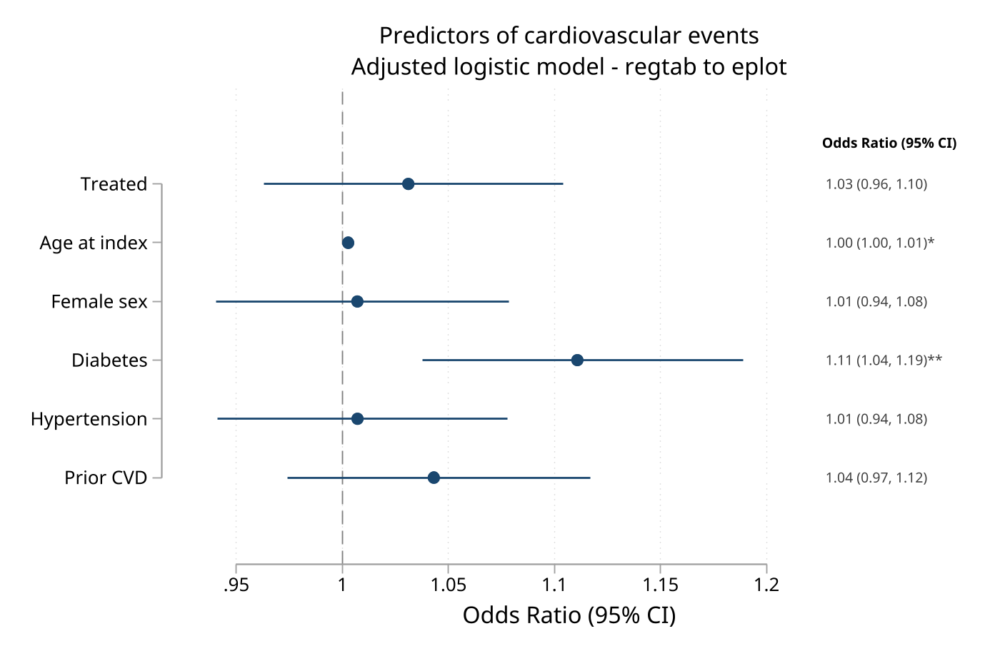
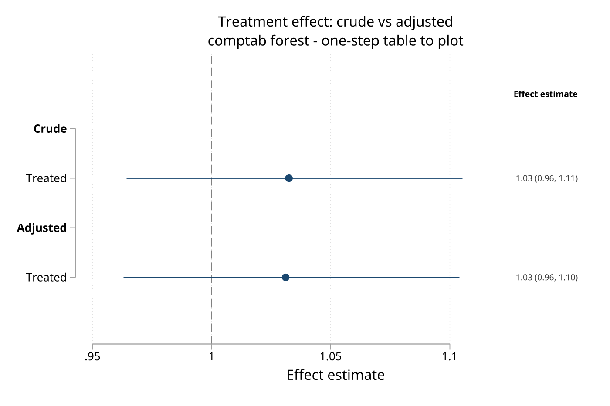

# tabtools - Publication-ready Excel and Markdown tables across common Stata workflows

**Version 1.9.10** | 2026-07-17

`tabtools` is a suite of Stata commands for exporting manuscript-ready tables to Excel and Markdown across descriptive summaries, regression models, treatment effects, survival analysis, diagnostic accuracy workflows, incidence rates, and composite tables. The package is organized around a shared formatting layer, so commands that come from very different analysis pipelines still produce tables that look like they belong in the same workbook or report.

## Quick Start

This built-in-data workflow creates a baseline table and a regression table without writing files:

```stata
sysuse auto, clear
generate byte expensive = price > 6000

table1_tc price mpg weight rep78, by(foreign) smd ///
    frame(quick_table1, replace)

collect clear
collect: logistic expensive mpg weight i.foreign
regtab, nointercept frame(quick_model, replace)
```

Both commands print a preview and leave reusable frames. Add `xlsx()`, `markdown()`, or `csv()` when you are ready to export.

## Requirements

- Stata 16 or later for `tabtools`, `tabtools_tips`, `table1_tc`, `stacktab`, and `simtab`
- Stata 17 or later for `desctab`, `regtab`, `effecttab`, `comptab`, `hrcomptab`, `survtab`, `crosstab`, `corrtab`, `diagtab`, `stratetab`, and `puttab`
- `desctab`, `regtab`, and `effecttab` require Stata's `collect` framework
- `survtab` requires `stset` data, and `stratetab` expects saved `strate, output()` datasets
- `eplot` is optional and is required only when using `comptab, forest` or `hrcomptab, forest`

## Installation

```stata
capture ado uninstall tabtools
net install tabtools, from("https://raw.githubusercontent.com/tpcopeland/Stata-Tools/main/tabtools") replace
```

After installation, start with `help tabtools` for the suite overview and `tabtools_tips` for the quick reference and worked recipes.

## Commands

### Direct table builders

| Command | Description | Stata |
|---------|-------------|-------|
| `table1_tc` | Table 1 generator with automatic tests, SMDs, weighting support, and Excel export | 16+ |
| `desctab` | Format active `table` collections with per-statistic formats and composite cells | 17+ |
| `crosstab` | Cross-tabulation with association measures such as OR, RR, and risk difference | 17+ |
| `corrtab` | Correlation matrix with significance stars, p-values, and lower, upper, or full layouts | 17+ |
| `survtab` | Kaplan-Meier survival summary table with medians, RMST, and number at risk | 17+ |
| `diagtab` | Diagnostic-accuracy table with sensitivity, specificity, predictive values, likelihood ratios, and optional AUC | 17+ |

### Post-estimation formatters

| Command | Description | Stata |
|---------|-------------|-------|
| `regtab` | Format the current `collect` from regression models into a polished table with Excel export and automatic console display, including multi-equation models such as `mlogit`, `zip`, `zinb`, and `churdle` | 17+ |
| `effecttab` | Format `teffects` or `margins` results from the current `collect` into an effects table | 17+ |

### File and frame workflow builders

| Command | Description | Stata |
|---------|-------------|-------|
| `stratetab` | Format saved `strate, output()` files into incidence-rate tables | 17+ |
| `comptab` | Combine selected rows from one or more `regtab` or `effecttab` frames into one composite sheet | 17+ |
| `hrcomptab` | Build a final Table 2-style sheet by combining a `stratetab` frame with selected `regtab` rows | 17+ |

### Styled export and assembly

| Command | Description | Stata |
|---------|-------------|-------|
| `puttab` | Style a table already in memory — the current dataset, a named frame, or a Stata matrix (`e(b)`, `r(table)`, `collapse`/`tabulate` output) — as one house-styled Excel sheet. Feeds `stacktab` | 17+ |
| `stacktab` | Assemble multi-sheet composite Excel tables from source blocks (vstack/hstack, column merges, titles, notes). | 16+ |

#### puttab vs comptab vs stacktab

These three commands all produce a single combined or styled sheet, but they differ by **what they read**:

| Command | Reads | Level | Use when |
|---------|-------|-------|----------|
| `puttab` | one table already in memory — dataset, `frame()`, or `matrix()` (`e(b)`, `r(table)`, `collapse`/`tabulate`) | raw input → one styled sheet | you have a raw table and no specialized command fits; you just want it styled |
| `comptab` | tabtools `regtab`/`effecttab` **frames** (live estimation results) | estimation level | you want to cherry-pick and reorder rows from models still held in frames (`hrcomptab` does the rates + hazard-ratio Table 2 variant) |
| `stacktab` | sheets **already exported** to an `.xlsx` workbook | spreadsheet level | you want to stack/merge blocks that are already cells in a workbook, regardless of what produced them |

**Workflow:** `puttab` and `stacktab` form an emit-then-assemble pipeline — `puttab` writes each styled block to its own sheet, then `stacktab` combines those sheets into the final table. `comptab`/`hrcomptab` are the frame-based siblings of `stacktab`: reach for them when the pieces are still tabtools frames rather than exported sheets.

In short: style one raw table → `puttab`; combine estimation results still in frames → `comptab`/`hrcomptab`; combine sheets already in a workbook → `stacktab`.

### Simulation studies

| Command | Description | Stata |
|---------|-------------|-------|
| `simtab` | Render and export a publication-ready Monte Carlo simulation performance table (bias, empirical/model SE, coverage, power, RMSE, non-convergence) from replication-level results, or ingest a `simsum`/`siman` summary with `from()` | 16+ |

`simtab` renders and exports a publication-ready simulation performance table. For full performance analysis, Monte Carlo error theory, and diagnostic graphs (zipper, lollipop, nested-loop), use [`simsum`](https://doi.org/10.1177/1536867X1001000305) or [`siman`](https://github.com/UCL/siman). `simtab` can read their output directly (`from(simsum)` / `from(siman)`), or compute table-grade measures itself from replication-level data — it installs and runs with neither package present. It pairs with `simsum`/`siman` (Morris, White & Crowther, *Stat Med* 2019), which own the numbers; `simtab` owns the styled table.

### Suite utility

| Command | Description | Stata |
|---------|-------------|-------|
| `tabtools` | Browse commands and manage persistent formatting defaults for the current Stata session | 16+ |
| `tabtools_tips` | Quick reference and worked recipes for the whole suite | 16+ |

## Choosing a Workflow

| Workflow | Start here | Notes |
|----------|------------|-------|
| Descriptive table from the dataset in memory | `table1_tc`, `crosstab`, `corrtab`, `diagtab` | These commands work directly on the active dataset and do not require `collect` |
| Formatted output from a custom `table` call | `collect: table` then `desctab` | Use when Stata's single `nformat()` is too blunt and each statistic needs its own format |
| Regression or effect estimates after modeling | `collect:` then `regtab` or `effecttab` | These commands format the active collection rather than refitting models |
| Survival summaries from `stset` data | `survtab` | Use when you want Kaplan-Meier estimates, medians, RMST, or risk sets |
| Incidence-rate tables from saved `strate` files | `stratetab` | File-based workflow; no dataset needs to remain in memory |
| Final table assembled from estimation results still in frames | `comptab` or `hrcomptab` | These second-stage builders consume `regtab`/`effecttab`/`stratetab` frames produced earlier in the pipeline |
| A raw in-memory table (dataset, frame, or matrix) styled as one sheet | `puttab` | The generic styler for tables that have no dedicated tabtools command |
| Composite assembled from sheets already exported to a workbook | `stacktab` | Spreadsheet-level assembly (vstack/hstack, column merges); pairs with `puttab` as emit-then-assemble |
| Session-wide formatting defaults | `tabtools` | Use `tabtools set`, `tabtools get`, `tabtools set ..., permanent`, `tabtools use`, and `tabtools set clear` to control fonts, borders, themes, and digits |

## Persistent Defaults Profiles

`tabtools set` still applies defaults immediately through Stata session globals. Add `permanent` to save the current style to a runnable Stata profile, then load it in a later session or project with `tabtools use`.

```stata
tabtools set theme custom, font("Times New Roman") fontsize(10) ///
    borderstyle(academic) permanent profile("tabtools_house_style.do")
tabtools set digits 3, permanent profile("tabtools_house_style.do")

tabtools set clear
tabtools use using "tabtools_house_style.do"
tabtools get
```

Without `profile()`, `tabtools set ..., permanent` writes `tabtools_profile.do` in Stata's PERSONAL ado directory, and `tabtools use` reads that default profile.

### Controller options

| Option | Applies to | Meaning |
|--------|------------|---------|
| `list` | display mode | Show command names as a compact list |
| `detail` | display mode | Show commands with descriptions |
| `category(name)` | display mode | Filter the command inventory by category |
| `font()`, `fontsize()` | `tabtools set theme custom` | Set the custom-theme font and point size |
| `headercolor()`, `zebracolor()` | `tabtools set theme custom` | Set custom header and alternating-row colors |
| `borderstyle()` | `tabtools set theme custom` | Set `default`, `thin`, `medium`, or `academic` borders |
| `permanent` | `tabtools set` | Save the resulting defaults to a profile |
| `profile(filename)` | `tabtools set ..., permanent` | Choose an alternate profile file |

### Controller stored results

Depending on the action, `tabtools` returns `r(action)`, `r(font)`, `r(fontsize)`, `r(borderstyle)`, `r(theme)`, `r(digits)`, `r(boldp)`, `r(permanent)`, `r(profile)`, `r(headercolor)`, and `r(zebracolor)`. Inventory display also returns `r(commands)`, `r(n_commands)`, `r(version)`, and `r(categories)`.

## Repository Checkout Demo

The rebuild demo is a repository-maintenance workflow, not part of the net install payload. It reads shared `_data/` fixtures and sibling packages from a local Stata-Tools checkout, then regenerates a sequential Markdown report and 15 Excel workbooks (74 sheets total) covering every tabtools command.

From a local checkout, run:

```bash
stata-mp -b do tabtools/demo/demo_tabtools.do
```

Installed users should start with `help tabtools` and `tabtools_tips`.

### Markdown report export

The demo builds `demo/demo_markdown_report.md` by exporting one table and appending additional tables with `mdappend`:

```stata
table1_tc, by(treated) ///
    vars(index_age contn %5.1f \ female bin \ diabetes bin \ hypertension bin) ///
    title("Table 1. Baseline Characteristics") ///
    markdown("tabtools/demo/demo_markdown_report.md")

crosstab treated female, or label ///
    title("Table 2. Treatment by Sex") ///
    markdown("tabtools/demo/demo_markdown_report.md") mdappend

corrtab index_age crp prior_hosp, star(0.05 0.01 0.001) ///
    title("Table 3. Correlation Matrix") ///
    markdown("tabtools/demo/demo_markdown_report.md") mdappend

puttab id index_age treated female cv_event, varlabels ///
    title("Table 4. First Six Analysis Records") ///
    markdown("tabtools/demo/demo_markdown_report.md") mdappend
```

Excerpt from the generated Markdown report:

```markdown
### Table 1. Baseline Characteristics

| No. (Column %) or Mean (SD) | N=8,934 | N=6,066 | p-value |
| --- | --- | --- | --- |
| Age at cohort entry (years) | 58.3 (13.4) | 58.5 (13.3) | 0.24 |
| Female sex | 5,351 (59.9%) | 3,621 (59.7%) | 0.80 |
| Diabetes | 4,107 (46.0%) | 2,818 (46.5%) | 0.56 |
| Hypertension | 4,112 (46.0%) | 2,935 (48.4%) | 0.005 |
```

### Simulation performance tables (`simtab`)

The `simtab` section of `demo/demo_tabtools.do` builds a Monte Carlo study of three estimators (Unweighted, IIW, IIW + log(test)) across three scenarios and two estimands, then renders it with `simtab`. The Unweighted estimator is biased — its coverage is flagged off-nominal (`*`) and its failed fits surface through `nsim()` as non-convergence (`Non-conv.`). Run just that section from a local checkout:

```bash
stata-mp -b do tabtools/demo/demo_tabtools.do simtab
```

**Compute mode** summarizes the raw replications into a styled, scenario-grouped table — with an off-nominal-coverage flag and per-cell non-convergence count — and exports it to Excel:

```stata
. simtab estid, estimate(est) se(se) true(truev) by(scen) sim(sim) coverage(covered) ///
      nsim(400) metrics(mean bias empse meanse coverage n nonconv) digits(3) ///
      xlsx("demo_simtab.xlsx") sheet("Scenarios") display
```

The numeric **`plotframe()`** companion stores one row per cell with the raw measures and their Monte Carlo SEs — the structured source for figures, replacing the "parse a text log" boundary.

With **two estimands**, Excel gets merged column-group headers (one block per estimand) and Markdown/CSV get flattened `Estimand: metric` columns. The demo writes the `Multi-estimand` sheet of `demo/demo_simtab.xlsx` and appends this table to the consolidated `demo/demo_markdown_report.md`:

```markdown
### Simulation results by scenario and estimand

| Scenario | Estimator | Marginal slope: Mean | Marginal slope: Bias | Marginal slope: Coverage | Marginal slope: N | Treatment contrast: Mean | Treatment contrast: Bias | Treatment contrast: Coverage | Treatment contrast: N |
| --- | --- | --- | --- | --- | --- | --- | --- | --- | --- |
| A | Unweighted | 0.142 | +0.042 | 86%* | 372 | 0.540 | +0.040 | 85%* | 372 |
|  | IIW | 0.093 | -0.007 | 95% | 400 | 0.493 | -0.007 | 95% | 400 |
|  | IIW + log(test) | 0.109 | +0.009 | 96% | 400 | 0.512 | +0.012 | 94% | 400 |
```

**Ingest mode** renders an already-computed per-cell summary without recomputation — `from(summary)` is dependency-free, and `from(simsum)` / `from(siman)` read those packages' output directly (`simtab` cross-validates to exact agreement with both). `simtab` itself installs and runs with neither package present.

### table1_tc — Baseline characteristics

```stata
. table1_tc, by(treated) ///
>     vars(index_age contn %5.1f \ female bin \ ///
>          education cat \ income_quintile cat \ ///
>          born_abroad bin \ civil_status cat \ ///
>          diabetes bin \ hypertension bin \ anxiety bin \ prior_cvd bin)
```

### survtab — Kaplan-Meier survival summary

```stata
. survtab, times(365 730 1095 1460) by(treated) ///
>     rmst(1460) difference median timeunit(days)
```

### regtab — Regression table

```stata
. collect clear
. collect: logistic treated index_age female i.education ///
>     diabetes hypertension anxiety prior_cvd
. regtab, coef("OR") noint
```

Compact layout keeps p-values but combines the point estimate and confidence interval:

```stata
. regtab, coef("OR") noint compact
```

The `nopvalue` option suppresses p-value columns:

```stata
. regtab, coef("OR") noint nopvalue
```

Multinomial models keep outcome-specific rows and use RRR by default:

```stata
. collect clear
. collect: mlogit education index_age female diabetes hypertension, baseoutcome(1)
. regtab, stats(n ll aic bic r2)
```

Zero-inflated models keep the count and inflation equations distinct:

```stata
. collect clear
. collect: zip event_count treatment age_z female, inflate(zero_risk female)
. collect: zinb event_count treatment age_z female, inflate(zero_risk female)
. regtab, stats(n aic bic ll) models("ZIP" \ "ZINB")
```

Hurdle models preserve outcome and selection equations while ancillary rows stay hidden in default presentation tables:

```stata
. collect clear
. collect: churdle linear annual_cost dose_intensity, select(participation_score) ll(0)
. regtab, stats(n ll aic bic r2)
```

### corrtab — Correlation matrix

```stata
. corrtab index_age crp prior_hosp, ///
>     star(0.05 0.01 0.001)
```

### crosstab — Cross-tabulation

```stata
. crosstab treated female, or label
```

### diagtab — Diagnostic accuracy

```stata
. diagtab phat cv_event, cutoff(0.35) auc wilson
```

### puttab + stacktab — emit-then-assemble export pipeline

`puttab` styles a table already in memory (the current dataset, a named `frame()`, or a Stata `matrix()`) as one house-styled sheet; `stacktab` imports those sheets and assembles them into a composite. Here two estimate/CI blocks are emitted with `puttab`, then stacked, column-merged, and section-labeled with `stacktab`:

```stata
. puttab term ahr ci using parts.xlsx, sheet("Block Primary") varlabels
. puttab term ahr ci using parts.xlsx, sheet("Block Dose") varlabels
. stacktab using parts.xlsx, sheet("Composite")            ///
      blocks(sheet(Block Primary) rows(1/4) cols(A-C) label(Any HRT use) \  ///
             sheet(Block Dose) rows(1/3) cols(A-C) label(By estrogen dose)) ///
      columnmerge(B+C as "aHR (95% CI)") spacing(1) display   ///
      title("Hormone therapy and recurrent events")           ///
      note("aHR = adjusted hazard ratio; CI = confidence interval.")
```

The same pipeline writes the formatted workbook (`title` to `A1`, table from `B2`, merged `aHR (95% CI)` column, section dividers, and an italic note).

### Persistent defaults

```stata
. tabtools set font Calibri
. tabtools set fontsize 11
. tabtools set borderstyle thin
. tabtools get
. tabtools set clear
```

### Excel workbooks

The demo generates 15 workbooks (74 sheets) covering every command and option combination:

| Workbook | Sheets | Contents |
|----------|--------|----------|
| `demo_table1.xlsx` | 11 | table1_tc variants: basic, total, weighted, wtcompare, SMD, formats, missing, custom symbols, NEJM/BMJ/APA themes |
| `demo_desctab.xlsx` | 6 | desctab: default unshaded exports, explicit shaded styling, events / N (%), mean (SD), median (IQR), separate statistic columns, and custom compose templates |
| `demo_regtab.xlsx` | 13 | regtab: logistic, compact, nopvalue, multi-model, Cox, mixed, CDISC, Poisson, GEE QIC, advanced formatting, keep/drop, and addrow |
| `demo_regtab_models.xlsx` | 10 | regtab model families: mlogit, OLS, probit, ordered logit with custom cutpoint labels, negative binomial, GLM Poisson, panel RE, quantile, ZIP/ZINB, and hurdle |
| `demo_effecttab.xlsx` | 4 | effecttab: ATE (IPW), IPW vs AIPW comparison, margins, average marginal effects |
| `demo_comptab.xlsx` | 5 | comptab: source frames, composite, compact with sections, name-based row selection |
| `demo_survtab.xlsx` | 3 | survtab: KM + median, RMST + difference, cumulative incidence |
| `demo_stratetab.xlsx` | 1 | stratetab: incidence rates with rate ratios by sex |
| `demo_corrtab.xlsx` | 3 | corrtab: Pearson with stars, Spearman with p-values, full matrix |
| `demo_crosstab.xlsx` | 5 | crosstab: OR, RR/RD, styled, trend, row percentages |
| `demo_diagtab.xlsx` | 3 | diagtab: accuracy + AUC, prevalence-adjusted, multiple cutoffs |
| `demo_hrcomptab.xlsx` | 1 | hrcomptab: Table 2-style composite (rates + hazard ratios) |
| `demo_puttab.xlsx` | 3 | puttab: matrix source (`r(table)`), frame source, collapse/data source with themes and zebra |
| `demo_stacktab.xlsx` | 4 | stacktab: puttab-styled source blocks, vstack composite with column merge and section labels, hstack side-by-side |
| `demo_simtab.xlsx` | 2 | simtab: simulation scenario summary and multi-estimand report from replication-level results |

## Integration with eplot: tables to forest plots

The same effect estimates that fill a publication table can drive a forest plot — without re-entering a single number. `regtab` and `effecttab` accept `eplotframe()`, which stores a graph-ready companion frame (`label`, `estimate`, `ll`, `ul`, `pvalue`, `rowtype`) that the separate [`eplot`](https://github.com/tpcopeland/Stata-Tools/tree/main/eplot) package reads directly. `comptab` and `hrcomptab` compose those companions and draw the plot in one step with `forest`.

The integration demo `demo/demo_tabtools_eplot.do` builds an adjusted odds-ratio table and turns it into a forest plot two ways. Run it from a local checkout:

```bash
stata-mp -b do tabtools/demo/demo_tabtools_eplot.do
```

### One model: regtab table, then eplot forest

`regtab` writes the table and the companion frame at once; `eplot` plots the frame.

```stata
collect clear
quietly collect: logistic cv_event treated index_age female diabetes hypertension prior_cvd
regtab, coef("OR") noint eplotframe(or_effects, replace)

eplot, frame(or_effects) labels(label) rowtype(rowtype) ///
    null(1) values stars vformat(%4.2f) ///
    effect("Odds Ratio (95% CI)") ///
    title("Predictors of cardiovascular events")
```

The matching forest plot:



### Several models: comptab forest in one step

`comptab` composes companion frames from multiple `regtab` runs; `forest` calls `eplot` for you, and `eplotoptions()` passes graph options through.

```stata
* Crude and adjusted treatment effects, each captured as a regtab frame
collect clear
quietly collect: logistic cv_event treated
regtab, coef("OR") noint frame(g_crude, replace) eplotframe(ge_crude, replace)

collect clear
quietly collect: logistic cv_event treated index_age female diabetes hypertension prior_cvd
regtab, coef("OR") noint frame(g_adj, replace) eplotframe(ge_adj, replace)

comptab g_crude g_adj, rows(1 \ 1) section("Crude" \ "Adjusted") ///
    forest eplotoptions(null(1) title("Treatment effect: crude vs adjusted"))
```



## Resources

- `help tabtools` for the suite overview and persistent defaults
- `tabtools_tips` or `help tabtools_tips` for compact option patterns and longer end-to-end recipes
- `help table1_tc`, `help desctab`, `help regtab`, `help effecttab`, `help comptab`, `help hrcomptab`, `help survtab`, `help stratetab`, `help crosstab`, `help corrtab`, `help diagtab`, `help puttab`, `help stacktab`, and `help simtab` for command-specific syntax

## Reproducibility and QA

The canonical full lane installs its required simulation-oracle dependencies into a disposable Stata ado tree, regenerates the R cross-validation fixtures in a temporary directory, stages demo regeneration outside the checkout, and removes per-run output on exit:

```bash
cd tabtools/qa
stata-mp -b do run_all.do full
```

Run the release lane to include the performance benchmark, and use the package-local cleanup target for interrupted runs:

```bash
stata-mp -b do run_all.do release
bash clean_artifacts.sh
```

See [`qa/README.md`](qa/README.md) for suite membership, external tools, and result interpretation.

## License

`tabtools` is distributed under the MIT License.

## Version History

- **1.9.10** (2026-07-17): Rejects active-but-empty collections consistently in `regtab` and `effecttab`. After `collect clear`, both commands now stop with `r(119)` and preserve `varabbrev` instead of falling through to unrelated downstream errors. QA also hardens repository-root discovery when the scratch parent itself contains `tabtools`, preventing false missing-demo failures in isolated release runs.
- **1.9.9** (2026-07-16): Restores `regtab` and `effecttab` on Stata 19. Both commands read the confidence level from an undocumented `ci-level` key that `collect save` writes on Stata 17 but omits entirely on Stata 19, and the missing key aborted the whole command with `r(459)` ("the active collection does not contain usable confidence-level provenance") before any table was produced — with no option combination available to work around it. The level is now treated as optional provenance: when the collection does not record it, the interval label falls back to `level()` if specified and otherwise to the current `set level`, with a note. Interval labels are the only thing this value ever fed; no computed result changes. When the collection does record the level, behaviour — including the `level()` conflict guard — is unchanged.
- **1.9.8** (2026-07-13): Repairs the deep-audit correctness failures across transactional Excel/frame output, composite semantic identity, GLM effect scales, confidence-level provenance, Table 1 sampling/weighting and categorical SMDs, simulation-cell identity and metric-specific denominators, high-precision and p-value rendering, Markdown output, and runnable recipes. Adds adversarial regression coverage, fresh R and external-oracle execution, staged demo verification, executable help-recipe checks, documentation structure/render gates, and a full-suite release gate.
- **1.9.7** (2026-07-10): Completes Excel worksheet-name validation before workbook creation. Blank names, the reserved name `History`, and names beginning or ending with an apostrophe now fail with an actionable `r(198)` instead of reaching the Mata writer (which emitted undocumented `r(16114)` for boundary apostrophes); valid interior apostrophes such as `O'Brien` remain supported.
- **1.9.6** (2026-07-10): Preserves `puttab` dimensions/source and `simtab` analytical metadata when an optional export fails, while omitting artifact returns for files that were not created. Hardens output-path validation against both quote characters, removes the retired `table1_tc, noisily` help entry, and extends adversarial QA for export-failure contracts and valid RMST support. The Stata Dev CLI now scopes stored-result coverage to the command that produced it, recognizes command-named ado version headers and released helper-version drift, ignores historical QA filenames in package changelogs, and parses `cmdab` options plus dynamic stored-result families in help files.
- **1.9.5** (2026-07-09): Corrected RMST support validation, quote round-tripping in descriptive-table titles/footnotes, and case-insensitive worksheet styling. Improved Monte Carlo power precision checks and QA/release metadata.
- **1.9.3** (2026-07-03): `desctab` bug fix: a `title()` or `footnote()` containing a double quote was silently dropped entirely from every output sink (Excel, CSV, Markdown, console), and one containing an apostrophe was corrupted (e.g. `It's here` printed as `s here'`). Root cause was the `asis` modifier on the `title`/`footnote` options interacting with the internal quote-stripping step. Titles and footnotes now round-trip correctly: embedded double quotes are stripped and all other characters (apostrophes included) are preserved. Also includes an internal defensive reorder in `stacktab` (the `hstack` row key is now generated after the block columns are renamed) with no user-visible behavior change. No changes to any other command's behavior.
- **1.9.2** (2026-07-03): `stratetab` bug fix: two category-mismatch error messages (outcome-file label mismatch and `rateratio` reference-category lookup) contained malformed compound quoting and printed the literal text `_target_cat'` instead of the offending category label. The messages now show the actual category value. Error detection and exit codes are unchanged.
- **1.9.1** (2026-07-01): Two bug fixes. (1) `crosstab` trend tests (`trend` and `cochran`) and `table1_tc` rank-based tests (Wilcoxon rank-sum, Kruskal-Wallis) now exclude zero-weight and missing-weight observations under `fweight`s. The internal `expand` retained such rows as weight-1 observations (Stata's `expand` keeps the original row when the count is 0 or missing), so those p-values could disagree with the tabulated counts, which correctly exclude them. (2) `title()` strings containing embedded double quotes are no longer silently truncated at the first quote in `crosstab`, `diagtab`, `effecttab`, `comptab`, `stratetab`, `table1_tc`, `regtab`, and `survtab` (the title row is now written with compound quotes, as `desctab`, `corrtab`, and `hrcomptab` already did).
- **1.9.0** (2026-07-01): Inference and trend-test additions across the epidemiology-facing commands. (1) `survtab` now reports the **between-group RMST difference with a 95% CI and two-sided Wald p-value** (independent-group Greenwood variance) instead of a bare point estimate — the RMST difference is the interpretable, proportional-hazards-free contrast, so it now carries inference; new returns `r(rmst_diff_se)`, `r(rmst_diff_lb)`, `r(rmst_diff_ub)`, and `r(rmst_diff_p)`. (2) `crosstab` adds a **`cochran`** option for the **Cochran-Armitage test for trend** in a binary outcome across an ordered exposure (column scores are the numeric `colvar` values); it is mutually exclusive with the existing Spearman `trend` and returns `r(chi2_trend)`, `r(z_trend)`, and `r(trend_method)`. Both trend paths now set `r(trend_method)`. (3) `survtab, reverse` now carries an explicit **competing-risks caveat** in the console note, methods paragraph, and help: 1 − KM equals the cumulative incidence only without competing risks; otherwise use an Aalen-Johansen estimator (`stcompet`, `stcrreg`, or `finegray`). (4) `diagtab` likelihood-ratio and diagnostic-odds-ratio CIs now use `invnormal(0.975)` rather than a rounded `1.96` multiplier, matching the other commands. No breaking changes to existing output.
- **1.8.9** (2026-07-01): Removed inert `display` options that were accepted but did nothing. `comptab`, `corrtab`, `crosstab`, `desctab`, `diagtab`, `effecttab`, `hrcomptab`, `regtab`, `stratetab`, and `survtab` always print the completed table to the Results window, so `display` was a silent no-op on those commands and is no longer accepted; `stacktab` and `simtab`, where `display` actually gates console output, are unchanged. Also dropped `desctab`'s unused `relabel`, `valuelabels`, and `factorlabel` options and `table1_tc`'s unused `noisily` option. Passing a removed option now raises a clear `option not allowed` error instead of being silently ignored.
- **1.8.8** (2026-06-30): `regtab` keep()/drop() now match natural factor-variable notation — `keep(i.foreign)`, `keep(1.foreign#c.mpg)`, `drop(i.group)` — by stripping `i.`/`c.`/`o.` operators before matching against the rendered coefficient name. A keep()/drop() that matches no coefficient row (a mis-typed token) now raises a clear error instead of silently writing a headers-only table. No change to tables that already filtered correctly.
- **1.8.7** (2026-06-30): Console table display no longer inserts spurious horizontal separator lines every five rows. The shared `_tabtools_console_display` helper now passes `separator(0)` to `list`, so the rendered table shows a clean body with rules only at the header and footer (Excel and Markdown exports were never affected). Applies to all commands that render a console preview (`desctab`, `crosstab`, `corrtab`, `simtab`, `diagtab`, `comptab`, `stratetab`, `regtab`, `survtab`, `effecttab`, `hrcomptab`).
- **1.8.6** (2026-06-25): CSV and Markdown exports now use the same visible table columns as the rendered table instead of leaking Stata working-variable names or hidden helper columns. CSV exports are written without Stata variable-name headers, `regtab`/`effecttab`/`comptab` outputs omit internal `ref*` columns, and Markdown preserves blank visible header cells rather than substituting names such as `c2`/`c3`. `stacktab` Markdown now starts from the visible block header row.
- **1.8.5** (2026-06-24): `stacktab` now styles each vertically stacked block's first row as a section/header row in Excel composites. Rows such as `By estrogen dose    aHR 95% CI` are bolded and receive thin top and bottom borders after `label()`, `postfix()`, and `columnmerge()` reshape the block headers, so multi-block tables keep clear visual breaks inside the final composite sheet. Updated the stacktab demo workbook and regression QA to assert the section-header styling.
- **1.8.4** (2026-06-23): `regtab` now returns its computed model-fit statistics as full-precision `r()` scalars — `r(aic_#)`, `r(bic_#)`, `r(qic_#)`, `r(icc_#)`, `r(ll_#)`, `r(n_#)`, and `r(groups_#)` for model `#` (matching the model order in `r(table)`). Previously these statistics were only recoverable as rounded display strings (`%12.2f`/`%5.3f`) inside the table/frame; the new scalars expose the unrounded values for downstream use, making `regtab` consistent with the other `tabtools` commands that already return their computed statistics. `regtab` deliberately recomputes AIC (`-2·ll + 2·k`), BIC (`-2·ll + k·ln(N)`), and QIC (`deviance + 2·rank`) from the log-likelihood, parameter count, and N rather than trusting `e(aic)`/`e(bic)` (which `glm`/GEE backends store on incomparable per-observation or deviance scales); new command-backed cross-validation tests (`qa/crossval_tabtools.do` CV21–CV23) confirm these returns match `estat ic`, `estat icc`, and the GEE QIC oracle across `regress`, `logit`, `poisson`, `mixed`, `melogit`, and `xtgee`. Removed a dead `tempname` in `regtab`'s `dimnonsig` path.
- **1.8.3** (2026-06-21): `stacktab` bug fix — `markdown("report.md")` (and any quoted path) no longer fails with "markdown() contains invalid characters". `stacktab` parses `markdown()` as `string asis`, which keeps the surrounding double-quotes in the macro; the path validator then rejected the literal quote. The quote-stripping step now covers `markdown()` as it already did for `title()`/`note()`/`csv()`. Added a `stacktab` quoted-markdown regression test to `qa/test_stacktab.do`. QA hardening: new `qa/test_option_coverage.do` exercises every public option of every command (per-command option coverage is now 100% of the testable surface, measured by `qa/tools/option_coverage.py`); `validation_corrtab.do` now pins `corrtab`'s in-code Pearson p-values against a `regress` oracle, and `validation_survtab.do` pins `survtab`'s RMST confidence-interval bounds against `stci, rmean`.
- **1.8.2** (2026-06-17): `regtab` bug fix — `keep()`/`drop()` by variable name now work when the regression variables carry variable labels. `collect` renders the variable *label* into the row-label column, so the previous filter (which matched only that already-relabeled column) dropped **every** coefficient row, producing a headers-only table whenever a kept/dropped variable was labeled. `regtab` now reconstructs the raw coefficient name per row from the `collect` colname level↔label map and matches `keep()`/`drop()` tokens against it (label-substring matching still works as before). Added body-content regression tests to `qa/test_regtab.do` (the prior tests only checked that an output file was written, not that it had rows).
- **1.8.1** (2026-06-17): `puttab` Excel geometry aligned with the `regtab`/`table1_tc` house style. The title is now written to cell A1 and **left-justified** (previously centered), and a thin spacer column A is inserted so the table body is always anchored at **B2** (a blank title row is reserved when no `title()` is given). Picks up the shared defaults already used by the other builders: a 30-pt title row, footnote in column B, and centered data columns with the label column left-aligned. The console, CSV, and Markdown outputs are unchanged; `r(n_cols)` continues to report the content columns, excluding the spacer. Updated `qa/test_puttab.do` cell-position assertions and added a `puttab` backend formatting contract to `qa/test_package_helpers.do`.
- **1.8.0** (2026-06-14): `table1_tc` weighted-display overhaul. (1) Bug fix: in `wt()` analyses a displayed weighted count is now the *effective* count (weighted % × group N) rather than the raw unweighted count, so counts and percentages are internally consistent (n/N = weighted %); `r(categorical)` still returns raw counts for programmatic use. (2) New display policy aligned with best practice: weighted columns now show **percentages only by default** (a weighted "count" is just % × N, not a real frequency), with the `smd` column carrying the balance comparison. Standalone weighted tables and the weighted columns of `wtcompare` both follow this rule. (3) New `wtn` option restores the weighted effective count as `n (%)` (and `percent_n` still gives `% (n)`); crude columns in `wtcompare` always keep `n (%)`. This changes the default `wtcompare` output (weighted columns drop their counts unless `wtn` is given). The help file now documents weight-type semantics: `wt()` is for probability/IP weights (applied analytically like an `aweight`), not frequency weights, and p-values are suppressed because correct inference would require survey/robust standard errors.
- **1.7.0** (2026-06-13): Internal and packaging cleanup; no command behavior changes. Helper programs renamed to one consistent `_tabtools_` convention: the `_current` suffix is dropped (`_tabtools_xlsx_write`, `_tabtools_xlsx_read`, `_tabtools_markdown_write`, `_tabtools_collect_render`) and `_simtab_ingest` becomes `_tabtools_simtab_ingest`. Two unused internal helpers (`_tabtools_xlsx_set_widths`, `_tabtools_table_metadata_current`) are removed from the shipped package. The `tabtools_cheatsheet` and `tabtools_cookbook` compatibility-alias help files are retired; `tabtools_tips` is the single quick-reference and recipes entry point, and all help cross-references now point there. The QA suite is consolidated from per-directory fragments into one complete command-level file per command plus a small set of package-level suites, with a full index in `qa/README.md`.
- **1.6.4** (2026-06-10): Remove the retired workbook-composition alias from the shipped package. `stacktab` is now the only public command for assembling exported workbook blocks, and QA no longer installs or calls the old alias path.
- **1.6.3** (2026-06-10): Add `tabtools_tips`, a merged quick-reference and cookbook command/help topic. The former `tabtools_cheatsheet` and `tabtools_cookbook` help files are retained as compatibility aliases. Update the visible help and README command inventory for recently added commands including `puttab`, `stacktab`, and `simtab`.
- **1.6.2** (2026-06-08): Fix `regtab` AIC/BIC for GEE models. `regtab` reads model fit statistics from the active `e()`, but Stata's `glm` (the backend used by `iivw_fit` and `xtgee`-style GEE workflows) stores `e(aic)` as AIC *per observation* (AIC/N) and `e(bic)` under a deviance-based convention — neither comparable to the likelihood-scale values `mixed` and other ML estimators report. A `stats(aic)` table mixing GEE and mixed models therefore showed GEE AIC values roughly N times too small. `regtab` now always recomputes AIC as `-2*ll + 2*k` and BIC as `-2*ll + k*ln(N)` from `e(ll)`, `e(rank)`, and `e(N)` whenever those are available, overriding the per-observation/deviance-based stored values. Results now match `estat ic` for every model family and stay on one scale across rows. `mixed` output is unchanged (it already used this path). Added regression test `qa/regtab/test_regtab_aic_gee.do`.
- **1.6.1** (2026-06-08): Adds disk-backed tabtools defaults profiles. `tabtools set ... , permanent` writes the current house style to a runnable Stata do-file, using `tabtools_profile.do` in the PERSONAL ado directory by default or `profile(filename)` for project-specific profiles. `tabtools use [using filename]` reloads a saved profile into the current session, making fonts, themes, borders, digits, bold-p thresholds, and custom colors reproducible across sessions and projects. Refreshes `table1_tc` display defaults toward a compact house style: continuous variables now use `format(%2.0f)`, percentages `percformat(%5.0f)` with no percent sign (`percsign("")`), SDs render as `mean±SD` (`sdleft("±") sdright("")`), IQRs as `(Q1, Q3)` (`iqrmiddle(", ")`), and low percentages are reported without a leading alignment space (no-space is now the default — the old behavior is available via the new `spacelowpercent` option, replacing `nospacelowpercent`). `borderstyle(thin)` is the default Excel border for both `table1_tc` and `regtab`, and `regtab` defaults to `digits(2)`.
- **1.6.0** (2026-06-07): New command `simtab` — a Monte Carlo simulation performance table and export layer. Compute mode summarizes long replication-level results into table-grade measures (`mean`, `bias`, `pctbias`, `empse`, `meanse`, `relerr`, `mse`, `rmse`, `coverage`, `power`, `n`, `nonconv`) with closed-form Monte Carlo SEs used to flag off-nominal coverage; ingest mode (`from(simsum)`/`from(siman)`/`from(summary)`) renders an already-computed summary without recomputation, following the optional-dependency pattern used by `comptab`/`hrcomptab` with `eplot`. Multi-estimand tables get merged Excel group headers and flattened Markdown/CSV headers; `nsim()` adds non-convergence reporting; `plotframe()` provides a numeric figure companion. Cross-validated to exact agreement with `simsum` on bias/empirical SE/coverage and their Monte Carlo SEs. Pairs with `simsum` (White, *Stata Journal* 2010) and `siman` (UCL); cites Morris, White & Crowther (*Stat Med* 2019). Adds `_simtab_ingest.ado`, `simtab.sthlp`, and `qa/simtab/`.
- **1.5.2** (2026-06-06): Cleaner forest plots from `comptab` and `hrcomptab`. When a `section()` (or stratetab scaffold section) contributes exactly one plotted row, the eplot companion frame now folds the section label into that single row instead of emitting a standalone header row followed by one indented effect — the redundant header/child pair that made one-coefficient-per-model forests look cluttered. The rendered Excel and console tables are unchanged; only the `eplotframe()`/`forest` output differs. Added `qa/_package/test_eplot_section_fold.do`.
- **1.5.1** (2026-06-06): Fix two correctness bugs found while auditing the v1.5.0 eplot bridge. `comptab` and `hrcomptab` could not export Markdown (`markdown()` failed with `rc=198` because of a malformed compound quote in the post-`forest` return block). `regtab` double-exponentiated `logit, or` and `ologit, or` models (the `logit`/`ologit` branch hardcoded `eform=1` instead of respecting a user-supplied `or` option, unlike `melogit`/`poisson`/`mlogit`), silently reporting `exp(OR)`; this also propagated into the eplot companion frame. Added regression tests for both in `qa/_package/test_markdown_exports.do` and `qa/regtab/test_regtab_model_families.do`.
- **1.5.0** (2026-06-06): Add an `eplot` bridge for graph-ready estimate/CI companion frames. `regtab` and `effecttab` now support `eplotframe()`; `comptab` and `hrcomptab` can compose those companions and draw forest plots with `forest`, passing graph options through `eplotoptions()` while honoring the active graph scheme by default. `regtab` and `effecttab` now support `eplotframe()`; `comptab` and `hrcomptab` can compose those companions and draw forest plots with `forest`, passing graph options through `eplotoptions()` while honoring the active graph scheme by default.
- **1.4.0** (2026-06-05): Add `markdown()` and `mdappend` exports across tabtools table commands, including same-call Excel plus Markdown export and sequential Markdown report building. Add `_tabtools_markdown_write_current.ado` as the shared Markdown writer and allow `puttab` to run Markdown-only without `using`.
- **1.3.7** (2026-06-03): Cap the label (first) column width in `regtab`, `effecttab`, and `comptab` so a single verbose row label — most commonly an unstructured random-effects `Covariance: ... (slope, Intercept)` row from a mixed model — can no longer stretch the whole column to 60-76 characters and balloon the table. The label column now caps at 45 characters by default; labels longer than the cap wrap onto extra lines (top-aligned) instead of being clipped by the adjacent estimate cell. The cap is tunable via the new `labelwidth()` option on all three commands.
- **1.3.6** (2026-06-01): Add `puttab`, a first-mile styled-block producer that writes a table already in memory — the current dataset, a named `frame()`, or a Stata `matrix()` such as `e(b)`, `r(table)`, or `collapse`/`tabulate` output — as one house-styled Excel sheet with the shared title/header/zebra/border geometry. For a matrix source the row and column names become the label column and header row; for a dataset or frame source numeric columns honor `digits()`, integers stay integer, and value labels are resolved. Repeated calls build a multi-sheet workbook that `stacktab` can assemble, closing the raw-input gap between `desctab` (needs a `collect`) and `stacktab` (needs pre-exported sheets). Add `stacktab` for block assembly of composite sheets. Together `puttab` and `stacktab` form the emit-then-assemble export pipeline.
- **1.3.5** (2026-06-01): Fix `effecttab, digits()` so collect-rendered 95% CI bounds use the requested decimal precision. Add `regtab, cutlabels()` for ordered-model cutpoints, make `noint` hide cutpoint and ancillary-only rows such as `lnalpha`, `alpha`, and `/sigma`, and split model-family demos into `demo_regtab_models.xlsx` with richer zero-inflated examples.
- **1.3.4** (2026-06-01): Extend `regtab` multi-equation row handling to zero-inflated Poisson, zero-inflated negative binomial, and Cragg hurdle models, with equation labels for outcome, inflation, selection, scale, and ancillary rows. Expand QA and demos for the model families covered by the regression-family matrix.
- **1.3.3** (2026-05-31): Make `regtab` preserve multi-equation row identity for estimators such as `mlogit`, auto-display multinomial logit output as relative risk ratios (RRR), and add a regression-family QA matrix covering `mlogit`, OLS, logit, probit, ologit, count, GLM, panel, survival, and quantile models.
- **1.3.2** (2026-05-29): Make `regtab, stats()` accept `n_sub` and `subjects` as synonyms for `n` (the N row, which already reports subjects for survival models), and warn instead of silently ignoring unrecognized `stats()` tokens.
- **1.3.1** (2026-05-27): Make `regtab, relabel` random-effect rows identify variance and covariance parameters explicitly, including linear mixed-model random-slope covariance rows such as `cov(months_since_tx,_cons)`.
- **1.3.0** (2026-05-23): Replace final Excel writers with a shared Mata `xl()` backend, add Mata workbook read/write helpers for collect parsing and backend contracts, and remove `export excel`/`import excel` from command implementations.
- **1.2.0** (2026-05-20): Add `regtab, nopvalue` to suppress p-value columns from console, frame, CSV, and Excel and Markdown outputs while preserving internal p-values for significance stars and row highlighting.
- **1.1.0** (2026-05-13): Add `desctab`, a formatter for active `table` collections with per-statistic number formats, `events / N (%)` and other composite cells, Excel/CSV/frame/display outputs, and shared tabtools styling defaults.
- **1.0.11** (2026-05-07): Fix `regtab` ICC cross-pollution where a multi-model collection ending in `mepoisson`/`menbreg` silently suppressed ICC for all earlier mixed-effects models (now skipped per-model). Strip thousands separators from coefficient and CI cells so `digits()`, `stars`, `boldp`, `dimnonsig`, and `r(table)` work for coefficients ≥ 1000. Make reference-category detection match the underlying numeric value (0 or 1 with empty CI) instead of the rendered string, so non-default precision still labels rows "Reference". Emit a noisily warning when the per-model stats fallback fires for a multi-model collection. Document `table1_tc` reserved `by()` variable name prefixes (`N_`, `m_`, `_c…`). Plug a Mata workspace leak in `table1_tc` Excel error path. Use a tempname instead of the literal `beatles` value-label fallback. Replace ad-hoc `…2` suffix scratch columns in `headerperc` with tempvars to avoid name collisions. Move integer check before `recast long, force` to prevent silent truncation. Sthlp `boldp` colon-position fix.
- **1.0.10** (2026-05-05): Add QIC (Quasi-likelihood Information Criterion) support to `regtab` for GEE models. When `stats(aic)` is requested after `xtgee`, QIC is automatically computed and displayed since AIC is undefined for quasi-likelihood estimators. QIC can also be requested explicitly via `stats(qic)`.
- **1.0.9** (2026-04-27): Documentation improvements across all .sthlp files and README. Enhanced corrtab, survtab, and diagtab help files with richer descriptions, additional examples, and "Also see" sections. Standardized author blocks with mailto links. Added `{vieweralsosee}` links to the cheatsheet.
- **1.0.8** (2026-04-27): Fix `crosstab, or rr rd` for 2x2 variables coded with nonzero category values by internally recoding observed levels to 0/1 before calling Stata's `cc`/`cs`; reject undefined requested association measures instead of silently omitting them; and validate `table1_tc` `wt()` and numeric `by()` values within the analysis sample so excluded rows do not trigger false hard failures.
- **1.0.7** (2026-04-26): Fix `table1_tc, wt() smd` weighted SMD calculations for continuous, categorical, and binary variables; fix `headerperc` with `total(before|after)`; and document active `collect` side effects for `regtab` and `effecttab`.
- **1.0.6** (2026-04-26): Fix weighted `crosstab, trend`, enforce unique truncated `stratetab` matrix row names, hard-fail missing final `effecttab` workbooks, reject binary `diagtab, optimal`, add `corrtab` shape conflict checks, clarify cookbook runnable versus illustrative recipes, and strengthen QA/install isolation.
- **1.0.5** (2026-04-23): Fix `regtab` exporting a spurious blank trailing column. The `_re_group_label` internal variable was not being dropped before export because it was bundled in a `capture drop` with `_ci_seen`, which only exists under `dimnonsig`.
- **1.0.4** (2026-04-22): Clarity audit release with hardened export-return behavior, synchronized package metadata, and expanded QA around release gates and export failures.
- **1.0.3** (2026-04-18): Stata-Tools suite release covering direct descriptive tables, `collect`-based model formatters, file-based rate workflows, and frame-based composite builders.
- **1.0.2** (2026-04-17): Incremental refinement release during the Stata-Tools packaging cycle.
- **1.0.1** (2026-04-17): Incremental refinement release during the Stata-Tools packaging cycle.
- **1.0.0** (2026-04-16): Early public packaging milestone for the tabtools suite.

## Author

Timothy P Copeland, Karolinska Institutet
