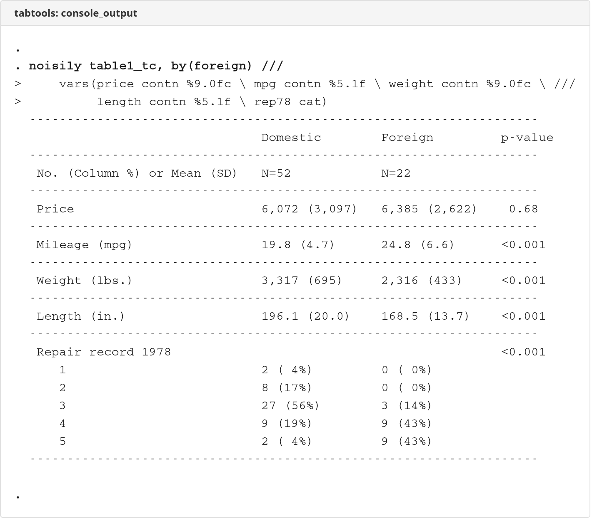
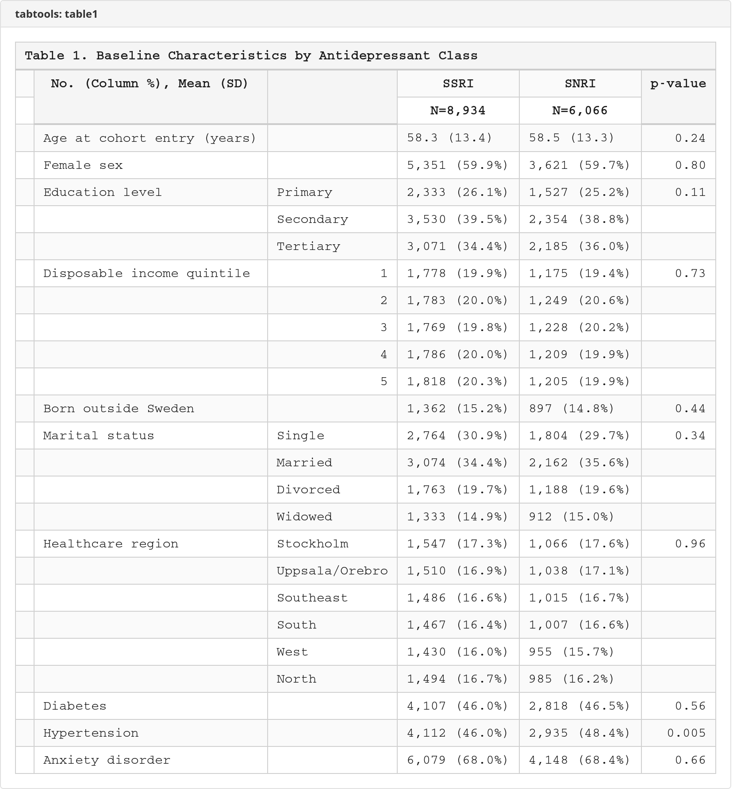

# tabtools

 

A comprehensive suite of Stata commands for exporting publication-ready tables to Excel.

## Installation

```stata
net install tabtools, from("https://raw.githubusercontent.com/tpcopeland/Stata-Tools/main/tabtools")
```

## Commands

| Command | Description | Stata Version |
|---------|-------------|---------------|
| `table1_tc` | Descriptive statistics table (Table 1) with automatic tests and IPTW weighting | 16+ |
| `regtab` | Format regression results from any model | 17+ |
| `effecttab` | Format treatment effects and margins results | 17+ |
| `stratetab` | Combine and format strate incidence rate outputs | 17+ |
| `tablex` | General table export for any Stata table | 17+ |

## Screenshots

### Console Output


### Table 1


## Quick Examples

### Descriptive Statistics (Table 1)

```stata
* Derive treatment group and merge comorbidities
use _examples/cohort.dta, clear
merge 1:1 id using _examples/treatment.dta, nogen keep(match)
merge 1:1 id using _examples/comorbidities.dta, nogen keep(master match)
replace diabetes = 0 if missing(diabetes)
replace hypertension = 0 if missing(hypertension)
replace anxiety = 0 if missing(anxiety)

table1_tc, by(treated) ///
    vars(index_age contn %5.1f \ female bin \ education cat \ ///
         income_quintile cat \ born_abroad bin \ ///
         civil_status cat \ region cat \ ///
         diabetes bin \ hypertension bin \ anxiety bin) ///
    excel("tabtools/demo/table1.xlsx") sheet("Baseline") ///
    title("Table 1. Baseline Characteristics by Antidepressant Class")
```

### Regression Results

```stata
* Propensity score model for SNRI vs SSRI
collect: logit treated index_age female i.education ///
    diabetes hypertension anxiety
regtab, xlsx(tabtools/demo/regression.xlsx) sheet("PS_Model") ///
    title("Propensity Score Model: SNRI vs SSRI") coef(OR)
```

### Treatment Effects

```stata
* Estimate causal effect of SNRI vs SSRI on cardiovascular events
gen byte cv_event = (cv_event_date < .)
label variable cv_event "Cardiovascular event"

collect: teffects ipw (cv_event) (treated index_age female i.education), ate
effecttab, xlsx(tabtools/demo/effects.xlsx) sheet("ATE") ///
    title("ATE of SNRI vs SSRI on Cardiovascular Events") ///
    tlabels(0 "SSRI" 1 "SNRI")
```

### General Tables

```stata
use _examples/cohort.dta, clear
merge 1:1 id using _examples/treatment.dta, nogen keep(match)
table (education) (treated)
tablex using tabtools/demo/summary.xlsx, sheet("Summary") ///
    title("Education by Treatment Group")
```

### Incidence Rates

```stata
* After tvexpose + tvevent, compute incidence rates with strate
stratetab, using(rate_ssri rate_snri) xlsx(tabtools/demo/rates.xlsx) outcomes(2) ///
    outlabels("CV Event \ Self-Harm") ///
    title("Incidence Rates per 1,000 Person-Years")
```

## Features

All commands in the tabtools suite share consistent formatting:

- **Automatic column widths** calculated from content length
- **Professional borders** with customizable styles (thin/medium)
- **Merged headers** for title rows and grouped columns
- **Consistent fonts** (default: Arial 10pt)
- **Dynamic p-value formatting** (more decimals for smaller p-values)

## Documentation

Each command has comprehensive help documentation:

```stata
help table1_tc
help regtab
help effecttab
help gcomptab
help stratetab
help tablex
```

## Author

Timothy P Copeland<br>
Department of Clinical Neuroscience<br>
Karolinska Institutet

## License

MIT License

## Version

Version 1.2.0, 2026-03-01
