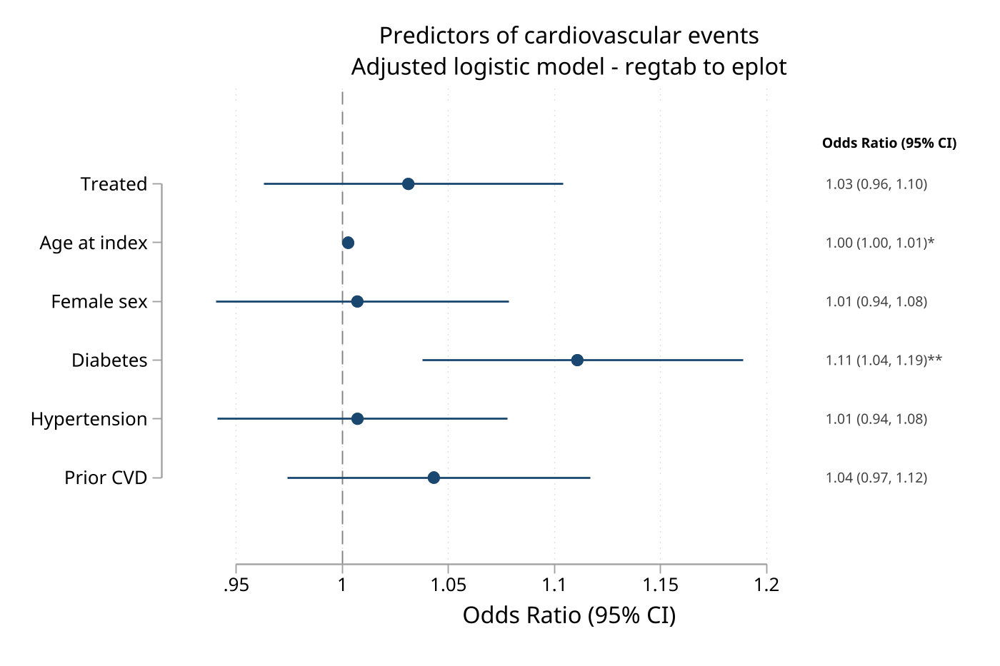
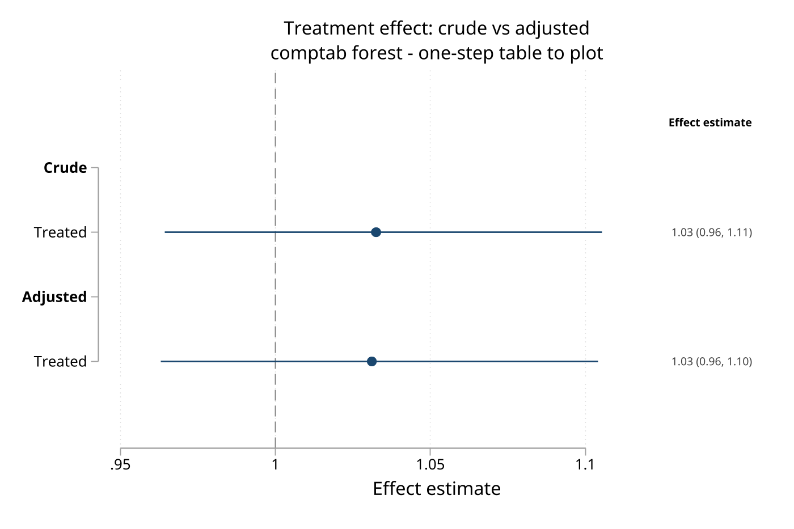

# tabtools — Publication-ready tables for Stata

**Version 1.16.3** | 2026-08-19

`tabtools` is a Stata suite for turning descriptive, model, survival, rate, diagnostic, simulation, and composite results into publication-ready Excel and GitHub-Flavored Markdown tables. The commands share output conventions, formatting themes, frames, and stored-result contracts so a table can move from analysis to a report or downstream Stata workflow.

## Quick Start

Install the package from the public Stata-Tools distribution, then run a table command from any working directory:

```stata
net install tabtools, from("https://raw.githubusercontent.com/tpcopeland/Stata-Tools/main/tabtools") replace
sysuse auto, clear
table1_tc price mpg weight rep78, by(foreign) xlsx("table1.xlsx") sheet("Table 1")
```

The command displays a Results preview and writes `table1.xlsx` in the current working directory. Add `frame(table1)` when later Stata commands should consume the rendered table, or add `markdown("table1.md")` for a Markdown report.

## Requirements

The package has no mandatory user-written Stata dependencies. `table1_tc`, `stacktab`, `simtab`, `tabtools`, and `tabtools_tips` run on Stata 16 or newer; `desctab`, `crosstab`, `corrtab`, `regtab`, `effecttab`, `survtab`, `stratetab`, `hrcomptab`, `comptab`, `diagtab`, and `puttab` require Stata 17 or newer.

The model and effect commands expect an active Stata `collect` result created by commands such as `regress`, `logistic`, `margins`, or `teffects`; they format and arrange that collection rather than fitting a model. `survtab` requires data declared with `stset`, while `stratetab` reads `.dta` files written by Stata's `strate, output()` command.

Forest-plot output from `comptab` and `hrcomptab`, and plotting graph-ready `eplotframe()` outputs from `regtab` and `effecttab`, require the optional `eplot` package. The table commands can create those graph-ready frames without eplot. `simtab` compute mode and `from(summary)` mode have no external dependency; `from(simsum)` and `from(siman)` require the corresponding optional package and its output format.

## Installation

Install the released package from the public GitHub distribution with:

```stata
net install tabtools, from("https://raw.githubusercontent.com/tpcopeland/Stata-Tools/main/tabtools") replace
```

If another copy is earlier on the `adopath`, inspect `ado dir` and remove only the `tabtools` package before reinstalling. The public distribution includes the command files, help files, package metadata, and table-of-contents entry; it does not include the repository's demo fixtures or generated demo workbooks.

## Commands

The suite contains 16 public commands. The version column is the minimum Stata release for that command.

| Command | Stata | Purpose |
| --- | ---: | --- |
| `table1_tc` | 16+ | Baseline Table 1 by group, with continuous, categorical, missingness, tests, and standardized mean differences |
| `desctab` | 17+ | Render an active `collect` table of descriptive statistics |
| `crosstab` | 17+ | Two-way categorical tables with percentages, tests, and 2x2 effect measures |
| `corrtab` | 17+ | Pearson or Spearman correlation tables with p-values or significance stars |
| `regtab` | 17+ | Render active regression collections with estimates, confidence intervals, statistics, and optional plot frames |
| `effecttab` | 17+ | Render active `margins` or `teffects` results, or a supplied effect matrix |
| `survtab` | 17+ | Kaplan–Meier survival, event, risk-set, median, RMST, and group-difference tables |
| `stratetab` | 17+ | Convert saved `strate, output()` rate files into rate and rate-ratio tables |
| `hrcomptab` | 17+ | Combine a rate frame with model frames for a multi-outcome rate comparison |
| `comptab` | 17+ | Combine compatible `regtab` or `effecttab` frames into a composite table |
| `diagtab` | 17+ | Diagnostic accuracy, likelihood ratios, diagnostic odds ratios, ROC AUC, and cutoff analysis |
| `puttab` | 17+ | Put variables, a frame, or a matrix into a formatted workbook or Markdown table |
| `stacktab` | 16+ | Stack or place blocks from an existing workbook into a new worksheet |
| `simtab` | 16+ | Summarize simulation results in compute or `simsum`/`siman`/summary ingest mode |
| `tabtools` | 16+ | Inspect and set shared fonts, digits, borders, themes, and persistent profiles |
| `tabtools_tips` | 16+ | Open or print a compact recipe reference for the suite |

## How It Works

Most table commands follow the same three-stage pattern: calculate or receive results, render a table in Results, then optionally export or expose that same rendered structure. The export targets are independent, so a command can write Excel, CSV, Markdown, a Stata frame, or an eplot-ready frame in one call when that command supports the target.

`xlsx()` is the main Excel option and `excel()` is retained as a synonym on commands that support both names. `sheet()` selects the worksheet. `open` opens an Excel target after writing it and therefore requires an `xlsx()` or `using` target. `csv()` exports the visible table data for commands that offer it; `markdown()` writes GitHub-Flavored Markdown, and `mdappend` appends to an existing Markdown file rather than replacing it.

`frame(name[, replace])` stores the rendered table in a Stata frame for later composition or inspection. `eplotframe(name[, replace])` stores graph-ready estimates, confidence limits, p-values, labels, and model identifiers for the model/effect commands that support it. `comptab` consumes compatible model/effect frames, and `hrcomptab` consumes a rate frame plus model frames.

Shared formatting options include `theme()`, `borderstyle()`, `headershade`, `headercolor()`, `zebra`, `zebracolor()`, `title()`, `footnote()`, `boldp()`, and `highlight()` where supported. Named themes are `lancet`, `nejm`, `bmj`, `apa`, `jama`, `plos`, `nature`, `cell`, and `annals`; `custom` uses the supplied formatting settings. A fresh session resolves the shared baseline as Arial 10-point text with thin borders, while command-specific precision and display defaults are listed below.

## Choosing a Workflow

| Need | Start with | Add or follow with |
| --- | --- | --- |
| Baseline characteristics by one group variable | `table1_tc` | `smd`, `test`, `xlsx()`, `frame()` |
| A `table`/`collect` descriptive result | `desctab` | `compose()`, `keep()`/`drop()`, `statorder()` |
| Two categorical variables | `crosstab` | `rowpct`, `colpct`, `or`, `rr`, `rd`, `fisher`, `trend`, or `cochran` |
| Correlations | `corrtab` | `spearman`, `lower`, `upper`, `full`, `pvalues`, or `star()` |
| Regression model collection | `regtab` | `stats()`, `keep()`/`drop()`, `eplotframe()`, or `frame()` |
| Marginal effects or treatment effects | `effecttab` | `from()`, `type()`, `clean`, `full`, or `eplotframe()` |
| Survival probabilities or RMST | `survtab` | `times()`, `by()`, `median`, `riskset`, `rmst()`, or `difference` |
| Incidence rates from `strate` | `stratetab` | `outlabels()`, `rateratio`, or a later `hrcomptab` |
| Several model/effect results | `comptab` | compatible source frames and `rows()` |
| Rates plus model estimates | `hrcomptab` | `modelframes()`, `rows()`, and optional `forest` |
| Diagnostic accuracy | `diagtab` | `cutoff()`, `cutoffs()`, `auc`, `optimal`, `exact`, or `prevalence()` |
| A dataset, frame, or matrix as a table | `puttab` | `using`, `frame()`, `matrix()`, `varlabels`, or `noheader` |
| Existing Excel blocks | `stacktab` | `blocks()`, `layout(hstack)`, `append`, or `sheetreplace` |
| Simulation summaries | `simtab` | compute mode, `from(summary)`, or optional `from(simsum)`/`from(siman)` |

## Features

- One output vocabulary across descriptive, modeling, survival, rates, diagnostics, simulation, and composite workflows.
- Excel workbooks with named sheets, titles, notes, footnotes, borders, header colors, zebra striping, significance emphasis, and optional post-write opening.
- GitHub-Flavored Markdown, CSV, Stata frames, and graph-ready eplot frames where supported.
- Shared session defaults for font, font size, border style, theme, numeric digits, and p-value emphasis through `tabtools set` and `tabtools get`.
- Explicit confidence-level provenance for collection-based and saved-rate workflows, with errors for conflicting levels and a visible `c(level)` fallback warning when a Stata version omits collection provenance.
- Strict `smallcells(#)` disclosure control for `table1_tc`, `desctab`, and `crosstab`, with primary, complementary, and dependent-result suppression applied before any output sink.

### Workbook cell types

Every exported workbook cell is written as **text**, including cells that look numeric. This is deliberate: the majority of published table cells are composite or annotated strings — `5,351 (60)`, `0.82 (0.69, 0.98)`, `<0.001`, `0.54***`, `Reference` — and the commands render each cell to its final string before any sink runs. Re-deriving a numeric type by reparsing the rendered string would have to guess, and would silently convert an annotated cell into a number that no longer matches the table.

The practical consequence is that Excel will not sum, chart, or numerically sort a column of an exported sheet without a conversion step in Excel. For a numeric payload, use `frame()` (Stata frames, with the underlying numeric columns where a command provides them), the `r()` matrices such as `r(table)` and `r(cutoff_table)`, or `eplotframe()` for plotting.

## Worked Examples

### Baseline table

```stata
sysuse auto, clear
table1_tc price mpg weight rep78, by(foreign) smd test frame(table1, replace) xlsx("table1.xlsx")
```

`table1_tc` detects the supplied variables when `vars()` is omitted. Use `vars()` for explicit row types such as `contn`, `conts`, `cat`, `bin`, and their extended forms; `smd` requires `by()`, and `clear` is available when the rendered table should replace the data in memory.

To protect exact counts below a publication threshold in `table1_tc`, `desctab`, or `crosstab`, add `smallcells(#)`. Primary cells are shown as `<#`, complementary cells as `≥#`, and dependent statistics as `Suppressed`; every requested sink receives the same already-redacted table. After safety is certified, the engine deterministically removes complementary markers one at a time whenever the protected counts remain non-exact. Each remaining `≥#` is therefore individually necessary in the final table, although the result is not guaranteed to use the globally smallest possible number of complementary markers.

```stata
table1_tc rep78, by(foreign) vars(rep78 cat) total(after) smallcells(5) frame(table1_safe, replace)
```

### Shared formatting profile

Use the controller to inspect the suite, set a custom theme, and save it for reuse in another session:

```stata
tabtools, detail category(models)
tabtools set theme custom, font(Arial) fontsize(10) borderstyle(thin) permanent profile("tabtools_project.do")
tabtools use using "tabtools_project.do"
tabtools get
```

Use `tabtools, list` for the compact catalog, or replace `category(models)` with another catalog category. The profile contains ordinary `tabtools set` commands and can be version controlled with a project.

### Descriptive `collect` table

```stata
sysuse auto, clear
collect clear
table foreign, statistic(count price) statistic(mean price) statistic(sd price)
desctab, compose(mean_sd) frame(descriptive, replace) xlsx("descriptive.xlsx")
```

`desctab` consumes the active `collect` result and can arrange rows and columns with `keep()`, `drop()`, `statorder()`, and `statlabels()`. The built-in `compose()` presets include `events_n_pct`, `events_n`, `n_pct`, `mean_sd`, `mean_semean`, `median_iqr`, `median_range`, and `mean_ci`.

For disclosure-controlled output, `desctab, smallcells(#)` accepts recognized `count`, `frequency`, and `fvfrequency` layouts plus the named `compose(n_pct)` preset. It maps exact collect result/dimension identifiers and fails before output for arbitrary compositions, other statistics, filtered layouts, or shapes whose count lineage cannot be proved.

### Regression and effects

```stata
sysuse auto, clear
collect clear
collect: logistic foreign mpg weight
regtab, frame(regression, replace) eplotframe(regression_plot, replace) xlsx("regression.xlsx")

collect clear
collect: margins, at(mpg=(15 25 35))
effecttab, frame(effects, replace) xlsx("effects.xlsx")
```

`regtab` and `effecttab` format active collections; they do not fit models. Both can also feed a composite table, and their `eplotframe()` output can be plotted by the optional `eplot` package.

### Categorical, correlation, and diagnostic tables

```stata
sysuse auto, clear
crosstab foreign rep78, rowpct fisher smallcells(5) xlsx("crosstab.xlsx")
corrtab price mpg weight, spearman full pvalues markdown("correlations.md")
diagtab mpg foreign, cutoff(22) xlsx("diagnostics.xlsx")
```

`crosstab` defaults to column percentages and uses a sparse-cell exact test when appropriate. With `smallcells(#)`, it protects the count block and margins, withholds percentages whose numerator or denominator is protected, and suppresses count-dependent tests and effect measures. `corrtab` defaults to Pearson correlations and the lower triangle; `diagtab` uses Wilson intervals by default and accepts continuous tests through `cutoff()`, `cutoffs()`, `auc`, or `optimal`.

### Survival and rates

```stata
webuse drugtr, clear
stset studytime, failure(died)
survtab, times(1 2 3) by(drug) median riskset xlsx("survival.xlsx")

webuse diet, clear
stset dox, failure(fail)
strate hienergy, per(1) output(rate_hienergy, replace)
stratetab, using("rate_hienergy") outcomes(1) xlsx("rates.xlsx")
```

`survtab` reports Kaplan–Meier quantities at the requested times. `stratetab` expects the saved `strate` files in exposure-major, outcome-minor order and uses `outcomes()` to interpret that file sequence.

### Composite model table

```stata
sysuse auto, clear
collect clear
collect: regress price mpg weight
regtab, frame(model, replace)
collect clear
collect: regress price mpg weight length
regtab, frame(model2, replace)
comptab model model2, rows("1 2 \ 1 2") xlsx("composite.xlsx")
```

The source frames must contain compatible row labels. `rows()` takes one numeric row specification per source frame, separated by `\`; here `1 2 \ 1 2` selects the first two rows from both frames. Use `relabel()` or `section()` when the displayed row names or section structure need to be changed; use `hrcomptab` when one of the source frames is a `stratetab` rate frame.

### Direct table output

```stata
sysuse auto, clear
puttab price mpg weight using "selected.xlsx", sheet("Table") varlabels
puttab price mpg weight, markdown("selected.md")
```

`puttab` accepts a current-data varlist, `frame(name)`, or `matrix(name)` as its one source. An Excel `using` target is required for workbook output, while Markdown-only output does not need a workbook.

### Simulation summary

```stata
clear
set obs 20
set seed 42
generate str8 estimator = "demo"
generate estimate = rnormal(1, .2)
generate se = .2
generate true = 1
simtab estimator, estimate(estimate) se(se) true(true) display xlsx("simulation.xlsx")
```

Compute mode derives simulation metrics from one observation per replication and can group by `by()` and `estimand()`. Ingest mode uses `from(simsum)`, `from(siman)`, or `from(summary)` with the corresponding mapping options; `plotframe()` exposes numeric results for graphs.

## Demo

The checked-in demo is a repository-checkout workflow. Run `demo/demo_tabtools.do` with its documented `all`, `main`, or `simtab` argument to regenerate the example workbooks and Markdown report; the demo uses the repository's `_data/` fixtures and writes results under `demo/`. The checked-in set is 15 workbooks (82 sheets total) plus the Markdown report.

The `table1_tc`, `desctab`, and `crosstab` workbooks each contain paired `smallcells(5)` examples. The `Small Cells Primary` sheets use a 2×2 table with counts 2/3/3/2, so only below-threshold cells are hidden as `<5`. The `Small Cells Complement` sheets use counts 2/8/6/4, which also hide reconstructive cells as `≥5`.

The optional forest-plot demo is `demo/demo_tabtools_eplot.do`. It regenerates the two checked-in graph assets below from `regtab`/`comptab` workflows and requires the optional `eplot` and `tc_schemes` packages in the checkout environment.





## Command Reference

The command help files are the authoritative reference for abbreviations and complete option parsing. The syntax and defaults below summarize the public contracts.

### `table1_tc`

```stata
table1_tc [varlist] [if] [in] [fweight], [by(varname) vars(string) format(string) percformat(string) nformat(string) iqrmiddle(string) sdleft(string) sdright(string) gsdleft(string) gsdright(string) percent missing pdp(#) highpdp(#) test statistic excel(string) xlsx(string) sheet(string) title(string) clear percent_n percsign(string) spacelowpercent extraspace slashN total(string) catrowperc varlabplus headerperc borderstyle(string) wt(varname) smd footnote(string) open boldp(#) zebra highlight(#) headershade frame(string) theme(string) smdthreshold(#) headercolor(string) zebracolor(string) csv(string) markdown(string) mdappend missingsummary smallcells(#) dots wtcompare wtn nopvalue]
```

`table1_tc` is Stata 16+ and accepts frequency weights. Without `vars()`, it infers row types from the varlist; the default display formats are `%2.0f`, `%5.0f`, and `%12.0fc` for common continuous, percentage, and count cells, with `pdp(3)`, `highpdp(2)`, and an SMD threshold of `0.1`. The Excel sheet defaults to `Table 1`; `smdthreshold(-1)` disables SMD highlighting, and `clear` replaces the current dataset with the table. `smallcells(#)` requires an integer threshold of at least 3 and protects exact disclosure within one invocation; it does not certify anonymization or account for linkage across separate releases.

### `desctab`

```stata
desctab, [xlsx(string) excel(string) sheet(string) title(string) footnote(string) compose(string) nformats(string) digits(#) pctdigits(#) nintegerfmt(string) pctscale(string) pctsign rowtotals coltotals nototals keep(string) drop(string) statorder(string) statlabels(string) nomissing zebra headershade headercolor(string) zebracolor(string) borderstyle(string) theme(string) open csv(string) markdown(string) mdappend frame(string) highlight(#) hlstat(string) smallcells(#)]
```

`desctab` is Stata 17+ and requires an active `collect` table from `table`. The sheet defaults to `Descriptive`, digits default to the session setting or `2`, percentage digits default to `1`, the integer format is `%12.0fc`, and `hlstat()` defaults to `mean`. `smallcells(#)` requires an integer of at least 3 and supports exact count/frequency layouts or named `compose(n_pct)` only; unsupported collect lineages fail closed. `keep()` and `drop()` are mutually exclusive; `mdappend` requires `markdown()`.

### `crosstab`

```stata
crosstab rowvar colvar [if] [in] [fweight=exp], [xlsx(string) excel(string) colpct rowpct totalpct or rr rd trend cochran exact fisher label missing level(#) digits(#) title(string) footnote(string) theme(string) borderstyle(string) headershade headercolor(string) zebracolor(string) boldp(#) zebra csv(string) markdown(string) mdappend frame(string) smallcells(#) open]
```

`crosstab` is Stata 17+, accepts numeric categorical variables and frequency weights, and defaults to column percentages, the current `c(level)`, and session digits or `1`. `smallcells(#)` requires an integer of at least 3 and protects counts, released margins, dependent percentages, tests, and requested measures before any sink runs. `or`, `rr`, and `rd` require a 2x2 table; `trend` and `cochran` are separate ordered-trend tests; `exact` and `fisher` are synonyms. Numeric level order, not value-label order, determines the requested 2x2 measures.

### `corrtab`

```stata
corrtab varlist [if] [in], [xlsx(string) excel(string) spearman lower upper full star(numlist) pvalues digits(#) title(string) footnote(string) theme(string) borderstyle(string) headercolor(string) zebracolor(string) zebra headershade csv(string) markdown(string) mdappend frame(string) open]
```

`corrtab` is Stata 17+, requires at least two numeric variables, defaults to Pearson correlations, the lower triangle, and session digits or `2`, and uses star cutoffs `0.001 0.01 0.05` when `star()` is requested. `lower`, `upper`, and `full` are mutually exclusive; `pvalues` cannot be combined with `star()`.

### `regtab`

```stata
regtab, [xlsx(string) excel(string) sheet(string) sep(string) models(string) coef(string) nointercept keepintercept noreffects stats(string) relabel(string) digits(#) footnote(string) open zebra headershade highlight(#) boldp(#) cdisc borderstyle(string) stars theme(string) starslevels(numlist) headercolor(string) zebracolor(string) csv(string) markdown(string) mdappend frame(string) eplotframe(name[, replace]) keep(string) drop(string) dimnonsig factorlabel refcat(string) cutlabels(string) addrow(string) compact nopvalue pdp(#) highpdp(#) labelwidth(#) level(#)]
```

`regtab` is Stata 17+ and renders the active `collect` result. The sheet defaults to `Regression`, digits to the session setting or `2`, `sep()` to `, `, `pdp(3)`, `highpdp(2)`, `refcat()` to `Reference`, `labelwidth()` to `45`, and `starslevels()` to `0.05 0.01 0.001`. Ratio-scale models receive their conventional coefficient labels and suppress intercepts automatically where appropriate; `keep()` and `drop()` are mutually exclusive. `stats()` accepts `n`, `aic`, `bic`, `qic`, `icc`, `ll`, `groups`, and `r2`.

The command does not fit models and can alter the active collection's layout and styles. Explicit `level()` must agree with collection metadata. When a Stata version omits that metadata and `level()` is not supplied, `regtab` warns and uses the current `c(level)` for interval labels; supply `level()` if the models were fit at a different level. `nopvalue` hides p-value columns but does not remove p-values used by stars or highlighting.

### `effecttab`

```stata
effecttab, [xlsx(string) excel(string) sheet(string) sep(string) type(string) effect(string) models(string) title(string) clean tlabels(string) footnote(string) open zebra headershade highlight(#) boldp(#) borderstyle(string) full theme(string) digits(#) headercolor(string) zebracolor(string) csv(string) markdown(string) mdappend frame(string) eplotframe(name[, replace]) from(name) addrow(string) pdp(#) highpdp(#) labelwidth(#) level(#) refcat(string)]
```

`effecttab` is Stata 17+ and accepts an active `margins`/`teffects` collection or a matrix through `from()`. The sheet defaults to `Effects`, digits to `2`, `sep()` to `, `, `pdp(3)`, `highpdp(2)`, `refcat()` to `Reference`, and `labelwidth()` to `45`; `type()` and `effect()` are inferred when omitted. Matrix input uses 95% intervals unless `level()` is supplied, and collection-level provenance rules match `regtab`.

### `survtab`

```stata
survtab, times(numlist) [by(varname) rmst(#) median riskset timeunit(string) reverse difference events level(#) digits(#) xlsx(string) excel(string) sheet(string) title(string) footnote(string) theme(string) borderstyle(string) headershade headercolor(string) boldp(#) zebra zebracolor(string) highlight(#) pdp(#) highpdp(#) csv(string) markdown(string) mdappend frame(string) open addrow(string)]
```

`survtab` is Stata 17+ and requires `stset` data. The default time unit is years, the sheet is `Survival`, the confidence level is `c(level)`, digits are the session setting or `1`, and `pdp()`/`highpdp()` default to `3`/`2`. `by()` adds group columns; `median`, `riskset`, `events`, and `rmst()` add corresponding quantities; `difference` reports group 1 minus group 2 RMST when exactly two groups are supplied. `reverse` reports `1 − KM` and is not a competing-risks estimator.

### `stratetab`

```stata
stratetab, using(string) outcomes(integer) [xlsx(string) excel(string) sheet(string) title(string) outlabels(string) outcomeids(string) explabels(string) digits(#) eventdigits(#) pydigits(#) unitlabel(string) pyscale(#) ratescale(#) rateratio ratiodigits(#) footnote(string) open zebra borderstyle(string) theme(string) headershade headercolor(string) zebracolor(string) csv(string) markdown(string) mdappend frame(string) level(#)]
```

`stratetab` is Stata 17+ and reads `.dta` files produced by `strate, output()`. Pass the `output()` filename stem to `using()`; `stratetab` adds the `.dta` suffix automatically. `outcomes()` is required and must divide the number of input files; files are interpreted as all outcomes for exposure 1, then all outcomes for exposure 2, and so on. Defaults are sheet `Results`, `digits(1)`, `eventdigits(0)`, `pydigits(0)`, `unitlabel("1,000")`, `pyscale(1)`, `ratescale(1000)`, and `ratiodigits(2)`. Rate confidence-level metadata must be present and consistent, or be supplied explicitly with `level()`.

### `hrcomptab`

```stata
hrcomptab rateframe, modelframes(framelist) rows(string) [rownames(string) outcomemap(string) xlsx(string) excel(string) sheet(string) csv(string) markdown(string) mdappend frame(string) eplotframe(name[, replace]) forest eplotoptions(string) open title(string) footnote(string) effect(string) reflabel(string) theme(string) borderstyle(string) zebra headershade headercolor(string) zebracolor(string)]
```

`hrcomptab` is Stata 17+ and requires a rate frame from `stratetab, frame()` plus model frames from `regtab` or `effecttab`. Supply exactly one of `rows()` or `rownames()` with compatible row identifiers. The sheet defaults to `Composite`, `effect()` to `aHR`, `reflabel()` to `Reference`, and the title to the source rate-frame title; `forest` and `eplotframe()` require `eplot` for plotting.

### `comptab`

```stata
comptab framelist, rows(string) [rownames(string) xlsx(string) excel(string) sheet(string) title(string) footnote(string) compact separator(numlist) section(string) relabel(string) theme(string) borderstyle(string) open zebra headershade highlight(#) boldp(#) headercolor(string) zebracolor(string) csv(string) markdown(string) mdappend frame(string) eplotframe(name[, replace]) forest eplotoptions(string) labelwidth(#)]
```

`comptab` is Stata 17+ and combines compatible `regtab`/`effecttab` source frames. Supply exactly one of `rows()` or `rownames()`; the sheet defaults to `Composite` and `labelwidth()` to `45`. `separator()` controls section separation, `section()` and `relabel()` control displayed organization, and `forest`/`eplotframe()` require `eplot`.

### `diagtab`

```stata
diagtab test_var gold_var [if] [in], [xlsx(string) excel(string) cutoff(#) cutoffs(numlist) prevalence(#) exact wilson auc optimal level(#) digits(#) title(string) footnote(string) theme(string) borderstyle(string) headercolor(string) zebracolor(string) zebra headershade csv(string) markdown(string) mdappend frame(string) open]
```

`diagtab` is Stata 17+ and requires numeric test and gold-standard variables. With no cutoff option, the test must already be binary; `cutoff()` accepts one threshold, `cutoffs()` accepts several, `auc` computes ROC AUC for a continuous test, and `optimal` selects the Youden-optimal cutoff. `cutoff()`/`cutoffs()` cannot be combined with `auc` or `optimal`; the default interval is Wilson, the confidence level is `c(level)`, and digits are the session setting or `1`. `prevalence()` adjusts PPV and NPV for a known prevalence.

### `puttab`

```stata
puttab [varlist] [if] [in] [using filename.xlsx], [frame(string) matrix(name) sheet(string) title(string) footnote(string) theme(string) borderstyle(string) headercolor(string) zebracolor(string) zebra headershade digits(#) varlabels noheader csv(string) markdown(string) mdappend open]
```

`puttab` is Stata 17+ and accepts exactly one source: a current-data varlist, `frame()`, or `matrix()`. The default sheet is `Table` and digits default to the session setting or `2`; `using` is required for Excel output, while Markdown-only output can omit it. `varlabels` uses variable labels and `noheader` suppresses the header row.

### `stacktab`

```stata
stacktab using outbook.xlsx, blocks(blockspec) sheet(sheetname) [layout(string) title(string) note(string) footnote(string) columnmerge style(string) borders(string) spacing(#) csv(string) markdown(string) mdappend frame(string) display append sheetreplace]
```

`stacktab` is Stata 16+ and reads an existing `.xlsx` workbook. `blocks()` identifies the source ranges, `sheet()` identifies the output worksheet, and `layout()` defaults to vertical stacking; `hstack` places blocks horizontally. The default title cell is `A1`, the first table starts at `B2`, and `spacing()` defaults to `0`. `append` and `sheetreplace` control an existing target sheet and cannot be used together.

### `simtab`

```stata
simtab estimator [if] [in], estimate(varname) se(varname) [true(#|varname) by(varname) estimand(varname) sim(varname) coverage(varname) lci(varname) uci(varname) pvalue(varname) reject(varname) nsim(varname)]
simtab, from(simsum|siman|summary) [byvar(varname) estimatorvar(varname) estimandvar(varname) measures(string)]
```

Common output and formatting options are `metrics()` `level(#)` `alpha(#)` `minreps(#)` `warnreps(#)` `order(data|sort)` `digits(#)` `pctdigits(#)` `sedigits(#)` `nosign` `xlsx()` `excel()` `sheet()` `title()` `footnote()` `frame()` `plotframe()` `csv()` `markdown()` `mdappend` `theme()` `borderstyle()` `headercolor()` `zebracolor()` `headershade` `zebra` `display` `open`.

`simtab` is Stata 16+. Compute mode requires `estimate()` and `se()` and uses `true()` when bias or coverage metrics need a target; ingest mode requires `from()`, and `from(summary)` uses the supplied mapping options. Defaults are metrics `mean bias empse meanse coverage n`, `level(95)`, `alpha(.05)`, `minreps(2)`, `warnreps(100)`, data order, digits `2`, `sedigits()` equal to `digits()`, `pctdigits(0)`, and sheet `Simulation`. At least one of `xlsx()`, `csv()`, `markdown()`, `frame()`, `plotframe()`, or `display` must be requested.

### `tabtools`

```stata
tabtools [, list detail category(string) font(string) fontsize(#) headercolor(string) zebracolor(string) borderstyle(string) permanent profile(string)]
tabtools set key value [, permanent profile(string)]
tabtools set clear [, permanent profile(string)]
tabtools get
tabtools use [using filename] [, profile(string)]
```

`tabtools` is Stata 16+. `list` displays the command catalog, `detail` adds descriptions, and `category()` filters `descriptive`, `models`, `rates`, `survival`, `diagnostics`, `composite`, `export`, `simulation`, `general`, or `all`. `set` keys are `font`, `fontsize`, `borderstyle`, `theme`, `digits`, and `boldp`; `fontsize()` accepts 6–72 points, digits accept 0–6, and border styles are `default`, `thin`, `medium`, and `academic`. `permanent` writes a runnable profile in the Stata PERSONAL directory, and `profile()` selects an alternate profile path; `use` loads a profile for the session.

### `tabtools_tips`

```stata
tabtools_tips [, open]
```

`tabtools_tips` is Stata 16+ and prints a compact recipe reference; `open` opens its help file. It has no stored results.

## Key Options

### Output targets

- `xlsx(filename)` writes an Excel workbook; `excel(filename)` is a compatibility synonym where listed in command syntax.
- `sheet(name)` selects the Excel sheet. Defaults are `Table 1`, `Descriptive`, `Crosstab`, `Correlation`, `Regression`, `Effects`, `Survival`, `Results`, `Composite`, `Table`, and `Simulation` for the corresponding commands.
- `csv(filename)` writes the visible table data for commands that support CSV output. Titles and footnotes are not additional CSV columns.
- `markdown(filename)` writes GitHub-Flavored Markdown. Use `mdappend` only with an existing Markdown target.
- `frame(name[, replace])` stores the rendered table; `eplotframe(name[, replace])` stores graph-ready model/effect results; `plotframe(name[, replace])` is the numeric simulation companion.
- `open` requires an Excel target and asks Stata to open the written workbook.

### Formatting

- `theme(name)` accepts `lancet`, `nejm`, `bmj`, `apa`, `jama`, `plos`, `nature`, `cell`, `annals`, or `custom`.
- `borderstyle()` accepts `default`, `thin`, `medium`, or `academic`; a fresh session's baseline is thin.
- `headershade`, `headercolor()`, `zebra`, and `zebracolor()` control header and alternating-row appearance.
- `title()` and `footnote()` add report text; command-specific `note()` or `section()` options are documented with the commands that support them.
- `boldp(#)` and `highlight(#)` emphasize statistically notable cells where supported; `nopvalue` hides p-value columns in `regtab` without discarding p-values used for styling.

### Selection and precision

- `digits()` controls decimal display where available; command defaults are listed in the command reference, and `tabtools set digits` provides the session default.
- `pdp()` and `highpdp()` control ordinary and small p-value display in commands that show p-values.
- `keep()` and `drop()` are mutually exclusive in commands that offer both; `models()`, `coef()`, `relabel()`, `cutlabels()`, and `addrow()` provide command-specific selection or annotation.
- `level()` controls confidence intervals only where the command accepts it. Collection and saved-rate commands reject conflicting or unavailable confidence-level metadata.

### Suite controller, custom-theme, and profile options

| Option | Applies to | Purpose |
| --- | --- | --- |
| `list` | `tabtools` display mode | Show the public command catalog as a simple list |
| `detail` | `tabtools` display mode | Add command descriptions to the catalog |
| `category(string)` | `tabtools` display mode | Filter the catalog by `descriptive`, `models`, `rates`, `survival`, `diagnostics`, `composite`, `export`, `simulation`, `general`, or `all` |
| `font(string)` | `tabtools set theme custom` | Set the custom theme's font family |
| `fontsize(#)` | `tabtools set theme custom` | Set the custom theme's font size in points; valid values are 6–72 |
| `permanent` | `tabtools set` and `tabtools set clear` | Save the resulting defaults to a runnable profile on disk |
| `profile(filename)` | `tabtools set ..., permanent` and `tabtools use` | Choose an alternate profile file instead of the default `tabtools_profile.do` in Stata's PERSONAL directory |

The custom-theme form also accepts `headercolor()`, `zebracolor()`, and `borderstyle()`. Use these builder-style options with `tabtools set theme custom`; named themes can be selected directly with `tabtools set theme`.

## Stored Results

All result-producing commands return output paths and dimensions when the corresponding target is requested. Names below are `r()` results unless noted otherwise; dynamic names use `#` for a model, group, outcome, or estimator index.

### `table1_tc`

Returns `r(markdown_rows)`, `r(markdown_cols)`, `r(Dapa)`, `r(methods)`, `r(varlist)`, `r(xlsx)`, `r(sheet)`, `r(frame)`, `r(markdown)`, and `r(table)`. With `smallcells(#)`, it also returns `r(smallcells)`, `r(N_primary_suppressed)`, `r(N_secondary_suppressed)`, `r(N_derived_suppressed)`, and the code matrix `r(suppression)`; protected p-values and SMDs in `r(table)` are `.d`.

### `desctab`

Returns `r(N_cells)`, `r(N_rows)`, `r(markdown_rows)`, `r(markdown_cols)`, `r(version)`, `r(rowvar)`, `r(colvar)`, `r(stats)`, `r(compose)`, `r(xlsx)`, `r(sheet)`, `r(frame)`, `r(markdown)`, `r(methods)`, and `r(table)`. With `smallcells(#)`, it also returns `r(smallcells)`, `r(N_primary_suppressed)`, `r(N_secondary_suppressed)`, `r(N_derived_suppressed)`, and `r(suppression)`; protected numeric cells use `.p`, `.s`, and `.d`.

### `crosstab`

Returns `r(N)`, `r(ci_level)`, `r(chi2)`, `r(p)`, requested `r(or)`, `r(rr)`, or `r(rd)`, trend results `r(p_trend)`, `r(chi2_trend)`, and `r(z_trend)` where applicable, plus `r(markdown_rows)`, `r(markdown_cols)`, `r(table)`, `r(methods)`, `r(trend_method)`, `r(xlsx)`, `r(sheet)`, `r(frame)`, and `r(markdown)`. With `smallcells(#)`, it also returns `r(smallcells)`, suppression counts, and `r(suppression)`; protected counts use `.p`/`.s` and dependent inferential results use `.d`.

### `corrtab`

Returns correlation, p-value, and pair-count matrices `r(C)`, `r(P)`, and `r(N)`, plus `r(markdown_rows)`, `r(markdown_cols)`, `r(xlsx)`, `r(sheet)`, `r(frame)`, `r(markdown)`, and `r(methods)`.

### `regtab`

Returns `r(N_rows)`, `r(N_cols)`, `r(N_models)`, `r(ci_level)`, `r(markdown_rows)`, `r(markdown_cols)`, `r(xlsx)`, `r(sheet)`, `r(markdown)`, `r(coef_label)`, `r(methods)`, `r(stars)`, `r(frame)`, `r(eplotframe)`, and `r(table)`. Model-specific statistics use dynamic names such as `r(n_#)`, `r(aic_#)`, `r(bic_#)`, `r(qic_#)`, `r(icc_#)`, `r(ll_#)`, and `r(groups_#)` where available.

### `effecttab`

Returns `r(N_rows)`, `r(N_cols)`, `r(ci_level)`, `r(markdown_rows)`, `r(markdown_cols)`, `r(xlsx)`, `r(sheet)`, `r(markdown)`, `r(type)`, `r(effect_label)`, `r(methods)`, `r(frame)`, `r(eplotframe)`, and `r(table)`.

### `survtab`

Returns `r(N_rows)`, `r(table)`, `r(ci_level)`, `r(logrank_p)`, `r(logrank_chi2)`, `r(n_groups)`, `r(markdown_rows)`, `r(markdown_cols)`, `r(by_var)`, `r(xlsx)`, `r(sheet)`, `r(markdown)`, `r(csv)`, `r(methods)`, and `r(frame)`. Group and time summaries use dynamic names such as `r(median_#)`, `r(events_#)`, `r(atrisk_#)`, `r(rmst_#)`, `r(rmst_se_#)`, `r(rmst_lb_#)`, `r(rmst_ub_#)`, `r(group_#_value)`, and `r(group_#_label)`; two-group RMST differences use `r(rmst_diff)`, `r(rmst_diff_se)`, `r(rmst_diff_lb)`, `r(rmst_diff_ub)`, and `r(rmst_diff_p)`.

### `stratetab`

Returns `r(N_rows)`, `r(N_exposures)`, `r(N_outcomes)`, `r(ci_level)`, `r(markdown_rows)`, `r(markdown_cols)`, `r(rates)`, `r(ratios)`, `r(xlsx)`, `r(sheet)`, `r(frame)`, `r(outcome_ids)`, `r(markdown)`, and `r(methods)`.

### `hrcomptab`

Returns `r(N_rows)`, `r(N_outcomes)`, `r(N_sections)`, `r(N_modelrows)`, `r(N_modelframes)`, `r(ci_level)`, `r(markdown_rows)`, `r(markdown_cols)`, `r(rateframe)`, `r(modelframes)`, `r(effect)`, `r(xlsx)`, `r(sheet)`, `r(markdown)`, `r(csv)`, `r(frame)`, and `r(eplotframe)`.

### `comptab`

Returns `r(N_rows)`, `r(N_cols)`, `r(N_models)`, `r(N_frames)`, `r(ci_level)`, `r(markdown_rows)`, `r(markdown_cols)`, `r(frame)`, `r(markdown)`, `r(xlsx)`, `r(sheet)`, `r(methods)`, and `r(eplotframe)`.

### `diagtab`

Returns the accuracy scalars `r(TP)`, `r(FP)`, `r(FN)`, `r(TN)`, `r(ci_level)`, and the estimate, interval, and likelihood-ratio results named `r(sensitivity)`, `r(sensitivity_lb)`, `r(sensitivity_ub)`, `r(specificity)`, `r(specificity_lb)`, `r(specificity_ub)`, `r(ppv)`, `r(ppv_lb)`, `r(ppv_ub)`, `r(npv)`, `r(npv_lb)`, `r(npv_ub)`, `r(accuracy)`, `r(accuracy_lb)`, `r(accuracy_ub)`, `r(lr_pos)`, `r(lr_pos_lb)`, `r(lr_pos_ub)`, `r(lr_neg)`, `r(lr_neg_lb)`, `r(lr_neg_ub)`, `r(dor)`, `r(dor_lb)`, `r(dor_ub)`, and `r(youden)`. AUC and optimal-cutoff results use `r(auc)`, `r(auc_lb)`, `r(auc_ub)`, and `r(optimal_cutoff)` when requested; table output also returns `r(markdown_rows)`, `r(markdown_cols)`, `r(cutoff_table)`, `r(cutoffs)`, `r(xlsx)`, `r(sheet)`, `r(frame)`, `r(markdown)`, and `r(methods)`.

### `puttab`

Returns `r(n_rows)`, `r(n_cols)`, `r(n_datarows)`, `r(source)`, and, when applicable, `r(sheet)`, `r(file)`, `r(csv)`, `r(markdown)`, `r(markdown_rows)`, and `r(markdown_cols)`.

### `stacktab`

Returns `r(blocks_loaded)`, `r(rows_written)`, `r(rows_out)`, `r(cols_out)`, `r(append_start)`, `r(layout)`, `r(sheet)`, `r(markdown)`, `r(book)`, `r(table_start)`, `r(title_cell)`, `r(frame)`, `r(csv)`, and optional `r(note_row)`, `r(markdown_rows)`, and `r(markdown_cols)`.

### `simtab`

Returns `r(mode)`, `r(source)`, `r(metrics)`, `r(methods)`, `r(n_estimands)`, `r(n_estimators)`, `r(n_by)`, `r(N_cells)`, `r(N_input)`, `r(n_dropped_se)`, `r(level)`, `r(alpha)`, `r(n_reps_min)`, `r(n_reps_max)`, `r(frame)`, `r(plotframe)`, `r(xlsx)`, `r(sheet)`, `r(csv)`, `r(markdown)`, `r(markdown_rows)`, and `r(markdown_cols)`, with `r(n_fail_max)` when the input supplies failure counts.

### `tabtools`

`tabtools` display mode returns `r(commands)`, `r(n_commands)`, `r(version)`, and `r(categories)`. `set` returns the changed setting, `r(permanent)`, `r(profile)`, and `r(action)` when clearing; `get` returns `r(font)`, `r(fontsize)`, `r(borderstyle)`, `r(theme)`, `r(headercolor)`, `r(zebracolor)`, `r(digits)`, and `r(boldp)`. `use` returns `r(action) = "loaded"` and `r(profile)`.

## Assumptions and Limits

- Stata version requirements are command-specific; installing the package on Stata 16 does not make the Stata 17 commands available.
- `regtab`, `effecttab`, and `desctab` format existing `collect` results. Save or rebuild a collection if you need to preserve an unmodified layout or style after rendering.
- `regtab` and `effecttab` require confidence-level metadata to agree with an explicit `level()`; `stratetab` applies the same rule to saved `strate` metadata.
- `table1_tc` uses Stata frequency-weight syntax. Probability and importance weights are not silently treated as frequency weights; weighted tables use weighted percentages by default, and `wtn` requests effective counts where supported.
- Standardized mean differences require `table1_tc, by()`. `wtcompare` and `wtn` require `wt()`.
- `crosstab` effect measures require a 2x2 table and can be undefined for zero cells. Ordered trend tests require the relevant binary or ordered variables.
- `survtab` requires `stset`; `reverse` is a complementary Kaplan–Meier display and does not model competing risks. RMST differences are defined for two groups.
- `stratetab` depends on the exact file order emitted by `strate, output()` and requires `outcomes()` to describe that order. Its `rateratio` matching uses exposure labels and treats the first exposure as the reference.
- `diagtab` direct binomial intervals can be exact or Wilson; prevalence-adjusted PPV/NPV use a delta-method interval truncated to the unit interval. `auc` requires both gold-standard classes.
- `comptab` and `hrcomptab` require compatible source-frame row identifiers. Forest output is an optional eplot integration, not a required table dependency.
- `stacktab` reads existing `.xlsx` workbooks and uses Stata's Excel facilities; source blocks must identify valid worksheet ranges.
- `simtab` drops or reports insufficient-replication and missing-standard-error cases according to its input and `minreps()` settings. Compute mode requires the requested source variables, while ingest mode requires the selected external format.
- `tabtools set permanent` writes a runnable profile in the user's Stata PERSONAL directory. It changes future sessions only when that profile is loaded or sourced.
- Excel output requires a writable target path, and `open` additionally requires a graphical Excel-capable environment. Markdown and CSV targets do not require Excel.
- `smallcells(#)` protects exact disclosure within one invocation of `table1_tc`, `desctab`, or `crosstab`. Its deterministic final pass makes the complementary set irredundant, not necessarily globally minimum. It does not certify anonymization or account for linkage across separate releases; an unsupported or unprovable layout fails before output.

## References

- Morris TP, White IR, Crowther MJ. Using simulation studies to evaluate statistical methods. `simsum` documentation and article: [doi:10.1177/1536867X1001000305](https://doi.org/10.1177/1536867X1001000305).
- `siman` is available from the [UCL/siman repository](https://github.com/UCL/siman).
- Optional forest plots use the [eplot package](https://github.com/tpcopeland/Stata-Tools/tree/main/eplot) when installed.

## QA

QA suites and how to run them are documented in [`qa/README.md`](qa/README.md).

## Version History

- **1.16.3** (2026-08-19): Fixed `table1_tc, missingsummary` placing a continuous variable's missing-data row before the variable it describes. The row now sorts after its parent variable, so missing counts remain attached to the correct variable in console, frame, and exported table output.
- **1.16.2** (2026-08-19): Fixed style compaction on Windows, where it had been failing silently since 1.16.0 and leaving every workbook on the record ceiling the feature exists to remove. Mata's `dir()` prefixes each entry it returns with the platform directory separator, so on Windows the helper's file list came back as `.\xl\styles.xml` while the manifest check built its comparison strings with `/`. Neither the guard that excludes the verification subtree nor the one that excludes the rebuilt archive could match, both were counted as parts of the original workbook, and a correct rebuild was rejected as incomplete with r(459). Compaction is best effort, so the rejection surfaced only as a note and the workbook was left uncompacted; the pools then grew per styled cell exactly as they did before 1.16.0 and a long export died at the font ceiling with `Calibri: invalid font name` r(16147) — the original symptom, on Windows only, with the fix installed. Paths are now normalized to the forward slash as they leave `dir()`, which also keeps the file list handed to `zipfile` free of backslash entry names that Excel and `xl()` both refuse to read back. Unix behaviour is unchanged. QA pins the platform contract directly.
- **1.16.1** (2026-08-18): Made style compaction cheaper and its rejection check honest, with no change to any table. Compaction now skips the rebuild entirely when every style pool already holds nothing but distinct records: the unzip, re-zip, re-unpack and workbook reopen were running unconditionally and buying nothing, and because compaction runs after every sheet, a workbook paid that cost once per sheet on a file that grows with each one. The rebuilt archive is also checked without reopening the *original* workbook through `xl()` — the sheet names it is compared against are read from the `workbook.xml` already unpacked a moment earlier, so verification no longer pays to parse the very style pools compaction exists to shrink. A 60-sheet `table1_tc` workbook builds in 18.1s where 1.16.0 took 21.3s, with the saving growing as sheets accumulate. Corrected the sheet-count guard in that check: `get_sheets()` returns an N-by-1 column vector, so comparing `cols()` compared 1 against 1 and the guard could never fire; a rebuild that dropped a sheet was still rejected, but by the name comparison below it and under the wrong message. Sheet names carrying `&`, `<` or `'` are XML-escaped in `workbook.xml` and are now decoded before that comparison, so such a workbook is not mistaken for one that lost its sheets.
- **1.16.0** (2026-08-18): Removed the workbook style-record ceiling that made a large multi-sheet export fail. Stata's `xl()` class never reuses a style record: a ranged `set_font()` appends two `<font>` entries for every cell it touches and every other cell-level operation appends one, so the pools grow with the number of styled cells rather than with the number of distinct formats. A workbook crossed the 65,536-record font ceiling after a few dozen styled sheets and the next sheet died with the misleading `Arial: invalid font name` r(16147), with `cellXfs` reaching its own 65,490 ceiling just behind it. Every command that writes Excel now collapses those pools through the new `_tabtools_xlsx_compact_styles` after closing the book, which is format-preserving — only the indices move, so each cell keeps the identical resolved font, fill, border, and alignment — and keeps the pools proportional to the number of distinct formats for the life of the workbook. A 60-sheet `table1_tc` workbook holds at 8 fonts and 60 cell formats where it previously accumulated tens of thousands and failed partway through. Compaction is best effort: a workbook that cannot be rebuilt and reopened with its sheets intact is left exactly as `xl()` wrote it, with a note.
- **1.15.1** (2026-08-14): Changed the missing confidence-level provenance path used by `regtab` and `effecttab`: on Stata versions that omit the collection's level metadata, omitting `level()` now emits a visible warning and uses the current `c(level)` for interval labels instead of stopping with error 198. Explicit `level()` still overrides the fallback and still errors when it conflicts with recorded collection provenance.
- **1.15.0** (2026-08-13): Corrected the checked-in demo count to 82 sheets across 15 workbooks; commit `3c5f99c0` added a `Small Cells Binary` sheet to `demo_table1.xlsx` and `demo_desctab.xlsx` without updating this README or `qa/test_package_release.do`, leaving that release gate failing on `main`. Closed an exact-disclosure leak in `table1_tc, smallcells()`. A published percentage releases its own denominator — the per-variable, per-group non-missing count — which the suppression engine was never told about, so dividing a published count by its published percentage recovered that denominator and subtraction then reconstructed a primary-suppressed count exactly, at `rc 0`, under a table the engine had certified. A variable carrying a primary suppression now publishes counts only, in every column including `total()`; other variables keep their percentages. `smallcells()` is refused with a percent-only display (explicit `percent`, or the percent-only default `wt()` applies without `wtn`/`percent_n`), because a protected block would have nothing left to publish. Also made the `corrtab` star legend independent of how its thresholds arrived: the default and `star(0.05 0.01 0.001)` printed `p<0.05` and `p<.05` for the same thresholds. New `qa/test_review_2026_08_13.do` runs a live reconstruction attack against the rendered table; all 7 of its checks fail on 1.14.2.
- **1.14.2** (2026-08-11): Removed individually redundant `≥#` complementary markers after exact-disclosure safety is certified, so each one remaining is necessary in the final protected table; added independent bounded irredundancy validation and public-command regressions for `table1_tc`, `desctab`, and `crosstab`.
- **1.14.1** (2026-08-11): Made all 77 shipped Stata programs declare their class and independently restore `c(varabbrev)` on success and error, and hardened cleanup around variable-type sampling, simulation-summary postfiles, and simulation plot-frame construction.
- **1.14.0** (2026-08-11): Extended strict `smallcells(#)` disclosure control to `crosstab` count blocks, margins, percentages, tests, and association/trend results, and to recognized `desctab` count/frequency and named `n_pct` collect layouts, with fail-closed mapping, safe returns, frame provenance, and identical redaction across every sink.
- **1.13.0** (2026-08-11): Added strict `table1_tc, smallcells(#)` disclosure control with primary and complementary suppression, exact-reconstruction checks, dependent-statistic redaction, safe stored results, and identical markers across console, Excel, CSV, Markdown, frame, and `clear` output.
- **1.12.2** (2026-08-10): Corrected continuous standardized mean differences for unweighted and frequency-weighted Table 1 summaries to use the documented root-mean of group variances rather than a degrees-of-freedom-weighted pooled standard deviation.
- **1.12.1** (2026-08-07): Stopped the CSV writer dropping a leading data row that is blank in every column, which silently cost `puttab` and `simtab` exports one observation relative to the workbook; the leading-row trim is now declared by the table-building commands that reserve that row rather than inferred from its contents. Repaired the `csv()` option paragraph in fourteen help files, where the 1.12.0 wording left an SMCL directive open across a line break and printed `{opt title()}` literally in the Viewer.
- **1.12.0** (2026-08-06): Corrected the return code `table1_tc` and `desctab` hand back to the caller, which was nonzero after every successful run; gave every CSV export the same shape as its workbook, so `title()` and `footnote()` are written, the reserved all-empty first row is gone, and the `corrtab` star legend now reaches the CSV; made `puttab` honour the order of the variables it was given; escaped Markdown emphasis characters so a star legend survives export; routed the `stacktab` console preview through the shared display path, adding its title, note, and continuous rules; removed the stacked rules under every `regtab` statistic and added-row, and top-aligned whole rows rather than the label alone; gave the single-cutoff `diagtab` table its top and header rules; and aligned the `table1_tc` missing-data row's indent and percent format with the category rows it sits under.
- **1.11.0** (2026-08-06): Corrected multi-model factor-level handling and Excel merging in `regtab`, widened its confidence-limit field so large bounds no longer collapse to scientific notation, unified the `table1_tc` header descriptor across every sink, gave `regtab`, `effecttab`, and `table1_tc` reader-facing single-row Markdown headers, stopped Markdown headings being inferred from table data, applied `stacktab columnmerge()` headers to every stacked block, carried generated star and coverage legends into every sink, normalized rate confidence-interval separators and formatted negative zero, corrected p-value phrasing and footnote punctuation, and quieted internal data-transformation messages.
- **1.10.1** (2026-07-27): Refined confidence-level provenance, model statistics, coefficient and effect labels, diagnostic intervals, output contracts, and composite workflows.
- **1.10.0**: Added stricter collection and saved-rate level handling, expanded regression statistics, and improved eplot-frame provenance.
- **1.9.11**: Extended diagnostic confidence-level handling, p-value precision controls, and effect-table reference labels.
- **1.9.0**: Added RMST summaries and differences, ordered crosstab tests, survival reverse-display notes, and broader table output options.
- **1.8.0**: Expanded weighted Table 1 summaries, missingness reporting, SMD controls, and shared formatting defaults.
- **1.6.0**: Added `simtab` compute and ingest workflows with frame and plot-frame output.
- **1.5.0**: Added eplot-ready frames and forest integrations for model and composite tables.
- **1.3.6**: Added direct frame, matrix, workbook-block, CSV, and Markdown table workflows.

## Author

Timothy P Copeland, Karolinska Institutet

## License

MIT
