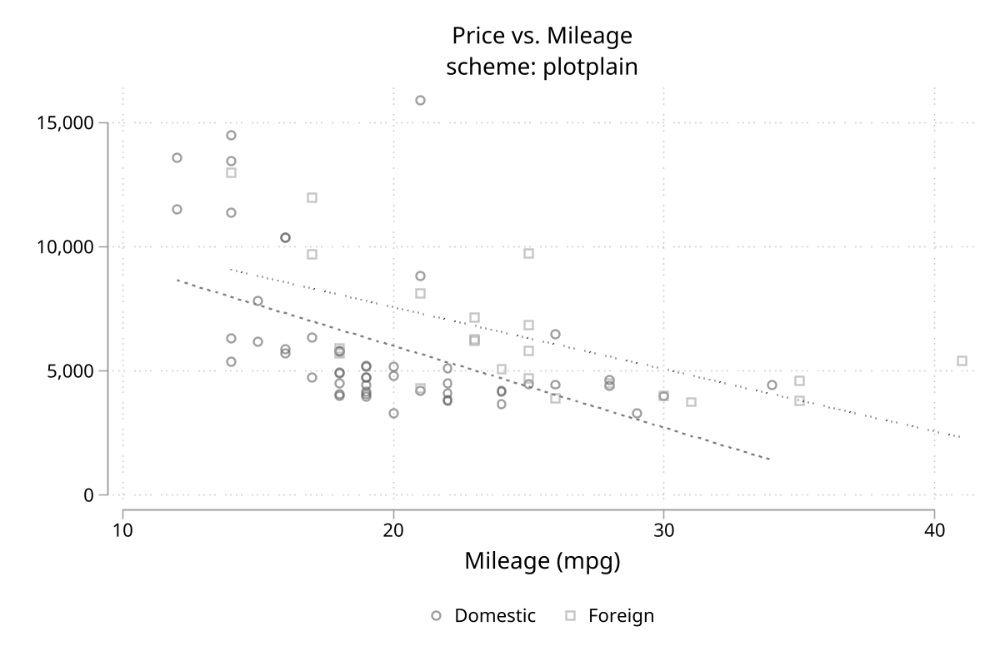
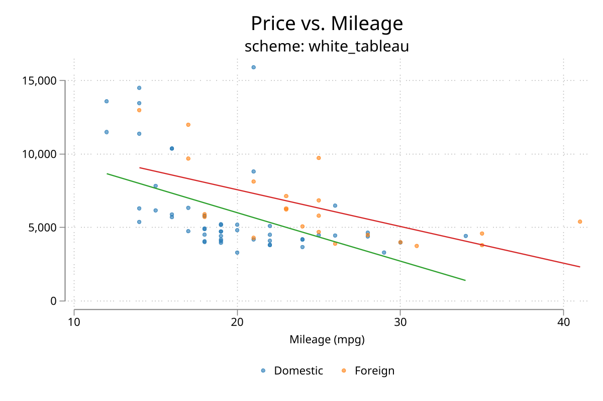
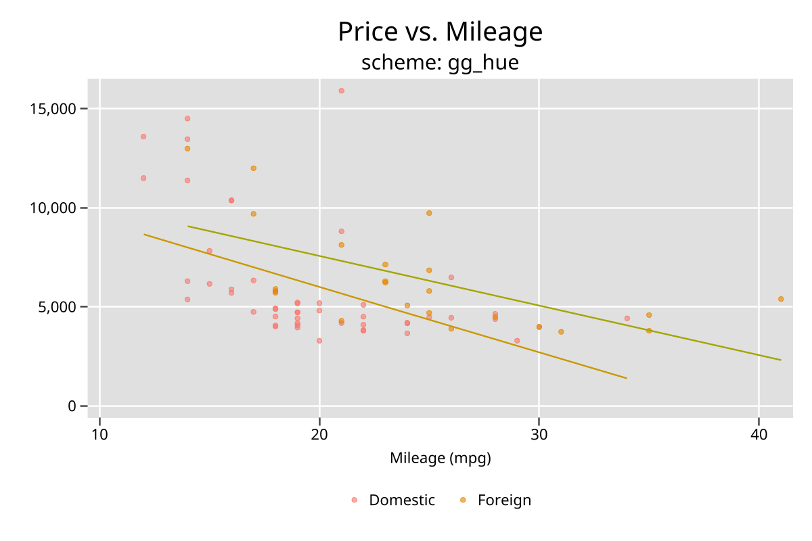
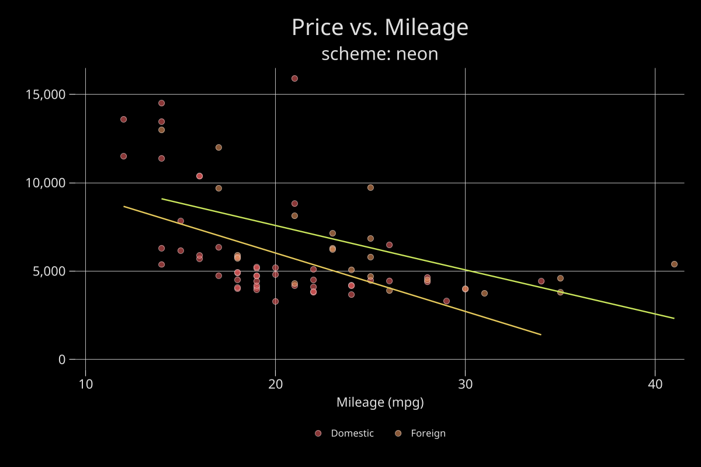
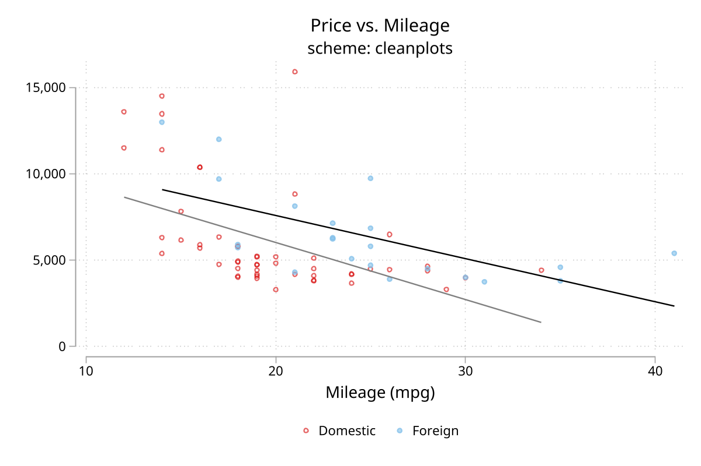
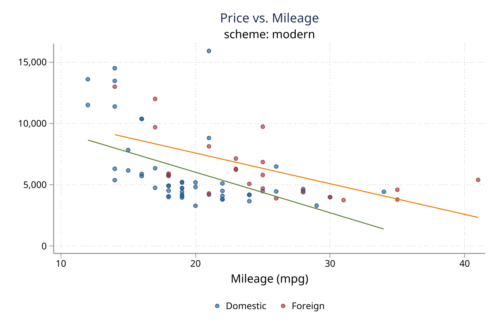
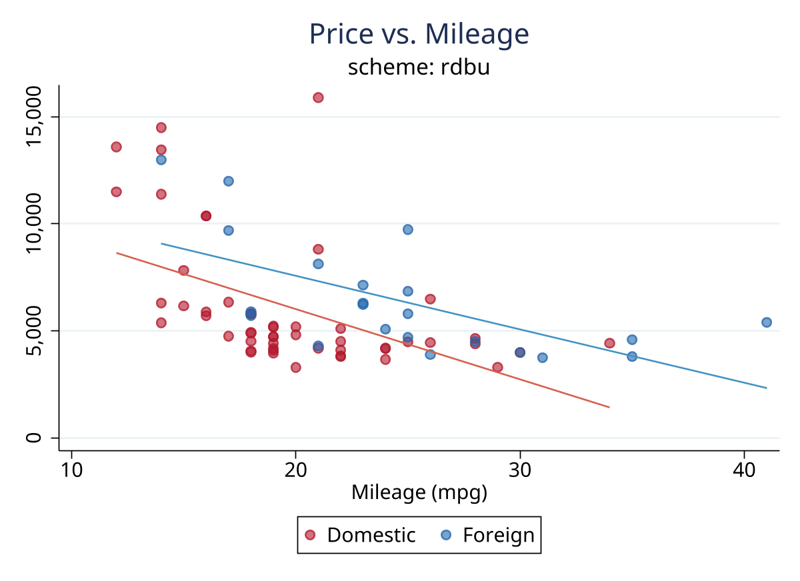
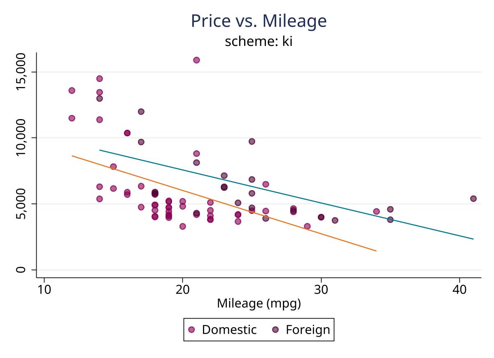
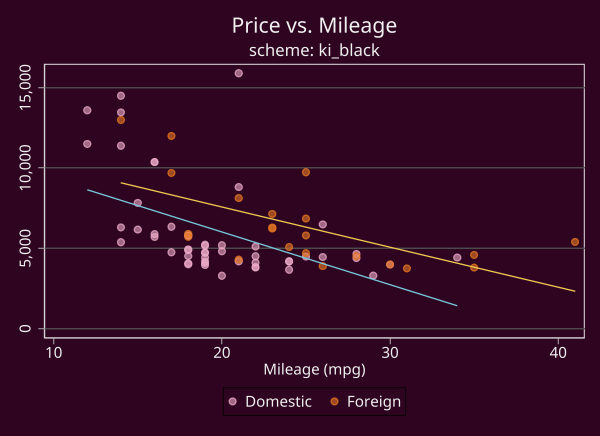

# tc_schemes - Consolidated graph schemes for Stata

**Version 1.1.0** | 2026-07-10

`tc_schemes` bundles publication-oriented graph schemes from Daniel Bischof's `blindschemes`, Mead Over's compatibility fixes, Asjad Naqvi's `schemepack`, Trenton Mize's `cleanplots`, and Michael Droste's `scheme-modern` into one installable package, plus original red-blue diverging (`rdbu`) and Karolinska Institutet (`ki`, `ki_black`) schemes. The wrapper command gives you a real Stata entry point, so `which tc_schemes` succeeds and project headers can check one package instead of juggling multiple upstream installs.

## Requirements

- Stata 16 or later

## Installation

```stata
capture ado uninstall tc_schemes
net install tc_schemes, from("https://raw.githubusercontent.com/tpcopeland/Stata-Tools/main/tc_schemes") replace
```

## Commands

| Command | Description |
|---------|-------------|
| `tc_schemes` | Browse the installed scheme catalog, filter by source family, and display either a compact list or detailed descriptions |

## Quick Start

```stata
tc_schemes
set scheme plotplain

sysuse auto, clear
scatter mpg weight
```

## How It Works

- Run `tc_schemes` with no options to see the organized catalog of available schemes.
- Use `source(blindschemes)` or `source(schemepack)` when you want to narrow the list to one upstream family.
- Use `list` for a compact machine-readable list or `detail` for human-readable descriptions. These two display modes are mutually exclusive.
- After browsing, either run `set scheme <name>` to change the session default or use `scheme(<name>)` on a single graph.

## Included Scheme Families

| Family | Count | Examples | Best for |
|--------|-------|----------|----------|
| `blindschemes` | 4 schemes | `plotplain`, `plotplainblind`, `plottig`, `plottigblind` | Clean publication figures and colorblind-safe defaults |
| `white_*`, `black_*`, `gg_*` series | 27 schemes | `white_tableau`, `black_cividis`, `gg_viridis` | Choosing a palette and a background style together |
| Standalone schemepack schemes | 8 schemes | `tab1`, `cblind1`, `ukraine`, `neon` | Distinctive one-off visual styles |
| `cleanplots` (Trenton Mize) | 1 scheme | `cleanplots` | Publication figures that read in both color and grayscale |
| `modern` (Michael Droste) | 2 schemes | `modern`, `modern_dark` | matplotlib-inspired modern defaults |
| tc_schemes originals | 3 schemes | `rdbu`, `ki`, `ki_black` | Red-blue diverging contrasts; Karolinska Institutet branding |
| Custom color styles | 21 styles | `vermillion`, `sky`, `turquoise`, `sea` | Accessible colors used by the bundled scheme families |

The package includes 45 graph schemes in total: 4 from `blindschemes`, 35 from `schemepack`, `cleanplots`, `modern`/`modern_dark`, and 3 originals (`rdbu`, `ki`, `ki_black`). The `cleanplots` and `modern` schemes are bundled with attribution; see [Acknowledgments](#acknowledgments).

## Worked Examples

### 1. Browse the catalog and filter by source

Use the catalog first when you want to see what is available before you commit to a scheme.

```stata
tc_schemes
tc_schemes, detail
tc_schemes, source(blindschemes) list
```

### 2. Set a global scheme for the current Stata session

After `set scheme`, subsequent graphs inherit that scheme until you change it again.

```stata
set scheme plotplain
sysuse auto, clear
scatter mpg weight, ///
    title("Fuel Economy by Vehicle Weight") ///
    xtitle("Weight") ytitle("Miles per gallon")
```

### 3. Apply a scheme to one graph without changing the session default

This is the safer workflow when you want to compare different looks side by side.

```stata
sysuse auto, clear
scatter mpg weight, scheme(white_tableau) ///
    title("Single-graph scheme override")
```

### 4. Compare two schemes visually

Because the schemes are installed locally, you can render the same graph under two visual systems and combine them in one figure.

```stata
sysuse auto, clear
scatter mpg weight, scheme(plotplain) name(g1, replace)
scatter mpg weight, scheme(gg_viridis) name(g2, replace)
graph combine g1 g2
```

### 5. Use `which tc_schemes` as an installation check in project headers

This is one of the main reasons the wrapper command exists.

```stata
capture which tc_schemes
if _rc != 0 {
    capture ado uninstall tc_schemes
    net install tc_schemes, from("https://raw.githubusercontent.com/tpcopeland/Stata-Tools/main/tc_schemes") replace
}
```

## Gallery

### plotplain



### white_tableau



### gg_hue



### neon



### cleanplots



### modern



### rdbu



### ki



### ki_black



## Acknowledgments

- Daniel Bischof created the original `blindschemes` package and its publication-oriented, accessibility-aware visual style.
- Mead Over supplied `blindschemes_fix`, which resolved compatibility issues with recent Stata versions.
- Asjad Naqvi created `schemepack`, which contributes the larger palette-and-background scheme families collected here.
- Trenton D. Mize (Purdue University) created `cleanplots`. The `cleanplots` scheme is bundled here **unmodified, with attribution**; it remains the property of its author. Source: <https://www.trentonmize.com/software/cleanplots>.
- Michael Droste created `scheme-modern`. The `modern` and `modern_dark` schemes are bundled here **unmodified, with attribution**; they remain the property of their author. Source: <https://github.com/mdroste/stata-scheme-modern>.
- The `rdbu` scheme uses ColorBrewer colors (Cynthia Brewer, <https://colorbrewer2.org>). The `ki` and `ki_black` schemes use Karolinska Institutet brand colors (KI plum, RGB 135 0 82).

Wrapper code and the original `rdbu`, `ki`, and `ki_black` schemes are distributed under MIT. Bundled third-party schemes (`cleanplots`, `modern`, `modern_dark`) and the upstream `blindschemes`/`schemepack` files retain their original licensing and attribution; they are redistributed as a convenience and remain the property of their respective authors.

## Version History

- **1.1.0** (2026-06-28): Added six schemes (45 total). Bundled `cleanplots` (Trenton Mize) and `modern`/`modern_dark` (Michael Droste) with attribution, and added original `rdbu` (red-blue diverging), `ki`, and `ki_black` (Karolinska Institutet branded) schemes. New `source()` filters: `cleanplots`, `modern`, `tc`.
- **1.0.0** (2026-04-08): Initial Stata-Tools release consolidating `blindschemes`, `blindschemes_fix`, and `schemepack` under one installable catalog command

## Author

Timothy P Copeland, Karolinska Institutet

## License

MIT for the wrapper command. Original scheme files retain their original licenses and attribution.
